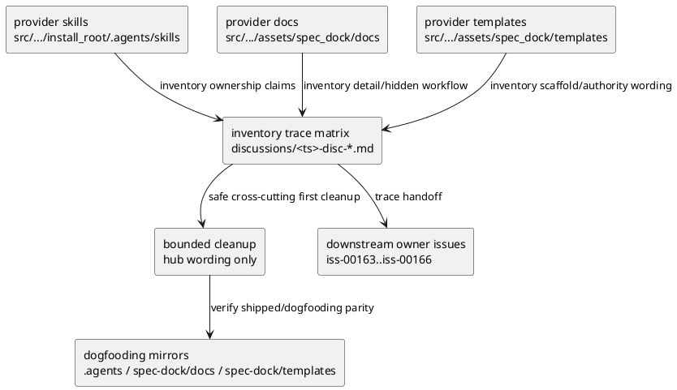

# iss-00162 Align Skill Docs Template Context Surfaces — 設計

## 目的・制約

この issue は、後続 issue が同じ skill/docs/templates boundary で進められるように、provider-side context surfaces の inventory / trace matrix を作り、最小限の first cleanup を行う。

実装は inventory artifact と priority wording cleanup に限定する。`spec-dock-clarification`、hub routing、workflow docs 全体、templates 全体の rewrite は後続 owner issue へ渡す。

## 既存実装 / 規約の理解

- Provider skill source:
  - `src/spec_dock/assets/install_root/.agents/skills/`
- Provider docs source:
  - `src/spec_dock/assets/spec_dock/docs/`
- Provider templates source:
  - `src/spec_dock/assets/spec_dock/templates/`
- Dogfooding verification surface:
  - `.agents/skills/`
  - `spec-dock/docs/`
  - `spec-dock/templates/`
- 現状の代表的な tension:
  - `spec-driven-tdd-workflow` still says skills stay concise and docs are source of truth, which can conflict with the Epic ADR that workflow spine belongs in skills.
  - `spec-dock-clarification` says `workflow_clarification.md` is the source of truth; this is intentionally owned by `iss-00163`.
  - templates contain scaffold language and some authority examples; global template consistency is owned by `iss-00166`.
  - docs carry detailed workflow semantics; global docs boundary alignment is owned by `iss-00165`.

## 採用方針 / トレードオフ

- 採用:
  - Create a scope-local discussion inventory / trace matrix under `discussions/`.
  - Classify each relevant surface as `skill-owned spine`, `docs-owned detail`, `template-owned scaffold`, `bridge/reference`, or `non-specdock operational`.
  - Add priority cleanup only where it is safe and cross-cutting: hub-level wording that currently contradicts the Epic boundary and is not owned by a later issue's detailed rewrite.
  - Record downstream handoff rows for `iss-00163`, `iss-00164`, `iss-00165`, and `iss-00166`.
- 採用しない:
  - Do not rewrite `spec-dock-clarification` workflow in this issue.
  - Do not rewrite all workflow docs in this issue.
  - Do not rewrite all templates in this issue.
  - Do not add runtime enforcement or regression harness.

## 依存関係分析

- Upstream:
  - `iss-00159` completed the issue-planning specimen.
  - Epic ADRs define the desired ownership boundary.
- Sibling/downstream:
  - `iss-00163`: `spec-dock-clarification` skill-owned grill workflow.
  - `iss-00164`: hub / leaf routing wording.
  - `iss-00165`: workflow docs boundary alignment.
  - `iss-00166`: template scaffold/example consistency.
- Implementation dependency:
  - Inventory first, then bounded hub wording cleanup, then dogfooding mirror verification.

## モジュール依存図（Module Dependency Diagram）

Title: Context surface ownership inventory flow

Question answered: どの surface を正本として inventory し、どこへ cleanup / handoff するか。

Scope: provider skills/docs/templates and dogfooding mirrors.

Excluded details: individual downstream rewrites owned by `iss-00163` through `iss-00166`.

Update trigger: ownership categories, source-of-truth directories, or downstream issue split changes.



## インターフェース契約

### Inventory / Trace Matrix

The discussion artifact must include:

- surface path
- surface family: skill / docs / templates
- current ownership claim
- target ownership category
- contradiction / risk
- owner issue
- action in this issue
- action deferred
- evidence / verification path

### Bounded First Cleanup

Allowed cleanup is limited to wording that:

- is cross-cutting and blocks a coherent boundary reading,
- does not implement the detailed rewrite assigned to a downstream issue,
- can be mirrored or verified in the dogfooding surface,
- is traceable to the matrix.

Expected first cleanup target:

- `spec-driven-tdd-workflow/SKILL.md` provider and dogfooding mirror wording that says skills are concise and docs own workflow explanations. It should be softened to: skills carry first-read workflow spine and route to docs for details.

Forbidden cleanup targets in this issue:

- Route table changes in `spec-driven-tdd-workflow/SKILL.md`.
- Clarification routing changes in `spec-driven-tdd-workflow/SKILL.md`.
- Leaf skill ownership restructuring in `spec-driven-tdd-workflow/SKILL.md`.
- Any broader hub / leaf rewrite that belongs to `iss-00164`.
- `spec-dock-clarification/SKILL.md` detailed rewrite.
- `workflow_clarification.md` bridge rewrite.
- workflow docs global rewrite.
- template global rewrite.

## ディレクトリ / ファイル変更計画

```text
.
|-- src/
|   `-- spec_dock/
|       `-- assets/
|           |-- install_root/
|           |   `-- .agents/
|           |       `-- skills/
|           |           `-- spec-driven-tdd-workflow/
|           |               `-- SKILL.md       # 変更: hub wording first cleanup
|           |-- spec_dock/
|           |   |-- docs/                      # 読取: inventory対象
|           |   `-- templates/                 # 読取: inventory対象
|-- .agents/
|   `-- skills/
|       `-- spec-driven-tdd-workflow/
|           `-- SKILL.md                       # 変更: dogfooding mirror
`-- spec-dock/
    `-- active/
        `-- issue/
            |-- discussions/
            |   `-- <ts>-disc-context-surface-inventory.md
            |-- requirement.md
            |-- design.md
            |-- plan.md
            `-- report.md
```

## 要件 → 設計マッピング

- AC-001 -> Inventory / Trace Matrix.
- AC-002 -> Matrix owner issue / action columns and bounded first cleanup.
- AC-003 -> `spec-driven-tdd-workflow` wording cleanup plus manual first-read inspection.
- AC-004 -> provider/mirror verification for changed skill.
- AC-005 -> downstream owner issue handoff rows.
- EC-001 -> report split/follow-up rule if inventory is too broad.
- EC-002 -> docs hidden workflow classification and downstream handoff.
- EC-003 -> template authority classification and `iss-00166` handoff.

## テスト戦略

- Inventory completeness:
  - `find` / `rg --files` over provider skills, docs, templates.
  - Manual inspection of matrix coverage.
- Cleanup inspection:
  - `rg` for hub wording around skill/docs/templates ownership.
  - Manual first-read inspection of changed hub skill wording.
- Provider/mirror parity:
  - `cmp -s src/spec_dock/assets/install_root/.agents/skills/spec-driven-tdd-workflow/SKILL.md .agents/skills/spec-driven-tdd-workflow/SKILL.md`
  - existing checked-in dogfooding parity test if appropriate:
    - `python -m unittest tests.test_init_update.TestInitUpdate.test_issue_71_checked_in_dogfooding_agent_tooling_parity_matches_install_root_assets`
  - `./spec-dock/scripts/spec-dock sync` after provider/mirror updates to refresh dogfooding projections and derived views.
- Repository hygiene:
  - `./spec-dock/scripts/spec-dock validate`
  - `git diff --check`

## リスク / ロールバック

- リスク:
  - Inventory が広くなりすぎる。
  - First cleanup が downstream rewrite を侵食する。
  - Discussion matrix が canonical authority のように読まれる。
- 緩和:
  - Matrix は evidence / handoff artifact とし、canonical decision は requirement/design/plan/report に残す。
  - First cleanup は hub wording の cross-cutting contradiction に限定する。
  - Downstream issue ownershipを matrix に明示する。
- ロールバック:
  - Changed hub skill files and discussion matrix can be reverted without runtime migration. Runtime behavior is unchanged.

## 未確定事項

- なし。ユーザー確認が必要な scope / acceptance ambiguity は現時点ではない。
