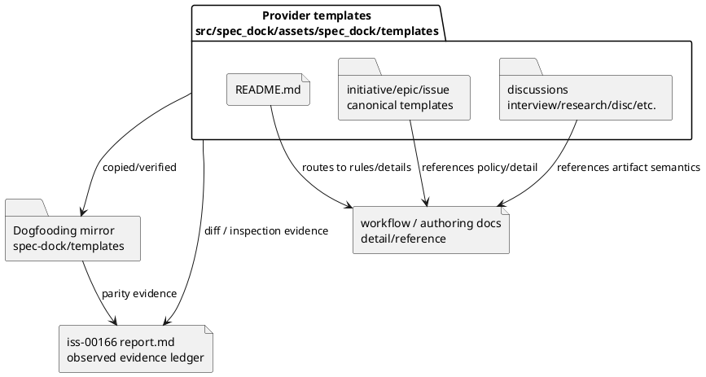

# iss-00166 Align Templates As Scaffolds And Examples — 設計

## 親図（Diagram）参照

- Epic 図:
  - `epic-00158` design の `context-surface authority model`。
- 再利用する決定:
  - Skills own operational workflow spine.
  - Docs own detail / reference semantics.
  - Templates own scaffold / evidence slots / examples.
  - Discussion and external outputs remain evidence until main orchestrator adoption.
  - Provider-side source is shipped asset authority; dogfooding mirror is verification target.

## 目的・制約

- 目的:
  - Provider templates and dogfooding mirror templates should consistently read as starting scaffolds, evidence slots, and examples, not workflow / compliance authority.
- 必須:
  - Report templates across Initiative / Epic / Issue preserve EAL, delegated evidence, spec authoring gate, reviewer state, blocking / next action, and final/closure evidence slots.
  - Issue plan template remains an executable step scaffold while routing detailed policy / field semantics to skills/docs.
  - Discussion templates support source-grounded clarification, research, synthesis, and adoption reflection.
  - Provider/mirror parity is verifiable after changes.
- 禁止:
  - Skill/doc policy rewrites.
  - Runtime/test/CLI changes.
  - Moving docs-owned detailed semantics into templates.
  - Treating template placeholders as completion evidence.

## 既存実装 / 規約の理解

- 参照した実装 / docs:
  - `src/spec_dock/assets/spec_dock/templates/README.md`
  - `src/spec_dock/assets/spec_dock/templates/{initiative,epic,issue}/report.md`
  - `src/spec_dock/assets/spec_dock/templates/issue/plan.md`
  - `src/spec_dock/assets/spec_dock/templates/discussions/{interview,research,disc,scratch,adr}.md`
  - `spec-dock/templates/...` mirror equivalents.
  - `spec-dock/docs/workflow_spec_authoring.md`
  - `spec-dock/docs/workflow_issue.md`
  - `spec-dock/docs/authoring/issue-plan.md`
- 現状理解:
  - Many templates already include useful scaffold disclaimers and non-authority wording.
  - Some stale authority wording remains, especially `正本` / `source of truth` in template README / issue plan / epic design.
  - Report templates are intentionally rich because they provide evidence slots; this richness should stay, but wording must emphasize observed evidence and policy references instead of template-owned authority.
  - Initiative / Epic report templates are less execution-heavy than Issue report, but they share EAL / Spec Authoring Gate / Delegated Draft Evidence and must be included in AC-003.
- 採用するパターン:
  - Use minimal top-of-file / section-level wording changes where a stale authority claim appears.
  - Preserve existing tables and slots unless they directly create authority confusion.
  - Mirror provider changes in `spec-dock/templates/` for dogfooding verification.
- 採用しないもの:
  - Wholesale template rewrite.
  - New runtime checks or tests.
  - New template files.

## 採用方針 / トレードオフ

- 論点:
  - Template text can be too thin and fail to guide agents, or too detailed and become policy authority.
- 決定:
  - Keep template fields / slots intact and add/adjust boundary wording around authority, references, and placeholder status.
- 根拠:
  - Requirement EC-001 and EC-002 require avoiding over-explaining while preserving evidence slots.
  - Epic E-RQ-001 assigns templates to scaffold / evidence slots / good examples only.

## 依存関係分析

- file 依存:
  - Provider templates under `src/spec_dock/assets/spec_dock/templates/` are source of truth.
  - Dogfooding mirror templates under `spec-dock/templates/` must match provider changes.
  - Report evidence records planning / execution / review results.
- 上流 / 前提:
  - `iss-00163`, `iss-00164`, `iss-00165` are completed.
  - Requirement reviewer passed after report templates were added to AC-003.
- 下流 / 依存先:
  - Epic final PR will use this issue as the last first-wave template lane.
- 実装起点:
  - S01 should first align template README and canonical artifact templates because they define generated template expectations.
  - S02 should align discussion templates because they support clarification / evidence flows.
  - S90 should validate provider/mirror parity and generated projections.
- 順序への影響:
  - Report / plan wording changes should precede discussion-template smoke because discussion templates route evidence into report ledgers.

## モジュール依存図（Module Dependency Diagram）

- タイトル:
  - Template surface ownership and verification flow.
- 答える問い:
  - Which template families are source, mirror, and evidence surfaces for this issue?
- 範囲:
  - Provider templates, dogfooding templates, docs references, report evidence.
- 含めない詳細:
  - Runtime command internals, full markdown schema, Python package imports.
- 更新条件:
  - Template family ownership or provider/mirror authority changes.



## ディレクトリ / ファイル変更計画

```text
.
|-- src/spec_dock/assets/spec_dock/templates/
|   |-- README.md                         # 変更: template boundary / authority wording
|   |-- initiative/
|   |   `-- report.md                     # 変更候補: report evidence-slot boundary if needed
|   |-- epic/
|   |   |-- design.md                     # 変更候補: stale source-of-truth wording if needed
|   |   `-- report.md                     # 変更候補: report evidence-slot boundary if needed
|   |-- issue/
|   |   |-- plan.md                       # 変更: plan scaffold / docs detail-reference wording
|   |   `-- report.md                     # 変更: observed evidence ledger / authority wording if needed
|   `-- discussions/
|       |-- interview.md                  # 変更候補: source-grounded one-question / adoption reflection wording
|       |-- research.md                   # 変更候補: facts/inference/question candidates wording
|       `-- disc.md                       # 変更候補: synthesis/adoption target wording
|-- spec-dock/templates/                  # dogfooding mirror equivalents; verification target
`-- spec-dock/active/issue/report.md      # 変更: observed evidence only
```

- Non-target unless inspection finds direct stale authority wording:
  - canonical requirement/design/plan templates other than listed paths.
  - `scratch.md` and `adr.md`, which already have explicit non-authority / ADR criteria wording.

## 要件 → 設計マッピング

- AC-001 -> Template README and canonical templates boundary wording.
- AC-002 -> Discussion templates `interview` / `research` / `disc`.
- AC-003 -> Initiative / Epic / Issue report templates.
- AC-004 -> Issue plan template.
- AC-005 -> Provider/mirror parity and sync/validate evidence.
- AC-006 -> Scope guard against skills/docs/runtime/tests/GitHub metadata changes.
- EC-001 -> Minimal wording changes; keep detailed semantics in docs.
- EC-002 -> Preserve or add evidence slots without authority claims.
- EC-003 -> Negative stale-authority wording search.

## テスト戦略

- Automated unit tests:
  - Not required for docs/templates-only wording unless runtime rendering changes.
- Inspect-only checks:
  - Targeted `rg` for positive scaffold/evidence/example/detail-reference wording.
  - Negative `rg` for stale `正本` / `source of truth` template authority wording in changed templates.
  - `git diff --name-only` scope guard.
  - `git diff --check`.
  - Provider/mirror `diff -q` for changed template pairs.
- Spec review:
  - Fresh `spec-reviewer` after planning artifacts.
  - Step-level `spec-reviewer` for docs/templates-only changes.
  - Final QA/code/spec review before issue finish.

## 要件 / 例外 -> 検証マッピング

- AC-001:
  - `rg -n "scaffold|evidence slot|good example|detail/reference|template-owned"` on changed provider/mirror templates.
- AC-002:
  - Inspect `interview`, `research`, `disc` templates after changes.
- AC-003:
  - Inspect `initiative/report.md`, `epic/report.md`, `issue/report.md` after changes.
- AC-004:
  - Inspect `issue/plan.md` after changes.
- AC-005:
  - `diff -q` provider/mirror pairs, `validate`, `sync`.
- AC-006:
  - `git diff --name-only` allowlist.
- EC-001:
  - Diff inspection confirms no wholesale policy copy into templates.
- EC-002:
  - Report/discussion evidence slots remain present.
- EC-003:
  - Negative `rg` confirms stale authority wording removed or justified.

## リスク / 移行 / ロールバック

- Risk:
  - Over-thinning templates could remove helpful evidence slots.
  - Over-expanding templates could reintroduce hidden workflow authority.
  - Provider/mirror mismatch could ship stale templates to dogfooding workspace.
- Mitigation:
  - Preserve slots and tables; change boundary wording narrowly.
  - Use provider/mirror parity checks and step review.
  - Record no-op rationale for templates inspected but not changed.
- Rollback:
  - Revert provider template wording changes and mirror updates together; rerun parity / validate.

## 未確定事項

- Blocking question:
  - なし。
- Non-blocking implementation choice:
  - Exact wording and whether some already-aligned templates remain no-op is decided by S01/S02 inspection and recorded in `report.md`.
