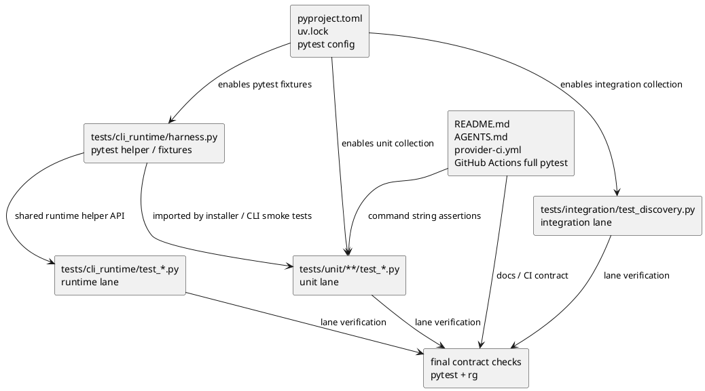

# iss-00167 Migrate Tests To Pytest — 設計（どう実現するか）

## 親図（Diagram）参照
- Epic 図:
  - N/A: 親 Epic は skill / docs / templates context-surface hardening を中心にしており、本 Issue の局所設計は test runner / test implementation infrastructure に閉じる。
- Initiative 図:
  - N/A: product runtime architecture は変更しない。
- 再利用する決定:
  - `epic-00158/plan.md` の deferred regression / harness / runtime gate 境界を維持する。
  - 本 Issue は後段 testing / regression infrastructure lane であり、first-wave skill / docs / templates cleanup を置き換えない。
  - Requirement fresh re-review は `review_status: pass` 済みであり、design は `requirement.md` の AC-001..AC-009 を source of truth とする。

## 目的・制約
- 目的:
  - pytest を唯一の標準 runner / assertion / fixture / CI / docs contract にする。
  - `iss-00160` 後の `tests/unit` / `tests/integration` / `tests/cli_runtime` lane を維持し、旧 layout へ戻さない。
  - 既存テストの失敗検出力、hermeticity、runtime / CLI subprocess coverage を維持する。
- 必須:
  - `uv run pytest tests/unit`
  - `uv run pytest tests/integration`
  - `uv run pytest tests/cli_runtime`
  - `uv run pytest`
  - GitHub Actions / provider CI runs `uv run pytest` and therefore executes all pytest-collected tests.
  - `rg` による unittest framework dependency absence check。
- 禁止:
  - pytest が `unittest.TestCase` を収集できる互換性を完了条件にする。
  - official fallback として `python -m unittest discover` を残す。
  - test deletion、weak assert、skip / xfail 濫用で migration を通す。
- 非交渉制約:
  - Python 3.10+、hermetic temp directory / gh stub pattern、provider-side source / dogfooding boundary を維持する。
  - Runtime / CLI public behavior を変更しない。
- 前提:
  - `iss-00160` merge 後の current test topology を正とする。

## 既存実装 / 規約の理解
- 参照した実装 / docs:
  - `pyproject.toml`
  - `README.md`
  - `AGENTS.md`
  - `.github/workflows/provider-ci.yml`
  - `tests/cli_runtime/harness.py`
  - `tests/unit/**/test_*.py`
  - `tests/integration/test_discovery.py`
  - `tests/cli_runtime/test_*.py`
  - `spec-dock/active/issue/discussions/20260606t045218z-disc-pytest-complete-migration-design-proposal.md`
- 現状理解:
  - `pyproject.toml` は runtime dependency のみを持ち、pytest / pytest config は未導入。
  - README / AGENTS / provider CI は `python -m unittest discover` を標準入口としている。
  - `tests/cli_runtime/harness.py` は `CliRuntimeHarness(unittest.TestCase)` を中心に、runtime command execution、temporary target repo、git / gh stub、assert helper を多数の runtime tests へ供給している。
  - `tests/unit` に移動済みの大きな tests も、`unittest.mock.patch`、`self.assert*`、`unittest.main()`、`CliRuntimeHarness` 依存を持つ。
  - `tests/integration` は package marker smoke のみだが、pytest lane として collection / execution 対象に残す。
- 採用するパターン:
  - lane 単位の pytest command を design / plan / docs / CI の共通 contract とする。
  - `tests/cli_runtime` は shared harness から外側へ移行する。
  - fixture は必要な scope に近く置き、共有価値がある場合だけ `conftest.py` を追加する。
- 採用しないもの:
  - `self.assert*` 互換 helper の大量導入。
  - pytest-xdist / coverage / hypothesis など plugin 拡張。
  - provider CI を unit-only のまま残すこと。
- 影響範囲:
  - test dependency / lock
  - pytest config
  - provider CI full-suite job
  - README / AGENTS
  - `tests/unit`, `tests/integration`, `tests/cli_runtime`

## 採用方針 / トレードオフ
- D-001: pytest dependency は `dependency-groups.dev` に置く。
  - project dependency は runtime package 利用者にも pytest を配るため却下。
  - optional extra は `uv run pytest` 標準 command とずれやすいため却下。
  - dependency group `dev` は local `uv run pytest` と lock contract に自然に乗るため採用。
  - `[dependency-groups] dev = ["pytest>=8.0"]` を追加する。
- D-002: provider CI は pytest full suite を実行する。
  - ユーザー意図は GitHub Actions で全テストを実行することであるため、unit-only CI は不採用にする。
  - provider CI は `uv run pytest` を実行し、pytest collection 対象の `tests/unit`、`tests/integration`、`tests/cli_runtime` をすべて含める。
  - GitHub Actions matrix / Python version policy の拡張は対象外であり、runner command scope のみを full suite へ変える。
- D-003: `unittest` imports はすべて migration target とする。
  - `unittest.mock` も含めて `unittest` import を残さない。
  - patching は `monkeypatch`、direct fake / stub、context manager、pytest fixture へ置き換える。
- D-004: harness-first で変換する。
  - `CliRuntimeHarness(unittest.TestCase)` を pytest-native helper / fixture boundary へ変換してから、依存する runtime tests を移行する。
  - Unit-only tests は helper 依存が軽い group から進め、巨大な `tests/unit/infra/test_init_update.py` は後半の dedicated step に回す。

## 依存関係分析
- module 依存:
  - `pyproject.toml` / `uv.lock` -> pytest executable availability -> all pytest lane verification.
  - `tests/cli_runtime/harness.py` -> `tests/cli_runtime/test_*.py` and some unit smoke / installer tests.
  - README / AGENTS / provider CI full-suite command strings -> tests that assert docs / CI contents.
- file 依存:
  - `tests/unit/infra/test_init_update.py` imports `CliRuntimeHarness`, `main`, and uses `unittest.mock.patch`; it is large and should not be mixed with lightweight unit group conversion.
  - `tests/integration/test_discovery.py` is independent and can migrate after pytest conventions are established.
- 上流 / 前提:
  - Requirement pass.
  - pytest dependency / config.
- 下流 / 依存先:
  - docs / CI command update.
  - full grep absence check.
  - full pytest regression.
- 実装起点:
  - `pyproject.toml` / `uv.lock` / pytest collection config。
  - Then `tests/cli_runtime/harness.py` helper boundary。
- 順序への影響:
  - plan は dependency/config -> harness -> runtime tests -> unit groups -> integration -> unittest absence cleanup -> docs/CI full-suite cutover -> final full checks の順を基本にする。

## モジュール依存図（Module Dependency Diagram）
- タイトル:
  - Pytest migration dependency order.
- 答える問い:
  - pytest complete migration でどの contract を先に固定し、どの test lane がそれに依存するか。
- 範囲:
  - test runner config、shared harness、test lanes、docs / CI contract。
- 含めない詳細:
  - 個別 test method、runtime command internals、product CLI sequence。
- 更新条件:
  - dependency group policy、CI scope、test lane boundary、harness ownership が変わるとき。



## ローカル図の差分（Local Diagram Delta）
- 変更する境界 / 責務 / 相互作用:
  - Test runner boundary が `unittest` から `pytest` へ移る。
  - Product runtime / CLI interaction は変更しない。

## インターフェース契約
- Test runner / dependency:
  - `uv run pytest --version`
  - `uv run pytest --collect-only`
  - `uv run pytest tests/unit`
  - `uv run pytest tests/integration`
  - `uv run pytest tests/cli_runtime`
  - `uv run pytest`
- Pytest config:
  - `testpaths = ["tests"]` を基本にする。
  - 必要な場合だけ `python_files` / `python_classes` / `python_functions` を明示する。
  - Collection 誤爆を避けるため、fixtures / wheelhouse / pycache は pytest default ignore と config で確認する。
- Test implementation:
  - Tests are plain pytest functions/classes without `unittest.TestCase` inheritance.
  - Assertions use plain `assert`.
  - Exceptions use `pytest.raises(..., match=...)`.
  - Multiple cases use `pytest.mark.parametrize` or explicit assertion messages.
  - Skips use `pytest.skip` or pytest marks.
  - Patching uses `monkeypatch`, local fake/stub objects, or pytest fixtures; no `unittest.mock` import remains.
- Provider CI / GitHub Actions:
  - Install / setup must make `uv run pytest` executable.
  - CI must run all pytest-collected tests, not only `tests/unit`.
  - CI must not keep `python -m unittest discover` as a fallback or parallel official path.

## シーケンス差分（Sequence Delta）
- 変更する相互作用:
  - Local / CI test invocation only.
- retry / transaction / external API / queue:
  - N/A: product runtime interaction and external API usage do not change.
- UML:
  - N/A: module dependency diagram is sufficient.

## ドメインモデル差分（Domain Model Delta）
- 親 model 参照:
  - N/A.
- aggregate / entity / value object 変更:
  - N/A.
- domain event / policy / specification 変更:
  - N/A.
- 不変条件の変更:
  - Product invariants do not change.
- UML:
  - N/A: no product domain model change.

## クラス / インターフェース詳細設計
- Class / Interface:
  - `CliRuntimeHarness` should stop being a `unittest.TestCase` base class and become pytest-native helper functions / fixtures.
- 責務:
  - Maintain target repo creation, runtime invocation, git / gh stubs, environment isolation, and subprocess result helpers.
  - Provide assertion-friendly helper outputs rather than `self.assert*` calls where practical.
- 連携:
  - `tests/cli_runtime/conftest.py` may expose fixtures for runtime target repo and helper object only if this reduces repeated setup across many runtime tests.
  - `tests/unit/conftest.py` may expose shared import / temp helpers only if multiple unit modules use them.
- UML:
  - N/A: helper API will be validated by migrated tests rather than a stable production class contract.

## ディレクトリ / ファイル変更計画

```text
.
|-- pyproject.toml                         # 変更: dependency-groups.dev に pytest、pytest config
|-- uv.lock                                # 変更: pytest dependency resolution
|-- .github/
|   `-- workflows/
|       `-- provider-ci.yml                # 変更: provider test job を uv run pytest full suite へ
|-- README.md                              # 変更: Testing commands を pytest lane へ
|-- AGENTS.md                              # 変更: Build/Test and Testing Guidelines を pytest/current layout へ
`-- tests/
    |-- conftest.py                        # 追加候補: project-wide pytest fixture が明確な場合のみ
    |-- unit/
    |   |-- conftest.py                    # 追加候補: unit shared fixture が明確な場合のみ
    |   |-- application/
    |   |-- cli/
    |   |-- commands/
    |   |-- domain/
    |   |-- infra/
    |   `-- presentation/                  # 変更: unittest API を pytest idiom へ
    |-- integration/
    |   `-- test_discovery.py              # 変更: pytest function / parametrize へ
    `-- cli_runtime/
        |-- conftest.py                    # 追加候補: runtime shared fixtures
        |-- harness.py                     # 変更: pytest-native helper boundary
        `-- test_*.py                      # 変更: TestCase subclass / self.assert / unittest skip を除去
```

## 要件 → 設計マッピング
- AC-001 -> D-001, pytest config, `uv run pytest --collect-only`.
- AC-002 -> Provider CI / GitHub Actions full pytest contract, `uv run pytest`.
- AC-003 -> Integration lane contract, `uv run pytest tests/integration`.
- AC-004 -> Harness-first runtime lane migration, `uv run pytest tests/cli_runtime`.
- AC-005 -> Full fallback contract, `uv run pytest`.
- AC-006 -> All `unittest` imports / APIs forbidden; pytest idiom contract.
- AC-007 -> README / AGENTS / provider CI / command-string tests updated after command contract finalization.
- AC-008 -> Test intent preservation, no deletion / weak assert, QA review focus.
- AC-009 -> Parent Epic trace section and non-first-wave positioning preserved.
- EC-001 -> pytest collect-only and config.
- EC-002 -> `pytest.mark.parametrize`.
- EC-003 -> `pytest.raises(..., match=...)`.
- EC-004 -> `monkeypatch`, fixtures, `tmp_path`.
- EC-005 -> Full runtime lane verifies but optimization out of scope.
- EC-006 -> Empty old dirs / pycache touched only if collection / docs / grep evidence requires.
- EC-007 -> command-string tests included with docs/CI updates.

## テスト戦略
- Baseline / Red:
  - Record current absence of pytest dependency/config.
  - Record current `rg` output for unittest framework dependency.
  - If possible, show `uv run pytest --collect-only` fails or cannot run before dependency/config.
- Green by slice:
  - Dependency/config: `uv run pytest --version`; `uv run pytest --collect-only`.
  - Runtime harness: focused pytest collection / a small runtime test subset.
  - Runtime lane: `uv run pytest tests/cli_runtime`.
  - Unit groups: focused `uv run pytest tests/unit/<group>` then `uv run pytest tests/unit`.
  - Integration: `uv run pytest tests/integration`.
  - Docs / CI: docs inspection, command string tests, provider CI workflow inspection, and local `uv run pytest` equivalence.
  - Final: `uv run pytest`; `rg` absence checks.
- QA review focus:
  - Assertion strength preserved.
  - No live network / credentialed dependency introduced.
  - No unsupported unittest fallback remains.

## 要件 / 例外 -> 検証マッピング
- AC-001 / EC-001:
  - `uv run pytest --collect-only`.
- AC-002:
  - `uv run pytest`; `.github/workflows/provider-ci.yml` inspection.
- AC-003:
  - `uv run pytest tests/integration`.
- AC-004:
  - `uv run pytest tests/cli_runtime`.
- AC-005:
  - `uv run pytest`.
- AC-006:
  - `rg -n "unittest|self\\.assert|assertRaises|subTest|unittest\\.main|from unittest|import unittest" tests`.
- AC-007 / EC-007:
  - `rg -n "unittest discover|Framework: `unittest`|tests/test_cli.py|tests/test_init_update.py" README.md AGENTS.md .github/workflows tests`.
- AC-008:
  - git diff inspection, qa-reviewer final gate.
- AC-009:
  - spec-reviewer design / final spec review checks parent trace.

## リスク / 移行 / ロールバック
- リスク:
  - Large mechanical conversion can weaken assertions.
  - `tests/cli_runtime` migration is coupled to shared harness behavior.
  - CI full-suite command and local full-suite command can drift if dependency setup is unclear.
  - Full pytest suite may be slow; this must not lead to skipping tests.
- 移行:
  - Official runner contract uses a hard cutover to pytest.
  - Implementation sequence still keeps lane-level green checks so failures remain local.
  - `unittest` grep absence is a final contract check.
- ロールバック:
  - Dependency/config can be reverted first if pytest resolution fails.
  - Harness migration should stop before downstream test migration if helper boundary cannot be stabilized.
  - If docs / CI are updated before full tests pass, revert docs / CI alongside test migration rather than leaving contradictory contracts.

## 未確定事項
- Blocking question:
  - なし。
- Design decisions fixed here:
  - pytest dependency source: `dependency-groups.dev`.
  - `unittest.mock`: forbidden with other `unittest` imports.
  - provider CI scope: full pytest suite via `uv run pytest`.
- Plan-level details:
  - Exact step split for large files, especially `tests/unit/infra/test_init_update.py`, belongs in `plan.md`.
