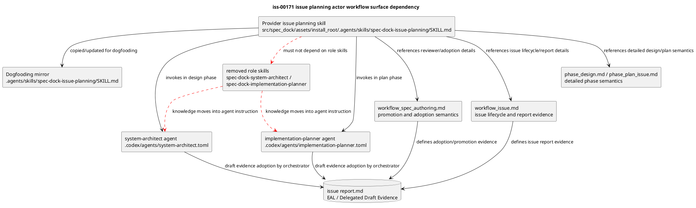

# iss-00171 Improve Issue Planning Actor Workflow — 設計

## 親図参照

- Epic 図:
  - `spec-dock/active/epic/design.md` の `Agent-facing context surface ownership model`。
  - `spec-dock/active/epic/design.md` の `evidence adoption and dogfooding sequence`。
- 再利用する決定:
  - Skills own operational workflow spine.
  - Docs own detailed semantics.
  - Templates own scaffolds/examples.
  - Discussion / sub-agent / ChatGPT output remains evidence until main orchestrator adoption.
  - Provider-side source is shipped asset authority; dogfooding mirror is validation target.

## 目的・制約

- 目的:
  - `spec-dock-issue-planning` を、linked docs を読む前でも actor / next action / stop condition が分かる first-read workflow spine にする。
  - ChatGPT research の具体提案を直接反映し、`system-architect` / `implementation-planner` draft creation を workflow 本体へ接続する。
- 必須:
  - Design phase に `system-architect` draft request を置く。
  - Plan phase に `implementation-planner` draft request を置く。
  - `system-architect` / `implementation-planner` の role contract を skill から `.codex/agents/*.toml` へ移し、agent instruction として完結させる。
  - Provider-side と dogfooding mirror の `spec-dock-system-architect` / `spec-dock-implementation-planner` skill directories を削除する。
  - Handoff review、post-run diff guard、Evidence Adoption Ledger、canonical integration、fresh `spec-reviewer` pass の順序を明示する。
- 禁止:
  - Draft を reviewer pass にする。
  - Skill に詳細 schema を過剰コピーする。
  - Manual fallback を壊す。

## 既存実装 / 規約の理解

- 参照した実装 / docs:
  - `src/spec_dock/assets/install_root/.agents/skills/spec-dock-issue-planning/SKILL.md`
  - `.agents/skills/spec-dock-issue-planning/SKILL.md`
  - `src/spec_dock/assets/install_root/.agents/skills/spec-dock-system-architect/SKILL.md`
  - `src/spec_dock/assets/install_root/.agents/skills/spec-dock-implementation-planner/SKILL.md`
  - `src/spec_dock/assets/install_root/.codex/agents/system-architect.toml`
  - `src/spec_dock/assets/install_root/.codex/agents/implementation-planner.toml`
  - `.codex/agents/system-architect.toml`
  - `.codex/agents/implementation-planner.toml`
  - `src/spec_dock/assets/install_root/.agents/skills/spec-driven-tdd-workflow/SKILL.md`
  - `spec-dock/docs/workflow_spec_authoring.md`
  - `spec-dock/docs/workflow_issue.md`
  - `spec-dock/docs/phase_design.md`
  - `spec-dock/docs/phase_plan_issue.md`
  - `spec-dock/docs/authoring/issue-plan.md`
- 現状理解:
  - Provider-side `install_root/.agents/skills/` が agent-tooling assets の正本である。
  - `.agents/skills/` は dogfooding mirror であり、今回の shipped skill 修正後に同期されるべき検証対象である。
  - `workflow_spec_authoring.md` と `phase_design.md` / `phase_plan_issue.md` には delegated authoring semantics が詳しく存在する。
  - 現行 `spec-dock-issue-planning` skill はその semantics を first-read sequence へ接続しきれていない。
  - 現行 `.codex/agents/system-architect.toml` と `.codex/agents/implementation-planner.toml` は skill を正本参照する thin adapter であり、role behavior が skill 側に漏れている。
- 採用するパターン:
  - Epic の ownership model に沿い、skill は actor sequence と stop condition だけを持つ。
  - Role 固有の authoring contract は `.codex/agents/*.toml` に閉じる。
  - Detailed semantics は docs へ route する。
  - Canonical authority は main orchestrator に残す。
- 採用しないもの:
  - Runtime hard gate 追加。
  - Full docs rewrite。
  - Sub-agent direct canonical write。
  - Draft mandatory hard blocker only path。

## 採用方針 / トレードオフ

- 論点: delegated draft を必須にするか default path にするか。
  - 選択肢 A: 常に mandatory とする。
  - 選択肢 B: non-trivial design/plan phase の default path とし、unavailable / denied / consent missing / trivial manual path は report evidence 付き fallback にする。
  - 決定: 選択肢 B。
  - 理由: ChatGPT research は draft-first workflow を推奨しつつ、role unavailable や runtime limitation で workflow 全体を壊さない guardrail を重視している。
- 論点: `draft-design` / `draft-plan` kind policy。
  - 選択肢 A: 今回 parent skill で hard-code する。
  - 選択肢 B: `Discussion Draft Path Compatibility` を置き、current canonical discussion path rule に従わせる。
  - 決定: 選択肢 B を最小実装とする。必要なら subordinate skill policy の整合を同 issue 内の補正として行う。
- 論点: docs の詳細を skill に移すか。
  - 決定: 移さない。Skill には sequence / actor / gate / stop condition / report evidence のみを置く。
- 論点: `system-architect` / `implementation-planner` を skill として残すか。
  - 選択肢 A: 既存どおり thin agent adapter + role skill を維持する。
  - 選択肢 B: role skill を削除し、agent TOML の `developer_instructions` を role contract の正本にする。
  - 決定: 選択肢 B。
  - 理由: 今回の failure mode は「workflow と actor の接続不足」だけでなく、role behavior が skill と agent に分散し、main workflow が何を呼ぶべきか曖昧になる構造にある。`system-architect` / `implementation-planner` は reusable skill ではなく delegated agent role であるため、知識を agent instruction にカプセル化する。
- 論点: role 知識を `spec-dock-issue-planning` skill にコピーするか。
  - 決定: コピーしない。`spec-dock-issue-planning` は agent invocation contract、allowed source artifacts、expected output、adoption/fallback/report obligation だけを持つ。

## 依存関係分析

- module / file 依存:
  - `spec-dock-issue-planning/SKILL.md` が中心。
  - `spec-driven-tdd-workflow/SKILL.md` は routing description と global invariant の surface。
  - `.codex/agents/system-architect.toml` / `.codex/agents/implementation-planner.toml` は delegated role contract の正本。
  - `spec-dock-system-architect/SKILL.md` / `spec-dock-implementation-planner/SKILL.md` は削除対象。
  - `workflow_spec_authoring.md` / `workflow_issue.md` / `phase_design.md` / `phase_plan_issue.md` は detail/reference semantics。
  - `tests/unit/infra/test_init_update.py` は installed asset inventory / copied file expectations を固定している。
  - `tests/unit/domain/test_delegated_authoring.py` と `tests/cli_runtime/test_delegated_authoring.py` は delegated authoring `created_by_role` validation を固定している。
  - `tests/cli_runtime/harness.py` は runtime harness の skill inventory を固定している。
  - Shipped docs 補正が必要な場合、`src/spec_dock/assets/spec_dock/docs/` が正本であり、`spec-dock/docs/` は dogfooding mirror / validation target である。
- 上流 / 前提:
  - `epic-00158` の context surface ownership model。
  - ChatGPT research。
  - Current issue requirement。
- 下流 / 依存先:
  - Future issue planning runs。
  - Dogfooding mirror `.agents/skills/spec-dock-issue-planning/SKILL.md`。
  - Future static drift checks / manual workflow probes。
- 実装起点:
  - Provider-side `spec-dock-issue-planning/SKILL.md` の front matter description と workflow sections。
- 順序への影響:
  - 先に provider-side skill を更新する。
  - 次に dogfooding mirror を同期する。
  - 周辺 contradiction を targeted inspection し、必要最小限の補正を追加する。

## モジュール依存図（Module Dependency Diagram）

- タイトル:
  - Issue planning actor workflow surface dependency
- 答える問い:
  - どの surface が actor workflow を所有し、どの surface が detail semantics を支えるか。
- 範囲:
  - `spec-dock-issue-planning` skill、delegated agent role TOML、deleted role skill directories、workflow/phase docs、dogfooding mirror。
- 含めない詳細:
  - Python runtime import graph、CLI implementation、multi-agent API。
- 更新条件:
  - Actor workflow ownership、delegated draft path、provider/mirror boundary が変わるとき。



## インターフェース契約

- User-facing contract:
  - Agent reads `spec-dock-issue-planning/SKILL.md` and can identify the next actor/action without opening every detail doc first.
- Artifact contract:
  - Provider and mirror `spec-dock-issue-planning/SKILL.md` should be semantically identical; exact match is preferred when dogfooding mirror is manually synced.
- Delegated draft contract:
  - `system-architect` / `implementation-planner` agent output remains one new flat Markdown under target scope `discussions/`.
  - `created_by_role` uses agent role names `system-architect` / `implementation-planner`, not deleted skill names.
  - Draft does not edit canonical docs or claim pass/promotion/authority.
  - Agent contract is self-contained in `.codex/agents/system-architect.toml` / `.codex/agents/implementation-planner.toml`; no role skill read is required or allowed.
- Report contract:
  - Draft invocation, diff guard, adoption status, reflected target, skip/blocker reason, and reviewer state are recorded in `report.md`.

## ディレクトリ / ファイル変更計画

```text
.
|-- src/
|   `-- spec_dock/
|       `-- assets/
|           `-- install_root/
|               `-- .agents/
|                   `-- skills/
|                       |-- spec-dock-issue-planning/
|                       |   `-- SKILL.md   # 変更: actor-based workflow spine の正本
|                       |-- spec-dock-system-architect/
|                       |   `-- SKILL.md   # 削除: role knowledge is agent-only
|                       |-- spec-dock-implementation-planner/
|                       |   `-- SKILL.md   # 削除: role knowledge is agent-only
|                       `-- spec-driven-tdd-workflow/
|                           `-- SKILL.md   # 必要時補正: routing description
|           `-- .codex/
|               `-- agents/
|                   |-- system-architect.toml        # 変更: self-contained role contract
|                   `-- implementation-planner.toml  # 変更: self-contained role contract
|           `-- spec_dock/
|               `-- docs/
|                   |-- workflow_spec_authoring.md # 必要時補正: shipped docs 正本
|                   |-- workflow_issue.md          # 必要時補正: shipped docs 正本
|                   |-- phase_design.md            # 必要時補正: shipped docs 正本
|                   `-- phase_plan_issue.md        # 必要時補正: shipped docs 正本
|-- .agents/
|   `-- skills/
|       |-- spec-dock-issue-planning/
|       |   `-- SKILL.md       # dogfooding mirror 同期
|       |-- spec-dock-system-architect/
|       |   `-- SKILL.md       # 削除: dogfooding mirror
|       |-- spec-dock-implementation-planner/
|       |   `-- SKILL.md       # 削除: dogfooding mirror
|       `-- spec-driven-tdd-workflow/
|           `-- SKILL.md       # provider 側補正時のみ同期
|-- .codex/
|   `-- agents/
|       |-- system-architect.toml        # mirror sync
|       `-- implementation-planner.toml  # mirror sync
|-- tests/
|   |-- unit/
|   |   |-- infra/
|   |   |   `-- test_init_update.py              # 変更: deleted role skills absent / agent TOML copied
|   |   `-- domain/
|   |       `-- test_delegated_authoring.py     # 変更: agent role provenance values
|   `-- cli_runtime/
|       |-- harness.py                          # 変更: runtime skill inventory
|       `-- test_delegated_authoring.py         # 変更: CLI diff guard provenance values
`-- spec-dock/
    `-- initiatives/
        `-- init-local-00003-architecture-maintenance-and-hardening/
            `-- epics/
                `-- epic-00158-agent-workflow-pdca-hardening/
                    `-- issues/
                        `-- iss-00171-improve-issue-planning-actor-workflow/
                            |-- discussions/
                            |   `-- 20260607t074107z-research-chatgpt-actor-workflow-analysis.md
                            |-- requirement.md
                            |-- design.md
                            |-- plan.md
                            `-- report.md
    `-- docs/
        |-- workflow_spec_authoring.md # dogfooding mirror / validation target
        |-- workflow_issue.md          # dogfooding mirror / validation target
        |-- phase_design.md            # dogfooding mirror / validation target
        `-- phase_plan_issue.md        # dogfooding mirror / validation target
```

## 要件 → 設計マッピング

- AC-001 -> `Mandatory Actor-Based Issue Authoring Workflow` を導入する。
- AC-002 -> Design phase subsection に `system-architect` request contract を置く。
- AC-003 -> Plan phase subsection に `implementation-planner` request contract を置く。
- AC-004 -> Draft adoption / report evidence / authority routing を明示する。
- AC-005 -> unavailable / denied / consent missing / manual fallback を stop conditions に置く。
- AC-006 -> provider/mirror sync verification を plan と report に置く。
- AC-007 -> surrounding surface inspection step を plan に置く。
- AC-008 -> `system-architect` agent TOML を self-contained contract にする。
- AC-009 -> `implementation-planner` agent TOML を self-contained contract にする。
- AC-010 -> role skill directories の削除と参照除去を確認する。
- AC-011 -> delegated authoring runtime provenance を agent role names にする。
- AC-012 -> old contract を固定している tests を更新し、focused pytest を実行する。
- EC-001 -> role unavailable fallback wording。
- EC-002 -> plan phase design gap routing。
- EC-003 -> diff guard failure wording。
- EC-004 -> Discussion Draft Path Compatibility。

## テスト戦略

- S01/S02/S03 の skill / agent-instruction / asset deletion は inspection と provider/mirror comparison を主検証にする。
- S04 は runtime delegated authoring provenance と tests を変更し得るため、code-level red/green test が必要である。
- Inspection:
  - Provider-side skill に `system-architect` / `implementation-planner` が workflow 本体で登場することを `rg` で確認する。
  - Provider-side と dogfooding mirror の `.codex/agents/system-architect.toml` / `implementation-planner.toml` が skill 参照なしで role contract を完結していることを確認する。
  - Provider-side と dogfooding mirror の `spec-dock-system-architect` / `spec-dock-implementation-planner` skill directories が存在しないことを確認する。
  - `diff guard` / `adoption` / `fresh spec-reviewer` / `unavailable` を targeted `rg` で確認する。
  - Provider-side と dogfooding mirror の exact match を `diff -u` で確認する。
- Focused pytest:
  - `uv run pytest tests/unit/infra/test_init_update.py tests/unit/domain/test_delegated_authoring.py tests/cli_runtime/test_delegated_authoring.py`
  - This is required when deleting role skill assets, changing agent TOML install expectations, or migrating `created_by_role` provenance.
- Structural validation:
  - `./spec-dock/scripts/spec-dock validate`
  - `./spec-dock/scripts/spec-dock sync`
- Manual dogfooding:
  - Skill first-read smoke として、design phase / plan phase / role unavailable / stale draft / reviewer fail / gap routing のシナリオを読み、次 action が skill 本体から分かるか確認する。

## 要件 / 例外 -> 検証マッピング

- AC-001, AC-002, AC-003:
  - `rg -n "system-architect|implementation-planner" src/spec_dock/assets/install_root/.agents/skills/spec-dock-issue-planning/SKILL.md .agents/skills/spec-dock-issue-planning/SKILL.md`
- AC-004:
  - `rg -n "handoff review|diff guard|Evidence Adoption Ledger|canonical integration|adoption" src/spec_dock/assets/install_root/.agents/skills/spec-dock-issue-planning/SKILL.md .agents/skills/spec-dock-issue-planning/SKILL.md`
- AC-005, EC-001:
  - `rg -n "unavailable|denied|consent|manual fallback|skip_reason|blocker" src/spec_dock/assets/install_root/.agents/skills/spec-dock-issue-planning/SKILL.md .agents/skills/spec-dock-issue-planning/SKILL.md`
- AC-006:
  - `diff -u src/spec_dock/assets/install_root/.agents/skills/spec-dock-issue-planning/SKILL.md .agents/skills/spec-dock-issue-planning/SKILL.md`
- AC-007, EC-004:
  - targeted inspection of issue-planning skill, delegated agent TOML, deleted role skill references, and workflow docs.
- AC-008, AC-009:
  - `rg -n "spec-dock-system-architect/SKILL.md|spec-dock-implementation-planner/SKILL.md|canonical role contract is|Before producing any answer, read and follow that skill" src/spec_dock/assets/install_root/.codex/agents/system-architect.toml src/spec_dock/assets/install_root/.codex/agents/implementation-planner.toml .codex/agents/system-architect.toml .codex/agents/implementation-planner.toml`
  - Expected: no matches.
- AC-010, EC-005:
  - `test ! -e src/spec_dock/assets/install_root/.agents/skills/spec-dock-system-architect`
  - `test ! -e src/spec_dock/assets/install_root/.agents/skills/spec-dock-implementation-planner`
  - `test ! -e .agents/skills/spec-dock-system-architect`
  - `test ! -e .agents/skills/spec-dock-implementation-planner`
  - `rg -n "spec-dock-system-architect|spec-dock-implementation-planner" src/spec_dock/assets/install_root .agents .codex src/spec_dock/assets/spec_dock spec-dock/docs`
  - Expected: no skill-path dependency remains; allowed matches are historical docs or role-name references classified in report.
- AC-011, EC-006:
  - `rg -n "AUTHORIZED_ROLE_FRONTMATTER|created_by_role|spec-dock-system-architect|spec-dock-implementation-planner|system-architect|implementation-planner" src/spec_dock/assets/spec_dock/scripts/spec_dock_runtime/domain/delegated_authoring.py tests`
  - Expected: fresh delegated authoring runtime accepts/generates agent role names. Any legacy compatibility is explicit and tested.
- AC-012, EC-007:
  - `uv run pytest tests/unit/infra/test_init_update.py tests/unit/domain/test_delegated_authoring.py tests/cli_runtime/test_delegated_authoring.py`
  - Expected: tests encode deleted role skill absence, agent TOML role contract authority, and agent role provenance values.
- EC-002:
  - `rg -n "design gap|return to design|workflow_clarification" src/spec_dock/assets/install_root/.agents/skills/spec-dock-issue-planning/SKILL.md .agents/skills/spec-dock-issue-planning/SKILL.md`
- EC-003:
  - `rg -n "forbidden|diff guard|not adopted|rejected" src/spec_dock/assets/install_root/.agents/skills/spec-dock-issue-planning/SKILL.md .agents/skills/spec-dock-issue-planning/SKILL.md`

## リスク / 移行 / ロールバック

- リスク:
  - Skill が長くなりすぎる。
  - Draft default path が hard mandatory と誤読され、role unavailable 時に workflow が止まりすぎる。
  - Agent TOML に role knowledge を移した後、installer/update の copied asset set から削除 skill が残る。
  - Runtime delegated authoring checks が skill name dependency を持っている場合、agent-only 化と矛盾する。
  - Existing fixtures or historical discussion drafts may still contain deleted skill names in `created_by_role`; plan must classify migration or compatibility instead of leaving runtime behavior ambiguous.
  - Tests may continue to encode the retired role-skill contract; focused pytest must be part of the implementation gate.
  - `draft-design` / `draft-plan` kind policy の衝突が残る。
  - Provider-side と mirror の片方だけが更新される。
- 緩和:
  - Skill には sequence / actor / gate / stop condition に限定して書く。
  - `default path` と fallback evidence を明示する。
  - Discussion Draft Path Compatibility を入れる。
  - Provider/mirror exact diff を verification に入れる。
- ロールバック:
  - Shipped skill text の変更なので、該当 `SKILL.md` diff を revert すれば戻せる。
  - 周辺補正は step 単位で分け、不要なら個別 revert 可能にする。

## 未確定事項

- Blocking question:
  - なし。
- Non-blocking:
  - Subordinate skills の discussion kind policy まで今回揃えるかは、S03 の surrounding surface inspection で判断する。
