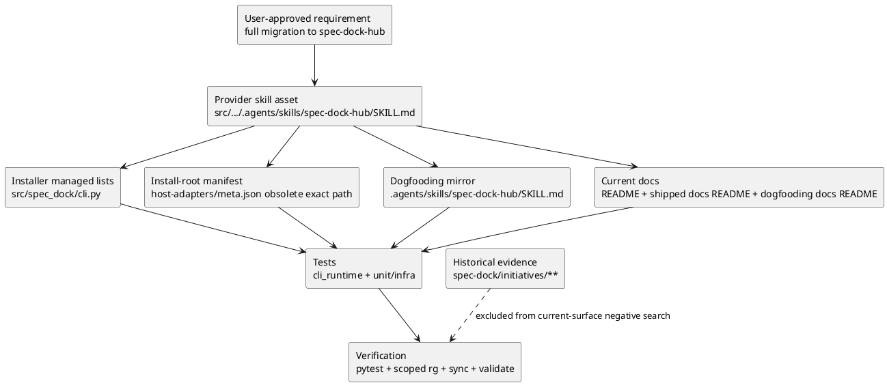

# iss-00184 Rename Spec Dock Hub Skill — 設計

## 目的・制約

### 目的

旧 hub skill `spec-driven-tdd-workflow` を、現行の実行時 / discovery / docs / tests surface から退役し、新しい canonical hub skill `spec-dock-hub` へ完全移行する。

この issue の変更後、agent が current skills / docs / installed assets を見たとき、SpecDock work の入口は `spec-dock-hub` であると一貫して理解できる状態にする。

### 非交渉制約

- 互換 alias、forwarding skill、stub、symlink、旧名の current discovery entry は作らない。
- `iss-00164` の hub/leaf boundary を維持する。
  - Hub: route selector + global invariant surface。
  - Leaf skills: task-specific workflow spine。
- Provider-side source of truth は `src/spec_dock/assets/install_root/.agents/skills/`。
- `.agents/skills/` は dogfooding mirror / parity target。
- Historical specs / discussions / reports は過去証跡であり、原則として機械 rewrite しない。
- `_LEGACY_MANAGED_SKILL_NAMES` に旧名を残す場合でも、それは obsolete managed path cleanup metadata であり、compatibility promise ではない。

## 既存実装 / 規約の理解

### 参照した実装 / docs / evidence

- `spec-dock/active/issue/requirement.md`
- `spec-dock/active/epic/requirement.md`
- `spec-dock/active/issue/discussions/20260612t070646z-interview-hub-skill-naming-compatibility-direction.md`
- `spec-dock/active/issue/discussions/20260612t071326z-interview-canonical-hub-skill-name.md`
- `spec-dock/active/issue/discussions/20260612t072453z-research-spec-dock-hub-rename-surface-inventory.md`
- `spec-dock/active/issue/discussions/20260612t073146z-draft-design-spec-dock-hub-full-migration.md`
- `AGENTS.md`
- `src/spec_dock/cli.py`
- `src/spec_dock/assets/install_root/.agents/skills/spec-driven-tdd-workflow/SKILL.md`
- `src/spec_dock/assets/install_root/.agents/host-adapters/meta.json`
- `.agents/skills/spec-driven-tdd-workflow/SKILL.md`
- `README.md`
- `src/spec_dock/assets/spec_dock/docs/README.md`
- `spec-dock/docs/README.md`
- `tests/cli_runtime/test_wrappers.py`
- `tests/cli_runtime/harness.py`
- `tests/unit/infra/test_init_update.py`

### 現状理解

- Current hub skill は provider と mirror に重複して存在する。
  - Provider: `src/spec_dock/assets/install_root/.agents/skills/spec-driven-tdd-workflow/SKILL.md`
  - Mirror: `.agents/skills/spec-driven-tdd-workflow/SKILL.md`
- Current hub skill frontmatter は `name: spec-driven-tdd-workflow`。
- Current heading は `# Spec-driven TDD Workflow (Hub)`。
- 本文はすでに route selector / global invariant / reviewer gate / evidence adoption / leaf routing を持っている。
- `src/spec_dock/cli.py` は current managed skill list と legacy cleanup list の両方に旧名を持つ。
- `src/spec_dock/assets/install_root/.agents/host-adapters/meta.json` の `managed_assets.obsolete_exact_file_paths` は update-time obsolete managed file deletion contract であり、現状は旧 hub skill path を含まない。
- README / shipped docs README / dogfooding docs README は旧 hub path を current entry として表示している。
- Tests は旧 path / old skill name を current expected value として持つ。
- Historical specs / discussions には旧名が多く残るが、これは過去状態の証跡であり、current surface とは分けて扱う。

## 採用方針 / トレードオフ

### 採用方針

- Provider / mirror の hub skill directory を `spec-dock-hub` へ rename する。
- `SKILL.md` の frontmatter name を `spec-dock-hub` にする。
- heading / description は、短い名前を補うために `SpecDock Hub` と route selector / global invariant surface を明示する。
- `_MANAGED_SKILL_NAMES` は `spec-dock-hub` を current managed skill として扱う。
- `src/spec_dock/assets/install_root/.agents/host-adapters/meta.json` の `managed_assets.obsolete_exact_file_paths` に `.agents/skills/spec-driven-tdd-workflow/SKILL.md` を追加する、または同等の exact-file cleanup contract を実装する。
- 旧 `spec-driven-tdd-workflow` は `_LEGACY_MANAGED_SKILL_NAMES` に cleanup metadata として残せる。ただし install / docs / discovery / tests の current entry にはしない。
- Current docs and tests は `spec-dock-hub` を期待値に更新する。
- Negative inspection は current surface に限定する。Historical evidence は除外する。

### 採用しないもの

- `spec-driven-tdd-workflow` directory を互換 alias として残す。
- forwarding-only `SKILL.md` を置く。
- docs に「旧名でも使える」と書く。
- 過去 spec / discussion を一括 rewrite する。
- Hub body に leaf workflow の詳細を移植する。

## 依存関係分析

### 依存順序

```text
approved requirement decisions
  -> provider hub skill path and metadata
  -> installer current managed skill list
  -> install-root manifest obsolete exact-file cleanup contract
  -> optional legacy cleanup ownership metadata for obsolete old path
  -> dogfooding mirror path and byte parity
  -> README / shipped docs / dogfooding docs current references
  -> tests and harness expected skill inventory
  -> focused pytest
  -> scoped current-surface negative inspection
  -> sync / validate dogfooding evidence
```

### 依存上の注意

- `_MANAGED_SKILL_NAMES` と `tests/cli_runtime/harness.py` の expected managed skill list は同時に更新する。
- `src/spec_dock/assets/install_root/.agents/host-adapters/meta.json` の `managed_assets.obsolete_exact_file_paths` は既存 consumer update 時の旧 hub skill 削除契約なので、旧 path cleanup test と同時に更新する。
- Provider / mirror parity test は path と bytes の両方に依存するため、provider rename と mirror rename は同じ implementation step で扱う。
- Existing consumer update cleanup は、旧 path を削除し新 path を install することをテストで固定する。
- Negative inspection は current surface only にし、historical `spec-dock/initiatives/**` は対象外にする。

## モジュール依存図



## インターフェース契約

- Current canonical skill path:
  - `src/spec_dock/assets/install_root/.agents/skills/spec-dock-hub/SKILL.md`
  - `.agents/skills/spec-dock-hub/SKILL.md`
- Current skill frontmatter:
  - `name: spec-dock-hub`
- Current discovery role:
  - SpecDock work の entry / routing skill。
  - Route selector and global invariant surface。
- Old path:
  - `spec-driven-tdd-workflow` is obsolete.
  - It must not appear as current installed managed skill, current docs entry, or compatibility alias.
  - Existing consumer cleanup is expressed by the exact obsolete file path `.agents/skills/spec-driven-tdd-workflow/SKILL.md` in `managed_assets.obsolete_exact_file_paths` or an equivalent exact-file deletion contract.
  - It may appear in historical specs / discussions / reports.

## ディレクトリ / ファイル変更計画

```text
.
|-- src/
|   `-- spec_dock/
|       |-- cli.py
|       |   # 変更: current managed skill を spec-dock-hub に変更。
|       |   #       old spec-driven-tdd-workflow は cleanup metadata として legacy list に残すか検証する。
|       `-- assets/
|           |-- install_root/
|           |   `-- .agents/
|           |       |-- host-adapters/
|           |       |   `-- meta.json
|           |       |   # 変更: managed_assets.obsolete_exact_file_paths に旧 hub SKILL.md exact path を追加。
|           |       `-- skills/
|           |           |-- spec-dock-hub/
|           |           |   `-- SKILL.md
|           |           |   # 追加/rename: provider-side hub skill authority。
|           |           `-- spec-driven-tdd-workflow/
|           |               `-- SKILL.md
|           |               # 削除: current provider skill path として残さない。
|           `-- spec_dock/
|               `-- docs/
|                   `-- README.md
|                   # 変更: Hub path を .agents/skills/spec-dock-hub/SKILL.md に更新。
|-- .agents/
|   `-- skills/
|       |-- spec-dock-hub/
|       |   `-- SKILL.md
|       |   # 追加/rename: dogfooding mirror。
|       `-- spec-driven-tdd-workflow/
|           `-- SKILL.md
|           # 削除: mirror current path として残さない。
|-- spec-dock/
|   `-- docs/
|       `-- README.md
|       # 変更: dogfooding docs の Hub path を更新。
|-- README.md
|   # 変更: skill list の hub entry を spec-dock-hub に更新。
`-- tests/
    |-- cli_runtime/
    |   |-- harness.py
    |   |   # 変更: expected managed skill names を spec-dock-hub に更新。
    |   `-- test_wrappers.py
    |       # 変更: installed hub skill path read を spec-dock-hub に更新。
    `-- unit/
        `-- infra/
            `-- test_init_update.py
            # 変更: provider/mirror parity、asset inventory、routing contract、
            #       update prune fixture、docs README assertions、representative path assertions。
```

## 要件 -> 設計マッピング

- AC-001:
  - Provider / mirror skill path、frontmatter name、heading、description を `spec-dock-hub` にする。
- AC-002:
  - Current surface inventory を design / report に反映し、historical evidence boundary を明示する。
- AC-003:
  - Hub body は route selector + global invariant に留め、leaf workflow 詳細は移さない。
- AC-004:
  - Provider/mirror parity、sync、validate を検証に含める。
- AC-005:
  - Current docs/tests は新名へ統一し、旧名は historical evidence または migration rationale としてのみ残す。
- AC-006:
  - Install-root manifest の obsolete exact-file cleanup contract と installer/update tests で obsolete old managed path が残らないことを固定する。
- EC-001:
  - 旧 path 依存 tests を新名へ更新し、cleanup behavior をテストする。
- EC-002:
  - `spec-dock-hub` の説明文に route selector / global invariant を入れる。
- EC-003:
  - Negative inspection scope は current files に限定し、historical specs は対象外にする。

## テスト戦略

### Focused tests

- `uv run pytest tests/cli_runtime/test_wrappers.py`
  - Installed wrapper / generated repo が `spec-dock-hub` を読むことを確認する。
- `uv run pytest tests/unit/infra/test_init_update.py -k "managed or skill or bundled or parity or routing or prunes or README"`
  - Selection は実装時に現実の test names に合わせる。
  - 目的は installed asset inventory、provider/mirror parity、README assertion、routing contract、manifest obsolete exact path validation、obsolete old path cleanup を狙う。

### Broader fallback

- Focused `-k` が脆い場合:
  - `uv run pytest tests/unit/infra/test_init_update.py tests/cli_runtime/test_wrappers.py`
- Runtime harness impact が広い場合:
  - `uv run pytest tests/cli_runtime`

### Inspection / manual evidence

- Provider/mirror byte parity:
  - `cmp -s src/spec_dock/assets/install_root/.agents/skills/spec-dock-hub/SKILL.md .agents/skills/spec-dock-hub/SKILL.md`
- New current surface positive inspection:
  - `rg -n "spec-dock-hub" README.md src/spec_dock/cli.py src/spec_dock/assets/spec_dock/docs/README.md spec-dock/docs/README.md tests/cli_runtime tests/unit/infra src/spec_dock/assets/install_root/.agents/skills .agents/skills`
- Old current surface negative inspection:
  - `rg -n "spec-driven-tdd-workflow|Spec-driven TDD Workflow" README.md src/spec_dock/cli.py src/spec_dock/assets/install_root/.agents/host-adapters/meta.json src/spec_dock/assets/spec_dock/docs/README.md spec-dock/docs/README.md tests/cli_runtime tests/unit/infra src/spec_dock/assets/install_root/.agents/skills .agents/skills`
  - Expected: no current-surface matches except explicitly justified cleanup metadata in `_LEGACY_MANAGED_SKILL_NAMES`, `managed_assets.obsolete_exact_file_paths`, and tests / fixtures that assert old managed path is pruned.
- Dogfooding:
  - `./spec-dock/scripts/spec-dock sync`
  - `./spec-dock/scripts/spec-dock validate`
  - `git diff --check`

## 移行 / ロールバック

### Migration

- New installs should contain `.agents/skills/spec-dock-hub/SKILL.md`.
- Existing updates should end with `.agents/skills/spec-dock-hub/SKILL.md` and no current `.agents/skills/spec-driven-tdd-workflow/SKILL.md`.
- Old path cleanup must be verified through `managed_assets.obsolete_exact_file_paths` or an equivalent exact-file cleanup contract, not compatibility support.

### Rollback

- Rollback requires reverting together:
  - provider / mirror directory rename,
  - `src/spec_dock/cli.py` managed lists,
  - docs references,
  - tests expected values.
- Partial rollback can create both old and new hub skills and is not acceptable.

## リスク

- `_LEGACY_MANAGED_SKILL_NAMES` の意味を誤ると、旧名を compatibility surface と誤読する可能性がある。
  - Mitigation: design / plan / report で cleanup metadata と明記し、docs には旧名を current entry として出さない。
- Negative inspection が広すぎると historical evidence で失敗する。
  - Mitigation: current surface only の explicit path list を plan に置く。
- Test selection が広くなりすぎる可能性がある。
  - Mitigation: focused test first、必要なら `tests/unit/infra/test_init_update.py` と `tests/cli_runtime/test_wrappers.py` へ広げる。

## 未確定事項

- Blocking question:
  - なし。
- Non-blocking implementation detail:
  - `_LEGACY_MANAGED_SKILL_NAMES` に旧名を残すかどうかは、implementation inspection で cleanup test と照合する。ただし残す場合も compatibility alias ではない。
