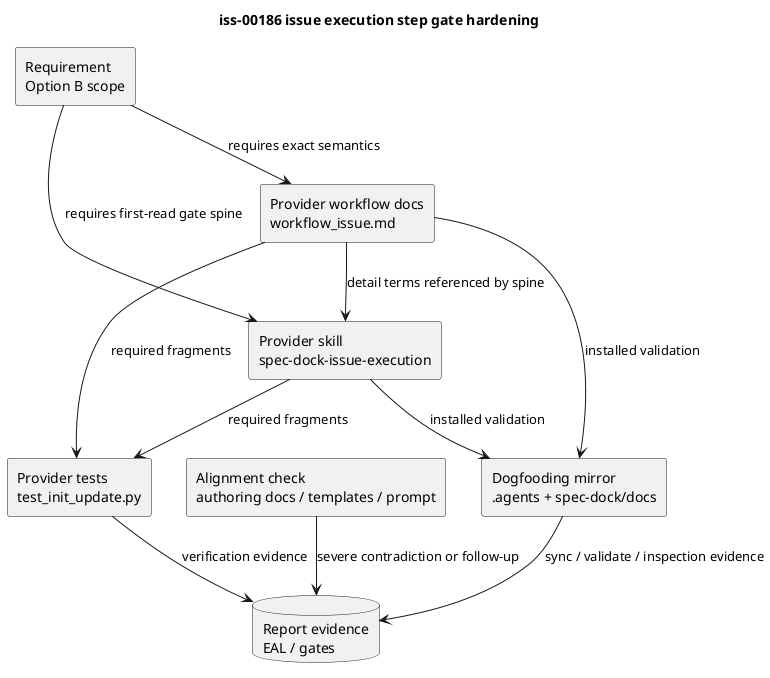
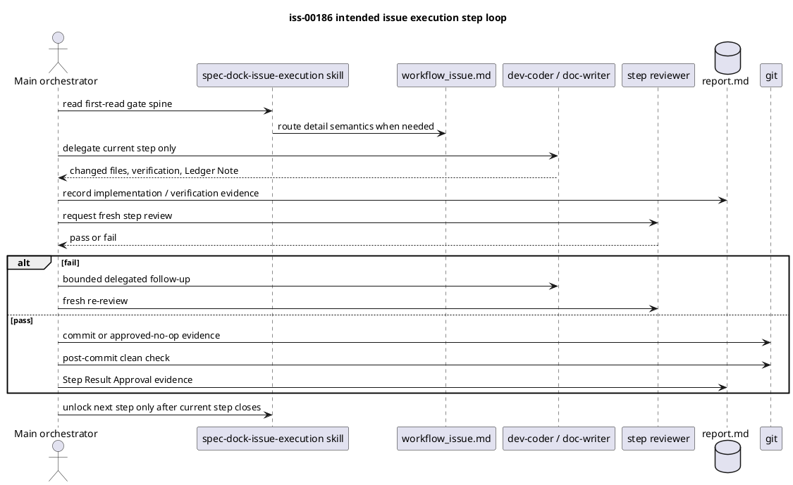

# iss-00186 Harden Issue Execution Step Gates — 設計

## 目的・制約

- 目的:
  - `spec-dock-issue-execution` skill を、issue execution の first-read gate spine として強化する。
  - `workflow_issue.md` に、Step Result Approval、例外 / availability semantics、final commit boundary の詳細を置く。
  - Provider-side shipped asset を正本として変更し、dogfooding mirror と tests で検証する。
- 採用スコープ:
  - User interview で採用済みの Option B。
  - 必須変更は skill + minimal workflow docs + assertions + mirror validation。
  - authoring docs / templates / `/execute-issue` prompt は alignment check 対象であり、重大な矛盾だけ小修正または follow-up とする。
- 非交渉制約:
  - Skill は compact workflow spine を持つが、full lifecycle policy / schema / completion matrix を抱え込まない。
  - Docs は detail semantics を持つ。
  - Templates は scaffold / evidence slots であり compliance authority ではない。
  - Fresh reviewer gates、per-step review、per-step commit、delegated mutation の原則を弱めない。

## 既存実装 / 規約の理解

- 参照した実装 / docs:
  - `src/spec_dock/assets/install_root/.agents/skills/spec-dock-issue-execution/SKILL.md`
  - `src/spec_dock/assets/spec_dock/docs/workflow_issue.md`
  - `src/spec_dock/assets/spec_dock/docs/authoring/issue-plan.md`
  - `tests/unit/infra/test_init_update.py`
  - `.agents/skills/spec-dock-issue-execution/SKILL.md`
  - `spec-dock/docs/workflow_issue.md`
  - `spec-dock/active/issue/requirement.md`
  - `spec-dock/active/issue/discussions/20260615t152809z-interview-issue-execution-hardening-scope-boundary.md`
  - `spec-dock/active/issue/discussions/20260615t153746z-draft-design-issue-execution-step-gate-hardening.md`
- 現状理解:
  - Provider skill は approved / reviewer-pass 済み planning artifacts、executable `plan.md`、report ledger、delegation routing、review failure follow-up をすでに持つ。
  - 不足しているのは policy 自体ではなく、first-read surface で `single current step -> required verification -> fresh reviewer pass -> commit/no-op -> post-commit clean -> next step unlock` が即座に見えること。
  - `workflow_issue.md` は detailed execution order、parent orchestration invariant、delegation gate、reviewer gate、completion policy をすでに持つため、今回の変更は exact semantics の小補強に留める。
  - Test suite は provider skill / workflow docs の重要 fragments を assert しているため、既存 fragment を残しつつ additive assertions を加える。
- 採用するパターン:
  - Provider source first、dogfooding mirror validation second。
  - Skill は短い imperative spine、workflow docs は正確な語義 / hard cases。
  - Alignment check は broad rewrite ではなく severe contradiction detection として扱う。
- 採用しないもの:
  - Runtime CLI enforcement。
  - Empirical compliance harness。
  - Template / prompt broad rewrite。
  - Agent role definition / permission model changes。

## 採用方針 / トレードオフ

| 選択肢 | 判断 | 理由 |
|---|---|---|
| Skill-only minimal reminder | 不採用 | First-read は改善するが、`Step Result Approval`、final commit、例外語彙の detail ambiguity が残る。 |
| Full workflow policy copied into skill | 不採用 | Skill bloat と docs との二重正本を作り、accepted ADR に反する。 |
| Option B: skill + minimal workflow docs + assertions + mirror validation | 採用 | ユーザーが採用済みで、追随性改善と責務分担維持のバランスがよい。 |
| Broad template / prompt / empirical harness sweep | 不採用 / deferred | `iss-00166` と重複し、issue が大きくなり per-step review/commit discipline を保ちにくい。 |
| Runtime enforcement / CLI validation | deferred | 今回は agent-facing context surface の hardening が主目的。 |

## Surface Responsibility

| Surface | Owns | この issue で持たせないもの |
|---|---|---|
| `spec-dock-issue-execution/SKILL.md` | First-read execution gate spine、stop conditions、route map、exit gate reminders | Full lifecycle policy、field schema、completion matrix |
| `workflow_issue.md` | Lifecycle detail、reviewer/delegation/commit/completion semantics、hard cases | Skill が省略した mandatory first action の隠れ正本 |
| `authoring/issue-plan.md` | Executable plan schema、field semantics、delegation contract detail | Runtime execution authority、duplicate completion policy |
| Provider templates | Scaffold shape、evidence slots、examples | Compliance authority、phase promotion authority |
| `/execute-issue` prompt | Skill / workflow gate との entry alignment | 別 source of truth、大規模 prompt redesign |
| Tests | Provider asset preservation、required wording assertions | Empirical agent compliance の証明 |
| Dogfooding mirror | Installed-surface validation | Provider authority |
| `report.md` | Evidence Adoption Ledger、delegated draft tracking、actual verification evidence | Silent adoption of delegated evidence |

## 依存関係分析

- 上流 / 前提:
  - `requirement.md` は fresh `spec-reviewer` pass 済み。
  - Accepted ADR が context-surface ownership を固定している。
  - Provider-side assets が shipped source of truth。
- file 依存:
  - Skill wording は `workflow_issue.md` の detail semantics を参照する。
  - Workflow exact semantics が固まってから test assertions を更新する。
  - Dogfooding mirror は provider-side change 後に update / sync / inspection する。
- 実装起点:
  - Provider skill の compact gate spineを先に追加し、agent の first-read behavior を変える。
  - 次に `workflow_issue.md` の detail terms を補強する。
  - 最後に tests / mirror / alignment check で drift を確認する。
- 順序への影響:
  - Plan では skill text、workflow docs、test assertion、alignment check、mirror validation を分ける。
  - Skill と workflow docs は docs/skill-text-only change なので primary delegated worker は `doc-writer`、reviewer は `spec-reviewer` docs/spec alignment を基本とする。

## モジュール依存図（Module Dependency Diagram）

- タイトル:
  - Issue execution text-surface dependency model
- 答える問い:
  - どの surface が first-read gate、detail semantics、test assertion、mirror validation を担うか。
- 範囲:
  - Provider skill / workflow docs / tests / dogfooding mirror / alignment-check surfaces。
- 含めない詳細:
  - Python runtime call graph、CLI lifecycle implementation、sub-agent runtime internals。
- 更新条件:
  - Skill/docs/templates の責務境界、変更対象、実装順が変わるとき。



## インターフェース契約

- Runtime API / CLI:
  - 変更しない。
- Agent-facing skill contract:
  - `spec-dock-issue-execution` は execution start 時に、single current step、required verification、fresh reviewer pass、commit/no-op gate、post-commit clean、next-step unlock、delegated mutation、Parent Implementation Exception、unavailable / denied / waiver handling を短く示す。
- Workflow docs contract:
  - `workflow_issue.md` は `Step Result Approval`、`approved-local-execution`、`degraded mode`、`waived`、`final commit` の exact semantics を持つ。
- Test contract:
  - Existing required fragments を保持する。
  - New gate spine / exact semantics の key phrases を assert する。
- Evidence contract:
  - Delegated draft、research、interview、reviewer output は `report.md` Evidence Adoption Ledger / Spec Authoring Gate に採用判断を残す。

## シーケンス差分



## ディレクトリ / ファイル変更計画

```text
src/spec_dock/assets/install_root/.agents/skills/
`-- spec-dock-issue-execution/SKILL.md
    # 変更: compact first-read execution gate spine を追加; full workflow policy はコピーしない

src/spec_dock/assets/spec_dock/docs/
|-- workflow_issue.md
|   # 変更: Step Result Approval、exception / availability semantics、final commit boundary を小補強
`-- authoring/issue-plan.md
    # alignment check: 重大矛盾があれば小修正または follow-up

src/spec_dock/assets/spec_dock/templates/issue/
|-- plan.md
`-- report.md
    # alignment check: template authority 化や multi-step bundling 誘導が重大なら小修正または follow-up

src/spec_dock/assets/install_root/.codex/prompts/
`-- execute-issue.md
    # alignment check: skill / workflow gate と重大に矛盾する場合のみ小修正または follow-up

tests/unit/infra/
`-- test_init_update.py
    # 変更: 新しい required fragments の assertion を追加し、既存 fragments を保持

.agents/skills/
`-- spec-dock-issue-execution/SKILL.md
    # dogfooding mirror validation / sync target

spec-dock/docs/
`-- workflow_issue.md
    # dogfooding mirror validation / sync target
```

## 要件 → 設計マッピング

| 要件 | 設計対応 |
|---|---|
| AC-001 First-read single-step gate | Skill に compact execution gate spine を追加する。 |
| AC-002 Delegated mutation gate | Skill の route map と workflow detail で `dev-coder` / `doc-writer` と `Parent Implementation Exception` 境界を明示する。 |
| AC-003 Reviewer fail and follow-up gate | Skill / workflow docs で bounded delegated follow-up と fresh re-review を維持 / 強調する。 |
| AC-004 Completion terminology boundary | `workflow_issue.md` に exception / availability / final commit semantics を置く。 |
| AC-005 Context-surface ownership compliance | Surface responsibility table と alignment check で skill/docs/templates の責務境界を保つ。 |
| AC-006 Provider and dogfooding validation | Provider source first、mirror validation、`sync` / `validate` / targeted inspection を計画する。 |
| AC-007 Evidence adoption and planning readiness | `report.md` EAL / Spec Authoring Gate に adoption と reviewer evidence を残す。 |
| EC-001 | Single current step / next-step unlock wording と step gate test assertions。 |
| EC-002 | unavailable / denied / host conflict / waiver semantics を docs detail に追加。 |
| EC-003 | docs-only / skill-text-only は inspect-only / spec-review path として plan に落とす。 |
| EC-004 | final commit is not catch-up implementation commit の明文化。 |
| EC-005 | alignment check と follow-up / deferred decision を report に残す。 |

## テスト戦略

- Unit / scaffold asset assertions:
  - `tests/unit/infra/test_init_update.py` の issue execution skill / workflow docs assertions を更新する。
  - Existing fragments:
    - `spec-dock/docs/workflow_issue.md as the source of truth`
    - `concise reminder for issue execution`
    - `Route runtime, tests, and scaffold behavior to `dev-coder``
    - `Route shipped docs, templates, skills, and workflow text to `doc-writer``
    - `bounded delegated follow-up`
    - `Parent direct fixes require a documented Parent Implementation Exception`
  - New fragments:
    - single current implementation step
    - required verification before next step
    - fresh step reviewer pass
    - Step Commit Gate
    - post-commit clean check
    - final commit is not catch-up implementation commit
    - unavailable / denied / host conflict / waiver are not reviewer passes
- Docs-only / inspect-only verification:
  - Provider skill / workflow docs targeted inspection。
  - Dogfooding mirror skill / workflow docs targeted inspection。
  - Alignment check for `authoring/issue-plan.md`、templates、prompt。
- SpecDock validation:
  - `./spec-dock/scripts/spec-dock validate`
  - `./spec-dock/scripts/spec-dock sync` if provider/mirror update requires projection refresh。
- Not required:
  - Empirical prompt harness。
  - Runtime CLI behavior tests unless implementation unexpectedly changes runtime behavior。

## リスク / 移行 / ロールバック

| リスク | 影響 | 対策 |
|---|---|---|
| Skill bloat | docs と二重正本になり drift が増える | Skill は first action / stop conditions / routing / exit gates に限定する。 |
| Docs-only hidden workflow | agent が hard gate を見落とす | Skill に gate spine を top-load する。 |
| Assertion brittleness | 小さな wording 変更で tests が壊れる | 既存 fragment を保持し、new assertion は core contract phrase に絞る。 |
| Template scope creep | `iss-00166` と重複し issue が肥大化する | 重大矛盾だけ小修正し、広い cleanup は follow-up。 |
| Terminology inversion | `approved-local-execution` / `degraded mode` が success に見える | `workflow_issue.md` で exception / availability semantics を明確化する。 |
| Final commit misuse | 未 commit step diff が late bundle される | final commit は catch-up implementation commit ではないと明記する。 |
| Mirror-only edits | shipped source が変わらない | Provider source first、mirror validation second。 |

- Rollback:
  - Provider skill / workflow docs / matching tests を同じ commit 範囲で revert する。
  - Mirror validation で provider と mirror の差分を再確認する。
  - Alignment fix が広すぎた場合は revert し、follow-up issue に変換する。

## 採用した delegated design evidence

- `system-architect` draft:
  - `discussions/20260615t153746z-draft-design-issue-execution-step-gate-hardening.md`
- 採用内容:
  - Option B architecture。
  - Surface responsibility table。
  - Provider source first / mirror validation second。
  - Skill spine / workflow exact semantics / tests / alignment check の分割。
  - Risks / rollback / ADR triage。
- 採用しない / deferred:
  - Empirical compliance harness は follow-up。
  - Broad template / prompt rewrite は follow-up または重大矛盾がある場合の小修正に限定。

## ADR 候補

- 追加 ADR:
  - 不要。
- 理由:
  - 既存 accepted ADR `Skill Docs Template Context Surface Ownership` が、skills / docs / templates の durable ownership model をすでに決定している。
  - この issue はその ADR を issue execution step gates に適用するものであり、新しい durable architecture decision ではない。
- ADR triage が必要になる条件:
  - Runtime enforcement を policy authority にする。
  - Templates を compliance authority にする。
  - Skill / docs / templates の ownership model を変更する。

## 未確定事項

- Blocking question:
  - なし。
- Non-blocking design questions:
  - `approved-local-execution` の語を将来 rename するかどうか。
  - Alignment check で見つかった non-severe prompt/template drift を `iss-00166` へ渡すか、新 follow-up にするか。
  - Empirical compliance harness を、この issue の dogfooding 後に follow-up として作るか。
