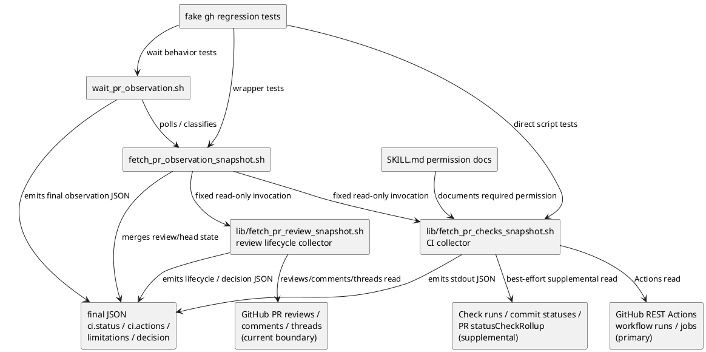

# iss-00187 Use Actions Endpoint For PR Observation CI State — 設計（どう実現するか）

## 親図（Diagram）参照
- Epic:
  - `epic-00158-agent-workflow-pdca-hardening` は agent workflow の hardening lane であり、本 issue は PR observation から merge preparation / repair workflow へ渡す status contract の精度を上げる slice として扱う。
- 再利用する決定:
  - Provider source under `src/spec_dock/assets/install_root/.agents/skills/github-pr-observation/` を正本とし、repo root `.agents/skills/github-pr-observation/` は dogfooding mirror / validation surface として同期確認する。
  - PR observation の stdout は final JSON authority、progress / diagnostics は stderr とする。
  - Fixed script surface を維持し、caller-provided API endpoint / query / raw `gh` argument を受け取らない。
- Initiative / ADR:
  - 本 issue で新 ADR は作らない。GitHub API permission surface の選択は issue-local contract として十分であり、長期アーキテクチャ境界は既存 runtime / skill asset 構造に従う。

## 目的・制約
- 目的:
  - Fine-grained PAT で通常付与可能な `Actions` read を CI 観測の primary surface にし、`Checks` read 欠落を通常 blocker にしない。
  - Actions-only green evidence は `ci.status="passed"` を許可しつつ、full rollup / external provider coverage が未証明なら machine-readable limitation を残す。
  - 失敗、実行中、pending、stale head、permission / auth / rate / schema / transient failure を downstream agent が誤って merge-ready と判断しない contract にする。
  - Post-observation addendum: CI passed / head matched でも Codex review completion signal が観測できない状態を generic timeout に潰さず、wait wrapper の quiet / same-fingerprint stability gate 後に `review_completion_unknown` として表現する。
- 必須:
  - `fetch_pr_checks_snapshot.sh` の公開 CLI 名と引数 contract を保つ。
  - `fetch_pr_observation_snapshot.sh` と `wait_pr_observation.sh` が消費する `ci.status` / `limitations` / `decision` の意味を保つ。
  - `fetch_pr_review_snapshot.sh` は current trigger boundary の review completion state を `decision` と `codex_review.lifecycle` に機械可読に残す。
  - Provider source を先に変更し、dogfooding mirror は同期・検証対象にする。
- 禁止:
  - 任意 GitHub API proxy 化。
  - token / raw auth stderr の出力。
  - GitHub Actions 以外の external check provider coverage を暗黙に完全証明した扱いにすること。
- 非交渉制約:
  - Unsupported / ambiguous / unobserved failure-risk state は explicit limitation または `unknown` に留める。
  - Workflow run / job conclusion の `stale` は CI failure class。PR head mismatch / snapshot 中の head change は `stale_head` freshness failure として再実行へ誘導する。
  - `selected_comments == 0`、`selected_unresolved_count == 0`、または historical unresolved thread がないことだけを review completion / merge-ready の証明にしない。

## 既存実装 / 規約の理解
- 参照した実装 / docs:
  - `src/spec_dock/assets/install_root/.agents/skills/github-pr-observation/scripts/lib/fetch_pr_checks_snapshot.sh`
  - `src/spec_dock/assets/install_root/.agents/skills/github-pr-observation/scripts/lib/fetch_pr_review_snapshot.sh`
  - `src/spec_dock/assets/install_root/.agents/skills/github-pr-observation/scripts/fetch_pr_observation_snapshot.sh`
  - `src/spec_dock/assets/install_root/.agents/skills/github-pr-observation/scripts/wait_pr_observation.sh`
  - `src/spec_dock/assets/install_root/.agents/skills/github-pr-observation/SKILL.md`
  - `tests/unit/infra/test_init_update.py`
  - `.agents/skills/github-pr-observation/...` dogfooding mirror
- 現状理解:
  - `fetch_pr_checks_snapshot.sh` は現在、head SHA の check runs、combined commit status、PR `mergeStateStatus/statusCheckRollup` を主 source とし、失敗 check run の `workflow_run.id` がある場合だけ Actions jobs を補助取得する。
  - Permission denied は `github_token_permission_denied` limitation、`severity="blocking"`、`recommended_next_action="fix_github_token_permissions"` として扱われる。
  - Snapshot / wait wrapper は `ci.status`、blocking limitation、head freshness を使って `normalized_status` と `recommended_next_action` を決める。
  - `fetch_pr_review_snapshot.sh` は current-boundary Codex PR review があれば `submitted_pull_request_review` を high-confidence completion signal とする。current Codex issue comment は `fallback_issue_comment` として low-confidence human gate に留め、信頼できる signal がない場合は `completion_signal="none"` にする。
  - PR #190 head `fc3041f86a7f9defba2d3fd8b48ff1c48126151a` の観測では、CI passed / head matched / selected blockers zero でも completion signal が `none` のまま `wait_timeout` に潰れた。これは review endpoint 未取得ではなく、completion signal contract の不足として扱う。
  - 既存 regression tests は fake `gh` script で provider-side scripts を直接実行し、permission classification、required checks、stale head、failure detail を検証している。
- 採用するパターン:
  - Python-in-shell collector の既存形を維持し、GitHub API normalization と JSON shape を同じ script 内で閉じる。
  - API path は fixed strings とし、caller 入力は `--repo` / `--pr` / `--head-sha` の validation 済み値だけにする。
  - Fake `gh` tests で API call order / payload / secret absence / final JSON を固定する。
- 採用しないもの:
  - GraphQL への置換。
  - Branch protection rule の完全再現。
  - CI logs download / log parsing。
  - Generic issue comment、review request disappearance、または selected comments zero を completion とみなす broad review collector 変更。

## 採用方針 / トレードオフ
- 論点 1: CI primary source
  - 選択肢:
    - A: Actions workflow runs / jobs を primary にし、check runs / statuses / rollup は supplemental にする。
    - B: check runs primary のまま permission denied message だけ変える。
  - 決定:
    - A を採用する。#187 の blocker は message ではなく permission surface の不一致なので、collector の source-of-evidence を変える必要がある。
- 論点 2: Actions-only green の扱い
  - 選択肢:
    - A: `passed` を許可し coverage limitation を併記する。
    - B: full rollup が読めなければ常に `unknown`。
  - 決定:
    - A を採用する。ユーザー回答済み。ただし limitation を下流から見える JSON field に置き、external coverage 未証明を隠さない。
- 論点 3: Supplemental source の permission denied
  - 選択肢:
    - A: Actions primary で判断済みなら check runs / commit statuses / rollup permission denied は non-blocking coverage limitation に降格する。
    - B: supplemental permission denied も常に blocking にする。
  - 決定:
    - A を採用する。`Actions` read が primary requirement であるため、`Checks` read 欠落を通常解決策として要求しない。ただし readable supplemental source が failure / pending / blocking を示した場合は CI 判定へ反映する。
- 論点 4: 既存 JSON 互換
  - 決定:
    - 既存 `ci.check_runs`、`ci.commit_statuses`、`ci.required_check_state`、`ci.failures`、`summary.ci` を維持し、Actions source は `ci.actions` として追加する。既存消費側を壊さず、新 primary source の根拠を明示する。
- 論点 5: Review completion signal がない CI/head 完了状態
  - 選択肢:
    - A: 現状どおり pending のまま待ち、deadline 到達時に `wait_timeout` とする。
    - B: CI passed / head matched / current selected blockers zero / no pending review signal / no blocking collection failure の安定状態を `review_completion_unknown` として terminal-like human gate にする。
  - 決定:
    - B を採用する。これは pass ではなく、blind wait を止めるための unknown/human-gate 分類である。`submitted_pull_request_review` は primary completion signal のまま維持する。
- 論点 6: No-findings issue comment / reaction の扱い
  - 決定:
    - Generic `fallback_issue_comment` は引き続き low-confidence human gate とする。もし current-boundary の allowlisted no-findings comment が実際に観測可能なら、`codex_no_findings_issue_comment` のような distinct secondary signal として別ステップで追加する。trigger comment reaction と review request disappearance は、actor/time/trigger 証跡が不足する限り単独 completion signal にしない。

## 依存関係分析
- module / file 依存:
  - `fetch_pr_observation_snapshot.sh` depends on `lib/fetch_pr_checks_snapshot.sh` output.
  - `fetch_pr_observation_snapshot.sh` also depends on `lib/fetch_pr_review_snapshot.sh` for current-boundary review lifecycle and decision state.
  - `wait_pr_observation.sh` depends on snapshot output and the same normalized status semantics.
  - `SKILL.md` documents operator permissions and remediation expectations for the scripts.
  - `tests/unit/infra/test_init_update.py` is the regression harness for shipped provider assets.
- 上流 / 前提:
  - `requirement.md` AC-001..AC-005 and EC-001..EC-004。
  - GitHub REST Actions workflow runs/jobs require `Actions` read; check runs / statuses / rollup remain supplemental.
- 下流 / 依存先:
  - `github-pr-merge-preparer` / PR observation users consume `normalized_status`, `recommended_next_action`, `limitations`, `ci.failures`, and `decision.status_reason`.
- 実装起点:
  - First stabilize collector output in `fetch_pr_checks_snapshot.sh`; wrappers should need minimal change once collector contract is fixed.
  - Post-observation review fix starts in `fetch_pr_review_snapshot.sh` so raw review/comment semantics are normalized before wrappers consume them.
- 順序への影響:
  - Plan must start with Actions primary collector and permission/coverage contract, then taxonomy/failure details, then wrapper classification, docs/mirror, final gates.
  - Additional review-completion work must be appended after existing S01-S99 evidence, first adding `review_completion_unknown`, then optionally adding explicit secondary no-findings transport support.

## モジュール依存図（Module Dependency Diagram）
- タイトル:
  - PR observation Actions-primary CI state and review-completion flow
- 答える問い:
  - どこを primary source にし、どの JSON contract を downstream wrapper が読むか。
- 範囲:
  - CI collector, review collector decision contract, snapshot/wait wrappers, docs/tests/mirror.
- 含めない詳細:
  - Full Codex service lifecycle、full branch protection model、PR merge automation。
- 更新条件:
  - CI source order、review completion signal taxonomy、JSON field shape、wrapper classification、permission limitation semantics が変わるとき。



## ローカル図の差分（Local Diagram Delta）
- 変更する境界 / 責務 / 相互作用:
  - CI collector の primary dependency を check runs から Actions workflow runs/jobs へ移す。
  - Supplemental source は coverage / required-state hint として残すが、Actions で十分判断できる green path を blocking permission failure にしない。
  - Review collector は current-boundary completion signal / blocker / pending evidence を明示し、wrapper は CI/head と wait stability を組み合わせて `review_completion_unknown` を決める。raw comment body や selected count だけから completion を推測しない。

## インターフェース契約
- CLI:
  - `fetch_pr_checks_snapshot.sh --repo OWNER/REPO --pr NUMBER --head-sha SHA` を維持する。
  - `--head-sha` が既存互換の abbreviated SHA の場合は、fixed read-only `gh pr view {pr} --repo {repo} --json headRefOid` で current full head SHA に解決してから Actions / supplemental API query に使う。解決できない場合は `passed` にせず、blocking `pr_head_sha_resolution_failed` limitation で `unknown` にする。
  - `fetch_pr_observation_snapshot.sh` と `wait_pr_observation.sh` の既存 CLI を維持する。
- GitHub API:
  - Primary:
    - `gh api repos/{repo}/actions/runs?head_sha={expected_head_sha} --paginate`
    - `gh api repos/{repo}/actions/runs/{run_id}/jobs --paginate`
  - Supplemental:
    - `gh api repos/{repo}/commits/{expected_head_sha}/check-runs --paginate`
    - `gh api repos/{repo}/commits/{expected_head_sha}/status --paginate`
    - `gh pr view {pr} --repo {repo} --json mergeStateStatus,statusCheckRollup`
- Output JSON:
  - Existing fields remain:
    - `status`, `ci_status`, `summary.ci`, `ci.status`, `ci.progress_status`
    - `ci.check_runs`, `ci.commit_statuses`, `ci.required_check_state`, `ci.failures`
    - `limitations`, `decision.recommended_next_action`
  - Add `ci.actions`:
    - `available: bool`
    - `workflow_runs.total`
    - `workflow_runs.counts.success|neutral|skipped|failed|running|pending|unknown`
    - `jobs_summary.total`
    - `jobs_summary.counts.success|neutral|skipped|failed|running|pending|unknown`
    - `jobs_summary.collection.successful_runs|failed_runs`
    - `runs[]`: sanitized `id`, `name`, `status`, `conclusion`, `head_sha`, `html_url`
    - `jobs[]`: sanitized `id`, `run_id`, `name`, `status`, `conclusion`, `html_url`
    - `jobs_detail[]`: legacy alias of `jobs[]` retained for compatibility with consumers that adopted the pre-final detail-list key during this issue.
  - Actions-derived `ci.failures[]` entries:
    - `kind: "github_actions_job"`
    - `source: "actions"`
    - `workflow_run_id`
    - `workflow_name`
    - `workflow_status`
    - `workflow_conclusion`
    - `job_id`
    - `job_name`
    - `job_status`
    - `job_conclusion`
    - `html_url`
    - `failed_steps[]`: sanitized `number`, `name`, `status`, `conclusion`
    - `dedupe_key`: `actions:{workflow_run_id}:{job_id}:{run_attempt}` when job id is available, otherwise `actions:{workflow_run_id}:run`
  - Failure detail fallback:
    - If Actions run is failed but jobs cannot be read, emit a run-level `ci.failures[]` entry with `kind="github_actions_job"`, `job_id=null`, empty `failed_steps`, and the blocking jobs limitation.
    - If Actions jobs API returns successful JSON without a `jobs` list, treat it as jobs unavailable: do not increment `jobs_summary.collection.successful_runs`, increment `failed_runs`, and keep `ci.status` non-pass with blocking `github_actions_jobs_unavailable`.
    - If jobs are readable but steps are missing, emit the job-level failure with empty `failed_steps`.
    - Deduplicate by `dedupe_key` so the same run/job failure is not emitted twice when check-run-derived and Actions-derived paths overlap.
  - Coverage limitation:
    - code: `ci_coverage_limited_to_github_actions`
    - severity: `informational`
    - source: `actions_collector`
    - meaning: Actions evidence is sufficient for current `ci.status`, but full check/status rollup or external provider coverage was not proven.
- Review completion output JSON:
  - Existing fields remain:
    - `review.status`
    - `review.signals`
    - `codex_review.lifecycle.status`
    - `codex_review.lifecycle.completion_signal`
    - `codex_review.lifecycle.confidence`
    - `decision.status`
    - `decision.status_reason`
    - `decision.recommended_next_action`
    - `decision.observation_complete`
    - `decision.selected_review_ids`
    - `decision.selected_review_comment_ids`
    - `decision.selected_review_thread_ids`
    - `decision.selected_unresolved_count`
  - Add / clarify `review_completion_unknown`:
    - `codex_review.lifecycle.status="none"` or `"completion_unknown_candidate"` before wait stability.
    - `codex_review.lifecycle.completion_signal="none"`
    - Collector-level `decision.status_reason` may remain `missing_current_completion_signal` until wrapper stability is proven.
    - Wait / combined snapshot may promote to `decision.status_reason="review_completion_unknown"` only after CI passed, head matched, no current blocker/pending evidence, and quiet/same-fingerprint stability are observed.
    - Promoted state uses `decision.status="unknown"` or top-level-normalized `human_gate`, `decision.recommended_next_action="human_gate"`, and `decision.observation_complete=true`.
    - This state means: current trigger boundary no-completion evidence has stabilized enough to stop blind waiting, CI/head are already satisfactory at the combined snapshot layer, no current selected blocker exists, and no trusted completion signal was observed.
  - Preserve existing primary / fallback signals:
    - `submitted_pull_request_review` remains high-confidence primary completion.
    - `fallback_issue_comment` remains low-confidence and non-promoting.
  - Optional future secondary signal:
    - `codex_no_findings_issue_comment` may be introduced only for strict current-boundary allowlisted no-findings comments. It must not be implemented by changing generic `fallback_issue_comment` semantics.
- Status taxonomy:
  - Terminal green:
    - run/job `status=completed` with `conclusion in {success, skipped, neutral}`.
  - Failure:
    - `conclusion in {failure, error, cancelled, timed_out, action_required, startup_failure, stale}`.
  - Running:
    - `status in {in_progress}`.
  - Pending:
    - `status in {queued, requested, waiting, pending}` or missing conclusion for not-completed state.
  - Unknown:
    - unknown status/conclusion values, malformed payload, unavailable Actions primary API.
- Permission semantics:
  - Actions primary permission/auth/rate/schema/transient failure is blocking and includes `capability="actions_read"`.
  - Supplemental check/status/rollup permission/auth/rate/schema failure is non-blocking when Actions primary yields a decisive `passed`, `failed`, `running`, or `pending`; it must not surface as a generic blocking `github_token_permission_denied` limitation to wrappers in the Actions-decisive path.
  - Collector must either convert supplemental permission/auth/rate/schema failures into `severity="informational"` limitations with `blocking=false`, or use an Actions coverage limitation instead of emitting the old blocking limitation shape.
  - Snapshot and wait wrappers must classify only blocking limitations as permission blockers. They must ignore informational supplemental limitations for `fix_github_token_permissions` decisions.
  - Supplemental readable failure/pending/blocking required-check evidence can downgrade Actions green from `passed` to `failed`, `pending`, or `unknown`.
- Review completion semantics:
  - `selected_unresolved_count == 0` is necessary but not sufficient for pass.
  - `completion_signal="none"` is not pass.
  - `review_completion_unknown` is terminal-like but non-pass: it stops wasteful wait/resume only after wait stability and asks for human/orchestrator inspection.
  - Current selected unresolved threads and current selected changes-requested evidence override no-findings or unknown completion states.
  - Pending review requests or pending current review signals remain pending and must not become `review_completion_unknown`.

## シーケンス差分
- Changed interaction:
  1. Snapshot obtains current PR head as today.
  2. Snapshot invokes CI collector with expected head SHA as today.
  3. CI collector first collects Actions workflow runs for expected head SHA.
  4. CI collector fetches Actions jobs for relevant runs to classify failures and running/pending jobs.
  5. CI collector optionally collects check runs / commit statuses / PR rollup as supplemental evidence.
  6. CI collector emits stdout JSON with Actions-derived status and coverage limitations.
  7. Review collector classifies current-boundary review lifecycle from reviews/comments/threads.
  8. If no trusted completion signal is present and no current blocker/pending signal remains, the review collector keeps machine-readable no-completion evidence; it does not by itself prove stability.
  9. `wait_pr_observation.sh` promotes that evidence to `review_completion_unknown` only when CI is `passed`, head is matched, the semantic fingerprint is stable for the configured same-count, and the quiet window has elapsed.
  10. Snapshot / wait wrappers classify top-level observation from the same `ci.status` and review `decision.status_reason` contracts, and use limitation blocking/severity/capability rather than any presence of supplemental permission-denied text.
- Retry / external API:
  - No new retry loop in collector. Existing wait loop continues to poll wrapper output.
  - Rate/transient failures are surfaced as limitations and existing wait/resume behavior decides the next action.

## ドメインモデル差分
- Aggregate / entity:
  - N/A. This is shipped script asset behavior, not Python runtime domain model.
- Policy / specification:
  - CI state policy changes from check-run-primary to Actions-primary with supplemental rollup.
  - Review lifecycle policy adds a non-pass terminal-like `review_completion_unknown` state so CI/head completed observations do not degrade to generic timeout when Codex does not submit a PR review.
- Invariants:
  - No arbitrary endpoint input.
  - No secret/raw stderr leak.
  - `passed` requires no observed failure/running/pending/unknown in decisive primary/supplemental evidence.
  - Head freshness failure remains separate from CI failure.
  - Review completion requires an explicit trusted completion signal; absence of selected feedback is not completion.

## ディレクトリ / ファイル変更計画
```text
.
|-- src/spec_dock/assets/install_root/.agents/skills/github-pr-observation/
|   |-- SKILL.md
|   |   `-- 変更: required permission / remediation wording を Actions-primary contract に更新
|   `-- scripts/
|       |-- lib/fetch_pr_checks_snapshot.sh
|       |   `-- 変更: Actions workflow runs/jobs primary collector, status taxonomy, coverage limitations
|       |-- lib/fetch_pr_review_snapshot.sh
|       |   `-- 変更: review_completion_unknown と optional no-findings secondary signal の review lifecycle contract
|       |-- fetch_pr_observation_snapshot.sh
|       |   `-- 変更: supplemental permission limitations と review_completion_unknown を top-level contract に反映
|       `-- wait_pr_observation.sh
|           `-- 変更: supplemental permission limitations と review_completion_unknown の wait termination を調整
|-- .agents/skills/github-pr-observation/
|   `-- 変更: provider source と同期した dogfooding mirror
|-- tests/unit/infra/test_init_update.py
|   `-- 変更: fake gh regression tests for Actions-primary CI state
`-- spec-dock/active/issue/
    |-- requirement.md
    |-- design.md
    |-- plan.md
    `-- report.md
```

## 要件 → 設計マッピング
- AC-001 -> Actions workflow runs/jobs primary API; supplemental permission denied non-blocking for decisive Actions evidence.
- AC-002 -> Actions terminal green taxonomy; `ci.status="passed"` plus `ci_coverage_limited_to_github_actions`.
- AC-003 -> Failure taxonomy and `ci.failures` from Actions jobs / failed steps.
- AC-004 -> Running/pending taxonomy from Actions run/job status and wrapper wait semantics.
- AC-005 -> GitHub failure limitation classification with `capability`, redacted stderr hash, and no raw secret output.
- EC-001 -> Zero Actions runs remains `none` or `unknown` and never `passed`.
- EC-002 -> Actions green + unproven external/full rollup returns `passed` plus coverage limitation.
- EC-003 -> Existing head mismatch / head change handling remains `stale_head` / `rerun_for_current_head`.
- EC-004 -> Actions primary unavailable returns `unknown` with `capability="actions_read"`.
- Constraints -> fixed CLI, stdout JSON authority, provider source first, no arbitrary GitHub API proxy.
- Post-observation review addendum -> `review_completion_unknown` decision contract, no generic comment promotion, optional explicit no-findings secondary signal.

## テスト戦略
- Unit / script-level:
  - Add fake `gh` collector tests for Actions-only green with check runs / status rollup permission denied.
  - Add fake `gh` collector tests for Actions job failure, failed step extraction, running, pending, zero runs, Actions API permission denied.
  - Update existing permission tests so `check_runs_read` / `status_check_rollup_read` denial is not necessarily blocking when Actions primary is decisive.
- Wrapper:
  - Add or adjust snapshot / wait tests for Actions-only passed with coverage limitation and `merge_prepared` / wait behavior as appropriate.
  - Keep stale head tests unchanged and explicit.
  - Add post-observation tests for `review_completion_unknown` so CI passed / head matched / no selected blockers / no trusted completion signal does not become generic timeout.
  - Preserve tests proving `fallback_issue_comment` and `completion_signal="none"` are not pass.
  - If explicit no-findings issue comment support is adopted, add strict allowlist, current-boundary, unresolved-thread, changes-requested, generic-comment, and stale-trigger negative tests.
- Docs / mirror:
  - Inspect provider and dogfooding mirror script/docs consistency.
  - Run focused tests against provider-side paths. If mirror sync is mechanical copy, verify copied files match.
- Integration / manual:
  - No live GitHub API test is required for this issue. Fake `gh` covers fixed API calls and JSON contract without requiring network credentials.

## 要件 / 例外 -> 検証マッピング
- AC-001 -> `tc-s01-001`, `tc-s01-002`
- AC-002 -> `tc-s01-001`, `tc-s03-001`
- AC-003 -> `tc-s02-001`, `tc-s02-002`
- AC-004 -> `tc-s02-003`, `tc-s03-002`
- AC-005 -> `tc-s01-002`, `tc-s02-004`
- EC-001 -> `tc-s02-005`
- EC-002 -> `tc-s01-001`
- EC-003 -> `tc-s03-003`
- EC-004 -> `tc-s02-004`
- Review completion unknown addendum -> `tc-s100-001`, `tc-s101-001`, `tc-s101-002`
- Optional no-findings secondary signal -> `tc-s102-001`..`tc-s102-004`

## リスク / 移行 / ロールバック
- リスク:
  - Actions runs API query shape or pagination behavior differs from fake expectations.
  - Existing downstream code treats any `github_token_permission_denied` limitation as blocking regardless of severity/source.
  - Required checks from branch protection may be incompletely represented when supplemental rollup is unavailable.
  - Review completion unknown may be classified too early if pending review requests or current in-progress signals are not recognized.
  - Explicit no-findings issue-comment support could false-pass if body matching, actor identity, trigger boundary, or selected blocker precedence is too broad.
- 緩和:
  - Tests assert exact fake `gh` API paths and wrapper classification.
  - Supplemental permission limitations must be non-blocking or coverage-only when Actions is decisive.
  - Coverage limitation remains visible on Actions-only green.
  - `review_completion_unknown` is non-pass and terminal-like; it stops blind wait without marking merge-ready.
  - Optional no-findings support must use a distinct signal and strict fake `gh` tests instead of changing `fallback_issue_comment` semantics.
- Rollback:
  - Revert provider script / skill doc / mirror / tests in this issue diff. Public CLI surface is unchanged, so rollback does not require consumer migration.

## 未確定事項
- Blocking:
  - なし。
- Non-blocking:
  - Exact internal implementation shape for `ci.actions` can be adjusted during implementation if tests preserve the public fields and mapping above.
  - Whether `wait_pr_observation.sh` requires code changes depends on whether collector output can make supplemental permission limitation non-blocking without wrapper edits.
  - Whether `review_completion_unknown` top-level status should be `unknown` or `human_gate`; current recommendation is `human_gate` because it is the safe inspect-before-merge state.
  - Whether an allowlisted no-findings issue comment exists for the observed no-review completion form. If it is not observable, implement only `review_completion_unknown` and defer explicit secondary signal support.
