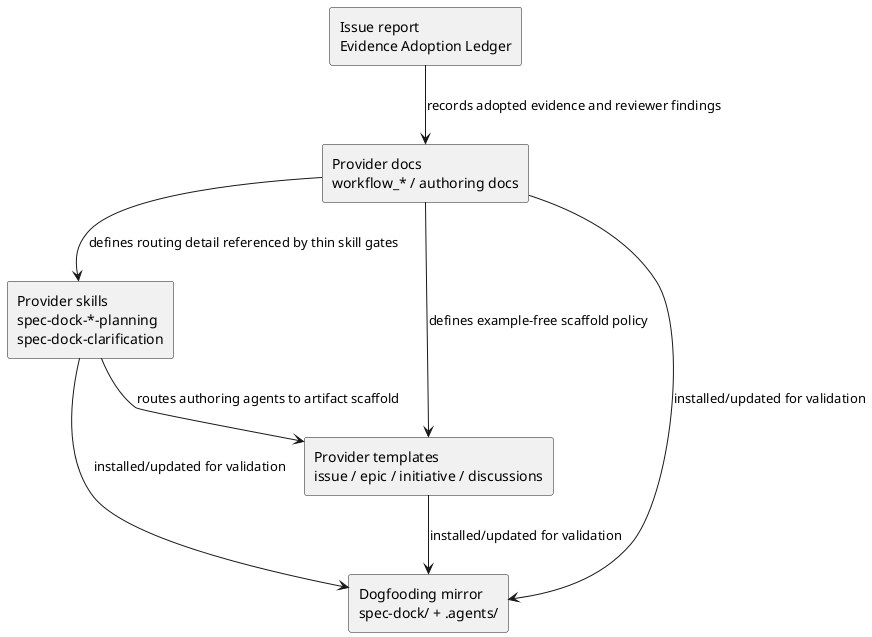

# iss-00196 Document Decision Implementation Layer Responsibilities — 設計（どう実現するか）

## 設計サマリー
- Workflow docs に decision responsibility / implementation responsibility の判断基準を置く。
- Planning / clarification skills は first-read routing と stop condition だけを薄く持ち、詳細説明は docs へ誘導する。
- Templates は final artifact scaffold として薄く保ち、具体例や authoring-only instruction は provider docs 側へ移す。
- Provider-side shipped assets を正本として更新し、dogfooding mirror は sync / validate / targeted inspection で確認する。

## 親図（Diagram）参照
- Epic 図:
  - `spec-dock/active/epic/design.md` の context-surface authority model。
- 再利用する決定:
  - Skills own operational workflow spine.
  - Docs own detailed semantics and examples.
  - Templates own thin scaffolds and evidence slots.
  - Provider source is shipped asset authority; dogfooding mirror is validation target.

## 目的・制約
- 目的:
  - Issue が decision-only container になっている場合に、Issue execution へ進まず Epic / Initiative / ADR / clarification へ戻せるようにする。
  - Authoring agent が具体例を参照できる一方、完成 spec artifact にはテンプレート由来の例や説明ノイズが残らないようにする。
- 必須:
  - Requirement AC-001 から AC-006 を満たす。
  - Parent Epic の clean-template policy と矛盾しない。
  - Provider-side source を先に設計対象にする。
- 禁止:
  - Runtime CLI enforcement、bot、schema enforcement、ADR registry をこの Issue に含めない。
  - Templates や skills に長い具体例を埋め込まない。
  - Dogfooding 固有の product / architecture name を shipped reusable templates に入れない。

## 既存実装 / 規約の理解
- 参照した実装 / docs:
  - `src/spec_dock/assets/spec_dock/docs/workflow_issue.md`
  - `src/spec_dock/assets/spec_dock/docs/workflow_epic.md`
  - `src/spec_dock/assets/spec_dock/docs/workflow_initiative.md`
  - `src/spec_dock/assets/spec_dock/docs/workflow_spec_authoring.md`
  - `src/spec_dock/assets/spec_dock/docs/phase_design.md`
  - `src/spec_dock/assets/spec_dock/docs/phase_plan_issue.md`
  - `src/spec_dock/assets/spec_dock/docs/authoring/issue-plan.md`
  - `src/spec_dock/assets/spec_dock/templates/{issue,epic,initiative,discussions}/`
  - `src/spec_dock/assets/install_root/.agents/skills/spec-dock-{issue-planning,epic-planning,initiative-planning,clarification}.md` 相当の shipped skill files。
- 現状理解:
  - Workflow docs already define Issue as implementation minimum unit and Epic as design backbone, but they do not provide an explicit decision-only routing gate.
  - Templates contain placeholder/example-shaped content that can remain in completed artifacts if not removed.
  - Planning skills contain workflow order and gates, but do not yet make decision-only issue detection a first-read stop condition.
- 採用するパターン:
  - Existing layered asset ownership: provider docs / templates / skills first, dogfooding mirror after sync.
  - Existing Spec Authoring Gate and Evidence Adoption Ledger in `report.md`.
  - Docs hold policy detail; skills route to docs.
- 採用しないもの:
  - Runtime-level enforcement.
  - Template-as-policy approach.
  - Skill-as-long-manual approach.

## 採用方針 / トレードオフ
- 論点:
  - Decision routing をどこに置くか。
- 決定:
  - Workflow docs: decision responsibility の入口、routing rule、`docs/authoring/decision-routing.md` への誘導を置く。
  - `docs/authoring/decision-routing.md`: 具体例、good / bad routing pattern、scope 別 decision placement の詳細を置く。
  - Skills: first-read の stop condition と next-doc routing だけを置く。
  - Templates: 最小 scaffold と readiness prompt だけを置き、具体例は置かない。
- トレードオフ:
  - Docs に詳細を寄せると authoring agent は追加参照が必要になるが、完成 artifact のノイズを避けられる。
  - Templates を薄くすると初回 authoring の補助は弱くなるが、downstream implementation agent に clean な仕様だけを渡せる。

## 依存関係分析
- module / surface 依存:
  - Provider docs define the semantic policy.
  - Skills reference provider docs and expose stop conditions.
  - Templates must not contradict docs and must not contain examples.
  - Dogfooding mirror validates installed surfaces.
- file 依存:
  - `workflow_issue.md` is upstream of issue planning and issue execution routing.
  - `workflow_epic.md` / `workflow_initiative.md` are upstream for promoted decisions.
  - `workflow_spec_authoring.md` provides phase promotion / delegated evidence policy.
  - `spec-dock-issue-planning/SKILL.md` and `spec-dock-clarification/SKILL.md` are first-read operational entrypoints.
  - Templates are downstream scaffold surfaces and should be updated after docs/skills wording is fixed.
- 実装起点:
  - S01 docs policy first.
  - S02 skill routing second.
  - S03 template thinning third.
  - S90 mirror/docs impact and validation.
- 順序への影響:
  - Template edits should follow docs/skills edits so thin scaffold checks have an authority source.

## モジュール依存図（Module Dependency Diagram）
- タイトル:
  - Decision routing context surface dependency
- 答える問い:
  - Which shipped surface owns decision-routing semantics, operational routing, and clean final artifact shape?
- 範囲:
  - Provider shipped docs / skills / templates and dogfooding mirror validation.
- 含めない詳細:
  - Python runtime call graph, GitHub issue sync internals, CLI enforcement.
- 更新条件:
  - Decision routing authority or shipped asset ownership changes.



## インターフェース契約
- Workflow docs contract:
  - Provide a durable decision-routing rule:
    - Issue owns implementation-ready local work and lightweight reversible decisions.
    - Epic owns cross-issue design backbone, ownership boundaries, dependency direction, and workflow decomposition.
    - Initiative owns cross-epic product / operating-model / investment decisions.
  - Route generic concrete examples to `docs/authoring/decision-routing.md`, not templates.
- Skill contract:
  - Before authoring or execution handoff, identify decision-only issues.
  - If cross-issue / cross-epic decision is detected, stop and route to the appropriate scope instead of absorbing the gap into execution assumptions.
  - Keep the skill body concise and link to docs for detailed examples.
- Template contract:
  - Template body may contain headings, minimal prompts, and final-artifact fields.
  - Template body must not contain generic examples, product-specific examples, or long instructional prose that would remain in completed artifacts.
- Report contract:
  - Record evidence adoption, reviewer findings, delegated draft fallback, and authoring gate pass/fail status.

## ディレクトリ / ファイル変更計画
```text
.
|-- src/spec_dock/assets/
|   |-- spec_dock/
|   |   |-- docs/
|   |   |   |-- workflow_issue.md              # 変更: Issue decision-only routing and execution stop condition
|   |   |   |-- workflow_epic.md               # 変更: Epic-owned decision examples / routing destination
|   |   |   |-- workflow_initiative.md         # 変更: Initiative-owned decision examples / routing destination
|   |   |   |-- workflow_spec_authoring.md     # 変更: authoring-phase decision gap handling and docs-vs-template boundary
|   |   |   `-- authoring/
|   |   |       `-- decision-routing.md      # 追加: reusable concrete examples and good/bad routing patterns
|   |   `-- templates/
|   |       |-- issue/*.md                     # 変更: remove example/prose noise; keep minimal scaffold
|   |       |-- epic/*.md                      # 変更: align thin scaffold language
|   |       |-- initiative/*.md                # 変更: align thin scaffold language if affected
|   |       `-- discussions/*.md             # 変更: only if examples/instructional noise remain
|   `-- install_root/
|       `-- .agents/skills/
|           |-- spec-dock-issue-planning/SKILL.md      # 変更: thin decision-only gate
|           |-- spec-dock-epic-planning/SKILL.md       # 変更: thin cross-issue design routing
|           |-- spec-dock-initiative-planning/SKILL.md # 変更: thin cross-epic decision routing if needed
|           `-- spec-dock-clarification/SKILL.md       # 変更: unresolved decision gap routing if needed
|-- spec-dock/                              # dogfooding mirror; refresh/inspect, not primary implementation source
`-- tests/
    `-- unit/infra or cli_runtime           # 変更: scaffold/update regression assertions if template structure changes
```

## 要件 → 設計マッピング
- AC-001:
  - Workflow docs define Initiative / Epic / Issue decision responsibility.
  - Planning skills expose a thin stop/routing gate.
- AC-002:
  - `spec-dock-issue-planning` and `spec-dock-clarification` get decision-only detection wording.
- AC-003:
  - `docs/authoring/decision-routing.md` holds generic concrete examples and good / bad patterns.
- AC-004:
  - Provider templates are inspected and updated so generated completed artifacts do not retain examples or authoring-only prose.
- AC-005:
  - `report.md` keeps EAL / decision ledger entries for research, consultant advice, user decisions, reviewer findings, and delegated fallback.
- AC-006:
  - Plan includes final spec review plus docs/template/skill inspection gates.

## 要件 / 例外 -> 検証マッピング
- AC-001 / AC-002:
  - `rg` checks for decision-routing wording in provider docs and skills.
  - Fresh `spec-reviewer` docs/spec alignment review.
- AC-003:
  - Inspect `docs/authoring/decision-routing.md` for concrete generic examples.
  - Inspect skills/templates to ensure examples are not duplicated there.
- AC-004:
  - Targeted `rg` over provider templates for `例:`, `example`, `サンプル`, placeholder sample prose, and dogfooding-specific terms.
  - Dogfooding mirror inspection after sync/update if applicable.
- AC-005:
  - `report.md` EAL / Spec Authoring Gate rows contain adopted evidence and reviewer pass/fail history.
- EC-001:
  - Docs explain lightweight Issue-local decisions and report-only/no-action disposition.
- EC-002 / EC-003:
  - Docs and skills explain Epic / Initiative routing for durable decisions.
- EC-004:
  - Docs contain examples; templates do not.

## テスト戦略
- Docs / skill text verification:
  - Use targeted `rg` to confirm required routing terms exist in provider docs/skills.
  - Use targeted `rg` to detect forbidden examples/noise in templates.
- Scaffold/update verification:
  - Run `./spec-dock/scripts/spec-dock validate`.
  - Run focused pytest only if template or installer behavior changes affect generated output tests.
  - Run `./spec-dock/scripts/spec-dock sync` or equivalent dogfooding refresh only after provider asset edits when needed.
- Reviewer verification:
  - Fresh `spec-reviewer` after canonical `design.md`.
  - Fresh `spec-reviewer` after canonical `plan.md`.
  - During execution, docs/template/skill steps use `spec-reviewer` as step reviewer; code/scaffold behavior tests use `code-reviewer` if runtime/test behavior changes.

## リスク / 移行 / ロールバック
- Risk: Over-thinning skills may hide mandatory first actions.
  - Mitigation: Skills keep explicit stop condition and next-doc routing.
- Risk: Moving examples to docs may make templates less helpful during authoring.
  - Mitigation: Docs contain generic concrete examples and skills point to those docs.
- Risk: Template cleanup may remove useful final-artifact fields.
  - Mitigation: Templates may keep minimal prompts/checklists that remain meaningful after completion.
- Risk: Dogfooding mirror diverges from provider source.
  - Mitigation: validate/sync/inspection and report evidence.
- Rollback:
  - Revert provider docs/skills/templates changes for this issue.
  - Dogfooding mirror can be regenerated from provider source using existing update/sync workflow.

## 委任 / fallback 設計
- `system-architect` direct-write delegated design draft was skipped for this run because the target issue `discussions/` subtree already contains untracked current-authoring artifacts, making static direct-write diff guard adoption-ineligible.
- Manual design authoring is valid fallback under `workflow_spec_authoring.md` as long as:
  - fallback reason is recorded in `report.md`;
  - canonical `design.md` remains main-orchestrator-owned;
  - fresh `spec-reviewer` reviews the canonical `design.md`.

## 未確定事項
- Blocking な未確定事項はない。
- 設計判断:
  - 具体例と good / bad routing pattern は新規 `src/spec_dock/assets/spec_dock/docs/authoring/decision-routing.md` に集約する。
  - Existing workflow docs は decision responsibility の入口と routing rule を持ち、詳細例は新規 authoring doc へ誘導する。
  - Plan phase はこの設計判断を前提に、provider docs、skills、templates、dogfooding mirror、tests の step split を固定する。
