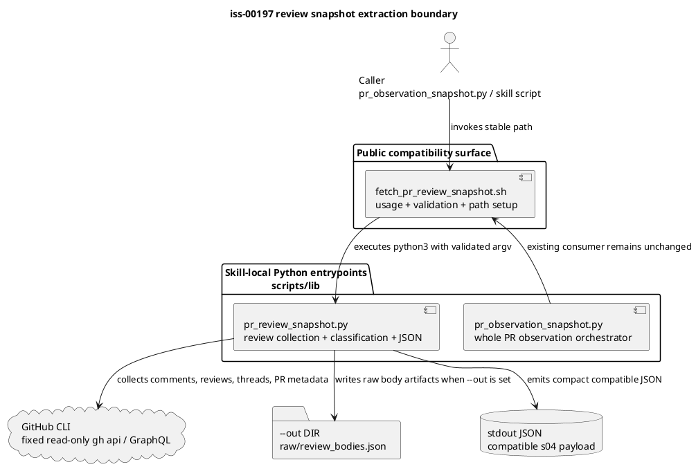

# iss-00197 Extract Python From PR Review Snapshot Script — 設計

## 親図（Diagram）参照
- Epic design:
  - `epic-00158` は provider-side source を shipped asset の正本、dogfooding mirror を validation surface として扱う。
  - Delegated draft は evidence であり、canonical `design.md` / `report.md` へ main orchestrator が採用して初めて authoring evidence になる。
- 再利用する決定:
  - Provider-side authority: `src/spec_dock/assets/install_root/`
  - Dogfooding mirror: `.agents/`
  - Public wrapper path compatibility: `.agents/skills/github-pr-observation/scripts/lib/fetch_pr_review_snapshot.sh`

## 目的・制約
- 目的:
  - `fetch_pr_review_snapshot.sh` に残る Python heredoc を独立した Python entrypoint に抽出し、shell wrapper と review snapshot 判定ロジックの責務を分離する。
  - 既存 caller は引き続き `fetch_pr_review_snapshot.sh` を呼べるようにし、JSON payload / exit code / stderr redaction contract を維持する。
- 必須:
  - provider-side source と dogfooding mirror の両方で heredoc を解消する。
  - review snapshot semantics、completion signal、unresolved thread 判定、fallback signal policy は変更しない。
  - `pr_observation_snapshot.py` は引き続き public wrapper script を呼び出す。
- 禁止:
  - caller-provided GitHub API endpoint、GraphQL query、`gh` arguments、headers、bodies、methods を受け付ける拡張。
  - `selected_comments == 0` などを新しい completion signal として扱う設計変更。
  - dogfooding mirror だけの修正。
- 前提:
  - `iss-00187` / PR #190 は merge 済みであり、この issue は follow-up extraction に限定する。

## 既存実装 / 規約の理解
- 参照した実装:
  - `src/spec_dock/assets/install_root/.agents/skills/github-pr-observation/scripts/lib/fetch_pr_review_snapshot.sh`
  - `.agents/skills/github-pr-observation/scripts/lib/fetch_pr_review_snapshot.sh`
  - `src/spec_dock/assets/install_root/.agents/skills/github-pr-observation/scripts/lib/pr_observation_checks.py`
  - `src/spec_dock/assets/install_root/.agents/skills/github-pr-observation/scripts/lib/pr_observation_snapshot.py`
  - `src/spec_dock/assets/install_root/.agents/skills/github-pr-observation/scripts/lib/pr_observation_wait.py`
- 現状理解:
  - 現行 `fetch_pr_review_snapshot.sh` は shell で argv validation を行い、`OBS_*` env vars を設定して `python3 - <<'PY'` に大きな Python body を渡している。
  - 既存の checks / observation / wait collector は `scripts/lib/` 直下の `.py` entrypoint と shell wrapper の組み合わせへ分離済みである。
  - `pr_observation_snapshot.py` は review collector を直接 Python import せず、public wrapper `fetch_pr_review_snapshot.sh` を呼ぶ。
- 採用するパターン:
  - skill-local `scripts/lib/` 直下に Python entrypoint を置く既存パターンに揃える。
  - shell wrapper は usage、argument shape validation、relative path resolution、Python process invocation を担当する。
- 採用しないもの:
  - 新しい `scripts/lib/python/` subdirectory は作らない。既存 pattern から外れ、path / mirror / tests の複雑性だけが増えるため。
  - helper 共通化や横断 refactor は行わない。behavior-preserving extraction のリスクを増やすため。

## 採用方針 / トレードオフ
- 決定:
  - 抽出先は `scripts/lib/pr_review_snapshot.py` とする。
  - public script identity は `fetch_pr_review_snapshot.sh` のまま維持し、JSON payload 内の `"script": "fetch_pr_review_snapshot.sh"` も維持する。
  - wrapper-to-Python boundary は argv を基本にする。既存 standalone Python entrypoint と同じく直接 smoke-test しやすくするため。
  - ただし shell 側の public validation contract は維持し、Python 側の defensive parse が user-visible な追加制約を作らないようにする。
- Tradeoff:
  - `OBS_*` env vars のみを内部 contract として残すと機械的移植は簡単だが、Python entrypoint の単体実行性が低い。
  - argv 境界に寄せると実装時の移植量は増えるが、抽出後の保守性とテスト容易性が上がる。

## 依存関係分析
- file 依存:
  - `pr_observation_snapshot.py` -> `fetch_pr_review_snapshot.sh` -> `pr_review_snapshot.py` -> `gh`
  - `fetch_pr_review_snapshot.sh` は public compatibility surface として残る。
  - `pr_review_snapshot.py` は review snapshot logic を self-contained に持つ。
- 上流 / 前提:
  - reviewer-pass 済み `requirement.md`
  - existing wrapper arguments and validation behavior
  - existing JSON snapshot contract
- 下流 / 依存先:
  - `pr_observation_snapshot.py`
  - `wait_pr_observation.sh` / `pr_observation_wait.py`
  - PR merge-preparer / observation skill users
- 実装起点:
  - まず provider-side に `pr_review_snapshot.py` を追加し、wrapper がそれを呼ぶ薄い shape にする。
  - 次に dogfooding mirror へ同等反映する。

## モジュール依存図（Module Dependency Diagram）
- タイトル:
  - iss-00197 review snapshot extraction boundary
- 答える問い:
  - extraction 後に wrapper と Python entrypoint の責務境界がどこに置かれるか。
- 範囲:
  - `github-pr-observation` skill の review snapshot collector のみ。
- 含めない詳細:
  - checks collector、wait loop policy、新しい GitHub API signal design。
- 更新条件:
  - public wrapper contract、collector entrypoint location、JSON contract が変わるとき。



## インターフェース契約
- Public command:
  - `fetch_pr_review_snapshot.sh --repo OWNER/REPO --pr NUMBER [options]`
- Accepted argv:
  - `--repo OWNER/REPO` required
  - `--pr NUMBER` required
  - `--head-sha SHA` optional
  - `--trigger-comment-id NUMBER` optional
  - `--trigger-created-at ISO8601` optional
  - `--body-mode none|trigger-window-truncated|trigger-window-full|out-only` optional, default `trigger-window-truncated`
  - `--out DIR` optional
- Env:
  - New mandatory caller-facing env vars are not introduced.
  - `GH_TOKEN` / `GITHUB_TOKEN` continue to be consumed indirectly by `gh`.
  - Existing `OBS_*` env vars may be removed or retained only as an internal compatibility bridge; they are not promoted as a public contract.
- stdout:
  - Compact JSON payload remains parseable and compatible with current top-level contract.
  - `script` remains `fetch_pr_review_snapshot.sh`.
  - `collector` remains `s04`.
  - `review`, `decision`, `codex_review`, `trigger`, `limitations`, `fingerprint`, `decision_fingerprint`, and `audit_fingerprint` remain compatible.
- stderr / failure:
  - invalid wrapper usage returns `64` and prints usage to stderr.
  - `--help` returns `0`.
  - GitHub command stderr is not copied into stdout JSON.
  - failure metadata continues to use redacted fields such as `stderr_sha256`.
  - Python process failure propagates through the wrapper.
- `--out`:
  - If absent, no output directory is created.
  - If present, `raw/review_bodies.json` behavior remains compatible.
  - Observation-level artifacts such as `result.json` remain outside this collector.

## ディレクトリ / ファイル変更計画
```text
src/spec_dock/assets/install_root/.agents/skills/github-pr-observation/scripts/lib/
|-- fetch_pr_review_snapshot.sh  # 変更: heredoc を削除し、薄い wrapper として pr_review_snapshot.py を起動
`-- pr_review_snapshot.py       # 追加: review snapshot collection / classification / JSON assembly

.agents/skills/github-pr-observation/scripts/lib/
|-- fetch_pr_review_snapshot.sh  # 変更: provider-side と同等の dogfooding mirror
`-- pr_review_snapshot.py       # 追加: provider-side と同等の dogfooding mirror

tests/unit/infra/
`-- test_init_update.py          # 変更/追加: installed asset presence、heredoc 消滅、wrapper contract、representative JSON parity を検証
```

## 要件 → 設計マッピング
- AC-001 -> wrapper から embedded Python heredoc を削除し、provider/mirror に対する `rg` inspection で確認する。
- AC-002 -> `pr_review_snapshot.py` を追加し、public wrapper invocation 経由で既存 review snapshot behavior を維持する。
- AC-003 -> provider-side source と dogfooding mirror の wrapper / Python entrypoint 同等性を検証する。
- EC-001 -> Python process failure and invalid invocation path は wrapper exit code / stderr contract で維持する。
- EC-002 -> malformed GitHub / fake `gh` responses は現行 classification / limitation metadata を変えずに返す。

## テスト戦略
- 静的構造:
  - provider / mirror の `fetch_pr_review_snapshot.sh` に `python3 - <<'PY'` / `<<PY` / heredoc body が残っていないこと。
  - provider / mirror の wrapper と `pr_review_snapshot.py` が同等であること。
- CLI contract:
  - invalid args は wrapper が `64` を返す。
  - `--help` は `0` を返し usage を表示する。
  - public wrapper invocation を通して stdout JSON が parseable であること。
- behavior preservation:
  - 代表 fixture で `review.status`、`decision.status_reason`、`recommended_next_action`、`limitations` classification、fingerprint inputs が分離前と一致すること。
  - `--out` absent / present の behavior を確認する。
- integration smoke:
  - `pr_observation_snapshot.py` または wrapper-level test で、上位 consumer が引き続き `fetch_pr_review_snapshot.sh` を呼べること。

## 要件 / 例外 -> 検証マッピング
- AC-001:
  - `rg -n "python3 - <<'PY'|<<PY|<<'PY'"` against provider / mirror wrappers -> no matches for embedded Python heredoc.
- AC-002:
  - focused pytest / shell smoke using fake `gh` fixtures -> pass.
- AC-003:
  - `cmp` / `diff` between provider and mirror wrapper / Python entrypoint -> expected equivalence.
- EC-001:
  - invalid args / Python failure path tests -> existing exit and stderr behavior preserved.
- EC-002:
  - malformed API fixture tests -> existing limitation and fallback classification preserved.

## リスク / 移行 / ロールバック
- リスク:
  - top-level heredoc を function / entrypoint 化すると、evaluation order、global variable initialization、trigger/body state が変わる可能性がある。
  - Python 側に新しい validation を入れると、既存 wrapper の `64` usage failures と異なる user-visible behavior になる可能性がある。
  - `script` / `collector` / `decision` / `review.current` / `review.audit` / fingerprint source fields の変更は downstream observation logic を壊す可能性がある。
  - provider と dogfooding mirror の片側だけを更新すると shipped asset と validation surface が drift する。
- 移行:
  - 既存 caller は引き続き `fetch_pr_review_snapshot.sh` を使うため migration step は不要。
- ロールバック:
  - provider wrapper と mirror wrapper を extraction 前へ戻し、追加した `pr_review_snapshot.py` を削除する。
  - 実装後は通常の git revert を優先し、dogfooding mirror だけを手動で戻さない。

## 未確定事項
- none.
