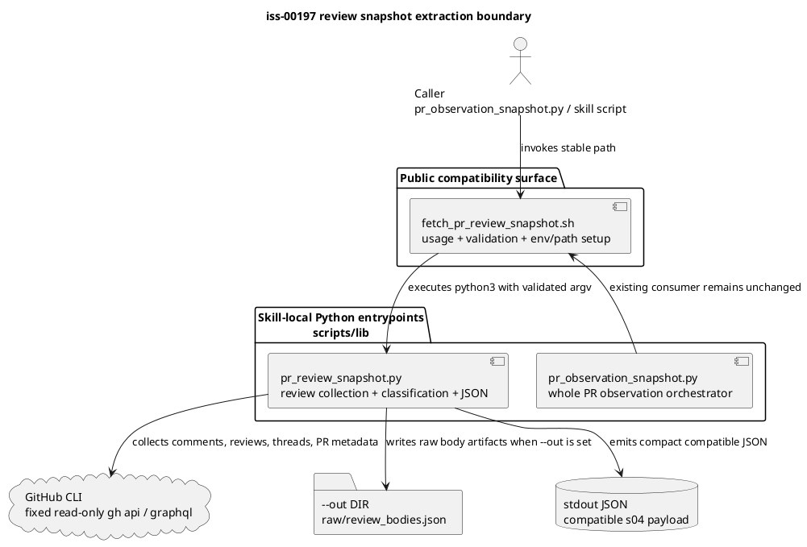

# Review Snapshot Python Extraction Design Draft

This is delegated architecture evidence for `iss-00197`. It does not edit or supersede canonical `design.md` / `report.md`, does not claim reviewer pass, and does not claim implementation readiness.

## 1. Requirement Coverage

- Covered requirement: remove the large Python heredoc from `fetch_pr_review_snapshot.sh` and move it into an independent Python entrypoint.
- Covered requirement: preserve the public wrapper path `.agents/skills/github-pr-observation/scripts/lib/fetch_pr_review_snapshot.sh`.
- Covered requirement: keep review snapshot classification semantics, JSON shape, stderr behavior, and exit-code behavior compatible with the existing script.
- Covered requirement: treat `src/spec_dock/assets/install_root/` as source of record and keep the dogfooding mirror under `.agents/` equivalent.
- Covered non-goal: no new GitHub API signal design, no change to completion-signal policy, no changes to unrelated PR observation scripts.

## 2. Existing Context Findings

- `spec-dock/active/issue/requirement.md` frames this as the follow-up to `iss-00187`; the open design choice is extraction target location and wrapper-to-Python contract.
- `spec-dock/active/issue/report.md` already records requirement-phase evidence and expects delegated draft evidence to remain `unreviewed` until the main orchestrator adopts it.
- `spec-dock/active/epic/design.md` establishes provider-side assets as the authority and dogfooding mirror as validation surface.
- Provider and dogfooding copies of `fetch_pr_review_snapshot.sh` currently match byte-for-byte.
- Current wrapper validates `--repo`, `--pr`, `--head-sha`, `--trigger-comment-id`, `--trigger-created-at`, `--body-mode`, and `--out`, then exports `OBS_*` variables into `python3 - <<'PY'`.
- Existing extracted Python entrypoints already live next to wrappers in `scripts/lib/`: `pr_observation_checks.py`, `pr_observation_snapshot.py`, and `pr_observation_wait.py`.
- `pr_observation_snapshot.py` is the closest precedent for a standalone entrypoint: it parses argv, calls sibling shell collectors, writes JSON to stdout, and optionally writes artifacts under `--out`.

## 3. Design Decisions

- Extract the heredoc body to `scripts/lib/pr_review_snapshot.py` under the same skill-local `lib/` directory.
- Keep `fetch_pr_review_snapshot.sh` as the public compatibility wrapper and make it thin: usage text, argument validation, environment setup if still needed, path resolution, and Python invocation only.
- Prefer argv as the wrapper-to-Python boundary for user-visible inputs, because existing standalone entrypoints in this directory use argv and it keeps the Python entrypoint directly smoke-testable.
- Preserve the current shell validation as the first compatibility guard. The Python entrypoint may parse the same argv defensively, but must not introduce stricter user-visible validation unless a test proves it is already equivalent.
- Preserve the script identity in JSON as `"script": "fetch_pr_review_snapshot.sh"` so downstream consumers do not observe a new script name.

## 4. Alternatives Considered

- Put the extracted file in a new `scripts/lib/python/` directory: rejected for this issue because the existing local pattern already places Python entrypoints directly in `scripts/lib/`; a new subdirectory adds path and mirror complexity without reducing risk.
- Keep `OBS_*` as the only Python input contract: rejected as the primary design because it keeps the entrypoint harder to run directly and differs from `pr_observation_snapshot.py`; acceptable only as an internal compatibility bridge if implementation risk requires a staged extraction.
- Rename or replace the public wrapper path: rejected by the requirement and by downstream compatibility risk.
- Refactor review classification while extracting: rejected. The requirement is a mechanical boundary extraction with no behavior/semantics change.

## 5. Boundary / Contract Model

- Public command remains `fetch_pr_review_snapshot.sh`.
- Shell owns:
  - public usage text and `-h|--help`;
  - argument presence and shape validation;
  - `owner/name` split if useful for Python invocation;
  - resolving the Python entrypoint relative to the wrapper;
  - invoking `python3` and preserving its exit code.
- Python owns:
  - GitHub REST / GraphQL collection through fixed read-only `gh api` calls;
  - trigger inference and body collection caps;
  - review signal normalization;
  - thread classification;
  - decision, audit, fingerprint, and top-level JSON assembly;
  - optional `--out` artifact write behavior.
- The shell must not contain embedded Python source after extraction.
- The Python entrypoint must not accept caller-provided API endpoints, GraphQL queries, `gh` arguments, headers, bodies, or methods.

## 6. Dependency Analysis

- Runtime dependency direction remains wrapper -> Python entrypoint -> `gh`.
- `pr_observation_snapshot.py` continues to call `fetch_pr_review_snapshot.sh`, not the new Python file directly, preserving the public script dependency.
- The extracted Python file should remain self-contained for review snapshot logic; it should not import `pr_observation_snapshot.py` because that module is a higher-level orchestrator.
- Shared helper extraction is not required for this issue. Duplication with `pr_observation_checks.py` can be revisited only if a later issue targets cross-collector helper cleanup.

## 7. Source of Record

- Provider authority: `src/spec_dock/assets/install_root/.agents/skills/github-pr-observation/scripts/lib/`.
- Dogfooding mirror: `.agents/skills/github-pr-observation/scripts/lib/`.
- Canonical planning authority remains with the main orchestrator in `spec-dock/active/issue/{design,report}.md`.
- This file is discussion evidence only and should be referenced from `report.md` before any adopted content is rewritten into `design.md`.

## 8. Data Flow / Domain Model / Interface Contract

Interface contract:

- argv accepted by wrapper and Python entrypoint:
  - `--repo OWNER/REPO` required.
  - `--pr NUMBER` required.
  - `--head-sha SHA` optional.
  - `--trigger-comment-id NUMBER` optional.
  - `--trigger-created-at ISO8601` optional.
  - `--body-mode none|trigger-window-truncated|trigger-window-full|out-only` optional, default `trigger-window-truncated`.
  - `--out DIR` optional.
- env:
  - Existing GitHub auth environment such as `GH_TOKEN` / `GITHUB_TOKEN` is consumed only indirectly by `gh`.
  - New mandatory caller-facing env vars should not be introduced.
  - Internal `OBS_*` env vars may be removed from the wrapper or retained only as an implementation bridge; they are not a new public contract.
- stdout:
  - One compact JSON payload with the same top-level keys and compatible values as the current heredoc output.
  - `script` remains `fetch_pr_review_snapshot.sh`.
  - `collector` remains `s04`.
  - `review`, `decision`, `codex_review`, `trigger`, `limitations`, `fingerprint`, `decision_fingerprint`, and `audit_fingerprint` remain compatible.
- stderr:
  - Wrapper usage text remains on invalid invocation.
  - GitHub command stderr must not be printed directly into normal stdout JSON.
  - Existing failure records that include `stderr_sha256` remain redacted and hash-based.
- exit code:
  - Invalid wrapper usage remains `64`.
  - `--help` remains `0`.
  - Successful collection, including JSON with blocking limitations, remains `0` where the current script returns `0`.
  - Python process failure propagates through the wrapper.
- `--out` behavior:
  - If absent, no output directory is created and stdout is the only artifact.
  - If present, create `<out>/raw` and write `raw/review_bodies.json` exactly as the current script does for `out-only` body artifacts.
  - Do not add `result.json`, `latest.json`, or observation-level artifacts here; those belong to `pr_observation_snapshot.py`, not the review collector.

## 9. File / Module Change Plan

- Provider-side changes:
  - Add `src/spec_dock/assets/install_root/.agents/skills/github-pr-observation/scripts/lib/pr_review_snapshot.py`.
  - Replace the heredoc in `src/spec_dock/assets/install_root/.agents/skills/github-pr-observation/scripts/lib/fetch_pr_review_snapshot.sh` with a relative Python invocation.
- Dogfooding mirror changes:
  - Add `.agents/skills/github-pr-observation/scripts/lib/pr_review_snapshot.py`.
  - Mirror the wrapper change in `.agents/skills/github-pr-observation/scripts/lib/fetch_pr_review_snapshot.sh`.
- Test changes, if adopted by the implementation plan:
  - Add or update focused tests that assert both provider and mirror wrappers have no `python3 - <<'PY'` heredoc.
  - Add a fixture-backed parity test or smoke test for representative JSON output.
  - Extend scaffold/update tests if they currently assert exact installed skill files.

## 10. Migration / Compatibility / Rollback

- Migration is in-place: existing callers keep using `fetch_pr_review_snapshot.sh`.
- No migration is required for downstream JSON consumers if the payload remains compatible.
- Rollback path is to restore the provider wrapper and remove the extracted provider/mirror Python file before adoption; after implementation, rollback should be through normal git revert rather than dogfooding-only edits.
- Compatibility guard: `pr_observation_snapshot.py` must continue invoking `fetch_pr_review_snapshot.sh` successfully.

## 11. Observability

- Inspection signals:
  - `rg -n "python3 - <<'PY'|<<PY|<<'PY'"` against provider and mirror wrappers should find no embedded Python heredoc.
  - `cmp` or `diff` between provider and mirror wrapper/Python files should show expected equivalence.
- Runtime signals:
  - JSON stdout should remain compact and parseable.
  - Blocking GitHub/API failures should continue to appear as structured `limitations` entries, not as unstructured wrapper output.
- Report adoption signal:
  - `report.md` should record this draft path in Delegated Draft Evidence and, if used, Evidence Adoption Ledger.

## 12. Test Strategy

- Static structure tests:
  - Assert no heredoc marker remains in both `fetch_pr_review_snapshot.sh` copies.
  - Assert provider and dogfooding mirror have the same wrapper and extracted Python content.
- Contract tests:
  - Invalid args still return `64` from the wrapper.
  - `--help` still returns `0` and prints usage.
  - Representative success/failure fixtures produce the same review `status`, `decision.status_reason`, `recommended_next_action`, `limitations` classification, and fingerprint inputs as before.
- Integration smoke:
  - Run the public wrapper, not only the Python entrypoint, because downstream callers depend on the wrapper path.
  - Run `pr_observation_snapshot.py` or its wrapper-level test if available, because it is the main consumer of `fetch_pr_review_snapshot.sh`.
- Failure modes to cover:
  - `gh api` non-zero exit.
  - GraphQL non-JSON or schema-unavailable response.
  - invalid trigger timestamp.
  - `--out` absent and present.
  - stale head and unresolved thread scenarios if existing fixtures are available.

## 13. ADR Candidates

- No ADR is required for the local extraction decision.
- A future ADR may be useful only if the project decides to standardize all skill-local Python entrypoints, helper sharing, or shell wrapper contracts across multiple skills.

## 14. Risks

- Parity risk: moving top-level Python code into functions can accidentally change evaluation order, variable initialization, or closure over trigger/body state.
- Exit-code risk: adding Python-side validation can change the wrapper's existing `64` usage failures or introduce non-compatible tracebacks.
- JSON compatibility risk: changing `script`, `collector`, `decision`, `review.current`, `review.audit`, `body_mode`, or fingerprint source fields can break downstream observation logic.
- Mirror drift risk: provider and dogfooding copies can diverge if the implementation edits only one side.
- Over-refactor risk: extracting shared helpers during this issue can obscure the no-semantics-change objective.

## 15. Requirement Clarification Requests

- none.

The requirement is sufficient for design: place the entrypoint beside existing skill-local Python files, keep the wrapper public and thin, preserve behavior, and mirror provider changes into dogfooding validation surface.

## 16. Integration Notes for Main Orchestrator

- Suggested `design.md` adoption:
  - Record `pr_review_snapshot.py` in `scripts/lib/` as the selected extraction target.
  - Record wrapper/Python responsibility split and the no-semantics-change guard.
  - Include the interface contract for argv/env/stdout/stderr/exit code/`--out`.
  - Include provider-first and dogfooding mirror equivalence as explicit design guardrails.
- Suggested `report.md` adoption:
  - Update Delegated Draft Evidence from `not used` to this draft path with lifecycle `produced`.
  - Add an Evidence Adoption Ledger row only for portions actually adopted into canonical `design.md`.
  - Keep `adoption_status` unreviewed here until the main orchestrator integrates and a fresh `spec-reviewer` reviews canonical artifacts.

Module dependency diagram:

