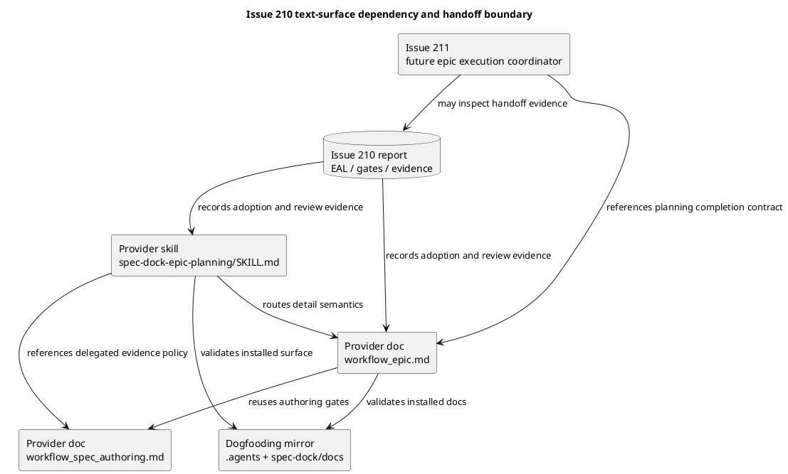
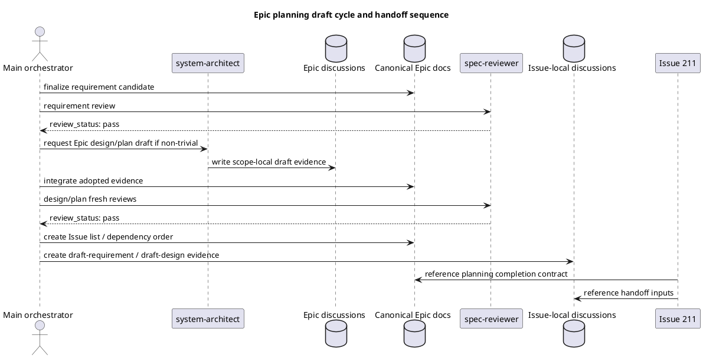

# iss-00210 Epic Planning System Architect Draft Cycles — 設計（どう実現するか）

## 親図（Diagram）参照
- Epic 図:
  - 親 Epic `epic-00158` の context-surface authority model を前提にする。Skills は first-read workflow spine、docs は detail semantics、templates は thin scaffold、discussion drafts は adoption 前の evidence である。
- Initiative 図:
  - N/A: この Issue は `init-local-00003` の architecture maintenance 内の agent-facing workflow text change であり、system context / runtime architecture を変更しない。
- 再利用する決定:
  - Parent Epic E-RQ-001 / E-RQ-002 / E-RQ-005 / E-RQ-007。
  - Issue 210 clarification: Option B を採用し、Issue 210 は Epic planning completion / handoff contract を定義する。Issue 211 は独立 Issue としてその成果を参照できる。
  - Requirement reviewer gate: dogfooding mirror validation は optional ではなく、AC-008 で閉じる。

## 目的・制約
- 目的:
  - `spec-dock-epic-planning` の first-read surface に、非自明な Epic planning で `system-architect` draft cycle を使う operational spine を追加する。
  - `workflow_epic.md` に Epic planning completion / handoff contract と cross-issue draft package semantics を置く。
  - 既存の delegated authoring policy は `workflow_spec_authoring.md` を正本として再利用し、必要な場合だけ短い cross-reference を追加する。
- 必須:
  - Provider-side source を正本として変更する。
  - Dogfooding mirror は validation target とし、選択した経路の証跡を `report.md` に残す。
  - Delegated draft は scope-local discussion evidence のまま扱い、canonical authority を主張しない。
- 禁止:
  - Issue 210 で `spec-dock-epic-execution` skill を追加しない。
  - Issue execution lifecycle、`issue start` / `issue finish`、PR merge preparation をこの Issue の実装対象にしない。
  - Skill に詳細 policy を全文コピーして肥大化させない。
- 非交渉制約:
  - `review_status: pass` 以外を phase promotion に使わない。
  - Issue 210 と Issue 211 は独立 Issue として扱う。
  - Issue dependencies は command-first mutation を使う。

## 既存実装 / 規約の理解
- 参照した実装 / docs:
  - `src/spec_dock/assets/install_root/.agents/skills/spec-dock-epic-planning/SKILL.md`
  - `src/spec_dock/assets/spec_dock/docs/workflow_epic.md`
  - `src/spec_dock/assets/spec_dock/docs/workflow_spec_authoring.md`
  - `src/spec_dock/assets/spec_dock/docs/workflow_issue.md`
  - `spec-dock/docs/workflow_epic.md`
  - `spec-dock/docs/workflow_spec_authoring.md`
  - `spec-dock/docs/workflow_issue.md`
  - `spec-dock/docs/authoring/decision-routing.md`
- 現状理解:
  - `spec-dock-epic-planning/SKILL.md` は薄い routing surface で、fresh `spec-reviewer` gate と bounded delegation の基本境界を持つ。
  - `workflow_spec_authoring.md` は canonical single-writer authority、scope-local discussion draft、EAL、reviewer gate、failure mode をすでに詳しく持つ。
  - `workflow_epic.md` は Epic 作成、Issue 作成、dependency command、Epic が cross-issue design backbone を所有することを持つが、Epic planning completion / handoff package と cross-issue draft package はまだ明示していない。
  - `discussions/20260619t025013z-draft-design-issue-210-system-architect-draft-design.md` は事前 baseline を伴う formal diff guard を retroactive に成立させられないため、delegated promotion evidence としては採用しない。この canonical design は reviewed requirement、parent Epic、workflow docs、直接 inspection から main orchestrator が再構成したものとして扱う。
- 採用するパターン:
  - Skill は trigger / stop condition / routing / evidence obligation の first-read spine に限定する。
  - Epic-specific completion semantics は `workflow_epic.md` に置く。
  - Shared delegated authoring semantics は `workflow_spec_authoring.md` へリンクし、重複を避ける。
- 採用しないもの:
  - New runtime schema for handoff package。
  - Template-wide redesign。
  - Issue 211 execution workflow の先取り。

## 採用方針 / トレードオフ
- 論点:
  - Issue 210 の変更を skill-only に閉じるか、workflow docs に handoff semantics を置くか。
- 選択肢:
  - Skill-only: diff は小さいが、Issue 211 が planning completion を再発明しやすい。
  - Skill + `workflow_epic.md`: first-read と detailed semantics の責務境界を保ち、Issue 211 が参照できる handoff contract を残せる。
  - Broad docs/templates redesign: 後続は楽になるが、Issue 210 の scope を越える。
- 決定:
  - Skill + `workflow_epic.md` を採用する。
  - `workflow_spec_authoring.md` は既存 delegated authoring policy で足りる場合は変更しない。discoverability gap が design/implementation 中に確認された場合だけ、短い Epic planning cross-reference を追加する。

## 依存関係分析
- module / file 依存:
  - `src/spec_dock/assets/install_root/.agents/skills/spec-dock-epic-planning/SKILL.md`
    - first-read spine。ここが agent の最初の判断面。
  - `src/spec_dock/assets/spec_dock/docs/workflow_epic.md`
    - Epic-specific completion / handoff semantics。
  - `src/spec_dock/assets/spec_dock/docs/workflow_spec_authoring.md`
    - Shared delegated evidence / EAL / reviewer gate semantics。原則は参照のみ、必要時だけ短い追記。
  - `.agents/skills/spec-dock-epic-planning/SKILL.md`
  - `spec-dock/docs/workflow_epic.md`
  - `spec-dock/docs/workflow_spec_authoring.md`
    - Dogfooding mirror validation targets。
- 上流 / 前提:
  - Requirement gate pass。
  - Option B scope decision and Issue 210/211 independence boundary。
  - Parent Epic provider/mirror validation boundary。
- 下流 / 依存先:
  - Issue 211 can reference the planning completion / handoff contract after Issue 210 is integrated and reviewed.
  - Future Issue planning workflows can consume issue-local draft requirement/design as planning input.
- 実装起点:
  - Provider-side skill first-read spine。
  - Provider-side `workflow_epic.md` semantics。
  - Optional `workflow_spec_authoring.md` cross-reference only if needed。
  - Dogfooding mirror validation。

## モジュール依存図（Module Dependency Diagram）
- タイトル:
  - Issue 210 text-surface dependency and handoff boundary
- 答える問い:
  - どの source surface が workflow spine / detail semantics / mirror validation / downstream reference を所有するか。
- 範囲:
  - Provider-side skill/docs、dogfooding mirror、Issue 211 reference boundary。
- 含めない詳細:
  - Runtime CLI implementation、Issue 211 execution lifecycle、PR delivery。
- 更新条件:
  - first-read ownership、handoff contract owner、dogfooding validation route が変わるとき。

### 図表（UML / モジュール依存）


## ローカル図の差分
- 変更する境界 / 責務 / 相互作用:
  - Skill から docs への routing を強める。
  - Epic planning completion を `workflow_epic.md` に定義し、Issue 211 は downstream consumer として参照する。
  - Runtime / CLI / GitHub API の相互作用は変更しない。

## インターフェース契約
- Skill first-read contract:
  - Agent が `spec-dock-epic-planning/SKILL.md` だけを読んでも、非自明な Epic では `system-architect` discussion draft を検討すること、軽微な Epic では skip reason を残すこと、draft adoption は EAL と fresh reviewer gate を必要とすることが分かる。
- Epic workflow handoff contract:
  - Epic planning completion は、新 runtime schema ではなく、docs 上の expected output list と evidence obligations として定義する。
  - Expected output:
    - reviewer-gated Epic requirement/design/plan
    - Issue list and dependency order
    - dependency command evidence
    - cross-issue draft package
    - issue-local draft requirement/design artifact paths
    - known non-blocking deferrals and revisit conditions
- Issue-local draft creation contract:
  - Cross-issue package distribution must use the existing runtime-owned discussion creation path for each target Issue:
    - `./spec-dock/scripts/spec-dock new doc draft-requirement --issue <issue-id> --title "..."`
    - `./spec-dock/scripts/spec-dock new doc draft-design --issue <issue-id> --title "..."`
  - The returned `path=...` is the authoritative discussion artifact path.
  - Ad hoc file writes, metadata edits, or direct canonical issue doc edits are not valid substitutes for these issue-local draft artifacts.
- Delegated draft evidence contract:
  - `workflow_spec_authoring.md` の scope-local discussion draft / EAL / fresh reviewer gate policy を再利用する。
  - Delegated draft を canonical artifact へ採用する前に、委任前の baseline capture と委任後の formal diff guard pass を必須にする。
  - Formal diff guard は `./spec-dock/scripts/spec-dock delegated-authoring baseline-status --output <outside-repo-path>` と `./spec-dock/scripts/spec-dock delegated-authoring diff-guard --role <role> --scope <scope-id> --baseline-status <outside-repo-path>` の組で記録する。
  - Baseline capture 前に target scope `discussions/` が dirty で diff guard を成立させられない場合は、delegated draft を採用せず、manual authoring path / skip reason / rejection を `report.md` に記録する。
- Issue 211 reference contract:
  - Issue 211 は Issue 210 の handoff contract を参照してよいが、Issue 210 の acceptance / execution scope には含まれない。

## シーケンス差分
- 変更する相互作用:
  - Epic planning authoring sequence の docs guidance を変更する。
- retry / transaction / external API / queue:
  - N/A: runtime transaction / external API なし。
- UML:


## ドメインモデル差分
- 親 model 参照:
  - Context surface / workflow spine / evidence / adoption / dogfooding mirror from `epic-00158`。
- domain event / policy / specification 変更:
  - Policy delta: Non-trivial Epic planning should use `system-architect` draft evidence before canonical design / plan integration unless skip reason is recorded.
  - Policy delta: Cross-issue draft package is planning evidence, not canonical issue docs.
- 不変条件の変更:
  - No delegated role edits canonical docs.
  - No Issue 211 execution responsibility is added to Issue 210.
  - No heavyweight delegation is mandatory for every Epic.

## クラス / インターフェース詳細設計
- N/A:
  - This Issue changes shipped text surfaces only. No Python class / runtime interface is added.

## ディレクトリ / ファイル変更計画
```text
.
|-- src/spec_dock/assets/install_root/.agents/skills/
|   `-- spec-dock-epic-planning/SKILL.md
|       # 変更: first-read spine に conditional system-architect draft cycle、
|       # skip reason、EAL / reviewer gate、Issue 211 independence pointer を追加
|-- src/spec_dock/assets/spec_dock/docs/
|   |-- workflow_epic.md
|   |   # 変更: Epic planning completion / handoff contract、
|   |   # cross-issue draft package、issue-local draft evidence semantics、
|   |   # new doc draft-requirement/draft-design --issue command boundary を追加
|   |-- workflow_issue.md
|   |   # 参照/任意変更: 既存 new doc <type> --issue contract を再利用。
|   |   # workflow_epic.md から参照できれば変更不要
|   `-- workflow_spec_authoring.md
|       # 任意変更: 既存 delegated authoring policy で足りない discoverability gap がある場合だけ短い cross-reference
|-- .agents/skills/
|   `-- spec-dock-epic-planning/SKILL.md
|       # 検証対象: provider-side skill 更新後の dogfooding mirror
`-- spec-dock/docs/
    |-- workflow_epic.md
    |   # 検証対象: provider-side docs 更新後の dogfooding mirror
    |-- workflow_issue.md
    |   # 検証対象: 変更した場合のみ
    `-- workflow_spec_authoring.md
        # 検証対象: 変更した場合のみ
```

## 要件 → 設計マッピング
- AC-001 -> Skill first-read contract and `spec-dock-epic-planning/SKILL.md` update.
- AC-002 -> Delegated draft evidence contract and `workflow_spec_authoring.md` reuse.
  - Must include formal pre-delegation baseline and post-delegation diff guard evidence before adoption.
- AC-003 -> Epic workflow handoff contract in `workflow_epic.md`.
- AC-004 -> Cross-issue draft package semantics in `workflow_epic.md`.
- AC-005 -> Issue-local draft evidence boundary in `workflow_epic.md`, explicitly routed to existing `workflow_issue.md` `new doc draft-requirement/draft-design --issue` command contract.
- AC-006 -> Issue 211 reference contract and explicit non-scope boundary.
- AC-007 -> `workflow_epic.md` command-first dependency references.
- AC-008 -> Dogfooding mirror validation route in plan/report.
- EC-001 -> Skip reason wording in skill and `workflow_epic.md`.
- EC-002 -> Delegation unavailable fallback wording, reusing `workflow_spec_authoring.md`.
- EC-003 -> Requirement/design gap return wording.
- EC-004 -> Issue 211 independence / downstream reference boundary.

## テスト戦略
- 単体:
  - N/A: docs / skill text only.
- 統合:
  - `./spec-dock/scripts/spec-dock validate`
  - `./spec-dock/scripts/spec-dock sync`
  - Run after provider/mirror updates unless plan records a narrower mirror route with explicit no-run rationale.
- Docs-only / inspection:
  - Manual first-read smoke on provider-side `spec-dock-epic-planning/SKILL.md`.
  - Targeted `rg` for `system-architect`, `cross-issue draft`, `Evidence Adoption Ledger`, `diff guard`, `baseline-status`, `Issue 211`, `skip reason`, `spec-reviewer`.
  - Provider-vs-mirror targeted inspection for changed skill/docs.
  - Inspect that cross-issue package distribution wording names `new doc draft-requirement --issue` and `new doc draft-design --issue` instead of ad hoc writes.
- Negative inspection:
  - Confirm no wording grants `system-architect` canonical write authority.
  - Confirm no wording makes all Epics require heavyweight delegation.
  - Confirm no wording defines Epic execution coordinator behavior in Issue 210.

## 要件 / 例外 -> 検証マッピング
- AC-001 -> first-read smoke + targeted `rg`.
- AC-002 -> wording inspection for EAL / formal baseline-status + diff-guard / fresh reviewer / canonical authority.
- AC-003 -> `workflow_epic.md` inspection for planning completion before Issue decomposition.
- AC-004 -> `workflow_epic.md` inspection for cross-issue draft package.
- AC-005 -> wording inspection for issue-local draft evidence, canonical issue docs boundary, and explicit reuse of `new doc draft-requirement/draft-design --issue` command contract.
- AC-006 -> wording inspection that Issue 211 is independent downstream consumer only.
- AC-007 -> dependency command wording inspection.
- AC-008 -> provider/mirror validation evidence in `report.md` plus validate/sync or explicit no-run rationale.
- EC-001 -> skip reason wording inspection.
- EC-002 -> unavailable / fallback wording inspection.
- EC-003 -> gap-return wording inspection.
- EC-004 -> Issue 211 boundary wording inspection.

## リスク / 移行 / ロールバック
- リスク:
  - Skill が長くなり、docs と重複する。
    - 対応: skill は trigger / stop / route / evidence obligations に限定する。
  - Issue 210 が Issue 211 の execution coordinator まで先取りする。
    - 対応: Issue 211 owns execution lifecycle と明示する。
  - Cross-issue draft package が canonical issue docs と誤読される。
    - 対応: discussion evidence / individual issue planning canonicalization を繰り返し明示する。
  - Mirror validation が形式的になる。
    - 対応: plan で route と evidence destination を固定する。
- 移行:
  - Runtime behavior / schema migration なし。
  - Existing lightweight Epic planning は skip reason と reviewer gate を満たせば継続可能。
- ロールバック:
  - Provider-side skill/docs wording を revert し、dogfooding mirror の targeted inspection または update で戻りを確認する。

## 未確定事項
- Blocking question:
  - なし。
- Non-blocking design defaults:
  - `workflow_spec_authoring.md` は原則変更しない。implementation 中に discoverability gap が明確になった場合だけ短い cross-reference を追加する。
  - Dogfooding mirror validation route は plan で具体化する。既定は provider update / targeted inspection / validate / sync を組み合わせ、実行しない検証がある場合は理由を report に残す。
