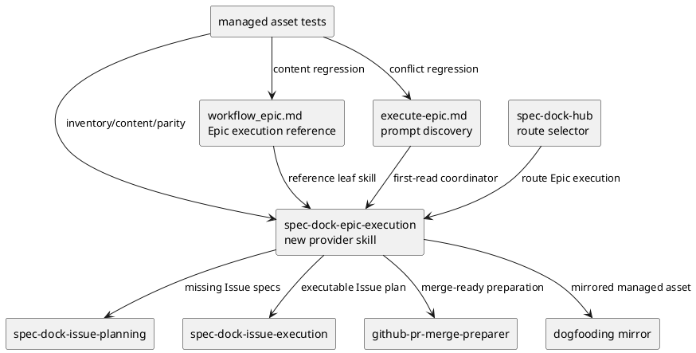

# iss-00211 Epic Execution Coordinator Skill — 設計（どう実現するか）

## 目的・制約
- 目的:
  - Epic planning 完了後の execution coordinator surface として `spec-dock-epic-execution` skill を追加する。
  - `workflow_epic.md` に Epic execution lifecycle reference を最小追加し、Issue 210 の planning handoff と Issue 211 の execution handoff を接続する。
- 必須:
  - Provider-side installed asset を source of truth とし、dogfooding mirror と tests を更新する。
  - Skill は first-read coordinator に留め、詳細 lifecycle は workflow docs / existing skills へ委譲する。
- 禁止:
  - Runtime CLI command、dependency algorithm、Issue planning / execution / PR merge-preparer の責務変更。
  - PR merge / auto-merge / GitHub close の自動化。
  - 明確な欠落のない docs 横断 cleanup。

## 既存実装 / 規約の理解
- 参照した実装 / docs:
  - `workflow_epic.md`: Epic planning completion / handoff を定義し、Epic execution coordinator behavior は later Issue に残している。
  - `workflow_issue.md`: Issue start / finish、delivery gate、merge preparation gate、`issue finish` lifecycle-only semantics を所有する。
  - `spec-dock-hub`: routing skill。Epic execution leaf skill route は未定義。
  - `spec-dock-epic-planning`: Epic requirement / design / plan authoring と Issue decomposition を所有する。
  - `spec-dock-issue-planning`: Issue requirement / design / plan authoring を所有する。
  - `spec-dock-issue-execution`: reviewer-pass 済み Issue plan の one-step-at-a-time execution を所有する。
  - `github-pr-merge-preparer`: PR creation / observation / repair / merge-prepared evidence を所有し、PR merge と `issue finish` を禁止する。
  - `execute-epic.md`: 現状は「この workflow のために新 skill を作らない」と書いており、Issue 211 の採用済み Option B と衝突する。
- 採用するパターン:
  - Provider-side `src/spec_dock/assets/install_root/` を先に更新し、checked-in dogfooding mirror を parity target とする。
  - Shipped scaffold docs は `src/spec_dock/assets/spec_dock/docs/` を source of truth とし、`spec-dock/docs/` を dogfooding mirror とする。
  - Tests は managed asset inventory / mirror parity / content regression を更新する。
- 採用しないもの:
  - Runtime command 実装。
  - Existing workflow docs の重複説明。
  - Decision-only ADR 化。Option B は Issue-local implementation design として足りる。

## 採用方針 / トレードオフ
- 決定:
  - Option B を採用する。新 `spec-dock-epic-execution` skill と `workflow_epic.md` の短い Epic execution reference を実装対象にする。
  - `spec-dock-hub` と `execute-epic.md` は discovery surface として最小更新する。特に `execute-epic.md` の現行文言は新 skill と直接衝突するため、明確な欠落として扱う。
  - `workflow_issue.md`、`workflow_spec_authoring.md`、`decision-routing.md`、`reference_github.md` は、実装中に直接矛盾が見つかった場合だけ最小更新する。
- 理由:
  - Skill-only では Issue 210 の planning handoff と Issue 211 の execution counterpart が repo docs 上で接続されない。
  - Broad docs update は Issue 211 の主目的を逸らす。
  - `/execute-epic` は Epic execution entrypoint であり、現行の新 skill 禁止文は新 skill discoverability を阻害する。

## 責務境界
- `spec-dock-epic-execution` が所有するもの:
  - Active context / active Epic / active Issue / dependency / git / GitHub freshness の bootstrap check。
  - Epic plan / dependency state / `deps check` を使った ready Issue 判断。
  - 一度に 1 Issue を選ぶ coordinator rule。
  - Ready Issue を選んだ後、`./spec-dock/scripts/spec-dock issue start <issue-id>` で active Issue を確立する lifecycle handoff。既存 active Issue がある場合は新しい Issue を start せず、現 active Issue の継続 / finish / user decision に戻す。
  - Issue specs が未整備なら `spec-dock-issue-planning` へ戻す handoff。
  - Issue specs が reviewer-pass / executable なら `spec-dock-issue-execution` へ渡す handoff。
  - Issue final gates 後、`github-pr-merge-preparer` に PR delivery / merge-prepared evidence を委譲する handoff。
  - `github-pr-merge-preparer` が merge-prepared evidence または blocking result を返した後、`workflow_issue.md` の completion policy に戻し、条件を満たす場合のみ `./spec-dock/scripts/spec-dock issue finish` へ進む lifecycle handoff。New skill は `issue finish` 成功や delivery completion を自己主張しない。
  - All Issues complete 後の Epic completion gate と blocked / incomplete evidence の記録方針。
- 所有しないもの:
  - Canonical docs の直接編集。
  - Issue planning semantics。
  - Issue execution TDD semantics。
  - `issue finish` authority。
  - PR merge / auto-merge / review-thread mutation / GitHub issue close。
  - Dependency algorithm や CLI behavior。

## 依存関係分析
- file 依存:
  - `tests/cli_runtime/harness.py` は expected managed skill names を持ち、新 managed skill 追加の prerequisite になる。
  - `tests/unit/infra/test_init_update.py` は provider asset map、authoritative install-root inventory、duplicate-boundary guard、dogfooding parity、content regression を持つ。
  - `src/spec_dock/assets/install_root/.agents/skills/spec-dock-epic-execution/SKILL.md` は new provider asset。
  - `.agents/skills/spec-dock-epic-execution/SKILL.md` は dogfooding mirror。
  - `src/spec_dock/assets/spec_dock/docs/workflow_epic.md` と `spec-dock/docs/workflow_epic.md` は docs source / mirror pair。
  - `src/spec_dock/assets/install_root/.codex/prompts/execute-epic.md` と `.codex/prompts/execute-epic.md` は prompt source / mirror pair。
  - `src/spec_dock/assets/install_root/.agents/skills/spec-dock-hub/SKILL.md` と `.agents/skills/spec-dock-hub/SKILL.md` は routing source / mirror pair。
- 実装起点:
  - Expected managed skill lists / asset inventory tests を先に更新または provider skill と同時に更新する。
  - Provider skill / provider docs / provider prompt / provider hub を更新し、dogfooding mirror を byte parity で揃える。
- 順序への影響:
  - New provider asset を追加しただけでは tests が inventory mismatch で落ちるため、tests と mirror 更新を同じ implementation step に閉じる。

## モジュール依存図（Module Dependency Diagram）
- タイトル:
  - Issue 211 Epic execution coordinator dependency map。
- 答える問い:
  - New skill、workflow reference、discovery surfaces、existing leaf skills、managed asset tests の依存方向と実装順をどう固定するか。
- 範囲:
  - Issue 211 で追加・変更する text / asset / test surfaces と、それらが参照する existing skills。
- 含めない詳細:
  - Runtime CLI internals、dependency algorithm、Issue execution step internals、PR observation implementation details。
- 更新条件:
  - New skill の責務境界、discovery surface、変更対象 file set、または existing skill handoff が変わるとき。



## インターフェース契約
- Skill inputs:
  - Current repo/worktree and active context。
  - Active Epic planning outputs。
  - Active Issue state, if any。
  - Dependency / readiness evidence from existing projections and `deps check`。
  - Git / GitHub freshness evidence when needed。
- Skill outputs:
  - Next action classification: continue active Issue, route Issue planning, route Issue execution, stop blocked, route PR merge-preparer, or record Epic completion gate evidence。
  - Lifecycle command recommendation: when safe to run `issue start <issue-id>` for the selected ready Issue, and when to return to `workflow_issue.md` for post-PR `issue finish` evaluation。
  - Evidence obligations for `report.md`。
  - Explicit unresolved risks / blockers。
- Non-output:
  - No canonical artifact mutation。
  - No runtime command output contract。
  - No PR merge or issue close action。

## ディレクトリ / ファイル変更計画
```text
.
|-- src/spec_dock/assets/install_root/
|   |-- .agents/skills/
|   |   |-- spec-dock-epic-execution/SKILL.md   # 追加: Epic execution coordinator first-read skill
|   |   `-- spec-dock-hub/SKILL.md              # 変更: Epic execution route を追加
|   `-- .codex/prompts/execute-epic.md          # 変更: new skill 禁止文を解消し coordinator route を追加
|-- src/spec_dock/assets/spec_dock/docs/
|   `-- workflow_epic.md                        # 変更: Epic execution lifecycle reference を追加
|-- .agents/skills/
|   |-- spec-dock-epic-execution/SKILL.md       # 追加: provider skill mirror
|   `-- spec-dock-hub/SKILL.md                  # 変更: provider hub mirror
|-- .codex/prompts/execute-epic.md              # 変更: provider prompt mirror
|-- spec-dock/docs/workflow_epic.md             # 変更: provider docs mirror
|-- tests/cli_runtime/harness.py                # 変更: expected managed skill names
`-- tests/unit/infra/test_init_update.py        # 変更: managed asset maps / inventories / duplicate guard / content checks
```

## 要件 → 設計マッピング
- AC-001 -> new provider skill, dogfooding mirror, managed asset tests。
- AC-002 -> skill responsibility boundary, handoff flow, non-output contract。
- AC-002 lifecycle detail -> selected ready Issue must be started through `issue start`; post-PR completion must return to `workflow_issue.md` and `issue finish` only after existing completion gates。
- AC-003 -> `workflow_epic.md` reference section in provider and mirror。
- AC-004 -> `spec-dock-hub` route and `execute-epic.md` conflict removal / route update。
- AC-005 -> `tests/cli_runtime/harness.py` and `tests/unit/infra/test_init_update.py` updates plus targeted verification。
- EC-001 -> skill active Issue stop condition。
- EC-002 -> skill no-ready-Issue blocked condition。
- EC-003 -> skill one-Issue-at-a-time selection rule。
- EC-004 -> skill no-op Epic completion path。
- EC-005 -> skill PR preparation blocked evidence and no self-claim rule。

## テスト戦略
- Unit / infra:
  - Managed skill inventory includes `spec-dock-epic-execution`。
  - Provider install_root asset map includes the new skill。
  - Dogfooding host-pack parity detects provider / mirror drift。
  - Duplicate-boundary guard permits only the provider skill source path and expected mirror.
  - Content regression asserts new skill routes to existing issue planning / execution / PR merge-preparer and forbids PR merge self-claim。
  - Prompt regression asserts `execute-epic.md` no longer says not to create a skill and references `spec-dock-epic-execution`。
- CLI runtime:
  - Existing init / update harness expects the new managed skill to be installed.
  - Existing wrapper / installed docs tests continue passing with new route references。
- Manual / inspection:
  - `rg -n "spec-dock-epic-execution|Do not create a new skill|Epic execution" ...`
  - Byte comparison or parity test for provider / dogfooding mirrors。

## リスク / 移行 / ロールバック
- リスク:
  - Skill が `workflow_issue.md` や `github-pr-merge-preparer` の詳細を複製して drift する。
  - `/execute-epic` が古いままだと future agent が new skill を無視する。
  - Managed asset inventory / package data / mirror parity のどれかが漏れて CI が壊れる。
- 移行:
  - Existing consumer repos は `spec-dock update` で new managed skill と prompt/docs updates を受け取る。
  - Existing Epic planning flow は `spec-dock-epic-planning` のまま維持する。
- ロールバック:
  - New skill files と expected inventories を戻す。
  - Hub / prompt / workflow_epic references を以前の route に戻す。
  - Managed asset / dogfooding parity tests を再実行して stale file が残らないことを確認する。

## 未確定事項
- なし。Design draft で見つかった `/execute-epic.md` の衝突は、requirement の「明確な参照欠落が見つかった場合の最小更新」に収まるため、追加 interview は不要。
