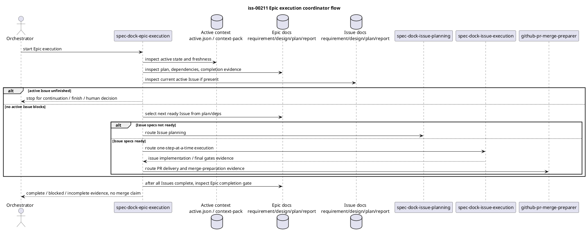

# iss-00211 system architecture draft

This draft is scope-local design evidence for `iss-00211 Epic Execution Coordinator Skill`. It does not edit or replace canonical `design.md`, does not claim reviewer pass, and does not claim implementation readiness.

## 1. Requirement Coverage

- `AC-001 New skill availability`: add a provider-side installed skill at `src/spec_dock/assets/install_root/.agents/skills/spec-dock-epic-execution/SKILL.md` and a dogfooding mirror at `.agents/skills/spec-dock-epic-execution/SKILL.md`.
- `AC-002 Coordinator responsibility boundary`: make the new skill a coordinator spine for Epic execution after Epic planning, not an implementation executor and not a replacement for issue planning, issue execution, or PR merge-preparer.
- `AC-003 Epic workflow reference`: add a short `workflow_epic.md` section after Planning Completion / Handoff that names the Epic execution lifecycle, completion gate, and PR merge-preparer handoff.
- `AC-004 Discoverability and routing`: update the minimal routing surfaces that would otherwise misroute Epic execution, especially `spec-dock-hub` and the `/execute-epic` prompt.
- `AC-005 Installer / update regression coverage`: include the new managed skill in the shared expected managed skill list, provider asset maps, dogfooding mirror parity checks, package-data inventory, duplicate-boundary guard, and installed-skill tests.
- `EC-001 Active Issue already exists`: skill must stop and require current active Issue disposition instead of silently starting the next Issue.
- `EC-002 No ready Issue`: skill must record blocker evidence and stop rather than invent readiness.
- `EC-003 Multiple ready Issues`: skill must choose one Issue at a time from dependency / priority / risk evidence; parallel execution is not default.
- `EC-004 Small / no-op Epic`: skill must route to completion evidence and final gates, not create unnecessary Issues.
- `EC-005 PR preparation blocked`: skill must treat `github-pr-merge-preparer` result as evidence and never self-claim merge-prepared status.

Requirement gap: none blocking. One design-time discovery gap exists: `src/spec_dock/assets/install_root/.codex/prompts/execute-epic.md` currently says "Do not create a new skill for this workflow", which conflicts with Issue 211's accepted Option B and must be minimally reconciled if `/execute-epic` remains a discovery surface.

## 2. Existing Context Findings

- Active context reports `initiative`, `epic`, and `issue` as `authority=approved` with planning and lifecycle grants. This supports design drafting, but this draft remains unreviewed evidence.
- `workflow_epic.md` already defines Epic planning completion and explicitly leaves Epic execution coordinator behavior, issue start / finish cycle, and PR merge-ready preparation outside the Issue 210 handoff section. Issue 211 is the intended place to fill that gap.
- `workflow_issue.md` owns issue start / finish semantics, issue planning / execution entrypoints, lifecycle-only meaning of `issue finish`, PR delivery gate, merge preparation gate, and completion evidence.
- `workflow_spec_authoring.md` owns the delegated evidence boundary: canonical docs are main-orchestrator-only, drafts stay under `discussions/`, and fresh `spec-reviewer` pass on canonical artifacts remains mandatory.
- `spec-dock-hub` currently routes Epic planning, Issue planning, Issue execution, and PR-related workflows, but has no Epic execution leaf skill route.
- `spec-dock-epic-planning` owns Epic requirement / design / plan authoring and decomposition, not post-planning execution coordination.
- `spec-dock-issue-planning` and `spec-dock-issue-execution` already define the handoff between Issue authoring and Issue implementation. The new skill should call these out as delegated downstream workflows.
- `github-pr-merge-preparer` already owns PR creation / observation / repair / merge-prepared evidence and forbids PR merge, issue finish, and GitHub issue close. The new skill should hand off to it, not restate or weaken its predicate.
- Test infrastructure centralizes managed skill names in `tests/cli_runtime/harness.py`; multiple CLI runtime tests import this list. Adding a managed skill without updating that list will create broad installed-skill failures.
- `tests/unit/infra/test_init_update.py` has dogfooding mirror maps, install-root authoritative asset inventories, duplicate-boundary guards, package data checks, and Japanese-primary markdown checks that are relevant to a new shipped skill and workflow prose.

## 3. Design Decisions

- Decision 1: implement Option B as a new `spec-dock-epic-execution` leaf skill plus a minimal `workflow_epic.md` reference section.
  - Rationale: Epic execution is a distinct coordinator workflow after Epic planning and before / across Issue execution. Folding it into `spec-dock-epic-planning` would blur planning and execution authority.
- Decision 2: keep the new skill first-read and operational, with detailed lifecycle semantics delegated to `workflow_epic.md`, `workflow_issue.md`, and `github-pr-merge-preparer`.
  - Rationale: Epic requirement says skill prose should be short and existing workflow authority must remain consistent.
- Decision 3: treat `spec-dock-epic-execution` as a coordinator of existing commands and skills, not a runtime command.
  - Rationale: Requirement explicitly forbids new runtime CLI command and dependency algorithm changes.
- Decision 4: update discoverability where current text would misroute work.
  - Required minimal updates: `spec-dock-hub/SKILL.md`; `execute-epic.md` because it explicitly contradicts the new-skill decision.
  - Optional only if review finds a concrete gap: additional wrapper / README references.
- Decision 5: keep provider source authoritative and dogfooding mirror as validation target.
  - Rationale: repo guidance and Epic E-RQ-007 require shipped assets to be changed in provider source first and mirrored/verified in dogfooding.

## 4. Alternatives Considered

- Alternative A: extend `spec-dock-epic-planning`.
  - Rejected because Epic planning and post-planning execution have different stop conditions and evidence. It would also make a planning skill responsible for Issue execution and PR handoff coordination.
- Alternative B: create `spec-dock-epic-execution` plus minimal `workflow_epic.md` reference.
  - Selected by requirement and user approval. It preserves leaf-skill boundaries and fills the explicit Issue 210 handoff gap.
- Alternative C: rewrite `workflow_issue.md`, `workflow_spec_authoring.md`, and `decision-routing.md` broadly.
  - Rejected for this Issue unless explicit contradictions are found. Existing docs already define their own boundaries; broad cleanup would exceed Option B.
- Alternative D: implement runtime readiness selection logic.
  - Rejected because dependency algorithm and CLI command behavior changes are out of scope.

## 5. Boundary / Contract Model

`spec-dock-epic-execution` owns:

- first-read bootstrap checks for active context, active Epic, active Issue, git / projection / dependency freshness, and GitHub freshness where applicable;
- readiness interpretation at coordinator level using existing Epic plan, dependency state, and `deps check`;
- one-Issue-at-a-time selection and stop conditions;
- routing to `spec-dock-issue-planning` when Issue specs are missing or not reviewer-pass;
- routing to `spec-dock-issue-execution` when Issue planning artifacts are approved / reviewer-pass and executable;
- routing to `github-pr-merge-preparer` after local final gates and before Issue finish / Epic completion claims, consistent with existing Issue workflow;
- Epic completion gate reminder after all required Issues are complete.

It must not own:

- canonical requirement / design / plan / report edits;
- implementation steps;
- Issue planning semantics;
- Issue execution TDD semantics;
- `issue finish` authority;
- PR merge, auto-merge, review-thread mutation, GitHub close, or merge-prepared self-claim;
- dependency algorithm or CLI behavior.

## 6. Dependency Analysis

Text / asset dependency direction:

```text
tests/cli_runtime/harness.py
  -> expected managed skill names
  -> installer / runtime tests that assert installed skill files

src/spec_dock/assets/install_root/.agents/skills/spec-dock-epic-execution/SKILL.md
  -> mirrored to .agents/skills/spec-dock-epic-execution/SKILL.md
  -> referenced by spec-dock-hub and workflow_epic.md
  -> included in managed asset tests and package data

src/spec_dock/assets/spec_dock/docs/workflow_epic.md
  -> mirrored to spec-dock/docs/workflow_epic.md
  -> defines detailed Epic execution lifecycle reference

src/spec_dock/assets/install_root/.codex/prompts/execute-epic.md
  -> mirrored to .codex/prompts/execute-epic.md
  -> must stop contradicting new skill existence
```

Implementation order implication:

1. Add the expected skill name / asset inventory test expectations first or alongside the provider skill.
2. Add provider skill source and mirror it.
3. Add minimal routing references and workflow reference.
4. Reconcile dogfooding mirror parity.
5. Run targeted unit / CLI runtime tests.

## 7. Source of Record

- Requirement source: `spec-dock/active/issue/requirement.md`, sha256 `f0a83c74cf1a180bc8e6547ef45f66728c99e718a3bb424703751f1aaa347a88`.
- Active context source: `spec-dock/active/context-pack.md`, sha256 `d738e08c5a88103e590e0d90dbb270d38c3df730d6216024e90c00cdf82afc02`.
- Workflow source: `spec-dock/docs/workflow_epic.md`, `workflow_issue.md`, `workflow_spec_authoring.md`, and `authoring/decision-routing.md`.
- Skill source: provider-side skill files under `src/spec_dock/assets/install_root/.agents/skills/`.
- Current contradiction source: `src/spec_dock/assets/install_root/.codex/prompts/execute-epic.md`, sha256 `5065792124ef710f3de9e271df33ab794a160e5c76763b8c2faa99dfb1f05093`.
- Test source: `tests/cli_runtime/harness.py` and relevant managed asset / dogfooding parity sections of `tests/unit/infra/test_init_update.py`.

## 8. Data Flow / Domain Model / Interface Contract

Coordinator flow:



Interface contract for the new skill:

- Inputs:
  - current repo/worktree and active context;
  - active Epic planning outputs;
  - active Issue state, if any;
  - dependency / readiness evidence from existing `deps check` and projections;
  - local git / GitHub freshness evidence when needed.
- Outputs:
  - next action: continue active Issue, route to Issue planning, route to Issue execution, stop blocked, route PR merge-preparer, or record Epic completion gate evidence;
  - evidence obligations for `report.md`;
  - explicit unresolved risks or blockers.
- Non-output:
  - no canonical artifact mutation by the skill itself;
  - no runtime command output contract;
  - no PR merge or issue close action.

## 9. File / Module Change Plan

```text
.
|-- src/spec_dock/assets/install_root/.agents/skills/
|   |-- spec-dock-epic-execution/
|   |   `-- SKILL.md                         # add: first-read Epic execution coordinator
|   `-- spec-dock-hub/
|       `-- SKILL.md                         # change: route Epic execution requests to new leaf skill
|-- src/spec_dock/assets/install_root/.codex/prompts/
|   `-- execute-epic.md                      # change: remove conflict with new skill; point execution coordination to it
|-- src/spec_dock/assets/spec_dock/docs/
|   `-- workflow_epic.md                     # change: minimal Epic execution lifecycle / completion / PR handoff reference
|-- .agents/skills/
|   `-- spec-dock-epic-execution/
|       `-- SKILL.md                         # add: dogfooding mirror of provider skill
|-- .agents/skills/spec-dock-hub/
|   `-- SKILL.md                             # mirror update if provider hub changes
|-- .codex/prompts/
|   `-- execute-epic.md                      # mirror update if provider prompt changes
|-- spec-dock/docs/
|   `-- workflow_epic.md                     # mirror update if provider workflow doc changes
|-- tests/cli_runtime/
|   `-- harness.py                           # change: include spec-dock-epic-execution in expected managed skill names
`-- tests/unit/infra/
    `-- test_init_update.py                  # change: asset maps, install-root inventory, duplicate-boundary and parity expectations
```

No runtime CLI module, domain model, dependency algorithm, package config, GitHub workflow, or secret file should change for this Issue unless a reviewer identifies a hard test gap that cannot be closed otherwise.

## 10. Migration / Compatibility / Rollback

- Migration:
  - Existing consumer repos receive the new managed skill on `spec-dock update`.
  - Existing `/execute-epic` users should see the same high-level behavior, but routing should now pass through `spec-dock-epic-execution` for post-planning coordination.
  - Existing Epic planning remains on `spec-dock-epic-planning`; no current planning workflow should be renamed or removed.
- Compatibility:
  - Adding a managed skill is additive but affects installer/update expectations and uninstall cleanup surfaces.
  - Dogfooding mirror must match provider bytes for managed files included in the mirror map.
  - Japanese-primary markdown checks may affect new user-facing headings / tables; keep Japanese primary where the repository expects it.
- Rollback:
  - Remove `spec-dock-epic-execution` from expected managed skill lists and provider/dogfooding assets.
  - Revert hub / prompt / workflow references to previous Epic planning and issue execution routing.
  - Re-run managed asset and dogfooding parity tests to verify no stale managed skill remains.

## 11. Observability

- Skill prose inspection should show:
  - bootstrap checks;
  - active Issue stop condition;
  - no ready Issue stop condition;
  - multiple ready Issue single-selection rule;
  - no-op Epic path;
  - explicit handoff to `spec-dock-issue-planning`, `spec-dock-issue-execution`, and `github-pr-merge-preparer`;
  - no PR merge / reviewer pass / issue finish claim.
- Workflow inspection should show a short `workflow_epic.md` reference section, not a full duplicate of `workflow_issue.md`.
- Test observability should include:
  - installed skill list includes `spec-dock-epic-execution`;
  - provider asset exists under `install_root`;
  - dogfooding mirror matches provider asset;
  - duplicate provider boundary allows exactly the new provider path;
  - `/execute-epic` prompt no longer contradicts the new skill.
- Report adoption should record this draft path, adoption status, rejected portions if any, and fresh `spec-reviewer` result after canonical design integration.

## 12. Test Strategy

Recommended targeted checks after implementation:

- `uv run pytest tests/unit/infra/test_init_update.py -k "managed_skill or bundled_skill_assets_cover_managed_manifest or dogfooding_mirror_docs_match_provider_assets or authority_inventory_disallows_unlisted_provider_duplicates or japanese_primary"`
- `uv run pytest tests/cli_runtime`
- If prompt / mirror parity changes are broad, run `uv run pytest tests/unit/infra/test_init_update.py`.
- Manual inspection:
  - `rg -n "spec-dock-epic-execution|Do not create a new skill|Epic execution" src/spec_dock/assets/install_root src/spec_dock/assets/spec_dock/docs .agents .codex spec-dock/docs`
  - Compare provider and dogfooding mirror bytes for the new skill and changed managed docs/prompts.
- Expected evidence type:
  - mostly inspect-only / structural assertions because the change is a shipped text-surface / managed asset addition, not a runtime behavior change.

Test gap to watch: current tests may not have a dedicated assertion for `/execute-epic` routing semantics beyond prompt mirror parity. If implementation changes the prompt, a narrow assertion that the prompt references `spec-dock-epic-execution` and no longer says not to create a skill would reduce regression risk.

## 13. ADR Candidates

- No required ADR candidate for Issue 211. Option B is already issue-local and fits the Epic context-surface ownership model.
- Potential future ADR only if Epic execution coordination becomes a general cross-repo operating model or requires runtime-enforced dependency selection semantics. That is out of scope here.

## 14. Risks

- Risk: new skill duplicates `workflow_issue.md` or `github-pr-merge-preparer` details and drifts.
  - Mitigation: keep skill first-read; route detail to existing docs / skills.
- Risk: `/execute-epic` prompt remains contradictory and future agents ignore the new skill.
  - Mitigation: minimally update the prompt as an explicit discovery surface gap.
- Risk: managed asset tests fail because the new skill is not included in every expected inventory.
  - Mitigation: update shared expected skill list, install-root inventory, dogfooding mirror map, duplicate-boundary guard, and package-data coverage together.
- Risk: dogfooding mirror is edited without provider source or vice versa.
  - Mitigation: provider source first; mirror parity test / targeted byte comparison.
- Risk: the coordinator appears to authorize PR merge or issue finish.
  - Mitigation: explicitly state those are delegated / human / existing lifecycle actions and require existing gates.

## 15. Requirement Clarification Requests

Blocking clarification requests: none.

Non-blocking adoption notes:

- The canonical design should explicitly decide whether `/execute-epic` is in scope as a discovery surface. Based on the observed contradiction, this draft recommends including a minimal prompt update.
- The canonical design should keep other workflow docs out of scope unless implementation reveals direct contradictions comparable to the `/execute-epic` conflict.

## 16. Integration Notes for Main Orchestrator

- Adopt this draft selectively into canonical `design.md`; do not copy the evidence status or authority disclaimers as if they were final design authority.
- Record this discussion path in `report.md` Evidence Adoption Ledger with `adoption_status` chosen by the main orchestrator.
- After canonical `design.md` integration, run a fresh `spec-reviewer`; this draft is not a reviewer pass.
- Preserve Option B exactly: new `spec-dock-epic-execution` skill plus minimal `workflow_epic.md` reference, with only explicit-gap discovery updates.
- Recommended design emphasis:
  - provider-side `install_root` skill is source of truth;
  - dogfooding mirror is validation target;
  - coordinator delegates Issue planning, Issue execution, and PR merge preparation;
  - no runtime CLI change;
  - tests close managed asset inclusion and mirror parity.

No canonical edit, final authority, promotion, reviewer-pass, or user-dialogue ownership is claimed.
