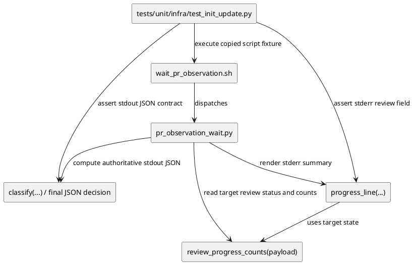

# iss-00214 PR Observation Review Target State — 設計

## 目的・制約

- 目的:
  - `wait_pr_observation.sh` の progress line で、`review=` が Codex review の target state を表示するようにする。
  - Trigger 済みだが Codex review completion / comment signal がまだない wait 中の状態を `review=pending_signal` と表示する。
- 必須:
  - `review=observing` への無条件上書きを廃止する。
  - Existing final JSON contract、`decision` / `decision_fingerprint`、wait completion 判定を変更しない。
  - Provider-side source と dogfooding mirror の挙動を揃える。
- 禁止:
  - `review=` に observer state を表示する。
  - `running` のような処理中断定表現を signal なしで使う。
  - `wait_pr_observation.sh` の trigger / resume / snapshot / token permission semantics を変更する。
- 前提:
  - `stderr` progress line は non-authoritative diagnostic。
  - `stdout` JSON が machine-readable authority。

## 既存実装 / 規約の理解

- 参照した実装 / docs:
  - `src/spec_dock/assets/install_root/.agents/skills/github-pr-observation/scripts/lib/pr_observation_wait.py`
  - `.agents/skills/github-pr-observation/scripts/lib/pr_observation_wait.py`
  - `src/spec_dock/assets/install_root/.agents/skills/github-pr-observation/SKILL.md`
  - `tests/unit/infra/test_init_update.py`
  - `spec-dock/active/issue/discussions/20260619t064501z-research-review-progress-target-state-source-analysis.md`
  - `spec-dock/active/issue/discussions/20260619t064502z-interview-review-pending-state-naming.md`
- 現状理解:
  - `review_progress_counts(payload)` は `review.status` / `summary.review` を target review status として返す。
  - `progress_line(...)` は `review_status = review_counts["status"]` を取得後、`phase == "wait" and not observation_complete` の場合に `render_review = "observing"` で上書きする。
  - `classify(...)` と wait finalization は no-completion / latency guard / human gate semantics を別に持つ。
  - Existing tests には `review=observing` を期待する case が 1 つあり、今回の red target になる。
- 採用するパターン:
  - Progress line の表示だけを変える小さな helper / local derivation を追加または更新する。
  - Final JSON の status / decision / fingerprint は既存 path を使う。
  - Provider-side source を編集し、dogfooding mirror は同等内容へ反映する。
- 採用しないもの:
  - `observer=` / `wait=` の新規 field 追加。
  - Snapshot collector、review selection、decision generation の再設計。
  - Trigger reuse / manual trigger policy の変更。

## 採用方針 / トレードオフ

- 論点:
  - `review.status` をそのまま出すだけでは、trigger 済み signal 待ち状態が `review=none` になり、operator-facing clarity が不足する。
  - `review=triggered` は誤再投稿を防ぎやすいが、何を待っているかが弱い。
  - `review=pending_signal` は signal 待ちを明示し、処理中を過剰に断定しない。
- 決定:
  - Wait 中、observation 未完了、Codex review completion / comment signal がまだない target state は `review=pending_signal` と表示する。
  - Actionable review feedback がある場合は、`review=unresolved` を表示し、`comments` / `threads` / `unresolved` count を維持する。
  - Approved / passed / terminal-like states は trusted completion signal または completed lifecycle がある場合だけ existing target state を表示する。
  - Legacy / audit 由来の `approved` / `passed` review status でも、trusted completion signal がなく、actionable feedback もなく、lifecycle completion もない wait 中 state では `review=pending_signal` と表示する。

## pending_signal 導出方針

`pending_signal` は progress display 専用の operator-facing state とする。Final JSON の authoritative status ではない。

- `review=pending_signal` を表示する条件:
  - `phase == "wait"`
  - `observation_complete is False`
  - `review_status` が `none` / `pending` / `unknown` のいずれか
  - または、`review_status` が `approved` / `passed` であっても trusted completion / comment signal がなく、completed lifecycle もない legacy / audit 由来の no-completion wait state と判断できる
  - current trigger boundary の actionable review feedback count がない
  - trusted completion signal が `submitted_pull_request_review` ではない
- `review=pending_signal` を表示しない条件:
  - `review_status` が `unresolved` / `changes_requested` / `commented` / `requested` のような actionable or explicit target state。
  - `review_status` が `approved` / `passed` など completion を示し、trusted completion signal または completed lifecycle で裏付けられる state。
  - final phase が `terminal` / `timeout` で、既存 final status を表示するほうが正確な場合。
- 補足:
  - 実装では `review_progress_counts(payload)`、`decision_payload(payload)`、`codex_review_lifecycle(payload)`、`completion_signal`、selected review/comment counts を使って判定する。
  - Trigger metadata が payload にある場合は補助情報として使ってよいが、display helper は final decision を変更しない。

## 依存関係分析

- module / file 依存:
  - `.sh` wrapper は Python entrypoint を呼ぶだけで、今回の表示変換には直接関与しない。
  - `pr_observation_wait.py` の `progress_line(...)` が progress display の中心。
  - `review_progress_counts(...)` は target review status と counts を集計する upstream helper。
  - `classify(...)` / wait finalization は authoritative final JSON status を決める downstream-adjacent logic だが、今回の変更対象ではない。
  - Tests は provider asset を temp workspace へ copy して script behavior を検証する。
- 上流 / 前提:
  - Requirement の `review=pending_signal` user-approved decision。
  - Existing PR observation skill contract。
- 下流 / 依存先:
  - `tests/unit/infra/test_init_update.py` の PR observation wait tests。
  - Provider-side package data / installed asset parity tests。
- 実装起点:
  - `tests/unit/infra/test_init_update.py` の existing `review=observing` expectation を red target にする。
  - Provider-side `pr_observation_wait.py` で display derivation を変更する。
  - Dogfooding mirror `.agents/.../pr_observation_wait.py` に同じ変更を反映する。
- 順序への影響:
  - 先に test expectation を更新して red を確認し、その後 provider/mirror helper を変更する。
  - Final JSON regression tests は既存 suite で確認する。

## モジュール依存図（Module Dependency Diagram）



## インターフェース契約

- Public CLI:
  - `wait_pr_observation.sh` arguments and trigger modes remain unchanged.
  - `fetch_pr_observation_snapshot.sh` remains read-only and unchanged.
- `stderr` progress line:
  - `review=` displays target review state.
  - No-signal wait state after trigger displays `review=pending_signal`.
  - Actionable unresolved feedback displays `review=unresolved` and the relevant counts.
  - Progress remains bounded ASCII key/value summary.
- `stdout` JSON:
  - `decision` / `decision_fingerprint` remain authoritative.
  - `normalized_status`, `overall_status`, `recommended_next_action`, `observation_complete` semantics remain unchanged.

## ディレクトリ / ファイル変更計画

```text
.
|-- src/
|   `-- spec_dock/
|       `-- assets/
|           `-- install_root/
|               `-- .agents/
|                   `-- skills/
|                       `-- github-pr-observation/
|                           `-- scripts/
|                               `-- lib/
|                                   `-- pr_observation_wait.py   # 変更: progress review display derivation
|-- .agents/
|   `-- skills/
|       `-- github-pr-observation/
|           `-- scripts/
|               `-- lib/
|                   `-- pr_observation_wait.py                   # mirror確認/反映: dogfooding asset behavior
|-- tests/
|   `-- unit/
|       `-- infra/
|           `-- test_init_update.py                              # 変更: review=pending_signal regression
`-- spec-dock/
    `-- initiatives/.../iss-00214-pr-observation-review-target-state/
        |-- requirement.md
        |-- design.md
        |-- plan.md
        |-- report.md
        `-- discussions/
```

## 要件 → 設計マッピング

- AC-001 -> `progress_line(...)` display helper maps no-signal wait state to `pending_signal`.
- AC-002 -> Existing actionable review status / counts path remains target-state based and tests keep `review=unresolved`.
- AC-003 -> No changes to final JSON decision path; existing stdout assertions remain in the focused regression set.
- AC-004 -> Provider-side source and dogfooding mirror are both inspected / updated.
- EC-001 -> Latency-guarded no-completion path remains wait / resume before promotion.
- EC-002 -> `review_completion_unknown` remains final human gate semantics, separate from `pending_signal`.
- EC-003 -> Fallback issue comment remains low-confidence human gate / wait_or_resume.
- EC-004 -> Existing line budget regression remains part of verification.

## テスト戦略

- Red / regression:
  - Update the existing test that expects `phase=wait ci=passed review=observing` to expect `review=pending_signal`.
  - Add or extend a focused assertion that unresolved feedback still renders `review=unresolved` plus counts.
- Green:
  - Run the focused PR observation wait tests around issue 176 / 174 / 182 / 187 / 214 as applicable.
  - Run `uv run pytest tests/unit/infra/test_init_update.py -k "pr_observation_wait and (observing or progress or completion or unresolved or issue_176 or issue_174 or issue_187)"` or a narrower valid expression discovered during implementation.
- Structural / mirror:
  - Inspect provider and dogfooding mirror for the same display derivation.
  - Run `./spec-dock/scripts/spec-dock validate`.
  - Run `./spec-dock/scripts/spec-dock sync --github` if spec artifacts need projection refresh.

## リスク / 移行 / ロールバック

- Risk:
  - `pending_signal` could be applied too broadly and hide actionable target states.
  - Progress display changes could accidentally affect final JSON semantics if implemented in classification rather than display-only derivation.
  - Provider/mirror drift could leave dogfooding behavior different from shipped asset behavior.
- Mitigation:
  - Keep derivation local to progress display.
  - Preserve existing actionable and final-state tests.
  - Verify provider-side and mirror files.
- Rollback:
  - Revert display helper and test expectation changes. No data migration is involved.

## 未確定事項

- Blocking:
  - なし。
- Non-blocking:
  - Focused test command may be adjusted to match available test names after implementation discovery.
