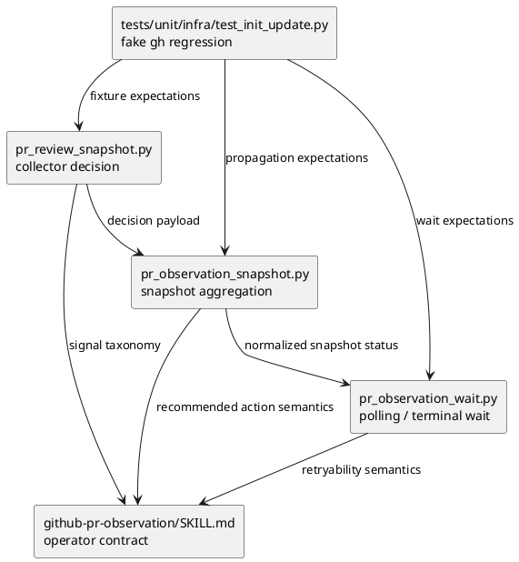

# iss-00218 Codex Review Fallback Signal Semantics — 設計（どう実現するか）

## 親図（Diagram）参照
- Epic:
  - `epic-00158` は agent workflow / evidence / dogfooding surface の hardening を対象にする。
  - Shipped asset の正本は provider-side `src/spec_dock/assets/...`、dogfooding mirror は検証対象である。
- 再利用する決定:
  - `fallback_issue_comment` は low-confidence / non-promoting の安全契約として維持する。
  - Option A: strict no-findings issue comment を新 signal `codex_no_findings_issue_comment` として昇格する。
  - ADR は作らず、issue-local additive signal として扱う。

## 目的・制約
- 目的:
  - Codex no-findings issue comment transport を generic fallback と区別し、厳密条件下で merge-prepared へ進める。
  - Retryable pending と non-retryable fallback を action semantics 上で分ける。
- 必須:
  - `codex_no_findings_issue_comment` を collector、snapshot aggregator、wait loop、skill doc で一貫して扱う。
  - `Codex Review: Didn't find any major issues. Breezy!` と既存 `No major issues found.` 系を strict allow-list に含める。
  - blocker precedence と current boundary / head safety を維持する。
- 禁止:
  - `fallback_issue_comment` の意味変更。
  - body substring の緩い肯定判定。
  - no-findings issue comment による CI / review blocker / collection limitation の上書き。

## 既存実装 / 規約の理解
- 参照した実装 / docs:
  - `src/spec_dock/assets/install_root/.agents/skills/github-pr-observation/scripts/lib/pr_review_snapshot.py`
  - `src/spec_dock/assets/install_root/.agents/skills/github-pr-observation/scripts/lib/pr_observation_snapshot.py`
  - `src/spec_dock/assets/install_root/.agents/skills/github-pr-observation/scripts/lib/pr_observation_wait.py`
  - `src/spec_dock/assets/install_root/.agents/skills/github-pr-observation/SKILL.md`
  - `tests/unit/infra/test_init_update.py`
- 現状理解:
  - `pr_review_snapshot.py` は current-boundary Codex issue comment を `fallback_issue_comment` に分類し、`fallback_pass_candidate` が存在しても top-level status を昇格しない。
  - `is_no_major_issues_fallback()` は既存 `No major issues found.` 系だけを候補として認識する。
  - `pr_observation_snapshot.py` は collector decision を受け取り、`fallback_issue_comment` を `human_gate` / `wait_or_resume` に維持する。
  - `pr_observation_wait.py` も snapshot decision を再分類し、`fallback_issue_comment` を `human_gate` / `wait_or_resume` にする。
- 採用するパターン:
  - Collector が decision-facing contract を生成し、snapshot / wait は decision を再解釈しない。
  - Existing fake `gh` fixture による hermetic regression tests。
- 採用しないもの:
  - downstream merge-preparer-only waiver。
  - existing `fallback_issue_comment` の conditional promotion。
  - merged PR 専用の closeout special case。

## 採用方針 / トレードオフ
- 決定:
  - 新 completion signal `codex_no_findings_issue_comment` を追加する。
  - 新 signal は `confidence="medium"` とし、`decision.status="passed"` / `recommended_next_action="merge_prepared"` / `observation_complete=true` にできる。
  - Generic `fallback_issue_comment` は `confidence="low"` のまま `human_gate` に残す。ただし `recommended_next_action` は `wait_or_resume` ではなく、non-retryable human action に変更する。
- non-retryable human action:
  - `manual_review_required_non_retryable` を採用する。
  - 理由: 待機で transport が変わらない状態を retryable pending と誤認させないため。
- `fallback_pass_candidate` の扱い:
  - 既存 field は後方互換のため残す。
  - `codex_no_findings_issue_comment` では `fallback_pass_candidate.promotes_top_level_status=true` に意味変更せず、必須 field `no_findings_completion_candidate` を新設して新 signal の根拠を表す。
  - 後方互換を優先し、既存 `fallback_pass_candidate` は generic fallback の non-promoting candidate として維持する。

## Completion Signal Taxonomy

| signal | transport | confidence | decision effect | retryability | 用途 |
|---|---|---|---|---|---|
| `submitted_pull_request_review` | PR review object | `high` | blocker がなければ `passed` / `merge_prepared` | terminal | 既存 high-confidence completion |
| `codex_no_findings_issue_comment` | issue comment | `medium` | safety condition がすべて揃えば `passed` / `merge_prepared` | terminal | PR #216 型 no-findings transport mismatch の解消 |
| `fallback_issue_comment` | issue comment | `low` | `human_gate` | non-retryable | generic / ambiguous fallback |
| `none` + `missing_current_completion_signal` | none | `medium` | `pending` / `wait_or_resume` | retryable | completion signal 未到着 |

## 昇格条件
- `codex_no_findings_issue_comment` は、次をすべて満たす場合だけ成立する。
  - Comment は Codex-authored。
  - Comment は current trigger boundary 内。
  - Caller が expected head を `--head-sha` で指定している。
  - PR current head と expected head が一致する。
  - Comment body が strict no-findings allow-list に一致する。
  - Selected unresolved thread がない。
  - Selected changes-requested evidence がない。
  - Blocking collection limitation がない。
  - Snapshot / wait の統合段階で CI は `passed`。
  - PR は open / non-draft / stale head ではない。
- Body allow-list:
  - line-normalized exact:
    - `No major issues found.`
    - `No major issues found`
    - `No major issues were found.`
    - `No major issues were found`
  - exact normalized full body:
    - `Codex Review: Didn't find any major issues. Breezy!`
  - 実装では case-insensitive / whitespace-normalized に留め、任意 substring match は使わない。

## Blocker Precedence
1. Stale head / expected head mismatch。
2. Draft / non-open PR。
3. CI failed / pending / running / none。
4. Current unresolved thread / changes requested。
5. Permission / blocking collection limitation。
6. Completion signal classification。

この順序により、no-findings issue comment は安全条件の最後の positive evidence としてだけ効く。

## 依存関係分析
- module 依存:
  - `pr_review_snapshot.py` が completion signal と decision payload を生成する upstream。
  - `pr_observation_snapshot.py` が CI / metadata / collector decision を統合して top-level status を返す downstream。
  - `pr_observation_wait.py` が polling 中の snapshot decision を wait / terminal result に変換する downstream。
  - `SKILL.md` が operator-facing semantics を説明する docs surface。
- file 依存:
  - `tests/unit/infra/test_init_update.py` は provider-side installed asset の regression suite。
- 実装起点:
  - Collector taxonomy から先に固定する。Snapshot / wait は collector の `decision` を尊重する。
- 順序への影響:
  - Plan では S01 collector、S02 snapshot propagation、S03 wait propagation、S90 docs、S99 final gate の順にする。

## モジュール依存図（Module Dependency Diagram）


## インターフェース契約
- Collector `decision` payload:
  - `completion_signal`: `codex_no_findings_issue_comment` を追加する。
  - `confidence`: 新 signal は `medium`。
  - `status`: review-level safety condition が揃った場合は `passed`。ただし collector 単体の pass は review completion pass であり、CI / PR metadata を含む top-level merge-prepared authority ではない。
  - `status_reason`: review-level no-findings completion 時は `codex_no_findings_issue_comment`。
  - `recommended_next_action`: review-level no-findings completion 時は `review_completion_observed`、generic fallback 時は `manual_review_required_non_retryable`。
  - `observation_complete`: review-level no-findings completion 時は `true`。
  - `fallback_pass_candidate`: 既存互換で維持し、generic fallback では `promotes_top_level_status=false`。
  - `no_findings_completion_candidate`: 新 signal の必須 evidence field として追加し、`source="issue_comment"`、`source_ids`、`reason="current_boundary_codex_no_findings_comment"`、`promotes_top_level_status=true` を持つ。
- Collector / snapshot / wait の責務境界:
  - Collector は review-level completion signal、review blockers、collection limitation、expected head presence / trigger boundary に基づく review decision だけを生成する。
  - Collector は CI status、draft / non-open PR、mergeStateStatus など PR metadata を最終評価しない。
  - Snapshot は collector decision と CI / PR metadata / head match を統合し、top-level `normalized_status`、`overall_status`、`recommended_next_action`、`observation_complete` を決める。
  - Wait は snapshot の top-level result と collector decision を尊重し、CI / blocker / limitation がなければ new signal を terminal pass として扱う。
  - `--head-sha` 未指定または expected head unknown の場合、no-findings issue comment は collector / snapshot / wait のいずれでも new signal に昇格しない。
- Top-level snapshot / wait:
  - Collector decision が `passed` / `review_completion_observed` の場合、CI / metadata / blocker が安全条件を満たせば top-level は `passed` / `merge_prepared`。
  - `merge_prepared` は snapshot / wait の top-level action に限定し、collector-only output では返さない。
  - Collector decision が generic fallback の場合、top-level は `human_gate` / `manual_review_required_non_retryable`。

## ディレクトリ / ファイル変更計画
```text
.
|-- src/spec_dock/assets/install_root/.agents/skills/github-pr-observation/
|   |-- SKILL.md
|   |   `-- 変更: signal taxonomy、fallback / no-findings / retryability semantics を説明
|   `-- scripts/lib/
|       |-- pr_review_snapshot.py
|       |   `-- 変更: no-findings issue comment signal と decision payload を追加
|       |-- pr_observation_snapshot.py
|       |   `-- 変更: new signal / non-retryable action を top-level classification に反映
|       `-- pr_observation_wait.py
|           `-- 変更: new signal / non-retryable action を wait terminal classification に反映
|-- tests/unit/infra/test_init_update.py
|   `-- 変更: fake gh fixture で promotion / non-promotion / blocker precedence / wait propagation を検証
`-- spec-dock/
    `-- 変更: issue docs / report evidence のみ。実装 source of truth ではない
```

## 要件 → 設計マッピング
- AC-001 -> `codex_no_findings_issue_comment`、strict allow-list、promotion decision。
- AC-002 -> generic `fallback_issue_comment` non-promotion、`manual_review_required_non_retryable`。
- AC-003 -> Blocker Precedence。
- AC-004 -> Current trigger boundary / expected head condition。
- AC-005 -> `SKILL.md` taxonomy update。
- EC-001 / EC-002 -> Body allow-list。
- EC-003 -> generic fallback path。
- EC-004 / EC-005 / EC-006 -> blocker precedence and collection limitation rules。

## テスト戦略
- 単体 / runtime asset regression:
  - `tests/unit/infra/test_init_update.py` に fake `gh` fixture を追加・更新する。
  - `fetch_pr_review_snapshot.sh` 経由で collector の review-level decision と `no_findings_completion_candidate` を確認する。
  - `fetch_pr_observation_snapshot.sh` 経由で snapshot が CI / PR metadata / head match を合わせて top-level pass または blocker に分類することを確認する。
  - `wait_pr_observation.sh` または wait helper fixture で wait terminal classification と non-retryable fallback action を確認する。
- Negative / regression:
  - Generic issue comment は pass しない。
  - Old trigger / stale head / blockers / CI non-pass / limitations は pass しない。
  - Existing submitted PR review pass path は維持される。
- Docs:
  - `SKILL.md` の inspection と targeted string assertion を使う。

## リスク / 移行 / ロールバック
- リスク:
  - Body matcher が広すぎると false pass risk がある。
  - Body matcher が狭すぎると PR #216 型の false block が残る。
  - Snapshot / wait が collector decision を別解釈すると status inconsistency が再発する。
- 軽減策:
  - Allow-list は exact normalized に限定する。
  - Blocker precedence を tests で固定する。
  - Existing fallback tests を残し、generic fallback non-promotion を明示する。
- ロールバック:
  - 新 signal path を削除すれば既存 fallback behavior に戻せる additive change とする。

## 未確定事項
- Blocking question:
  - なし。
- Non-blocking implementation decision:
  - `no_findings_completion_candidate` は必須 field とする。実装中に追加 shape が必要になった場合は、この design の必須 traceability を弱めずに report へ差分を記録する。
