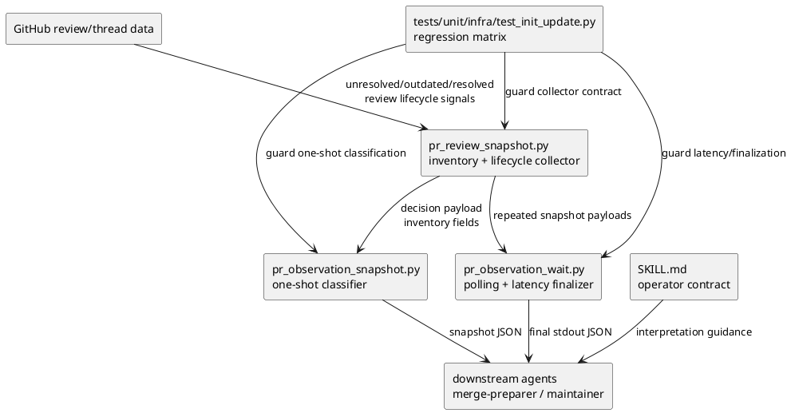
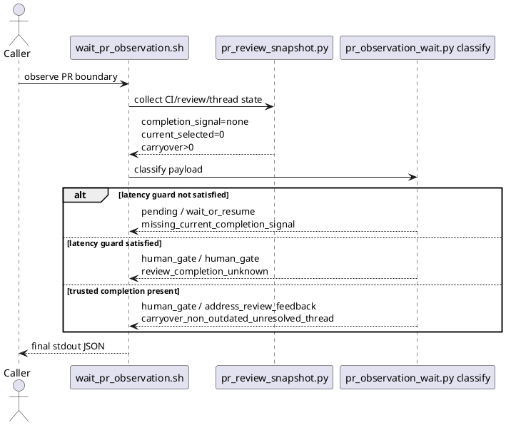

# iss-00219 Carryover Unresolved Threads Stop Observation — 設計（どう実現するか）

## 親図（Diagram）参照
- Epic 図:
  - N/A: Issue-local な PR observation state classification の修正であり、Epic-wide architecture diagram の再掲は不要。
- Initiative 図:
  - N/A: Initiative-level architecture boundary は変更しない。
- 再利用する決定:
  - `epic-00158` の agent-facing workflow / evidence adoption / provider-source authority 方針。
  - `iss-00187` 系の「non-outdated unresolved carryover thread は actionable inventory」という安全性。
  - `iss-00214` 系の progress line は非 authoritative、final JSON の `decision` が authoritative という契約。

## 目的・制約
- 目的:
  - Current `@codex review` lifecycle と carryover actionable inventory を別軸として扱い、carryover-only unresolved thread による premature terminal stop を防ぐ。
  - Snapshot と wait の判定を同じ taxonomy に揃える。
  - Skill docs と tests で、future agent が `selected_unresolved_count == 0` を no-review-work と誤読しないようにする。
- 必須 / 禁止:
  - 必須: current selected blocker は immediate feedback handling を維持する。
  - 必須: carryover unresolved counts / ids は decision-facing inventory として保持する。
  - 禁止: guard 未満の carryover-only missing-completion を `observation_complete=true` にしない。
  - 禁止: `#218` の一般 fallback issue comment policy を変更しない。
  - 例外: Current trigger boundary 内の Codex-authored no-major-issues issue comment は、PR observation manual test で見つかった完了シグナルとして本 Issue の範囲で限定的に扱う。
- 非交渉制約:
  - Provider-side `src/spec_dock/assets/install_root/.agents/skills/github-pr-observation/...` を source of truth とする。
  - `.agents/skills/github-pr-observation/...` は dogfooding mirror として、provider-side 変更後に同期または同等確認する。
- 前提:
  - `review_completion_unknown` は既存 reason を再利用する。
  - Carryover の存在は counts/ids と補助 field で表し、主 `status_reason` の combinational explosion は避ける。

## 既存実装 / 規約の理解
- 参照した実装 / docs:
  - `.agents/skills/github-pr-observation/SKILL.md`
  - `.agents/skills/github-pr-observation/scripts/lib/pr_review_snapshot.py`
  - `.agents/skills/github-pr-observation/scripts/lib/pr_observation_snapshot.py`
  - `.agents/skills/github-pr-observation/scripts/lib/pr_observation_wait.py`
  - `tests/unit/infra/test_init_update.py`
  - `20260620t024411z-draft-design-carryover-observation-design.md`
- 現状理解:
  - `pr_review_snapshot.py` は current selected unresolved と carryover unresolved をすでに分けて収集している。
  - `pr_observation_snapshot.py` と `pr_observation_wait.py` は `actionable_unresolved_reason(...)` で current selected blocker と carryover inventory を同じ terminal 判定に畳み込んでいる。
  - `is_review_completion_unknown_candidate(...)` は actionable inventory があると `False` を返すため、carryover-only inventory がある限り latency-guarded unknown に到達しない。
  - Wait finalization は `final_phase == "terminal"` かつ `final_actionable_reason` がある場合に、carryover-only でも `mark_decision_actionable_unresolved(...)` へ上書きする。
- 採用するパターン:
  - Collector の inventory split は維持する。
  - Status classification だけを二軸化する。
  - Existing reason string のうち `review_completion_unknown` と `carryover_non_outdated_unresolved_thread` は文脈別に再利用する。
- 採用しないもの:
  - Carryover-only を audit-only に落とす案。
  - `current_review_completion_unknown_with_carryover_unresolved` のような新 status reason。
  - 一般 fallback issue comment を trusted completion に昇格する案。
- 影響範囲:
  - Provider-side installed skill assets。
  - Dogfooding mirror inspection。
  - `tests/unit/infra/test_init_update.py` の existing regression と新規 Issue219 regression。

## 採用方針 / トレードオフ
- 論点:
  - Carryover unresolved thread が存在するが current completion signal がない状態で、主 `status_reason` を何にするか。
- 選択肢:
  - A: `review_completion_unknown` を再利用し、carryover は structured inventory として表す。
  - B: `current_review_completion_unknown_with_carryover_unresolved` を新設する。
  - C: `carryover_non_outdated_unresolved_thread` を常に主 reason にする。
- 決定:
  - Option A を採用する。
  - Guard 未満は `missing_current_completion_signal`、guard 満了後は `review_completion_unknown`、trusted completion 後に carryover が残る場合だけ `carryover_non_outdated_unresolved_thread` を主 `status_reason` にする。
  - `decision.actionable_inventory_reason` を補助 field として追加候補にする。値は carryover-only inventory の場合 `carryover_non_outdated_unresolved_thread`。既存 counts/ids は必ず保持する。
- 理由:
  - 主 `status_reason` を current review lifecycle に保つことで、wait/resume、unknown audit、feedback handling を誤読しにくい。
  - Carryover inventory は消さずに machine-readable に残せる。
  - 新 reason の組み合わせ爆発と downstream unknown handling の破壊を避けられる。

## 状態分類テーブル
| Scenario | Preconditions | Output family | `decision.status_reason` | Inventory contract |
|---|---|---|---|---|
| Guard-under carryover-only | CI passed、head matched、current selected unresolved 0、selected changes requested なし、`completion_signal="none"`、carryover count > 0、latency guard false | non-terminal wait/resume | `missing_current_completion_signal` | carryover IDs/counts を保持し、可能なら `actionable_inventory_reason="carryover_non_outdated_unresolved_thread"` |
| Guard-satisfied carryover-only | 上記と同じだが latency guard true | non-pass human gate | `review_completion_unknown` | carryover IDs/counts を保持し、`post_unknown_fresh_audit_required=true` |
| Current selected blocker | current selected unresolved thread または current selected changes requested が存在 | terminal feedback handling | `current_selected_unresolved_thread` または `current_selected_changes_requested` | carryover が同時にあっても current selected reason が勝つ |
| Trusted completion + carryover | `completion_signal="submitted_pull_request_review"`、current selected blocker なし、carryover count > 0 | terminal feedback handling | `carryover_non_outdated_unresolved_thread` | carryover IDs/counts が actionable feedback surface |
| General fallback issue comment | `completion_signal="fallback_issue_comment"` または fallback low-confidence signal だが no-major-issues completion ではない | non-pass wait/resume / human gate | `fallback_issue_comment_low_confidence` | trusted completion へ昇格しない |
| No-major-issues fallback issue comment | Current trigger boundary 内の Codex-authored issue comment が no major issues を明示し、current selected blocker なし、CI/head clean | pass / merge prepared | `fallback_issue_comment_no_major_issues` | carryover inventory は保持するが current selected blocker ではない |
| CI/head blockers | stale head、draft/non-open PR、CI failed/pending/running/none、blocking permission/collection limitation | existing blocker output | existing CI/head/limitation reason | carryover policy は CI/head priority を上書きしない |

## 依存関係分析
- module 依存:
  - `pr_review_snapshot.py` が upstream collector として inventory / lifecycle / decision payload を生成する。
  - `pr_observation_snapshot.py` が one-shot snapshot の top-level classification を生成する。
  - `pr_observation_wait.py` が polling / stability / latency guard / timeout を加味して final JSON を生成する。
  - `SKILL.md` が operator-facing contract を説明する。
  - `tests/unit/infra/test_init_update.py` が installed asset / runtime behavior regression を担う。
- function 依存:
  - `actionable_unresolved_reason(...)` は current selected と carryover を分ける helper 群へ分割する。
  - `classify_snapshot(...)` は CI/head blockers の後、current selected blocker、no-major-issues fallback、general fallback、missing completion、trusted completion + carryover の順に判定する。
  - `is_review_completion_unknown_candidate(...)` は carryover-only inventory を除外条件にしない。
  - `classify(...)` と finalization block は carryover-only を `terminal_now=True` にしない。
  - `mark_decision_actionable_unresolved(...)` は current selected または trusted completion 後 carryover のときだけ使う。
- file 依存:
  - Provider-side file を先に変更し、dogfooding mirror は同期または diff 確認する。
- 上流 / 前提:
  - Requirement の AC/EC と adopted discussion evidence。
- 下流 / 依存先:
  - Downstream merge-preparer / PR observation caller は final stdout JSON の `decision` を読む。
- 実装起点:
  - 先に tests で classification matrix を固定し、次に provider-side runtime helper と docs を変更する。
- 順序への影響:
  - Plan では red regression -> provider runtime -> docs/mirror -> final quality gate の順にする。

## モジュール依存図（Module Dependency Diagram）
- タイトル:
  - Issue219 PR observation two-axis classification
- 答える問い:
  - どの module が inventory collection、snapshot classification、wait finalization、operator docs を所有するか。
- 範囲:
  - GitHub PR observation skill の installed runtime と tests。
- 含めない詳細:
  - 網羅的な call graph、GitHub API schema 全体、PR merge-preparer の downstream 実装。
- 更新条件:
  - Inventory collection location、classification helper location、provider/mirror strategy が変わるとき。



## ローカル図の差分（Local Diagram Delta）
- 変更する境界 / 責務 / 相互作用:
  - Collector は inventory split を保持する。
  - Classifier は current lifecycle reason と carryover inventory reason を分離する。
  - Wait finalizer は latency guard 到達前後で missing completion を扱い分ける。

## インターフェース契約
- 既存維持:
  - `decision.status`
  - `decision.status_reason`
  - `decision.recommended_next_action`
  - `decision.observation_complete`
  - `decision.current_selected_unresolved_count`
  - `decision.current_selected_unresolved_thread_ids`
  - `decision.carryover_unresolved_count`
  - `decision.carryover_unresolved_thread_ids`
  - `decision.actionable_unresolved_count`
  - `decision.actionable_unresolved_thread_ids`
  - `decision.completion_signal`
  - `wait.review_completion_unknown_latency_satisfied`
  - `wait.post_unknown_fresh_audit_required`
- 追加候補:
  - `decision.actionable_inventory_reason`
    - carryover-only inventory が存在するが主 `status_reason` を current lifecycle に使う場合、`carryover_non_outdated_unresolved_thread` を設定する。
    - Existing consumers は counts/ids でも判定できるため、後方互換の補助 field とする。
  - `decision.fallback_pass_candidate.promotes_top_level_status`
    - Current trigger boundary の Codex-authored no-major-issues issue comment を検出した場合だけ `true`。
    - `true` の場合、snapshot / wait は CI/head clean かつ current selected blocker なしで `passed` / `merge_prepared` に昇格できる。
    - 通常 fallback issue comment では `false` のままにし、既存の low-confidence wait/resume path を維持する。
- Snapshot / wait consistency:
  - Snapshot は guard 未満/満了の wait-specific metadata を持たない場合でも、carryover-only missing completion を terminal feedback handling にしない。
  - Wait は latency guard を満たした時だけ `review_completion_unknown` へ昇格する。
- Progress line:
  - `stderr` progress は非 authoritative のまま。
  - line budget が許す場合のみ carryover count を補助表示する。表示追加は final JSON contract の代替にしない。

## シーケンス差分（Sequence Delta）
- 変更する相互作用:
  - Wait finalization の carryover-only path が、terminal feedback handling から missing-completion wait/unknown path へ移る。
- retry / transaction / external API / queue:
  - N/A: GitHub API 呼び出し数や retry policy は変更しない。



## ドメインモデル差分（Domain Model Delta）
- 親 model 参照:
  - PR observation decision model。
- aggregate / entity / value object 変更:
  - N/A: persistent domain model は変更しない。
- domain event / policy / specification 変更:
  - Status classification policy を二軸化する。
- 不変条件の変更:
  - `current selected blocker present` は immediate feedback handling。
  - `carryover inventory present` は no-review-work を否定するが、current completion signal を代替しない。
  - `review_completion_unknown` は pass/merge-ready ではない。

## クラス / インターフェース詳細設計
- Helper functions:
  - `current_selected_actionable_reason(decision_or_payload) -> str | None`
    - current selected unresolved thread / changes requested を返す。
  - `carryover_inventory_reason(decision_or_payload) -> str | None`
    - carryover unresolved count/id または `actionable_inventory_reason` を返す。
  - `has_carryover_inventory(...) -> bool`
    - counts/ids の存在を安全に判定する。
- 既存 helper の扱い:
  - `actionable_unresolved_reason(...)` は terminal 判定用として使わない。
  - Backward compatibility のため残す場合も、呼び出し側では current/carryover split helper を優先する。
- Fingerprint:
  - `decision.actionable_inventory_reason` を追加する場合、decision fingerprint の source に含める。

## ディレクトリ / ファイル変更計画
```text
.
|-- src/spec_dock/assets/install_root/.agents/skills/github-pr-observation/
|   |-- SKILL.md
|   |   `-- 変更: two-axis lifecycle/inventory contract と review_completion_unknown 定義を更新
|   `-- scripts/lib/
|       |-- pr_observation_snapshot.py
|       |   `-- 変更: current selected blocker と carryover-only inventory を分けて classify_snapshot を修正
|       |-- pr_observation_wait.py
|       |   `-- 変更: carryover-only を unknown candidate から除外せず、terminal上書きを分岐化
|       `-- pr_review_snapshot.py
|           `-- 原則変更なし; optional inventory reason を collector で集中設定する場合のみ変更
|-- .agents/skills/github-pr-observation/
|   `-- dogfooding mirror: provider-side 変更後に sync / 同等確認
`-- tests/unit/infra/test_init_update.py
    `-- 変更: Issue219 regression と既存 Issue187 expectation の必要最小調整
```

## 要件 → 設計マッピング
- AC-001 -> 状態分類テーブル Guard-under carryover-only、`classify_snapshot(...)` / `classify(...)` の split helper、wait finalization guard。
- AC-002 -> Current selected blocker row、current helper の優先判定。
- AC-003 -> Guard-satisfied carryover-only row、`is_review_completion_unknown_candidate(...)` の carryover-only 許容、`mark_decision_review_completion_unknown(...)`。
- AC-004 -> Trusted completion + carryover row、carryover reason の terminal feedback handling。
- AC-005 -> Snapshot / wait consistency contract と shared helper semantics。
- AC-006 -> `SKILL.md` update と docs/spec review。
- EC-001 -> Fallback issue comment row。
- EC-002 -> Collector の existing outdated/unavailable exclusion を維持。
- EC-003 -> CI/head blockers row。
- EC-004 -> Existing empty-inventory `review_completion_unknown` path の regression。

## テスト戦略
- 単体 / regression:
  - `tests/unit/infra/test_init_update.py` に Issue219 の red-first regression を追加する。
  - Guard-under carryover-only wait / snapshot、guard-satisfied carryover-only wait、current selected blocker priority、trusted completion + carryover、fallback preservation、CI/head blocker priority、empty-inventory unknown を固定する。
- 統合:
  - Full CLI/network integration は不要。既存 asset/runtime unit test surface で JSON contract を固定する。
- E2E / manual:
  - 実装後に必要なら local script-level smoke を検討するが、GitHub live API は必須にしない。
- migration / rollback / feature flag:
  - Feature flag 不要。回帰時は classification split と docs/tests を revert できる。

## 要件 / 例外 -> 検証マッピング
- AC-001 -> `tc-001` guard-under carryover-only wait/snapshot regression。
- AC-002 -> `tc-002` current selected blocker priority regression。
- AC-003 -> `tc-003` guard-satisfied carryover-only unknown regression。
- AC-004 -> `tc-004` trusted completion + carryover terminal feedback regression。
- AC-005 -> `tc-005` snapshot/wait consistency assertions。
- AC-006 -> `tc-006` skill docs inspection / spec-review evidence。
- EC-001 -> `tc-007` fallback issue comment preservation.
- EC-002 -> `tc-008` outdated/unavailable thread state remains non-actionable.
- EC-003 -> `tc-009` CI/head blocker priority.
- EC-004 -> `tc-010` empty-inventory unknown path remains valid.

## リスク / 移行 / ロールバック
- Downstream consumer ambiguity:
  - `status_reason` だけを見て carryover work を検出する consumer がある場合、guard 未満/unknown では counts/ids または `actionable_inventory_reason` を読む必要がある。
  - Mitigation: skill docs と tests で counts/ids の読み方を明示する。
- Extended wait:
  - Carryover-only が current completion / latency guard まで待つため、以前より terminal まで時間が伸びる。
  - Mitigation: existing timeout/resume metadata を維持する。
- False no-work reporting:
  - `review_completion_unknown` と carryover counts が同居するため、human gate の意味を docs に明示する。
- Provider/mirror drift:
  - Provider-side source と `.agents` mirror の更新漏れが起き得る。
  - Mitigation: docs impact step で provider/mirror diff または update evidence を残す。
- Rollback:
  - `pr_observation_snapshot.py` / `pr_observation_wait.py` の classification helper 変更、`SKILL.md` の説明、tests を revert する。
  - Top-level status を増やさないため rollback は局所的。

## 未確定事項
- Blocking question:
  - なし。
- Non-blocking implementation choice:
  - `decision.actionable_inventory_reason` を collector で設定するか classifier で設定するかは実装時に最小差分で選ぶ。いずれの場合も fingerprint と tests を更新する。
