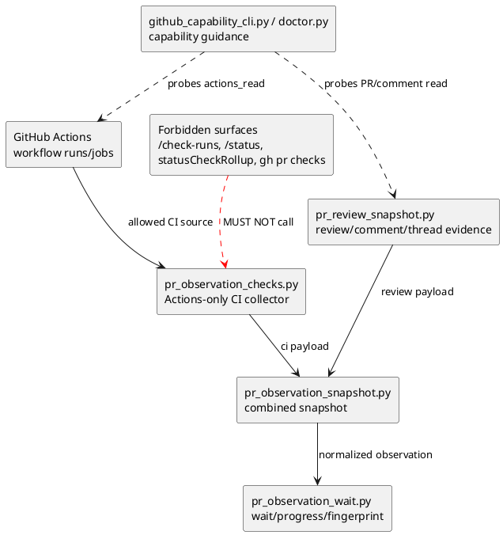
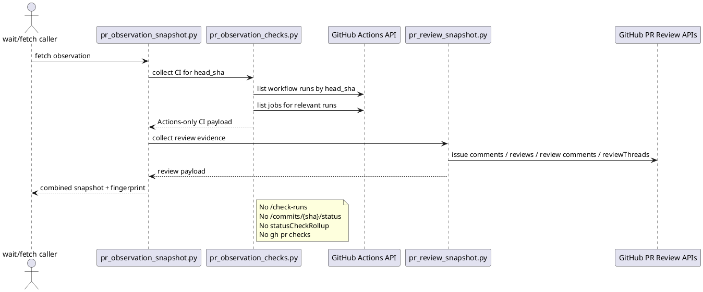

# iss-00222 Forbid Checks API In PR Observation — 設計

## 目的・制約

PR observation の CI 判定を GitHub Actions workflow runs/jobs のみに移行し、GitHub Checks API / legacy commit statuses / PR status rollup surface を呼ばない構造へ変更する。

制約:

- 禁止対象は GitHub Checks API / status rollup surface の利用であり、`checks` という語や compatibility filename の利用ではない。
- Review/comment/thread observation は CI collector と別経路として維持する。
- Provider-side implementation source of truth を先に変更する。
- Dogfooding mirror は検証対象であり、実装 source of truth ではない。

## 既存実装 / 規約の理解

参照した実装 / docs:

- `src/spec_dock/assets/install_root/.agents/skills/github-pr-observation/scripts/lib/pr_observation_checks.py`
- `src/spec_dock/assets/install_root/.agents/skills/github-pr-observation/scripts/lib/pr_observation_snapshot.py`
- `src/spec_dock/assets/install_root/.agents/skills/github-pr-observation/scripts/lib/pr_observation_wait.py`
- `src/spec_dock/assets/install_root/.agents/skills/github-pr-observation/scripts/lib/pr_review_snapshot.py`
- `src/spec_dock/assets/spec_dock/scripts/spec_dock_runtime/infra/github_capability_cli.py`
- `src/spec_dock/assets/spec_dock/scripts/spec_dock_runtime/application/doctor.py`
- `src/spec_dock/assets/install_root/.agents/skills/github-pr-merge-preparer/SKILL.md`
- `src/spec_dock/assets/install_root/.agents/skills/github-pr-merge-preparer/templates/pr-repair-batch.md`
- `tests/unit/infra/test_init_update.py`
- `tests/cli_runtime/test_runtime_doctor_s04.py`
- accepted ADR `discussions/20260620t143349z-adr-forbid-checks-api-in-pr-observation.md`
- delegated design draft `discussions/20260620t145235z-draft-design-actions-only-pr-observation-design-draft.md`

現状理解:

- `pr_observation_checks.py` は既に Actions runs/jobs を読めるが、その後に forbidden supplemental sources を読む。
- 現行の CI 判定は check-runs、commit statuses、status rollup 由来の failed/running/pending/pass を混ぜられる。
- `ci_coverage_limited_to_github_actions` は「補助 checks/statuses/rollup が読めない」ことを limitation として扱っているが、新契約ではこれは正常系である。
- `pr_observation_snapshot.py` は CI collector と review collector の payload を統合する。CI collector の compatibility shape を保てば大きな変更は不要。
- `pr_observation_wait.py` は progress / fingerprint の一部で `ci.check_runs` 前提を持つため、Actions summary へ移す必要がある。
- `pr_review_snapshot.py` は issue comments、PR reviews、PR review comments、review requests、GraphQL `reviewThreads` を読む。これは CI status rollup ではないため維持する。
- `github_capability_cli.py` は現在 `check_runs_read` / `commit_statuses_read` / `status_check_rollup_read` を core capability として probe している。PR observation の core capability は Actions read と PR/comment read へ移す。
- `github-pr-merge-preparer` skill と `pr-repair-batch.md` は、merge-prepared predicate に required/non-required check failure を含めている。Actions-only 変更後は「観測済み Actions CI failure」と「external/non-Actions checks are intentionally unobserved」を区別する wording に更新する必要がある。

採用するパターン:

- 既存 public shell entrypoint は互換維持を優先する。
- CI collector は Actions-only に縮小する。
- 旧 JSON fields は、削除が広すぎる場合は empty/deprecated compatibility fields として残す。ただし fingerprint / decision には使わない。
- Forbidden API 回帰は fake `gh` と static scan で fail-fast にする。

採用しないもの:

- check-runs / commit statuses / status rollup fallback。
- `mergeStateStatus,statusCheckRollup` を使った required check inference。
- `checks` という単語の全面禁止。
- Review GraphQL と CI rollup GraphQL の混同。
- Merge-preparer が GitHub UI の all required checks を観測したかのように表現すること。

## 採用方針 / トレードオフ

決定:

- PR observation CI source of truth は GitHub Actions workflow runs/jobs のみ。
- `GET /repos/{owner}/{repo}/actions/runs?head_sha=<head_sha>` で current head の workflow runs を取得する。
- `GET /repos/{owner}/{repo}/actions/runs/{run_id}/jobs` で run に紐づく jobs を取得する。
- run-level `status` / `conclusion` を primary CI state とし、jobs は failure detail と progress detail を補助する。
- Jobs API が unavailable でも run-level conclusion が terminal failed なら failed を維持する。
- Zero Actions runs は pass にしない。
- External/non-Actions checks は intentional unobserved として扱う。

Tradeoff:

- GitHub UI の all checks / required checks / mergeability と完全一致しない場合がある。
- その代わり、`Checks` / `Commit statuses` permissions を PR observation の前提から外し、forbidden API surface を明確にできる。

## 依存関係分析

module 依存:

- `pr_observation_checks.py`
  - CI collection / classification / limitations / fingerprint の主変更点。
  - 最初に変更する prerequisite。
- `pr_observation_snapshot.py`
  - CI collector subprocess payload を統合する downstream。
  - Compatibility fields を残す場合は小変更で済む。
- `pr_observation_wait.py`
  - CI payload の progress/fingerprint consumer。
  - `ci.check_runs` 前提を Actions run/job summary に移す。
- `pr_review_snapshot.py`
  - Review/comment collector。原則 read-only inspection と regression tests で維持確認する。
- `github_capability_cli.py` / `doctor.py`
  - Runtime doctor capability surface。CI collector 変更後に capability guidance を同期する。
- `github-pr-merge-preparer/SKILL.md` / `templates/pr-repair-batch.md`
  - PR delivery/merge preparation wording consumer。
  - Actions-only observation の範囲を超えて all required checks / non-required checks の完全観測を主張しないように同期する。

file 依存:

- Provider-side shipped assets を source of truth とする。
- `.agents/skills/github-pr-observation/` dogfooding mirror は provider-side update / sync 後の validation target とする。
- Tests は provider-side shipped scripts を fixture 展開して検証する既存 pattern に合わせる。

実装起点:

1. `pr_observation_checks.py` の forbidden collectors / fallback / limitation 削除。
2. `pr_observation_wait.py` の progress/fingerprint 更新。
3. Snapshot / review collector compatibility inspection。
4. Doctor capability migration。
5. Skill/docs wording migration。

## モジュール依存図（Module Dependency Diagram）

- Title: Actions-only PR observation dependency delta
- Question answered: どの module が CI source-of-truth を持ち、どの downstream consumer が payload 変更を受けるか
- Scope: `github-pr-observation` shipped skill scripts と runtime doctor capability
- Excluded details: 全 call graph、test fixture の詳細、GitHub API response schema の全 field
- Update trigger: CI payload shape、doctor capability、review collector boundary が変わるとき



## インターフェース契約

Allowed CI API:

- `GET /repos/{owner}/{repo}/actions/runs?head_sha=<head_sha>`
- `GET /repos/{owner}/{repo}/actions/runs/{run_id}/jobs`

Forbidden CI API / surface:

- `GET /repos/{owner}/{repo}/commits/{ref}/check-runs`
- `GET /repos/{owner}/{repo}/commits/{sha}/status`
- `gh pr view --json statusCheckRollup`
- `gh pr checks` または同等の checks rollup
- Branch protection / mergeability inference that restores status rollup as CI truth

CI payload:

- MUST expose an explicit marker such as `ci.source_policy = "github_actions_only"` or equivalent.
- MUST include Actions run/job summary enough for status, progress, and fingerprint.
- MUST NOT include forbidden source data as observed evidence.
- MAY keep legacy compatibility fields such as `ci.check_runs` / `ci.commit_statuses` / `ci.required_check_state` as empty/deprecated metadata if downstream shape compatibility requires it.
- MUST NOT include legacy compatibility fields in decision/fingerprint as observed source data.
- MUST NOT emit `ci_coverage_limited_to_github_actions`.

Review/comment payload:

- Continue collecting issue comments, PR reviews, PR review comments, requested reviewers/teams, GraphQL `reviewThreads`, and `reviewDecision`.
- GraphQL review evidence is allowed only for review thread state. It must not request CI rollup fields.

## シーケンス差分（Sequence Delta）

変更する相互作用:



retry / external API:

- Existing bounded wait loop remains in `pr_observation_wait.py`.
- GitHub API errors for Actions become limitations / unknown / human gate.
- There is no retry fallback to forbidden sources.

## ドメインモデル差分

- N/A: domain aggregate/entity model は変更しない。
- Status vocabulary is behavioral, not DDD domain model. The CI source policy and state classification are interface contracts above.

## ディレクトリ / ファイル変更計画

```text
src/spec_dock/assets/install_root/.agents/skills/github-pr-observation/
|-- SKILL.md                                      # Modify: Actions-only CI observation wording; review/comment boundary; no word-ban wording
`-- scripts/
    |-- fetch_pr_observation_snapshot.sh          # Inspect/possibly adjust usage text only
    |-- wait_pr_observation.sh                    # Inspect/possibly add zero-actions wording/alias if needed
    `-- lib/
        |-- fetch_pr_checks_snapshot.sh           # Modify: compatibility usage text; still invokes Actions-only collector
        |-- pr_observation_checks.py              # Modify: remove forbidden collectors/fallback/limitations; Actions-only CI payload
        |-- pr_observation_snapshot.py            # Modify: adjust CI payload defaults/fingerprint integration if needed
        |-- pr_observation_wait.py                # Modify: progress/fingerprint from Actions summary, not ci.check_runs
        `-- pr_review_snapshot.py                 # Read only/inspect: preserve review/comment/thread observation

src/spec_dock/assets/install_root/.agents/skills/github-pr-merge-preparer/
|-- SKILL.md                                      # Modify: merge-prepared predicate wording uses observed Actions CI, not all GitHub checks
`-- templates/
    `-- pr-repair-batch.md                        # Modify: repair batch wording records external/non-Actions checks as intentionally unobserved/residual risk when relevant

src/spec_dock/assets/spec_dock/scripts/spec_dock_runtime/
|-- infra/
|   `-- github_capability_cli.py                  # Modify: PR observation capability probe no longer requires Checks/statuses/rollup
`-- application/
    `-- doctor.py                                 # Modify: doctor repair guidance and fallback labels

tests/
|-- unit/infra/test_init_update.py                # Modify: shipped skill script regression tests and fake-gh forbidden-call tests
`-- cli_runtime/test_runtime_doctor_s04.py        # Modify: doctor capability expectations
```

Dogfooding mirror:

```text
.agents/skills/github-pr-observation/             # Validation/update target, not primary edit source
```

## 要件 → 設計マッピング

- AC-001 -> `pr_observation_checks.py` removes forbidden collectors; tests fail on forbidden calls.
- AC-002 -> Actions success run/job classification maps to `passed`.
- AC-003 -> Actions failed/pending/running classification maps to non-pass states.
- AC-004 -> zero Actions runs maps to `none` / `unknown` / human gate, never pass.
- AC-005 -> `pr_review_snapshot.py` remains independent; review tests run with forbidden CI endpoints blocked.
- AC-006 -> `github_capability_cli.py` / `doctor.py` no longer require Checks/statuses/status rollup permissions.
- AC-007 -> `SKILL.md` / script usage / static scan wording distinguishes API ban from word ban.
- EC-001 -> Actions unavailable limitation and no fallback.
- EC-002 -> run-level failed remains failed when jobs unavailable.
- EC-003 -> external/non-Actions checks intentionally unobserved; merge-preparer wording avoids all-required-checks claim.
- EC-004 -> status-only repo is non-pass / human gate.
- EC-005 -> compatibility names allowed while forbidden API calls remain forbidden.

## テスト戦略

Unit / shipped asset tests:

- Fake `gh` fails if `/check-runs`, `/commits/{sha}/status`, `statusCheckRollup`, or `gh pr checks` equivalent is called.
- Actions green fixture passes without `ci_coverage_limited_to_github_actions`.
- Actions failure / pending / running fixtures classify from Actions only.
- Zero Actions runs with legacy green check/status fixture does not pass and must not call legacy endpoints.
- Jobs API unavailable with failed run keeps failed run-level status and records jobs limitation.
- Review/comment/thread fixture still detects review blockers while forbidden CI endpoints are blocked.
- Static scan targets forbidden API strings and status rollup terms in live provider-side source/tests. It must not fail only on `checks` token.

Doctor tests:

- `actions_read` and PR/comment read are the relevant PR observation capabilities.
- `check_runs_read`, `commit_statuses_read`, and `status_check_rollup_read` are not core repair requirements for PR observation.

Docs/spec tests:

- Skill docs and script usage state Actions-only CI observation.
- Compatibility filenames using `checks` are allowed if they do not imply GitHub Checks API usage.
- Merge-preparer skill and PR repair batch template state `merge-prepared` in terms of observed Actions CI and review/thread evidence, not complete GitHub UI required-check coverage.

## リスク / 移行 / ロールバック

Risks:

- Downstream consumers may read legacy `ci.check_runs` fields.
- Compatibility filenames may confuse future maintainers.
- GitHub UI can show external required checks failing while SpecDock reports Actions CI passed.
- Doctor migration can accidentally under-report PR review/comment read capability.
- Merge-preparer wording can overclaim that all required/non-required GitHub checks were observed.

Mitigation:

- Add `ci.source_policy = "github_actions_only"` or equivalent.
- Keep empty/deprecated compatibility metadata where needed.
- Add forbidden-call tests and static scans.
- Add docs wording that external/non-Actions checks are intentionally not observed.
- Keep review/comment read capability diagnostics.
- Update merge-preparer wording and repair-batch template so residual risk includes external/non-Actions checks when relevant.

Rollback:

- Reintroducing Checks/statuses/status rollup requires a new ADR or explicit requirement change.
- Test rollback must remove forbidden-call assertions only after that decision changes.

## 未確定事項

- なし。
