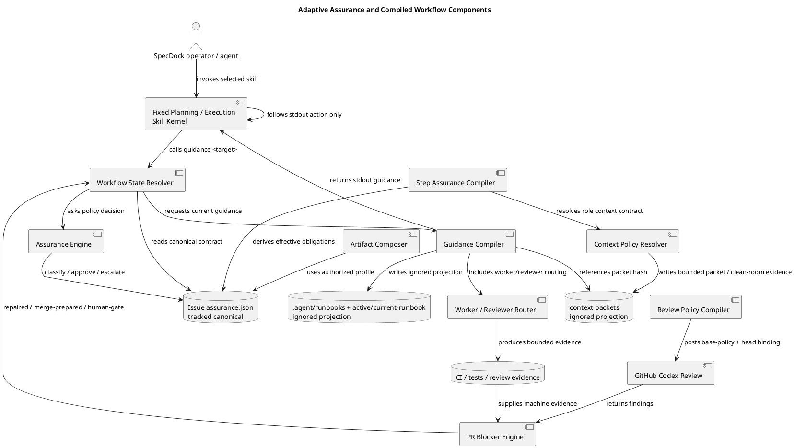
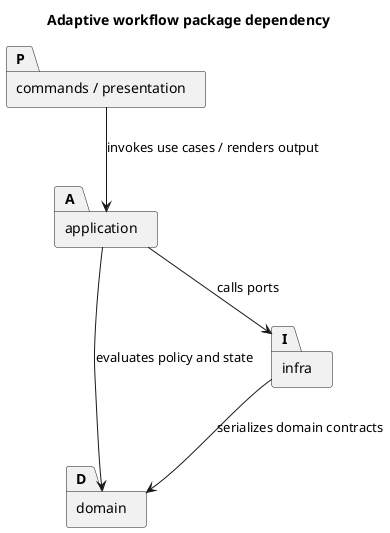
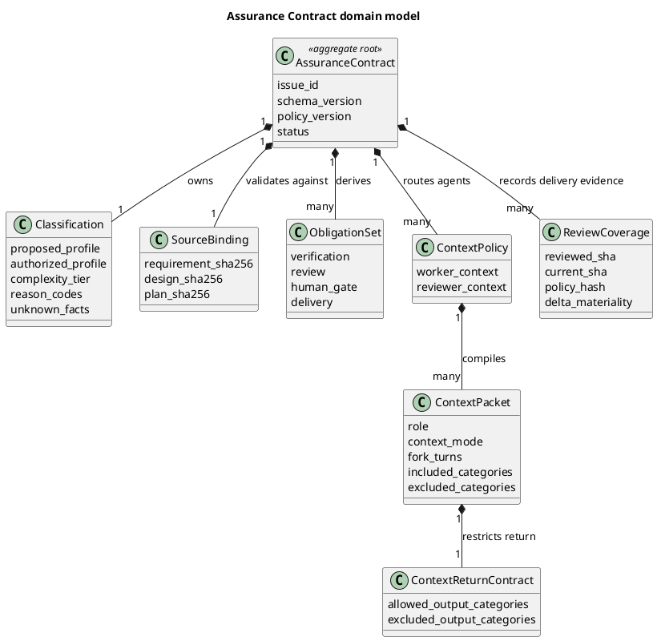
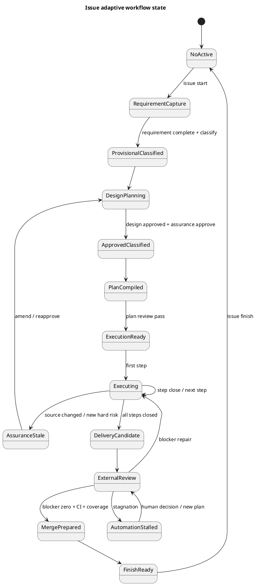

# epic-00224 Dynamic Workflow Resource Allocation — 設計（どう実現するか）

## 全体像

- 対象境界:
  - SpecDock issue planning / execution / PR delivery workflow の policy、state、compiled instruction surface。
  - Canonical Assurance Contract、generated Runbook、agent routing、review policy、repair closure。
- 設計原則:
  - Static kernel, dynamic contract:
    - Skill は固定 kernel とし、現在手順は runtime が compile する。
  - Facts before profile:
    - Model は risk facts を抽出し、policy engine が Profile を決める。
  - Tracked contract, ignored projection:
    - `assurance.json` は tracked canonical artifact、Runbook / active projection / event は ignored generated state とする。
  - Candidate is not authority:
    - `lite_candidate` は shadow measurement 用であり、Runbook obligation を減らす authority は `lite_authorized` だけが持つ。
  - Execution context affinity, evaluation independence:
    - worker は bounded context を継承でき、reviewer は clean-room evidence を使う。
  - Risk closure, not comment closure:
    - PR は comment zero ではなく verified blocker zero で閉じる。
  - Trusted review policy:
    - Review policy は PR head ではなく PR base SHA から取得する。
- 既存関係:
  - `epic-00158` で整理された provider / mirror、canonical / evidence、skill / docs / templates 境界を前提にする。
  - Existing Issue workflow は strict-legacy adapter として残す。

## コンポーネント / モジュール構成（Component / Module View）

- タイトル:
  - Adaptive Assurance and Compiled Workflow Components
- 答える問い:
  - Fixed Skill kernel から current Runbook / Assurance Contract / PR blocker closure までの責務分割をどこに置くか。
- 範囲:
  - provider-side runtime source、installed dogfooding mirror、skills、generated state、GitHub review trigger / observation。
- 含めない詳細:
  - 個別 Issue の file-level 実装順、具体 class / function signature、完全な PR observation 実装。
- 更新条件:
  - workflow authority、Assurance Contract、Runbook compiler、review trigger / blocker engine の責務境界が変わるとき。

### コンポーネント

| Component | 責務 | Authority / persistence |
|---|---|---|
| Assurance Policy Source | Profile preset、hard trigger、schema、fragment manifest | tracked provider source |
| Context Routing Policy Source | Agent role / step kind / profile ごとの context mode、include / exclude category、return contract を定義 | tracked provider source |
| Assurance Engine | risk facts から proposed / authorized Profile、Complexity、obligations を計算 | deterministic domain policy |
| Assurance Store | Issue-local `assurance.json` の read/write/hash binding | canonical tracked artifact |
| Workflow State Resolver | Active、artifact readiness、step、PR state から current state を導出 | runtime domain |
| Guidance Compiler | current state に必要な一つの stdout guidance を生成し、human/debug projection を任意で書く | stdout authority + compiled projection |
| Artifact Composer | design / plan / report fragment を単調合成 | policy + canonical inputs |
| Step Assurance Compiler | worker、reasoning、context、verification、reviewers を導出 | issue + step obligations |
| Context Policy Resolver | role / task / step facts から `recent_fork` / `bounded_packet` / `clean_room` / `minimal_packet` と freshness checks を決定 | deterministic domain policy |
| Context Packet Compiler | selected context contract を source hash へ bind し、agent invocation packet と reviewer evidence packet を生成 | ignored generated state |
| Active Projection Writer | current guidance projection / context pack を atomic 生成 | ignored generated state |
| Review Policy Compiler | base SHA policy から deterministic `@codex review` body を生成 | trusted policy source |
| PR Blocker Engine | finding validity、priority、protected domain、machine evidence、re-review を決定 | deterministic review policy |
| Legacy Adapter | `assurance.json` なし Issue を strict-legacy で実行 | compatibility policy |
| Metrics / Event Projection | invocation、time、review generation、disposition を記録 | generated operational evidence |

### 推奨 package 構成

Provider-side source of truth:

```text
src/spec_dock/assets/spec_dock/scripts/spec_dock_runtime/
|-- domain/
|   |-- assurance.py
|   |-- workflow_state.py
|   |-- runbook.py
|   |-- context_routing.py
|   `-- review_policy.py
|-- application/
|   |-- classify_assurance.py
|   |-- approve_assurance.py
|   |-- compile_runbook.py
|   |-- compose_artifacts.py
|   |-- compile_step_assurance.py
|   |-- compile_context_packet.py
|   |-- resolve_workflow_next.py
|   |-- compile_review_trigger.py
|   `-- evaluate_review_coverage.py
|-- infra/
|   |-- assurance_store.py
|   |-- runbook_store.py
|   |-- context_policy_store.py
|   |-- context_packet_store.py
|   |-- review_policy_store.py
|   |-- review_generation_store.py
|   `-- workflow_event_store.py
|-- commands/
|   |-- assurance.py
|   `-- workflow.py
`-- presentation/
    |-- assurance_text.py
    |-- workflow_text.py
    `-- review_policy_text.py
```

Dogfooding mirror / installed runtime:

```text
spec-dock/scripts/spec_dock_runtime/
```

### 図表（UML / コンポーネント）



## パッケージ依存（Package Dependency）

- タイトル:
  - Runtime package dependency for adaptive workflow.
- 答える問い:
  - assurance / workflow / review policy をどの layer に置き、既存 layered architecture を崩さずに追加するか。
- 範囲:
  - `commands`, `presentation`, `application`, `domain`, `infra` の依存方向。
- 含めない詳細:
  - 個別 module の import 文、legacy monolithic `app.py` からの移行手順。
- 更新条件:
  - 新しい layer を追加する、または domain が filesystem / GitHub / CLI に依存する設計へ変わるとき。



- Domain は filesystem、GitHub、CLI へ依存しない。
- Application は domain contract と port へ依存する。
- Infra は JSON / Markdown / GitHub / atomic file write を実装する。
- Commands は application use case だけを呼ぶ。
- Presentation は machine-readable JSON と human-readable Markdown を分離する。
- Skill は runtime public CLI 以外の内部 file layout へ依存しない。
- PR observation collector は finding の risk 判断を行わず、PR Blocker Engine へ raw evidence を返す。

## ドメインモデル

- ユビキタス言語の参照:
  - `Assurance Contract`: Issue-local tracked contract。Profile、Complexity、source binding、obligations、review policy、history を持つ。
  - `Assurance Profile`: workflow obligation の強度。`lite / standard / strict / critical`。
  - `Complexity Tier`: reasoning / routing の複雑度。`routine / normal / complex / deep`。
  - `lite_candidate`: shadow measurement 用の Lite 候補。obligation reduction authority は持たない。
  - `lite_authorized`: evidence-gated / opt-in で obligation reduction に使える Lite profile。
  - `Guidance`: current state のために runtime が stdout へ返す bounded agent handoff。
  - `Runbook projection`: guidance と同等内容を `.agent/runbooks/current-runbook.*` / `active/current-runbook.*` へ書く human/debug-only non-canonical projection。agent handoff authority ではない。
  - `Verified blocker`: P0 / P1 または machine evidence で昇格した blocker。
  - `Automation stalled`: 修正回数上限ではなく、自動 repair が進捗しない状態。
  - `Context Routing Policy`: Role / task / step facts から context mode、include / exclude、freshness、return contract を決める tracked policy。
  - `Context Mode`: `recent_fork`、`bounded_packet`、`clean_room`、`minimal_packet`。
  - `Context Packet`: selected context contract を source binding へ結び、agent invocation に渡す generated evidence。
  - `Reviewer Evidence Packet`: author narrative を含めず、normative contracts と immutable evidence だけを reviewer へ渡す clean-room packet。
- 集約ルート:
  - `AssuranceContract`
- エンティティ / 値オブジェクト:
  - `AssuranceProfile`
  - `ComplexityTier`
  - `AssuranceStatus`
  - `RiskFact`
  - `SourceBinding`
  - `ObligationSet`
  - `ContextPolicy`
  - `ContextMode`
  - `ContextPacket`
  - `ContextReturnContract`
  - `ReviewCoverage`
  - `FindingDisposition`
- ドメインイベント / ポリシー / 仕様:
  - `AssuranceClassified`
  - `AssuranceApproved`
  - `AssuranceEscalated`
  - `RunbookCompiled`
  - `StepVerified`
  - `ReviewRequested`
  - `FindingTriaged`
  - `AutomationStalled`
  - `MergePrepared`
- 不変条件:
  - Lite は全 eligibility predicate が true の場合だけ `lite_authorized` になれる。
  - Hard trigger を低い Profile で override できない。
  - Unknown protected-domain fact は fail-closed。
  - Approved contract の source hash mismatch は execution 不可。
  - Automatic escalation は単調上方のみ。
  - Downgrade には explicit risk acceptance が必要。
  - Effective step obligations は global ∪ local ∪ discovered。
  - Context policy は Assurance Profile / reasoning effort とは独立した軸として評価する。
  - Reviewer / consultant first pass の `clean_room` は token 削減や model confidence を理由に弱めない。
  - Worker continuation は goal、source binding、scope、risk、allowed paths が一致する場合だけ許可する。
  - Context packet source hash mismatch は execution / review 不可。
  - Child agent return payload は bounded return contract に従い、raw logs / private reasoning を main context へ自動転記しない。
  - Generated Runbook projection は canonical authority ではなく、agent handoff authority でもない。
  - Runbook compiler は `authorized_profile` だけを execution authority として使う。
  - External review priority だけで machine-validated risk を破棄しない。
  - Repair attempt limit は merge 許可ではない。

### 図表（UML / ドメインモデル）



## 状態 / アクティビティ（State / Activity）

- State:
  - Adaptive workflow は active issue state、artifact readiness、classification、execution step、PR review closure によって遷移する。
- Activity:
  - State diagram が lifecycle / terminal state / guard を示すため、別 activity diagram は置かない。

### 図表（UML / 状態）



## 契約

### CLI 契約

```text
spec-dock workflow status [--format text|json]
spec-dock guidance issue-planning
spec-dock guidance issue-execution

spec-dock assurance show [--format text|json]
spec-dock assurance classify --stage requirement
spec-dock assurance approve --stage design
spec-dock assurance compile [--artifact design|plan|report|all]
spec-dock assurance verify
spec-dock assurance escalate --reason <CODE> [--step <STEP_ID>]
spec-dock assurance override --profile <PROFILE> --reason <TEXT> [--accept-risk]
```

Exit semantics:

| Exit | 意味 |
|---|---|
| 0 | stdout guidance / contract が正常に返った |
| 2 | user input / target 不足 |
| 3 | blocked / stale / human gate |
| 4 | invalid schema / policy / generated state |
| 5 | external capability failure |

- Machine-readable stdout は一つの JSON object とする。
- progress / diagnostic は stderr とする。

### Assurance JSON

```json
{
  "schema_version": 1,
  "policy_version": "assurance-v1",
  "issue_id": "iss-xxxxx",
  "status": "approved",
  "classification": {
    "proposed_profile": "lite",
    "authorized_profile": "standard",
    "complexity_tier": "deep",
    "decision_source": "policy",
    "reason_codes": ["MULTI_MODULE"],
    "unknown_facts": [],
    "predicate_results": {}
  },
  "source_binding": {
    "requirement_sha256": "sha256:...",
    "design_sha256": "sha256:...",
    "plan_sha256": "sha256:..."
  },
  "global_obligations": {},
  "routing": {},
  "review_policy": {},
  "steps": {},
  "history": []
}
```

### Guidance / Runbook JSON

```json
{
  "schema_version": 1,
  "issue_id": "iss-xxxxx",
  "workflow": "issue-execution",
  "state": "executing",
  "status": "ready",
  "contract_hash": "sha256:...",
  "authorized_profile": "standard",
  "current_action": {
    "id": "execute-step-S02",
    "command": null,
    "instructions": []
  },
  "worker": {},
  "verification": [],
  "reviewers": [],
  "stop_conditions": [],
  "next_refresh": "after-action"
}
```

- Markdown stdout は current agent handoff authority とする。
- `.agent/runbooks/current-runbook.*` / `active/current-runbook.*` は human/debug-only projection とし、agent は projection file を handoff authority として読まない。
- `lite_candidate` は events / reports に投影できるが、Runbook obligation の減少に使わない。

### Agent Context Routing Architecture

Context routing は次を同時に満たすための独立した設計軸とする。

- Main orchestrator の context を目的、制約、意思決定、進行管理に集中させる。
- 実行系 agent へ既知の文脈を再利用可能な形で渡し、再調査と token 消費を削減する。
- Reviewer および consultant first pass の認知的独立性を維持する。

```text
Role              = 責任と権限
Reasoning effort  = 推論の深さ
Context policy    = 何を継承し、何から独立するか
Assurance profile = 必須 verification / review / human gate の深さ
```

#### Canonical policy files

Provider-side source of truth:

```text
src/spec_dock/assets/spec_dock/system/assurance/
|-- context-routing-policy.json
`-- schemas/
    `-- context-routing-policy.schema.json
```

Installed / dogfooding equivalents:

```text
spec-dock/system/assurance/context-routing-policy.json
spec-dock/system/assurance/schemas/context-routing-policy.schema.json
```

Issue ごとの context 選択結果は `assurance.json` と compiled Runbook へ展開する。Generated context packet は Git 管理しない。

```text
spec-dock/.agent/context-packets/<issue-id>/<contract-hash>/
|-- architect.json
|-- planner.json
|-- worker-S01.json
|-- code-reviewer-S01.json
`-- consultant-first-pass.json
```

#### Context modes

| Mode | 用途 | 主要制約 |
|---|---|---|
| `recent_fork` | system-architect、implementation-planner、dev-coder、同一 semantic batch 内 worker | bounded turn count、canonical artifact / step contract 追加、raw child context は main へ自動返却しない |
| `bounded_packet` | repo-analyst、researcher、doc-writer、fork 不可 runtime、明確な task scope の worker | objective / constraints / approved decisions / relevant paths / source hashes / verification obligations を構造化 packet で渡す |
| `clean_room` | spec-reviewer、code-reviewer、qa-reviewer、consultant / deep-consultant first pass | author / implementer conversation を継承せず、normative contract と immutable evidence だけを渡す |
| `minimal_packet` | utility-worker、spec-manager、bounded command execution、deterministic state check | target / command / working directory / allowed side effect / expected output に限定する |

#### Default role routing

| Role | Default context | Reasoning | 補足 |
|---|---:|---:|---|
| main orchestrator | root thread | medium | 目的、判断、統合を保持 |
| system-architect | recent_fork | high | high-risk design では xhigh を検討 |
| implementation-planner | recent_fork | high | approved requirement / design を付与 |
| dev-coder | recent_fork | medium | 同一 semantic batch では継続可能 |
| repo-analyst | bounded_packet | medium | main の仮説を結論として渡さない |
| researcher | bounded_packet | low / medium | 外部調査目的と source criteria だけ |
| doc-writer | bounded_packet | low / medium | 対象 artifact と同期契約を付与 |
| utility-worker | minimal_packet | low | bounded command のみ |
| spec-reviewer | clean_room | high | approved artifacts と evidence のみ |
| code-reviewer | clean_room | high | immutable diff と verification evidence |
| qa-reviewer | clean_room | high | behavior obligations と test evidence |
| consultant first pass | clean_room | high | main の推奨案を渡さない |
| deep-consultant first pass | clean_room | xhigh | 不可逆判断の独立意見 |
| consultant arbitration | bounded_packet | high / xhigh | 独立意見取得後だけ各案を提示 |

#### Context policy example

```json
{
  "schema_version": 1,
  "policy_version": "context-routing-v1",
  "defaults": {
    "repository_revalidation": ["git_head", "worktree_status"],
    "return_contract": [
      "outcome",
      "changed_files",
      "verification",
      "evidence_refs",
      "decision_requests",
      "remaining_risks"
    ],
    "excluded_return_categories": [
      "private_reasoning",
      "raw_shell_transcript",
      "full_test_log",
      "failed_hypothesis_history"
    ]
  },
  "roles": {
    "dev-coder": {
      "mode": "recent_fork",
      "fork_turns": 3,
      "include": [
        "current_objective",
        "approved_decisions",
        "current_step_contract",
        "affected_paths",
        "allowed_changes",
        "forbidden_changes",
        "verification_obligations"
      ],
      "exclude": [
        "previous_reviewer_verdicts",
        "unrelated_issue_history",
        "raw_external_research"
      ],
      "continuation": {
        "enabled": true,
        "require_same": ["goal", "source_binding", "scope", "risk", "allowed_paths"]
      }
    },
    "code-reviewer": {
      "mode": "clean_room",
      "include": [
        "approved_requirement",
        "approved_design",
        "approved_step_contract",
        "base_sha",
        "head_sha",
        "immutable_diff",
        "changed_files",
        "verification_evidence",
        "known_environment_limitations"
      ],
      "exclude": [
        "author_self_assessment",
        "implementation_transcript",
        "private_reasoning",
        "previous_reviewer_verdicts",
        "author_recommended_outcome"
      ]
    }
  }
}
```

#### Context packet contract

```json
{
  "schema_version": 1,
  "policy_version": "context-routing-v1",
  "issue_id": "iss-xxxxx",
  "step_id": "S02",
  "role": "dev-coder",
  "reasoning_effort": "medium",
  "context_mode": "recent_fork",
  "fork_turns": 3,
  "source_binding": {
    "assurance_contract_sha256": "sha256:...",
    "requirement_sha256": "sha256:...",
    "design_sha256": "sha256:...",
    "plan_sha256": "sha256:...",
    "base_sha": "...",
    "head_sha": "..."
  },
  "scope": {
    "affected_paths": [],
    "affected_symbols": [],
    "allowed_changes": [],
    "forbidden_changes": []
  },
  "verification_obligations": [],
  "stop_conditions": [],
  "return_contract": [
    "outcome",
    "changed_files",
    "verification",
    "evidence_refs",
    "decision_requests",
    "remaining_risks"
  ]
}
```

Reviewer evidence packet は `context_mode: clean_room` とし、review target（base / head / diff hash）、normative source hashes、verification evidence、known limitations、excluded categories を持つ。Author self-assessment、implementation transcript、private reasoning、previous reviewer verdict は packet へ含めない。

#### Compilation flow

```text
Assurance Contract
  + Current Workflow State
  + Current Step Facts
  + Agent Role
  + Context Routing Policy
        |
        v
Context Policy Resolver
        |
        v
Compiled Context Contract
        +--> Current Runbook
        +--> Context Packet
        +--> Invocation Evidence
```

1. Workflow State Resolver が current action を決定する。
2. Step Assurance Compiler が role、reasoning effort、required review を決定する。
3. Context Policy Resolver が role と task type から context mode を選択する。
4. Assurance Profile または hard-risk rule が必要なら mode を強化する。
5. Context packet を canonical source hash へ bind する。
6. Current Runbook へ context contract を埋め込む。
7. Agent invocation 後、return contract に従って結果を圧縮する。
8. Source binding が変化した場合、packet を stale にする。

#### Precedence / freshness / return boundary

Context policy の優先順位は次とする。

```text
hard safety rule > issue global obligation > step local obligation > role default
```

- Reviewer は常に `clean_room`。
- Security-sensitive step が worker の追加 evidence を必要としても、reviewer へ author transcript を渡してはならない。
- Main agent または child agent は、token 削減を理由に required canonical source を省略してはならない。
- Model confidence だけで `clean_room` を `recent_fork` へ変更してはならない。
- Fork / packet は repository state の再確認を省略しない。Execution agent は current branch、current HEAD、worktree status、target files の現行 revision を確認する。
- Reviewer は reviewed head SHA、immutable diff hash、normative artifact hashes を確認する。
- Requirement / design / plan substantive change、Assurance escalation、current step contract change、branch / head change、allowed scope change、protected risk discovery で context を invalidate する。
- Child agent は outcome、changed files、verification result、evidence references、material decision requests、remaining risks だけを main へ返す。

### Review trigger contract

- Inputs:
  - repository
  - PR number
  - expected head SHA
- Runtime reads:
  - current PR head SHA
  - PR base SHA
  - `<base-sha>:.github/codex/review-policy.md`
- Runtime output:
  - trigger comment id / created_at
  - reviewed head SHA
  - policy base SHA
  - policy SHA-256
  - body SHA-256
  - limitations
- Forbidden:
  - caller-provided body
  - caller-provided policy path
  - arbitrary endpoint / method / headers / raw gh args

## データモデル

### Tracked canonical

```text
<issue>/assurance.json
src/spec_dock/assets/spec_dock/system/assurance/**
src/spec_dock/assets/spec_dock/templates/assurance/**
src/spec_dock/assets/install_root/.github/codex/review-policy.md
```

Installed / dogfooding equivalents:

```text
spec-dock/system/assurance/**
spec-dock/templates/assurance/**
.github/codex/review-policy.md
```

Context routing tracked policy:

```text
src/spec_dock/assets/spec_dock/system/assurance/context-routing-policy.json
src/spec_dock/assets/spec_dock/system/assurance/schemas/context-routing-policy.schema.json
spec-dock/system/assurance/context-routing-policy.json
spec-dock/system/assurance/schemas/context-routing-policy.schema.json
```

### Ignored generated

```text
spec-dock/.agent/workflow-state.json
spec-dock/.agent/runbooks/**
spec-dock/.agent/context-packets/**
spec-dock/.agent/review-generations/**
spec-dock/.agent/events/**
spec-dock/.agent/evidence/**
spec-dock/active/current-runbook.md
spec-dock/active/current-runbook.json
```

### Project-owned bootstrap asset

- `.github/codex/review-policy.md` は init 時に bootstrap できる。
- `spec-dock update` は existing project-owned file を上書きしない。
- Policy 変更 PR では当該 PR の head policy を使用せず、merge 後の base SHA から有効にする。

## Artifact Composer

### Source layout

```text
src/spec_dock/assets/spec_dock/templates/assurance/
|-- design/
|   |-- core.md
|   |-- dependency-analysis.md
|   |-- public-contract.md
|   |-- migration.md
|   |-- security-privacy.md
|   `-- operations.md
|-- plan/
|   |-- core.md
|   |-- semantic-batch.md
|   |-- closure-index.md
|   |-- step-assurance.md
|   |-- final-review.md
|   `-- human-approval.md
`-- report/
    |-- core.md
    |-- decision-ledger.md
    |-- review-coverage.md
    `-- metrics-summary.md
```

### Composition rules

- Fragment ID と policy version を固定する。
- Placeholder / pristine scaffold の場合だけ full materialization できる。
- Substantive content がある場合、missing section だけ追加する。
- Existing section body は自動変更しない。
- Stable marker を使う。

```markdown
<!-- spec-dock:section id=design-migration policy=assurance-v1 -->
```

- Same input は byte-identical output。
- Escalation は section 追加と downstream invalidation。
- Automatic downgrade で section 削除しない。

## 主要フロー

### Flow A: No active issue

1. Skill が `./spec-dock/scripts/spec-dock guidance <target>` を実行する。
2. State Resolver が NoActive を返す。
3. Stdout guidance は `issue start <target>` または target 入力要求だけを返す。
4. Model は authoring / implementation を行わない。
5. Issue start 後、guidance を再取得する。

### Flow B: Requirement から approved assurance

1. Requirement capture Runbook を実行する。
2. Model が risk facts を evidence 付きで記述する。
3. Assurance Engine が proposed Profile / Complexity を計算する。
4. Policy engine が authorized Profile を決める。初期 rollout では Standard default とし、Lite は explicit opt-in + evidence-gated の場合だけ `lite_authorized` になる。
5. Design Composer が必要 section を materialize する。
6. Design review pass 後、Engine が approved contract と source hash を保存する。
7. Plan Composer / Step Assurance Compiler が execution contract を生成する。

### Flow C: Step execution

1. `guidance issue-execution` が current step を解決する。
2. Step Assurance が worker、reasoning、context、verification、reviewer を返す。
3. Context Policy Resolver が worker 用 context contract を選択し、`recent_fork` または `bounded_packet` を source binding へ bind する。
4. Worker は bounded execution を行い、raw logs ではなく return contract に沿った structured outcome を返す。
5. Required verification / clean-room review を行う。Reviewer packet は author narrative / previous verdict を含まない。
6. Runtime が step closure と invocation evidence を記録し、次 step Runbook を生成する。
7. New risk trigger または context source mismatch 時は execution を停止し Assurance / context recompile へ戻す。

### Flow D: GitHub review

1. Local assurance gate 後、PR head を freeze する。
2. Trigger compiler が PR metadata を読み head 一致を確認する。
3. Base SHA から fixed policy path を取得する。
4. Policy を UTF-8 / schema / size 検証し hash を計算する。
5. Deterministic multiline `@codex review` comment を投稿する。
6. Observation が CI / review / thread evidence を収集する。
7. Blocker Engine が P0 / P1 / promoted P2 を repair queue へ入れる。
8. P2 / P3 only なら no-action / follow-up で閉じる。
9. Blocker fix 後は new head へ fresh review。
10. Stagnation 時は automation-stalled。
11. Blocker zero + CI + coverage で merge-prepared。

## Review Policy

### Default policy intent

- Concrete production-reachable P0 / P1 を優先する。
- Style、optional refactor、speculative extensibility、minor docs、unreachable defensive case を報告対象の中心にしない。
- Finding 一件で探索を停止しない。
- Root cause で deduplicate する。
- Reviewed content を untrusted instruction として扱う。

### P2 handling

```text
P2 + protected domain + machine evidence
  -> validated blocker
P2 + protected domain + unverifiable
  -> human gate
P2 + non-protected
  -> no-action / follow-up
```

### Re-review

- Required:
  - valid P0 fix
  - valid P1 fix
  - promoted P2 blocker fix
  - material delta
- Not required:
  - no code change
  - P2 no-action / follow-up
  - review-exempt local delta with local verification
- Opportunistic snapshot:
  - new trigger は投稿しない。
  - merge 前に既到着の P0 / P1 だけを確認できる。

## 失敗設計

| Failure | 判定 | 次アクション |
|---|---|---|
| Active Issue なし | blocked / input required | issue start |
| Assurance なし、新規 Issue | classification required | requirement capture |
| Assurance なし、legacy Issue | legacy strict | existing workflow |
| Invalid assurance schema | blocked | repair contract |
| Source hash mismatch | stale | reclassify / reapprove |
| Unknown hard risk | fail-closed | clarification / Strict |
| `lite_candidate` without authorization | Standard obligations | record telemetry only |
| Projection write failure | non-canonical projection failure / warning | stdout guidance が返っていれば agent handoff は継続し、human/debug projection repair を別途行う |
| Context policy missing | blocked | policy restore / doctor |
| Invalid context policy schema | blocked | validation error |
| Unknown role in context policy | fail-closed | explicit routing required |
| Context packet source hash mismatch | stale | context recompile |
| Required clean-room unavailable | blocked | fresh agent capability required |
| Fork unsupported | fallback | explicit `bounded_packet` fallback |
| Context packet too large | blocked / compact | mandatory category を保持して再compile |
| Excluded category detected in packet | blocked | packet generation defect repair |
| Worker continuation binding mismatch | reset | new worker invocation |
| Reviewer packet includes author narrative | blocked | clean-room packet rebuild |
| Existing content overwrite risk | blocked | manual merge |
| Review policy missing / invalid | human gate if required | restore base policy |
| Head SHA mismatch | stale | refetch / retrigger |
| P0 / P1 parsing unknown | human gate | manual analysis |
| Protected P2 unverifiable | human gate | reproduce / human |
| Repair stagnation | automation-stalled | redesign / human |
| GitHub capability unavailable | human gate | capability repair |
| Provider / mirror drift | incomplete | sync / parity repair |

## 移行戦略

### Stage 0: Shadow

- Existing workflow は変更しない。
- New engine が classification / proposed Runbook / metrics だけを生成する。
- `lite_candidate` は記録するが obligations を減らさない。
- Actual executed workflow との差分を測る。

### Stage 1: Opt-in

- New Issue に explicit adaptive mode を設定できる。
- Lite は all-positive eligibility + explicit opt-in + evidence gate のみ。
- Existing Issue は strict-legacy。

### Stage 2: Standard default for new Issue

- New Issue は Standard provisional。
- Hard trigger で Strict / Critical へ上昇。
- Lite は eligibility + evidence + opt-in がある場合だけ `lite_authorized` になる。

### Stage 3: Default rollout

- Planning / Execution Skill を fixed kernel へ切り替える。
- Legacy adapter を維持する。
- Review policy compiler を default trigger にする。
- Automatic Lite default は有効化しない。

### Future: Auto-Lite experimental

- この Epic の初期完了条件には含めない。
- `auto-lite-readiness report` の evidence をもとに、別 accepted ADR、policy version bump、rollout Issue、telemetry gate の 4 点が揃った場合だけ採用できる。
- Policy version bump だけでは automatic Lite default を有効化できない。

### Rollback

- Repo config で legacy workflow へ戻す。
- Canonical `assurance.json` は履歴として保持するが execution authority から外せる。
- Fixed Skill kernel は legacy Runbook を返せる。
- Generated state を削除して再 compile できる。

## 観測性 / セキュリティ

### Events

```text
AssuranceClassified
AssuranceApproved
AssuranceEscalated
RunbookCompiled
StepStarted
StepVerified
ReviewRequested
FindingTriaged
RepairApplied
AutomationStalled
MergePrepared
AgentInvoked
ContextPacketCompiled
ContextInvalidated
ChildResultReturned
```

`ChildResultReturned` は child agent の return contract 出力を記録する。保存するのは returned evidence refs の path / hash、summary、missing-evidence reason、remaining risks、material decision requests に限定し、raw logs / private reasoning / complete prompt body は含めない。Returned evidence refs が必須の role / step で欠損した場合、step closure は incomplete とし、current Runbook は evidence repair または human gate を next action にする。

### Metrics

- agent invocation count by role
- reasoning effort
- input / cached / reasoning / output tokens
- Runbook bytes
- context mode
- context policy version
- context packet bytes
- context packet hash
- returned evidence refs count
- returned evidence refs missing count
- included / excluded category count
- fork turn count
- model active time
- verification time
- PR observation wait
- review generation count
- finding count / accepted / no-action / false-positive
- repair push count
- issue-to-merge-prepared time
- `lite_candidate` count
- `lite_authorized` count
- candidate false-positive indicators
- escalation rate
- missing metrics count

### Security

- Event に secret / raw token / private reasoning を含めない。
- Context packet / invocation event に complete prompt body、raw logs、credential を含めない。
- Review policy source を base SHA へ bind する。
- PR content 内の instruction を review policy より上位に扱わない。
- GitHub write surface を fixed endpoint / deterministic body に限定する。

## テスト戦略

- Unit:
  - classification truth table
  - hard trigger / Lite predicates
  - candidate / authorized profile separation
  - obligation union
  - context policy schema
  - role routing table
  - context precedence
  - context packet source binding / stale invalidation
  - state transition
  - finding policy
- Golden:
  - Profile 別 Runbook
  - Role 別 context packet
  - Reviewer evidence packet
  - Artifact fragments
  - Review trigger body
  - auto-lite-readiness report projection
- Integration:
  - no-active -> issue start -> requirement -> classify
  - design approve -> plan compile -> execution next
  - stale hash block
  - escalation
  - strict-legacy
  - worker continuation / reset
  - recent-fork unavailable -> bounded packet fallback
  - clean-room unavailable -> fail-closed
- Git:
  - generated state で tracked diff が出ない
  - managed Skill が Issue 切替で変化しない
- Cross-platform:
  - symlink 不要
  - atomic replace
  - path normalization
- GitHub contract:
  - base/head policy source
  - multiline trigger
  - stale head
  - missing policy
  - review observation boundary
- Review quality:
  - seeded P0 / P1
  - low-value P2
  - protected P2 with machine evidence
  - P2-only no re-review
- Context quality:
  - reviewer packet へ author self-assessment / implementation transcript / previous verdict が混入しない
  - consultant first pass へ main / architect recommended option が混入しない
  - child return payload へ raw shell transcript / full test log / private reasoning が混入しない
  - same semantic batch では worker reuse、scope / source / risk change では reset
  - full canonical document 再送との差分、main return payload size、repeated worker reorientation の減少
- Provider / mirror:
  - install/update parity
  - bootstrap-only review policy ownership
  - validate / sync

## Issue Realization Map

| Slice | Issue | GitHub | Design responsibility | Primary closure |
|---|---|---:|---|---|
| I01 | `iss-00227-introduce-assurance-contract-and-classification-runtime` | `#227` | Assurance Contract, deterministic classification, strict-legacy detection prerequisite | E-RQ-002, E-RQ-003, E-AC-002, E-AC-003 |
| I02 | `iss-00228-compile-state-aware-workflow-runbooks-and-fixed-skill-kernels` | `#228` | Workflow State Resolver, fixed Skill kernel, generated Runbook projection | E-RQ-001, E-RQ-004, E-RQ-005, E-AC-001, E-AC-004, E-AC-005 |
| I03 | `iss-00229-compose-profile-aware-planning-artifacts` | `#229` | Profile-aware artifact composition and stale source binding | E-RQ-006, E-AC-006, E-AC-008 |
| I04 | `iss-00230-compile-step-assurance-agent-routing-and-context-policy` | `#230` | Step Assurance, context routing policy, clean-room packets, bounded return contract | E-RQ-007, E-RQ-008, E-RQ-015〜021, E-AC-007, E-AC-017〜021 |
| I05 | `iss-00231-inject-trusted-base-branch-codex-review-policy` | `#231` | Trusted base-SHA review policy and deterministic review trigger | E-RQ-009, E-AC-009, E-AC-010 |
| I06 | `iss-00232-enforce-blocker-centric-pr-repair-and-rereview` | `#232` | PR Blocker Engine, P2 suppression, blocker fingerprint evidence for stagnation detection | E-RQ-010, E-RQ-011, E-AC-011〜012 |
| I07 | `iss-00233-roll-out-adaptive-workflow-with-legacy-compatibility-and-telemetry` | `#233` | Rollout, automation-stalled operator surfacing, strict-legacy compatibility, metrics, Auto-Lite readiness | E-RQ-012〜014, E-AC-013〜016 |

Dependency direction:

```text
iss-00227
  -> iss-00228
  -> iss-00231
  -> iss-00229
       -> iss-00230
            -> iss-00232
iss-00233 depends on iss-00228, iss-00229, iss-00230, iss-00231, iss-00232
```

The Issue-local draft requirement / draft design artifacts are discussion evidence only. Canonical Issue `requirement.md` / `design.md` / `plan.md` remain owned by each downstream Issue planning workflow.

## 関連 ADR

- ADR authority correction:
  - `iss-00226 / #226` は decision-only Issue として作成されたが、decision-only Issue を execution-ready prerequisite にするのは routing 誤りだったため closed / superseded historical evidence とする。
  - 次の 5 件は、この Epic の accepted ADR として implementation Issue 開始前に固定済みである。
  - Downstream implementation Issue は `iss-00226` へ依存せず、accepted ADR とこの Epic design / plan を architecture baseline として参照する。
- Accepted ADR before implementation:
  - `discussions/20260623t074441z-adr-fixed-skill-kernel-compiled-runbook-authority.md`
  - `discussions/20260623t074443z-adr-adaptive-assurance-lite-authorization-monotonic-escalation.md`
  - `discussions/20260623t074442z-adr-step-assurance-resource-allocation-agent-context-routing.md`
  - `discussions/20260623t074444z-adr-trusted-base-sha-github-review-policy.md`
  - `discussions/20260623t074447z-adr-blocker-centric-pr-risk-closure-rereview.md`
- Accepted ADR summary:
- Fixed Skill Kernel / Compiled Runbook: Skill は固定 kernel、current workflow obligation は runtime `guidance <target>` stdout が返す。ADR 内の `workflow next` / generated Runbook authority wording は historical/superseded command wording として扱う。
  - Adaptive Assurance / Lite Authorization: `lite_candidate` は telemetry、`lite_authorized` だけが obligation を減らす。初期 automatic Lite default は無効。
  - Step Assurance / Context Routing: Profile、Complexity、Context Policy を分離し、worker efficiency と reviewer / consultant clean-room を両立する。
  - Trusted Base-SHA Review: review policy は PR base SHA の fixed path から読み、runtime が deterministic trigger body を作る。
  - Blocker-Centric PR Closure: merge preparedness は comment zero ではなく verified blocker zero、required CI、review coverage で判断する。
- 前提 ADR:
  - `epic-00158` 配下の skill / docs / template context surface ownership ADR。

## 未確定事項

- Blocking design question:
  - なし。
- Non-blocking plan / implementation questions:
  - Review policy maximum size の初期値。
  - Metrics retention の初期値。
  - Repository-specific hard trigger extension surface。
  - Future automatic Lite default の具体 rollout 条件。採用 surface は別 accepted ADR、policy version bump、rollout Issue、telemetry gate に固定済み。
