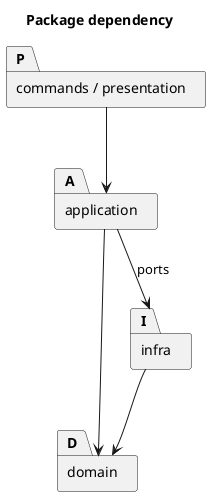
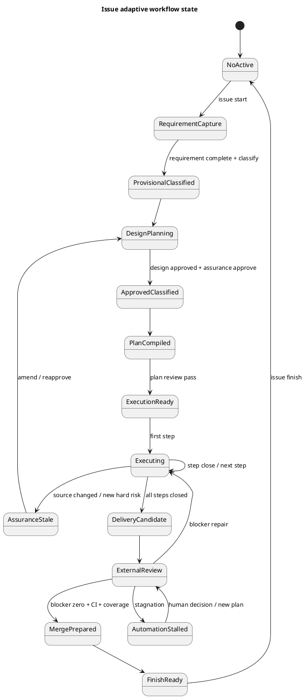

# <EPIC_ID> Adaptive Assurance And Compiled Agent Workflow — 設計（どう実現するか）

## 全体像

- 対象境界:
  - SpecDock issue planning / execution / PR delivery workflowのpolicy、state、compiled instruction surface。
  - Canonical Assurance Contract、generated Runbook、agent routing、review policy、repair closure。
- 設計原則:
  - **Static kernel, dynamic contract**: Skillは固定kernel、現在手順はruntimeがcompileする。
  - **Facts before profile**: Modelはrisk factsを抽出し、policy engineがProfileを決める。
  - **Tracked contract, ignored projection**: `assurance.json`はtracked、Runbook / active stateはignored。
  - **Execution context affinity, evaluation independence**: workerはbounded contextを継承し、reviewerはclean-room evidenceを使う。
  - **Risk closure, not comment closure**: PRはcomment zeroではなくverified blocker zeroで閉じる。
  - **Trusted review policy**: Review policyはPR base SHAから取得する。
- 既存関係:
  - `epic-00158`で整理されたprovider / mirror、canonical / evidence、skill / docs / templates境界を前提にする。
  - Existing issue workflowはstrict-legacy adapterとして残す。

## コンポーネント / モジュール構成（Component / Module View）

### コンポーネント

| Component | 責務 | Authority |
|---|---|---|
| Assurance Policy Source | Profile preset、hard trigger、schema、fragment manifest | tracked provider source |
| Assurance Engine | risk factsからProfile / Complexity / obligationsを計算 | deterministic domain policy |
| Assurance Store | Issue-local `assurance.json`のread/write/hash binding | canonical tracked artifact |
| Workflow State Resolver | Active、artifact readiness、step、PR stateからcurrent stateを導出 | runtime domain |
| Runbook Compiler | current stateに必要な一つのRunbookを生成 | compiled projection |
| Artifact Composer | design / plan / report fragmentを単調合成 | policy + canonical inputs |
| Step Assurance Compiler | worker、reasoning、context、verification、reviewersを導出 | issue + step obligations |
| Active Projection Writer | current Runbook / context packをatomic生成 | ignored generated state |
| Review Policy Compiler | base SHA policyからdeterministic `@codex review` bodyを生成 | trusted policy source |
| PR Blocker Engine | finding validity、priority、protected domain、machine evidence、re-reviewを決定 | deterministic review policy |
| Legacy Adapter | `assurance.json`なしIssueをstrict-legacyで実行 | compatibility policy |
| Metrics/Event Projection | invocation、time、review generation、dispositionを記録 | generated operational evidence |

### 推奨package構成

```text
spec-dock/scripts/spec_dock_runtime/
|-- domain/
|   |-- assurance.py
|   |-- workflow_state.py
|   |-- runbook.py
|   `-- review_policy.py
|-- application/
|   |-- classify_assurance.py
|   |-- approve_assurance.py
|   |-- compile_runbook.py
|   |-- compose_artifacts.py
|   |-- compile_step_assurance.py
|   |-- resolve_workflow_next.py
|   |-- compile_review_trigger.py
|   `-- evaluate_review_coverage.py
|-- infra/
|   |-- assurance_store.py
|   |-- runbook_store.py
|   |-- review_policy_store.py
|   |-- review_generation_store.py
|   `-- workflow_event_store.py
|-- commands/
|   |-- assurance.py
|   `-- workflow.py
`-- presentation/
    |-- assurance_text.py
    |-- workflow_text.py
    `-- review_policy_text.py
```

### 図表

```plantuml
@startuml
title Adaptive Assurance and Compiled Workflow

actor User
component "Fixed Planning / Execution Skill Kernel" as Skill
component "Workflow State Resolver" as State
component "Assurance Engine" as Assurance
database "Issue assurance.json\ntracked canonical" as Contract
component "Runbook Compiler" as Compiler
database ".agent/runbooks + active/current-runbook\nignored projection" as Runbook
component "Artifact Composer" as Composer
component "Step Assurance Compiler" as Step
component "Worker / Reviewer Router" as Router
component "Review Policy Compiler" as ReviewCompiler
component "GitHub Codex Review" as Codex
component "PR Blocker Engine" as Blocker
database "CI / tests / review evidence" as Evidence

User -> Skill
Skill -> State : workflow next
State -> Contract
State -> Assurance
Assurance -> Contract : classify / approve / escalate
State -> Compiler
Compiler -> Runbook
Skill -> Runbook : execute current action only
Composer -> Contract
Step -> Contract
Compiler -> Router
Router -> Evidence
ReviewCompiler -> Codex : base-policy + head binding
Codex -> Blocker : findings
Evidence -> Blocker
Blocker -> State : repaired / merge-prepared / human-gate
@enduml
```



## パッケージ依存（Package Dependency）

- Domainはfilesystem、GitHub、CLIへ依存しない。
- Applicationはdomain contractとportへ依存する。
- InfraはJSON / Markdown / GitHub / atomic file writeを実装する。
- Commandsはapplication use caseだけを呼ぶ。
- Presentationはmachine-readable JSONとhuman-readable Markdownを分離する。
- Skillはruntime public CLI以外の内部file layoutへ依存しない。
- PR observation collectorはfindingのrisk判断を行わず、Blocker Engineへraw evidenceを返す。



## ドメインモデル

### Aggregate: AssuranceContract

```text
AssuranceContract
├── issue_id
├── schema_version
├── policy_version
├── status
├── classification
│   ├── assurance_profile
│   ├── complexity_tier
│   ├── reason_codes
│   └── unknown_facts
├── source_binding
├── global_obligations
├── routing
├── review_policy
├── step_obligations
└── history
```

### Value Objects

- `AssuranceProfile`: lite / standard / strict / critical
- `ComplexityTier`: routine / normal / complex / deep
- `AssuranceStatus`: unclassified / provisional / approved / active / escalated / stale / completed / legacy
- `RiskFact`: key、value、evidence ref、confidence
- `SourceBinding`: artifact path、content hash、revision
- `ObligationSet`: verification、review、human gate、delivery
- `ContextPolicy`: recent-fork / packet / clean-room
- `ReviewCoverage`: reviewed SHA、current SHA、delta materiality、policy hash
- `FindingDisposition`: fix-now / follow-up / no-action / false-positive / duplicate / human-decision

### 不変条件

- Liteは全eligibility predicateがtrueの場合だけ。
- Hard triggerを低いProfileでoverrideできない。
- Unknown protected-domain factはfail-closed。
- Approved contractのsource hash mismatchはexecution不可。
- Automatic escalationは単調上方のみ。
- Downgradeにはexplicit risk acceptanceが必要。
- Effective step obligationsはglobal ∪ local ∪ discovered。
- Generated Runbookはcanonical authorityではない。
- External review priorityだけでmachine-validated riskを破棄しない。
- Repair attempt limitはmerge許可ではない。

## 状態モデル



## 契約

### CLI

```text
spec-dock workflow status [--format text|json]
spec-dock workflow next issue-planning [--format markdown|json]
spec-dock workflow next issue-execution [--format markdown|json]

spec-dock assurance show [--format text|json]
spec-dock assurance classify --stage requirement
spec-dock assurance approve --stage design
spec-dock assurance compile [--artifact design|plan|report|all]
spec-dock assurance verify
spec-dock assurance escalate --reason <CODE> [--step <STEP_ID>]
spec-dock assurance override --profile <PROFILE> --reason <TEXT> [--accept-risk]
```

### Exit semantics

| Exit | 意味 |
|---|---|
| 0 | Runbook / contractが正常に返った |
| 2 | user input / target不足 |
| 3 | blocked / stale / human gate |
| 4 | invalid schema / policy / generated state |
| 5 | external capability failure |

Machine-readable stdoutは一つのJSON object、progress / diagnosticはstderrとする。

### Assurance JSON

```json
{
  "schema_version": 1,
  "policy_version": "assurance-v1",
  "issue_id": "iss-xxxxx",
  "status": "approved",
  "classification": {
    "assurance_profile": "standard",
    "complexity_tier": "deep",
    "reason_codes": ["MULTI_MODULE"],
    "unknown_facts": []
  },
  "source_binding": {
    "requirement_sha256": "sha256:...",
    "design_sha256": "sha256:...",
    "plan_sha256": "sha256:..."
  },
  "global_obligations": {},
  "routing": {},
  "review_policy": {},
  "steps": {},
  "history": []
}
```

### Runbook JSON

```json
{
  "schema_version": 1,
  "issue_id": "iss-xxxxx",
  "workflow": "issue-execution",
  "state": "executing",
  "status": "ready",
  "contract_hash": "sha256:...",
  "current_action": {
    "id": "execute-step-S02",
    "command": null,
    "instructions": []
  },
  "worker": {},
  "verification": [],
  "reviewers": [],
  "stop_conditions": [],
  "next_refresh": "after-action"
}
```

MarkdownはこのJSONのhuman-readable projectionとする。

### Review trigger contract

- Inputs:
  - repository
  - PR number
  - expected head SHA
- Runtime reads:
  - current PR head SHA
  - PR base SHA
  - `<base-sha>:.github/codex/review-policy.md`
- Runtime output:
  - trigger comment id / created_at
  - reviewed head SHA
  - policy base SHA
  - policy SHA-256
  - body SHA-256
  - limitations
- Forbidden:
  - caller-provided body
  - caller-provided policy path
  - arbitrary endpoint / method / headers / raw gh args

## データ境界

### Tracked canonical

```text
<issue>/assurance.json
spec-dock/system/assurance/**
spec-dock/templates/assurance/**
.github/codex/review-policy.md
```

### Ignored generated

```text
spec-dock/.agent/workflow-state.json
spec-dock/.agent/runbooks/**
spec-dock/.agent/review-generations/**
spec-dock/.agent/events/**
spec-dock/active/current-runbook.md
spec-dock/active/current-runbook.json
```

### Project-owned bootstrap asset

`.github/codex/review-policy.md`はinit時に作成し、既存fileをupdateで上書きしない。

## Artifact Composer

### Source layout

```text
spec-dock/templates/assurance/
|-- design/
|   |-- core.md
|   |-- dependency-analysis.md
|   |-- public-contract.md
|   |-- migration.md
|   |-- security-privacy.md
|   `-- operations.md
|-- plan/
|   |-- core.md
|   |-- semantic-batch.md
|   |-- closure-index.md
|   |-- step-assurance.md
|   |-- final-review.md
|   `-- human-approval.md
`-- report/
    |-- core.md
    |-- decision-ledger.md
    |-- review-coverage.md
    `-- metrics-summary.md
```

### Composition rules

- Fragment IDとpolicy versionを固定する。
- Placeholder / pristine scaffoldの場合だけfull materialization可能。
- Substantive contentがある場合、missing sectionだけ追加する。
- Existing section bodyは自動変更しない。
- Stable markerを使う。

```markdown
<!-- spec-dock:section id=design-migration policy=assurance-v1 -->
```

- Same inputはbyte-identical output。
- Escalationはsection追加とdownstream invalidation。
- Automatic downgradeでsection削除しない。

## 主要フロー

### Flow A: No active issue

1. Skillが`workflow next`を実行する。
2. State ResolverがNoActiveを返す。
3. Runbookは`issue start <target>`またはtarget入力要求だけを返す。
4. Modelはauthoring / implementationを行わない。
5. Issue start後、Runbookを再取得する。

### Flow B: Requirementからapproved assurance

1. Requirement capture Runbookを実行する。
2. Modelがrisk factsをevidence付きで記述する。
3. Assurance Engineがprovisional Profile / Complexityを計算する。
4. Design Composerが必要sectionをmaterializeする。
5. Design review pass後、Engineがapproved contractとsource hashを保存する。
6. Plan Composer / Step Assurance Compilerがexecution contractを生成する。

### Flow C: Step execution

1. `workflow next issue-execution`がcurrent stepを解決する。
2. Step Assuranceがworker、reasoning、context、verification、reviewerを返す。
3. Workerはbounded executionを行い、raw logsではなくstructured outcomeを返す。
4. Required verification / clean-room reviewを行う。
5. Runtimeがstep closureを記録し、次step Runbookを生成する。
6. New risk trigger時はexecutionを停止しAssuranceへ戻す。

### Flow D: GitHub review

1. Local assurance gate後、PR headをfreezeする。
2. Trigger compilerがPR metadataを読みhead一致を確認する。
3. Base SHAからfixed policy pathを取得する。
4. PolicyをUTF-8 / schema / size検証しhashを計算する。
5. Deterministic multiline `@codex review` commentを投稿する。
6. ObservationがCI / review / thread evidenceを収集する。
7. Blocker EngineがP0 / P1 / promoted P2をrepair queueへ入れる。
8. P2 / P3 onlyならno-action / follow-upで閉じる。
9. Blocker fix後はnew headへfresh review。
10. Stagnation時はautomation-stalled。
11. Blocker zero + CI + coverageでmerge-prepared。

## Review Policy

### Default policy intent

- Concrete production-reachable P0 / P1 only。
- Style、optional refactor、speculative extensibility、minor docs、unreachable defensive caseを報告しない。
- Finding一件で探索を停止しない。
- Root causeでdeduplicate。
- Reviewed contentをuntrusted instructionとして扱う。

### P2 handling

```text
P2 + protected domain + machine evidence
  -> validated blocker
P2 + protected domain + unverifiable
  -> human gate
P2 + non-protected
  -> no-action / follow-up
```

### Re-review

- Required:
  - valid P0 fix
  - valid P1 fix
  - promoted P2 blocker fix
  - material delta
- Not required:
  - no code change
  - P2 no-action / follow-up
  - review-exempt local delta with local verification
- Opportunistic snapshot:
  - new triggerは投稿しない。
  - merge前に既到着のP0 / P1だけを確認できる。

## 失敗設計

| Failure | 判定 | 次アクション |
|---|---|---|
| Active Issueなし | blocked / input required | issue start |
| Assuranceなし、新規Issue | classification required | requirement capture |
| Assuranceなし、legacy Issue | legacy strict | existing workflow |
| Invalid assurance schema | blocked | repair contract |
| Source hash mismatch | stale | reclassify / reapprove |
| Unknown hard risk | fail-closed | clarification / Strict |
| Runbook write failure | blocked | temp cleanup / doctor |
| Existing content overwrite risk | blocked | manual merge |
| Review policy missing/invalid | human gate if required | restore base policy |
| Head SHA mismatch | stale | refetch / retrigger |
| P0/P1 parsing unknown | human gate | manual analysis |
| Protected P2 unverifiable | human gate | reproduce / human |
| Repair stagnation | automation-stalled | redesign / human |
| GitHub capability unavailable | human gate | capability repair |
| Provider/mirror drift | incomplete | sync / parity repair |

## 移行戦略

### Stage 0: Shadow

- Existing workflowは変更しない。
- New engineがclassification / proposed Runbook / metricsだけを生成する。
- Actual executed workflowとの差分を測る。

### Stage 1: Opt-in

- New Issueにexplicit adaptive modeを設定できる。
- Liteはmanual opt-inのみ。
- Existing Issueはstrict-legacy。

### Stage 2: Standard default for new Issue

- New IssueはStandard provisional。
- Hard triggerでStrict / Criticalへ上昇。
- Liteはeligibility + evidenceがある場合だけ。

### Stage 3: Default rollout

- Planning / Execution Skillをfixed kernelへ切り替える。
- Legacy adapterを維持する。
- Review policy compilerをdefault triggerにする。

### Rollback

- Repo configでlegacy workflowへ戻す。
- Canonical `assurance.json`は履歴として保持するがexecution authorityから外す。
- Fixed Skill kernelはlegacy Runbookを返せる。
- Generated stateを削除して再compile可能。

## 観測性 / セキュリティ

### Events

```text
AssuranceClassified
AssuranceApproved
AssuranceEscalated
RunbookCompiled
StepStarted
StepVerified
ReviewRequested
FindingTriaged
RepairApplied
AutomationStalled
MergePrepared
```

### Metrics

- agent invocation count by role
- reasoning effort
- input / cached / reasoning / output tokens
- Runbook bytes
- model active time
- verification time
- PR observation wait
- review generation count
- finding count / accepted / no-action / false-positive
- repair push count
- issue-to-merge-prepared time

### Security

- Eventにsecret / raw token / private reasoningを含めない。
- Review policy sourceをbase SHAへbindする。
- PR content内のinstructionをreview policyより上位に扱わない。
- GitHub write surfaceをfixed endpoint / deterministic bodyに限定する。

## テスト戦略

- Unit:
  - classification truth table
  - hard trigger / Lite predicates
  - obligation union
  - state transition
  - finding policy
- Golden:
  - Profile別Runbook
  - Artifact fragments
  - Review trigger body
- Integration:
  - no-active -> issue start -> requirement -> classify
  - design approve -> plan compile -> execution next
  - stale hash block
  - escalation
  - strict-legacy
- Git:
  - generated stateでtracked diffが出ない
  - managed SkillがIssue切替で変化しない
- Cross-platform:
  - symlink不要
  - atomic replace
  - path normalization
- GitHub contract:
  - base/head policy source
  - multiline trigger
  - stale head
  - missing policy
  - review observation boundary
- Review quality:
  - seeded P0 / P1
  - low-value P2
  - protected P2 with machine evidence
  - P2-only no re-review
- Provider / mirror:
  - install/update parity
  - bootstrap-only review policy ownership
  - validate / sync

## 関連 ADR

- 新規 ADR候補:
  - Fixed Skill Kernel And Compiled Runbook Authority
  - Adaptive Assurance Contract And Monotonic Escalation
  - Trusted Base-SHA GitHub Review Policy
  - Blocker-Centric PR Risk Closure
- 前提 ADR:
  - `epic-00158`配下のskill / docs / template context surface ownership ADR。
