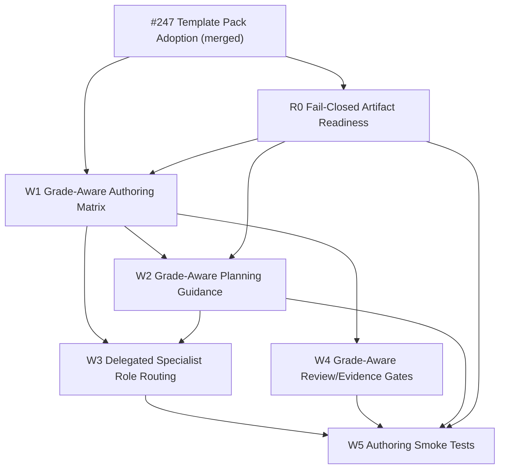

# 20260630t082805z-disc Epic 224 Amendment And Follow-up Issue Draft

## 位置づけ

この artifact は、Issue #247 / PR #248 後の Epic #224 をどのように更新し、どの follow-up Issue を追加して進めるかのドラフト案である。

入力として、次を統合した。

- GPT-5.5 Pro の追加分析レポート: `/Users/iwasawayuuta/.codex/attachments/7d1d7ff9-799a-40ae-a732-da5eb7b06d0f/pasted-text.txt`
- 先行 discussion: `20260630t055323z-disc-issue-247-manual-test-followup-analysis.md`
- focused readiness root cause analysis: `20260630t080402z-disc-manual-test-readiness-failure-root-cause-analysis.md`
- 手動テスト報告: `manual-tests/iss-00247-profile-template-compose-20260630/summary.md`
- Epic #224 の `requirement.md` / `design.md` / `plan.md`
- Issue #247 の `requirement.md` / `design.md` / `plan.md`
- provider-side skills/docs の現物確認
- Deep Consultant `Kierkegaard`
- ChatGPT 5.5 Pro consultation `epic224 grade aware authoring draft`

この文書は proposal であり、canonical authority ではない。採用する場合は Epic #224 の `requirement.md` / `design.md` / `plan.md` を更新し、その後に follow-up Issue を作成する。

補正: `W1. Define Grade-Aware Issue Authoring Workflow Matrix` は follow-up Issue として作成せず、Epic #224 の上流設計判断として先に定義する。補正版は `20260630t084325z-disc-grade-aware-authoring-rules-definition.md` を参照する。

## 結論

新規 Initiative は作らず、既存 `epic-00224 Dynamic Workflow Resource Allocation` を amendment する。

GPT-5.5 Pro の追加レポートが提案した 5 Issue は、grade-aware authoring workflow を復旧する tranche として有効である。ただし、それだけでは手動テスト F-001〜F-004 の execution readiness false positive を閉じられない。したがって、5 Issue の前に R0 として fail-closed readiness correction Issue を置く。

推奨する追加 Issue 構成は次の 6 本である。

```text
R0. Enforce Fail-Closed Issue Artifact Readiness Preflight
W1. Define Grade-Aware Issue Authoring Workflow Matrix
W2. Compile Grade-Aware Issue Planning Guidance
W3. Restore Delegated Specialist Role Routing For Issue Design And Plan
W4. Add Grade-Aware Spec Review And Evidence Gates
W5. Add Grade-Aware Issue Authoring Smoke Tests
```

実行順序は R0 -> W1 -> W2 -> W3 -> W4 -> W5 を基本とする。W3 と W4 は W1 の後に一部並列化できるが、W5 はすべての統合検証なので最後に置く。

## Source-Grounded Clarification Summary

- sources read:
  - Epic #224 `requirement.md`, `design.md`, `plan.md`
  - Issue #247 `requirement.md`, `design.md`, `plan.md`
  - provider-side `spec-dock-issue-planning` skill
  - provider-side `workflow_spec_authoring.md`, `phase_design.md`, `phase_plan_issue.md`, `authoring/issue-plan.md`
  - manual test summary and focused root-cause discussion
  - GPT-5.5 Pro pasted report and ChatGPT consultation output
  - Deep Consultant `Kierkegaard` output
- provisional understanding:
  - #247 の template pack adoption は有効。
  - ただし execution readiness が fail-closed でないため、まず readiness correction が必要。
  - その後に、grade-aware authoring workflow、delegated specialist routing、spec-review focus、report evidence、smoke tests を Epic #224 に接続する。
- gap classification:
  - source-grounded answer available。
  - user-intent blocker はない。
  - durable tradeoff はあるため、この `disc` を作成し、採用時は Epic canonical docs へ反映する。
- unresolved questions:
  - none。
- recommended pressure-test question:
  - none。現時点では「R0 を先行する」前提で進められる。
- suggested artifact:
  - `disc`
- mode:
  - draft-only / analysis-only
- handoff target:
  - Epic #224 `requirement.md` / `design.md` / `plan.md` amendment
  - follow-up Issue creation
- adoption evidence needed:
  - Epic report または後続 Issue report の Evidence Adoption Ledger に、この discussion、ChatGPT consultation、Deep Consultant consultation、manual test FAIL を採用根拠として記録する。

## 現状理解

### 1. Epic #224 の旧前提

Epic #224 はもともと、`lite / standard / strict / critical` の Assurance Profile、fixed Skill kernel、compiled Runbook、Step Assurance、Context policy、reviewer independence を定義している。現行 requirement の `E-RQ-006` は `Adaptive artifact composition` として、design / plan / report の必要 sections を policy fragment から合成する、と書いている。

しかし Issue #247 により、Issue design / plan の source は provider-side Markdown template pack へ移った。実体は `templates/issue-profiles/{lite,standard,strict,critical}/{design,plan}.md` であり、runtime selection authority は `.assurance.json` の `authorized_profile` である。

したがって、Epic #224 の `E-RQ-006` と `I03 — Compose Profile-Aware Planning Artifacts` は、旧 dynamic fragment composition から、grade template pack selection / materialization / readiness validation へ読み替える必要がある。

### 2. Issue #247 の成果と残課題

Issue #247 は、template pack を provider assets として採用し、`assurance compose` が `authorized_profile` に応じた Markdown template を materialize できるようにした。これは有効な前進である。

一方、手動テストは次を示した。

| ID | 問題 | 期待 | 実際 |
|---|---|---|---|
| F-001 | plan に `SAFE-\`CLOS-...\`` が残る | blocked | ready |
| F-002 | `## Validation Gate` だけの plan | blocked | ready |
| F-003 | requirement に `REQ-XXX` / `CON-...` が残る | capture / blocked | ready |
| F-004 | design title に `template` がある | substantive design として扱う | design-not-substantive |

これは template pack の配置問題ではなく、`workflow status` / `guidance issue-execution` の readiness classifier が古い sentinel と粗い marker 判定に依存している問題である。

### 3. GPT-5.5 Pro 追加レポートの主要提案

追加レポートは、Issue grade 別 template はできたが、authoring workflow が grade-aware になっていないと分析している。特に次が不足している。

- grade ごとに `system-architect` / `implementation-planner` 相当の delegated specialist をいつ使うか。
- grade ごとに spec-reviewer focus をどう変えるか。
- `authorized_profile` と issue-local manual escalation をどう分けるか。
- report evidence を grade ごとにどう残すか。
- runtime guidance と issue-planning skill をどう接続するか。

この分析は妥当である。ただし、追加レポートの 5 Issue は broader workflow tranche であり、F-001〜F-004 の readiness false positive を直接閉じない。そのため R0 を先行させる。

### 4. ローカル現物との補正点

添付レポートは `spec-dock-system-architect/SKILL.md` や `spec-dock-implementation-planner/SKILL.md` のような skill 更新を候補にしている。しかし現行 provider assets にその名称の shipped skill file は存在しない。現行 `spec-dock-issue-planning` skill は、`system-architect` と `implementation-planner` を delegated agent role として扱い、その draft は scope-local evidence であり canonical docs の代替ではない、と定義している。

したがって、W3 は「存在する skill file の更新」ではなく、まず「delegated specialist role routing の定義・guidance・docs・evidence contract」を扱う Issue として設計する。将来 shipped role skill を追加するかどうかは W3 内で現物確認したうえで判断する。

## Epic Amendment Themes

### Theme A: `E-RQ-006` の再定義

旧:

```text
Adaptive artifact composition
design / plan / report の必要 sections を policy fragment から合成する。
```

新:

```text
Grade Template Pack Selection And Artifact Readiness Contract
authorized_profile に基づいて provider-side grade template pack を materialize し、
workflow status / guidance issue-execution が canonical artifacts の readiness を fail-closed に判定する。
```

### Theme B: `assurance compose` と readiness の分離

`assurance compose` は selected profile template を materialize する helper / diagnostic である。compose success は execution readiness ではない。

execution readiness は `workflow status` と `guidance issue-execution` が最終 preflight として判定する。未解決 placeholder、template-only content、heading-only plan、missing reviewer evidence、stale adoption evidence が残る場合は `ready` にならない。

### Theme C: `authorized_profile` と manual escalation の分離

`authorized_profile` は runtime selection authority である。template selection、guidance selection、obligation source はこれを使う。

manual issue-local grade / manual escalation は、planning / delegated role / review / report evidence / manual gate を強める判断であり、`authorized_profile` を silently override してはならない。

### Theme D: grade-aware authoring matrix の導入

`lite / standard / strict / critical` ごとに、requirement / design / plan / review / report evidence の期待値を定義する。

- lite: specialist draft は原則不要。lite 前提を破る場合は escalation。
- standard: behavior / runtime / TDD / design complexity がある場合は specialist draft 推奨。
- strict: design / plan の delegated specialist evidence を原則必須。
- critical: strict に加えて safety / security / recovery / manual gate / no-go を扱う。

### Theme E: fresh spec-reviewer gate の維持

grade が変わっても fresh `spec-reviewer` pass を弱めない。変えるのは review の有無ではなく、review focus、追加 reviewer / manual gate、evidence density である。

### Theme F: automatic Lite default の禁止継続

この amendment は automatic Lite default を有効化しない。Lite は引き続き shadow / explicit opt-in / evidence-gated の対象であり、別 ADR / policy version bump / telemetry gate なしに default 化しない。

## Epic Amendment Map

### `requirement.md`

更新対象:

- `変更履歴（Supersession / Amendment）`
- `背景・現状`
- `前提 Epic / 引き継ぐ決定`
- `ユースケース`
- `E-RQ-003`
- `E-RQ-005`
- `E-RQ-006`
- `E-RQ-007`
- `E-RQ-008`
- `E-RQ-015〜021`
- `E-AC-006`
- `E-AC-008`
- 必要なら新規 E-AC: artifact readiness / grade-aware authoring matrix / smoke tests

`E-RQ-006` のドラフト:

```md
- E-RQ-006: Grade Template Pack Selection And Artifact Readiness Contract
  - Issue requirement は provider-side common Issue requirement template を使う。
  - Issue design / plan は `.assurance.json` の `authorized_profile` に基づき、
    `templates/issue-profiles/{lite,standard,strict,critical}/{design,plan}.md` から materialize する。
  - `authorized_profile` は runtime template / guidance selection の唯一の authority である。
  - manual issue-local grade escalation は planning、delegated role、review、report evidence、manual gate を強める判断であり、`authorized_profile` を silently override しない。
  - `assurance compose` は deterministic materialization / diagnostic helper であり、compose success は execution readiness ではない。
  - `workflow status` と `guidance issue-execution` は canonical Issue artifacts の execution-readiness を判定する fail-closed preflight である。
  - unresolved placeholder、template-only content、heading-only plan、実行可能作業単位のない plan、stale reviewer evidence、missing adoption evidence は `ready` または `may_execute_approved_plan=true` を返してはならない。
  - requirement / design / plan readiness は共通の placeholder contract を参照する。
  - dynamic policy-fragment composition は、Issue design / plan authoring の primary path ではない。
```

追加する acceptance のドラフト:

```md
- E-AC-006: Grade template materialization and readiness
  - 前提: Active adaptive Issue に `.assurance.json` と `authorized_profile` がある。
  - 操作: `assurance compose`、`workflow status`、`guidance issue-planning`、`guidance issue-execution` を実行する。
  - 期待:
    - selected grade template が deterministic に materialize される。
    - compose success だけでは ready にならない。
    - unresolved placeholder / non-executable plan / stale evidence は blocked になる。
    - filled positive artifacts は ready になる。
    - runtime selection は `authorized_profile` を使い、manual escalation は review/evidence gate を強める。
```

### `design.md`

更新対象:

- `全体像`
- `Component / Module View`
- PlantUML component diagram
- `Artifact Composer` component
- `Guidance Compiler`
- `Workflow State Resolver`
- `Step Assurance Compiler`
- `Context Policy Resolver`
- failure design
- test strategy

追加 / 置換する component:

| Component | 責務 | Authority |
|---|---|---|
| Profile Template Resolver | `.assurance.json` の `authorized_profile` から provider-side template pack を解決する | provider assets + `.assurance.json` |
| Template Materializer | selected template を canonical design / plan に materialize する。readiness は主張しない | deterministic helper |
| Artifact Readiness Validator | requirement / design / plan を missing / scaffold / placeholder-bearing / non-executable / stale / ready に分類する | runtime preflight |
| Grade-Aware Authoring Router | grade / manual escalation / phase に応じて delegated role、review focus、report evidence を導出する | guidance policy |
| Spec Authoring Evidence Gate | delegated draft adoption、fresh spec-reviewer pass、promotion record を検査する | canonical docs + report evidence |

design contract 追加:

- requirement readiness:
  - `REQ-XXX`, `CON-...`, old placeholders, ID-like sentinel を block。
- design readiness:
  - explicit scaffold marker は block。
  - ordinary word `template` / `placeholder` だけでは block しない。
- plan readiness:
  - executable work marker または explicit approved-no-op / decision-only closure を要求。
  - `Validation Gate`, `M99`, static analysis / lint / tests / report / commit headings は supporting marker であり、単独では executable ではない。
- delegated authoring:
  - delegated draft は scope-local discussions evidence。
  - main orchestrator が canonical artifact へ採否を統合し、fresh spec-reviewer が canonical artifact を review する。

### `plan.md`

更新対象:

- `計画サマリー`
- `この計画で閉じる E-RQ / E-AC`
- `課題分割方針`
- `課題一覧`
- `I03`
- `I04`
- `I07`
- dependency / tranche
- final exit contract

`I03` の置換ドラフト:

```md
### I03 — Select Grade-Specific Authoring Templates And Enforce Readiness

- replaces:
  - historical `Compose Profile-Aware Planning Artifacts`
- 目的:
  - `authorized_profile` に基づく grade-specific Issue design / plan templates を deterministic に materialize し、canonical artifacts が fail-closed readiness contract を満たすまで execution handoff を許可しない。
- 成果物:
  - profile template resolver
  - template materializer
  - artifact readiness validator
  - shared placeholder detector
  - executable plan predicate
  - workflow status / guidance issue-execution fail-closed preflight
  - F-001〜F-004 regression tests
  - positive ready path regression
  - manual validation evidence
- closes:
  - revised E-RQ-006
  - revised E-AC-006
- 依存:
  - I01
  - I02
  - Issue #247 / PR #248 template pack work
- 非対象:
  - Step worker routing
  - GitHub review
  - automatic Lite default
```

追加 tranche:

```text
T8 Readiness and grade-aware authoring correction
  R0 -> W1 -> W2 -> W3 -> W4 -> W5
```

## Follow-up Issue Drafts

### R0 — Enforce Fail-Closed Issue Artifact Readiness Preflight

- suggested grade:
  - strict
- depends on:
  - Issue #247 / PR #248
  - I01 / I02 runtime state and guidance base
- blocks:
  - W2
  - W5
  - Epic closure that claims grade templates are execution-safe

#### 目的

手動テスト F-001〜F-004 を runtime contract と regression tests で閉じ、未完成 artifact が `ready` / `may_execute_approved_plan=true` にならないようにする。

#### Scope

In scope:

- shared placeholder detector / registry
- composite placeholder detection
- requirement placeholder detection for `REQ-XXX`, `CON-...`
- plan executable predicate strictness
- design frontmatter scaffold marker narrowing
- `workflow status` / `guidance issue-execution` fail-closed behavior
- CLI / domain regression tests
- positive ready path preservation
- manual test rerun or follow-up evidence

Out of scope:

- grade-aware authoring workflow full implementation
- removing `assurance compose`
- automatic Lite default
- new Initiative / new Epic

#### Acceptance Criteria

- `SAFE-\`CLOS-...\`` / `SAFE-\`B-...\`` / `CTR-\`CLOS-...\`` / `COMP-\`CLOS-...\`` / `MIG-\`CLOS-...\`` / `REC-\`CLOS-...\`` を含む plan は `ready` にならない。
- `REQ-XXX` / `CON-...` を含む requirement は `substantive` / execution-ready にならない。
- `Validation Gate` / `M99` / static analysis / lint / tests / report / commit gate だけの plan は executable にならない。
- plan は substantive implementation step、behavior backlog、TDD cycle、step closure contract、approved-no-op、decision-only closure のいずれかを持つ必要がある。
- design title / prose に ordinary word `template` / `placeholder` があるだけでは scaffold 扱いしない。
- `artifact_state: awaiting-assurance-compose` や draft frontmatter は引き続き block する。
- filled standard positive path は `ready / assurance-valid` を維持する。

#### Tests

- `tests/unit/domain/test_workflow_state.py`
  - `REQ-XXX`, `CON-...`, positive real IDs
- `tests/cli_runtime/test_workflow.py`
  - composite plan placeholders
  - validation-gate-only / M99-only plan
  - valid title containing `template`
  - positive filled standard ready path
- manual test rerun:
  - `manual-tests/iss-00247-profile-template-compose-20260630` or successor

### W1 — Define Grade-Aware Issue Authoring Workflow Matrix

- suggested grade:
  - strict
- depends on:
  - R0 findings adopted into Epic terminology
- blocks:
  - W2
  - W3
  - W4

#### 目的

Epic #224 canonical docs に、`lite / standard / strict / critical` ごとの requirement / design / plan / review / report evidence の authoring workflow matrix を定義する。

#### Scope

In scope:

- Epic `requirement.md` / `design.md` / `plan.md` amendment
- grade-by-phase role matrix
- `authorized_profile` と manual issue-local escalation の分離
- delegated specialist role usage rules
- grade-specific spec-review focus
- report evidence requirements

Out of scope:

- runtime guidance implementation
- shipped role skill file creation
- automatic Lite default

#### Acceptance Criteria

- Epic #224 docs に grade-by-phase matrix がある。
- canonical docs は main orchestrator-owned のまま。
- `system-architect` / `implementation-planner` は、現時点では delegated role / evidence producer として定義する。
- lite は specialist draft を原則要求しない。
- standard は behavior / runtime / TDD / design complexity がある場合に specialist draft を推奨する。
- strict は design / plan specialist evidence を原則必須にする。
- critical は strict に manual gate / safety / security / recovery / no-go を追加する。
- fresh spec-reviewer pass は phase promotion 条件として維持する。
- `authorized_profile` は runtime authority、manual escalation は planning/review/evidence gate strengthening として分離する。

### W2 — Compile Grade-Aware Issue Planning Guidance

- suggested grade:
  - strict
- depends on:
  - R0
  - W1
  - I02 guidance base
- blocks:
  - W3
  - W5

#### 目的

`guidance issue-planning` が、artifact readiness、`authorized_profile`、manual escalation、phase state に応じて、次アクション、必要 delegated role、review gate、report evidence destination を返すようにする。

#### Scope

In scope:

- `guidance issue-planning` output
- missing/draft/reviewer-passed requirement/design/plan state
- grade-specific delegated role routing
- reviewer/evidence gate stop conditions
- report evidence destination guidance
- stdout guidance as agent-facing handoff

Out of scope:

- issue execution guidance 全面再設計
- skill への full profile procedure 直書き
- generated projection authority 化

#### Acceptance Criteria

- guidance は readiness と `authorized_profile` を読む。
- guidance は `template materialized`、`reviewer approved`、`workflow ready`、`may_execute_approved_plan=true` を混同しない。
- R0 readiness failure がある場合、planning / execution handoff を block する。
- lite guidance は specialist draft を原則要求しない。
- standard guidance は behavior/runtime/TDD complexity に応じて specialist draft を推奨する。
- strict guidance は required specialist evidence 欠落を incomplete/block とする。
- critical guidance は manual gate / safety / recovery / no-go を含む。
- delegated draft は evidence であり、main orchestrator adoption と report ledger が必要と示す。

### W3 — Restore Delegated Specialist Role Routing For Issue Design And Plan

- suggested grade:
  - strict
- depends on:
  - W1
  - W2
- blocks:
  - W5

#### 目的

`system-architect` / `implementation-planner` 相当の delegated specialist role を、grade-aware design / plan authoring に再接続する。ただし、現行 provider assets に同名 shipped skill file がないため、まず role routing / evidence contract として定義する。

#### Scope

In scope:

- grade-aware delegated role routing
- issue-planning skill の durable reminder 更新
- `workflow_spec_authoring.md` / `phase_design.md` / `phase_plan_issue.md` の整合
- delegated draft evidence lifecycle
- Evidence Adoption Ledger requirements
- stale/rejected/blocked/superseded draft handling

Out of scope:

- delegated role に canonical docs direct write を許可すること
- depth=3 delegation
- shipped role skill file 追加を前提にすること
- artifacts/discussions rename

#### Acceptance Criteria

- lite: specialist draft は不要。必要になったら escalation。
- standard: behavior/runtime/TDD/design complexity がある場合は specialist draft 推奨。skip する場合は report rationale。
- strict: design / plan delegated specialist evidence が必須。ただし unavailable/blocking 時は manual fallback と report evidence を要求。
- critical: strict に加えて safety/security/recovery/manual gate/no-go evidence を要求。
- delegated draft は scope-local `discussions/` evidence。
- canonical docs は main orchestrator が統合する。
- stale/rejected/blocked/superseded draft は promotion evidence に使えない。

### W4 — Add Grade-Aware Spec Review And Evidence Gates

- suggested grade:
  - strict
- depends on:
  - W1
- can run partly in parallel with:
  - W3
- blocks:
  - W5

#### 目的

fresh `spec-reviewer` pass を維持しながら、review focus と report evidence requirements を grade ごとに変える。

#### Scope

In scope:

- grade-specific spec-review focus
- report.md Spec Authoring Gate evidence
- delegated draft adoption evidence
- reviewer stale / failed / unavailable / denied / waived / provisional handling
- critical manual gate relationship

Out of scope:

- spec-reviewer role の全面再実装
- code-reviewer / qa-reviewer redesign
- GitHub PR observation policy

#### Acceptance Criteria

- lite review focus:
  - runtime behavior 変更なし
  - public contract 変更なし
  - migration なし
  - security/privacy 影響なし
  - lite 前提を破っていない
- standard review focus:
  - requirement-design-plan traceability
  - executable TDD plan
  - behavior backlog / validation ladder / report destination
- strict review focus:
  - contract / compatibility / migration / recovery / review gates
  - template / docs / skill consistency
- critical review focus:
  - safety contract
  - protected assets
  - no-go
  - dry-run
  - manual gate
  - recovery
  - security/privacy/GitHub mutation
- reviewer missing/stale/failed/unavailable/denied/waived/provisional は pass ではない。
- reviewer は delegated draft ではなく、main orchestrator が統合した canonical artifact を review する。

### W5 — Add Grade-Aware Issue Authoring Smoke Tests

- suggested grade:
  - strict
- depends on:
  - R0
  - W1
  - W2
  - W3
  - W4
- blocks:
  - Epic closure / rollout evidence

#### 目的

lite / standard / strict / critical の authoring flow が、templates、guidance、delegated role routing、review evidence、report destination、provider/dogfooding parity の観点で破綻していないことを検証する。

#### Scope

In scope:

- grade-specific template existence smoke
- issue creation / materialization smoke
- `guidance issue-planning` smoke
- delegated role routing text smoke
- spec-review evidence slot smoke
- report evidence slot smoke
- F-001〜F-004 negative readiness smoke
- positive filled ready path smoke
- provider / dogfooding parity

Out of scope:

- real external subagent execution
- real LLM reasoning effort measurement
- real GitHub mutation
- artifacts/discussions migration

#### Acceptance Criteria

- lite smoke:
  - lite templates exist
  - specialist draft not required by default
  - escalation conditions visible
- standard smoke:
  - standard templates materialize
  - TDD-oriented plan structure exists
  - specialist route is recommended when complexity exists
- strict smoke:
  - strict templates materialize
  - specialist evidence route is required
  - contract / compatibility / review gate focus exists
- critical smoke:
  - critical templates materialize
  - manual gate / safety / protected assets / no-go / recovery route exists
- R0 negative fixtures remain blocked。
- positive filled standard path remains ready。
- `awaiting-assurance-compose` is not treated as primary execution readiness。
- provider assets and dogfooding mirror are inspected or tested for parity。

## Dependency Map



## Rejected / Deferred

- 新規 Initiative:
  - rejected。Epic #224 の責務範囲に含まれる。
- 添付 GPT レポートの 5 Issue だけで進める:
  - rejected。readiness false positive が残るため、R0 が必要。
- `assurance compose` を削除する:
  - deferred。現時点では materialization / diagnostic helper として残す。
- `system-architect` / `implementation-planner` の shipped skill file 更新を前提にする:
  - rejected as assumption。現物には同名 skill file がないため、まず delegated role routing として扱う。
- Lite automatic default:
  - deferred。既存 Epic 方針どおり、有効化しない。
- discussions -> artifacts rename:
  - out of scope。

## Failure Modes And Tests

| Failure mode | 必要なテスト / 証跡 |
|---|---|
| composite placeholder missed | CLI: `SAFE-\`CLOS-...\`` / `SAFE-\`B-...\`` blocks readiness |
| quality gate treated as executable work | CLI: Validation Gate-only / M99-only plan blocks readiness |
| requirement placeholders missed | Domain + CLI: `REQ-XXX` / `CON-...` blocks readiness |
| generic `template` word blocks valid design | CLI positive: substantive design title with `template` remains valid |
| compose success mistaken for readiness | Integration: compose success + placeholders -> blocked |
| specialist draft treated as canonical | Guidance/docs tests: draft evidence requires adoption ledger + fresh review |
| manual escalation overrides `authorized_profile` | Guidance tests: template selection remains `authorized_profile` |
| Lite default enabled implicitly | Policy/guidance tests: Lite candidate does not reduce obligations |
| skill kernel becomes fat | Text/golden check: issue-planning skill stays kernel and calls guidance |
| provider/mirror drift | scaffold / dogfooding parity smoke |
| reviewer waiver treated as pass | review-gate tests: only fresh passed review promotes |

## Suggested Next Steps

1. この draft を採用するか確認する。
2. Epic #224 の `requirement.md` / `design.md` / `plan.md` を amendment する。
3. R0 Issue を作成する。
4. R0 の requirement/design/plan を作り、実装・テスト・manual rerun で F-001〜F-004 を閉じる。
5. W1〜W5 を順に作成・実施する。

## 最終提案

Epic #224 の次の作業は、次の一文に集約できる。

> Issue grade 別 template pack を、fail-closed artifact readiness、grade-aware issue planning guidance、delegated specialist role routing、fresh spec-reviewer gate、report evidence、smoke tests へ再接続する。

このために、まず R0 で execution readiness の安全境界を閉じる。その後、W1〜W5 で grade-aware authoring workflow を復旧する。
