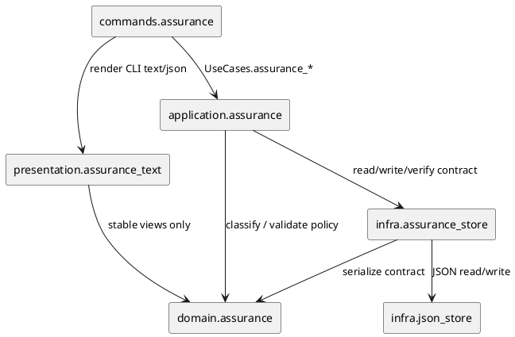
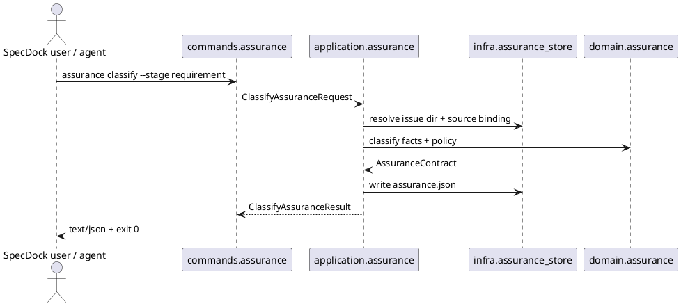

# iss-00227 Introduce Assurance Contract And Classification Runtime — 設計（どう実現するか）

## 親図（Diagram）参照

- Epic 図:
  - `spec-dock/active/epic/design.md` の `Adaptive Assurance and Compiled Workflow Components`。
  - 本 Issue はそのうち `Assurance Engine`、`Assurance Store`、Issue-local `assurance.json`、最小 `assurance` command surface だけを実装対象にする。
- 再利用する決定:
  - Fixed Skill kernel は profile 別に差し替えない。
  - `assurance.json` は tracked canonical artifact、Runbook などの projection は後続 Issue で扱う。
  - `lite_candidate` は shadow measurement であり、obligation reduction authority は `lite_authorized` だけが持つ。
  - 初期 rollout では automatic Lite default を有効化しない。

## 目的・制約

- 目的:
  - Issue-local `assurance.json` の v1 contract と deterministic classification runtime を追加する。
  - 後続 Issue が `authorized_profile`、`complexity_tier`、`lite_candidate`、`lite_authorized`、strict-legacy detection を参照できる基盤を作る。
- 必須:
  - `lite / standard / strict / critical` と `routine / normal / complex / deep` を別の domain concept として扱う。
  - Standard default、hard trigger escalation、unknown fail-closed、all-positive/no-opt-in safety を domain policy に閉じる。
  - `assurance show / classify / verify` を既存 command registry / use case / presentation pattern に沿って追加する。
- 禁止:
  - Runbook compiler、artifact composition、context packet、GitHub review trigger、PR blocker policy を実装しない。
  - `.agents/skills/**` を切り替えない。
  - `generated_at` などの volatile timestamp を deterministic persisted JSON に含めない。
- 非交渉制約:
  - Provider source `src/spec_dock/assets/spec_dock/...` が実装 authority。
  - Dogfooding mirror `spec-dock/...` は provider 更新後の validation target。
  - Domain layer は filesystem / GitHub / CLI に依存しない。

## 既存実装 / 規約の理解

- 参照した実装 / docs:
  - `src/spec_dock/assets/spec_dock/scripts/spec_dock_runtime/cli/parser.py`
  - `src/spec_dock/assets/spec_dock/scripts/spec_dock_runtime/cli/registry.py`
  - `src/spec_dock/assets/spec_dock/scripts/spec_dock_runtime/commands/contracts.py`
  - `src/spec_dock/assets/spec_dock/scripts/spec_dock_runtime/application/contracts.py`
  - `src/spec_dock/assets/spec_dock/scripts/spec_dock_runtime/infra/json_store.py`
  - `spec-dock/docs/phase_plan_issue.md`
  - `spec-dock/docs/authoring/issue-plan.md`
- 現状理解:
  - Runtime は `cli -> commands/presentation -> application -> domain/infra` の layered architecture。
  - Command は `CommandSpec` を `command_specs()` から registry に登録し、parser が leaf command key を bind する。
  - `UseCases` は callable を集約し、commands から application orchestration を呼び出す境界になっている。
  - JSON read/write helper は既に `infra/json_store.py` にあるが、Issue-local contract の schema / missing / invalid 判定は専用 store が必要。
- 採用するパターン:
  - 新規 command module + registry registration + parser subcommand。
  - Application use case result dataclass を presentation で text/json に変換。
  - Domain dataclass / enum / pure function で policy matrix をテストする。
- 採用しないもの:
  - command file 内に policy を埋め込む monolithic 実装。
  - `.meta.json` に profile だけを追記する実装。
  - Missing `assurance.json` を invalid schema と同一視する実装。

## 採用方針 / トレードオフ

- 論点: `assurance verify` で missing contract を失敗にするか。
  - 決定: missing contract は strict-legacy candidate として exit 0 / explicit status で返す。invalid JSON / invalid schema は non-zero。
  - 根拠: Existing Issue compatibility を守るため。後続 rollout Issue が policy を強めるまでは missing を破壊的 fail にしない。
- 論点: persisted `assurance.json` に `generated_at` を入れるか。
  - 決定: v1 persisted deterministic JSON には volatile timestamp を含めない。
  - 根拠: AC-002 の byte-identical requirement と衝突するため。必要なら将来 generated event / telemetry 側に置く。
- 論点: Lite predicate が全て true の場合の扱い。
  - 決定: `lite_candidate=true` は許容するが、explicit opt-in と evidence gate が未成立なら `lite_authorized=false`、`authorized_profile=standard`。
  - 根拠: Epic ADR の automatic Lite default 禁止と candidate/authorized separation。

## 依存関係分析

- module 依存:
  - `commands.assurance` -> `application.contracts.UseCases`
  - `application.assurance` -> `domain.assurance` + ports/store adapter
  - `infra.assurance_store` -> `infra.json_store` + domain contract serialization
  - `presentation.assurance_text` -> application result / domain view object
  - `domain.assurance` -> Python stdlib only
- file 依存:
  - Parser / registry は command key を追加するだけに留める。
  - `application/contracts.py` は Assurance request/result dataclass と `UseCases` field を追加する。
  - `cli/bootstrap.py` は assurance use cases と store adapter を wiring する。
- 上流 / 前提:
  - Fresh-reviewed `requirement.md`。
  - Epic accepted ADR baseline。
- 下流 / 依存先:
  - `iss-00228` は `authorized_profile` と strict-legacy view を Runbook compile input として読む。
  - `iss-00229` は source binding / approved / stale を拡張する。
- 実装起点:
  - Domain policy / serialization contract tests を最初に固定し、次に store / application / CLI へ広げる。

## モジュール依存図（Module Dependency Diagram）



## ローカル図の差分

- 変更する境界 / 責務 / 相互作用:
  - Epic design の `Assurance Engine` と `Assurance Store` を最小 runtime modules として実体化する。
  - `Runbook Compiler` 以降の component はこの Issue では実体化しない。

## インターフェース契約

- CLI:
  - `spec-dock assurance show [--issue <target>] [--format text|json]`
  - `spec-dock assurance classify --stage requirement [--issue <target>] [--format text|json] [--dry-run]`
  - `spec-dock assurance verify [--issue <target>] [--format text|json]`
- Target resolution:
  - `--issue` 未指定時は active issue を使う。
  - `--issue` 指定時は existing issue id / GitHub issue number normalization の既存 pattern を再利用する。
  - `--issue` に filesystem issue path が渡された場合、repo root からの相対 path または repo root 配下の絶対 path を受け付ける。対象 path は Issue directory またはその配下の canonical artifact path でなければならない。
  - Path target は repo root 外、non-issue directory、存在しない path、ambiguous symlink escape を拒否して exit 1 にする。
  - Target precedence は `--issue` explicit target が active issue より優先する。
- Exit behavior:
  - `show`: valid contract または strict-legacy missing は exit 0。invalid JSON/schema は exit 1。
  - `classify`: classification / write 成功は exit 0。target / source / write failure は exit 1。
  - `verify`: valid contract と strict-legacy missing は exit 0。invalid JSON/schema は exit 1。
- JSON output:
  - Stable field order を維持した deterministic JSON string を返す。
  - Persisted `assurance.json` と dry-run JSON は同一 input / policy version で byte-identical。

## シーケンス差分



## ドメインモデル差分

- 追加する値:
  - `AssuranceProfile`: `lite`, `standard`, `strict`, `critical`
  - `ComplexityTier`: `routine`, `normal`, `complex`, `deep`
  - `ClassificationStage`: `requirement`
  - `AssuranceStatus`: `provisional`
  - `AssuranceMode`: `adaptive`, `strict-legacy`
  - `RiskFact`: key、tri-state value、source、reason code
  - `SourceBinding`: artifact path、role、sha256
  - `AssuranceContract`: schema version、policy version、issue id、stage、status、mode、source binding、classification、risk facts、obligations
- 不変条件:
  - `authorized_profile` は hard trigger より低くならない。
  - Unknown Lite predicate は fail-closed。
  - All-positive Lite predicate だけでは `lite_authorized=true` にしない。
  - Missing contract は strict-legacy view であり invalid contract ではない。
  - Persisted JSON は deterministic。

## Deterministic classification policy v1

| fact key | Lite predicate | Hard trigger | Escalation | Unknown handling | Reason code |
|---|---|---|---|---|---|
| `docs_only_change` | required true for Lite candidate | no | none | Lite predicate unknown | `lite_predicate_docs_only_unknown` |
| `runtime_behavior_change` | required false for Lite candidate | no | none | Lite predicate unknown | `lite_predicate_runtime_behavior_unknown` |
| `public_contract_change` | required false for Lite candidate | yes | `strict` | Lite predicate unknown and hard-trigger unknown | `hard_trigger_public_contract_unknown` |
| `migration_or_persistence_change` | required false for Lite candidate | yes | `strict` | Lite predicate unknown and hard-trigger unknown | `hard_trigger_migration_unknown` |
| `security_or_privacy_sensitive` | required false for Lite candidate | yes | `critical` | Lite predicate unknown and hard-trigger unknown | `hard_trigger_security_unknown` |
| `rollback_difficulty_high` | required false for Lite candidate | yes | `strict` | Lite predicate unknown and hard-trigger unknown | `hard_trigger_rollback_unknown` |
| `explicit_lite_opt_in` | required true for Lite authorization | no | none | Lite authorization false | `lite_opt_in_missing_or_unknown` |
| `lite_evidence_gate_passed` | required true for Lite authorization | no | none | Lite authorization false | `lite_evidence_gate_missing_or_unknown` |

- `lite_candidate=true` requires all non-opt-in Lite predicates to be true: docs-only true, runtime behavior false, public contract false, migration/persistence false, security/privacy false, rollback difficulty false.
- `lite_authorized=true` additionally requires `explicit_lite_opt_in=true` and `lite_evidence_gate_passed=true`; this Issue does not auto-enable these fields from text inference.
- `authorized_profile` starts at `standard` for adaptive Issues.
- Hard trigger facts with value true escalate to the configured profile.
- Hard trigger facts with value unknown do not automatically escalate `authorized_profile`, but they must block Lite authorization and appear in `unknown_facts` / reason codes. This preserves Standard default while failing closed for Lite.
- If multiple hard triggers are true, the highest profile wins by `lite < standard < strict < critical`.
- `complexity_tier` v1 defaults to `normal`; it may be `complex` for public contract / migration / rollback hard triggers and `deep` for security/privacy hard triggers. It does not determine `authorized_profile`.

## RiskFact derivation v1

- v1 classification does not perform free-form natural-language risk extraction from requirement text.
- The application always emits one `RiskFact` for every supported fact key in the policy table, sorted by key.
- Default values are deterministic and conservative:
  - `docs_only_change`: `unknown`
  - `runtime_behavior_change`: `unknown`
  - `public_contract_change`: `unknown`
  - `migration_or_persistence_change`: `unknown`
  - `security_or_privacy_sensitive`: `unknown`
  - `rollback_difficulty_high`: `unknown`
  - `explicit_lite_opt_in`: `false`
  - `lite_evidence_gate_passed`: `false`
- Each default fact uses `source="requirement"` and a stable `reason_code` of `fact_default_<fact_key>`.
- The default `classification.reason_codes` includes every default fact reason code plus every policy consequence reason code emitted from those facts. It is stable sorted lexicographically.
- v1 may accept an internal test fixture or future application input to set fact values, but public CLI classification without such explicit input must use the deterministic defaults above.
- This means a newly classified adaptive Issue defaults to `authorized_profile="standard"`, `complexity_tier="normal"`, `lite_candidate=false`, and `lite_authorized=false`, with protected-domain unknowns present in `unknown_facts`.
- Later Issues may add structured fact extraction, approval, or source-binding invalidation, but they must preserve v1 safety semantics for unknown facts and Lite authorization.

## `assurance.json` v1 contract

```json
{
  "schema_version": 1,
  "policy_version": "assurance-policy-v1",
  "issue_id": "iss-00227",
  "stage": "requirement",
  "status": "provisional",
  "mode": "adaptive",
  "source_binding": {
    "artifacts": [
      {
        "path": "spec-dock/initiatives/init-local-00003-architecture-maintenance-and-hardening/epics/epic-00224-dynamic-workflow-resource-allocation/issues/iss-00227-introduce-assurance-contract-and-classification-runtime/requirement.md",
        "display_path": "spec-dock/active/issue/requirement.md",
        "role": "requirement",
        "sha256": "..."
      }
    ]
  },
  "classification": {
    "authorized_profile": "standard",
    "complexity_tier": "normal",
    "lite_candidate": false,
    "lite_authorized": false,
    "reason_codes": [
      "fact_default_docs_only_change",
      "fact_default_explicit_lite_opt_in",
      "fact_default_lite_evidence_gate_passed",
      "fact_default_migration_or_persistence_change",
      "fact_default_public_contract_change",
      "fact_default_rollback_difficulty_high",
      "fact_default_runtime_behavior_change",
      "fact_default_security_or_privacy_sensitive",
      "hard_trigger_migration_unknown",
      "hard_trigger_public_contract_unknown",
      "hard_trigger_rollback_unknown",
      "hard_trigger_security_unknown",
      "lite_evidence_gate_missing_or_unknown",
      "lite_opt_in_missing_or_unknown",
      "lite_predicate_docs_only_unknown",
      "lite_predicate_runtime_behavior_unknown",
      "standard_default"
    ],
    "hard_triggers": [],
    "unknown_facts": [
      "migration_or_persistence_change",
      "public_contract_change",
      "rollback_difficulty_high",
      "security_or_privacy_sensitive"
    ]
  },
  "risk_facts": [
    {
      "key": "docs_only_change",
      "value": "unknown",
      "source": "requirement",
      "reason_code": "fact_default_docs_only_change"
    }
  ],
  "obligations": {
    "profile_preset": "standard",
    "notes": []
  }
}
```

- `generated_at` / `classified_at` は v1 persisted contract に含めない。
- 上記 JSON の `risk_facts` は構造例であり、実際の v1 output は policy table の全 supported fact key を stable order で含める。
- `source_binding.artifacts[].path` は repo root からの resolved issue-local path を保存する。`active/issue` symlink path は `display_path` にだけ保存してよい。
- `source_binding.artifacts`、`reason_codes`、`hard_triggers`、`unknown_facts`、`risk_facts` は stable sort する。
- Future fields は schema version bump ではなく additive optional field として足せる場合だけ v1 に追加できる。

## Schema validation v1

| 対象 | 必須 / 許可 | invalid 条件 |
|---|---|---|
| root | required object | object 以外 |
| `schema_version` | required integer, value `1` | 欠落、整数以外、未対応 version |
| `policy_version` | required string, value `assurance-policy-v1` | 欠落、空、未対応 policy |
| `issue_id` | required string matching `iss-*` | 欠落、空、issue id 形式でない |
| `stage` | required enum, `requirement` | 欠落、未対応 stage |
| `status` | required enum, `provisional` | 欠落、未対応 status |
| `mode` | required enum, `adaptive` | 欠落、未対応 mode、persisted contract に `strict-legacy` を保存する |
| `source_binding.artifacts` | required non-empty list | 欠落、空、artifact object 不正 |
| `source_binding.artifacts[].path` | required repo-relative resolved path | 欠落、絶対 path、`spec-dock/active/issue/*` のみを永続 path にする |
| `source_binding.artifacts[].display_path` | optional string | 文字列以外 |
| `source_binding.artifacts[].role` | required enum, `requirement` in v1 | 欠落、未対応 role |
| `source_binding.artifacts[].sha256` | required lowercase hex sha256 | 欠落、64 hex でない |
| `classification.authorized_profile` | required enum | 欠落、未対応 profile |
| `classification.complexity_tier` | required enum | 欠落、未対応 tier |
| `classification.lite_candidate` | required boolean | 欠落、boolean 以外 |
| `classification.lite_authorized` | required boolean | 欠落、boolean 以外 |
| `classification.reason_codes` | required list of strings | 欠落、文字列以外、unstable duplicate |
| `classification.hard_triggers` | required list of strings | 欠落、文字列以外、unstable duplicate |
| `classification.unknown_facts` | required list of strings | 欠落、文字列以外、unstable duplicate |
| `risk_facts` | required list of objects | 欠落、object 以外 |
| `risk_facts[].key` | required supported fact key | 欠落、未対応 key |
| `risk_facts[].value` | required enum `true / false / unknown` | 欠落、未対応 value |
| `risk_facts[].source` | required string, v1 supports `requirement` | 欠落、文字列以外、未対応 source |
| `risk_facts[].reason_code` | required string | 欠落、空、文字列以外 |
| `obligations.profile_preset` | required enum, equals `authorized_profile` | 欠落、不一致 |
| unknown root fields | allowed as additive optional fields if deterministic serialization preserves them | known required semantics と矛盾する値 |
| unknown fields under `classification` | not allowed in v1 | `proposed_profile` など classification semantics を変えうる known/unknown field |
| unknown fields under `risk_facts[]` | not allowed in v1 | v1 required fields 以外 |
| unknown fields under `source_binding.artifacts[]` / `obligations` | allowed only if deterministic and semantics-neutral | known required semantics と矛盾する値 |

- Missing `assurance.json` は schema validation 対象ではなく strict-legacy view。
- Invalid JSON parse と schema invalid はどちらも exit 1 だが、machine-readable reason は区別する。

## ディレクトリ / ファイル変更計画

Provider source:

```text
src/spec_dock/assets/spec_dock/scripts/spec_dock_runtime/
|-- domain/assurance.py
|-- application/assurance.py
|-- infra/assurance_store.py
|-- commands/assurance.py
|-- presentation/assurance_text.py
|-- cli/parser.py
|-- cli/registry.py
|-- cli/bootstrap.py
`-- application/contracts.py
```

Dogfooding mirror:

```text
spec-dock/scripts/spec_dock_runtime/
```

Tests:

```text
tests/unit/domain/test_assurance.py
tests/unit/application/test_assurance.py
tests/unit/infra/test_assurance_store.py
tests/unit/presentation/test_assurance_text.py
tests/cli_runtime/test_assurance.py
```

## 検証設計

- Domain:
  - Standard default。
  - false / unknown Lite predicate。
  - all-positive Lite predicate without opt-in / evidence gate。
  - hard trigger escalation。
  - deterministic dict / JSON representation。
- Infra:
  - missing `assurance.json` -> strict-legacy view。
  - invalid JSON -> invalid result。
  - invalid schema -> invalid result。
  - valid fixture -> contract object。
- Application:
  - active issue target resolution。
  - explicit issue target resolution。
  - classify write と dry-run。
  - verify valid / missing / invalid mapping。
- CLI:
  - `assurance show` strict-legacy output。
  - `assurance classify --stage requirement --format json`。
  - `assurance verify` exit code。
- Static:
  - `make lint`
  - focused pytest lanes。

## リスク / レビュー観点

- Volatile timestamp を入れると deterministic output が壊れる。
- Missing contract と invalid JSON を混ぜると legacy compatibility と corruption detection が曖昧になる。
- Domain policy が command / infra に漏れると後続 Runbook が contract を安全に再利用しにくい。
- Lite predicate unknown を false と同一視すると unsafe authorization の温床になる。
- Parser / registry wiring は既存 command を壊しやすいので CLI runtime regression を必須にする。

## 委任ドラフト参照

- `discussions/20260623t124355z-draft-design-system-architect-design-draft.md` は delegated architecture evidence であり、採用判断と diff guard disposition は `report.md` の Evidence Adoption Ledger / Delegated Draft Evidence が持つ。
- Canonical design は main orchestrator-owned であり、この section は採用済み authority を self-claim しない。
