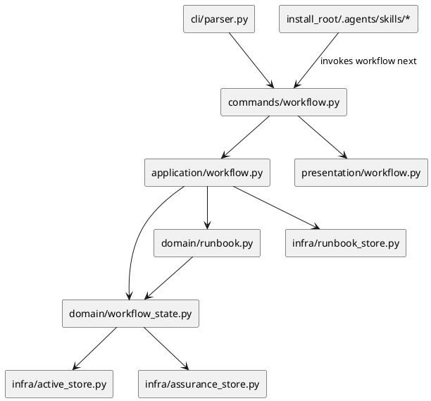
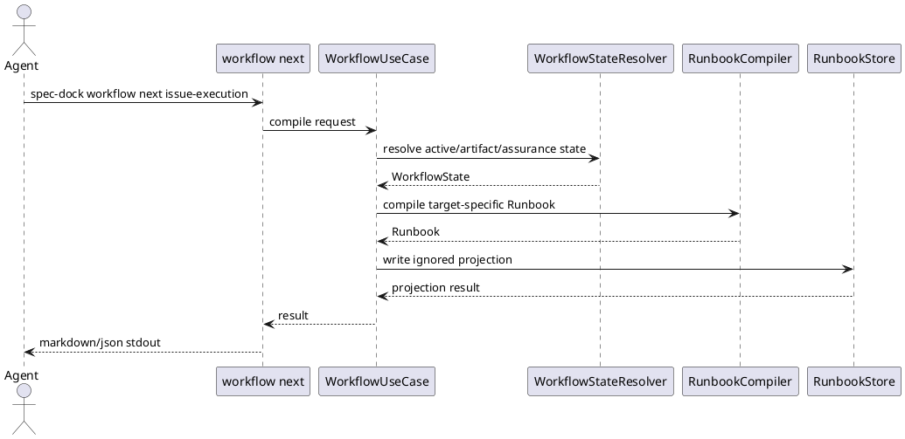

# iss-00228 Compile State Aware Workflow Runbooks And Fixed Skill Kernels — 設計（どう実現するか）

## 親図（Diagram）参照
- Epic 図:
  - `spec-dock/active/epic/design.md` の Dynamic Workflow Resource Allocation architecture。
- 再利用する決定:
  - ADR: `20260623t074441z-adr-fixed-skill-kernel-compiled-runbook-authority.md`
  - ADR: `20260623t074443z-adr-adaptive-assurance-lite-authorization-monotonic-escalation.md`
  - `iss-00227` の Assurance Contract / Store / CLI / validation 実装。

## 目的・制約
- 目的:
  - Runtime が active context と Assurance Contract から Workflow State を解決し、agent に current Runbook を返す。
  - Planning / Execution Skill は fixed kernel とし、state-specific 手順は generated Runbook へ移す。
- 必須 / 禁止:
  - 必須: `workflow status` / `workflow next`、Runbook JSON / Markdown、ignored generated projection、fixed planning / execution kernels。
  - 禁止: profile-aware artifact composition、step routing、PR review policy、Lite candidate による obligation reduction。
- 非交渉制約:
  - Generated Runbook は canonical authority ではない。
  - `authorized_profile` だけが obligation selection authority である。
  - Provider source と dogfooding mirror の parity を保つ。
- 前提:
  - `assurance.json` は issue-local tracked artifact として `iss-00227` で導入済み。

## 既存実装 / 規約の理解
- 参照した実装 / docs:
  - `src/spec_dock/assets/spec_dock/scripts/spec_dock_runtime/commands/assurance.py`
  - `src/spec_dock/assets/spec_dock/scripts/spec_dock_runtime/application/assurance.py`
  - `src/spec_dock/assets/spec_dock/scripts/spec_dock_runtime/domain/assurance.py`
  - `src/spec_dock/assets/spec_dock/scripts/spec_dock_runtime/infra/assurance_store.py`
  - `src/spec_dock/assets/spec_dock/scripts/spec_dock_runtime/cli/parser.py`
  - `src/spec_dock/assets/install_root/.agents/skills/spec-dock-issue-planning/SKILL.md`
  - `src/spec_dock/assets/install_root/.agents/skills/spec-dock-issue-execution/SKILL.md`
- 現状理解:
  - Runtime CLI は layered architecture で、command は application use case と presentation output を呼び出す。
  - `assurance` command は active issue / explicit issue id を解決し、issue directory の `assurance.json` を読み書きする。
  - dogfooding mirror は provider asset から `spec-dock update .` で同期する。
- 採用するパターン:
  - Assurance と同じく typed request / result / command spec を使う。
  - domain で state / runbook model、application で use case、infra で generated projection store、presentation で text / markdown / json rendering を分ける。
- 採用しないもの:
  - command handler 内の ad hoc string branching。
  - Skill file を runtime state に応じて rewrite する実装。
  - active symlink を Runbook projection の authority として扱う実装。
- 影響範囲:
  - Provider runtime CLI / domain / application / infra / presentation。
  - Provider install_root skill assets。
  - Dogfooding mirror runtime / skills。
  - Runtime tests / unit tests。

## 採用方針 / トレードオフ
- 論点:
  - Runbook をどこに置き、何を authority とするか。
- 選択肢:
  - Skill に全手順を残す: 実装は薄いが token waste と stale state 混入が残る。
  - Skill を state 別に生成する: 読む量は減るが tracked Skill diff と state mutation が結合する。
  - Runtime が Runbook を compile し、Skill は fixed kernel にする: runtime 実装は増えるが authority と ergonomics を分離できる。
- 決定:
  - Runtime compiled Runbook を採用する。stdout の `workflow next` を主出力とし、ignored projection は補助 evidence とする。

## 依存関係分析
- module 依存:
  - `commands.workflow` -> `application.workflow` -> `domain.workflow_state` / `domain.runbook` / `infra.runbook_store` / existing active/assurance stores。
  - `presentation.workflow` は domain/application result を受け取り text / markdown / json を生成する。
- file 依存:
  - `cli/parser.py` と command registry に `workflow` subcommand を追加する。
  - `commands/contracts.py` / `application/contracts.py` に request / result を追加する。
  - `bootstrap.py` に workflow use case wiring を追加する。
- 上流 / 前提:
  - `iss-00227` Assurance Contract runtime。
- 下流 / 依存先:
  - `iss-00229` は Runbook / Assurance source binding を planning artifact composition に利用する。
  - `iss-00233` は fixed kernel と generated state の rollout / telemetry を検証する。
- 実装起点:
  - Public CLI behavior を red test で固定し、domain state resolver と Runbook compiler を薄く通す。
- 順序への影響:
  - State / Runbook public contract -> projection store -> CLI integration -> fixed skill assets -> dogfooding mirror の順に閉じる。

## モジュール依存図（Module Dependency Diagram）


## ローカル図の差分（Local Diagram Delta）
- 変更する境界 / 責務 / 相互作用:
  - Runtime CLI に `workflow` command surface を追加する。
  - Skill assets は state-specific instruction authority ではなく runtime handoff kernel になる。

## インターフェース契約
- CLI:
  - `spec-dock workflow status --format text|json`
  - `spec-dock workflow next issue-planning --format markdown|json`
  - `spec-dock workflow next issue-execution --format markdown|json`
  - `--project <path>` は既存 CLI pattern に従い parser/bootstrap で解決される。
- JSON Runbook:
  - `schema_version`
  - `workflow_target`
  - `state`
  - `next_action`
  - `reason_code`
  - `authority`
    - `authorized_profile`
    - `lite_candidate`
    - `obligation_source`
  - `commands[]`
  - `notes[]`
  - `projection`
    - `written`
    - `paths[]`
    - `errors[]`
- Markdown Runbook:
  - title、state、authority note、next action、commands、stop conditions、projection note を含む。
  - 未選択 profile の完全手順を含めない。
- Generated projection path:
  - `spec-dock/.agent/runbooks/current-runbook.json`
  - `spec-dock/.agent/runbooks/current-runbook.md`
  - `spec-dock/active/current-runbook.json`
  - `spec-dock/active/current-runbook.md`
  - いずれも ignored generated output とし、canonical docs ではない。

## シーケンス差分


## ドメインモデル差分
- `WorkflowState`:
  - `kind`: `no-active` / `requirement-capture` / `classification-required` / `ready` / `authority-invalid`
  - `active_issue_id`
  - `reason_code`
  - `artifact_readiness`
  - `assurance_summary`
- `Runbook`:
  - `schema_version`
  - `workflow_target`
  - `state`
  - `next_action`
  - `authority`
  - `commands`
  - `notes`
  - `stop_conditions`
- 不変条件:
  - `lite_candidate` は `obligation_source` にならない。
  - `no-active` は issue start / target request 以外の next action を持たない。
  - `classification-required` は implementation start を許可しない。

## クラス / インターフェース詳細設計
- `WorkflowStateResolver`:
  - active issue、requirement scaffold 判定、assurance store から state を決める。
  - malformed assurance は fail-closed state として扱う。
- `RunbookCompiler`:
  - `workflow_target` と `WorkflowState` から deterministic Runbook を返す。
  - target ごとの minimality を守る。
- `RunbookStore`:
  - JSON / Markdown projection を atomic write する。
  - write failure は blocked result として扱い、temp cleanup / doctor 相当の次 action を返す。tracked authority は変更しない。

## ディレクトリ / ファイル変更計画
```text
.
|-- src/spec_dock/assets/spec_dock/scripts/spec_dock_runtime/
|   |-- cli/
|   |   |-- bootstrap.py                  # 変更: workflow use case wiring
|   |   |-- parser.py                     # 変更: workflow parser
|   |   `-- registry.py                   # 変更: workflow command registration
|   |-- commands/
|   |   |-- contracts.py                  # 変更: workflow command contract
|   |   `-- workflow.py                   # 追加: workflow status / next command
|   |-- application/
|   |   |-- contracts.py                  # 変更: workflow request/result
|   |   `-- workflow.py                   # 追加: state resolve / runbook compile use cases
|   |-- domain/
|   |   |-- workflow_state.py             # 追加: state model/resolver helpers
|   |   `-- runbook.py                    # 追加: runbook model/compiler
|   |-- infra/
|   |   `-- runbook_store.py              # 追加: atomic ignored projection store
|   `-- presentation/
|       `-- workflow.py                   # 追加: text/markdown/json rendering
|-- src/spec_dock/assets/install_root/.agents/skills/
|   |-- spec-dock-issue-planning/SKILL.md # 変更: fixed kernel
|   `-- spec-dock-issue-execution/SKILL.md # 変更: fixed kernel
|-- spec-dock/                             # 変更: dogfooding mirror sync
`-- tests/
    |-- cli_runtime/test_workflow.py       # 追加: CLI behavior
    |-- unit/domain/test_workflow_state.py # 追加: state/runbook invariants
    |-- unit/infra/test_runbook_store.py   # 追加: atomic projection
    `-- unit/infra/test_init_update.py     # 変更: installed fixed skill assets assertions
```

## 要件 → 設計マッピング
- AC-001 -> `WorkflowState(kind=no-active)` と `RunbookCompiler` の next action invariant。
- AC-002 -> requirement scaffold detector と `requirement-capture` state。
- AC-003 -> assurance absence / invalidity detector と `classification-required` / `authority-invalid` state。
- AC-004 -> `RunbookAuthority.obligation_source=authorized_profile` invariant。
- AC-005 -> `RunbookStore` ignored paths、skill asset fixed kernel、git clean tests。
- AC-006 -> target-specific compiler golden tests と unselected profile exclusion assertion。
- EC-001 -> malformed assurance fail-closed handling。
- EC-002 -> projection write failure blocked result。
- EC-003 -> parser validation / no projection update。

## テスト戦略
- 単体:
  - Workflow State Resolver の state matrix。
  - Runbook compiler の authority/minimality invariants。
  - Runbook Store の atomic write / projection path。
- CLI runtime:
  - no-active / requirement-capture / classification-required / ready の `workflow status` / `workflow next`。
  - JSON / Markdown output の structural assertions。
- scaffold / dogfooding:
  - provider skill assets が fixed kernel を含む。
  - dogfooding mirror へ `spec-dock update .` 後に runtime / skill parity が保たれる。
  - generated projection が tracked diff を出さない。
- migration / rollback:
  - legacy Issue は `classification-required` / strict workflow fallback へ fail-closed するため、runtime command を使わない既存 flow は維持される。

## 要件 / 例外 -> 検証マッピング
- AC-001 -> `tests/cli_runtime/test_workflow.py::test_workflow_next_no_active_returns_only_issue_start_guidance`
- AC-002 -> `tests/cli_runtime/test_workflow.py::test_workflow_status_detects_requirement_capture`
- AC-003 -> `tests/cli_runtime/test_workflow.py::test_workflow_next_requires_assurance_before_execution`
- AC-004 -> `tests/unit/domain/test_workflow_state.py::test_lite_candidate_does_not_reduce_obligations_without_authorized_profile`
- AC-005 -> `tests/cli_runtime/test_workflow.py::test_workflow_projection_is_ignored_and_skills_remain_clean`
- AC-006 -> `tests/unit/domain/test_workflow_state.py::test_runbook_omits_unselected_profile_full_procedure`
- EC-001 -> `tests/cli_runtime/test_workflow.py::test_malformed_assurance_fails_closed`
- EC-002 -> `tests/unit/infra/test_runbook_store.py::test_projection_write_failure_blocks_with_doctor_guidance`
- EC-003 -> `tests/cli_runtime/test_workflow.py::test_unknown_workflow_target_rejects_without_projection`

## リスク / 移行 / ロールバック
- リスク:
  - State detection が甘いと agent が wrong phase に進む。対策として missing / malformed authority は fail-closed とする。
  - Generated projection を authority と誤読するリスクがある。対策として output と docs に non-authority note を入れる。
  - Skill fixed kernel が短くなりすぎると execution policy を見落とす。対策として kernel は runtime handoff、freshness stop、canonical docs fallback を明示する。
- 移行:
  - Provider asset 実装後に dogfooding mirror を `spec-dock update .` で同期する。
  - 既存 active Issue は `assurance.json` がない場合 classification-required として strict fallback する。
- ロールバック:
  - CLI command / projection store を戻しても existing workflow docs / lifecycle command は残る。

## 未確定事項
- なし。実装中に path naming や output schema の追加が必要になった場合は report の decision ledger と plan amendment で扱う。
