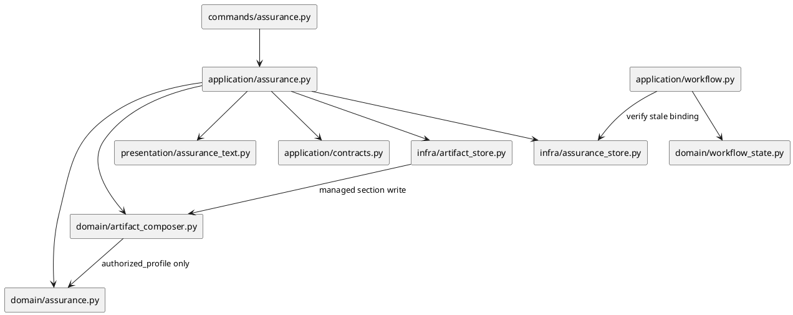

# iss-00229 Compose Profile Aware Planning Artifacts — 設計（どう実現するか）

## 親図（Diagram）参照
- Epic 図:
  - `epic-00224/design.md` の Adaptive Workflow architecture / Assurance Contract / Runbook compiler。
- 再利用する決定:
  - ADR `Adaptive Assurance Contract Lite Authorization And Monotonic Escalation`。
  - ADR `Fixed Skill Kernel And Compiled Runbook Authority`。
  - I01 `assurance.json` / `authorized_profile` / `source_binding` contract。
  - I02 `workflow next` / generated Runbook non-authority / fixed Skill kernel。

## 目的・制約
- 目的:
  - `authorized_profile` に応じた planning sections を deterministic に materialize し、planning handoff の抜け漏れと過剰な手順読み込みを減らす。
  - `assurance.json` の source binding が `requirement.md` / `design.md` / `plan.md` のいずれかで stale になった場合に、compose / planning / execution を fail-closed にする。
- 必須:
  - typed fragment manifest、profile preset、Markdown managed section composer。
  - `assurance compose` command。
  - source binding stale verification。
  - provider / dogfooding mirror parity。
- 禁止:
  - Step worker routing / context policy / GitHub review policy を混ぜない。
  - downgrade による section deletion をしない。
  - `lite_candidate` を section reduction authority にしない。
  - Automatic Lite default を有効化しない。ただし accepted ADR に従って `authorized_profile=lite` が明示的に成立している場合は Lite preset を通常の profile preset として扱う。

## 既存実装 / 規約の理解
- 参照した実装 / docs:
  - `domain/assurance.py`: `AssuranceContract`, `SourceBinding`, `AssuranceClassification`。
  - `infra/assurance_store.py`: active / explicit Issue target resolution、contract read/write。
  - `application/assurance.py`: `show/classify/verify` use cases。
  - `application/workflow.py`: `workflow next` が assurance store result から state を解決する。
  - `templates/issue/{design,plan,report}.md`: planning artifact scaffold。
- 採用するパターン:
  - Runtime layered architecture: command -> application -> domain -> infra/presentation。
  - Domain model は filesystem に依存しない。
  - Application contract は infra concrete type を公開しない。
  - Shipped asset は provider source を変更し、`update .` で dogfooding mirror へ同期する。
- 採用しないもの:
  - ad hoc string replace による artifact 全文上書き。
  - profile ごとの tracked Skill mutation。
  - hidden local override / environment variable authority。

## 採用方針 / トレードオフ
- 論点: Markdown section composition をどこまで自動化するか。
  - A: Artifact 全体を profile template で再生成する。
  - B: Stable marker 付き managed sections だけを additive / preserve で合成する。
  - 決定: B を採用する。
  - 理由: canonical docs の手動編集を守りつつ、必要 section の抜け漏れを減らせるため。
- 論点: stale source binding を `assurance verify` だけで扱うか、`workflow next` にも反映するか。
  - A: verify command だけで stale を出す。
  - B: `workflow next issue-execution` も stale を fail-closed state にする。
  - 決定: B を採用する。
  - 理由: fixed Skill kernel は `workflow next` を first-read とするため、execution handoff をそこで止める必要がある。

## 依存関係分析
- module 依存:
  - `commands.assurance` -> `application.assurance` -> `domain.artifact_composer` / `domain.assurance` + `infra.assurance_store` / `infra.artifact_store`。
  - `application.workflow` -> `infra.assurance_store.verify_contract` stale result -> `domain.workflow_state`。
- class / interface 依存:
  - `AssuranceContract.source_binding`。
  - new `ArtifactComposeRequest` / `ArtifactComposeResult`。
  - new `ManagedSection` / `ProfileArtifactPreset`。
- file 依存:
  - Provider runtime:
    - `application/contracts.py`
    - `application/assurance.py`
    - `commands/assurance.py`
    - `domain/artifact_composer.py`
    - `infra/artifact_store.py`
    - `infra/assurance_store.py`
    - `presentation/assurance_text.py`
  - Provider assets:
    - `src/spec_dock/assets/spec_dock/templates/assurance/profile-sections.json`
  - Tests:
    - `tests/unit/domain/test_artifact_composer.py`
    - `tests/unit/infra/test_assurance_store.py`
    - `tests/cli_runtime/test_assurance_compose.py`
    - existing `tests/cli_runtime/test_workflow.py`
- 上流 / 前提:
  - I01 Assurance runtime。
  - I02 Workflow Runbook。
- 下流 / 依存先:
  - I04 Step Assurance / routing は composed plan sections を入力にする。
  - I07 Rollout は legacy compatibility / telemetry で composer behavior を検証する。
- 実装起点:
  - Domain composer の pure tests から始め、CLI vertical slice、stale binding integration、mirror sync の順に進む。

## モジュール依存図（Module Dependency Diagram）
- タイトル:
  - Profile-aware planning artifact composition dependency
- 答える問い:
  - Assurance Contract から planning artifact sections と execution blocking へどの module が責務を持つか。
- 範囲:
  - Runtime application/domain/infra/presentation と provider template asset。
- 含めない詳細:
  - Step worker routing、GitHub review、context packet。
- 更新条件:
  - compose command、fragment manifest、source binding validation の責務境界が変わるとき。

### 図表（UML / 原則: モジュール依存 / パッケージ依存差分）


## インターフェース契約
- CLI:
  - `./spec-dock/scripts/spec-dock assurance compose --artifact {design,plan,report,all} [--issue <target>] [--format text|json] [--dry-run]`
- 成功時:
  - exit 0。
  - JSON は `operation=compose`、`ok=true`、`status=applied|unchanged|dry-run`、`authorized_profile`、`changed_paths`、`warnings`、`errors` を返す。
- 失敗時:
  - missing / invalid / stale assurance、marker conflict、target resolution failure は exit 1。
  - artifact は破壊的に変更しない。
- Source binding:
  - `assurance compose` と `assurance verify` は `source_binding` の `requirement.md` / `design.md` / `plan.md` artifact hash を現在ファイルと比較し、不一致なら `status=invalid` / `reason=stale_source_binding` を返す。
  - stale result は stale artifact kind、expected hash、actual hash を JSON details に含める。
  - `workflow next issue-execution` は stale result を execution-ready にしない。

## ドメインモデル差分（Domain Model Delta）
- Add:
  - `ArtifactKind = design | plan | report`
  - `ManagedSection`
  - `ProfileArtifactPreset`
  - `ComposeMode = apply | dry-run`
  - `ComposeArtifactResult`
- Extend:
  - `AssuranceStoreResult.reason` に `stale_source_binding` を追加し、stale artifact details を保持する。
  - `WorkflowState` details に stale source binding details を含める。
- Invariant:
  - `authorized_profile` is the only section selection authority。
  - `lite_candidate` is telemetry only。
  - Explicit `authorized_profile=lite` composes Lite sections; `lite_candidate=true` alone does not。
  - Existing substantive content is preserved。
  - Downgrade does not delete stronger sections。

## ディレクトリ / ファイル変更計画
```text
.
|-- src/spec_dock/assets/spec_dock/
|   |-- templates/
|   |   `-- assurance/
|   |       `-- profile-sections.json        # 追加: profile preset / fragment manifest
|   `-- scripts/spec_dock_runtime/
|       |-- application/
|       |   |-- assurance.py                 # 変更: compose use case
|       |   `-- contracts.py                 # 変更: compose request/result contracts
|       |-- commands/
|       |   `-- assurance.py                 # 変更: compose subcommand
|       |-- domain/
|       |   |-- artifact_composer.py          # 追加: managed section composition rules
|       |   |-- assurance.py                  # 変更: reason/status helper if needed
|       |   `-- workflow_state.py            # 変更: stale authority state if needed
|       |-- infra/
|       |   |-- artifact_store.py             # 追加: issue artifact read/write adapter
|       |   `-- assurance_store.py           # 変更: source binding hash verification
|       `-- presentation/
|           `-- assurance_text.py            # 変更: compose output rendering
|-- spec-dock/                               # 変更: dogfooding mirror via update
`-- tests/
    |-- unit/domain/test_artifact_composer.py
    |-- unit/infra/test_assurance_store.py
    `-- cli_runtime/test_assurance_compose.py
```

## 要件 → 設計マッピング
- AC-001 -> `assurance compose` + profile manifest + composer golden tests。
- AC-002 -> idempotent managed section writer + clean Git CLI test。
- AC-003 -> no-overwrite / preserve tests。
- AC-004 -> compose / verify source binding hash verification + workflow stale blocking。
- AC-005 -> monotonic additive composition / no deletion tests。
- AC-006 -> provider/mirror update and parity checks。
- EC-001 -> missing assurance compose failure。
- EC-002 -> invalid / stale assurance failure and workflow block。
- EC-003 -> marker conflict detection with artifact unchanged。

## テスト戦略
- 単体:
  - Domain composer pure tests for profile selection, markers, idempotence, no-overwrite, no deletion。
  - Assurance store source binding stale tests for requirement / design / plan。
- CLI runtime:
  - `assurance compose --artifact all` materializes sections。
  - compose twice leaves `git status --short` clean。
  - missing / invalid assurance fails closed。
  - stale source binding blocks `assurance compose` and `workflow next issue-execution`。
- Static:
  - `make lint`。
- Integration / mirror:
  - `uv run python -m spec_dock.cli update .`。
  - provider/mirror parity diff。
  - `./spec-dock/scripts/spec-dock validate`。

## リスク / 移行 / ロールバック
- リスク:
  - Markdown marker parsing が壊れると human-authored content を誤って触る。
  - stale binding を `compose` / `verify` に入れることで、過去に作成した contract が requirement / design / plan edit 後に invalid になる。
- 緩和:
  - Marker conflict は fail-closed。
  - Write は artifact 単位で temp / replace または read-before-write exact overwrite に限定する。
  - `dry-run` で changed paths / warnings を確認できる。
- ロールバック:
  - Compose command と template asset を戻せば existing canonical docs はそのまま残る。
  - Stale source binding が問題になった場合も、reclassify で復旧できる。

## 未確定事項
- なし。
