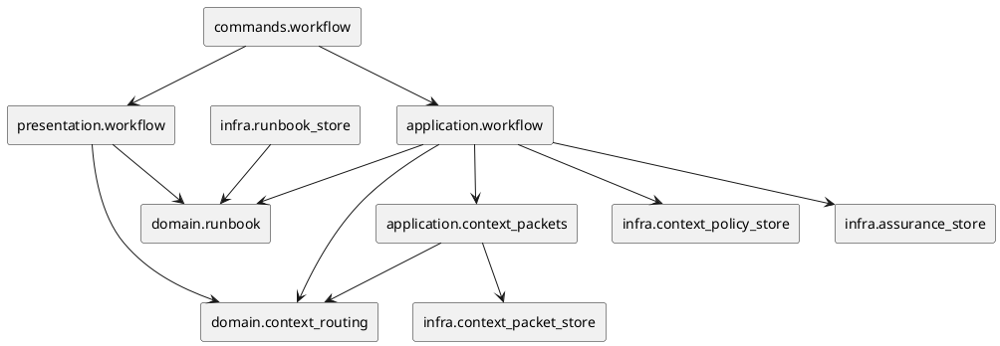

# iss-00230 Compile Step Assurance Agent Routing And Context Policy — 設計

## 目的・制約
- 目的:
  - `workflow next issue-execution` が、active issue の current implementation step に必要な agent routing / context contract を compile できるようにする。
  - worker continuity と reviewer independence を同じ policy surface で扱う。
- 非交渉制約:
  - `assurance.json` の `authorized_profile` が obligation authority であり、`lite_candidate` は obligation reduction authority を持たない。
  - Generated Runbook / context packet は ignored projection とし、canonical issue docs や provider source を runtime が上書きしない。
  - Reviewer / consultant clean-room packet は fail-closed にする。

## 既存実装 / 規約の理解
- 既存:
  - `domain/assurance.py` が Profile / Complexity / source binding の domain authority。
  - `application/workflow.py` が active issue state と assurance validity を解決する。
  - `domain/runbook.py` が workflow target ごとの Runbook を compile する。
  - `infra/runbook_store.py` が generated projection を ignored paths へ atomic write する。
  - `commands/workflow.py` と `presentation/workflow.py` が CLI JSON / Markdown を返す。
- 採用するパターン:
  - domain は filesystem / CLI に依存しない。
  - policy source は provider-side tracked JSON とし、infra/application が読み込む。
  - generated packet は runbook projection と同じ ignored state 配下へ書く。
- 採用しないもの:
  - Skill text に state-specific routing matrix を埋め込まない。
  - PR review trigger と blocker semantics は変更しない。

## 採用方針
- Step facts は plan markdown から best-effort で抽出する。
  - 初期実装では `### 実装ステップ Sxx` heading と近傍テキストを対象に、`docs-only`、`runtime`、`migration`、`security` などの keyword facts を導出する。
  - 将来の構造化 plan schema へ移行できるよう、domain input は `StepFacts` value object に閉じる。
- Context policy は JSON source と domain default の二層にする。
  - JSON が valid な場合は policy source を使う。
  - JSON が missing / invalid の場合、reviewer は fail-closed、worker は strict bounded defaults に degrade する。
- Runbook extension は backward compatible にする。
  - 既存 top-level fields は維持し、`step_assurance` と `context_packets` を optional extension として追加する。
- Invocation observability は event projection として扱う。
  - `ContextPacketProjection` に invocation event を含め、role、reasoning effort、context mode、policy version、packet hash、source hashes、fork turn count、include / exclude categories、returned evidence refs を machine-readable に出す。
  - Full logs や raw transcript は refs / hashes に留め、payload 本体には含めない。

## モジュール依存図


## インターフェース契約
- Domain:
  - `StepFacts`: step id、title、task kind、risk tags、source binding hash、scope hash。
  - `AgentRole`: `dev-coder`、`doc-writer`、`code-reviewer`、`qa-reviewer`、`spec-reviewer`、`consultant`。
  - `ContextMode`: `recent_fork`、`bounded_packet`、`clean_room`、`minimal_packet`。
  - `StepAssuranceDecision`: worker、reasoning effort、context mode、verification、reviewers、return contract、continuation decision。
  - `ContinuationFacts`: source revision、source binding hash、goal hash、scope hash、allowed paths hash、risk fingerprint、current HEAD / worktree / file revalidation result。
  - `InvocationEvent`: role、reasoning effort、context mode、policy version、packet hash、source hashes、fork turn count、include / exclude categories、returned evidence refs。
- Application:
  - `compile_step_assurance(issue, assurance, plan_text, policy) -> StepAssuranceProjection`。
  - `compile_context_packets(projection, issue_artifacts) -> ContextPacketProjection`。
- CLI:
  - `workflow next issue-execution --format json` に optional `step_assurance` と `context_packets` を含める。
  - Markdown 出力に "Step Assurance" section を含める。

## ディレクトリ / ファイル変更計画
```text
src/spec_dock/assets/spec_dock/
|-- system/assurance/context-routing-policy.json
|-- system/assurance/schemas/context-routing-policy.schema.json
`-- scripts/spec_dock_runtime/
    |-- domain/context_routing.py
    |-- application/context_packets.py
    |-- application/workflow.py
    |-- domain/runbook.py
    |-- infra/context_policy_store.py
    |-- infra/context_packet_store.py
    |-- presentation/workflow.py
    `-- commands/workflow.py

spec-dock/
|-- system/assurance/context-routing-policy.json
|-- system/assurance/schemas/context-routing-policy.schema.json
`-- scripts/spec_dock_runtime/... # dogfooding mirror sync

tests/
|-- unit/domain/test_context_routing.py
|-- unit/infra/test_context_packet_store.py
|-- cli_runtime/test_workflow_context_routing.py
`-- cli_runtime/test_workflow.py
```

## 要件 → 設計マッピング
- AC-001 -> `domain/context_routing.py` routing matrix tests。
- AC-002, AC-006, EC-004 -> continuation eligibility、freshness revalidation、fallback tests。
- AC-003, AC-004, AC-005 -> reviewer / consultant clean-room packet tests。
- AC-007 -> Runbook JSON / Markdown presentation tests。
- AC-008 -> generated packet ignored-state and git-clean CLI test。
- AC-009, AC-011 -> context packet evidence ref and invocation event schema tests。
- AC-010, EC-001 -> existing workflow state precedence tests。
- EC-002 -> invalid policy fail-closed / degrade tests。

## テスト戦略
- Unit:
  - context routing matrix、continuation invalidation、freshness revalidation、return contract、clean-room exclusion、invocation event schema。
- Infra:
  - context packet atomic write、ignored projection path、path traversal / symlink rejection。
- CLI runtime:
  - `workflow next issue-execution` JSON / Markdown extension、missing assurance precedence、tracked diff が出ないこと。
- Integration:
  - この Issue では live sub-agent invocation は行わず、runtime projection contract で閉じる。

## リスク / 移行
- 既存 Runbook consumers が未知 field を許容しない可能性があるため、既存 field は変更しない。
- policy JSON が壊れた状態で reviewer を許可すると independence を破るため、reviewer は fail-closed を優先する。
- plan markdown parse は暫定的 best-effort なので、構造化 step metadata は future follow-up とする。ただし本 Issue では heading / keyword based extraction を deterministic に固定する。

## 未確定事項
- なし。
