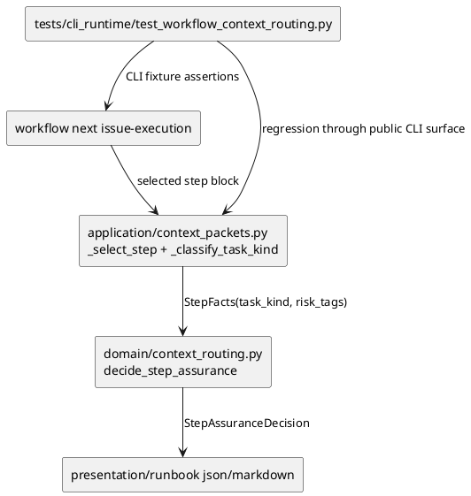

# iss-00237 Analyze Manual Test Routing Failures — 設計

## 目的・制約
- 目的:
  - Epic 00224 の手動テストで失敗した runtime task routing を修正する。
  - runtime step を `docs-only` に過小分類せず、否定文だけで `security-sensitive` に過剰分類しない。
  - docs-only、migration、security-sensitive の true positive は regression tests で維持する。
- 必須:
  - `application/context_packets.py` の `_classify_task_kind` を evidence-based classifier に置き換える。
  - `tests/cli_runtime/test_workflow_context_routing.py` に MT-009 / MT-024 由来の regression tests を追加する。
- 禁止:
  - routing policy matrix、assurance authority、continuation policy、PR observation、`workflow_state.py` は変更しない。
  - Issue plan schema に explicit `task_kind` / `risk_tags` field は追加しない。
- 非交渉制約:
  - docs-only と runtime の判定が曖昧な場合は runtime に倒す。
  - 肯定的な security evidence は runtime evidence より優先する。
  - negation handling は high-risk false negative を増やさないよう、明確な否定・禁止・停止条件の文脈に限定する。

## 既存実装の理解
- `workflow next issue-execution` は plan/report から次 step を選び、`_classify_task_kind` で `TaskKind` と `risk_tags` を推定する。
- `TaskKind.RUNTIME` が `decide_step_assurance` に渡れば、現行 `domain/context_routing.py` は期待どおり `dev-coder` / `medium` / `recent_fork` / `unit_tests` / `code-reviewer` を返す。
- 失敗原因は routing matrix ではなく、`_classify_task_kind` が plan block 全体に対して単純 substring 判定を行う点にある。
- 現行の問題:
  - `security/privacy-sensitive として過剰に分類しない` のような否定文でも `security-sensitive` になる。
  - `docs-only verification` という検証手段ラベルだけで `docs-only` になる。
  - runtime paths、`unit_tests`、`dev-coder`、`code-reviewer` の strong evidence が docs-only weak phrase より後に扱われる。

## 採用方針
- `20260624t062220z-disc-routing-repair-design-options.md` の Option B を採用する。
- `_classify_task_kind` の外部 contract は維持し、返り値を `tuple[TaskKind, tuple[str, ...]]` のままにする。
- 新規 module は作らず、`context_packets.py` 内に private helper を置く。
- 分類は natural language parser ではなく、step block 内の bounded evidence と precedence で行う。

## 分類 precedence
1. affirmative security evidence
   - 例: `security_review`, `privacy_review`, `authentication`, `authorization`, `permissions`, `privilege`, `credential`, `secret`
   - ただし否定文・禁止事項・停止条件にだけ出る high-risk word は除外する。
2. migration evidence
   - 例: `migration`, `rollback`, `schema`, `data migration`
   - ただし否定文・禁止事項・停止条件にだけ出る語は除外する。
3. runtime evidence
   - 例: `dev-coder`, `code-reviewer`, `unit_tests`, `integration_tests`, `tests/`, `src/`, `spec_dock_runtime`, `commands/`, `runtime command behavior`
4. explicit docs-only evidence
   - 例: `Task marker: docs-only`, `委任ロール: doc-writer`, `doc-writer`, `docs_inspection`
   - `docs-only verification` や `tests または docs-only verification` は weak / ignored signal として扱う。
5. fallback
   - `runtime`

## モジュール依存図


## インターフェース契約
- 変更する private function:
  - `_classify_task_kind(text: str) -> tuple[TaskKind, tuple[str, ...]]`
- 追加する private helper 候補:
  - `_has_affirmative_security_evidence(text: str) -> bool`
  - `_has_migration_evidence(text: str) -> bool`
  - `_has_runtime_evidence(text: str) -> bool`
  - `_has_explicit_docs_only_evidence(text: str) -> bool`
  - `_is_negated_or_exclusion_context(line: str) -> bool`
- 維持する contract:
  - `selected_step["task_kind"]` は `TaskKind`。
  - `selected_step["risk_tags"]` は tuple/list 化可能な string collection。
  - `StepAssuranceProjection.to_payload()` の JSON shape は変更しない。
  - context packet / runbook の出力パスと schema version は変更しない。

## ディレクトリ / ファイル変更計画
```text
.
|-- src/spec_dock/assets/spec_dock/scripts/spec_dock_runtime/application/
|   `-- context_packets.py                     # 変更: evidence-based task kind classifier
`-- tests/cli_runtime/
    `-- test_workflow_context_routing.py       # 変更: MT-009 / MT-024 routing regression tests
```

## 要件 → 設計マッピング
- AC-001:
  - runtime evidence を docs-only weak phrase より優先する。
  - CLI fixture で `docs-only verification` と runtime evidence が同居する plan step を検証する。
- AC-002:
  - high-risk words を含む否定文・禁止文・停止条件文脈を affirmative security evidence から除外する。
- AC-003:
  - `security_review` / `privacy_review` / authentication / authorization / permissions などの肯定 evidence は引き続き security-sensitive にする。
- AC-004:
  - explicit docs-only marker は docs-only routing の true positive として維持する。
- AC-005:
  - migration / rollback evidence は migration routing の true positive として維持する。
- AC-006:
  - targeted pytest で regression と既存 routing expectations を閉じる。
- EC-001:
  - runtime > weak docs-only の precedence で閉じる。
- EC-002:
  - negated/exclusion context filtering で閉じる。
- EC-003:
  - affirmative security > runtime の precedence で閉じる。

## テスト戦略
- CLI runtime regression:
  - `test_workflow_next_runtime_paths_override_docs_only_verification_phrase`
  - `test_workflow_next_negated_security_phrase_does_not_escalate`
  - `test_workflow_next_affirmative_authz_terms_still_escalate`
  - `test_workflow_next_explicit_docs_only_still_routes_to_doc_writer`
  - `test_workflow_next_affirmative_migration_terms_still_route_to_rollback_plan`
- 既存 test 維持:
  - `test_workflow_next_routes_plan_derived_task_kinds`
  - context packet / runbook projection tests
- 実行コマンド:
  - `uv run pytest tests/cli_runtime/test_workflow_context_routing.py`
- 手動テスト:
  - この issue 内では自動 regression を優先する。
  - Epic manual test suite の再走は follow-up の総合確認で扱う。

## リスク / ロールバック
- リスク:
  - negation 判定を広げすぎると、本物の security/authz リスクを見落とす。
  - heuristic である限り、未知の plan 表現で誤分類が残る。
  - docs-only marker と runtime evidence が同居する曖昧な step は runtime に倒すため、docs-only として軽量化されにくくなる。
- 緩和:
  - negation/exclusion context は line-local に限定する。
  - affirmative `security_review` / `privacy_review` / authentication / authorization / permissions は明示的に regression で守る。
  - explicit field 化はこの issue では入れず、将来の ADR / issue 候補として残す。
- ロールバック:
  - `_classify_task_kind` と追加 tests の差分を戻せば runtime contract は元に戻る。

## 未確定事項
- なし。
- explicit `task_kind` / `risk_tags` schema 化は今回の実装修正ではなく follow-up 候補。
