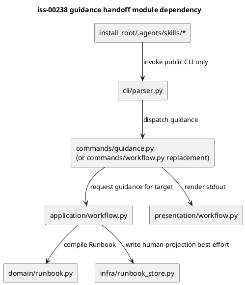
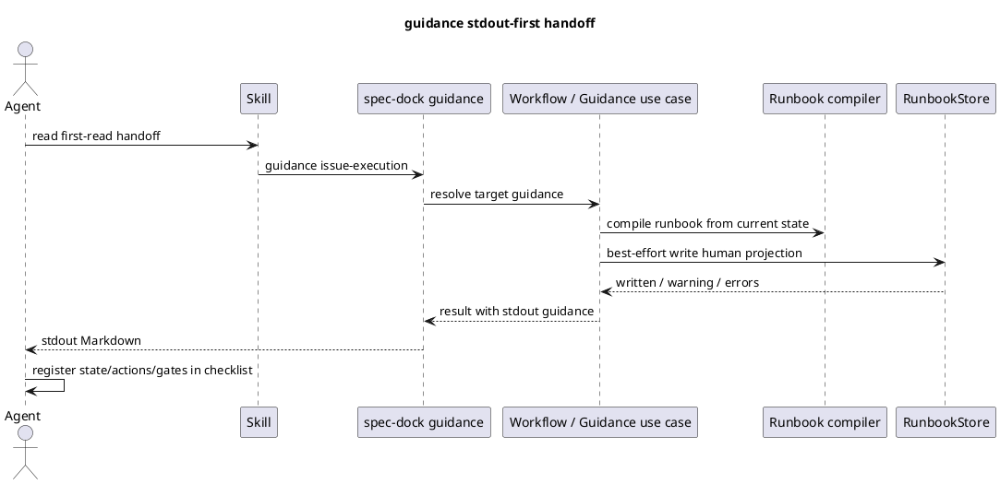

# iss-00238 Use Stdout Runbook Handoff Instead Of Generated Workflow Files — 設計（どう実現するか）

## 親図（Diagram）参照

- Epic 図:
  - `epic-00224/design.md` の "Adaptive Assurance and Compiled Workflow Components"。
- 再利用する決定:
  - Fixed Skill kernel, dynamic contract。
  - Tracked contract, ignored projection。
  - Generated Runbook は canonical authority ではない。
- この Issue で補正する決定:
  - Epic 文書の `workflow next` 前提を、agent-facing command としては `guidance <target>` へ置き換える。
  - Runbook projection は ignored artifact として残るが、agent handoff surface から外す。

## 目的・制約

- 目的:
  - Agent が常に `guidance <target>` stdout を読むことで、現在状態に対する guidance を取得できるようにする。
  - Human-facing projection の便利さは維持しつつ、projection stale / write failure が agent execution を妨げないようにする。
  - Issue Planning / Execution Skill の first-read handoff を新 command surface へ合わせる。
- 必須:
  - `guidance issue-planning` / `guidance issue-execution` を CLI public command として提供する。
  - `workflow next` は primary command として残さない。
  - Projection write failure を `runbook-write-failure` state へ変換しない。
  - Skill は returned guidance の task checklist 登録を要求する。
- 禁止:
  - `guidance current` や `workflow next` の互換 alias。
  - Agent-facing docs で projection path を handoff authority として示すこと。
  - Context packet の責務変更。

## 既存実装 / 規約の理解

- 参照した実装 / docs:
  - `src/spec_dock/assets/spec_dock/scripts/spec_dock_runtime/commands/workflow.py`
  - `src/spec_dock/assets/spec_dock/scripts/spec_dock_runtime/application/workflow.py`
  - `src/spec_dock/assets/spec_dock/scripts/spec_dock_runtime/application/contracts.py`
  - `src/spec_dock/assets/spec_dock/scripts/spec_dock_runtime/domain/runbook.py`
  - `src/spec_dock/assets/spec_dock/scripts/spec_dock_runtime/infra/runbook_store.py`
  - `src/spec_dock/assets/spec_dock/scripts/spec_dock_runtime/presentation/workflow.py`
  - `src/spec_dock/assets/install_root/.agents/skills/spec-dock-issue-planning/SKILL.md`
  - `src/spec_dock/assets/install_root/.agents/skills/spec-dock-issue-execution/SKILL.md`
  - `tests/cli_runtime/test_workflow.py`
  - `tests/cli_runtime/test_workflow_context_routing.py`
  - `tests/unit/infra/test_runbook_store.py`
- 現状理解:
  - `workflow_next` use case は state を解決し、必要に応じて execution context を compile し、Runbook を compile する。
  - 現行 use case は常に `runbook_store.write_current(runbook)` を実行し、失敗時に `runbook-write-failure` を返す。
  - `issue-execution` だけは step assurance / context packet / continuation check を扱うため、planning target と execution target の分離は runtime 上も意味がある。
  - Parser / command / presentation は `workflow status` と `workflow next` 前提で命名されている。
- 採用するパターン:
  - 既存 layered architecture を維持し、commands -> application -> domain / infra -> presentation の依存方向を崩さない。
  - 既存 Runbook domain / presentation payload を再利用する。
  - 既存 `WorkflowTarget = Literal["issue-planning", "issue-execution"]` の target 分離を維持する。
- 採用しないもの:
  - `workflow next` を alias として残す migration path。
  - Projection を opt-in flag / explicit command にする設計。
  - Projection write failure を agent-facing blocked state にする設計。

## 採用方針 / トレードオフ

- 論点: command name
  - 選択肢:
    - `guidance <target>`
    - `guidance current <target>`
    - `workflow next <target>`
  - 決定:
    - `guidance <target>`。
  - 理由:
    - Guidance は常に現在状態から組み立てるため `current` は重複する。
    - `next` は不要な sibling concept を作る。
    - `workflow` は全体手順の語感が強い。

- 論点: planning / execution target
  - 選択肢:
    - `guidance issue` へ統合する。
    - `guidance issue-planning` / `guidance issue-execution` に分ける。
  - 決定:
    - target は分ける。
  - 理由:
    - Skill routing と runtime 分岐が既に planning / execution で異なる。
    - 推測型 target は planning / execution 境界の誤誘導リスクを増やす。

- 論点: projection
  - 選択肢:
    - default で書かない。
    - explicit snapshot command にする。
    - 自動生成を維持しつつ agent-facing contract から外す。
  - 決定:
    - 自動生成を維持しつつ、non-blocking / ignored / human-only とする。
  - 理由:
    - 人間にとって snapshot は便利。
    - Agent に flag / command を扱わせると handoff surface が再び混ざる。
    - Write failure は guidance 取得を妨げるべきではない。

## 依存関係分析

- module 依存:
  - `commands/guidance.py` または既存 `commands/workflow.py` の置換が parser / bootstrap に依存する。
  - `application/workflow.py` は projection write を non-blocking 化する。
  - `presentation/workflow.py` は既存 payload / Markdown renderer を再利用し、表題 / operation 名を guidance に寄せる。
  - `infra/runbook_store.py` は projection header / payload の human-only warning を持てる。
- file 依存:
  - Runtime command 追加 / 置換:
    - `src/spec_dock/assets/spec_dock/scripts/spec_dock_runtime/cli/parser.py`
    - `src/spec_dock/assets/spec_dock/scripts/spec_dock_runtime/commands/workflow.py`
    - 必要に応じて `commands/guidance.py`
    - `application/contracts.py`
    - `application/workflow.py`
    - `presentation/workflow.py`
  - Projection:
    - `infra/runbook_store.py`
    - `tests/unit/infra/test_runbook_store.py`
  - Skill:
    - `src/spec_dock/assets/install_root/.agents/skills/spec-dock-issue-planning/SKILL.md`
    - `src/spec_dock/assets/install_root/.agents/skills/spec-dock-issue-execution/SKILL.md`
  - Tests:
    - `tests/cli_runtime/test_workflow.py`
    - `tests/cli_runtime/test_workflow_context_routing.py`
    - `tests/unit/infra/test_init_update.py`
    - `tests/cli_runtime/test_wrappers.py`
- 実装起点:
  - CLI contract tests で `guidance <target>` を先に固定する。
  - その後 parser / command / use case の命名を差し替える。
  - Projection failure の non-blocking contract を unit test で固定する。

## モジュール依存図（Module Dependency Diagram）



## インターフェース契約

- CLI:
  - `./spec-dock/scripts/spec-dock guidance issue-planning`
  - `./spec-dock/scripts/spec-dock guidance issue-execution`
- Target:
  - `issue-planning`
  - `issue-execution`
- Output:
  - Markdown: agent が読みやすい current guidance。今回の issue では JSON output contract を用意しない。
- Removed / replaced:
  - `workflow next <target>` は primary command として提供しない。
  - `workflow status` の扱いは実装時に確認する。状態確認専用として残す場合でも、dynamic handoff の主導線にはしない。

## シーケンス差分



## ドメインモデル差分

- `WorkflowTarget` は維持するが、public concept は `GuidanceTarget` として扱う余地がある。
- `WorkflowResult.operation` は `next` から `guidance` へ変更するか、presentation 上だけ `guidance` として出す。
- `RunbookProjectionResult` は agent-facing state 決定に使わない。Projection error は metadata / warning として扱う。
- `Runbook` は引き続き compiled guidance payload として使う。

## ディレクトリ / ファイル変更計画

```text
src/spec_dock/assets/spec_dock/scripts/spec_dock_runtime/
|-- cli/
|   `-- parser.py                         # guidance command dispatch を追加 / workflow next を削除
|-- commands/
|   |-- workflow.py                       # guidance へ置換、または guidance.py へ責務移動
|   `-- guidance.py                       # 追加する場合: guidance command handler
|-- application/
|   |-- contracts.py                      # request/result operation naming を guidance に合わせる
|   `-- workflow.py                       # projection write を best-effort non-blocking 化
|-- infra/
|   `-- runbook_store.py                  # projection に human-only warning / refresh command を含める
`-- presentation/
    `-- workflow.py                       # Markdown 表示を guidance 表現へ調整

src/spec_dock/assets/install_root/.agents/skills/
|-- spec-dock-issue-planning/SKILL.md     # first-read handoff を guidance issue-planning に変更
`-- spec-dock-issue-execution/SKILL.md    # first-read handoff を guidance issue-execution に変更

tests/
|-- cli_runtime/test_workflow.py          # guidance CLI contract / projection non-blocking
|-- cli_runtime/test_workflow_context_routing.py
|-- cli_runtime/test_wrappers.py
|-- unit/infra/test_runbook_store.py
`-- unit/infra/test_init_update.py
```

## 要件 → 設計マッピング

- AC-001 -> `guidance issue-planning` CLI / parser / presentation / tests。
- AC-002 -> `guidance issue-execution` CLI / execution context routing / tests。
- AC-003 -> parser / Skill / tests から `workflow next` primary command を削除。
- AC-004 -> `application/workflow.py` projection write non-blocking 化。
- AC-005 -> `infra/runbook_store.py` human projection metadata / ignored projection tests。
- AC-006 -> Issue Planning / Execution Skill asset 更新。
- AC-007 -> guidance use case が projection read に依存しないことを regression test で固定。
- EC-001 -> no-active state guidance tests。
- EC-002 -> parser target rejection tests。
- EC-003 -> malformed assurance / stale source binding tests の guidance 版。
- EC-004 -> context packet write failure の fail-closed 維持。

## テスト戦略

- 単体:
  - `workflow_next` / guidance use case の projection write failure non-blocking test。
  - `RunbookStore` projection header / metadata test。
- CLI runtime:
  - `guidance issue-planning`
  - `guidance issue-execution`
  - unknown target rejection。
  - no-active guidance。
  - stale projection independence。
  - tracked diff が出ない projection。
- Asset / installer:
  - provider Skill asset に `guidance issue-planning` / `guidance issue-execution` が含まれる。
  - generated installed Skill も同じ first-read handoff を持つ。
  - `workflow next` の primary handoff が残らない。
- 回帰:
  - `tests/cli_runtime/test_workflow_context_routing.py` の `workflow next` 呼び出しを `guidance` に置換し、step assurance / context packet 挙動が維持されること。

## リスク / 移行 / ロールバック

- リスク:
  - 多数の tests が `workflow next` 名を前提にしているため、機械的置換だけでは operation 名 / payload assertion がずれる可能性がある。
  - Projection write failure を non-blocking にすると、projection の異常に気づきにくくなる。
  - `workflow status` を残すかどうかの境界が曖昧になり得る。
- 対策:
  - agent-facing handoff は `guidance` に限定し、`workflow status` が残る場合も state inspection 用と明記する。
  - Projection error は Markdown warning または debug log として観測可能にする。
  - Tests で stale projection independence と projection write failure non-blocking を固定する。
- ロールバック:
  - この issue は main 未マージの feature branch 上の修正なので、必要なら commit revert で `workflow next` 実装へ戻せる。

## 未確定事項

- なし。
