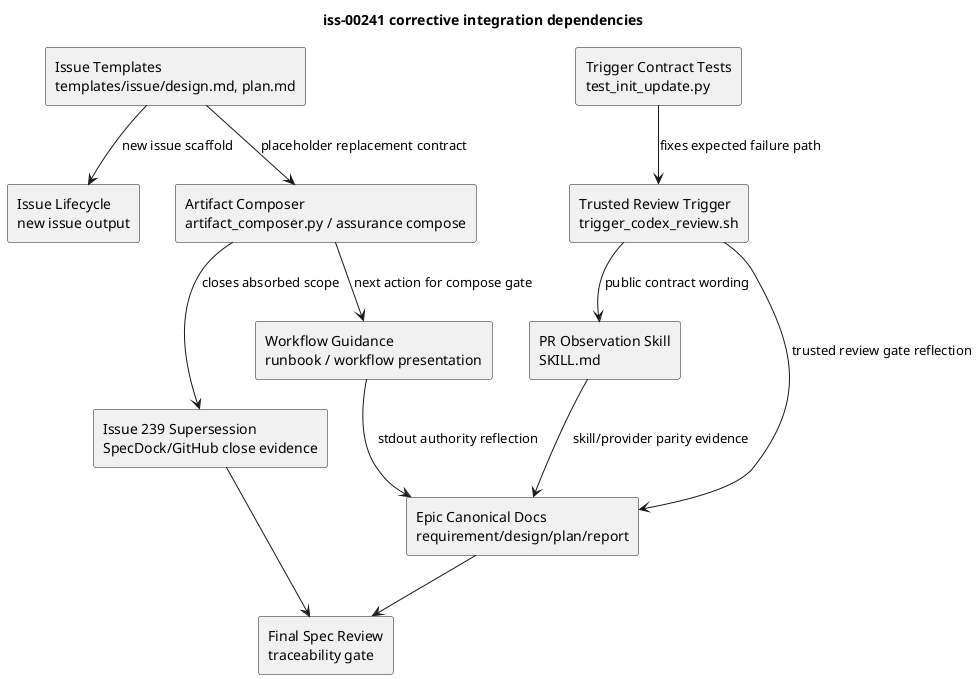
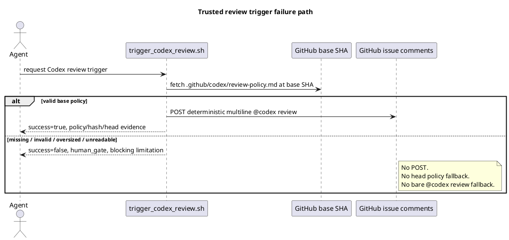
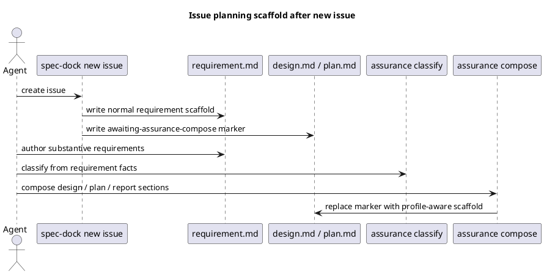

# iss-00241 Resolve Epic Traceability And Review Policy Gate Gaps — 設計

## 親図・再利用する決定
- Epic:
  - `epic-00224 Dynamic Workflow Resource Allocation`
- 再利用する決定:
  - ADR `Trusted Base SHA GitHub Review Policy`
    - base SHA fixed path の policy のみ trusted source。
    - missing / invalid / oversized / unreadable は human gate。
    - head policy fallback は禁止。
  - ADR `Fixed Skill Kernel And Compiled Runbook Authority`
    - skill は固定 kernel。
    - current handoff は runtime が生成する状態依存 guidance。
    - generated projection は tracked source of truth ではない。
  - Issue `iss-00238` accepted implementation decision:
    - current command は `./spec-dock/scripts/spec-dock guidance issue-planning` / `issue-execution`。
    - projection は human/debug-only。
    - `workflow next` compatibility alias は不要。
  - User-approved scope decision:
    - `iss-00239` は `iss-00241` に吸収し、corrective integration Issue として一つにまとめる。

## 目的・制約
- 目的:
  - Epic 00224 の accepted decisions と実装・docs・tests・reports の不一致を解消し、Epic close readiness を再確立する。
- 必須:
  - Failure path は tests で逆仕様を固定しない。
  - Provider source と dogfooding mirror を同期する。
  - Epic 正本を current runtime / skills と矛盾しない状態へ戻す。
  - `iss-00239` の scope を unresolved scaffold として残さない。
- 禁止:
  - trusted base policy failure で fallback trigger を投稿しない。
  - `workflow next` を current entrypoint として使わない。
  - placeholder design / plan を substantive content と誤認させない。

## 既存実装 / 規約の理解
- 参照した実装 / docs:
  - `src/spec_dock/assets/install_root/.agents/skills/github-pr-observation/scripts/trigger_codex_review.sh`
  - `.agents/skills/github-pr-observation/scripts/trigger_codex_review.sh`
  - `src/spec_dock/assets/install_root/.agents/skills/github-pr-observation/SKILL.md`
  - `.agents/skills/github-pr-observation/SKILL.md`
  - `tests/unit/infra/test_init_update.py`
  - `src/spec_dock/assets/spec_dock/scripts/spec_dock_runtime/domain/runbook.py`
  - `src/spec_dock/assets/spec_dock/scripts/spec_dock_runtime/presentation/workflow.py`
  - `src/spec_dock/assets/spec_dock/scripts/spec_dock_runtime/infra/runbook_store.py`
  - `src/spec_dock/assets/spec_dock/scripts/spec_dock_runtime/domain/artifact_composer.py`
  - `src/spec_dock/assets/spec_dock/scripts/spec_dock_runtime/application/issue_lifecycle.py`
  - `src/spec_dock/assets/spec_dock/templates/issue/{requirement,design,plan,report}.md`
  - `tests/cli_runtime/test_new.py`
  - `tests/cli_runtime/test_assurance_compose.py`
  - `tests/cli_runtime/test_workflow.py`
- 現状理解:
  - PR review trigger は valid base policy 正常系では deterministic multiline body を生成できるが、policy failure path が bare trigger fallback になっている。
  - Skill text は旧 fixed-body model を説明しており、runtime-composed body / human gate failure path と一致していない。
  - Runtime guidance と skills は `guidance <target>` へ移行済みだが、Epic docs / ADR wording に `workflow next` が残っている。
  - Issue 作成時の design / plan template は通常 scaffold であり、assurance compose gate を構造的には強制しない。
  - Artifact preflight / active symlink / validation は design / plan の存在を前提にする箇所があるため、ファイル未作成方式ではなく placeholder 方式が blast radius を抑える。
- 採用するパターン:
  - Provider-side source of truth を更新し、dogfooding mirror と tests で parity を確認する。
  - Human-readable docs は current contract と historical/superseded terminology を分ける。
  - Placeholder は file existence contract を保ちつつ machine-readable marker を持たせる。
- 採用しないもの:
  - PR head policy fallback。
  - `workflow next` alias / compatibility layer の追加。
  - Issue 作成時に design / plan file を作らない hard cutover。

## 採用方針 / トレードオフ
- 論点: trusted policy failure の JSON contract
  - 決定:
    - `success=false`、`overall_status=human_gate`、`normalized_status=human_gate` 相当、`recommended_next_action=human_gate` 相当、`trigger.action=skipped` または `blocked`、`review_policy.status=<failure_reason>`、blocking limitation を返す。
  - 理由:
    - Existing observation scripts は human_gate を status として扱えるため、fail-closed を表現しやすい。
- 論点: Epic ADR 本文を直接書き換えるか
  - 決定:
    - Historical ADR は accepted record として保持し、current command 名や projection demotion は Epic requirement / design / plan / report と必要な discussion/report evidence で反映する。
  - 理由:
    - ADR の当時の判断を消さず、`workflow next` 相当概念から `guidance <target>` への実装上の名称変更を current docs へ昇格する方が auditability が高い。
- 論点: `iss-00239` の扱い
  - 決定:
    - `iss-00241` に scope を吸収し、`iss-00239` は superseded / closed とする。
  - 理由:
    - scaffold のまま残すと Epic close readiness を再び block するため。
- 論点: design / plan scaffold の生成方式
  - 決定:
    - Issue 作成時は design / plan file を作るが、通常 scaffold ではなく `artifact_state: awaiting-assurance-compose` などの marker を持つ blocker placeholder にする。
  - 理由:
    - Existing file existence contract を壊さず、agent が誤って通常 planning を始めるリスクを減らせる。

## 依存関係分析
- module 依存:
  - PR trigger:
    - `trigger_codex_review.sh` -> fake `gh` tests -> skill text assertions。
  - Guidance / projection:
    - runtime already implemented -> Epic docs/report reflection。
  - Placeholder scaffold:
    - issue templates / lifecycle create -> assurance compose -> workflow guidance / validation tests。
  - Epic closure:
    - all above implementation/docs evidence -> Epic report traceability table -> spec-reviewer。
- file 依存:
  - `tests/unit/infra/test_init_update.py` failure-path tests must be updated before script success criteria can change.
  - `src/spec_dock/assets/spec_dock/templates/issue/design.md` and `plan.md` define new issue output.
  - `artifact_composer.py` must distinguish placeholder vs substantive content before replacing design / plan.
  - Epic docs should be updated after implementation contract is fixed, so documentation reflects current behavior rather than intended-only behavior.
- 実装起点:
  - S01 PR review trigger failure path: strongest P0 blocker and clear negative tests.
  - S02 skill contract: public contract parity depends on S01 wording.
  - S03 placeholder scaffold: absorbed `iss-00239`, independent from PR trigger.
  - S90 Epic docs/report reconciliation: depends on S01-S03 decisions.
  - S99 final quality gate: depends on all.

## モジュール依存図



## インターフェース契約
- `trigger_codex_review.sh` helper JSON:
  - Success path:
    - `success=true`
    - posted comment body contains `@codex review`, policy source metadata, policy base SHA, policy hash, reviewed head SHA.
  - Human gate path:
    - `success=false`
    - `overall_status=human_gate`
    - `normalized_status=human_gate`
    - `recommended_next_action=human_gate` or equivalent decision action
    - `trigger.action=skipped` / `blocked`
    - `review_policy.status` is one of `base_sha_missing`, `missing`, `invalid`, `too_large`, `unreadable`, `non_utf8`
    - limitations include severity `blocking`
    - no issue comment POST is made.
- Skill contract:
  - Public write is a fixed endpoint with runtime-composed deterministic body.
  - Caller cannot supply body / endpoint / path.
  - Manual bare `@codex review` is not the normal workflow.
- Placeholder artifact marker:
  - `artifact_state: awaiting-assurance-compose`
  - instruction body must tell the agent to finish requirement capture, run assurance classify, then assurance compose.
  - compose may replace placeholder.
  - compose must not overwrite substantive non-placeholder content.
- Epic traceability gate:
  - Each failed / partial / needs-verification audit item must be resolved, superseded, or explicitly human-gated.
  - Corrective Issues `iss-00237` / `iss-00238` / `iss-00239` / `iss-00241` must be included in the final closure ledger.

## シーケンス差分





## ディレクトリ / ファイル変更計画

```text
.
|-- src/spec_dock/assets/install_root/.agents/skills/github-pr-observation/
|   |-- SKILL.md                         # 変更: deterministic body / human gate contract
|   `-- scripts/
|       `-- trigger_codex_review.sh       # 変更: base policy failureをPOSTなしhuman gateへ変更
|-- .agents/skills/github-pr-observation/
|   |-- SKILL.md                         # 変更: dogfooding mirror contract parity
|   `-- scripts/
|       `-- trigger_codex_review.sh       # 変更: dogfooding mirror script parity
|-- src/spec_dock/assets/spec_dock/
|   |-- templates/issue/
|   |   |-- design.md                     # 変更: awaiting-assurance-compose placeholder
|   |   `-- plan.md                       # 変更: awaiting-assurance-compose placeholder
|   `-- scripts/spec_dock_runtime/
|       |-- application/issue_lifecycle.py # 変更: new issue artifact lifecycle if needed
|       |-- domain/artifact_composer.py    # 変更: placeholder replacement / substantive conflict
|       |-- domain/runbook.py              # 変更: placeholder state guidance if needed
|       `-- presentation/workflow.py       # 変更: guidance output wording if needed
|-- tests/
|   |-- unit/infra/test_init_update.py     # 変更: trigger fail-closed and skill text tests
|   |-- cli_runtime/test_new.py            # 変更: issue creation placeholder tests
|   |-- cli_runtime/test_assurance_compose.py # 変更: placeholder materialization / no-overwrite tests
|   `-- cli_runtime/test_workflow.py       # 変更: placeholder guidance / projection wording if needed
`-- spec-dock/initiatives/init-local-00003-architecture-maintenance-and-hardening/epics/epic-00224-dynamic-workflow-resource-allocation/
    |-- requirement.md                    # 変更: guidance stdout authority / corrective scope reflection
    |-- design.md                         # 変更: current command / projection / traceability gate
    |-- plan.md                           # 変更: corrective issue inclusion / final gate
    |-- report.md                         # 変更: current closure ledger
    `-- issues/
        |-- iss-00239-*/report.md          # 変更: superseded by iss-00241 evidence if needed
        `-- iss-00241-*/{requirement.md,design.md,plan.md,report.md}
```

## 要件 → 設計マッピング
- AC-001 -> Trigger failure path contract / tests.
- AC-002 -> Trigger success path preservation.
- AC-003 -> Skill public contract parity.
- AC-004 -> Epic docs guidance stdout reflection.
- AC-005 -> Projection human/debug-only reflection and runtime wording.
- AC-006 -> Issue template placeholder design.
- AC-007 -> Artifact composer placeholder materialization / conflict design.
- AC-008 -> `iss-00239` supersession flow.
- AC-009 -> Epic report reconciliation.
- AC-010 -> Epic final traceability quality gate.
- EC-001〜EC-003 -> Trigger negative tests.
- EC-004 -> Placeholder validation / compose conflict tests.
- EC-005 -> Guidance projection non-authority wording / tests.

## テスト戦略
- 単体:
  - `tests/unit/infra/test_init_update.py`
    - base SHA missing / policy missing / invalid / non-UTF-8 / oversized / unreadable が POST なし human gate になる。
    - valid policy path の deterministic multiline body は維持される。
    - skill text に fixed bare body wording が残らない。
- CLI runtime:
  - `tests/cli_runtime/test_new.py`
    - new issue creates normal requirement and placeholder design / plan.
  - `tests/cli_runtime/test_assurance_compose.py`
    - compose replaces placeholder.
    - compose does not overwrite substantive non-placeholder content.
    - second run remains idempotent.
  - `tests/cli_runtime/test_workflow.py`
    - placeholder state guidance points to requirement/classify/compose.
    - projection remains human/debug-only if touched.
- Inspection / spec review:
  - Epic docs no longer present `workflow next` as current agent entrypoint.
  - Epic report lists corrective issue dispositions and blocked/resolved gate statuses consistently.
  - `iss-00239` supersession evidence points to `iss-00241`.

## リスク / 移行 / ロールバック
- Risk: `trigger_codex_review.sh` behavior change may prevent review trigger on PRs whose base branch has not yet received `.github/codex/review-policy.md`.
  - Mitigation: this is intentional fail-closed behavior from accepted ADR. Operator must merge policy bootstrap to base or perform human gate handling.
- Risk: placeholder design / plan may break tests that assume full templates after issue creation.
  - Mitigation: preserve file existence; update tests to assert placeholder state and compose materialization.
- Risk: compose replacement could overwrite user content.
  - Mitigation: only replace marker-recognized placeholder; conflict/fail-closed for substantive content.
- Risk: Epic docs updates could drift from historical ADR wording.
  - Mitigation: mark `workflow next` as superseded/historical where needed; keep ADR as historical accepted decision and current docs as operational truth.
- Rollback:
  - Trigger behavior can revert to previous fallback only with explicit ADR change; otherwise rollback is not allowed.
  - Placeholder scaffold can be rolled back by restoring templates, but then `iss-00239` risk reopens and Epic close readiness fails.

## 未確定事項
- なし。
