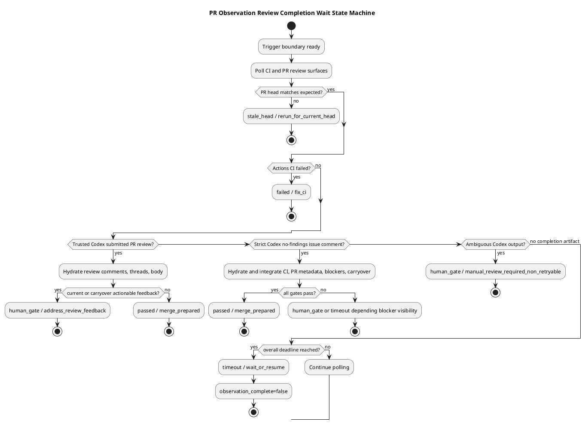
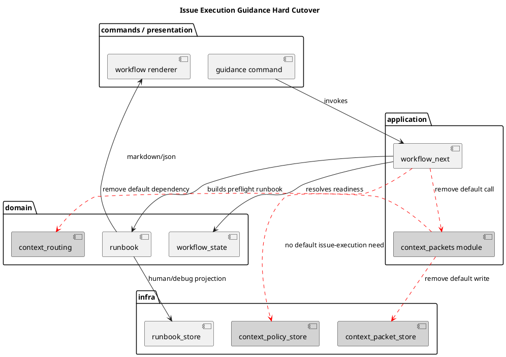
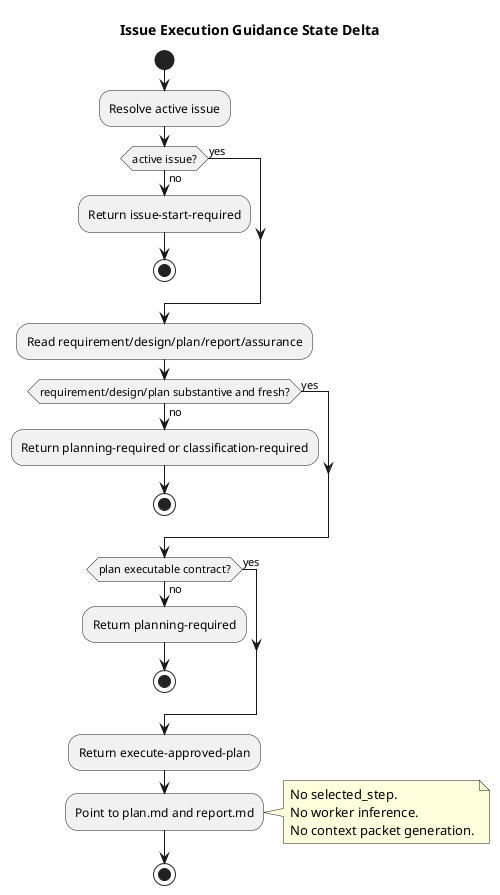

# iss-00244 Simplify Issue Execution Guidance Into Plan Centric Preflight Validation — 設計

## 親設計参照

- Epic: `epic-00224 Dynamic Workflow Resource Allocation`
- 採用済み補正:
  - `iss-00244` では Epic 初期設計の runtime-selected `Step Assurance Compiler` / `Context Packet Compiler` default path を採用しない。
  - `plan.md` を executable workflow contract、`report.md` を observed evidence ledger とする。
  - `guidance issue-execution` は preflight / consistency validator とし、execution order / worker / reviewer / verification の authority を持たない。
  - `hard cutover` のため、旧 dynamic fields / interfaces は deprecated として残さず削除対象にする。
  - PR #245 dogfooding failure を受け、旧 trusted base-SHA review policy ADR は script-local Codex review instruction 方針へ差し替え済み。
  - この Issue の追加作業として、GitHub PR observation の review trigger instruction source を base branch policy から script-local Markdown へ切り替える。
  - Issue-local `assurance.json` は runtime-managed metadata contract として `.assurance.json` へ改名し、agent-facing primary docs と区別する。
  - PR #245 dogfooding failure を受け、`review_completion_unknown` を active terminal-like wait state として扱う方針を廃止する。Review completion は current trigger boundary と expected head SHA に bind された Codex-authored artifact のみで判断する。
  - この review completion 判断は `../../discussions/20260628t154553z-adr-pr-observation-explicit-review-completion.md` として ADR に昇格済み。

## 既存実装 / 規約の理解

### 現行 runtime

- `application/workflow.py`
  - `workflow_next()` は `issue-execution` かつ `state.kind == "ready"` のとき `_compile_execution_context()` を呼ぶ。
  - `_compile_execution_context()` は `plan.md` / `report.md` / `assurance.json` / `context-routing-policy.json` などの source refs を作り、step assurance と context packet を生成する。
  - selected step が `issue_wide_default` の場合は `workflow-plan-unselectable` として block する。
  - context packet write failure は `context-packet-write-failure` として block する。
- `application/context_packets.py`
  - `_select_step()` が `plan.md` heading と `report.md` completion rows から次 step を推定する。
  - `_classify_task_kind()` が free text から docs/runtime/migration/security を推定する。
  - `compile_step_assurance_projection()` が worker / reasoning / context / verification / reviewer を決める。
  - `compile_context_packet_projection()` が generated context packet を書く。
- `domain/context_routing.py`
  - runtime-selected worker / reviewer / context matrix を持つ。
- `domain/runbook.py`、`presentation/workflow.py`、`infra/runbook_store.py`
  - `Runbook` が `step_assurance` / `context_packets` を保持し、Markdown / JSON / projection に出力する。
- `commands` / `cli/bootstrap.py`
  - workflow use case に context policy store / context packet store / continuation probe を注入している。

### 現行 docs / skill

- `phase_plan_issue.md` と `authoring/issue-plan.md` は、すでに plan-centric な契約を持つ。
- `spec-dock-issue-planning` / `spec-dock-issue-execution` skill は generated projection を authority としない一方、まだ `selected step when present` を checklist 登録するよう記述している。
- `assurance compose` の `profile-sections.json` は薄い managed section だけを追加し、Step-level Obligation Pattern を作り込む scaffold には不足している。

### 現行 tests

- `tests/cli_runtime/test_workflow_context_routing.py` は旧 dynamic model を強く期待している。
- `tests/cli_runtime/test_workflow.py` は guidance の lifecycle / projection 挙動を確認している。
- `tests/cli_runtime/test_assurance_compose.py` は compose の managed section 追加を確認している。
- `tests/unit/infra/test_init_update.py` は trusted base-SHA `.github/codex/review-policy.md` fetch と base policy failure behavior を fixture として固定している。

### 現行 GitHub PR observation

- `.agents/skills/github-pr-observation/scripts/trigger_codex_review.sh` と provider mirror は `baseRefOid` を取得し、GitHub contents API で `.github/codex/review-policy.md?ref=<base_sha>` を読む。
- Base policy が valid な場合だけ multiline `@codex review` body を生成する。
- Base policy が missing / invalid / oversized / unreadable / base_sha_missing の場合、`human_gate` として comment を投稿しない。
- `.github/codex/review-policy.md` は GitHub/Codex repository policy に見えるが、実際には review trigger comment に埋め込む instruction として使われている。

### 現行 Assurance Contract path

- `src/spec_dock/assets/spec_dock/scripts/spec_dock_runtime/infra/assurance_store.py`
  - `read_contract()` / `_contract_write_path()` が `target.issue_dir / "assurance.json"` を使う。
- `spec-dock/scripts/spec_dock_runtime/infra/assurance_store.py`
  - dogfooding installed copy も同じ path を使う。
- CLI help:
  - `commands/assurance.py` と `cli/parser.py` が `assurance.json` を write すると説明している。
- Tests:
  - assurance store / application / CLI runtime tests が `assurance.json` fixture を使う。
- Dogfooding artifacts:
  - `epic-00224` 配下の複数 Issue に Issue-local `assurance.json` が存在する。

### 現行 PR observation wait completion

- `src/spec_dock/assets/install_root/.agents/skills/github-pr-observation/SKILL.md` と `.agents/skills/github-pr-observation/SKILL.md`
  - `review_completion_unknown` を non-pass terminal-like review state として説明している。
  - CI passed、head matched、current blocker なし、trusted Codex review completion signal なし、latency guard 充足後に top-level `human_gate` とする contract を持つ。
  - `post_unknown_fresh_audit_required` により downstream orchestration が fresh audit する前提になっている。
- `pr_observation_wait.py`
  - `REVIEW_COMPLETION_UNKNOWN_MIN_TRIGGER_AGE_SECONDS = 300`
  - `REVIEW_COMPLETION_UNKNOWN_MIN_CI_PASSED_AGE_SECONDS = 300`
  - `is_review_completion_unknown_candidate()` が `no_completion_evidence` を terminal candidate に変換する。
  - `classify()` は `missing_current_completion_signal` かつ unknown candidate の場合、stable completion 可能な tuple を返す。
  - wait loop は quiet window / same fingerprint / latency guard を組み合わせ、completion signal がなくても `observation_complete=true` とし、`mark_decision_review_completion_unknown()` によって `human_gate` / `review_completion_unknown` へ昇格する。
- `pr_review_snapshot.py`
  - `submitted_pull_request_review`、`codex_no_findings_issue_comment`、`blocker_policy_no_action`、`fallback_issue_comment`、`none` の completion taxonomy を持つ。
  - `completion_signal == "none"` の場合、`missing_current_completion_signal` / `wait_or_resume` / `no_completion_evidence` を返せる。
  - 危険な早期終了は主に wait layer 側で起きている。
- PR #245 observed incident:
  - old wait result は CI passed、selected comments 0、completion none、`review_completion_unknown` で終了した。
  - 約 14 分後、same head に Codex submitted PR review と 5 件の P1 unresolved review threads が投稿された。

## 採用方針

### 方針 A: default issue-execution から dynamic context を削除する

- `workflow_next()` は ready な `issue-execution` でも `_compile_execution_context()` を呼ばない。
- `Runbook` は `step_assurance` / `context_packets` を持たない。
- Markdown / JSON / runbook projection は dynamic fields を出力しない。
- context packet write failure は default issue-execution の blocker ではなくなる。
- `report.md` completion rows は guidance control flow に使わない。

### 方針 B: plan readiness / consistency を明示する

- `guidance issue-execution` の ready output は次を示す:
  - `next_action`: approved plan を実行することを示す固定表現。
  - `contract_source`: `spec-dock/active/issue/plan.md`
  - `evidence_ledger`: `spec-dock/active/issue/report.md`
  - `commands`: `active show`、必要な validation / status 確認。
  - `notes`: `plan.md` を上から実行し、step obligations は plan に従う。
  - `stop_conditions`: non-executable / stale / unresolved / reviewer missing / assurance invalid など。
- `guidance issue-planning` も同じ Runbook schema を使うため、agent を誤誘導する `selected step` 登録文面を skill から削除する。
- `design.md` / `plan.md` の preflight scaffold 判定では、`状態: "draft"`、`draft | proposed`、`template`、`placeholder` などの status / scaffold marker は frontmatter または明示的な managed scaffold 文言に限定して扱う。本文の調査メモ、過去事例、path 名、`non-placeholder` のような否定表現に含まれる語で実行可能な artifact を block してはならない。

### 方針 C: Step-level Obligation Pattern は planning-time contract に移す

- runtime が text inference で worker/reviewer を選ばない。
- `phase_plan_issue.md` / `authoring/issue-plan.md` / `templates/assurance/profile-sections.json` を更新し、plan author が step obligation を明示できるようにする。
- 標準 pattern:
  - `SpecOnly`: docs/templates/skills/workflow text。`doc-writer` と `spec-reviewer` focus。
  - `CodeReview`: runtime/tests/scaffold behavior。`dev-coder` と `code-reviewer` focus。
  - `CodePlusSpec`: code + docs が不可分な mixed step。両 reviewer focus。
  - `StrictGate`: migration/rollback/filesystem/GitHub/active lifecycle/public contract risk。
  - `CriticalGate`: auth/security/privacy/permission/secrets。
  - `InspectOnly`: read-only / no implementation diff。canonical mutation は不可。
- `NoReview-ReadOnly` という名前は採用せず、誤用を避けるため `InspectOnly` と `approved-no-op` rationale に分ける。canonical artifact mutation がある step は no-review にできない。

### 方針 D: Codex review instruction は script-local asset に移す

- `trigger_codex_review.sh` は GitHub base branch / PR head の `.github/codex/review-policy.md` を読まない。
- Review instruction は script-relative file として読み込む。
  - provider authority:
    - `src/spec_dock/assets/install_root/.agents/skills/github-pr-observation/scripts/codex-review-instructions.md`
  - dogfooding installed copy:
    - `.agents/skills/github-pr-observation/scripts/codex-review-instructions.md`
- `.github/codex/review-policy.md` と provider bootstrap asset は削除する。
- Valid instruction がある場合:
  - comment body は `@codex review` で始まる。
  - instruction source metadata、instruction hash、reviewed head SHA、instruction text を含む。
  - JSON payload に instruction path / status / bytes / hash を含める。
- Missing instruction の場合:
  - comment body は `@codex review` で始まる。
  - instruction text は含めない。
  - metadata に `instruction_status: missing_plain_fallback` を含める。
  - `human_gate` にはしない。
- Present だが invalid / oversized / unreadable instruction の場合:
  - `human_gate` とし、comment を投稿しない。
- `trigger_codex_review.sh` は引き続き caller-provided body / arbitrary endpoint / arbitrary path / raw `gh` args を受け付けない。
- PR head stale guard と post-write head revalidation は維持する。

### 方針 E: Assurance Contract は `.assurance.json` に hard cutover する

- Canonical contract path:
  - old: `<issue>/assurance.json`
  - new: `<issue>/.assurance.json`
- `AssuranceStore` は `.assurance.json` を read/write/verify の authority とする。
- `assurance classify --stage requirement` は non-dry-run 時に `.assurance.json` を作成し、`assurance.json` を作成しない。
- `assurance show` / `assurance verify` / workflow guidance / compose stale checks は `.assurance.json` を参照する。
- `.assurance.json` が missing で旧 `assurance.json` だけが存在する場合:
  - current authority として silently accept しない。
  - `legacy_assurance_contract_path` / migration-required diagnostics を返す。
  - diagnostics には rename 先 `.assurance.json` を示す。
- Existing dogfooding Issue-local `assurance.json` artifacts は `.assurance.json` に rename する。
- CLI help / current docs / test fixtures は `.assurance.json` に揃える。
- Historical discussions / completed Issue docs は、必要最小限以外の bulk rewrite をしない。

### 方針 F: Review completion wait は explicit artifact model に切り替える

ADR authority: `../../discussions/20260628t154553z-adr-pr-observation-explicit-review-completion.md`

- 採用案は `Option C: hybrid` とする。
  - `review_completion_unknown` の active terminal path は廃止する。
  - `no_completion_evidence` は diagnostics として残す。
  - `completion_signal=none` / `missing_current_completion_signal` は explicit completion artifact が見えるまで pending / wait として扱う。
  - Overall deadline まで trusted completion artifact がない場合は `timeout` / `wait_or_resume` / `observation_complete=false` を返す。
  - quiet window / same fingerprint は explicit completion artifact が見えた後の hydration stability にのみ使う。
- Trusted completion signal:
  - `submitted_pull_request_review`: Codex-authored submitted PR review object。current trigger 後で、expected head SHA に bind されていること。
  - `codex_no_findings_issue_comment`: Codex-authored strict no-findings issue comment。current trigger 後で、`Reviewed commit` が expected head に bind され、pending review / blockers / carryover / CI / PR metadata gates を統合後にのみ pass できること。
  - `blocker_policy_no_action`: 既存 taxonomy を維持するが、no-findings と混同しない。
- Completion として扱わない signal:
  - `fallback_issue_comment`
  - `none`
  - current trigger 前 artifact
  - wrong head artifact
  - generic Codex issue comment
  - reaction only
  - selected comments 0
  - CI passed
- `review_completion_unknown`:
  - 新規 wait result の active status / active decision reason としては出さない。
  - 過去 artifact を読む場合の legacy vocabulary としてのみ扱う。
  - downstream は legacy `review_completion_unknown` を no-review-work proof / merge-prepared proof にしてはならない。

## Review Completion State Machine



設計判断:

- `completion_signal=none` は state machine の terminal branch ではない。
- `quiet_seconds` と `same_fingerprint_count` は no-completion branch では terminal 化に使わない。
- `timeout` は no-review-work proof ではなく、same-boundary resume のための retryable outcome である。
- Visible actionable review comments がある場合は merge-ready にしてはならない。ただし selected review / thread hydration が不完全な場合は、可能な限り hydration して machine-readable inventory を揃える。

## Module Dependency Diagram



設計判断:

- `context_packets` / `context_routing` 系は default issue-execution path から外す。
- 残存 import / tests がなければ provider source から削除する。
- 残存利用がある場合でも、default `guidance issue-execution` の public contract からは削除し、別機能として明示されない限り保持しない。

## 依存関係分析

- 上流:
  - `workflow_state.py` が active issue / requirement readiness / assurance validity を解決する。
  - `assurance_store.py` が `assurance.json` の source binding / profile authority を扱う。
- 中央:
  - `workflow.py` が guidance state を Runbook に変換する。
  - `runbook.py` が public output contract の domain model。
- 下流:
  - `presentation/workflow.py` と `infra/runbook_store.py` が Markdown / JSON / projection を出す。
  - skills と docs が agent-facing instruction surface。
  - tests が contract を固定する。
- 削除候補:
  - `application/context_packets.py`
  - `domain/context_routing.py`
  - `infra/context_packet_store.py`
  - `infra/context_policy_store.py`
  - `spec-dock/system/assurance/context-routing-policy.json`
  - `spec-dock/system/assurance/schemas/context-routing-policy.schema.json`
  - provider 側の同等 assets
  - 旧 context routing tests
- 削除前確認:
  - `rg` で import / reference を確認する。
  - context routing policy が他機能に使われていないことを確認する。
  - deletion が package import / bootstrap を壊さないことを tests で確認する。

## ディレクトリ / ファイル変更計画

```text
src/spec_dock/assets/
|-- install_root/
|   `-- .agents/
|       `-- skills/
|           |-- spec-dock-issue-planning/
|           |   `-- SKILL.md                 # Modify: selected step 登録文面を削除
|           `-- spec-dock-issue-execution/
|               `-- SKILL.md                 # Modify: plan-centric execution を明示
`-- spec_dock/
    |-- docs/
    |   |-- authoring/
    |   |   `-- issue-plan.md                # Modify: step obligation pattern を明示
    |   |-- phase_plan_issue.md              # Modify: planning-time taxonomy / guidance simplification
    |   `-- workflow_issue.md                # Modify: hard cutover reference / default guidance contract
    |-- templates/
    |   `-- assurance/
    |       `-- profile-sections.json        # Modify: plan scaffold を厚くする
    |-- system/
    |   `-- assurance/
    |       |-- context-routing-policy.json   # Delete if no residual usage
    |       `-- schemas/
    |           `-- context-routing-policy.schema.json # Delete if no residual usage
    `-- scripts/
        `-- spec_dock_runtime/
            |-- application/
            |   |-- workflow.py              # Modify: default dynamic context compile を削除
            |   `-- context_packets.py       # Delete if unused
            |-- domain/
            |   |-- runbook.py               # Modify: step_assurance/context_packets fields を削除
            |   `-- context_routing.py       # Delete if unused
            |-- infra/
            |   |-- runbook_store.py         # Modify: projection schema から dynamic fields を削除
            |   |-- context_packet_store.py  # Delete if unused
            |   `-- context_policy_store.py  # Delete if unused
            |-- cli/
            |   `-- bootstrap.py             # Modify: unused store injection を削除
            `-- presentation/
                `-- workflow.py              # Modify: markdown/json dynamic sections を削除

tests/
|-- cli_runtime/
|   |-- test_workflow.py                     # Modify/Add: plan-centric guidance contract
|   |-- test_workflow_context_routing.py     # Delete/Replace: dynamic selection tests
|   |-- test_assurance.py                    # Modify: .assurance.json canonical path
|   `-- test_assurance_compose.py            # Modify/Add: richer plan sections and .assurance.json path
`-- unit/
    |-- infra/
    |   |-- test_assurance_store.py          # Modify: .assurance.json read/write/migration diagnostics
    |   `-- test_init_update.py              # Modify: script-local review instruction trigger tests
    |-- application/
    |   `-- test_assurance.py                # Modify: write path assertion
    `-- ...                                  # Add if plan lint/domain helpers are introduced

spec-dock/
|-- initiatives/.../iss-00244...             # Modify: requirement/design/plan/report and discussions
`-- initiatives/**/issues/**/
    |-- assurance.json                       # Rename current runtime-managed contract files
    `-- .assurance.json                      # New canonical contract path
```

追加された review trigger instruction source の変更計画:

```text
src/spec_dock/assets/
`-- install_root/
    |-- .agents/
    |   `-- skills/
    |       `-- github-pr-observation/
    |           |-- SKILL.md                         # Modify: script-local instruction contract
    |           `-- scripts/
    |               |-- trigger_codex_review.sh       # Modify: local instruction read + missing fallback
    |               `-- codex-review-instructions.md  # Add: posted review instruction
    `-- .github/
        `-- codex/
            `-- review-policy.md                     # Delete

.agents/
`-- skills/
    `-- github-pr-observation/
        |-- SKILL.md                                 # Modify: dogfooding installed copy
        `-- scripts/
            |-- trigger_codex_review.sh              # Modify: dogfooding installed copy
            `-- codex-review-instructions.md         # Add: dogfooding installed copy

.github/
`-- codex/
    `-- review-policy.md                             # Delete
```

追加された PR observation completion wait repair の変更計画:

```text
src/spec_dock/assets/
`-- install_root/
    `-- .agents/
        `-- skills/
            `-- github-pr-observation/
                |-- SKILL.md                         # Modify: remove active review_completion_unknown contract
                `-- scripts/
                    `-- lib/
                        |-- pr_observation_wait.py   # Modify: no-completion stays wait/timeout
                        `-- pr_review_snapshot.py    # Modify if head-binding/hydration hardening is needed

.agents/
`-- skills/
    `-- github-pr-observation/
        |-- SKILL.md                                 # Modify: dogfooding installed copy
        `-- scripts/
            `-- lib/
                |-- pr_observation_wait.py           # Modify: dogfooding installed copy
                `-- pr_review_snapshot.py            # Modify if mirrored provider change is made

tests/
`-- unit/
    `-- infra/
        `-- test_init_update.py                      # Modify/Add: wait completion regressions
```

## インターフェース契約

### `guidance issue-execution` Markdown

Must include:

- `state`
- `next_action`
- `reason_code`
- `active_issue`
- `authority`
- `may_execute_approved_plan`
- `Commands`
- `Notes`
- `Stop Conditions`
- `Projection`
- `contract_source: spec-dock/active/issue/plan.md`
- `evidence_ledger: spec-dock/active/issue/report.md`

Must not include:

- `## Step Assurance`
- `## Context Packets`
- `selected_step`
- `worker` inferred by runtime
- `reasoning_effort` inferred by runtime
- `context_mode` inferred by runtime
- `verification` inferred by runtime
- `reviewers` inferred by runtime

### `workflow next --format json` / `guidance` projection JSON

Must include:

- `schema_version`
- `workflow_target`
- `state`
- `next_action`
- `reason_code`
- `authority`
- `commands`
- `notes`
- `stop_conditions`
- `active_issue_id`
- `contract_source`
- `evidence_ledger`
- `may_execute_approved_plan`

Must not include:

- `step_assurance`
- `context_packets`

### `wait_pr_observation.sh` review completion output

Must include on missing completion timeout:

- `normalized_status: "timeout"`
- `overall_status: "timeout"`
- `recommended_next_action: "wait_or_resume"`
- `observation_complete: false`
- `decision.status: "timeout"`
- `decision.status_reason: "wait_timeout"` or an equivalent timeout reason
- `decision.completion_signal: "none"`
- same-boundary `resume` metadata

Must include on submitted review with unresolved findings:

- `normalized_status: "human_gate"`
- `recommended_next_action: "address_review_feedback"`
- `decision.completion_signal: "submitted_pull_request_review"`
- selected review ids / selected review comment ids / selected review thread ids
- selected review bodies and selected review comment bodies in final stdout JSON

Must treat as blocker evidence:

- current Codex issue comments
- selected review comments
- selected review threads
- selected pull request review bodies
- P0 / P1 finding in selected pull request review body, even when selected review comments / threads are empty

Must not include for new active results:

- active `normalized_status: "review_completion_unknown"`
- active `decision.status_reason: "review_completion_unknown"`
- `post_unknown_fresh_audit_required`
- `review_completion_unknown_latency_satisfied` as a terminal gate

May include:

- `no_completion_evidence` diagnostics
- legacy compatibility notes in docs, not as new active status

### Plan contract lint / readiness

Minimum checks:

- `plan.md` is non-placeholder and has no unresolved scaffold marker.
- It contains implementation steps or explicit approved-no-op / decision-only closure.
- Valid assurance contract is used as profile authority when present.
- Invalid / stale assurance fails closed and must not be hidden by a `strict` fallback authority.
- Runtime does not require an old structured implementation heading and does not emit `workflow-plan-unselectable` on the default issue-execution path.
- Each implementation step has:
  - behavior goal
  - obligation pattern
  - delegated role / worker allocation
  - allowed paths
  - forbidden changes
  - acceptance / closure ids
  - verification or alternative evidence path
  - reviewer / QA gate or inspect-only rationale
  - report evidence destination
  - commit/no-op gate
  - stop / amendment triggers
- S90 and S99 are present unless design explicitly marks a valid waiver syntax.

## 状態 / Activity 差分



## 要件 → 設計マッピング

| Requirement | Design response |
|---|---|
| AC-001 | Runbook に `contract_source` / `evidence_ledger` を追加し、ready guidance を `execute-approved-plan` にする |
| AC-002 | Runbook / renderer / store から `step_assurance` / `context_packets` を削除 |
| AC-003 | `workflow_next()` から report parser / `_select_step()` default call を削除 |
| AC-004 | plan readiness / lint check を guidance preflight に追加 |
| AC-005 | `authoring/issue-plan.md` と compose fragments を更新 |
| AC-006 | step obligation pattern を docs / templates / tests で固定 |
| AC-007 | planning/execution skill から selected step 登録文を削除 |
| AC-008 | old context routing tests を plan-centric tests に置換 |
| AC-009 | planning manual test findings を report / discussion に記録 |
| AC-010 | provider / dogfood parity と guidance profile authority consistency を validate / tests / inspection で確認 |
| AC-011 | `trigger_codex_review.sh` が script-local instruction を読み、comment に metadata / instruction を含める |
| AC-012 | GitHub contents API による `.github/codex/review-policy.md` fetch を削除し、base/head remote policy に依存しない |
| AC-013 | script-local instruction missing 時に plain deterministic `@codex review` fallback を投稿する |
| AC-014 | invalid / oversized / unreadable script-local instruction を human gate にする |
| AC-015 | `.github/codex/review-policy.md` bootstrap asset を削除し、script-local instruction asset に移行する |
| AC-016 | AssuranceStore / CLI / workflow は `.assurance.json` を canonical read/write path とする |
| AC-017 | 旧 `assurance.json` だけがある場合は migration-required diagnostics を返し、silently current authority にしない |
| AC-018 | dogfooding Issue-local assurance artifacts を `.assurance.json` へ rename する |
| AC-019 | current docs / CLI help / tests は `.assurance.json` を canonical path として説明・検証する |
| AC-020 | `completion_signal=none` を completion proof にせず、trusted Codex artifact のみを review completion とする |
| AC-021 | missing completion by deadline を retryable `timeout` / `wait_or_resume` とし、active `review_completion_unknown` を返さない |
| AC-022 | quiet / same fingerprint を explicit completion artifact 後の hydration stability に限定する |
| AC-023 | PR #245 型 delayed review sequence を regression test と manual/dogfooding evidence で固定する |
| AC-024 | selected pull request review body を blocker policy input として扱い、body P0 / P1 を見逃さない |

## テスト戦略

- Unit / domain:
  - Runbook model no longer accepts dynamic fields.
  - Plan readiness helper detects placeholder / missing required fields / missing S90-S99.
- CLI runtime:
  - ready `guidance issue-execution` has no dynamic fields.
  - ready `guidance issue-execution` exposes `may_execute_approved_plan=true` and contract/evidence source paths.
  - report completion rows do not affect guidance output.
  - context policy missing/invalid no longer blocks default ready guidance.
  - non-executable plan blocks execution.
  - invalid / stale assurance fails closed without presenting `strict` fallback as current authority.
  - plans without old structured step headings do not produce `workflow-plan-unselectable`.
  - stale source binding still blocks as before.
- Asset / scaffold:
  - skill text no longer mentions registering selected step.
  - `profile-sections.json` includes planning-time obligation scaffold.
  - deleted context policy assets are not copied by installer/update.
  - `github-pr-observation` skill text explains script-local review instruction, missing fallback, and invalid instruction human gate.
  - installer/update no longer ships `.github/codex/review-policy.md` and does ship `scripts/codex-review-instructions.md`.
- Assurance:
  - classify writes `.assurance.json`, not `assurance.json`.
  - show / verify read `.assurance.json`.
  - legacy `assurance.json` without `.assurance.json` yields explicit migration diagnostics.
  - symlink / outside-issue guard applies to `.assurance.json`.
  - dogfooding Issue-local `assurance.json` artifacts are renamed to `.assurance.json`.
- GitHub PR observation:
  - valid script-local instruction produces multiline `@codex review` comment with instruction metadata.
  - missing script-local instruction posts deterministic plain fallback comment.
  - invalid / oversized / unreadable script-local instruction blocks with `human_gate` and no comment.
  - fake `gh` command logs do not include contents API reads for `.github/codex/review-policy.md`.
  - CI passed + `completion_signal=none` + stable fingerprint does not produce active `review_completion_unknown`.
  - no completion by deadline returns `timeout` / `wait_or_resume` / `observation_complete=false`.
  - delayed submitted PR review after stable no-completion is selected and returns `human_gate` / `address_review_feedback`.
  - quiet / same fingerprint is used only after explicit completion artifact visibility for hydration.
  - strict no-findings issue comment promotes to `passed` only after current trigger/head binding and integrated gates.
  - wrong trigger / wrong head / old artifact is not selected as current completion.
- Dogfooding:
  - `./spec-dock/scripts/spec-dock guidance issue-planning`
  - `./spec-dock/scripts/spec-dock assurance classify --stage requirement`
  - `./spec-dock/scripts/spec-dock assurance compose --artifact all`
  - `./spec-dock/scripts/spec-dock validate`
  - `guidance` が表示する `authorized_profile` と `assurance classify` の current source binding が矛盾しないことを確認する。
  - refreshed `current-runbook.*` projection に旧 dynamic sections が残らないことを確認する。
  - PR #245 で `wait_pr_observation.sh --trigger-mode post-once` が Codex review trigger comment を投稿できることを確認する。

## 互換性 / 移行 / ロールバック

- 互換性:
  - hard cutover。default output schema から dynamic fields を削除する。
  - deprecated field は残さない。
  - trusted base-SHA review policy fetch も hard cutover で削除し、互換 mode は残さない。
- 移行:
  - tests を新 contract へ置換する。
  - docs / skills を同じ authority model へ更新する。
  - dogfooding mirror は provider source の検証対象として確認する。
  - `.github/codex/review-policy.md` は削除し、script-local `codex-review-instructions.md` へ内容を移す。
  - `assurance.json` は `.assurance.json` へ rename し、runtime / tests / current docs を新 path に揃える。
- ロールバック:
  - 旧 dynamic model の復活はこの Issue の rollback path ではない。
  - rollback が必要な場合は、`plan.md` preflight の導入差分を戻す。ただし `selected_step` 復活は別 decision を必要とする。
  - trusted base-SHA review policy fetch の復活も別 ADR を必要とする。
  - `assurance.json` への復帰も別 decision を必要とする。

## Manual Test Findings の扱い

- `guidance issue-planning` は dogfooding runtime で `状態: "draft"` を `requirement-scaffold` に分類する。
- これは safety としては block 方向だが、reason_code が scaffold と draft/review-required を区別しない。
- 本 Issue の実装時には、issue-execution hard cutover に加えて、guidance reason semantics が agent を誤誘導しないことを確認する。
- provider / dogfood runtime の drift は実装前に `rg` / tests で確認し、必要なら provider source と shipped dogfood assets の同期対象に含める。
- PR #245 の review trigger failure は、追加スコープとして S100 以降で扱う。既存 S01-S99 の plan-centric execution work は実施済み履歴として残し、review trigger instruction source 修正は末尾の追加作業で閉じる。

## 未解決論点

- `context_packets.py` / `context_routing.py` の完全削除可否:
  - design 方針: default issue-execution interface としては削除。残存利用がなければ file / assets / tests を削除する。
  - 実装前調査で残存利用が見つかった場合は、保持理由と public surface を report に記録する。
- S90 / S99 waiver:
  - design 方針: 原則必須。waiver は existing `workflow_issue.md` と矛盾しない明示 rationale が plan にある場合だけ。
- `InspectOnly` pattern:
  - design 方針: read-only / no implementation diff 専用。canonical mutation がある場合は spec/code review obligation を持つ。
- Review trigger instruction source:
  - design 方針: `github-pr-observation` script-local Markdown を authority とする。GitHub base branch / PR head の `.github/codex/review-policy.md` は読まない。
  - Missing instruction は review continuation のため plain fallback。Invalid instruction は設定不備として human gate。
- Assurance contract path:
  - design 方針: `.assurance.json` を canonical path とする hard cutover。旧 `assurance.json` は migration-required diagnostics の対象であり、current authority として silently accept しない。
- PR observation review completion:
  - design 方針: Option C を採用する。`review_completion_unknown` の active terminal path を廃止し、explicit completion artifact model と retryable timeout / resume semantics を実装する。
  - unresolved: Codex no-findings wording の将来バリエーションは本 Issue では全面調査しない。現行 strict wording と head binding を保守的に扱い、未知の場合は false timeout / human gate 側へ倒す。

## Assurance Profile

- authorized_profile: `standard`
- lite_candidate: `false`
- planning obligation:
  - Standard profile として、runtime behavior / docs / tests / skill / template / provider asset の統合確認を要求する。
  - `lite_candidate` による obligation reduction は行わない。
  - `.assurance.json` rename は runtime-managed metadata contract の public path change を含むため、追加作業は `StrictGate` とする。
