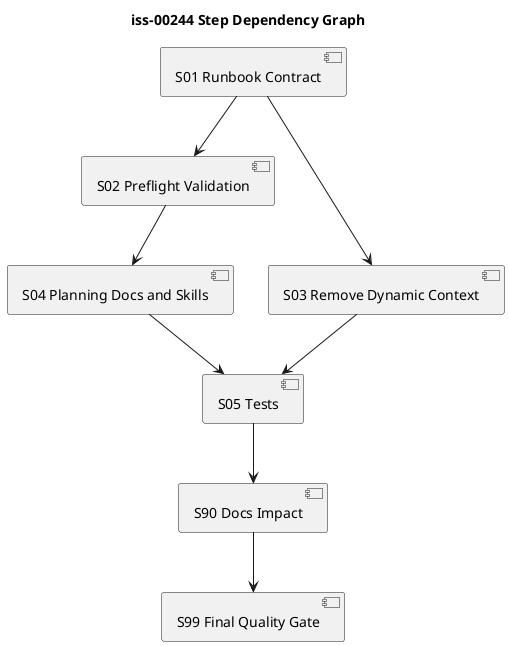

# iss-00244 Simplify Issue Execution Guidance Into Plan Centric Preflight Validation — 実装計画

## Plan Authority

- この `plan.md` は `iss-00244` の planned executable workflow contract である。
- 実装者は `guidance issue-execution` に current step selection を求めず、この plan の step 順に従う。
- `report.md` は observed evidence ledger であり、実行中の Red / Green / Refactor、reviewer verdict、commit/no-op evidence、manual test findings を記録する。
- 旧 dynamic fields を互換維持しない hard cutover を採用する。

## Assurance / Quality Profile Decision

- authorized_profile: `standard`
- lite_candidate: `false`
- issue-level obligation:
  - runtime behavior、CLI output contract、provider assets、skill text、tests、dogfooding validation を含むため Lite にはしない。
  - `standard` だが public CLI / shipped asset contract を変更するため、重要 step では `CodePlusSpec` または `StrictGate` 相当の review obligation を持つ。

## この計画で満たす要件ID

- AC-001: Ready guidance is plan-centric
- AC-002: Dynamic execution fields are removed by hard cutover
- AC-003: Report evidence is not a control plane
- AC-004: Non-executable plan blocks execution
- AC-005: Plan contract captures execution obligations
- AC-006: Planning-time taxonomy prevents under-review
- AC-007: Skill kernels stop registering runtime-selected step
- AC-008: Obsolete dynamic tests are replaced
- AC-009: Issue planning guidance dogfood evidence is recorded
- AC-010: Provider and dogfooding surfaces stay consistent

## 依存関係から導く実装順序

1. 旧 dynamic fields の削除は Runbook domain model が根になるため、まず domain / application の output contract を更新する。
2. Renderer / projection store は domain model に従属するため、Runbook 変更後に更新する。
3. Context packet / context routing 系の削除は import 残存確認を伴うため、default path 削除後に実施する。
4. Docs / skill / compose fragments は new contract を agent-facing に伝えるため、runtime contract 更新後に整合させる。
5. Tests は各 step の Green evidence として並行更新するが、最終的に old dynamic selection tests をすべて置換する。
6. Dogfooding validation と manual test findings は最後に report / discussions へ反映する。

## ステップ一覧

| Step | Pattern | 主担当 | Reviewer focus | 要件 |
|---|---|---|---|---|
| S01 Runbook output contract hard cutover | CodeReview | dev-coder | code-reviewer | AC-001, AC-002 |
| S02 Plan readiness preflight validation | CodePlusSpec | dev-coder | code-reviewer + spec-reviewer | AC-001, AC-004 |
| S03 Dynamic context routing removal | StrictGate | dev-coder | code-reviewer | AC-002, AC-003, AC-008 |
| S04 Planning docs, skill kernels, compose scaffold | SpecOnly | doc-writer | spec-reviewer | AC-005, AC-006, AC-007 |
| S05 Regression tests and dogfooding parity | CodePlusSpec | dev-coder | code-reviewer + qa-reviewer | AC-008, AC-009, AC-010 |
| S90 Docs impact resolution | SpecOnly | doc-writer | spec-reviewer | AC-005, AC-007, AC-010 |
| S99 Final quality gate | StrictGate | orchestrator | qa-reviewer + code-reviewer + spec-reviewer | all |

## 要件 ↔ ステップ対応

| Requirement | S01 | S02 | S03 | S04 | S05 | S90 | S99 |
|---|---:|---:|---:|---:|---:|---:|---:|
| AC-001 | yes | yes | no | yes | yes | no | yes |
| AC-002 | yes | no | yes | no | yes | no | yes |
| AC-003 | no | yes | yes | no | yes | no | yes |
| AC-004 | no | yes | no | yes | yes | no | yes |
| AC-005 | no | yes | no | yes | yes | yes | yes |
| AC-006 | no | yes | no | yes | yes | yes | yes |
| AC-007 | no | no | no | yes | yes | yes | yes |
| AC-008 | yes | yes | yes | no | yes | no | yes |
| AC-009 | no | no | no | no | yes | no | yes |
| AC-010 | yes | yes | yes | yes | yes | yes | yes |

## 仕様固定クロージャ索引（Spec-Locked Closure Index）

| ID | Spec link | Locked expectation | Observable input/state | Bug class guarded | Required | Evidence level | Owner step |
|---|---|---|---|---|---|---|---|
| tc-001 | AC-001 | Ready guidance points to `plan.md` and `report.md` as contract/evidence sources | ready active issue | agent lacks clear execution source | yes | red-required | S01 |
| tc-002 | AC-002 | No `selected_step`, `step_assurance`, `context_packets` in default Markdown/JSON/projection | ready active issue | stale dynamic output remains authority | yes | red-required | S01 |
| tc-003 | AC-003 | `report.md` rows do not change guidance output | misleading report completion rows | report parser remains control plane | yes | red-required | S03 |
| tc-004 | AC-004 | scaffold / non-executable plan blocks execution | placeholder or missing required fields | execution starts from invalid plan | yes | red-required | S02 |
| tc-005 | AC-005 | plan authoring scaffold contains step obligation fields | assurance compose / docs | plan lacks worker/reviewer/verification contract | yes | inspect-only + structural assertion | S04 |
| tc-006 | AC-006 | mixed / risky steps require correct obligation pattern | plan lint fixture | under-review or no-review misuse | yes | red-required | S02 |
| tc-007 | AC-007 | skill text no longer says to register selected step | provider skill assets | agent follows runtime-selected step | yes | structural assertion | S04 |
| tc-008 | AC-008 | old dynamic context routing tests are removed/replaced | CLI test suite | old behavior remains locked | yes | command | S05 |
| tc-009 | AC-009 | planning manual test findings recorded | report/discussion artifacts | dogfooding evidence missing | yes | inspect-only | S05 |
| tc-010 | AC-010 | provider and dogfood validation pass, including guidance `authorized_profile` source consistency | validate/test commands | shipped/runtime drift or stale profile authority | yes | command | S05 |
| tc-011 | AC-001 / AC-004 | ready guidance exposes `may_execute_approved_plan=true`; blocked guidance exposes `false` | ready and blocked active issue fixtures | execution permission remains implicit or ambiguous | yes | red-required | S01 / S02 |
| tc-012 | AC-003 / AC-010 | issue-execution no longer emits `workflow-plan-unselectable` when old structured step heading is absent | executable plan without old `_STEP_HEADING_RE` shape | hidden dynamic step selector remains control plane | yes | red-required | S03 / S05 |
| tc-013 | AC-004 / AC-010 | invalid or stale assurance fails closed without `strict` fallback being reported as current authority | invalid/stale assurance fixture | profile authority drift or false safety signal | yes | red-required | S02 / S05 |
| tc-014 | EC-006 / AC-002 | refreshed runbook projections contain no dynamic sections or fields | current-runbook projection refresh | stale projection reintroduces old mental model | yes | manual-required + structural assertion | S05 / S90 |

## 実装ステップ

### S01 Runbook output contract hard cutover

#### Behavior goal

Default `guidance issue-execution` output no longer exposes dynamic execution fields and instead exposes plan/report contract references.

#### Planned contract

- Scope:
  - `domain/runbook.py`
  - `presentation/workflow.py`
  - `infra/runbook_store.py`
  - `application/contracts.py` if payload types mention removed fields.
- Test obligation:
  - ready guidance Markdown/JSON/projection no longer has dynamic fields.
  - contract source and evidence ledger are present.
- Red / alternative evidence:
  - red-required: existing tests expecting `## Step Assurance` / `selected_step` fail before update.
- Green verification:
  - `uv run pytest tests/cli_runtime/test_workflow.py tests/cli_runtime/test_workflow_context_routing.py`
- Refactor guardrail:
  - Do not change issue lifecycle states unrelated to guidance output.
- Amendment trigger:
  - If removing fields requires a public schema version decision beyond this Issue, stop and record in `report.md`.

#### delegation contract

- delegated role: `dev-coder`
- input docs:
  - `requirement.md`
  - `design.md`
  - this `plan.md`
  - `workflow_issue.md`
- allowed paths:
  - `src/spec_dock/assets/spec_dock/scripts/spec_dock_runtime/domain/runbook.py`
  - `src/spec_dock/assets/spec_dock/scripts/spec_dock_runtime/presentation/workflow.py`
  - `src/spec_dock/assets/spec_dock/scripts/spec_dock_runtime/infra/runbook_store.py`
  - focused tests under `tests/cli_runtime/`
- forbidden changes:
  - PR delivery workflow
  - GitHub review policy
  - unrelated active/deps/sync behavior
- acceptance criteria:
  - tc-001, tc-002
- required tests or docs-only verification:
  - CLI runtime tests.
- reviewer focus:
  - `code-reviewer`
- stop conditions:
  - Removing fields breaks non-guidance commands.
  - Schema references are used outside workflow guidance.
- output required:
  - changed files, test result, removed field evidence, no material decisions beyond plan or Ledger Note.

#### 具体テストケース一覧

- `tc-s01-001` acceptance: ready guidance points to plan/report contract
  - 前提: temp repo に active issue、substantive requirement、valid assurance、executable plan がある。
  - 操作: `guidance issue-execution` と JSON/projection 確認を実行する。
  - 期待結果: output に `contract_source=spec-dock/active/issue/plan.md`、`evidence_ledger=spec-dock/active/issue/report.md`、`may_execute_approved_plan=true` がある。
  - 失敗検出: 実行者が next step source を runtime selected output へ探しに行く回帰を検出する。
  - 検証方法: `tests/cli_runtime/test_workflow.py` に assertion を追加する。
  - 関連 closure id: `tc-001`, `tc-011`

- `tc-s01-002` hard-cutover: dynamic fields are absent
  - 前提: ready active issue がある。
  - 操作: Markdown / JSON / projected runbook を確認する。
  - 期待結果: `selected_step`、`step_assurance`、`context_packets` が存在しない。
  - 失敗検出: 旧 dynamic field が default output に残る回帰を検出する。
  - 検証方法: `tests/cli_runtime/test_workflow.py` または置換後の workflow contract test。
  - 関連 closure id: `tc-002`

#### step closure contract

- close condition: tc-001 と tc-002 の tests が pass し、code-reviewer が Runbook output contract を pass する。
- report evidence destination:
  - TDD / Red / Green / Refactor Evidence
  - Step Contract Closure
  - Reviewer Gate Status
- step gate:
  - code-reviewer pass
  - Step Commit Gate committed

### S02 Plan readiness preflight validation

#### Behavior goal

`guidance issue-execution` blocks non-executable plans and never silently assumes execution obligations.

#### Planned contract

- Scope:
  - `application/workflow.py`
  - domain helper for plan readiness if needed
  - `presentation/workflow.py`
  - tests
- Test obligation:
  - placeholder / non-executable / missing required fields blocks.
  - valid plan returns execute-approved-plan.
  - invalid / stale assurance blocks without presenting `strict` fallback as current authority.
- Red / alternative evidence:
  - red-required for invalid plan fixtures.
  - red-required for invalid / stale assurance authority fixture.
- Green verification:
  - focused CLI runtime tests.
  - focused assurance authority consistency test.
- Refactor guardrail:
  - Keep lint coarse and deterministic; do not build a full Markdown parser beyond required fields.
- Amendment trigger:
  - If plan lint becomes too broad, split to follow-up.

#### delegation contract

- delegated role: `dev-coder`
- input docs: requirement/design/plan, `authoring/issue-plan.md`
- allowed paths:
  - `src/spec_dock/assets/spec_dock/scripts/spec_dock_runtime/application/workflow.py`
  - possible new helper under `domain/`
  - tests under `tests/cli_runtime/`
- forbidden changes:
  - report completion parsing for next step
  - runtime worker/reviewer inference
- acceptance criteria:
  - tc-004, tc-006
- required tests or docs-only verification:
  - CLI runtime invalid-plan tests.
- reviewer focus:
  - `code-reviewer` and `spec-reviewer`
- stop conditions:
  - Lint requirements conflict with `authoring/issue-plan.md`.
  - Valid existing executable plan cannot be represented.
- output required:
  - lint rule list, test result, any plan schema ambiguity as Ledger Note.

#### 具体テストケース一覧

- `tc-s02-001` negative: placeholder plan blocks execution
  - 前提: substantive requirement と assurance はあるが `plan.md` は placeholder。
  - 操作: `guidance issue-execution` を実行する。
  - 期待結果: `planning-required` / blocked reason になり、execution-ready にならない。
  - 失敗検出: placeholder plan でも実装へ進む回帰を検出する。
  - 検証方法: CLI runtime test。
  - 関連 closure id: `tc-004`

- `tc-s02-002` negative: no-review with canonical mutation fails lint
  - 前提: plan step が canonical docs mutation を含むのに inspect-only/no-review としている。
  - 操作: plan readiness check を実行する。
  - 期待結果: planning-required になり、reviewer obligation を明示するよう促す。
  - 失敗検出: docs / skill change が no-review で通る回帰を検出する。
  - 検証方法: plan lint fixture test。
  - 関連 closure id: `tc-006`

- `tc-s02-003` negative: invalid assurance fails closed without false authority
  - 前提: assurance contract が invalid / stale の active issue fixture。
  - 操作: `guidance issue-execution --format json` を実行する。
  - 期待結果: `may_execute_approved_plan=false`、blocking reason は assurance invalid / stale を示し、`authorized_profile=strict` を current authority として表示しない。
  - 失敗検出: stale profile authority / strict fallback が current authority として見える回帰を検出する。
  - 検証方法: `tests/cli_runtime/test_workflow.py` または assurance preflight test。
  - 関連 closure id: `tc-013`

#### step closure contract

- close condition: invalid-plan tests and valid-plan tests pass.
- report evidence destination:
  - TDD / Red / Green / Refactor Evidence
  - Test Contract Closure
  - Reviewer Gate Status
- step gate:
  - code-reviewer + spec-reviewer pass
  - Step Commit Gate committed

### S03 Dynamic context routing removal

#### Behavior goal

Default issue-execution no longer depends on context packet generation, context routing policy, report parser, or task-kind inference.

#### Planned contract

- Scope:
  - `application/workflow.py`
  - `application/context_packets.py`
  - `domain/context_routing.py`
  - `infra/context_packet_store.py`
  - `infra/context_policy_store.py`
  - `cli/bootstrap.py`
  - context routing policy assets and tests
- Test obligation:
  - report rows do not affect guidance.
  - invalid/missing context policy does not affect default ready guidance.
  - no stale context packet write is attempted.
- Red / alternative evidence:
  - red-required using current tests that assert dynamic routing.
- Green verification:
  - CLI runtime and installer/scaffold tests as needed.
- Refactor guardrail:
  - Delete only after `rg` confirms no remaining required imports.
- Amendment trigger:
  - If any context routing module is still used outside guidance, document retained surface and narrow deletion.

#### delegation contract

- delegated role: `dev-coder`
- input docs:
  - design deletion plan
  - existing tests
- allowed paths:
  - runtime context modules and tests listed above.
- forbidden changes:
  - introducing new context packet command in this Issue.
  - preserving deprecated fields for compatibility.
- acceptance criteria:
  - tc-003, tc-008
- required tests or docs-only verification:
  - `rg` no dynamic fields in output path.
  - focused pytest.
- reviewer focus:
  - `code-reviewer`
- stop conditions:
  - deletion affects unrelated installed assets or package import.
- output required:
  - removed files / retained files rationale, tests, no material decision or Ledger Note.

#### 具体テストケース一覧

- `tc-s03-001` regression: report completion rows are ignored
  - 前提: report has misleading S01/S99 completion rows.
  - 操作: `guidance issue-execution` を実行する。
  - 期待結果: output は same preflight contract を返し、next step を算出しない。
  - 失敗検出: report parser が control plane として残る回帰を検出する。
  - 検証方法: old `test_guidance_does_not_skip...` 系を置換する。
  - 関連 closure id: `tc-003`

- `tc-s03-002` hard-cutover: context routing tests are replaced
  - 前提: old tests assert worker / context mode / reviewers from runtime inference.
  - 操作: test suite を確認する。
  - 期待結果: old dynamic assertion は存在せず、plan-centric preflight assertions に置換されている。
  - 失敗検出: old behavior が tests で固定され続ける回帰を検出する。
  - 検証方法: `rg "selected_step|step_assurance|context_packets" tests/cli_runtime` と pytest。
  - 関連 closure id: `tc-008`

- `tc-s03-003` hard-cutover: old structured heading is not required
  - 前提: approved executable `plan.md` があるが、旧 `_STEP_HEADING_RE` に一致する heading はない。
  - 操作: `guidance issue-execution --format json` を実行する。
  - 期待結果: `workflow-plan-unselectable` を返さず、plan-centric preflight result を返す。
  - 失敗検出: hidden dynamic step selector が残る回帰を検出する。
  - 検証方法: CLI runtime fixture test。
  - 関連 closure id: `tc-012`

#### step closure contract

- close condition: no default output path references dynamic context; old tests replaced.
- report evidence destination:
  - Closure Delta
  - Test Contract Closure
  - Reviewer Gate Status
- step gate:
  - code-reviewer pass
  - Step Commit Gate committed

### S04 Planning docs, skill kernels, compose scaffold

#### Behavior goal

Issue planning authoring surface teaches agents to put obligation decisions into `plan.md`, not runtime guidance.

#### Planned contract

- Scope:
  - `src/spec_dock/assets/install_root/.agents/skills/spec-dock-issue-planning/SKILL.md`
  - `src/spec_dock/assets/install_root/.agents/skills/spec-dock-issue-execution/SKILL.md`
  - `src/spec_dock/assets/spec_dock/docs/phase_plan_issue.md`
  - `src/spec_dock/assets/spec_dock/docs/authoring/issue-plan.md`
  - `src/spec_dock/assets/spec_dock/templates/assurance/profile-sections.json`
  - dogfooding mirror if generated / validation requires.
- Test obligation:
  - skill text has no `selected step when present`.
  - compose scaffold contains required planning-time obligation fields.
- Red / alternative evidence:
  - structural assertion or grep inspection.
- Green verification:
  - asset text tests and compose tests.
- Refactor guardrail:
  - Do not copy full workflow into skill kernels.
- Amendment trigger:
  - If docs require a broader planning workflow redesign, create follow-up.

#### delegation contract

- delegated role: `doc-writer`
- input docs:
  - requirement/design/plan
  - existing docs
- allowed paths:
  - provider docs/templates/skills listed above.
- forbidden changes:
  - implementation code
  - GitHub PR observation skill
  - unrelated templates.
- acceptance criteria:
  - tc-005, tc-007
- required tests or docs-only verification:
  - structural text assertions.
  - `assurance compose` tests.
- reviewer focus:
  - `spec-reviewer`
- stop conditions:
  - docs contradict workflow_issue lifecycle policy.
- output required:
  - docs changed, rationale, verification, no material decision or Ledger Note.

#### 具体テストケース一覧

- `tc-s04-001` structural: skill no longer registers selected step
  - 前提: provider skill files exist.
  - 操作: skill text を grep / assertion する。
  - 期待結果: selected step を task checklist authority として登録する文がない。
  - 失敗検出: agent が runtime-selected step を再び使う instruction 回帰を検出する。
  - 検証方法: provider asset text test。
  - 関連 closure id: `tc-007`

- `tc-s04-002` scaffold: compose adds obligation planning guidance
  - 前提: classified standard issue.
  - 操作: `assurance compose --artifact plan` を実行する。
  - 期待結果: plan scaffold に step obligation pattern / worker / reviewer / verification / evidence destination の作成指示がある。
  - 失敗検出: compose が薄い `List step closure ids...` だけに戻る回帰を検出する。
  - 検証方法: `tests/cli_runtime/test_assurance_compose.py`。
  - 関連 closure id: `tc-005`

#### step closure contract

- close condition: skills/docs/templates align with plan-centric authority and spec-reviewer passes.
- report evidence destination:
  - Docs Impact Resolution
  - Reviewer Gate Status
  - Closure Coverage
- step gate:
  - spec-reviewer pass
  - Step Commit Gate committed

### S05 Regression tests and dogfooding parity

#### Behavior goal

The new guidance contract is locked by tests and validated in the dogfooding workspace.

#### Planned contract

- Scope:
  - `tests/cli_runtime/test_workflow.py`
  - `tests/cli_runtime/test_workflow_context_routing.py`
  - `tests/cli_runtime/test_assurance_compose.py`
  - provider / dogfood parity inspection.
- Test obligation:
  - focused CLI tests pass.
  - `validate` passes.
  - manual planning findings are recorded.
  - `guidance` profile authority matches the current `assurance classify` source binding.
  - refreshed `current-runbook.*` projections do not contain dynamic sections.
- Red / alternative evidence:
  - existing failing old dynamic tests before replacement.
- Green verification:
  - `uv run pytest tests/cli_runtime/test_workflow.py tests/cli_runtime/test_workflow_context_routing.py tests/cli_runtime/test_assurance_compose.py`
  - `./spec-dock/scripts/spec-dock validate`
- Refactor guardrail:
  - Do not broaden to full test suite unless focused tests pass.
- Amendment trigger:
  - Provider/dogfood drift not explainable by current issue requires follow-up or scope amendment.

#### delegation contract

- delegated role: `dev-coder`
- input docs:
  - all issue docs
  - manual test research
- allowed paths:
  - tests listed above
  - report evidence updates
- forbidden changes:
  - unrelated test cleanup
- acceptance criteria:
  - tc-008, tc-009, tc-010, tc-012, tc-013, tc-014
- required tests or docs-only verification:
  - focused pytest and validate.
- reviewer focus:
  - `code-reviewer` and `qa-reviewer`
- stop conditions:
  - failing tests caused by implementation change remain unresolved.
- output required:
  - test commands, results, manual findings, parity status.

#### 具体テストケース一覧

- `tc-s05-001` regression lane: focused tests pass
  - 前提: S01-S04 changes are implemented.
  - 操作: focused pytest lane を実行する。
  - 期待結果: workflow / compose tests pass and old dynamic tests are gone or rewritten.
  - 失敗検出: hard cutover contract not fully implemented.
  - 検証方法: `uv run pytest tests/cli_runtime/test_workflow.py tests/cli_runtime/test_workflow_context_routing.py tests/cli_runtime/test_assurance_compose.py`
  - 関連 closure id: `tc-008`, `tc-010`

- `tc-s05-002` dogfood: planning manual evidence recorded
  - 前提: this issue planning was performed.
  - 操作: `report.md` and discussion artifacts are inspected.
  - 期待結果: guidance / classify / compose / validate observations and draft/scaffold reason_code finding are recorded.
  - 失敗検出: dogfooding findings are lost from the issue evidence.
  - 検証方法: docs inspection.
  - 関連 closure id: `tc-009`

- `tc-s05-003` dogfood: projection refresh does not reintroduce dynamic guidance
  - 前提: guidance command が projection を更新する。
  - 操作: `current-runbook.md` / `current-runbook.json` を確認する。
  - 期待結果: `Step Assurance`、`Context Packets`、`selected_step`、`step_assurance`、`context_packets` が存在しない。
  - 失敗検出: human/debug projection が旧 mental model を再導入する回帰を検出する。
  - 検証方法: structural assertion または manual grep。
  - 関連 closure id: `tc-014`

#### step closure contract

- close condition: focused tests and validate pass; manual test evidence recorded.
- report evidence destination:
  - Test Contract Closure
  - Closure Coverage
  - Manual test notes in Spec Authoring Gate / session log
- step gate:
  - qa-reviewer + code-reviewer pass
  - Step Commit Gate committed

### S90 Docs impact resolution

#### Behavior goal

All docs/templates/skills affected by the hard cutover are consistent and no obsolete dynamic guidance remains.

#### Planned contract

- Scope:
  - provider docs/templates/skills
  - dogfooding docs if applicable
  - Epic requirement/design/report reflection if needed
- Test obligation:
  - grep inspection for obsolete authority terms.
  - spec-reviewer docs/spec alignment.
- Red / alternative evidence:
  - inspect-only.
- Green verification:
  - `rg "selected step when present|selected_step|step_assurance|context_packets" src/spec_dock/assets/install_root/.agents/skills src/spec_dock/assets/spec_dock/docs src/spec_dock/assets/spec_dock/templates`
- Refactor guardrail:
  - Do not remove historical discussion evidence.
- Amendment trigger:
  - Epic canonical docs still claim dynamic step assurance as accepted default; update or record follow-up.

#### delegation contract

- delegated role: `doc-writer`
- input docs: requirement/design/plan and changed files.
- allowed paths: docs/templates/skills/Epic reflection if needed.
- forbidden changes: runtime code/tests.
- acceptance criteria: AC-005, AC-007, AC-010.
- required tests or docs-only verification: grep and spec-review.
- reviewer focus: `spec-reviewer`
- stop conditions: docs contradict implemented output.
- output required: changed docs, inspection result, unresolved risks.

#### 具体テストケース一覧

- `tc-s90-001` docs alignment: obsolete dynamic guidance removed
  - 前提: implementation and docs changes complete.
  - 操作: provider docs/templates/skills を inspection する。
  - 期待結果: default authority として dynamic selected step を促す記述がない。
  - 失敗検出: agent-facing docs が旧 behavior を復活させる回帰を検出する。
  - 検証方法: grep + spec-reviewer。
  - 関連 closure id: `tc-005`, `tc-007`

#### step closure contract

- close condition: docs impact table completed and spec-reviewer passes.
- report evidence destination:
  - Final Quality Gate / Docs Impact Resolution
- step gate:
  - spec-reviewer pass
  - Step Commit Gate committed or approved-no-op

### S99 Final quality gate

#### Behavior goal

The whole issue satisfies requirement/design/plan/report alignment, tests, docs, and hard cutover expectations.

#### Planned contract

- Scope:
  - whole issue diff.
- Test obligation:
  - focused tests pass.
  - validate passes.
  - final QA / code / spec review pass.
- Red / alternative evidence:
  - final integrated inspection.
- Green verification:
  - `./spec-dock/scripts/spec-dock validate`
  - focused pytest lane.
- Refactor guardrail:
  - No new implementation changes after final review except bounded fixes with re-review.
- Amendment trigger:
  - Any final reviewer fail requires bounded fix and re-review.

#### delegation contract

- delegated role: `qa-reviewer`, `code-reviewer`, `spec-reviewer`
- input docs: all issue docs, diff, test outputs.
- allowed paths: read-only review; no mutations.
- forbidden changes: any file edits by reviewers.
- acceptance criteria: all ACs.
- required tests or docs-only verification: final gate review.
- reviewer focus:
  - qa-reviewer: test sufficiency.
  - code-reviewer: integrated runtime diff.
  - spec-reviewer: requirement/design/plan/report/docs alignment.
- stop conditions:
  - any reviewer `fail`.
- output required:
  - review_status, prioritized findings, residual risk.

#### 具体テストケース一覧

- `tc-s99-001` final gate: all closure ids pass
  - 前提: S01-S90 are closed.
  - 操作: final validation, QA review, code review, spec review を実行する。
  - 期待結果: required closure ids are pass / committed / approved-no-op and no open decision remains.
  - 失敗検出: issue claims completion with missing closure or stale docs.
  - 検証方法: report inspection + reviewer gates.
  - 関連 closure id: `tc-001` - `tc-010`

#### step closure contract

- close condition: final QA/code/spec reviews pass, final report ledger is ready, final commit scope is clear.
- report evidence destination:
  - Final QA Gate
  - Final Code Review Gate
  - Final Spec Review Gate
  - Final Commit
- step gate:
  - final reviewers pass
  - final commit

## Final Exit Contract

この Issue を execution-ready / complete とみなす条件:

- `requirement.md` / `design.md` / `plan.md` が substantive で reviewer-pass 済み。
- `assurance.json` が current source binding と整合する。
- All closure ids `tc-001` - `tc-014` が report で pass / approved-no-op として閉じている。
- Focused pytest lane と `./spec-dock/scripts/spec-dock validate` が pass。
- S90 docs impact resolved。
- S99 final QA / code / spec review が pass。
- Step Commit Gate が各 implementation step で committed または正当な approved-no-op。
- No open Spec Interpretation / Decision Ledger entries remain.
