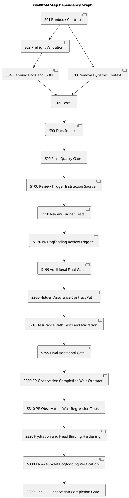

# iss-00244 Simplify Issue Execution Guidance Into Plan Centric Preflight Validation — 実装計画

## Plan Authority

- この `plan.md` は `iss-00244` の planned executable workflow contract である。
- 実装者は `guidance issue-execution` に current step selection を求めず、この plan の step 順に従う。
- `report.md` は observed evidence ledger であり、実行中の Red / Green / Refactor、reviewer verdict、commit/no-op evidence、manual test findings を記録する。
- 旧 dynamic fields を互換維持しない hard cutover を採用する。

## Assurance / Quality Profile Decision

- authorized_profile: `standard`
- lite_candidate: `false`
- issue-level obligation:
  - runtime behavior、CLI output contract、provider assets、skill text、tests、dogfooding validation を含むため Lite にはしない。
  - `standard` だが public CLI / shipped asset contract を変更するため、重要 step では `CodePlusSpec` または `StrictGate` 相当の review obligation を持つ。

## この計画で満たす要件ID

- AC-001: Ready guidance is plan-centric
- AC-002: Dynamic execution fields are removed by hard cutover
- AC-003: Report evidence is not a control plane
- AC-004: Non-executable plan blocks execution
- AC-005: Plan contract captures execution obligations
- AC-006: Planning-time taxonomy prevents under-review
- AC-007: Skill kernels stop registering runtime-selected step
- AC-008: Obsolete dynamic tests are replaced
- AC-009: Issue planning guidance dogfood evidence is recorded
- AC-010: Provider and dogfooding surfaces stay consistent
- AC-011: Review trigger uses script-local instruction
- AC-012: Review trigger does not fetch GitHub review policy
- AC-013: Missing script-local instruction falls back to plain review
- AC-014: Invalid script-local instruction fails closed
- AC-015: GitHub/Codex repository policy asset is removed
- AC-016: Assurance contract canonical path is hidden-style
- AC-017: Legacy assurance.json is migration-required, not silent authority
- AC-018: Dogfooding assurance artifacts are renamed
- AC-019: Current docs and CLI help use .assurance.json
- AC-020: Review completion is explicit artifact based
- AC-021: Missing review completion times out retryably
- AC-022: Hydration only follows explicit completion
- AC-023: PR #245 delayed review regression is covered

## 依存関係から導く実装順序

1. 旧 dynamic fields の削除は Runbook domain model が根になるため、まず domain / application の output contract を更新する。
2. Renderer / projection store は domain model に従属するため、Runbook 変更後に更新する。
3. Context packet / context routing 系の削除は import 残存確認を伴うため、default path 削除後に実施する。
4. Docs / skill / compose fragments は new contract を agent-facing に伝えるため、runtime contract 更新後に整合させる。
5. Tests は各 step の Green evidence として並行更新するが、最終的に old dynamic selection tests をすべて置換する。
6. Dogfooding validation と manual test findings は最後に report / discussions へ反映する。
7. PR #245 dogfooding で発見した review trigger failure は、既存 S01-S99 の実施済み plan-centric work を残したまま、追加作業 S100-S199 として末尾で修正する。
8. `assurance.json` の `.assurance.json` rename は review trigger repair と独立しているが、同じ Issue の追加 hard cutover として S200-S299 で末尾に追加する。
9. PR #245 dogfooding で発見した review observation early-stop failure は、review trigger instruction source や assurance path repair とは別の PR observation wait contract defect として、既存 S01-S299 の実施済み work を残したまま追加作業 S300-S399 として末尾で修正する。

## ステップ一覧

| Step | Pattern | 主担当 | Reviewer focus | 要件 |
|---|---|---|---|---|
| S01 Runbook output contract hard cutover | CodeReview | dev-coder | code-reviewer | AC-001, AC-002 |
| S02 Plan readiness preflight validation | CodePlusSpec | dev-coder | code-reviewer + spec-reviewer | AC-001, AC-004 |
| S03 Dynamic context routing removal | StrictGate | dev-coder | code-reviewer | AC-002, AC-003, AC-008 |
| S04 Planning docs, skill kernels, compose scaffold | SpecOnly | doc-writer | spec-reviewer | AC-005, AC-006, AC-007 |
| S05 Regression tests and dogfooding parity | CodePlusSpec | dev-coder | code-reviewer + qa-reviewer | AC-008, AC-009, AC-010 |
| S90 Docs impact resolution | SpecOnly | doc-writer | spec-reviewer | AC-005, AC-007, AC-010 |
| S99 Final quality gate | StrictGate | orchestrator | qa-reviewer + code-reviewer + spec-reviewer | all |
| S100 Script-local review instruction source | StrictGate | dev-coder | code-reviewer + spec-reviewer | AC-011, AC-012, AC-013, AC-014, AC-015 |
| S110 Review trigger regression tests and asset parity | CodePlusSpec | dev-coder | code-reviewer + qa-reviewer | AC-011, AC-012, AC-013, AC-014, AC-015 |
| S120 PR #245 dogfooding review trigger verification | StrictGate | orchestrator | qa-reviewer | AC-011, AC-013 |
| S199 Additional final quality gate | StrictGate | orchestrator | qa-reviewer + code-reviewer + spec-reviewer | AC-011, AC-012, AC-013, AC-014, AC-015 |
| S200 Hidden assurance contract path hard cutover | StrictGate | dev-coder | code-reviewer + spec-reviewer | AC-016, AC-017, AC-018, AC-019 |
| S210 Assurance path regression tests and dogfooding rename | CodePlusSpec | dev-coder | code-reviewer + qa-reviewer | AC-016, AC-017, AC-018, AC-019 |
| S299 Final additional quality gate | StrictGate | orchestrator | qa-reviewer + code-reviewer + spec-reviewer | AC-016, AC-017, AC-018, AC-019 |
| S300 PR observation completion wait contract update | CodePlusSpec | dev-coder | code-reviewer + spec-reviewer | AC-020, AC-021, AC-022 |
| S310 PR observation wait regression tests | CodeReview | dev-coder | code-reviewer + qa-reviewer | AC-020, AC-021, AC-023 |
| S320 Hydration and head-binding hardening | StrictGate | dev-coder | code-reviewer + qa-reviewer | AC-020, AC-022, AC-023 |
| S330 PR #245 wait dogfooding verification | StrictGate | orchestrator | qa-reviewer | AC-021, AC-023 |
| S399 Final PR observation completion gate | StrictGate | orchestrator | qa-reviewer + code-reviewer + spec-reviewer | AC-020, AC-021, AC-022, AC-023 |

## 要件 ↔ ステップ対応

| Requirement | S01 | S02 | S03 | S04 | S05 | S90 | S99 |
|---|---:|---:|---:|---:|---:|---:|---:|
| AC-001 | yes | yes | no | yes | yes | no | yes |
| AC-002 | yes | no | yes | no | yes | no | yes |
| AC-003 | no | yes | yes | no | yes | no | yes |
| AC-004 | no | yes | no | yes | yes | no | yes |
| AC-005 | no | yes | no | yes | yes | yes | yes |
| AC-006 | no | yes | no | yes | yes | yes | yes |
| AC-007 | no | no | no | yes | yes | yes | yes |
| AC-008 | yes | yes | yes | no | yes | no | yes |
| AC-009 | no | no | no | no | yes | no | yes |
| AC-010 | yes | yes | yes | yes | yes | yes | yes |
| AC-011 | no | no | no | no | no | no | no |
| AC-012 | no | no | no | no | no | no | no |
| AC-013 | no | no | no | no | no | no | no |
| AC-014 | no | no | no | no | no | no | no |
| AC-015 | no | no | no | no | no | no | no |
| AC-016 | no | no | no | no | no | no | no |
| AC-017 | no | no | no | no | no | no | no |
| AC-018 | no | no | no | no | no | no | no |
| AC-019 | no | no | no | no | no | no | no |

追加作業の要件対応:

| Requirement | S100 | S110 | S120 | S199 |
|---|---:|---:|---:|---:|
| AC-011 | yes | yes | yes | yes |
| AC-012 | yes | yes | no | yes |
| AC-013 | yes | yes | yes | yes |
| AC-014 | yes | yes | no | yes |
| AC-015 | yes | yes | no | yes |

Assurance contract rename の要件対応:

| Requirement | S200 | S210 | S299 |
|---|---:|---:|---:|
| AC-016 | yes | yes | yes |
| AC-017 | yes | yes | yes |
| AC-018 | no | yes | yes |
| AC-019 | yes | yes | yes |

AC-018 is owned by S210 because dogfooding artifact rename evidence is distinct from S200 runtime path hard cutover.

PR observation completion wait の要件対応:

| Requirement | S300 | S310 | S320 | S330 | S399 |
|---|---:|---:|---:|---:|---:|
| AC-020 | yes | yes | yes | no | yes |
| AC-021 | yes | yes | no | yes | yes |
| AC-022 | yes | yes | yes | no | yes |
| AC-023 | no | yes | yes | yes | yes |

## 仕様固定クロージャ索引（Spec-Locked Closure Index）

| ID | Spec link | Locked expectation | Observable input/state | Bug class guarded | Required | Evidence level | Owner step |
|---|---|---|---|---|---|---|---|
| tc-001 | AC-001 | Ready guidance points to `plan.md` and `report.md` as contract/evidence sources | ready active issue | agent lacks clear execution source | yes | red-required | S01 |
| tc-002 | AC-002 | No `selected_step`, `step_assurance`, `context_packets` in default Markdown/JSON/projection | ready active issue | stale dynamic output remains authority | yes | red-required | S01 |
| tc-003 | AC-003 | `report.md` rows do not change guidance output | misleading report completion rows | report parser remains control plane | yes | red-required | S03 |
| tc-004 | AC-004 | scaffold / non-executable plan blocks execution | scaffold stub or missing required fields | execution starts from invalid plan | yes | red-required | S02 |
| tc-005 | AC-005 | plan authoring scaffold contains step obligation fields | assurance compose / docs | plan lacks worker/reviewer/verification contract | yes | inspect-only + structural assertion | S04 |
| tc-006 | AC-006 | mixed / risky steps require correct obligation pattern | plan lint fixture | under-review or no-review misuse | yes | red-required | S02 |
| tc-007 | AC-007 | skill text no longer says to register selected step | provider skill assets | agent follows runtime-selected step | yes | structural assertion | S04 |
| tc-008 | AC-008 | old dynamic context routing tests are removed/replaced | CLI test suite | old behavior remains locked | yes | command | S05 |
| tc-009 | AC-009 | planning manual test findings recorded | report/discussion artifacts | dogfooding evidence missing | yes | inspect-only | S05 |
| tc-010 | AC-010 | provider and dogfood validation pass, including guidance `authorized_profile` source consistency | validate/test commands | shipped/runtime drift or stale profile authority | yes | command | S05 |
| tc-011 | AC-001 / AC-004 | ready guidance exposes `may_execute_approved_plan=true`; blocked guidance exposes `false` | ready and blocked active issue fixtures | execution permission remains implicit or ambiguous | yes | red-required | S01 / S02 |
| tc-012 | AC-003 / AC-010 | issue-execution no longer emits `workflow-plan-unselectable` when old structured step heading is absent | executable plan without old `_STEP_HEADING_RE` shape | hidden dynamic step selector remains control plane | yes | red-required | S03 / S05 |
| tc-013 | AC-004 / AC-010 | invalid or stale assurance fails closed without `strict` fallback being reported as current authority | invalid/stale assurance fixture | profile authority drift or false safety signal | yes | red-required | S02 / S05 |
| tc-014 | EC-006 / AC-002 | refreshed runbook projections contain no dynamic sections or fields | current-runbook projection refresh | stale projection reintroduces old mental model | yes | manual-required + structural assertion | S05 / S90 |
| tc-015 | AC-011 | valid script-local instruction is included in deterministic `@codex review` comment | script-local `codex-review-instructions.md` present and valid | review trigger ignores current local instruction | yes | red-required | S100 / S110 |
| tc-016 | AC-012 | trigger helper does not fetch `.github/codex/review-policy.md` from GitHub contents API | fake `gh` log with PR metadata | old base-SHA policy fetch remains | yes | red-required | S100 / S110 |
| tc-017 | AC-013 | missing script-local instruction posts plain deterministic fallback comment | instruction file absent | no-review dead-end on missing instruction | yes | red-required | S100 / S110 |
| tc-018 | AC-014 | invalid / oversized / unreadable script-local instruction returns human gate without posting | invalid instruction fixtures | broken instruction silently degrades review quality | yes | red-required | S100 / S110 |
| tc-019 | AC-015 | `.github/codex/review-policy.md` provider and dogfooding assets are removed | provider/dogfood file list | GitHub policy file remains ambiguous authority | yes | structural assertion | S100 / S110 |
| tc-020 | AC-011 / AC-013 | PR #245 can receive a Codex review trigger comment through `wait_pr_observation.sh --trigger-mode post-once` | live PR #245 at current head SHA | dogfooding review trigger still blocked | yes | manual-required | S120 |
| tc-021 | AC-011-AC-015 | skill text and ADR use script-local instruction terminology, not trusted base-SHA policy | docs/skill inspection | agent follows obsolete base policy authority | yes | spec-review-required | S100 / S199 |
| tc-022 | AC-016 | `assurance classify` writes `.assurance.json` and does not write `assurance.json` | active issue fixture | metadata contract remains visible as primary artifact | yes | red-required | S200 / S210 |
| tc-023 | AC-016 | `assurance show` / `assurance verify` read `.assurance.json` | valid hidden contract fixture | show/verify still read old path | yes | red-required | S200 / S210 |
| tc-024 | AC-017 | legacy `assurance.json` without `.assurance.json` returns migration diagnostics | legacy-only fixture | old path silently remains authority | yes | red-required | S200 / S210 |
| tc-025 | AC-018 | dogfooding Issue-local assurance artifacts are renamed to `.assurance.json` | epic dogfooding workspace | stale `assurance.json` remains in current workspace | yes | structural assertion | S210 |
| tc-026 | AC-019 | CLI help and current docs refer to `.assurance.json` | provider/dogfood docs and parser/help text | agent/user follows obsolete file name | yes | structural assertion + spec-review | S200 / S299 |
| tc-027 | AC-016 / AC-017 | symlink/outside-issue guard applies to `.assurance.json` | symlink hidden contract fixture | hidden path weakens path safety | yes | red-required | S200 / S210 |
| tc-028 | AC-020 / AC-021 | stable no-completion evidence never becomes active `review_completion_unknown` | CI passed, completion none, selected comments 0, stable fingerprint | delayed Codex review is missed | yes | red-required | S300 / S310 |
| tc-029 | AC-021 | no completion by overall deadline returns `timeout` / `wait_or_resume` / `observation_complete=false` | current trigger/head with no Codex completion artifact | timeout is misreported as human review completion | yes | red-required | S300 / S310 |
| tc-030 | AC-023 | delayed submitted PR review after stable no-completion is selected before terminal result | PR #245-style fake snapshot sequence | wait exits before delayed P1 findings | yes | red-required | S310 |
| tc-031 | AC-020 / AC-022 | quiet/same fingerprint can complete only after explicit Codex completion artifact visibility | submitted review or no-findings artifact hydration sequence | stability is used as completion substitute | yes | red-required | S300 / S320 |
| tc-032 | AC-020 | strict no-findings comment promotes only with current trigger/head binding and integrated gates | no-findings fixtures with matching/wrong head and blockers | wrong no-findings pass / stale pass | yes | red-required | S320 |
| tc-033 | AC-020 / AC-023 | wrong trigger/head or old artifact is not selected as current completion | old trigger, wrong head, body prefix mismatch | stale artifact closes current wait | yes | red-required | S320 |
| tc-034 | AC-020 / AC-021 | skill text no longer presents `review_completion_unknown` as active terminal human gate | provider and dogfooding skill assets | agent follows obsolete post-unknown audit workflow | yes | structural assertion + spec-review | S300 / S399 |
| tc-035 | AC-021 / AC-023 | PR #245 resume/manual validation returns submitted-review human gate or documented limitation, not active unknown | live PR #245 or saved/fake equivalent | dogfooding gap remains unverified | yes | manual-required | S330 / S399 |
| tc-036 | AC-024 | pull request review body P1 blocks even when inline comments and threads are empty | selected submitted Codex review body with `[P1]` and no selected comments/threads | review body finding is ignored and PR is marked pass/merge-prepared | yes | red-required | S320 / S399 |
| tc-037 | AC-004 / AC-010 | substantive approved design may mention historical draft status, templates, or non-placeholder in body without being blocked | approved `design.md` with body text containing `状態: "draft"`, `docs/templates`, and `non-placeholder` | preflight scaffold marker scans body prose and blocks execution-ready issue | yes | red-required | S02 / S399 |
| tc-038 | AC-004 / AC-010 | executable approved plan may mention TODO/TBD in body without being blocked | approved executable `plan.md` whose step text contains TODO/TBD as user data | preflight scaffold marker scans body prose and blocks executable plan | yes | red-required | S02 / S399 |
| tc-039 | AC-004 / AC-010 | strict-legacy guidance blocks symlinked `design.md` / `plan.md` | `.assurance.json` missing and planning artifact symlink points outside issue | fallback path follows symlink and returns execution-ready | yes | red-required | S02 / S399 |
| tc-040 | AC-016 / AC-017 | hidden assurance contract path must be regular file and unreadable/non-file paths return structured invalid result | `.assurance.json` is a directory | public validation/guidance exits through unstructured exception | yes | red-required | S200 / S399 |
| tc-041 | AC-016 / AC-019 | compose preflights all changed artifact writes before mutating any artifact | multi-artifact compose where later changed artifact is unwritable | compose partially mutates earlier artifact then fails before source binding update | yes | red-required | S210 / S399 |

## 実装ステップ

### S01 Runbook output contract hard cutover

#### Behavior goal

Default `guidance issue-execution` output no longer exposes dynamic execution fields and instead exposes plan/report contract references.

#### Planned contract

- Scope:
  - `domain/runbook.py`
  - `presentation/workflow.py`
  - `infra/runbook_store.py`
  - `application/contracts.py` if payload types mention removed fields.
- Test obligation:
  - ready guidance Markdown/JSON/projection no longer has dynamic fields.
  - contract source and evidence ledger are present.
- Red / alternative evidence:
  - red-required: existing tests expecting `## Step Assurance` / `selected_step` fail before update.
- Green verification:
  - `uv run pytest tests/cli_runtime/test_workflow.py tests/cli_runtime/test_workflow_context_routing.py`
- Refactor guardrail:
  - Do not change issue lifecycle states unrelated to guidance output.
- Amendment trigger:
  - If removing fields requires a public schema version decision beyond this Issue, stop and record in `report.md`.

#### delegation contract

- delegated role: `dev-coder`
- input docs:
  - `requirement.md`
  - `design.md`
  - this `plan.md`
  - `workflow_issue.md`
- allowed paths:
  - `src/spec_dock/assets/spec_dock/scripts/spec_dock_runtime/domain/runbook.py`
  - `src/spec_dock/assets/spec_dock/scripts/spec_dock_runtime/presentation/workflow.py`
  - `src/spec_dock/assets/spec_dock/scripts/spec_dock_runtime/infra/runbook_store.py`
  - focused tests under `tests/cli_runtime/`
- forbidden changes:
  - PR delivery workflow
  - GitHub review policy
  - unrelated active/deps/sync behavior
- acceptance criteria:
  - tc-001, tc-002
- required tests or docs-only verification:
  - CLI runtime tests.
- reviewer focus:
  - `code-reviewer`
- stop conditions:
  - Removing fields breaks non-guidance commands.
  - Schema references are used outside workflow guidance.
- output required:
  - changed files, test result, removed field evidence, no material decisions beyond plan or Ledger Note.

#### 具体テストケース一覧

- `tc-s01-001` acceptance: ready guidance points to plan/report contract
  - 前提: temp repo に active issue、substantive requirement、valid assurance、executable plan がある。
  - 操作: `guidance issue-execution` と JSON/projection 確認を実行する。
  - 期待結果: output に `contract_source=spec-dock/active/issue/plan.md`、`evidence_ledger=spec-dock/active/issue/report.md`、`may_execute_approved_plan=true` がある。
  - 失敗検出: 実行者が next step source を runtime selected output へ探しに行く回帰を検出する。
  - 検証方法: `tests/cli_runtime/test_workflow.py` に assertion を追加する。
  - 関連 closure id: `tc-001`, `tc-011`

- `tc-s01-002` hard-cutover: dynamic fields are absent
  - 前提: ready active issue がある。
  - 操作: Markdown / JSON / projected runbook を確認する。
  - 期待結果: `selected_step`、`step_assurance`、`context_packets` が存在しない。
  - 失敗検出: 旧 dynamic field が default output に残る回帰を検出する。
  - 検証方法: `tests/cli_runtime/test_workflow.py` または置換後の workflow contract test。
  - 関連 closure id: `tc-002`

#### step closure contract

- close condition: tc-001 と tc-002 の tests が pass し、code-reviewer が Runbook output contract を pass する。
- report evidence destination:
  - TDD / Red / Green / Refactor Evidence
  - Step Contract Closure
  - Reviewer Gate Status
- step gate:
  - code-reviewer pass
  - Step Commit Gate committed

### S02 Plan readiness preflight validation

#### Behavior goal

`guidance issue-execution` blocks non-executable plans and never silently assumes execution obligations.

#### Planned contract

- Scope:
  - `application/workflow.py`
  - domain helper for plan readiness if needed
  - `presentation/workflow.py`
  - tests
- Test obligation:
  - scaffold stub / non-executable / missing required fields blocks.
  - valid plan returns execute-approved-plan.
  - invalid / stale assurance blocks without presenting `strict` fallback as current authority.
- Red / alternative evidence:
  - red-required for invalid plan fixtures.
  - red-required for invalid / stale assurance authority fixture.
- Green verification:
  - focused CLI runtime tests.
  - focused assurance authority consistency test.
- Refactor guardrail:
  - Keep lint coarse and deterministic; do not build a full Markdown parser beyond required fields.
- Amendment trigger:
  - If plan lint becomes too broad, split to follow-up.

#### delegation contract

- delegated role: `dev-coder`
- input docs: requirement/design/plan, `authoring/issue-plan.md`
- allowed paths:
  - `src/spec_dock/assets/spec_dock/scripts/spec_dock_runtime/application/workflow.py`
  - possible new helper under `domain/`
  - tests under `tests/cli_runtime/`
- forbidden changes:
  - report completion parsing for next step
  - runtime worker/reviewer inference
- acceptance criteria:
  - tc-004, tc-006
- required tests or docs-only verification:
  - CLI runtime invalid-plan tests.
- reviewer focus:
  - `code-reviewer` and `spec-reviewer`
- stop conditions:
  - Lint requirements conflict with `authoring/issue-plan.md`.
  - Valid existing executable plan cannot be represented.
- output required:
  - lint rule list, test result, any plan schema ambiguity as Ledger Note.

#### 具体テストケース一覧

- `tc-s02-001` negative: scaffold stub plan blocks execution
  - 前提: substantive requirement と assurance はあるが `plan.md` は scaffold stub。
  - 操作: `guidance issue-execution` を実行する。
  - 期待結果: `planning-required` / blocked reason になり、execution-ready にならない。
  - 失敗検出: scaffold stub plan でも実装へ進む回帰を検出する。
  - 検証方法: CLI runtime test。
  - 関連 closure id: `tc-004`

- `tc-s02-002` negative: no-review with canonical mutation fails lint
  - 前提: plan step が canonical docs mutation を含むのに inspect-only/no-review としている。
  - 操作: plan readiness check を実行する。
  - 期待結果: planning-required になり、reviewer obligation を明示するよう促す。
  - 失敗検出: docs / skill change が no-review で通る回帰を検出する。
  - 検証方法: plan lint fixture test。
  - 関連 closure id: `tc-006`

- `tc-s02-003` negative: invalid assurance fails closed without false authority
  - 前提: assurance contract が invalid / stale の active issue fixture。
  - 操作: `guidance issue-execution --format json` を実行する。
  - 期待結果: `may_execute_approved_plan=false`、blocking reason は assurance invalid / stale を示し、`authorized_profile=strict` を current authority として表示しない。
  - 失敗検出: stale profile authority / strict fallback が current authority として見える回帰を検出する。
  - 検証方法: `tests/cli_runtime/test_workflow.py` または assurance preflight test。
  - 関連 closure id: `tc-013`

#### step closure contract

- close condition: invalid-plan tests and valid-plan tests pass.
- report evidence destination:
  - TDD / Red / Green / Refactor Evidence
  - Test Contract Closure
  - Reviewer Gate Status
- step gate:
  - code-reviewer + spec-reviewer pass
  - Step Commit Gate committed

### S03 Dynamic context routing removal

#### Behavior goal

Default issue-execution no longer depends on context packet generation, context routing policy, report parser, or task-kind inference.

#### Planned contract

- Scope:
  - `application/workflow.py`
  - `application/context_packets.py`
  - `domain/context_routing.py`
  - `infra/context_packet_store.py`
  - `infra/context_policy_store.py`
  - `cli/bootstrap.py`
  - context routing policy assets and tests
- Test obligation:
  - report rows do not affect guidance.
  - invalid/missing context policy does not affect default ready guidance.
  - no stale context packet write is attempted.
- Red / alternative evidence:
  - red-required using current tests that assert dynamic routing.
- Green verification:
  - CLI runtime and installer/scaffold tests as needed.
- Refactor guardrail:
  - Delete only after `rg` confirms no remaining required imports.
- Amendment trigger:
  - If any context routing module is still used outside guidance, document retained surface and narrow deletion.

#### delegation contract

- delegated role: `dev-coder`
- input docs:
  - design deletion plan
  - existing tests
- allowed paths:
  - runtime context modules and tests listed above.
- forbidden changes:
  - introducing new context packet command in this Issue.
  - preserving deprecated fields for compatibility.
- acceptance criteria:
  - tc-003, tc-008
- required tests or docs-only verification:
  - `rg` no dynamic fields in output path.
  - focused pytest.
- reviewer focus:
  - `code-reviewer`
- stop conditions:
  - deletion affects unrelated installed assets or package import.
- output required:
  - removed files / retained files rationale, tests, no material decision or Ledger Note.

#### 具体テストケース一覧

- `tc-s03-001` regression: report completion rows are ignored
  - 前提: report has misleading S01/S99 completion rows.
  - 操作: `guidance issue-execution` を実行する。
  - 期待結果: output は same preflight contract を返し、next step を算出しない。
  - 失敗検出: report parser が control plane として残る回帰を検出する。
  - 検証方法: old `test_guidance_does_not_skip...` 系を置換する。
  - 関連 closure id: `tc-003`

- `tc-s03-002` hard-cutover: context routing tests are replaced
  - 前提: old tests assert worker / context mode / reviewers from runtime inference.
  - 操作: test suite を確認する。
  - 期待結果: old dynamic assertion は存在せず、plan-centric preflight assertions に置換されている。
  - 失敗検出: old behavior が tests で固定され続ける回帰を検出する。
  - 検証方法: `rg "selected_step|step_assurance|context_packets" tests/cli_runtime` と pytest。
  - 関連 closure id: `tc-008`

- `tc-s03-003` hard-cutover: old structured heading is not required
  - 前提: approved executable `plan.md` があるが、旧 `_STEP_HEADING_RE` に一致する heading はない。
  - 操作: `guidance issue-execution --format json` を実行する。
  - 期待結果: `workflow-plan-unselectable` を返さず、plan-centric preflight result を返す。
  - 失敗検出: hidden dynamic step selector が残る回帰を検出する。
  - 検証方法: CLI runtime fixture test。
  - 関連 closure id: `tc-012`

#### step closure contract

- close condition: no default output path references dynamic context; old tests replaced.
- report evidence destination:
  - Closure Delta
  - Test Contract Closure
  - Reviewer Gate Status
- step gate:
  - code-reviewer pass
  - Step Commit Gate committed

### S04 Planning docs, skill kernels, compose scaffold

#### Behavior goal

Issue planning authoring surface teaches agents to put obligation decisions into `plan.md`, not runtime guidance.

#### Planned contract

- Scope:
  - `src/spec_dock/assets/install_root/.agents/skills/spec-dock-issue-planning/SKILL.md`
  - `src/spec_dock/assets/install_root/.agents/skills/spec-dock-issue-execution/SKILL.md`
  - `src/spec_dock/assets/spec_dock/docs/phase_plan_issue.md`
  - `src/spec_dock/assets/spec_dock/docs/authoring/issue-plan.md`
  - assurance profile section scaffold asset.
  - dogfooding mirror if generated / validation requires.
- Test obligation:
  - skill text has no `selected step when present`.
  - compose scaffold contains required planning-time obligation fields.
- Red / alternative evidence:
  - structural assertion or grep inspection.
- Green verification:
  - asset text tests and compose tests.
- Refactor guardrail:
  - Do not copy full workflow into skill kernels.
- Amendment trigger:
  - If docs require a broader planning workflow redesign, create follow-up.

#### delegation contract

- delegated role: `doc-writer`
- input docs:
  - requirement/design/plan
  - existing docs
- allowed paths:
  - provider docs/scaffold assets/skills listed above.
- forbidden changes:
  - implementation code
  - GitHub PR observation skill
  - unrelated scaffold assets.
- acceptance criteria:
  - tc-005, tc-007
- required tests or docs-only verification:
  - structural text assertions.
  - `assurance compose` tests.
- reviewer focus:
  - `spec-reviewer`
- stop conditions:
  - docs contradict workflow_issue lifecycle policy.
- output required:
  - docs changed, rationale, verification, no material decision or Ledger Note.

#### 具体テストケース一覧

- `tc-s04-001` structural: skill no longer registers selected step
  - 前提: provider skill files exist.
  - 操作: skill text を grep / assertion する。
  - 期待結果: selected step を task checklist authority として登録する文がない。
  - 失敗検出: agent が runtime-selected step を再び使う instruction 回帰を検出する。
  - 検証方法: provider asset text test。
  - 関連 closure id: `tc-007`

- `tc-s04-002` scaffold: compose adds obligation planning guidance
  - 前提: classified standard issue.
  - 操作: `assurance compose --artifact plan` を実行する。
  - 期待結果: plan scaffold に step obligation pattern / worker / reviewer / verification / evidence destination の作成指示がある。
  - 失敗検出: compose が薄い `List step closure ids...` だけに戻る回帰を検出する。
  - 検証方法: `tests/cli_runtime/test_assurance_compose.py`。
  - 関連 closure id: `tc-005`

#### step closure contract

- close condition: skills/docs/scaffold assets align with plan-centric authority and spec-reviewer passes.
- report evidence destination:
  - Docs Impact Resolution
  - Reviewer Gate Status
  - Closure Coverage
- step gate:
  - spec-reviewer pass
  - Step Commit Gate committed

### S05 Regression tests and dogfooding parity

#### Behavior goal

The new guidance contract is locked by tests and validated in the dogfooding workspace.

#### Planned contract

- Scope:
  - `tests/cli_runtime/test_workflow.py`
  - `tests/cli_runtime/test_workflow_context_routing.py`
  - `tests/cli_runtime/test_assurance_compose.py`
  - provider / dogfood parity inspection.
- Test obligation:
  - focused CLI tests pass.
  - `validate` passes.
  - manual planning findings are recorded.
  - `guidance` profile authority matches the current `assurance classify` source binding.
  - refreshed `current-runbook.*` projections do not contain dynamic sections.
- Red / alternative evidence:
  - existing failing old dynamic tests before replacement.
- Green verification:
  - `uv run pytest tests/cli_runtime/test_workflow.py tests/cli_runtime/test_workflow_context_routing.py tests/cli_runtime/test_assurance_compose.py`
  - `./spec-dock/scripts/spec-dock validate`
- Refactor guardrail:
  - Do not broaden to full test suite unless focused tests pass.
- Amendment trigger:
  - Provider/dogfood drift not explainable by current issue requires follow-up or scope amendment.

#### delegation contract

- delegated role: `dev-coder`
- input docs:
  - all issue docs
  - manual test research
- allowed paths:
  - tests listed above
  - report evidence updates
- forbidden changes:
  - unrelated test cleanup
- acceptance criteria:
  - tc-008, tc-009, tc-010, tc-012, tc-013, tc-014
- required tests or docs-only verification:
  - focused pytest and validate.
- reviewer focus:
  - `code-reviewer` and `qa-reviewer`
- stop conditions:
  - failing tests caused by implementation change remain unresolved.
- output required:
  - test commands, results, manual findings, parity status.

#### 具体テストケース一覧

- `tc-s05-001` regression lane: focused tests pass
  - 前提: S01-S04 changes are implemented.
  - 操作: focused pytest lane を実行する。
  - 期待結果: workflow / compose tests pass and old dynamic tests are gone or rewritten.
  - 失敗検出: hard cutover contract not fully implemented.
  - 検証方法: `uv run pytest tests/cli_runtime/test_workflow.py tests/cli_runtime/test_workflow_context_routing.py tests/cli_runtime/test_assurance_compose.py`
  - 関連 closure id: `tc-008`, `tc-010`

- `tc-s05-002` dogfood: planning manual evidence recorded
  - 前提: this issue planning was performed.
  - 操作: `report.md` and discussion artifacts are inspected.
  - 期待結果: guidance / classify / compose / validate observations and draft/scaffold reason_code finding are recorded.
  - 失敗検出: dogfooding findings are lost from the issue evidence.
  - 検証方法: docs inspection.
  - 関連 closure id: `tc-009`

- `tc-s05-003` dogfood: projection refresh does not reintroduce dynamic guidance
  - 前提: guidance command が projection を更新する。
  - 操作: `current-runbook.md` / `current-runbook.json` を確認する。
  - 期待結果: `Step Assurance`、`Context Packets`、`selected_step`、`step_assurance`、`context_packets` が存在しない。
  - 失敗検出: human/debug projection が旧 mental model を再導入する回帰を検出する。
  - 検証方法: structural assertion または manual grep。
  - 関連 closure id: `tc-014`

#### step closure contract

- close condition: focused tests and validate pass; manual test evidence recorded.
- report evidence destination:
  - Test Contract Closure
  - Closure Coverage
  - Manual test notes in Spec Authoring Gate / session log
- step gate:
  - qa-reviewer + code-reviewer pass
  - Step Commit Gate committed

### S90 Docs impact resolution

#### Behavior goal

All docs/scaffold assets/skills affected by the hard cutover are consistent and no obsolete dynamic guidance remains.

#### Planned contract

- Scope:
  - provider docs/scaffold assets/skills
  - dogfooding docs if applicable
  - Epic requirement/design/report reflection if needed
- Test obligation:
  - grep inspection for obsolete authority terms.
  - spec-reviewer docs/spec alignment.
- Red / alternative evidence:
  - inspect-only.
- Green verification:
  - `rg "selected step when present|selected_step|step_assurance|context_packets" src/spec_dock/assets/install_root/.agents/skills src/spec_dock/assets/spec_dock/docs src/spec_dock/assets/spec_dock`
- Refactor guardrail:
  - Do not remove historical discussion evidence.
- Amendment trigger:
  - Epic canonical docs still claim dynamic step assurance as accepted default; update or record follow-up.

#### delegation contract

- delegated role: `doc-writer`
- input docs: requirement/design/plan and changed files.
- allowed paths: docs/scaffold assets/skills/Epic reflection if needed.
- forbidden changes: runtime code/tests.
- acceptance criteria: AC-005, AC-007, AC-010.
- required tests or docs-only verification: grep and spec-review.
- reviewer focus: `spec-reviewer`
- stop conditions: docs contradict implemented output.
- output required: changed docs, inspection result, unresolved risks.

#### 具体テストケース一覧

- `tc-s90-001` docs alignment: obsolete dynamic guidance removed
  - 前提: implementation and docs changes complete.
  - 操作: provider docs/scaffold assets/skills を inspection する。
  - 期待結果: default authority として dynamic selected step を促す記述がない。
  - 失敗検出: agent-facing docs が旧 behavior を復活させる回帰を検出する。
  - 検証方法: grep + spec-reviewer。
  - 関連 closure id: `tc-005`, `tc-007`

#### step closure contract

- close condition: docs impact table completed and spec-reviewer passes.
- report evidence destination:
  - Final Quality Gate / Docs Impact Resolution
- step gate:
  - spec-reviewer pass
  - Step Commit Gate committed or approved-no-op

### S99 Final quality gate

#### Behavior goal

The whole issue satisfies requirement/design/plan/report alignment, tests, docs, and hard cutover expectations.

#### Planned contract

- Scope:
  - whole issue diff.
- Test obligation:
  - focused tests pass.
  - validate passes.
  - final QA / code / spec review pass.
- Red / alternative evidence:
  - final integrated inspection.
- Green verification:
  - `./spec-dock/scripts/spec-dock validate`
  - focused pytest lane.
- Refactor guardrail:
  - No new implementation changes after final review except bounded fixes with re-review.
- Amendment trigger:
  - Any final reviewer fail requires bounded fix and re-review.

#### delegation contract

- delegated role: `qa-reviewer`, `code-reviewer`, `spec-reviewer`
- input docs: all issue docs, diff, test outputs.
- allowed paths: read-only review; no mutations.
- forbidden changes: any file edits by reviewers.
- acceptance criteria: all ACs.
- required tests or docs-only verification: final gate review.
- reviewer focus:
  - qa-reviewer: test sufficiency.
  - code-reviewer: integrated runtime diff.
  - spec-reviewer: requirement/design/plan/report/docs alignment.
- stop conditions:
  - any reviewer `fail`.
- output required:
  - review_status, prioritized findings, residual risk.

#### 具体テストケース一覧

- `tc-s99-001` final gate: all closure ids pass
  - 前提: S01-S90 are closed.
  - 操作: final validation, QA review, code review, spec review を実行する。
  - 期待結果: required closure ids are pass / committed / approved-no-op and no open decision remains.
  - 失敗検出: issue claims completion with missing closure or stale docs.
  - 検証方法: report inspection + reviewer gates.
  - 関連 closure id: `tc-001` - `tc-014`

#### step closure contract

- close condition: final QA/code/spec reviews pass, final report ledger is ready, final commit scope is clear.
- report evidence destination:
  - Final QA Gate
  - Final Code Review Gate
  - Final Spec Review Gate
  - Final Commit
- step gate:
  - final reviewers pass
  - final commit

## 追加作業: PR #245 dogfooding review trigger repair

既存 S01-S99 は plan-centric issue execution guidance の実施済み作業として残す。PR #245 の dogfooding で発見した review trigger failure は、追加作業 S100-S199 としてこの Issue の末尾で扱う。

### S100 Script-local review instruction source

#### Behavior goal

GitHub PR observation の review trigger は、GitHub base branch の `.github/codex/review-policy.md` ではなく、`github-pr-observation` script 近傍の local Markdown instruction を使う。

#### Planned contract

- Scope:
  - `src/spec_dock/assets/install_root/.agents/skills/github-pr-observation/SKILL.md`
  - `src/spec_dock/assets/install_root/.agents/skills/github-pr-observation/scripts/trigger_codex_review.sh`
  - `src/spec_dock/assets/install_root/.agents/skills/github-pr-observation/scripts/codex-review-instructions.md`
  - `src/spec_dock/assets/install_root/.github/codex/review-policy.md`
  - `.agents/skills/github-pr-observation/SKILL.md`
  - `.agents/skills/github-pr-observation/scripts/trigger_codex_review.sh`
  - `.agents/skills/github-pr-observation/scripts/codex-review-instructions.md`
  - `.github/codex/review-policy.md`
- Test obligation:
  - valid script-local instruction is loaded and included in comment body.
  - GitHub contents API fetch for `.github/codex/review-policy.md` is removed.
  - missing instruction posts deterministic plain fallback.
  - invalid / oversized / unreadable instruction blocks with `human_gate`.
  - `.github/codex/review-policy.md` assets are removed.
- Red / alternative evidence:
  - Existing base-SHA policy tests fail before update.
  - Fake `gh` command log would show old contents API call before update.
- Green verification:
  - focused unit tests in `tests/unit/infra/test_init_update.py`.
  - grep inspection for obsolete trusted base-SHA terms in active implementation surface.
- Refactor guardrail:
  - Do not add arbitrary trigger body input.
  - Do not add configurable policy source modes in this Issue.
  - Do not broaden GitHub write surface beyond fixed issue comment POST.
- Amendment trigger:
  - If script-local instruction cannot be read reliably from both provider and installed dogfooding copies, stop and record a design amendment before implementation continues.

#### delegation contract

- delegated role: `dev-coder`
- input docs:
  - `requirement.md`
  - `design.md`
  - this `plan.md`
  - `discussions/20260628t043053z-research-script-local-codex-review-instruction-source.md`
  - `../../discussions/20260623t074444z-adr-trusted-base-sha-github-review-policy.md`
- allowed paths:
  - paths listed in Scope.
  - focused tests under `tests/unit/infra/test_init_update.py`.
- forbidden changes:
  - Issue execution guidance runtime behavior outside review trigger repair.
  - PR merge/preparer workflow.
  - GitHub Checks API / status rollup observation policy.
- acceptance criteria:
  - tc-015, tc-016, tc-017, tc-018, tc-019, tc-021.
- required tests or docs-only verification:
  - focused unit tests and grep inspection.
- reviewer focus:
  - `code-reviewer`: trigger helper behavior, fixed write boundary, stale head guard.
  - `spec-reviewer`: ADR / skill / docs terminology alignment.
- stop conditions:
  - Missing instruction still blocks review comment posting.
  - Any test still expects base-SHA `.github/codex/review-policy.md` fetch as normal behavior.
- output required:
  - changed files, removed assets, trigger body examples, test result, no material decisions beyond ADR.

#### 具体テストケース一覧

- `tc-s100-001` valid script-local instruction is posted
  - 前提: script-local `codex-review-instructions.md` が valid。
  - 操作: fake `gh` fixture で `trigger_codex_review.sh` を実行する。
  - 期待結果: posted body は `@codex review` で始まり、instruction path / hash / reviewed head SHA / instruction text を含む。
  - 失敗検出: instruction が local file から読まれない回帰を検出する。
  - 検証方法: `tests/unit/infra/test_init_update.py`。
  - 関連 closure id: `tc-015`

- `tc-s100-002` GitHub policy fetch is absent
  - 前提: fake `gh` command log が取得できる。
  - 操作: trigger helper を実行する。
  - 期待結果: `.github/codex/review-policy.md?ref=<base_sha>` への contents API call がない。
  - 失敗検出: old trusted base-SHA fetch が残る回帰を検出する。
  - 検証方法: fake `gh` log assertion。
  - 関連 closure id: `tc-016`

- `tc-s100-003` missing instruction falls back to plain review
  - 前提: script-local instruction file が missing。
  - 操作: trigger helper を実行する。
  - 期待結果: deterministic `@codex review` comment が投稿され、payload に `instruction_status=missing_plain_fallback` が記録される。
  - 失敗検出: missing instruction が no-review human gate になる回帰を検出する。
  - 検証方法: unit test。
  - 関連 closure id: `tc-017`

- `tc-s100-004` invalid instruction fails closed
  - 前提: instruction file が empty / non-UTF-8 / oversized / unreadable のいずれか。
  - 操作: trigger helper を実行する。
  - 期待結果: `human_gate` になり comment は投稿されない。
  - 失敗検出: broken instruction が plain fallback に落ちてしまう回帰を検出する。
  - 検証方法: unit tests。
  - 関連 closure id: `tc-018`

#### step closure contract

- close condition: tc-015 - tc-019 and tc-021 focused evidence pass.
- report evidence destination:
  - Additional Review Trigger Repair
  - TDD / Red / Green / Refactor Evidence
  - Reviewer Gate Status
- step gate:
  - code-reviewer + spec-reviewer pass
  - Step Commit Gate committed

### S110 Review trigger regression tests and asset parity

#### Behavior goal

Script-local review instruction behavior is locked by tests and provider/dogfooding asset parity inspection.

#### Planned contract

- Scope:
  - `tests/unit/infra/test_init_update.py`
  - provider installed assets under `src/spec_dock/assets/install_root/`
  - dogfooding installed assets under `.agents/` and `.github/`
- Test obligation:
  - old base policy fetch tests are replaced.
  - shipped assets include `codex-review-instructions.md`.
  - shipped assets do not include `.github/codex/review-policy.md`.
  - skill text and script terminology match ADR.
- Green verification:
  - `uv run pytest tests/unit/infra/test_init_update.py`
  - `rg --hidden "trusted base|base-SHA|review-policy.md|\\.github/codex/review-policy" .agents/skills/github-pr-observation src/spec_dock/assets/install_root/.agents/skills/github-pr-observation tests/unit/infra/test_init_update.py`
- Refactor guardrail:
  - Do not rewrite unrelated installer snapshot tests.
- Amendment trigger:
  - If asset removal affects unrelated install/update contract, document the compatibility impact in `report.md`.

#### delegation contract

- delegated role: `dev-coder`
- input docs: S100 output and all issue docs.
- allowed paths:
  - `tests/unit/infra/test_init_update.py`
  - provider/dogfooding review instruction assets.
- forbidden changes:
  - broad test suite rewrites unrelated to review trigger.
- acceptance criteria:
  - tc-015 - tc-019, tc-021.
- required tests or docs-only verification:
  - focused unit test and grep inspection.
- reviewer focus:
  - `code-reviewer` and `qa-reviewer`.
- stop conditions:
  - tests depend on GitHub remote policy state.
- output required:
  - test results, grep results, parity summary.

#### 具体テストケース一覧

- `tc-s110-001` asset parity locks script-local instruction source
  - 前提: provider installed assets and dogfooding installed assets exist.
  - 操作: asset file list and focused installer/unit tests を実行する。
  - 期待結果: `codex-review-instructions.md` is installed on both surfaces, and `.github/codex/review-policy.md` is not shipped as current authority.
  - 失敗検出: provider/dogfooding drift or old GitHub policy asset reintroduction を検出する。
  - 検証方法: `uv run pytest tests/unit/infra/test_init_update.py` and `rg --hidden` inspection.
  - 関連 closure id: `tc-015`, `tc-016`, `tc-019`

- `tc-s110-002` skill and tests reject old base policy terminology
  - 前提: trigger helper tests and skill docs are updated.
  - 操作: focused tests and grep inspection を実行する。
  - 期待結果: base-SHA policy fetch is absent from active trigger behavior and skill instructions.
  - 失敗検出: old trusted-base policy contract remains agent-facing or test-locked.
  - 検証方法: `tests/unit/infra/test_init_update.py` and grep inspection.
  - 関連 closure id: `tc-016`, `tc-021`

#### step closure contract

- close condition: focused test lane and parity inspection pass.
- report evidence destination:
  - Test Contract Closure
  - Closure Coverage
  - Reviewer Gate Status
- step gate:
  - code-reviewer + qa-reviewer pass
  - Step Commit Gate committed

### S120 PR #245 dogfooding review trigger verification

#### Behavior goal

The current PR can receive a Codex review trigger comment through the normal observation script without relying on GitHub base branch policy.

#### Planned contract

- Scope:
  - live PR #245 observation.
  - local output artifacts under approved manual test / report evidence locations.
- Test obligation:
  - `wait_pr_observation.sh --trigger-mode post-once` posts or observes exactly one current deterministic review trigger for the current head SHA.
  - If the trigger cannot be posted for reasons outside this Issue, payload must show a non-policy blocker.
- Green verification:
  - `./.agents/skills/github-pr-observation/scripts/wait_pr_observation.sh --repo chemitaro/spec-dock --pr 245 --head-sha <current-head-sha> --trigger-mode post-once --out <artifact-dir>`
- Refactor guardrail:
  - Do not manually post a bare `@codex review` as normal workflow evidence.
- Amendment trigger:
  - If GitHub auth / rate limit / external service failure blocks manual test, record the limitation and use fake `gh` test as primary evidence.

#### delegation contract

- delegated role: `orchestrator`
- input docs:
  - PR #245 current head SHA
  - S100/S110 evidence
- allowed paths:
  - report evidence updates.
  - manual test artifacts under repository-approved locations.
- forbidden changes:
  - code changes during manual verification, except bounded fix followed by S100/S110 re-test.
- acceptance criteria:
  - tc-020.
- required tests or docs-only verification:
  - live script execution or documented external limitation.
- reviewer focus:
  - `qa-reviewer`.
- stop conditions:
  - PR head changed during observation; rerun with current head SHA.
- output required:
  - command, result JSON summary, posted comment evidence or limitation.

#### 具体テストケース一覧

- `tc-s120-001` live PR trigger uses script-local instruction source
  - 前提: PR #245 current head SHA is known, and S100/S110 have passed.
  - 操作: `wait_pr_observation.sh --trigger-mode post-once` を current head SHA bound で実行する。
  - 期待結果: deterministic Codex review trigger comment is posted or observed for the current head without GitHub base policy fetch.
  - 失敗検出: no trigger comment, bare policy-missing dead-end, or base-policy-dependent behavior を検出する。
  - 検証方法: live observation result JSON or documented external limitation plus unit-test fallback.
  - 関連 closure id: `tc-020`

#### step closure contract

- close condition: PR #245 dogfooding trigger evidence is recorded or an external limitation is documented with unit-test fallback.
- report evidence destination:
  - Manual Dogfooding Evidence
  - PR Observation Evidence
- step gate:
  - qa-reviewer pass
  - Step Commit Gate committed or approved-no-op

### S199 Additional final quality gate

#### Behavior goal

The added review trigger repair scope is aligned with requirement, design, plan, ADR, tests, and PR dogfooding evidence.

#### Planned contract

- Scope:
  - S100-S120 diff and evidence.
  - issue docs and ADR.
- Test obligation:
  - focused review trigger tests pass.
  - spec-reviewer confirms no remaining contradiction between old trusted base-SHA ADR text and new script-local instruction source.
  - code-reviewer confirms fixed write boundary remains bounded.
  - qa-reviewer confirms PR #245 dogfooding evidence is sufficient or limitation is explicitly recorded.
- Green verification:
  - focused pytest lane.
  - final grep inspection.
  - final spec/code/QA review.
- Refactor guardrail:
  - Do not re-open S01-S99 unless added scope reveals a direct contradiction.
- Amendment trigger:
  - Any reviewer fail requires bounded fix and re-review.

#### delegation contract

- delegated role: `qa-reviewer`, `code-reviewer`, `spec-reviewer`
- input docs:
  - all issue docs
  - ADR
  - S100-S120 evidence
- allowed paths:
  - read-only review; no mutations.
- forbidden changes:
  - any file edits by reviewers.
- acceptance criteria:
  - AC-011 - AC-015.
- required tests or docs-only verification:
  - final gate review.
- reviewer focus:
  - qa-reviewer: test and dogfooding sufficiency.
  - code-reviewer: trigger helper behavior and safety boundary.
  - spec-reviewer: requirement/design/plan/ADR consistency.
- stop conditions:
  - any reviewer `fail`.
- output required:
  - review_status, prioritized findings, residual risk.

#### 具体テストケース一覧

- `tc-s199-001` added review trigger repair final gate
  - 前提: S100-S120 evidence and updated issue docs are available.
  - 操作: qa-reviewer, code-reviewer, and spec-reviewer final review を実行する。
  - 期待結果: AC-011 - AC-015 coverage, tests, ADR/docs alignment, and PR dogfooding evidence are accepted.
  - 失敗検出: old base-SHA policy authority, missing trigger evidence, or reviewer fail を検出する。
  - 検証方法: reviewer reports and final grep / focused pytest evidence recorded in `report.md`.
  - 関連 closure id: `tc-015`, `tc-016`, `tc-017`, `tc-018`, `tc-019`, `tc-020`, `tc-021`

#### step closure contract

- close condition: added scope final QA/code/spec reviews pass, final report ledger is updated.
- report evidence destination:
  - Additional Final QA Gate
  - Additional Final Code Review Gate
  - Additional Final Spec Review Gate
- step gate:
  - final reviewers pass
  - final commit

## 追加作業: Hidden assurance contract path

`assurance.json` は agent-facing primary docs ではなく runtime-managed metadata contract であるため、`.assurance.json` へ hard cutover する。既存 S01-S199 は残し、この rename は追加作業 S200-S299 として扱う。

### S200 Hidden assurance contract path hard cutover

#### Behavior goal

Assurance runtime and current docs use Issue-local `.assurance.json` as the canonical read/write/verify path, and old `assurance.json` is not silently accepted as current authority.

#### Planned contract

- Scope:
  - `src/spec_dock/assets/spec_dock/scripts/spec_dock_runtime/infra/assurance_store.py`
  - `src/spec_dock/assets/spec_dock/scripts/spec_dock_runtime/commands/assurance.py`
  - `src/spec_dock/assets/spec_dock/scripts/spec_dock_runtime/cli/parser.py`
  - dogfooding installed mirrors under `spec-dock/scripts/spec_dock_runtime/`
  - current docs / scaffold assets that describe the active assurance contract path.
- Test obligation:
  - classify writes `.assurance.json`.
  - classify does not create `assurance.json`.
  - show / verify read `.assurance.json`.
  - legacy `assurance.json` alone returns migration-required diagnostics.
  - symlink / outside issue guard applies to `.assurance.json`.
- Red / alternative evidence:
  - existing tests expecting `assurance.json` fail before update.
- Green verification:
  - focused assurance unit / CLI runtime tests.
  - grep inspection for current runtime/help references.
- Refactor guardrail:
  - Do not bulk rewrite historical completed issue discussions.
  - Do not introduce compatibility dual-write.
  - Do not silently accept old `assurance.json` as current authority.
- Amendment trigger:
  - If legacy path diagnostics conflicts with existing missing strict-legacy semantics, record the exact status/reason contract before implementation continues.

#### delegation contract

- delegated role: `dev-coder`
- input docs:
  - `requirement.md`
  - `design.md`
  - this `plan.md`
  - `discussions/20260628t052300z-research-hidden-assurance-contract-path.md`
- allowed paths:
  - runtime assurance store / assurance command / parser paths listed above.
  - focused assurance tests.
  - current docs/scaffold assets that describe active assurance contract path.
- forbidden changes:
  - unrelated issue lifecycle behavior.
  - broad historical discussion rewrites.
  - dual authority between `assurance.json` and `.assurance.json`.
- acceptance criteria:
  - tc-022, tc-023, tc-024, tc-026, tc-027.
- required tests or docs-only verification:
  - focused assurance unit / CLI runtime tests and grep inspection.
- reviewer focus:
  - `code-reviewer`: path safety, diagnostics, no dual authority.
  - `spec-reviewer`: terminology and current-doc consistency.
- stop conditions:
  - runtime still writes `assurance.json`.
  - old `assurance.json` is silently accepted as valid current authority.
- output required:
  - changed files, status/reason semantics for legacy path, tests, remaining historical references rationale.

#### 具体テストケース一覧

- `tc-s200-001` classify writes hidden contract
  - 前提: active issue has no assurance contract.
  - 操作: `assurance classify --stage requirement` を実行する。
  - 期待結果: `.assurance.json` が作成され、`assurance.json` は作成されない。
  - 失敗検出: runtime が旧 visible path を write する回帰を検出する。
  - 検証方法: CLI runtime test。
  - 関連 closure id: `tc-022`

- `tc-s200-002` show and verify read hidden contract
  - 前提: valid `.assurance.json` がある。
  - 操作: `assurance show` / `assurance verify` を実行する。
  - 期待結果: contract is valid / shown using hidden path authority.
  - 失敗検出: show/verify が旧 path だけを見る回帰を検出する。
  - 検証方法: unit / CLI runtime tests。
  - 関連 closure id: `tc-023`

- `tc-s200-003` legacy visible contract requires migration
  - 前提: `.assurance.json` がなく `assurance.json` だけがある。
  - 操作: `assurance show` / `assurance verify` を実行する。
  - 期待結果: legacy path migration-required diagnostics が返り、current valid authority としては扱われない。
  - 失敗検出: old visible path が silently valid になる回帰を検出する。
  - 検証方法: unit / CLI runtime tests。
  - 関連 closure id: `tc-024`

- `tc-s200-004` hidden path safety guard
  - 前提: `.assurance.json` が symlink または issue 外 path に解決される fixture。
  - 操作: write / verify path guard を実行する。
  - 期待結果: write/read safety guard が fail-closed する。
  - 失敗検出: hidden rename により symlink guard が弱くなる回帰を検出する。
  - 検証方法: `tests/unit/infra/test_assurance_store.py`。
  - 関連 closure id: `tc-027`

#### step closure contract

- close condition: tc-022, tc-023, tc-024, tc-026, tc-027 focused evidence pass.
- report evidence destination:
  - Additional Hidden Assurance Contract Repair
  - TDD / Red / Green / Refactor Evidence
  - Reviewer Gate Status
- step gate:
  - code-reviewer + spec-reviewer pass
  - Step Commit Gate committed

### S210 Assurance path regression tests and dogfooding rename

#### Behavior goal

All current tests and dogfooding artifacts use `.assurance.json`, while historical records are left alone unless they describe current runtime behavior.

#### Planned contract

- Scope:
  - `tests/unit/infra/test_assurance_store.py`
  - `tests/unit/application/test_assurance.py`
  - `tests/cli_runtime/test_assurance.py`
  - `tests/cli_runtime/test_assurance_compose.py`
  - `tests/cli_runtime/test_workflow.py`
  - `tests/cli_runtime/test_workflow_context_routing.py`
  - current dogfooding Issue-local `assurance.json` artifacts under `spec-dock/initiatives/**/issues/**/`
- Test obligation:
  - focused assurance tests pass.
  - current dogfooding workspace has `.assurance.json` for existing assurance contracts.
  - current dogfooding workspace has no Issue-local `assurance.json` current artifacts.
- Green verification:
  - `uv run pytest tests/unit/infra/test_assurance_store.py tests/unit/application/test_assurance.py tests/cli_runtime/test_assurance.py tests/cli_runtime/test_assurance_compose.py tests/cli_runtime/test_workflow.py tests/cli_runtime/test_workflow_context_routing.py`
  - `rg --files --hidden spec-dock | rg '(^|/)assurance\\.json$|(^|/)\\.assurance\\.json$'`
  - Inspection output must contain only hidden `.assurance.json` contract paths and zero `(^|/)assurance\\.json$` current artifact matches.
- Refactor guardrail:
  - Do not rewrite unrelated historical docs for string-only consistency.
- Amendment trigger:
  - If any generated/dogfooding artifact should remain old path for compatibility, document why and route to follow-up.

#### delegation contract

- delegated role: `dev-coder`
- input docs: S200 output and all issue docs.
- allowed paths:
  - focused tests listed above.
  - dogfooding current assurance contract files.
- forbidden changes:
  - unrelated tests.
  - historical discussion rewrites.
- acceptance criteria:
  - tc-022 - tc-027.
- required tests or docs-only verification:
  - focused pytest and hidden file list inspection.
- reviewer focus:
  - `code-reviewer` and `qa-reviewer`.
- stop conditions:
  - stale `assurance.json` remains as current dogfooding artifact.
- output required:
  - test results, renamed files, legacy references intentionally left untouched.

#### 具体テストケース一覧

- `tc-s210-001` focused assurance lanes use hidden path
  - 前提: S200 runtime path behavior is implemented.
  - 操作: focused assurance unit and CLI runtime tests を実行する。
  - 期待結果: classify/show/verify/workflow tests all use `.assurance.json` as current authority.
  - 失敗検出: tests or runtime still expect `assurance.json` as current path.
  - 検証方法: `uv run pytest tests/unit/infra/test_assurance_store.py tests/unit/application/test_assurance.py tests/cli_runtime/test_assurance.py tests/cli_runtime/test_assurance_compose.py tests/cli_runtime/test_workflow.py tests/cli_runtime/test_workflow_context_routing.py`.
  - 関連 closure id: `tc-022`, `tc-023`, `tc-024`, `tc-027`

- `tc-s210-002` dogfooding current assurance artifacts are renamed
  - 前提: dogfooding workspace has Issue-local assurance contract artifacts.
  - 操作: hidden/visible assurance file list を inspect する。
  - 期待結果: current artifacts are `.assurance.json`; no current Issue-local `assurance.json` remains.
  - 失敗検出: stale visible assurance contract remains in active dogfooding workspace.
  - 検証方法: `rg --files --hidden spec-dock | rg '(^|/)assurance\\.json$|(^|/)\\.assurance\\.json$'`.
  - 関連 closure id: `tc-025`, `tc-026`

#### step closure contract

- close condition: focused tests and dogfooding rename inspection pass.
- report evidence destination:
  - Test Contract Closure
  - Dogfooding Artifact Rename Evidence
  - Reviewer Gate Status
- step gate:
  - code-reviewer + qa-reviewer pass
  - Step Commit Gate committed

### S299 Final additional quality gate

#### Behavior goal

The `.assurance.json` rename scope is aligned with requirement, design, plan, runtime behavior, tests, dogfooding artifacts, and current docs.

#### Planned contract

- Scope:
  - S200-S210 diff and evidence.
  - issue docs.
- Test obligation:
  - focused assurance path tests pass.
  - spec-reviewer confirms no contradiction between `.assurance.json` hard cutover and issue docs.
  - code-reviewer confirms no dual authority or path safety regression.
  - qa-reviewer confirms dogfooding rename evidence.
- Green verification:
  - focused pytest lane.
  - hidden file list inspection.
  - final spec/code/QA review.
- Refactor guardrail:
  - Do not re-open S01-S199 unless hidden assurance rename reveals a direct contradiction.
- Amendment trigger:
  - Any reviewer fail requires bounded fix and re-review.

#### delegation contract

- delegated role: `qa-reviewer`, `code-reviewer`, `spec-reviewer`
- input docs:
  - all issue docs
  - `discussions/20260628t052300z-research-hidden-assurance-contract-path.md`
  - S200-S210 evidence
- allowed paths:
  - read-only review; no mutations.
- forbidden changes:
  - any file edits by reviewers.
- acceptance criteria:
  - AC-016 - AC-019.
- required tests or docs-only verification:
  - final gate review.
- reviewer focus:
  - qa-reviewer: test and dogfooding rename sufficiency.
  - code-reviewer: assurance store path behavior and safety boundary.
  - spec-reviewer: requirement/design/plan consistency.
- stop conditions:
  - any reviewer `fail`.
- output required:
  - review_status, prioritized findings, residual risk.

#### 具体テストケース一覧

- `tc-s299-001` hidden assurance final gate
  - 前提: S200-S210 evidence and updated docs are available.
  - 操作: qa-reviewer, code-reviewer, and spec-reviewer final review を実行する。
  - 期待結果: `.assurance.json` hard cutover has no dual authority, docs match current runtime, and dogfooding rename evidence is sufficient.
  - 失敗検出: visible `assurance.json` remains current authority or reviewer finds path safety/doc mismatch.
  - 検証方法: reviewer reports, focused pytest output, and file-list inspection recorded in `report.md`.
  - 関連 closure id: `tc-022`, `tc-023`, `tc-024`, `tc-025`, `tc-026`, `tc-027`

#### step closure contract

- close condition: added hidden assurance scope final QA/code/spec reviews pass, final report ledger is updated.
- report evidence destination:
  - Hidden Assurance Final QA Gate
  - Hidden Assurance Final Code Review Gate
  - Hidden Assurance Final Spec Review Gate
- step gate:
  - final reviewers pass
  - final commit

## 追加作業: PR observation completion wait repair

PR #245 の dogfooding で、`wait_pr_observation.sh` が `review_completion_unknown` を terminal-like result として返した後に、同じ head へ Codex submitted PR review と 5 件の P1 findings が遅れて投稿された。これは time / quiet / same fingerprint / selected comments 0 を review completion の代替証拠として扱っている設計欠陥である。

既存 S01-S299 は残し、この repair は追加作業 S300-S399 として扱う。採用案は `discussions/20260628t150332z-disc-pr-observation-completion-wait-repair-draft.md` の Option C とし、`../../discussions/20260628t154553z-adr-pr-observation-explicit-review-completion.md` で ADR に昇格済みである。全面 state-machine refactor ではなく、active `review_completion_unknown` 廃止、explicit completion artifact model、retryable timeout / resume semantics、必要最小限の hydration/head-binding hardening を行う。

### S300 PR observation completion wait contract update

#### Behavior goal

`wait_pr_observation.sh` no longer treats stable no-completion evidence as terminal-like review completion. Missing Codex completion remains pending until explicit completion artifact or retryable timeout.

#### Planned contract

- Scope:
  - `src/spec_dock/assets/install_root/.agents/skills/github-pr-observation/SKILL.md`
  - `.agents/skills/github-pr-observation/SKILL.md`
  - `src/spec_dock/assets/install_root/.agents/skills/github-pr-observation/scripts/lib/pr_observation_wait.py`
  - `.agents/skills/github-pr-observation/scripts/lib/pr_observation_wait.py`
- Test obligation:
  - `completion_signal=none` / `missing_current_completion_signal` never sets active `review_completion_unknown`.
  - `classify()` returns pending/wait-or-resume with `can_complete_when_stable=false` for missing completion.
  - `mark_decision_review_completion_unknown()` is removed, unused, or unreachable for new active output.
  - `post_unknown_fresh_audit_required` is not emitted for new active output.
  - skill text describes explicit completion artifact or retryable timeout/resume, not terminal unknown.
- Red / alternative evidence:
  - current tests expecting `review_completion_unknown` fail before the update.
  - PR #245 old result remains documented as bad legacy artifact.
- Green verification:
  - focused wait tests under `tests/unit/infra/test_init_update.py`.
  - grep inspection for active `review_completion_unknown` wording in provider and dogfooding skill text.
- Refactor guardrail:
  - Do not add GitHub Checks API / status rollup / `gh pr checks`.
  - Do not change trigger comment write surface.
  - Do not turn timeout into no-review-work proof.
- Amendment trigger:
  - If an existing consumer requires active `review_completion_unknown`, record it as legacy compatibility evidence and stop for design amendment.

#### delegation contract

- delegated role: `dev-coder`
- input docs:
  - `requirement.md`
  - `design.md`
  - this `plan.md`
  - `../../discussions/20260628t154553z-adr-pr-observation-explicit-review-completion.md`
  - `discussions/20260628t143306z-research-pr-observation-review-completion-signals.md`
  - `discussions/20260628t150332z-disc-pr-observation-completion-wait-repair-draft.md`
- allowed paths:
  - provider and dogfooding `github-pr-observation/SKILL.md`
  - provider and dogfooding `scripts/lib/pr_observation_wait.py`
  - focused tests under `tests/unit/infra/test_init_update.py`
- forbidden changes:
  - PR trigger instruction source behavior unrelated to wait completion.
  - CI authority surface changes.
  - broad rewrite of `pr_review_snapshot.py` unless S320 requires it.
- acceptance criteria:
  - tc-028, tc-029, tc-031, tc-034.
- required tests or docs-only verification:
  - focused pytest for wait unknown/timeout tests.
  - grep inspection for active `review_completion_unknown` contract.
- reviewer focus:
  - `code-reviewer`: wait termination logic and stdout JSON contract.
  - `spec-reviewer`: skill and docs no longer authorize terminal unknown.
- stop conditions:
  - `completion_signal=none` can still produce `observation_complete=true`.
  - active `decision.status_reason=review_completion_unknown` remains reachable.
- output required:
  - changed files, before/after behavior summary, test results, legacy terminology rationale.

#### 具体テストケース一覧

- `tc-s300-001` stable no-completion stays waiting or timeout
  - 前提: CI passed、head matched、current trigger boundary exists、`completion_signal=none`、selected comments / threads 0、same fingerprint stable。
  - 操作: wait fake snapshots を実行する。
  - 期待結果: deadline 前は pending/wait-or-resume、deadline では timeout/wait-or-resume。`review_completion_unknown` は出ない。
  - 失敗検出: PR #245 型の早期終了を検出する。
  - 検証方法: `tests/unit/infra/test_init_update.py`。
  - 関連 closure id: `tc-028`, `tc-029`

- `tc-s300-002` skill text removes terminal unknown contract
  - 前提: provider and dogfooding skill assets are updated.
  - 操作: skill text を inspect する。
  - 期待結果: `review_completion_unknown` を active terminal human gate として説明しない。timeout/resume と explicit completion artifact model を説明する。
  - 失敗検出: agent が obsolete post-unknown fresh audit workflow に従う回帰を検出する。
  - 検証方法: structural assertion or grep inspection。
  - 関連 closure id: `tc-034`

#### step closure contract

- close condition: active unknown terminal path is removed from wait behavior and skill contract, focused tests pass.
- report evidence destination:
  - PR Observation Completion Wait Repair
  - TDD / Red / Green / Refactor Evidence
  - Reviewer Gate Status
- step gate:
  - code-reviewer + spec-reviewer pass
  - Step Commit Gate committed

### S310 PR observation wait regression tests

#### Behavior goal

The PR #245 delayed review failure mode is locked as a regression test, and existing tests that expected active `review_completion_unknown` are rewritten to the new timeout/resume contract.

#### Planned contract

- Scope:
  - `tests/unit/infra/test_init_update.py`
- Test obligation:
  - Existing unknown-after-latency tests are changed to timeout/resume or pending expectations.
  - A PR #245-style delayed review fake snapshot sequence is added.
  - No-completion timeout preserves resume metadata.
  - Submitted review with unresolved threads returns `human_gate` / `address_review_feedback`.
  - CI failed / stale head / permission limitation terminal behavior remains unchanged.
- Red / alternative evidence:
  - red-required: old behavior that terminalizes stable `completion_signal=none` as `review_completion_unknown` must fail the updated tests.
  - red-required: PR #245-style delayed review sequence must fail if the wait loop exits before submitted review appears.
  - covered-existing: CI failed / stale head / permission limitation terminal behavior stays covered by existing focused tests.
- Green verification:
  - focused pytest for PR observation wait tests.
- Refactor guardrail:
  - Keep fake `gh` tests hermetic.
  - Do not loosen assertions to only inspect top-level status if decision contract is relevant.
- Amendment trigger:
  - If existing wait budget tests conflict with retryable timeout semantics, update the explicit public contract before changing tests.

#### delegation contract

- delegated role: `dev-coder`
- input docs:
  - S300 output
  - PR #245 old and fresh snapshot evidence
- allowed paths:
  - `tests/unit/infra/test_init_update.py`
- forbidden changes:
  - production code except minimal test helper compatibility requested by S300.
  - live GitHub calls in unit tests.
- acceptance criteria:
  - tc-028, tc-029, tc-030.
- required tests or docs-only verification:
  - focused pytest on updated tests.
- reviewer focus:
  - `code-reviewer`: regression correctly fails on old behavior.
  - `qa-reviewer`: PR #245 delayed review sequence is faithfully represented.
- stop conditions:
  - regression test would pass on old `review_completion_unknown` behavior.
  - tests depend on real GitHub timing.
- output required:
  - tests changed/added, old behavior guarded, focused pytest output.

#### 具体テストケース一覧

- `tc-s310-001` delayed review is not missed
  - 前提: fake snapshots contain stable no-completion polls followed by submitted Codex PR review and unresolved review threads for same head.
  - 操作: wait fake snapshot harness を実行する。
  - 期待結果: wait does not terminate during no-completion stable phase; final result is `human_gate` / `address_review_feedback` with `submitted_pull_request_review`.
  - 失敗検出: delayed P1 finding を拾えない回帰を検出する。
  - 検証方法: `tests/unit/infra/test_init_update.py` focused fake `gh` sequence.
  - 関連 closure id: `tc-030`

- `tc-s310-002` missing completion timeout carries resume metadata
  - 前提: fake snapshots never contain trusted Codex completion artifact.
  - 操作: wait until deadline.
  - 期待結果: `timeout` / `wait_or_resume` / `observation_complete=false` and same-boundary resume metadata.
  - 失敗検出: timeout が human gate や no-review-work proof に変換される回帰を検出する。
  - 検証方法: `tests/unit/infra/test_init_update.py` timeout fixture.
  - 関連 closure id: `tc-029`

#### step closure contract

- close condition: delayed review and timeout/resume regression tests pass.
- report evidence destination:
  - Test Contract Closure
  - PR #245 Regression Evidence
- step gate:
  - code-reviewer + qa-reviewer pass
  - Step Commit Gate committed

### S320 Hydration and head-binding hardening

#### Behavior goal

Quiet window and same fingerprint are used only to hydrate explicit completion artifacts, and current completion selection is bound to the expected head and trigger boundary.

#### Planned contract

- Scope:
  - `src/spec_dock/assets/install_root/.agents/skills/github-pr-observation/scripts/lib/pr_review_snapshot.py`
  - `.agents/skills/github-pr-observation/scripts/lib/pr_review_snapshot.py`
  - `src/spec_dock/assets/install_root/.agents/skills/github-pr-observation/scripts/lib/pr_observation_wait.py`
  - `.agents/skills/github-pr-observation/scripts/lib/pr_observation_wait.py`
  - `tests/unit/infra/test_init_update.py`
- Test obligation:
  - quiet/same fingerprint cannot complete no-completion state.
  - submitted PR review completion uses current trigger boundary and expected head binding.
  - selected pull request review body participates in blocker policy input.
  - strict no-findings comment requires current trigger/head binding and no blockers.
  - wrong trigger / wrong head / old artifact is not selected as current completion.
  - partial visibility does not promote to `passed`.
- Red / alternative evidence:
  - red-required: stability-only no-completion fixture must fail if quiet/same fingerprint can complete without explicit artifact.
  - red-required: wrong-head / old-trigger / blocker no-findings fixtures must fail if selected as current completion.
  - red-required: PR review body P1 fixture must fail if blocker policy scans only issue comments or inline review comments/threads.
  - covered-existing: submitted-review actionable feedback path remains covered by S310 delayed review fixture.
- Green verification:
  - focused snapshot/wait tests.
  - grep inspection for forbidden CI authority surfaces if code touched nearby GitHub collection logic.
- Refactor guardrail:
  - Do not full-rewrite `pr_review_snapshot.py` state taxonomy unless focused tests require it.
  - Body `Reviewed commit` prefix is fallback evidence, not stronger than API full SHA.
  - Review comments should prefer `original_commit_id` for stale/current selection where available.
- Amendment trigger:
  - If Codex no-findings output shape is not representable by existing strict matcher, record limitation and route to follow-up rather than loosening to generic pass.

#### delegation contract

- delegated role: `dev-coder`
- input docs:
  - S300/S310 output
  - `20260628t143306z-research-pr-observation-review-completion-signals.md`
  - `../../discussions/20260628t185812z-adr-pr-review-body-blocker-ingestion.md`
- allowed paths:
  - PR observation snapshot/wait scripts and focused tests listed above.
- forbidden changes:
  - arbitrary GitHub API surfaces.
  - weakening current trigger/head binding.
  - accepting reaction-only as completion.
- acceptance criteria:
  - tc-031, tc-032, tc-033, tc-036.
- required tests or docs-only verification:
  - focused pytest for hydration/head-binding cases.
- reviewer focus:
  - `code-reviewer`: binding correctness and no false pass.
  - `qa-reviewer`: partial visibility coverage.
- stop conditions:
  - no-findings can pass with wrong head or generic wording.
  - partial visibility can become merge-prepared.
- output required:
  - changed files, tests, any remaining product-behavior assumptions.

#### 具体テストケース一覧

- `tc-s320-001` hydration follows explicit artifact only
  - 前提: explicit submitted review or strict no-findings artifact appears, but related comments/thread state/body is partially visible.
  - 操作: wait fake snapshots across hydration polls.
  - 期待結果: quiet/same fingerprint is evaluated only after explicit artifact visibility; no-completion state is never completed by stability alone.
  - 失敗検出: stability alone completes an observation with `completion_signal=none`.
  - 検証方法: focused wait/snapshot tests in `tests/unit/infra/test_init_update.py`.
  - 関連 closure id: `tc-031`

- `tc-s320-002` no-findings requires current head and integrated gates
  - 前提: no-findings issue comments with matching head, wrong head, old trigger, and blockers.
  - 操作: snapshot/wait tests run.
  - 期待結果: only matching current trigger/head with no blockers can promote; wrong/stale cases do not pass.
  - 失敗検出: stale or wrong-head no-findings comment promotes the current wait.
  - 検証方法: focused snapshot/wait tests in `tests/unit/infra/test_init_update.py`.
  - 関連 closure id: `tc-032`, `tc-033`

#### step closure contract

- close condition: hydration and head-binding tests pass; no broad state-machine rewrite was introduced without plan amendment.
- report evidence destination:
  - Hydration and Head Binding Evidence
  - Reviewer Gate Status
- step gate:
  - code-reviewer + qa-reviewer pass
  - Step Commit Gate committed

### S330 PR #245 wait dogfooding verification

#### Behavior goal

The repaired wait behavior is validated against PR #245 live state or a documented saved/fake equivalent when live state is no longer suitable.

#### Planned contract

- Scope:
  - manual validation evidence and `report.md`.
- Test obligation:
  - Old bad result is recorded as legacy failure evidence.
  - Fresh PR #245 snapshot or equivalent fake sequence proves submitted review findings are selected.
  - If live PR head changed or PR state prevents replay, saved/fake artifact fallback is documented.
- Red / alternative evidence:
  - manual-required: old PR #245 `review_completion_unknown` result is recorded as failing legacy evidence before accepting repaired behavior.
  - manual-required or covered-existing: live resume is preferred; if unsafe/unavailable, S310 fake delayed-review regression and saved snapshots provide the approved alternative evidence.
- Green verification:
  - `wait_pr_observation.sh --trigger-mode resume` against same boundary when feasible.
  - Or focused fake snapshot regression from S310 if live replay is unsafe/unavailable.
- Refactor guardrail:
  - Do not post duplicate review triggers unless explicitly required by workflow and safe for current PR state.
  - Do not merge PR during this verification.
- Amendment trigger:
  - If live Codex behavior differs from strict assumptions, document product-behavior limitation and update S320 tests accordingly.

#### delegation contract

- delegated role: `orchestrator`
- input docs:
  - PR #245 URL and head SHA
  - old result `/private/tmp/spec-dock-iss-00244-pr245-observation-6fc80e8a/result.json`
  - fresh result `/private/tmp/spec-dock-pr245-fresh-snapshot-6fc80e8a/result.json`
  - S300-S320 evidence
- allowed paths:
  - report evidence updates.
  - manual test artifacts under repository-approved locations.
- forbidden changes:
  - code changes during manual verification, except bounded fix followed by S300-S320 re-test.
- acceptance criteria:
  - tc-035.
- required tests or docs-only verification:
  - live resume/manual observation or documented saved/fake fallback.
- reviewer focus:
  - `qa-reviewer`.
- stop conditions:
  - PR head changed and resume boundary is no longer current; rerun with current head or use saved/fake evidence.
- output required:
  - command or artifact source, result JSON summary, limitation if live validation skipped.

#### 具体テストケース一覧

- `tc-s330-001` PR #245 delayed-review evidence is replayed or documented
  - 前提: old bad result and fresh PR #245 snapshot or equivalent fake sequence are available.
  - 操作: live resume/manual observation or saved/fake fallback を実行する。
  - 期待結果: result selects submitted review findings as human gate, or records an explicit limitation and points to S310 regression evidence.
  - 失敗検出: repaired workflow still returns active `review_completion_unknown` for the PR #245 pattern.
  - 検証方法: live result JSON, saved snapshot result, or focused fake regression evidence.
  - 関連 closure id: `tc-035`

#### step closure contract

- close condition: PR #245 wait dogfooding evidence or approved saved/fake fallback is recorded.
- report evidence destination:
  - PR Observation Wait Dogfooding Evidence
  - Manual Dogfooding Evidence
- step gate:
  - qa-reviewer pass
  - Step Commit Gate committed or approved-no-op

### S399 Final PR observation completion gate

#### Behavior goal

The PR observation completion wait repair is aligned with requirement, design, plan, skill text, runtime behavior, tests, and dogfooding evidence.

#### Planned contract

- Scope:
  - S300-S330 diff and evidence.
  - all issue docs.
  - provider and dogfooding PR observation assets.
- Test obligation:
  - focused PR observation wait/snapshot tests pass.
  - spec-reviewer confirms `review_completion_unknown` is no longer active terminal contract.
  - code-reviewer confirms wait logic cannot complete no-completion by time/quiet/fingerprint.
  - qa-reviewer confirms delayed review regression and PR #245 dogfooding evidence.
- Red / alternative evidence:
  - inspect-only + reviewer-required: final gate does not add new implementation behavior; it verifies S300-S330 Red/Green/manual evidence and fails on any unresolved reviewer finding.
  - manual-required: PR #245 dogfooding evidence or approved saved/fake fallback must be present before this gate can pass.
- Green verification:
  - focused pytest lane.
  - final grep inspection.
  - final spec/code/QA review.
  - `./spec-dock/scripts/spec-dock validate`.
- Refactor guardrail:
  - Do not re-open S01-S299 unless completion wait repair reveals a direct contradiction.
  - Do not change PR trigger instruction source semantics while closing wait repair.
- Amendment trigger:
  - Any reviewer fail requires bounded fix and re-review.

#### delegation contract

- delegated role: `qa-reviewer`, `code-reviewer`, `spec-reviewer`
- input docs:
  - all issue docs
  - `../../discussions/20260628t154553z-adr-pr-observation-explicit-review-completion.md`
  - `../../discussions/20260628t185812z-adr-pr-review-body-blocker-ingestion.md`
  - `20260628t143306z-research-pr-observation-review-completion-signals.md`
  - `20260628t150332z-disc-pr-observation-completion-wait-repair-draft.md`
  - S300-S330 evidence
- allowed paths:
  - read-only review; no mutations.
- forbidden changes:
  - any file edits by reviewers.
- acceptance criteria:
  - AC-020 - AC-024.
- required tests or docs-only verification:
  - final gate review.
- reviewer focus:
  - qa-reviewer: delayed review and timeout/resume coverage.
  - code-reviewer: wait/snapshot logic and no forbidden CI surfaces.
  - spec-reviewer: requirement/design/plan consistency.
- stop conditions:
  - any reviewer `fail`.
- output required:
  - review_status, prioritized findings, residual risk.

#### 具体テストケース一覧

- `tc-s399-001` PR observation completion final gate
  - 前提: S300-S330 evidence, focused tests, and updated skill/docs are available.
  - 操作: qa-reviewer, code-reviewer, and spec-reviewer final review を実行し、`spec-dock validate` を確認する。
  - 期待結果: AC-020 - AC-024 coverage is accepted, no active terminal `review_completion_unknown` remains, delayed review/timeout behavior is verified, and selected pull request review body P0/P1 is blocker input.
  - 失敗検出: reviewer fail, stale unknown contract, no-completion completion by time/quiet/fingerprint, ignored PR review body P1, or missing dogfooding evidence.
  - 検証方法: reviewer reports, focused pytest output, grep inspection, and `./spec-dock/scripts/spec-dock validate`.
  - 関連 closure id: `tc-028`, `tc-029`, `tc-030`, `tc-031`, `tc-032`, `tc-033`, `tc-034`, `tc-035`, `tc-036`

#### step closure contract

- close condition: PR observation completion scope final QA/code/spec reviews pass, final report ledger is updated.
- report evidence destination:
  - PR Observation Completion Final QA Gate
  - PR Observation Completion Final Code Review Gate
  - PR Observation Completion Final Spec Review Gate
- step gate:
  - final reviewers pass
  - final commit

## Final Exit Contract

この Issue を execution-ready / complete とみなす条件:

- `requirement.md` / `design.md` / `plan.md` が substantive で reviewer-pass 済み。
- `.assurance.json` が current source binding と整合する。
- All closure ids `tc-001` - `tc-027` が report で pass / approved-no-op として閉じている。
- All closure ids `tc-028` - `tc-035` が report で pass / approved-no-op として閉じている。
- All closure ids `tc-028` - `tc-036` が report で pass / approved-no-op として閉じている。
- Focused pytest lane と `./spec-dock/scripts/spec-dock validate` が pass。
- Review trigger focused pytest lane が pass。
- Assurance path focused pytest lane が pass。
- PR observation completion wait focused pytest lane が pass。
- PR #245 dogfooding review trigger evidence が pass、または external limitation と unit-test fallback が明示されている。
- PR #245 dogfooding wait completion evidence が pass、または external limitation と unit-test fallback が明示されている。
- Dogfooding Issue-local assurance artifacts are renamed to `.assurance.json`.
- S90 docs impact resolved。
- S99 final QA / code / spec review が pass。
- S199 additional final QA / code / spec review が pass。
- S299 final QA / code / spec review が pass。
- S399 final QA / code / spec review が pass。
- Step Commit Gate が各 implementation step で committed または正当な approved-no-op。
- No open Spec Interpretation / Decision Ledger entries remain.
