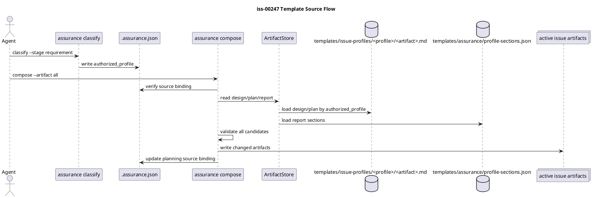

# iss-00247 Move Assurance Compose Scaffold Sources To Profile Markdown Templates — 設計書（Strict）

## 0. 文書の位置づけ

この設計書は、Issue Grade Template Pack を provider assets として採用し、`assurance compose` の `design.md` / `plan.md` source を JSON prose から Markdown template files へ移すための設計契約を定義する。

`strict` として扱う理由:

- scaffold / template contract を変更する。
- runtime compose の source resolution と validation に影響する。
- dogfooding workspace と installed target repo の parity が必要である。
- workflow / skill / agent planning artifact の実用性に影響する。

Critical escalation は不要である。secret / credential、破壊的削除、GitHub mutation、forward-only migration、ユーザー作成物の無条件上書きは含めない。

Assurance 権限メモ:

- 現行 runtime の `assurance classify` は `authorized_profile=standard` を返している。
- この設計書の `Issue Grade: "strict"` は runtime selection authority ではなく、scaffold / template contract 変更に対する issue-local reviewer / execution gate の強化を意味する。
- 実装する template selection は `authorized_profile` の値をそのまま使い、manual strict grade を selection input に混ぜない。

## 1. 設計サマリー

この Issue で変わること:

- Provider assets に common `issue/requirement.md` template と grade-specific `issue-profiles/{lite,standard,strict,critical}/{design,plan}.md` templates を追加する。
- 追加・更新する templates の title、見出し、小見出し、説明本文を日本語優先に補正する。
- `assurance compose` は `design` / `plan` について、`authorized_profile` から profile Markdown template を選択する。
- `profile-sections.json` は `design` / `plan` の prose authority ではなくなる。
- `report` は既存 append-oriented managed-section compose を維持する。

この Issue で変えないこと:

- `assurance classify` の profile 判定ロジック。
- `authorized_profile` authority semantics。
- `lite_candidate` が authority ではないという安全契約。
- user-authored substantive content no-overwrite。
- `report.md` evidence ledger lifecycle。

主要な設計契約:

- `[N]` `authorized_profile` が唯一の profile template selection authority である。
- `[N]` `design` / `plan` の長文 scaffold prose は Markdown files を source of truth とする。
- `[N]` `report` は既存 JSON-managed section source を継続できる。
- `[N]` missing / invalid template は全 artifact write 前に fail-closed する。
- `[N]` `--artifact all` は mixed source mode でも atomic preflight を保つ。
- `[N]` template の title / heading / prose は日本語を主言語にし、必要な英語名は日本語表現の後に括弧併記する。

## 2. 正本・根拠

| 種別 | Path / ID | この Issue への意味 |
|---|---|---|
| Issue Requirement | `requirement.md` | scope、AC、constraints、strict grade rationale |
| Parent Epic | `spec-dock/active/epic/requirement.md`, `design.md`, `plan.md` | dynamic workflow / assurance compose の上位目的 |
| Runtime composer | `src/spec_dock/assets/spec_dock/scripts/spec_dock_runtime/domain/artifact_composer.py` | marker scan、placeholder guard、idempotence、downgrade safety の既存契約 |
| Application orchestration | `src/spec_dock/assets/spec_dock/scripts/spec_dock_runtime/application/assurance.py` | verify contract、preflight、write、source binding update |
| Artifact store | `src/spec_dock/assets/spec_dock/scripts/spec_dock_runtime/infra/artifact_store.py` | artifact read/write と manifest loading boundary |
| Current JSON manifest | `src/spec_dock/assets/spec_dock/templates/assurance/profile-sections.json` | 移行元。report source は維持候補 |
| Template pack | `/private/tmp/spec-dock-issue-grade-templates/spec-dock-issue-grade-templates/` | 採用する common requirement と profile design/plan templates |
| Template matrix | template pack の `docs/template-matrix.md` | common requirement、profile-specific design/plan、existing report の責任分解 |
| Existing tests | `tests/unit/domain/test_artifact_composer.py`, `tests/unit/application/test_assurance.py`, `tests/unit/infra/test_init_update.py`, CLI tests | regression target |

## 3. 要件から設計への対応

| Requirement ID | 内容 | Design ID | 設計上の扱い |
|---|---|---|---|
| AC-001 | Template pack files are provider assets | DES-001 | Provider asset layout を定義 |
| AC-002 | design / plan prose source is Markdown | DES-002 | Template source resolver を導入 |
| AC-003 | authorized_profile only | DES-003 | Selection input を contract classification に限定 |
| AC-004 | requirement template updated | DES-001 | Common requirement template を provider asset として更新 |
| AC-005 | report compatibility | DES-004 | report legacy path を維持 |
| AC-006 | missing / invalid fails before writes | DES-005 | preflight / validation を write 前に集約 |
| AC-007 | placeholder frontmatter preservation | DES-006 | existing placeholder stripping を保持 |
| AC-008 | substantive no-overwrite | DES-006 | existing conflict semantics を保持 |
| AC-009 | idempotence / downgrade safety | DES-007 | managed marker preservation を保持 |
| AC-010 | dry-run / changed paths | DES-008 | application result contract を保持 |
| AC-011 | source binding update | DES-008 | write 後のみ planning source binding 更新 |
| AC-012 | installed scaffold parity | DES-009 | installer / update verification を要求 |
| AC-013 | テンプレート見出しと本文は日本語優先である | DES-010 | template language policy を定義 |

## 4. 目標 provider asset layout

`src/spec_dock/assets/spec_dock/templates/` 配下を次の形にする。

```text
issue/
  requirement.md
  design.md
  plan.md
issue-profiles/
  lite/
    design.md
    plan.md
  standard/
    design.md
    plan.md
  strict/
    design.md
    plan.md
  critical/
    design.md
    plan.md
assurance/
  profile-sections.json
```

設計契約:

- `[N]` `issue/requirement.md` は common template である。
- `[N]` `issue-profiles/<profile>/design.md` と `plan.md` は profile-specific template source である。
- `[N]` `issue/design.md` と `issue/plan.md` は新規 Issue に置かれる awaiting-compose placeholder、または selector note として残す。
- `[N]` actual Issue directory は従来どおり `requirement.md`, `design.md`, `plan.md`, `report.md`, `.meta.json` の単一セットを持つ。profile ごとの canonical file は Issue directory に増やさない。

## 5. テンプレートソースモデル

### DES-001: provider 側テンプレートパック採用

Template pack の Markdown files を provider-side asset に取り込む。

- common requirement template: `templates/issue/requirement.md`
- profile-specific design / plan templates: `templates/issue-profiles/<profile>/<artifact>.md`
- `docs/template-matrix.md` / `docs/final-review.md` は、実装時に恒久 docs へ入れるか、Issue discussion evidence として扱うかを S90 で判断する。

### DES-002: profile 別 Markdown template 解決

`ArtifactStore` に `design` / `plan` 用 profile template loader を追加する。

入力:

- `artifact`: `design` または `plan`
- `authorized_profile`: `lite` / `standard` / `strict` / `critical`

出力:

- template body text
- template repo-relative path
- validation metadata

規則:

- `[N]` loader は `repo_root/spec-dock/templates/issue-profiles/<profile>/<artifact>.md` だけを読む。
- `[N]` path traversal や root 外参照は構成上発生させない。将来 manifest 参照にする場合も root validation を必須にする。
- `[N]` unsupported artifact / profile は fail-closed。

### DES-003: 選択権限

Template selection は `contract.classification.authorized_profile` のみを使う。

- `lite_candidate=true` は selection に使わない。
- `contract.obligations.profile_preset` は診断・表示には使えても selection authority にはしない。
- Issue-local planning grade が strict に引き上げられていても、runtime compose は `.assurance.json` の `authorized_profile` を選択入力とする。

### DES-004: report legacy 互換性

`report.md` は今回 profile Markdown template 化しない。

- `profile-sections.json` は report managed sections の source として残せる。
- `design` / `plan` prose body は `profile-sections.json` から除去する。
- mixed-mode `--artifact all` は `design` / `plan` と `report` を同時 preflight してから write する。

### DES-005: テンプレート検証と原子的事前確認

Compose は write 前に全対象 artifact の candidate を生成・検証する。

検証内容:

- selected template が存在し regular file である。
- template text が non-empty である。
- target artifact marker scan が valid である。
- managed markers を使う場合、template marker scan が valid である。
- placeholder conflict / substantive content conflict を write 前に検出する。
- first write 前に、変更対象 artifacts がすべて writable である。

いずれかの artifact が fail した場合、artifact と `.assurance.json` は一切 write しない。

### DES-006: placeholder とユーザー本文保護

既存 placeholder semantics を維持する。

- unedited awaiting-compose placeholder: frontmatter を保持し、`artifact_state` を除去し、selected template body を materialize する。
- edited placeholder または substantive body: conflict として fail-closed。
- already materialized managed sections: 既存 sections を保持する。template model が要求する場合だけ missing sections を append できる。

### DES-007: 冪等性と downgrade safety

Template body model は、現行の idempotence と downgrade safety を壊してはならない。

推奨設計:

- profile Markdown template は full Markdown body として読める。
- compose の安全性を保つため、template body 内の managed section markers を検証対象にできる構造を許容する。
- already materialized artifact に同一 section id がある場合は既存本文を維持する。
- stronger profile section は weaker profile compose で削除しない。

### DES-008: application 結果契約

`compose_assurance()` の public result contract を維持する。

- dry-run: write しない。
- real compose: changed artifact だけ write する。
- changed_paths: 実際に変更される artifact path のみを返す。
- source binding: real write 後のみ planning artifacts の hash に更新する。
- errors: missing template / invalid template / marker conflict / substantive conflict を human-readable に返す。

### DES-009: provider・dogfooding・installed の同等性

Provider assets を更新したら、次を検証対象にする。

- provider-side files が存在する。
- initialized target repo に template files が入る。
- dogfooding `spec-dock/templates/...` に期待構造がある。
- `assurance compose` が dogfooding workspace で期待 profile template を materialize できる。

### DES-010: テンプレート言語方針

追加・更新する Issue templates は、日本語で authoring されることを前提にする。

設計契約:

- `[N]` template の title 行、見出し、小見出し、説明本文は日本語を主言語にする。
- `[N]` 英語だけの見出しは避ける。日本語だけで正確性が落ちる専門名は、日本語表現を先に置き、括弧内に英語名を併記する。
- `[N]` code identifiers、commands、file names、API names、既存の profile 名や artifact 名は原文を保持できる。
- `[N]` template pack 由来の英語見出しは、provider asset へ採用する際に日本語優先へ補正する。
- `[N]` この方針は user-facing prose と agent-facing instructions に適用する。コードブロック、PlantUML participant 名、path、CLI option は対象外にできる。

## 6. 視覚的な設計概要



## 7. 互換性 / migration design

互換性方針:

- Existing Issue directories は単一の canonical `design.md` と `plan.md` を維持する。
- Existing materialized artifacts は自動 refresh しない。
- Existing `report.md` compose behavior は維持する。
- Existing placeholder tests は Markdown template materialization を期待するよう更新する。
- Existing JSON manifest tests は、`design` / `plan` prose body absence が意図した状態であることを確認するよう更新する。

Rollback 方針:

- Provider asset additions は 1 commit revert で戻せる。
- Runtime loader changes は、tests で behavior parity を確認できる場合にのみ JSON manifest fallback へ戻せる。ただし最終状態では `design` / `plan` の JSON prose authority を残してはならない。
- data migration や destructive rewrite は行わない。

## 8. 失敗 / recovery design

| Failure | Detection | Recovery |
|---|---|---|
| profile template が missing | loader preflight | write 前に fail。asset または manifest を修正する |
| template marker が invalid | domain validation | write 前に fail。template を修正する |
| `lite_candidate` で template が選ばれる | unit test | bug として扱う。selection は `authorized_profile` を使う |
| mixed-mode all の一部 artifact failure | application preflight | no writes。失敗 artifact details を返す |
| existing substantive content | placeholder / content guard | conflict として fail。user が manual merge を判断する |
| installed target に profile files がない | installer tests | asset copying または scaffold expectations を更新する |

## 9. docs・template・skill への影響

Template pack は agents が Issue docs を authoring する方法に影響するため、docs / skill impact は scope 内である。

確認対象:

- `spec-dock/docs/workflow_issue.md`
- `spec-dock/docs/workflow_spec_authoring.md`
- `spec-dock/docs/phase_design.md`
- `spec-dock/docs/phase_plan_issue.md`
- `spec-dock/docs/authoring/issue-plan.md`
- `spec-dock-issue-planning` skill handoff expectations

実際の docs edits が必要な場合は、実装時に委任する。この planning phase で main orchestrator が直接責任を持つのは issue-local docs のみである。

## 10. 検討した代替案

| 代替案 | 判断 | 理由 |
|---|---|---|
| JSON body を維持して厚くする | rejected | review / preview / diff が悪化し、今回の目的に反する |
| profile template から full-file overwrite する | rejected | user-authored content protection と source binding safety を壊す |
| 同じ Issue で report も profile Markdown 化する | deferred | report evidence lifecycle は design / plan と異なる |
| `assurance compose` をやめて manual copy にする | rejected | existing workflow と contract verification を失う |
| template pack を source として採用し、runtime validation を適応させる | accepted | user-provided material を活かしつつ existing safety を保てる |

## 11. 実装計画への引き渡し

固定された設計契約:

- `DES-001`: provider template pack adoption。
- `DES-002`: profile Markdown template resolver。
- `DES-003`: selection authority is `authorized_profile`。
- `DES-004`: report legacy compatibility。
- `DES-005`: fail-closed validation and atomic preflight。
- `DES-006`: placeholder and user content protection。
- `DES-007`: idempotence and downgrade safety。
- `DES-008`: application result contract preservation。
- `DES-009`: provider / dogfooding / installed parity。
- `DES-010`: template language policy。

必須ゲート:

- Template asset presence gate。
- Domain composer behavior gate。
- Application preflight / dry-run / source-binding gate。
- Installer / dogfooding parity gate。
- Docs / skill impact gate。
- 完了前の fresh `spec-reviewer`、`qa-reviewer`、`code-reviewer` gates。

未解決事項:

- Blocking question はない。
- 実装中に template pack content が marker / idempotence constraints をそのまま満たせないと判明した場合、implementation は template body を wrap または parse してよい。ただし Markdown source authority は維持し、意味論が変わる場合は design に戻る。
