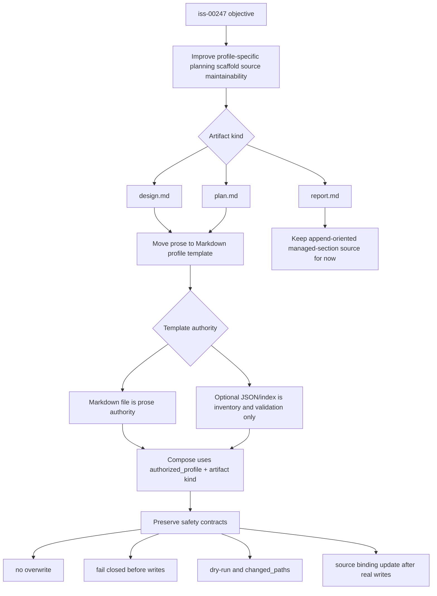

# 20260629t043420z-disc Template Source Scope Decision Synthesis

## 位置づけ
- 用途: 集まった質問回答や調査をもとに、意思決定前の synthesis、選択肢、tradeoff、reflection proposal、ADR candidate triage、推奨反映先を整理する。
- authority default: `proposed`。通常は doc type から推定し、例外時だけ front matter の `authority` で override する。
- この artifact は synthesis / reflection proposal / adoption target / ADR triage の evidence surface であり、main orchestrator が canonical docs / accepted ADR / `report.md` Evidence Adoption Ledger へ採用するまでは canonical authority ではない。
- 人間から回答を引き出し、回答欄や未回答事項を管理する場合は `interview` を使う。
- 生ログや未整理の思考は `scratch`、事実確認や外部根拠は `research`、長期判断の固定は `adr` に分ける。
- この doc は proposal / synthesis であり、issue `report.md` の observed evidence ledger ではない。採否の最終証跡は canonical docs / ADR / `report.md` Evidence Adoption Ledger に昇格する。
- doc が大きくなりすぎたら、質問回答は `interview`、事実調査は `research`、raw capture は `scratch`、長期決定は `adr` へ分割する。

## 対象論点 (必須)
- 今回整理する論点:
  - `assurance compose` の profile-specific planning scaffold source を JSON string body から Markdown template files へ移すときの Issue scope。
  - `design.md` / `plan.md` と `report.md` を同時に扱うべきか。
  - `profile-sections.json` を廃止するか、prose-less manifest / index として残すか。
  - 現行 safety contract を requirement acceptance としてどう固定するか。
- この synthesis が必要な理由:
  - `iss-00247` の canonical `requirement.md` はまだ placeholder であり、このまま書き始めると scope と acceptance を agent が作りすぎる可能性がある。
  - 既存 research は `Markdown-template-first hybrid` を推奨しているが、`report.md` と manifest/index の扱いは未確定として残している。

## derived question sheets / research (必須)
- `interview`:
  - 未作成。必要な場合は `report.md` を同時 scope に含めるかどうかについて一問だけ切り出す。
- `research`:
  - `20260629t022552z-research-profile-markdown-template-management.md`
  - `20260629t043419z-research-source-grounding-profile-markdown-templates.md`
- その他の根拠:
  - 親 Epic requirement/design/plan の `E-RQ-006`, `E-AC-006`, `E-AC-008`, Artifact Composer responsibility。
  - `artifact_composer.py`, `assurance.py`, `artifact_store.py` の現行 safety behavior。
  - `tests/unit/domain/test_artifact_composer.py`, `tests/unit/application/test_assurance.py`, `tests/cli_runtime/test_assurance_compose.py`, `tests/cli_runtime/test_new.py` の regression contract。
  - ChatGPT GPT-5.5 Pro Extended advisory review: Oracle session `iss-247-template-scope`。ローカル根拠と照合済み。

## synthesis (必須)
- 合意済みのこと:
  - `authorized_profile` だけを template selection authority とし、`lite_candidate` は obligation / template selection を減らさない。
  - full-file replacement は採用しない。Issue-specific frontmatter と existing substantive content を守る。
  - unedited awaiting-compose placeholder の安全な materialization、idempotent compose、dry-run no-write、changed_paths reporting、source binding update、marker conflict fail-closed は維持する。
  - provider-side `src/spec_dock/assets/spec_dock/...` を template/runtime source of truth とし、dogfooding `spec-dock/...` は validation target として確認する。
- 未合意 / 未確定のこと:
  - `report.md` の profile-specific scaffold source もこの Issue で Markdown file 化するか。ローカル根拠と ChatGPT advisory は defer 推奨で一致しており、現時点では blocking question ではない。
  - prose-less manifest/index を残すか、`templates/assurance/profiles/{profile}/{artifact}.md` の convention-only にするか。ChatGPT advisory は小さな inventory / validation manifest を推奨。
  - Markdown template body 内に managed-section marker を含めるか、template file 単位を section として扱うか。
- source-grounded に解決できたこと:
  - `design.md` / `plan.md` は placeholder body から profile-specific planning artifact へ materialize される対象であり、この Issue の中心対象である。
  - `report.md` は placeholder ではなく append-oriented evidence ledger として扱われており、design/plan と同一 migration に含める必然性は source からは確定しない。
  - 現行 JSON body を厚くする前に Markdown file 化した方が、差分確認と template editing の二度手間を避けられる。

## ChatGPT advisory integration

- Advisory source:
  - `chatgpt-use` / Oracle session `iss-247-template-scope`
- Concrete recommendation:
  - `iss-00247` は `design.md` / `plan.md` のみを Markdown-template-first hybrid に移行する。
  - `report.md` は現行 managed-section / append-oriented path に残し、lifecycle が明確になった後の follow-up とする。
  - Markdown files を design/plan prose の唯一の source of truth にし、JSON/index は残す場合でも inventory / validation contract に限定する。
- Local verification against sources:
  - 親 Epic は `design / plan / report fragment` 合成を要求するが、`report.md` は現行 code で placeholder handling の対象外であり、append-oriented evidence ledger という既存 research と整合する。
  - 既存 tests は `report.md` の idempotence / downgrade no-delete を固定しており、同時移行すると別の lifecycle decision が必要になる。
  - `profile-sections.json` から design/plan prose body を除去し、report prose だけを legacy として一時保持する案は、既存挙動を保ちながら Issue 目的を満たす。
- Adopted advisory points:
  - design/plan-only scope。
  - report migration deferred。
  - prose-less manifest/index allowed and preferred for validation。
  - missing/invalid template must fail before writes。
  - mixed-mode `--artifact all`: design/plan from Markdown templates, report from legacy source。
- Not blindly adopted / still design-level:
  - template body を whole-body にするか managed-section blocks にするかは、requirement では behavior constraint に留め、design phase で決める。
  - `.assurance.json` に template source path/hash を記録するかは、既存 source binding preservation を requirement とし、追加 provenance は design phase 判断とする。

## decision map

## 選択肢 / tradeoff (必須)
- Option A: JSON section manifest を継続する。
  - Pros:
    - 既存実装とテストの変更が最小。
    - section reuse と artifact/profile の validation が容易。
  - Cons:
    - Markdown prose が JSON string に閉じ込められ、preview / review / dogfooding の見通しが悪い。
    - profile 別完成形を source file として読めない。
    - template を厚くするほど escaped newline と diff noise が増える。
- Option B: profile/artifact 別 Markdown file を full-file copy する。
  - Pros:
    - profile 別完成形をそのまま読める。
    - Markdown authoring / preview / PR diff が自然。
  - Cons:
    - frontmatter、human edits、existing managed sections を壊しやすい。
    - profile 再分類や再 compose による silent overwrite risk が高い。
    - 現行 safety contract と合わない。
- Option C: Markdown-template-first hybrid を採用する。
  - Pros:
    - design/plan scaffold prose を Markdown file として編集・review できる。
    - frontmatter preserve、placeholder guard、substantive content fail-closed、idempotence を維持できる。
    - Python の責務を profile/artifact template resolution と safe materialization に縮小できる。
  - Cons:
    - profile 間の重複と drift risk が増える。
    - manifest/index を残す場合、authority の二重化を避ける設計が必要。
    - missing/invalid template の validation tests が必要。
- Option D: design/plan Markdown templates + report legacy mixed mode。
  - Pros:
    - Issue 目的の中心である planning artifact editing/reviewability を満たしつつ、report evidence ledger lifecycle 変更を避けられる。
    - `--artifact all` の既存 public behavior を保てる。
    - ChatGPT advisory と既存 research の両方に整合する。
  - Cons:
    - 一時的に design/plan と report で template source model が分かれる。
    - `profile-sections.json` が report legacy source として残る場合、二重 authority 誤読を防ぐ naming / docs / tests が必要。

## reflection proposal (必須)
- canonical docs / workflow / template / skill guidance へ反映すべき候補:
  - `requirement.md`: `design.md` / `plan.md` の profile-specific scaffold source を Markdown files へ移す目的と acceptance。
  - `design.md`: template source layout、template resolution、materialization guard、manifest/index 方針。
  - `plan.md`: tests と dogfooding verification。
  - `report.md`: research / ChatGPT advisory / user interview answer の採用証跡。
- まだ proposal に留める理由:
  - canonical requirement authoring 前の clarification であり、ChatGPT advisory と必要ならユーザー interview を待つ。
  - `report.md` 同時 scope と manifest/index 方針はまだ最終確定していない。

## adoption target / 採用先候補 (必須)
- `requirement.md`:
  - purpose、background/current problem、MUST/MUST NOT、acceptance criteria、edge cases。
- `design.md`:
  - Markdown template layout、ArtifactStore / composer の責務、validation/fail-closed strategy。
- `plan.md`:
  - step closure、test matrix、provider/dogfooding mirror validation。
- `ADR`:
  - 現時点では不要寄り。Issue-local reversible storage-model migration として扱える。
- `report.md` Evidence Adoption Ledger:
  - `20260629t022552z-research...`、本 research、ChatGPT advisory、必要なら interview answer の採用判断。

## ADR triage / ADR candidate triage (必須)
- ADR candidate か:
  - no
- hard to reverse:
  - no
- surprising without context:
  - no
- real tradeoff:
  - yes
- ADR 化しない場合の反映先:
  - `disc`, `requirement.md`, `design.md`, `plan.md`, `report.md`

## 推奨案 (必須)
- 推奨は Option D: design/plan Markdown templates + report legacy mixed mode。
- Issue scope はまず `design.md` / `plan.md` の profile-specific scaffold source を Markdown template files へ移すことを中心にする。
- `report.md` は append-oriented evidence ledger であり、同時移行は scope を広げるため、ユーザーが同時移行を明示しない限り follow-up または別 acceptance に回すのが安全。
- manifest/index は、残す場合でも prose source ではなく profile/artifact/path validation metadata に限定する。4 profiles x 2 artifacts 程度なら convention-only でも成立するが、diagnostics と testability を重視するなら小さな prose-less manifest を許容する。

## 推奨反映先 (必須)
- `requirement.md`:
  - `templates/assurance/profiles/{lite,standard,strict,critical}/{design,plan}.md` を provider asset として持つ。
  - compose は `authorized_profile` と artifact kind で template を選択する。
  - `profile-sections.json` に design/plan prose body を残さない。
  - placeholder guard、no-overwrite、idempotence、dry-run、changed_paths、source binding update、symlink/path guard を維持する。
- `design.md`:
  - template resolver と artifact composer の境界を設計する。
  - missing/invalid/wrong artifact template を write 前に fail-closed する。
  - full-file replacement ではなく body materialization + frontmatter preserve とする。
- `plan.md`:
  - domain tests: profile selection, lite_candidate non-authority, idempotence, invalid template, downgrade no-delete。
  - application tests: changed artifact writable preflight before writes。
  - CLI tests: all/single artifact compose, dry-run, changed_paths, stale/no-overwrite, missing template。
  - init/update tests: shipped template files exist and installed scaffold parity。
- `ADR`:
  - なし。将来 report.md も含めた reusable template architecture default へ拡大する場合に再評価する。
- `report.md` Evidence Adoption Ledger:
  - この `disc` と `research`、ChatGPT advisory、ユーザー回答を adoption evidence として記録する。

## 未採用 / deferred 理由 (必須)
- 未採用:
  - JSON string manifest 継続: Issue の編集性・reviewability 目的を満たしにくい。
  - full-file copy: frontmatter / human edits / safety contract を壊しやすい。
- deferred:
  - `report.md` Markdown template 化: append-oriented ledger semantics があり、design/plan より migration risk が高い。ユーザーが同時 scope を望む場合のみ採用候補に戻す。
  - 既存 materialized artifact refresh command: 現行 research でも follow-up 扱い。今回の minimum scope には含めない。

## 次アクション (必須)
- `requirement.md` / `design.md` / `plan.md` / `adr` へ反映する内容:
  - この `disc` と research をもとに、次 turn 以降で `requirement.md` を作成できる。
  - 現時点では blocking user question はない。`report.md` 同時移行を希望する明示が出た場合だけ formal interview を作成する。
- 追加で作る discussion docs:
  - 現時点ではなし。
