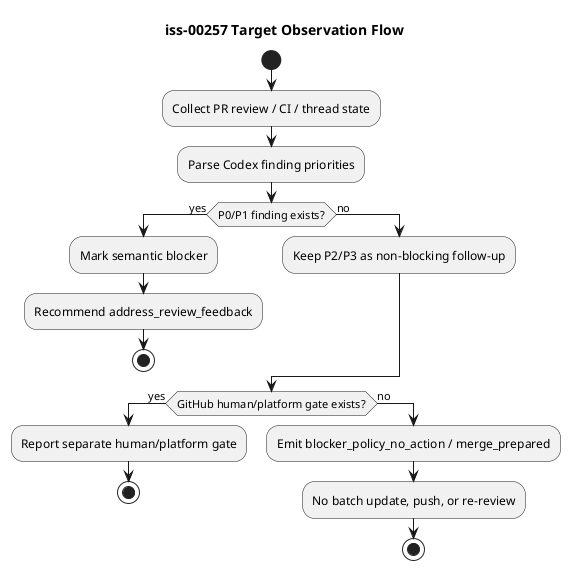

# iss-00257 Severity Aware Codex PR Review Policy And Non Blocking Repair Loop Hardening — Issue 設計書

## 0. 設計方針

この Issue は、review severity の意味論と repair loop の起動条件を分離する。設計の中心は、P0/P1 だけを semantic merge blocker とし、P2/P3 は observation output に残しながら autonomous repair / branch mutation / re-review trigger の対象から外すことである。

`root_cause_family` は review instruction、merge-preparer skill、repair-batch template の運用語彙として採用する。runtime JSON、`blocker_fingerprint`、automation stalled 判定の first-class contract にはしない。

加えて、SpecDock workflow invocation は workflow-scoped named role authorization として扱う。これは LLM/orchestrator が迷わないための instruction / docs / skill 明文化であり、runtime consent schema や新しい permission persistence は追加しない。

## 1. Profile / Assurance

- `assurance classify --stage requirement` の結果は `authorized_profile: standard`。
- Requirement phase は spec-reviewer pass 済み。
- Design phase はこの文書の fresh spec-reviewer pass 取得前である。

## 2. Normative Sources

| 種別 | Source | この Issue への意味 |
|---|---|---|
| Issue requirement | `requirement.md` | AC/BH/CON の正本 |
| 添付 bundle | `specdock-pr-review-policy-update.zip` | severity-aware policy と replacement asset の根拠 |
| Clarification | `discussions/20260701t022257z-interview-parent-epic-p2-promotion-policy.md` | issue-local に旧 P2 promotion を廃止 |
| Clarification | `discussions/20260701t023858z-interview-root-cause-family-runtime-scope.md` | `root_cause_family` は docs/LLM 運用語彙 |
| Research | `discussions/20260701t023648z-research-pr-review-policy-clarification-research.md` | 現行 code/test/asset 差分の根拠 |
| User supplemental instruction | current conversation | SpecDock workflow 利用依頼を workflow-defined named role 利用許可として明文化する追加 scope |

## 3. 全体像

Observation workflow は、Codex review body から priority と metadata を抽出し、semantic blocker と non-blocking follow-up を分ける。Merge-preparer workflow は、その結果を使って P0/P1 repair だけを自律修復対象にし、P2/P3-only terminal state では人間に follow-up を報告するだけに留める。

## 4. 対象

| Surface | Current responsibility | Issue-relevant design change |
|---|---|---|
| `.agents/skills/github-pr-observation/scripts/codex-review-instructions.md` | Codex review request instruction | P0/P1 blocking、P2/P3 reportable non-blocking、P2/P3 promotion 禁止を明示 |
| `src/spec_dock/assets/install_root/.agents/skills/github-pr-observation/scripts/codex-review-instructions.md` | Installed provider mirror | dogfooding asset と同じ内容にする |
| `.agents/skills/github-pr-observation/scripts/lib/pr_review_snapshot.py` | Review comments / reviews から blocker policy snapshot を生成 | P2 + protected_domain + machine_evidence を `promoted_blocker` にしない |
| `src/spec_dock/assets/install_root/.agents/skills/github-pr-observation/scripts/lib/pr_review_snapshot.py` | Installed provider mirror | runtime mirror parity を維持する |
| `.agents/skills/github-pr-observation/scripts/lib/pr_observation_snapshot.py` | Snapshot-level PR observation classifier | explicit `actionable_unresolved_*` fields を尊重し、P2/P3-only raw selected unresolved を再ブロックしない |
| `src/spec_dock/assets/install_root/.agents/skills/github-pr-observation/scripts/lib/pr_observation_snapshot.py` | Installed provider mirror | downstream classifier mirror parity を維持する |
| `.agents/skills/github-pr-observation/scripts/lib/pr_observation_wait.py` | Observation loop and stalled detection | explicit `actionable_unresolved_*` fields を尊重し、current-selected / carryover / waitable reason precedence を維持する。`root_cause_family` first-class field は追加しない |
| `src/spec_dock/assets/install_root/.agents/skills/github-pr-observation/scripts/lib/pr_observation_wait.py` | Installed provider mirror | downstream classifier mirror parity を維持する |
| `.agents/skills/github-pr-merge-preparer/SKILL.md` | PR merge preparation workflow | P2/P3 terminal no-mutation policy を明示 |
| `spec-dock/templates/discussions/pr-repair-batch.md` | Repair batch discussion template | repo-persistent batch が blocking repair 用であることを明示 |
| `tests/unit/infra/test_init_update.py` | Installer / asset / observation regression tests | 旧 P2 promotion expectation と旧 instruction phrase expectation を更新 |
| `src/spec_dock/assets/install_root/.codex/config.toml` | Provider-side Codex orchestrator instruction | SpecDock workflow-scoped named role authorization を明示 |
| `.codex/config.toml` | Dogfooding Codex orchestrator instruction | Provider mirror と同趣旨を反映 |
| `src/spec_dock/assets/install_root/.agents/skills/spec-dock-hub/SKILL.md` and mirror | SpecDock workflow routing skill | SpecDock workflow invocation authorization の入口を明示 |
| `src/spec_dock/assets/install_root/.agents/skills/spec-dock-issue-planning/SKILL.md` and mirror | Issue Planning skill | Requirement/design/plan/reviewer gate で追加 per-role permission を求めないことを明示 |
| `src/spec_dock/assets/install_root/.agents/skills/spec-dock-issue-execution/SKILL.md` and mirror | Issue Execution skill | code-reviewer / qa-reviewer など required gate を明示許可待ちで省略しないことを明示 |
| `spec-dock/docs/workflow_spec_authoring.md` and provider mirror | Spec authoring workflow docs | Canonical docs single-writer authority と sub-agent evidence adoption の関係を明示 |
| `spec-dock/docs/workflow_issue.md` and provider mirror | Issue execution workflow docs | Scope boundary and escalation exceptions を明示 |

## 5. Target Design Delta

| Design ID | Requirement | Current | Target | 固定度 |
|---|---|---|---|---|
| DES-001 | AC-001, AC-006 | Review instruction は P2/P3 を報告しない merge-blocking reviewer 風 | P0/P1 blocking、P2/P3 reportable non-blocking、P2/P3 promotion 禁止を明示 | `[N]` |
| DES-002 | AC-002, AC-003 | P2 protected-domain + machine-evidence が `promoted_blocker` | P0/P1 のみ `blocker`; P2/P3 は metadata 付き `non_blocking_followup` | `[N]` |
| DES-003 | AC-004, AC-005 | P2-only no-action path はあるが protected+machine P2 は blocker 化 | P2/P3-only は他 gate clean なら `blocker_policy_no_action` / merge-prepared に進める | `[N]` |
| DES-004 | AC-006 | Merge-preparer / batch template の terminal P2/P3-only 境界が弱い | P0/P1 repair と P2/P3 terminal report を分離し、persistent batch を blocking work に限定 | `[N]` |
| DES-005 | AC-007 | Provider/dogfooding mirror は現状一致 | 更新後も mirror parity を維持 | `[N]` |
| DES-006 | AC-008 | 親 Epic には旧 promotion 方針が残る可能性 | 親 docs は非編集。issue-local override を requirement/report に固定 | `[N]` |
| DES-007 | AC-009 | Dogfooding note は discussion に存在 | classify/compose/reviewer 制約の観測を report へ採用 | `[N]` |
| DES-008 | AC-010 | SpecDock workflow invocation 時に named role 利用許可の扱いが不明確で、orchestrator が追加許可待ちし得る | instruction / workflow docs / skill docs に workflow-scoped named role authorization を明示 | `[N]` |

## 6. Blocker Policy Contract

Runtime blocker policy は次の表に従う。

| Parsed priority | Metadata | Finding disposition | Blocker fingerprint | Repair loop |
|---|---|---|---|---|
| P0 | any | `blocker` | included | yes |
| P1 | any | `blocker` | included | yes |
| P2 | `protected_domain` true/false, `machine_evidence` true/false | `non_blocking_followup` | excluded | no |
| P3 | any | `non_blocking_followup` | excluded | no |
| unknown / priorityless | low-confidence fallback / manual review gate | not silent pass | excluded from semantic blocker unless separately gated | no autonomous repair until clarified |

Design constraints:

- `promoted_blocker` should disappear from the P2 protected-domain + machine-evidence path.
- `protected_domain` and `machine_evidence` remain useful metadata in finding summaries.
- `blocker_policy.blocker_fingerprints` is derived only from P0/P1 blockers.
- Existing platform / human gates remain independent from severity blocker policy.

## 7. File Change Plan

### 7.1 Markdown / Skill / Template Assets

- Update dogfooding asset and provider mirror together:
  - `.agents/skills/github-pr-observation/scripts/codex-review-instructions.md`
  - `src/spec_dock/assets/install_root/.agents/skills/github-pr-observation/scripts/codex-review-instructions.md`
- Update merge-preparer skill and provider mirror together:
  - `.agents/skills/github-pr-merge-preparer/SKILL.md`
  - `src/spec_dock/assets/install_root/.agents/skills/github-pr-merge-preparer/SKILL.md`
- Update repair-batch template and provider mirror together:
  - `spec-dock/templates/discussions/pr-repair-batch.md`
  - `src/spec_dock/assets/spec_dock/templates/discussions/pr-repair-batch.md`

### 7.2 Runtime

- Update dogfooding runtime and provider mirror together:
  - `.agents/skills/github-pr-observation/scripts/lib/pr_review_snapshot.py`
  - `src/spec_dock/assets/install_root/.agents/skills/github-pr-observation/scripts/lib/pr_review_snapshot.py`

Expected local delta:

- Remove P2 protected-domain + machine-evidence `promoted_blocker` branch.
- Ensure blockers are selected only from `disposition == "blocker"`.
- Keep P2/P3 metadata in finding records.
- Avoid adding `root_cause_family` parser / field.

### 7.3 Tests

- Update `tests/unit/infra/test_init_update.py`.
- Expected test changes:
  - Replace old instruction text assertions with new severity-aware instruction assertions.
  - Replace protected-domain + machine-evidence P2 expectation with non-blocking follow-up.
  - Keep P0/P1 blocker tests passing.
  - Keep CHANGES_REQUESTED / unresolved thread / priorityless fallback tests passing.
  - Keep provider/dogfooding mirror parity tests passing.

## 8. Non-Targets / Explicit Rejections

| Candidate | Decision | Reason |
|---|---|---|
| Edit parent `epic-00224` docs | reject | User explicitly scoped this Issue away from parent Epic docs |
| Add runtime `root_cause_family` field | reject for this Issue | User selected Option B; docs / LLM judgement only |
| Auto-resolve GitHub conversations | reject | Platform / human gate, not semantic repair target |
| Re-request Codex review for P2/P3-only terminal state | reject | Terminal no-mutation requirement |
| Treat protected domain as severity escalation | reject | Metadata only; no P2/P3 promotion |
| Add runtime consent schema or new permission persistence | reject | User requested documentation / instruction hardening only |
| Treat SpecDock workflow request as unlimited permission | reject | Authorization is limited to active repo/worktree, active SpecDock scope, current session, documented role responsibility |
| Let sub-agents directly own canonical docs | reject | Main orchestrator keeps single-writer canonical authority; sub-agent outputs are evidence |

## 9. Requirement-to-Design Traceability

| Requirement | Design |
|---|---|
| BH-001 / AC-003 | DES-002, blocker policy table |
| BH-002 / AC-002 | DES-002, DES-003 |
| BH-003 / AC-004 | DES-003, terminal observation flow |
| BH-004 / AC-005 | DES-003, platform gate separation |
| BH-005 / AC-006 | DES-004, non-target runtime `root_cause_family` |
| AC-001 | DES-001 |
| AC-007 | DES-005 |
| AC-008 / CON-001 | DES-006 |
| AC-009 | DES-007 |
| BH-006 / AC-010 / CON-005 / CON-006 | DES-008 |

## 10. Verification Strategy

- Focused regression tests in `tests/unit/infra/test_init_update.py` should cover the changed runtime and installed asset expectations.
- Mirror parity is verified by existing tests and, if needed, direct `cmp` inspection for updated pairs.
- No external GitHub mutation is required for verification.
- Final implementation readiness still requires plan phase review and report evidence completion.
