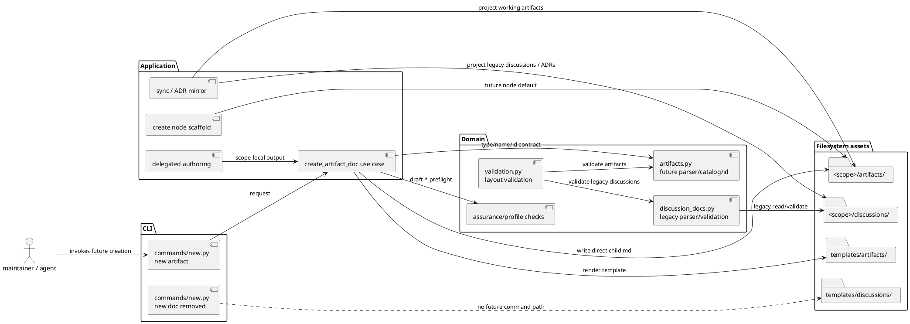
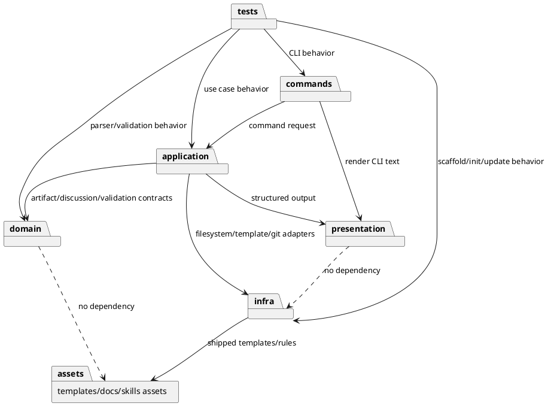
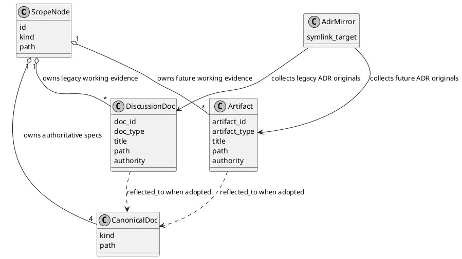
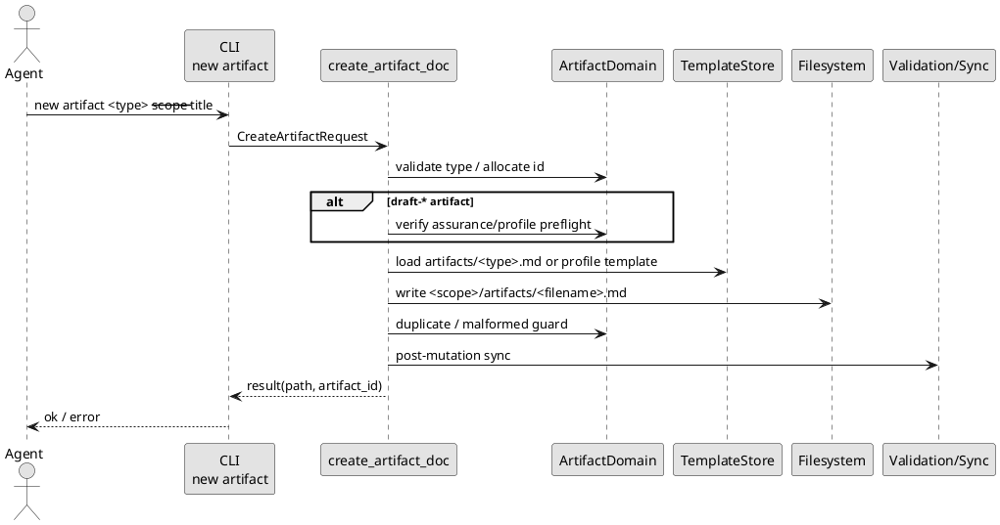

# epic-00259 Artifacts Directory Future Only Adoption — 設計（どう実現するか）

## 全体像
- 対象境界:
  - Provider-side shipped runtime / templates / docs / skills を正として、future working artifact surface を `artifacts/` に切り替える。
  - Dogfooding workspace は最終検証対象であり、実装 source of truth ではない。
- 影響領域:
  - CLI command surface: `new artifact` 追加、`new doc` 削除。
  - Domain model: legacy discussion docs と future artifacts の parser / id / filename contract を分離。
  - Creation use case: `artifacts/` direct child Markdown の作成、on-demand directory/rules creation、draft artifact safety preflight。
  - Validation / sync / projection: canonical docs、future artifacts、legacy discussions の区別。
  - Agent workflow: delegated authoring output と docs guidance の output surface を `artifacts/` に変更。
- 既存関係:
  - 現在は `commands/new.py` -> `application/create_node.py` -> `domain/discussion_docs.py` / `templates/discussions/` が `new doc` と `discussions/` 作成を所有している。
  - `domain/validation.py` は legacy discussions filename validation と duplicate guard を持つ。
  - Draft docs は `.assurance.json` と profile-specific templates を使う safety-sensitive path を持つ。
- 参照する親 diagram:
  - Initiative design の architecture maintenance context。ここでは Epic 固有の runtime / artifact 境界だけを示す。

## 設計決定
- D-001: Discussion docs と artifacts は domain model を分ける。
  - `discussion_docs.py` は legacy validation / historical parsing の owner として残す。
  - 新規 `artifacts.py` 相当の domain module が future artifact type、filename parser、id generation、collision handling、malformed candidate detection を所有する。
- D-002: `new artifact` は `new doc` の wrapper ではなく、別 use case とする。
  - `new doc` を削除するため、future command が legacy discussion code path に依存し続けない構造にする。
  - 共通化できるのは slugification、timestamp formatting、create lock、template rendering、post-mutation sync などの低レベル helper に限定する。
- D-003: ADR / draft-* / delegated output を artifact catalog に含める。
  - ADR は future original を `artifacts/` に作成し、legacy ADR original は `discussions/` に残す。
  - draft-* は `new artifact` に統一しつつ、issue scope 専用の safety-sensitive artifact として扱い、assurance/profile no-write fail-closed behavior を維持する。
  - `new artifact draft-requirement|draft-design|draft-plan --initiative ...` と `--epic ...` は unsupported scope として preflight no-write で失敗させる。non-issue scope 用の assurance model はこの Epic では定義しない。
  - delegated authoring output は `artifacts/` direct child へ移行し、canonical docs への直接 write 禁止を維持する。
- D-006: Delegated authoring diff guard は artifacts boundary を所有する。
  - `domain/delegated_authoring.py` / `application/delegated_authoring.py` の current `scope_dir / "discussions"` boundary を `scope_dir / "artifacts"` boundary に置き換える。
  - Guard は target scope `artifacts/` direct child Markdown を exactly one new file として許可し、nested path、symlink、non-Markdown、existing artifact update、delete、rename/copy、mixed staged/unstaged、unmerged status、out-of-scope path を拒否する。
  - Required provenance fields（`created_by_role`, `scope_id`, `source_paths`, `intended_targets`, `adoption_status: unreviewed`, `reflected_to: []`, `diff_guard_result`）と supported roles は維持する。
  - `discussions/` への delegated output は future path としては fail し、legacy/historical artifact としてのみ残る。
- D-004: `scratch` は future catalog に入れない。
  - raw / freeform capture は `blank` を使う。
  - Existing `scratch` discussion artifacts は legacy historical content として valid に残す。
- D-005: Validation は old / new / mixed layout を区別して許容する。
  - `discussions/` がある場合は legacy discussion validation を適用する。
  - `artifacts/` がある場合は artifact validation を適用する。
  - Directory existence 自体は old node でも new node でも mandatory にしない。creation/scaffold contract は別途 test で確認する。

## コンポーネント / モジュール構成（Component / Module View）
- タイトル:
  - Future artifact creation component boundary.
- 答える問い:
  - `new artifact` はどの module が所有し、legacy `discussions/` とどこで分離するか。
- 範囲:
  - Runtime command / application / domain / infra-template / validation / presentation / docs-skills surface.
- 含めない詳細:
  - Individual function names, full tests inventory, downstream Issue step order.
- 更新条件:
  - artifact type catalog、command surface、validation / sync ownership、delegated authoring boundary が変わるとき。

### 図表（UML / コンポーネント）

## パッケージ依存（Package Dependency）
- タイトル:
  - Artifact domain dependency direction.
- 答える問い:
  - Future artifact logic をどの layer に置き、legacy discussion logic と循環させないか。
- 範囲:
  - `commands`, `application`, `domain`, `infra`, `presentation`, `templates`, `tests`.
- 含めない詳細:
  - Generated dogfooding workspace の個別 files。
- 更新条件:
  - Runtime layer の ownership または dependency direction が変わるとき。

### 図表（UML / パッケージ依存）

## ドメインモデル（Domain Model / DDD 必要時）
- ユビキタス言語:
  - `Artifact`: future scope-local working evidence under `artifacts/`.
  - `DiscussionDoc`: legacy scope-local working evidence under `discussions/`.
  - `ArtifactType`: creatable type for `new artifact`.
  - `ArtifactId`: timestamp plus optional suffix plus type for typed artifacts, timestamp plus optional suffix for blank artifacts.
  - `CanonicalDoc`: `requirement.md`, `design.md`, `plan.md`, `report.md`; not an artifact.
  - `ADR original`: accepted decision source that may live in legacy `discussions/` or future `artifacts/`.
- 集約 / 不変条件:
  - Artifact filename must be either typed (`<ts>-<type>-<slug>.md`, `<ts>-<nn>-<type>-<slug>.md`) or blank (`<ts>-<slug>.md`, `<ts>-<nn>-<slug>.md`).
  - Blank artifact frontmatter records `template: "blank"` even though filename omits `blank`.
  - Scope-local artifact creation writes exactly one Markdown direct child under target `artifacts/`.
  - Existing `discussions/` files are not rewritten by artifact creation.
- diagram メタデータ:
  - タイトル:
    - Artifact and legacy discussion identity model.
  - 答える問い:
    - Artifact ID と DiscussionDoc ID はなぜ分離されるか。
  - 範囲:
    - Filename / ID / authority relationship.
  - 含めない詳細:
    - persistence schema / full implementation classes.
  - 更新条件:
    - artifact type catalog or filename identity changes.

### 図表（UML / domain model）

## 契約
### CLI contract
- `spec-dock new artifact <type> --initiative <id> --title "..."`
- `spec-dock new artifact <type> --epic <id> --title "..."`
- `spec-dock new artifact <type> --issue <id> --title "..."`
- Required:
  - positional `<type>`
  - exactly one scope flag
  - `--title`
- Optional:
  - `--slug`
- Removed:
  - `spec-dock new doc ...` from parser / help / command registry.
- Failure:
  - missing / unknown type, missing title, missing scope, multiple scopes, invalid slug, unsupported scope for artifact type, missing / stale draft assurance preflight, malformed existing target state -> non-zero and no file written.

### Artifact type contract
- Generic evidence:
  - `blank`, `research`, `interview`, `disc`, `decision-candidate`, `pr-repair-batch`
- Decision:
  - `adr`
- Safety-sensitive drafts:
  - `draft-requirement`, `draft-design`, `draft-plan`
  - Supported scope: issue only.
  - Unsupported scopes: initiative / epic fail before writing.
- Legacy-only:
  - `scratch`, retired `note`, historical discussion docs.

### Data boundary
- データの authoritative source / system of record:
  - Provider-side runtime, templates, docs, and skills under `src/spec_dock/assets/...` are the implementation source of truth.
  - Scope-local `artifacts/` and `discussions/` files are not root canonical specs. Most are working evidence until reflected through canonical docs or report evidence.
  - Accepted ADR originals under `artifacts/` or legacy `discussions/` keep ADR authority and are eligible for ADR mirror collection.
- 一貫性モデル:
  - File creation is atomic enough for existing create-lock pattern and duplicate guard.
  - Validation derives state from filesystem and `.meta.json`; sync / projection must not infer canonical authority from artifact location alone.

## データモデル
- New / changed concepts:
  - `ArtifactFilename` value object.
  - `ArtifactType` catalog.
  - `ArtifactCreateRequest` / `ArtifactCreateResult`.
  - Artifact validation candidate detection.
  - ADR source discovery that scans both `discussions/` and `artifacts/`.
- No database migration:
  - This is filesystem-backed scaffold/runtime state.
- diagram:
  - N/A: persistence schema is not changing; filename/domain model diagram above is sufficient.

## 主要フロー
- Flow-A: create blank artifact.
  1. CLI parses `new artifact blank`.
  2. Application resolves target scope and ensures create lock.
  3. Domain validates `blank` type and allocates filename without `blank`.
  4. Infra loads `templates/artifacts/blank.md`.
  5. Application writes `<scope>/artifacts/<ts>-<slug>.md`.
  6. Post-write duplicate guard and post-mutation sync run.
- Flow-B: create typed artifact.
  1. CLI parses typed artifact such as `research`.
  2. Domain allocates `<ts>-research-<slug>.md`.
  3. Template renderer records type / title / parent / date.
  4. Output remains working evidence until reflected.
- Flow-C: create draft artifact.
  1. CLI parses `draft-requirement`, `draft-design`, or `draft-plan`.
  2. Application requires issue scope. Initiative / epic scope fails before template resolution and before writing.
  3. Application verifies issue target and `.assurance.json` / authorized profile when required.
  4. Profile-specific template selection occurs before write.
  5. Invalid profile or stale assurance fails before writing.
- Flow-D: validate / sync mixed layout.
  1. Graph loads scope nodes.
  2. For each scope, `discussions/` validation runs only if present.
  3. `artifacts/` validation runs only if present.
  4. Sync / projection labels canonical docs, future artifacts, and legacy discussions distinctly.
- Flow-E: ADR mirror.
  1. ADR discovery scans legacy `discussions/` ADR originals.
  2. ADR discovery scans future `artifacts/` ADR originals.
  3. Mirror symlinks are regenerated without moving originals.
- Flow-F: delegated authoring diff guard.
  1. Application resolves target scope directory.
  2. Baseline status is required and must be outside the repo.
  3. Domain evaluates current diff against `scope_dir / "artifacts"`.
  4. Exactly one new direct-child Markdown artifact is allowed.
  5. Symlinks, nested paths, non-Markdown files, deletes, renames/copies, existing updates, forbidden roots, canonical docs, `.env*`, out-of-scope directories, and multiple/zero new artifacts are blocked.
  6. Provenance frontmatter and role/scope match are validated before the evidence can be adopted.

### 図表（UML / main sequence）

## 状態 / アクティビティ（State / Activity / 必要時）
- State:
  - N/A: Artifact lifecycle is represented by frontmatter/adoption evidence and canonical reflection, not by a new runtime state machine in this Epic.
- Activity:
  - N/A: Main sequence covers the command flow; detailed implementation order belongs in plan.

## 失敗設計
- 失敗モード:
  - Unknown artifact type.
  - Missing type / title / scope or multiple scope flags.
  - Invalid slug.
  - Target node not found.
  - Existing malformed artifact filename or duplicate artifact id in target `artifacts/`.
  - Existing malformed discussion filename or duplicate discussion doc_id in target `discussions/` when validation / creation preflight checks legacy state.
  - Missing / stale / invalid `.assurance.json` for draft artifact.
  - `draft-*` requested for initiative / epic scope.
  - Template missing.
  - Create lock acquisition / release failure.
  - Delegated authoring diff guard detects non-artifact output, nested/symlink/non-Markdown output, existing update, forbidden root, missing provenance, role mismatch, or zero/multiple new artifacts.
- リトライ:
  - User fixes input or target state and re-runs command.
  - Same-second filename collision retries through suffix allocation 01..99.
- 冪等性:
  - Command does not overwrite existing files.
  - Re-running same command creates a new timestamp/suffix artifact, not updates the old one.
- 部分失敗:
  - Preflight failures are no-write.
  - Post-write guard failures must surface explicit diagnostic and preserve enough path evidence for manual recovery.

## 移行戦略
- 移行戦略:
  - Future-only cutover. Existing `discussions/` are not migrated.
  - Provider-side runtime/templates/docs/skills change first; dogfooding confirmation follows.
  - Historical references to `new doc` are either updated to `new artifact` or explicitly marked as legacy/historical only.
- Dual write/read:
  - No dual write. Future writes go to `artifacts/`.
  - Read / validation / ADR mirror are dual-source where needed: `discussions/` and `artifacts/`.
- ロールバック:
  - No file migration means rollback does not require moving existing discussions.
  - Reintroducing `new doc` would be an explicit revert of the command-surface decision and must be treated as ADR-impacting.
  - Artifacts created during rollout can remain working evidence; canonical docs remain separate.

## 観測性 / セキュリティ
- 観測性:
  - CLI stdout includes artifact type, artifact id, path.
  - validate diagnostics name whether failure is artifact or discussion filename validation.
  - sync / `.agent` projection distinguishes canonical docs, artifacts, legacy discussions, and ADR mirror sources.
  - Epic report records dogfooding created paths and validate / sync outputs.
- ロール / 認可:
  - No external authorization change.
  - Delegated authoring consent / diff guard shifts from `discussions/` to `artifacts/` direct child; canonical docs remain main-orchestrator-only.
  - Diff guard must expose failure reasons using artifact-oriented diagnostics rather than `outside_target_discussions` / `expected_exactly_one_new_discussion_draft` wording after the migration.
- 監査 / PII:
  - No new PII behavior.
  - `.env*` write and non-scope file mutation remain forbidden for delegated authoring.

## テスト戦略
- 単体:
  - Artifact filename parser for typed / blank / suffix / malformed cases.
  - Artifact type catalog and `blank` filename omission.
  - Legacy discussion parser non-interference.
  - Draft artifact assurance/profile no-write failure.
- CLI / runtime:
  - `new artifact blank`, `new artifact research`, `new artifact adr`, `new artifact draft-*`.
  - `new artifact draft-* --initiative/--epic` fails no-write as unsupported scope.
  - Missing / unknown type and invalid scope failures.
  - `new doc` removed from help and unsupported at runtime.
  - On-demand `artifacts/` creation for old nodes.
- Scaffold / installer:
  - New initiative / epic / issue creates `artifacts/`, not default `discussions/`.
  - Installed assets include `templates/artifacts/` and rules docs.
- Validation / sync:
  - old-only, new-only, mixed layout pass.
  - malformed artifact and malformed discussion candidate fail.
  - ADR mirror collects both sources.
- Dogfooding:
  - Use local dogfooding node to create blank / typed artifact and run validate / sync.
  - Delegated authoring:
    - Unit / CLI tests update the existing `test_delegated_authoring` expectations from `discussions/` to `artifacts/`.
    - Tests cover allowed new flat artifact Markdown, rejection of `discussions/` output, symlinked `artifacts/` directory, artifact symlink child, nested artifact, non-Markdown output, existing artifact update, missing provenance, role mismatch, zero/multiple new artifacts, and forbidden side effects even when those paths are git-ignored.
  - E-AC 対応:
    - E-AC-001 -> CLI blank artifact tests and dogfooding.
    - E-AC-002 -> typed artifact parser / CLI tests.
    - E-AC-003 -> command registry / help tests.
    - E-AC-004 -> artifact catalog parser / template / creation coverage tests.
    - E-AC-005 -> ADR mirror tests.
    - E-AC-006 -> draft artifact profile tests.
    - E-AC-007 -> validation layout tests.
    - E-AC-008 -> scaffold / docs / skills tests.
    - E-AC-009 -> old-node on-demand artifacts directory / rules setup tests.
    - E-AC-010 -> dogfooding report evidence.

## 関連 ADR
- `artifacts/20260701t055644z-adr-artifacts-future-only-command-unification.md`:
  - Accepted decision for future-only `artifacts/`, `new artifact` command unification, `new doc` removal, ADR / draft / delegated output inclusion, and legacy `discussions/` preservation.

## 未確定事項
- なし:
  - Scope-affecting policy has been fixed by the accepted ADR and interviews.
  - Remaining choices such as exact helper names, rules symlink/copy mechanics, and test file names are implementation-local and must not change E-RQ / E-AC.
