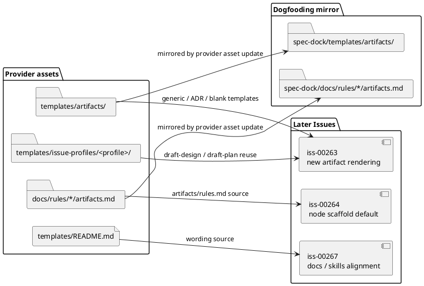

# iss-00262 Artifact templates and rules — 設計

## 1. 親図参照
- 親 Epic design:
  - `spec-dock/active/epic/design.md`
  - `spec-dock/active/epic/artifacts/20260701t072851z-adr-artifact-domain-filename-template-contract.md`
- この Issue が所有する範囲:
  - Provider-side template catalog / rules / README の追加と構造検査。
  - `new artifact` command implementation 前に、後続 Issue が参照できる artifact template source と rules source を用意する。
- この Issue が所有しない範囲:
  - `new artifact` parser / command / renderer wiring。
  - artifact filename parser / generator / id allocation。
  - `.assurance.json` の runtime preflight。
  - new node scaffold default switch。

## 2. 既存実装 / 規約の理解
- Provider-side source of truth:
  - `src/spec_dock/assets/spec_dock/templates/`
  - `src/spec_dock/assets/spec_dock/docs/rules/`
- Dogfooding mirror:
  - `spec-dock/templates/`
  - `spec-dock/docs/rules/`
- 現状:
  - `templates/discussions/` は `adr`, `disc`, `interview`, `pr-repair-batch`, `research`, `scratch` の discussion templates を持つ。
  - `draft-requirement` は専用 file を持たず、scope kind に応じた `templates/{initiative,epic,issue}/requirement.md` を source としている。
  - Issue の `draft-design` / `draft-plan` は `templates/issue-profiles/<profile>/{design,plan}.md` を source としている。
  - `templates/artifacts/` はまだ存在しない。
- 採用方針:
  - Existing discussion templates をコピー元として使ってよいが、future artifact catalog の source of truth は `templates/artifacts/` に分離する。
  - draft-* は独自 content template を追加せず、routing metadata / README / rules で既存 requirement/design/plan template reuse を明示する。

## 3. 依存関係分析
- Upstream:
  - Epic ADR が artifact type catalog、filename contract、draft template reuse を固定している。
- Downstream:
  - `iss-00263` はこの Issue の `templates/artifacts/` catalog と README/rules contract を `new artifact` rendering に接続する。
  - `iss-00264` は `artifacts/rules.md` source を new node scaffold default に使う。
  - `iss-00267` は workflow docs / skills / README の全面 guidance alignment で、ここで置く template/rules wording を基準にする。
- Risk:
  - この Issue で runtime wiring まで行うと `iss-00263` と重複する。
  - draft-* 専用 file を作ると Epic ADR に反し、Issue profile-aware routing を壊す。

## 4. モジュール依存図
Title: Artifact template source boundary.

Question answered: `iss-00262` で追加する source が後続 runtime command と scaffold へどう渡るか。

Scope: provider-side template/docs assets, dogfooding mirror, tests. Runtime command wiring is shown only as downstream consumer.

Excluded details: concrete renderer function names and command parser behavior.

Update trigger: artifact catalog, draft routing source, or template source directory changes.

## 5. ディレクトリ / ファイル変更計画
- Add:
  - `src/spec_dock/assets/spec_dock/templates/artifacts/blank.md`
  - `src/spec_dock/assets/spec_dock/templates/artifacts/research.md`
  - `src/spec_dock/assets/spec_dock/templates/artifacts/interview.md`
  - `src/spec_dock/assets/spec_dock/templates/artifacts/disc.md`
  - `src/spec_dock/assets/spec_dock/templates/artifacts/decision-candidate.md`
  - `src/spec_dock/assets/spec_dock/templates/artifacts/pr-repair-batch.md`
  - `src/spec_dock/assets/spec_dock/templates/artifacts/adr.md`
  - `src/spec_dock/assets/spec_dock/docs/rules/initiative/artifacts.md`
  - `src/spec_dock/assets/spec_dock/docs/rules/epic/artifacts.md`
  - `src/spec_dock/assets/spec_dock/docs/rules/issue/artifacts.md`
- Update:
  - `src/spec_dock/assets/spec_dock/templates/README.md`
  - Focused tests under `tests/unit/infra/` or equivalent scaffold/template test lane.
- Dogfooding mirror:
  - Provider-side changes may be mirrored into `spec-dock/templates/**` and `spec-dock/docs/rules/**` during verification if the current workflow requires local dogfooding workspace consistency.
- Do not change in this Issue:
  - `src/spec_dock/assets/spec_dock/scripts/spec_dock_runtime/**`
  - `tests/cli_runtime/test_new.py` command behavior assertions, except structural template/rules assertions if a nearby seam already exists.
  - `src/spec_dock/assets/spec_dock/docs/workflow_*` and shipped skills. These belong mainly to `iss-00267`.

## 6. インターフェース契約
- Artifact template catalog:
  - Creatable artifact types have either a direct template file under `templates/artifacts/` or explicit routing documentation explaining reuse.
  - Direct templates: `blank`, `research`, `interview`, `disc`, `decision-candidate`, `pr-repair-batch`, `adr`.
  - Routing-only artifact types with no physical `templates/artifacts/draft-*.md` files: `draft-requirement`, `draft-design`, `draft-plan`.
- Blank:
  - Template records `template: "blank"` in frontmatter.
  - Template text must not require `blank` in the filename.
- ADR:
  - Template can represent a future ADR original under `artifacts/`, with accepted ADR authority fields available to the workflow.
- Draft routing:
  - `draft-requirement` states that content is sourced from the existing requirement template contract.
  - `draft-design` and `draft-plan` state that Issue scope uses authorized profile templates under `templates/issue-profiles/<profile>/`.
  - This routing is documented in `templates/README.md` and structural tests; it is not represented by separate draft-only template files.
  - Runtime rendering and preflight are wired in `iss-00263`.
- Exclusions:
  - `scratch` must not exist under `templates/artifacts/`.
  - No `note` template is introduced.

## 7. シーケンス差分
N/A: この Issue は provider-side template/rules assets と structural tests を追加する。Runtime command sequence は `iss-00263` が所有する。

## 8. ドメインモデル差分
- New source concept:
  - `ArtifactTemplateCatalog`: provider-side catalog of future artifact template sources.
  - `ArtifactRulesSource`: provider-side rules documents copied or linked into scope-local `artifacts/rules.md` by later scaffold/runtime work.
- No runtime domain object is introduced in this Issue.

## 9. 採用方針 / トレードオフ
- Adopt explicit `templates/artifacts/` directory:
  - Pros: future artifact surface is visible before runtime wiring; tests can assert supported catalog.
  - Cons: runtime command does not consume it until `iss-00263`.
  - Decision: acceptable because this Issue is the dependency seed for command/scaffold work.
- Use routing documentation for draft-* rather than content duplication:
  - Pros: preserves existing requirement/design/plan template contracts and Issue grade/profile-aware selection.
  - Cons: renderer implementation in `iss-00263` must treat these templates as routing declarations or documentation, not final body source.
  - Decision: required by Epic ADR.
- Keep `scratch` out:
  - Pros: prevents legacy raw-capture vocabulary from re-entering future artifact catalog.
  - Cons: existing discussion scratch docs remain legacy-only.
  - Decision: required by Epic ADR.

## 10. 要件 -> 設計マッピング
- AC-262-001:
  - DES-262-001: supported future artifact catalog has direct template under `templates/artifacts/` or explicit routing documentation.
- AC-262-002:
  - DES-262-002: `blank.md` records `template: "blank"` and does not require a `blank` filename token.
- AC-262-003:
  - DES-262-003: `adr.md` supports future `artifacts/` ADR original frontmatter and authority expression.
- AC-262-004:
  - DES-262-004: draft-* routing reuses existing requirement/design/plan templates and Issue profile-aware design/plan templates.
- AC-262-005:
  - DES-262-005: `docs/rules/*/artifacts.md` explains future artifact surface and legacy `discussions/` preservation.
- AC-262-006:
  - DES-262-006: structural tests assert `scratch` is absent from future artifact catalog.

## 11. テスト戦略
- Structural provider test:
  - Assert `src/spec_dock/assets/spec_dock/templates/artifacts/` contains expected direct template files.
  - Assert `src/spec_dock/assets/spec_dock/templates/artifacts/draft-requirement.md`, `draft-design.md`, and `draft-plan.md` do not exist.
  - Assert no `scratch.md` exists under artifact templates.
  - Assert `blank.md` contains `template: "blank"`.
  - Assert README/rules draft-* routing documentation mentions existing requirement/design/plan and issue profile-aware templates.
- Rules/README inspection test:
  - Assert provider `templates/README.md` documents `new artifact` future catalog and template reuse.
  - Assert provider rules docs mention `artifacts/` as future surface and legacy `discussions/` preservation.
- Optional mirror inspection:
  - If dogfooding mirror is updated in this Issue, assert mirror files match provider source or run `spec-dock validate`.

## 12. 要件 / 例外 -> 検証マッピング
- AC-262-001:
  - Structural test over provider template files.
- AC-262-002:
  - Structural content assertion for `blank.md`.
- AC-262-003:
  - Structural content assertion for `adr.md`.
- AC-262-004:
  - Structural content assertion for draft-* routing documentation and absence of dedicated draft-only artifact template files.
- AC-262-005:
  - Structural content assertion over `docs/rules/*/artifacts.md` and `templates/README.md`.
- AC-262-006:
  - Negative structural assertion that `templates/artifacts/scratch.md` does not exist.
