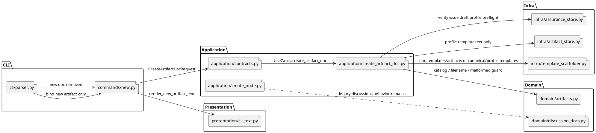

# iss-00263 New artifact command and new doc removal — 設計

## 1. 親図参照
- 親 Epic:
  - `spec-dock/active/epic/requirement.md`
  - `spec-dock/active/epic/design.md`
  - `spec-dock/active/epic/plan.md`
  - `spec-dock/active/epic/artifacts/20260701t072851z-adr-artifact-domain-filename-template-contract.md`
- Upstream Issue:
  - `iss-00262` added provider `templates/artifacts/`, scope artifact rules, and structural catalog tests.
- この Issue が所有する範囲:
  - Runtime command `spec-dock new artifact <type> ...`
  - command-time artifact filename/id allocation, malformed candidate detection, and no-write guards
  - `new doc` parser/help/registry removal
  - draft-* issue-only assurance/profile preflight
- この Issue が所有しない範囲:
  - New node scaffold default switch to `artifacts/` (iss-00264)
  - validate/sync/ADR mirror artifacts-aware expansion (iss-00265)
  - delegated authoring diff guard migration (iss-00266)
  - broad workflow docs / skills migration (iss-00267)

## 2. 既存実装 / 規約の理解
- Current `new doc` path:
  - `commands/new.py` defines `NewDocArgs`, `_discussion_doc_types`, `_run_new_doc`.
  - `cli/parser.py` binds `new doc`.
  - `application/contracts.py` exposes `CreateDiscussionDocRequest/Result` and `UseCases.create_discussion_doc`.
  - `application/create_node.py` owns discussion-doc planning, timestamp allocation, draft template routing, assurance/profile checks, and write.
  - `domain/discussion_docs.py` owns legacy/current `discussions/` filename parsing and malformed candidate detection.
  - `presentation/cli_text.py` renders `spec-dock: ok (new doc) ...`.
- Important existing constraints:
  - `discussion_docs.py` must remain for legacy `discussions/` validation and preservation.
  - `infra/artifact_store.py` already refers to canonical planning artifacts and profile templates. It must not become the scope-local artifact-doc writer.
  - Provider source of truth is under `src/spec_dock/assets/spec_dock/...`; dogfooding `spec-dock/...` is verification/mirror data.

## 3. 採用方針
- `new artifact` is not a wrapper around `new doc`.
  - Add `CreateArtifactDocRequest/Result` and `create_artifact_doc` as an independent use case.
  - Keep `CreateDiscussionDoc*` only if still required by legacy/internal tests; remove it from command-facing `UseCases` and parser/registry reachability.
- Artifact domain is separate from discussion-doc domain.
  - Add `domain/artifacts.py` for future artifact catalog, filename/id parsing, allocation helpers, and malformed artifact candidate detection.
  - Leave `domain/discussion_docs.py` untouched except for tests that no longer use `new doc`.
- Use a dedicated application module for command-time artifact docs.
  - Add `application/create_artifact_doc.py` rather than further expanding `create_node.py`.
  - Reuse safe helpers conceptually, but avoid mixing command-time artifact docs with node creation or derived artifact writers.
- `new doc` removal is complete.
  - Remove parser subcommand, command spec, help text, command-facing args, and output renderer.
  - Do not add alias, shim, deprecation wrapper, or migration hint.

## 4. モジュール依存図
Title: New artifact command runtime boundary.

Question answered: which layer owns parsing, domain contracts, preflight, write, and rendering.

Scope: provider-side runtime command, application, domain, infra template reads, presentation, tests.

## 5. Artifact catalog / filename / id contract
- Direct artifact templates:
  - `blank`, `research`, `interview`, `disc`, `decision-candidate`, `pr-repair-batch`, `adr`
- Routing-only artifact types:
  - `draft-requirement`, `draft-design`, `draft-plan`
- Unsupported future artifact types:
  - `scratch`, `note`, and any unknown type
- Typed artifact filename:
  - `<ts>-<type>-<slug>.md`
  - same-second collision: `<ts>-<nn>-<type>-<slug>.md`
  - artifact id: `<ts>-<type>` or `<ts>-<nn>-<type>`
- Blank filename:
  - `<ts>-<slug>.md`
  - same-second collision: `<ts>-<nn>-<slug>.md`
  - artifact id: `<ts>` or `<ts>-<nn>`
  - `blank` is template identity, not a filename token.
- `rules.md` is a sidecar navigation/rules file and is not an artifact doc.
- Malformed artifact candidate detection is scoped to `<scope>/artifacts/*.md`.
  - It must reject names that look like artifact intent but violate the contract.
  - It must ignore `rules.md`.
  - It must not scan or block on legacy `discussions/` malformed candidates for `new artifact`.

## 6. Command / request contract
- CLI shape:
  - `spec-dock new artifact <type> --initiative <id> --title "..." [--slug ...]`
  - `spec-dock new artifact <type> --epic <id> --title "..." [--slug ...]`
  - `spec-dock new artifact <type> --issue <id> --title "..." [--slug ...]`
- Exactly one scope flag is required.
- Scope id shorthand resolves like existing `new doc` behavior:
  - `--initiative 1` -> `init-00001`
  - `--epic 2` -> `epic-00002`
  - `--issue 3` -> `iss-00003`
- Result:
  - `artifact_id`
  - `artifact_type`
  - `scope_node_id`
  - `path`
  - `warnings`
- CLI output:
  - `spec-dock: ok (new artifact) type=<type> id=<artifact_id> scope=<scope_id> path=<repo-relative-path>`

## 7. Template routing
- Direct templates load from `spec-dock/templates/artifacts/<type>.md`.
- `blank` uses `templates/artifacts/blank.md` but omits the type token from filename/id.
- `draft-requirement`:
  - Issue scope only.
  - Source template: `templates/issue/requirement.md`.
  - No `.assurance.json` profile check is required beyond normal issue target resolution.
- `draft-design` and `draft-plan`:
  - Issue scope only.
  - Verify `.assurance.json` through `AssuranceStore.verify_contract` before any write or old-node setup.
  - Source templates:
    - `templates/issue-profiles/<authorized_profile>/design.md`
    - `templates/issue-profiles/<authorized_profile>/plan.md`
  - Missing, invalid, stale, unsupported, empty, symlinked, or outside-workspace profile templates fail no-write.
- Initiative/Epic `draft-*`:
  - Unsupported.
  - Fail no-write before creating `artifacts/`, `rules.md`, or artifact docs.

## 8. Old-node setup and preservation
- Legacy nodes may lack `<scope>/artifacts/`.
- For successful non-failing artifact creation:
  - Create `<scope>/artifacts/` on demand.
  - Create `<scope>/artifacts/rules.md` as a relative symlink to provider-installed rules source:
    - initiative -> `spec-dock/docs/rules/initiative/artifacts.md`
    - epic -> `spec-dock/docs/rules/epic/artifacts.md`
    - issue -> `spec-dock/docs/rules/issue/artifacts.md`
- No-write order:
  - Resolve scope, validate type/slug, run draft/profile preflight, validate rules source, and validate existing `artifacts/rules.md` conflict before any mutation.
- Existing `discussions/`:
  - Must not be moved, renamed, deleted, or link-rewritten.
  - Legacy `discussions/rules.md` remains untouched.

## 9. Failure / no-write boundaries
All of the following fail before artifact write. Where specified, they also fail before on-demand `artifacts/` setup:
- Unknown artifact type.
- `scratch` / `note`.
- Invalid slug or title that cannot derive slug.
- Missing/multiple scope flags.
- Scope id not found or kind mismatch.
- `draft-*` with initiative/epic scope.
- Missing/stale/invalid `.assurance.json` for issue `draft-design` / `draft-plan`.
- Unsupported authorized profile.
- Missing/non-file/empty/symlinked/outside profile template.
- Missing direct template for direct artifact type.
- Existing malformed artifact candidate in `artifacts/`.
- Duplicate artifact id / same-second suffix exhaustion.
- Existing destination path.
- `artifacts/rules.md` conflict (regular file, wrong symlink, broken symlink, non-file conflict).

## 10. `new doc` removal design
- Remove from:
  - `commands/new.py` command specs and args.
  - `cli/parser.py` `new` subparser.
  - command-facing `UseCases`.
  - `presentation/cli_text.py` public new-doc renderer if no internal caller remains.
- Retain only as non-command legacy code if tests or validation still need discussion-doc helpers.
- `new --help` must mention `artifact` and not mention `doc`.
- `new doc ...` must fail as ordinary argparse invalid choice / unknown subcommand.
- Failure must not include custom migration guidance such as "use new artifact".

## 11. 要件 -> 設計マッピング
- AC-263-001:
  - DES-263-001: blank artifact uses `templates/artifacts/blank.md`, writes to `artifacts/<ts>-<slug>.md`, id omits `blank`.
- AC-263-002:
  - DES-263-002: typed artifact uses `artifacts/<ts>-<type>-<slug>.md`.
- AC-263-003:
  - DES-263-003: artifact domain exposes closed catalog; unknown/scratch/note fail no-write.
- AC-263-004:
  - DES-263-004: parser/help/registry remove `new doc` with no custom hint.
- AC-263-005:
  - DES-263-005: issue draft routing uses existing requirement/profile templates and assurance preflight.
- AC-263-006:
  - DES-263-006: initiative/epic draft scopes fail no-write before setup/write.
- AC-263-007:
  - DES-263-007: old-node on-demand setup creates `artifacts/` and rules symlink without touching `discussions/`.

## 12. テスト戦略
- CLI happy path tests:
  - blank issue artifact success.
  - typed epic artifact success.
  - full direct catalog success.
  - stdout path/id contract.
  - UTC date uses artifact id instant.
  - same-second suffix handling.
- CLI removal tests:
  - `new --help` contains `artifact`, not `doc`.
  - `new doc ...` fails as argparse invalid choice, no migration hint.
- Negative no-write tests:
  - unknown type, `scratch`, `note`.
  - invalid slug.
  - malformed artifact candidates.
  - duplicate/suffix exhaustion.
  - `draft-*` initiative/epic.
  - missing/stale/invalid assurance.
  - invalid profile template states.
  - bad `artifacts/rules.md` conflict.
- Old-node preservation tests:
  - remove `artifacts/` from an existing fixture node, run `new artifact`, assert `artifacts/` + relative `rules.md` symlink created.
  - assert existing `discussions/` files and `discussions/rules.md` remain untouched.
- Regression boundaries:
  - Legacy `discussions/` validation tests remain for validation/sync surfaces.
  - New artifact creation does not fail because of malformed legacy `discussions/` candidates.

## 13. リスク / 後続引き渡し
- Naming risk:
  - Existing `artifact_store.py` / `artifact_writer.py` use "artifact" for planning/derived outputs. Implementation should use clear names such as `CreateArtifactDoc*` and `domain/artifacts.py` to avoid overloading infra classes.
- Test blast radius:
  - `tests/cli_runtime/test_new.py`, `tests/cli_runtime/test_runtime_new_doc_s09.py`, wrapper/help tests, and unit command tests may need coordinated updates.
- Downstream:
  - `iss-00264` consumes on-demand artifact setup and rules expectations for default scaffold.
  - `iss-00265` makes validate/sync/ADR mirror artifacts-aware.
  - `iss-00266` migrates delegated authoring output.
