# epic-00259 Artifacts Directory Future Only Adoption — 計画（Issue と実施順序）

## この計画で閉じる E-RQ / E-AC
- E-RQ:
  - E-RQ-001 Future working artifact surface.
  - E-RQ-002 Legacy discussions preservation.
  - E-RQ-003 Unified `new artifact` command surface.
  - E-RQ-004 Artifact type catalog.
  - E-RQ-005 Safety-sensitive draft artifacts.
  - E-RQ-006 Validation / sync / projection parity.
  - E-RQ-007 Provider-side source of truth and dogfooding.
  - E-RQ-008 Workflow and skill guidance alignment.
- E-AC:
  - E-AC-001 through E-AC-010.

## 課題分割方針（Issue slicing policy）
- 分割原則:
  - Policy-only Issue は作成しない。Issue 01 相当の判断は accepted ADR とこの Epic requirement/design/plan で所有する。
  - Issue は実装可能な成果物単位に分ける。
  - Domain / filename contract を先に固定し、その上に template / command / scaffold / validation-sync / docs-skills / dogfooding を積む。
  - `new doc` removal は command 実装 Issue に含め、compatibility shim を別 Issue にしない。
  - Draft-* と ADR は例外扱いせず、artifact command / template / safety preflight の中で扱う。
  - Dogfooding Issue は最後に置き、provider-side implementation と docs/skills alignment の後に実施する。
- 例外:
  - Implementation 中に scope / acceptance criteria を変える必要が出た場合は、この Epic の requirement/design に戻して fresh spec-reviewer gate を再実行する。
  - Existing discussion validation を緩める必要が出た場合は ADR と requirement に反するため、実装 Issue 内で判断せず Epic へ戻す。

## 課題一覧（Issue list / 順序 / tranche 付き）
- iss-00261-artifact-domain-model-and-filename-contract（GitHub #261）:
  - 目的:
    - `artifacts/` 用の domain model、type catalog、filename parser、artifact id、collision handling、malformed candidate detection を追加する。
  - 成果物:
    - Artifact domain module.
    - Parser / generator / validation helpers.
    - Unit tests for typed / blank / ADR / draft-* / malformed / legacy non-interference.
  - tranche:
    - T1 foundation.
  - closes:
    - E-RQ-001, E-RQ-004, part of E-RQ-006.
    - E-AC-001, E-AC-002, E-AC-004, E-AC-007 foundations.
  - 依存:
    - accepted ADR and Epic requirement/design.
- iss-00262-artifact-templates-and-rules（GitHub #262）:
  - 目的:
    - `templates/artifacts/` catalog and rules を追加し、blank / generic / ADR / draft-* / delegated evidence-friendly templates の境界を固定する。
  - 成果物:
    - `blank`, `research`, `interview`, `disc`, `decision-candidate`, `pr-repair-batch`, `adr`, `draft-requirement`, `draft-design`, `draft-plan` templates or template routing.
    - `artifacts/rules.md` source docs.
    - Template README update.
  - tranche:
    - T1 foundation.
  - closes:
    - E-RQ-004, E-RQ-005, part of E-RQ-008.
    - E-AC-001, E-AC-002, E-AC-004, E-AC-006.
  - 依存:
    - `iss-00261` for type naming and id contract.
- iss-00263-new-artifact-command-and-new-doc-removal（GitHub #263）:
  - 目的:
    - `spec-dock new artifact <type>` runtime command を追加し、`new doc` を parser / help / registry から削除する。
    - `draft-requirement` / `draft-design` / `draft-plan` の issue-scope `.assurance.json` / authorized profile preflight を `new artifact` 経由へ移行する。
  - 成果物:
    - `CreateArtifactDocRequest/Result`.
    - `create_artifact_doc` use case.
    - CLI command registration and help.
    - Presentation text.
    - On-demand `artifacts/` creation and no-overwrite behavior.
    - `new doc` unsupported behavior tests.
    - Draft artifact profile resolver and preflight checks for existing issue `.assurance.json`.
    - No-write fail-closed behavior for missing / stale / invalid authorized profile.
    - Tests for `draft-requirement`, `draft-design`, `draft-plan`, unsupported initiative/epic scopes, and no canonical writes on preflight failure.
  - tranche:
    - T2 command runtime.
  - closes:
    - E-RQ-001, E-RQ-003, E-RQ-004, E-RQ-005.
    - E-AC-001, E-AC-002, E-AC-003, E-AC-004, E-AC-006, E-AC-009.
  - 依存:
    - `iss-00261`.
    - `iss-00262` for templates.
- iss-00264-future-node-scaffold-artifacts-default（GitHub #264）:
  - 目的:
    - New initiative / epic / issue scaffold を `artifacts/` default に切り替え、`discussions/` default creation を止める。
  - 成果物:
    - Provider-side node templates / scaffolder update.
    - Installer/init/update expectations.
    - Scaffold tests.
    - Legacy nodes without `artifacts/` remain valid.
  - tranche:
    - T2 scaffold runtime.
  - closes:
    - E-RQ-001, E-RQ-002, E-RQ-007.
    - E-AC-007, E-AC-008.
  - 依存:
    - `iss-00262` for `artifacts/rules.md`.
    - `iss-00263` for on-demand artifact creation behavior.
- iss-00265-validation-sync-adr-mirror-and-agent-projection（GitHub #265）:
  - 目的:
    - validate / sync / `.agent` projection / ADR mirror を artifacts-aware にし、legacy discussions と canonical docs を混同しない。
  - 成果物:
    - Artifact filename validation and duplicate guard.
    - Old-only / new-only / mixed layout validation.
    - ADR mirror collection from `discussions/` and `artifacts/`.
    - Sync / `.agent` labels for canonical docs, future artifacts, legacy discussions.
  - tranche:
    - T3 integration.
  - closes:
    - E-RQ-002, E-RQ-006.
    - E-AC-005, E-AC-007.
  - 依存:
    - `iss-00261`.
    - `iss-00263`.
    - `iss-00264` for scaffold fixtures.
- iss-00266-delegated-authoring-artifacts-boundary（GitHub #266）:
  - 目的:
    - system-architect / implementation-planner / delegated authoring output の permission boundary、diff guard、validation、report evidence guidance を `artifacts/` direct child に切り替える。
  - 成果物:
    - Runtime/domain/application delegated authoring contract update.
    - Workflow docs update for artifacts output.
    - Failure-mode and no-canonical-write assertions.
    - Tests or scripted diff-guard checks.
  - tranche:
    - T3 integration.
  - closes:
    - E-RQ-005, E-RQ-008.
    - E-AC-006, E-AC-008.
  - 依存:
    - `iss-00263`.
    - `iss-00265` for validation semantics.
- iss-00267-workflow-docs-skills-and-readme-alignment（GitHub #267）:
  - 目的:
    - Shipped workflow docs, rules, README, template guidance, and repo-local / installed skills を `new artifact` / `artifacts/` future surface に揃える。
  - 成果物:
    - Provider-side docs and install_root skills updates.
    - Dogfooding mirror inspection/update when appropriate.
    - Search evidence for remaining `new doc` references classified as removed, legacy, or historical.
  - tranche:
    - T4 guidance.
  - closes:
    - E-RQ-008, part of E-RQ-002.
    - E-AC-003, E-AC-008.
  - 依存:
    - `iss-00263`.
    - `iss-00266`.
- iss-00268-dogfood-artifacts-without-migrating-discussions（GitHub #268）:
  - 目的:
    - `spec-dock` dogfooding workspace で `artifacts/` future creation を実証し、existing `discussions/` を移動しないことを確認する。
  - 成果物:
    - Blank and typed artifact creation evidence.
    - ADR / draft or delegated-output smoke where safe.
    - `validate` / `sync` output.
    - Epic report evidence.
  - tranche:
    - T5 dogfooding / closeout.
  - closes:
    - E-RQ-007.
    - E-AC-010 and final cross-E-AC evidence.
  - 依存:
    - `iss-00261` through `iss-00267`.

## Issue-local planning artifacts
| Issue | GitHub | Requirement | Design draft | Plan draft | Authorized profile | Notes |
|---|---:|---|---|---|---|---|
| `iss-00261` | #261 | `approved` | `draft` | `draft` | `standard` | Foundation domain contract. |
| `iss-00262` | #262 | `approved` | `draft` | `draft` | `standard` | Depends on `iss-00261`. |
| `iss-00263` | #263 | `approved` | `draft` | `draft` | `standard` | Command and `draft-*` safety owner. |
| `iss-00264` | #264 | `approved` | `draft` | `draft` | `standard` | Scaffold default owner. |
| `iss-00265` | #265 | `approved` | `draft` | `draft` | `standard` | Validation/sync/ADR mirror owner. |
| `iss-00266` | #266 | `approved` | `draft` | `draft` | `standard` | Delegated authoring boundary owner. |
| `iss-00267` | #267 | `approved` | `draft` | `draft` | `standard` | Docs/skills alignment owner. |
| `iss-00268` | #268 | `approved` | `draft` | `draft` | `standard` | Dogfooding and Epic closeout owner. |

These Issue design/plan documents are intentionally draft handoff artifacts. Each Issue execution must still run its own issue-planning promotion gates before implementation if it needs to upgrade draft design/plan to approved execution authority.

## 依存順 / tranche map

```plantuml
@startuml
skinparam monochrome true
left to right direction

rectangle "T1 Foundation" {
  [01 domain + filename]
  [02 templates + rules]
}
rectangle "T2 Runtime" {
  [03 new artifact + remove new doc]
  [04 scaffold artifacts default]
}
rectangle "T3 Integration" {
  [05 validate/sync/ADR mirror/projection]
  [06 delegated authoring boundary]
}
rectangle "T4 Guidance" {
  [07 docs/skills/README alignment]
}
rectangle "T5 Proof" {
  [08 dogfooding closeout]
}

[01 domain + filename] --> [02 templates + rules]
[01 domain + filename] --> [03 new artifact + remove new doc]
[02 templates + rules] --> [03 new artifact + remove new doc]
[02 templates + rules] --> [04 scaffold artifacts default]
[03 new artifact + remove new doc] --> [04 scaffold artifacts default]
[03 new artifact + remove new doc] --> [05 validate/sync/ADR mirror/projection]
[04 scaffold artifacts default] --> [05 validate/sync/ADR mirror/projection]
[05 validate/sync/ADR mirror/projection] --> [06 delegated authoring boundary]
[06 delegated authoring boundary] --> [07 docs/skills/README alignment]
[07 docs/skills/README alignment] --> [08 dogfooding closeout]
@enduml
```

## 実行 lane / Epic単位PR 方針
- Delivery policy:
  - 各 Issue ごとに個別 PR は作成しない。
  - `iss-00261` から `iss-00268` までを同一 Epic delivery branch 上で段階的に実装する。
  - 各 Issue は issue-local execution gate、report evidence、reviewer gates、commit/no-op gate を閉じる。
  - 全 Issue 完了後、`iss-00268` で dogfooding evidence と Epic report closeout を行う。
  - その後、Epic-wide pre-PR quality gate を実行し、問題がなければ Epic単位で1つの PR を作成する。
- Execution wave:
  - Wave 1 foundation: `iss-00261`, then `iss-00262`.
  - Wave 2 runtime: `iss-00263`, then `iss-00264`.
  - Wave 3 integration: `iss-00265`, then `iss-00266`.
  - Wave 4 guidance: `iss-00267`.
  - Wave 5 proof and PR handoff: `iss-00268`.
- Commit policy:
  - 各 Issue / milestone の commit候補 gate は維持する。
  - PR は Epic closeout 後に1つだけ作成する。
  - 途中 Issue commit は reviewable history のために残してよいが、GitHub PR delivery は Epic-level gate まで待つ。

## 統合チェックポイント
- G1 Requirement gate:
  - Epic requirement が accepted ADR / interviews と一致し、ZIP 原案から上書きされた decisions を明示している。
  - Fresh `spec-reviewer` pass を得るまで design promotion は incomplete。
- G2 Design gate:
  - Epic design が domain / command / validation / sync / delegated authoring / docs surface の責務境界を示している。
  - `new doc` removal と legacy `discussions/` preservation が矛盾なく説明されている。
  - Fresh `spec-reviewer` pass を得るまで plan promotion は incomplete。
- G3 Plan gate:
  - Issue candidate が execution-slice であり、decision-only Issue を含まない。
  - Actual Issues `iss-00261` through `iss-00268` were created after fresh Epic plan reviewer pass.
  - Issue-local requirement/design/plan draft package is created for all Issues before implementation.
- G4 Integration checkpoint:
  - T2 終了時点で `new artifact` command と `new doc` removal の runtime behavior が観測可能である。
  - T2 終了時点で `draft-*` issue-scope artifacts preserve `.assurance.json` / authorized profile checks and fail closed without writes for unsupported or invalid contexts.
  - T3 終了時点で validation / sync / ADR mirror / delegated authoring boundary が mixed layout で通る。
- G5 Rollout / docs checkpoint:
  - T4 終了時点で docs / skills / README の guidance が future `new artifact` に揃っている。
  - Remaining `new doc` references are either removed or explicitly historical/legacy examples.
- G9 Final Epic spec review:
  - All required Issues are complete, dogfooding evidence is recorded, and Epic-wide final spec/code/QA review gates are complete before PR handoff.
- G10 Epic PR delivery gate:
  - One Epic-level PR is created only after G9 passes.
  - The PR body links Epic `#259` and child Issues `#261` through `#268`, and summarizes Epic-wide quality gate evidence.

## 品質ゲート
- test:
  - `uv run pytest tests/unit` focused lanes for domain/application/infra changes.
  - `uv run pytest tests/cli_runtime` focused lanes for command/scaffold/validate/sync.
  - Focused draft-artifact tests must cover `.assurance.json` lookup, authorized profile acceptance, invalid/stale/missing profile rejection, unsupported initiative/epic scopes, and no-write failure behavior.
  - Full `uv run pytest` if command/scaffold/sync changes cross multiple runtime surfaces.
- observability:
  - CLI output includes type/id/path.
  - validate diagnostics distinguish `artifact` from `discussion` failures.
  - sync / `.agent` output labels canonical docs, future artifacts, legacy discussions.
- migration:
  - No existing `discussions/` move/rename/link rewrite.
  - Old-only / new-only / mixed fixtures remain valid.
- docs:
  - Provider-side docs and shipped skills are primary.
  - Dogfooding docs are inspected/refreshed only as validation or mirror work.
- review:
  - Each downstream Issue must run its own issue planning/execution gates.
  - Epic-level final pre-PR gate follows `workflow_epic.md`.

## ロールアウト / ドキュメント影響
- ロールアウト順序:
  - T1: Add artifact model and templates without changing default creation behavior.
  - T2: Introduce command and scaffold cutover.
  - T3: Integrate validation / sync / projection and delegated output boundary.
  - T4: Update workflow docs / skills / README.
  - T5: Dogfood in this repo without migrating legacy discussions.
- 契約 / docs 更新:
  - `spec-dock/docs/workflow_*`, `phase_*`, `reference_naming.md`, `reference_sync.md`, `templates/README.md`, `docs/rules/**`.
  - `src/spec_dock/assets/install_root/.agents/skills/**` and local dogfooding skill mirror as appropriate.
  - README command examples.

## 課題準備完了条件（Issue readiness criteria）
- Issue creation before implementation requires:
  - Epic requirement/design/plan fresh `spec-reviewer` pass recorded in `report.md`.
  - Candidate Issue title/slug/responsibility from this plan.
  - No unresolved blocking EAL / delegated draft failure mode.
  - Each Issue requirement/design/plan authored through issue planning workflow after creation.
  - Dependency edges added only via `spec-dock deps add` after actual issue IDs exist; no direct `.meta.json` editing.
- Issue creation result:
  - Created Issues: `iss-00261` (#261), `iss-00262` (#262), `iss-00263` (#263), `iss-00264` (#264), `iss-00265` (#265), `iss-00266` (#266), `iss-00267` (#267), `iss-00268` (#268).
  - Dependency edges were added by `spec-dock deps add`.
  - Each Issue has approved `requirement.md` plus draft `design.md` and draft `plan.md` authored as a cross-Issue package.
- Each Issue must include:
  - Scope and non-scope mapped to E-RQ / E-AC.
  - Provider-side file impact.
  - Focused verification commands.
  - Rollback / compatibility note.

## 最終完了条件
- E-AC 完了:
  - E-AC-001 through E-AC-010 have direct command/test/report evidence.
- 統合 / ロールアウト完了:
  - Required Issues are complete or explicitly made unnecessary by a fresh reviewed plan update.
  - `./spec-dock/scripts/spec-dock validate` passes.
  - `sync` evidence confirms artifacts / discussions / canonical docs are distinguished.
  - Dogfooding evidence exists and confirms no `discussions/` migration.
- docs 影響解決:
  - Provider-side docs / skills / README reflect `new artifact`.
  - Remaining `new doc` references are intentionally historical/legacy or removed.

## 依存 / ブロッカー
- D-001:
  - Requirement / design / plan reviewer gates passed before concrete Issue creation. Cross-Issue package review remains required before implementation handoff.
- D-002:
  - Current workflow docs still mention `new doc` / `discussions/` delegated output; these are implementation targets, not planning blockers after ADR acceptance.
- D-003:
  - Existing tests are heavily `new doc` / `discussions/` oriented; downstream Issues must deliberately classify them as removed-command tests, legacy-fixture tests, or replacement `new artifact` tests.
- D-004:
  - Sub-agent static adapter still produced one `discussions/` draft during this planning session; it is retained as historical evidence but not treated as compliant future delegated output.

## 未確定事項
- なし:
  - No scope-affecting open questions remain.
  - Concrete Issue IDs, dependency metadata, and issue-local requirement/design/plan package are now created.
