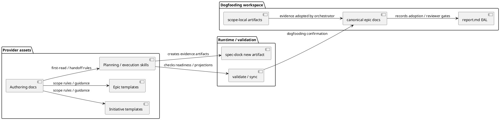
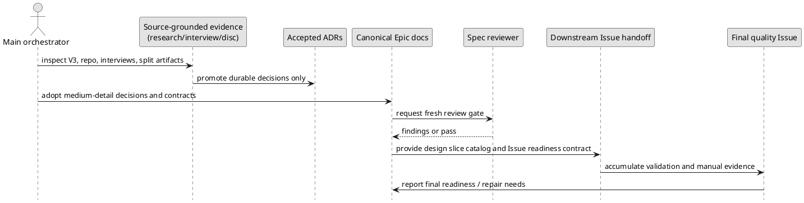

# 20260702t031957z-disc Epic Design Draft For Upstream Planning Governance And Templates

## Provenance and Integration Note

This is a delegated `system-architect` design draft for main-orchestrator integration into canonical `design.md`. It is not canonical authority, does not claim reviewer pass, and does not claim phase promotion.

Source requirement revision:
- `spec-dock/active/epic/requirement.md` as read on 2026-07-02. The file is still scaffold/template-like, so the effective requirement evidence is the user-approved interview set, accepted ADRs, and repo survey listed in `source_paths`.

Diff guard note:
- `diff_guard_result: failed` because the target epic already had pre-existing untracked artifacts and a modified `report.md` before this delegated draft was created. This draft edited only the new artifact path above.

## 1. Requirement Coverage

The design should cover the following adopted requirements and constraints:

| Requirement / decision evidence | Design coverage |
|---|---|
| Flexible six-Issue baseline | Keep V3's six Issues as the provisional design-slice baseline, but allow re-slicing only when independent reviewability, responsibility boundary, verifiability, or one-PR delivery would degrade. |
| One PR default | Treat the Epic as one integrated provider-side asset change by default; the final quality Issue owns epic-wide validation, manual test summary, review repair loop, and PR readiness. |
| Medium canonical detail with split references | Put adopted decisions, boundaries, handoff contracts, and gates in canonical docs; keep long analysis/playbooks/examples in split artifacts or ADRs. |
| Scope-layering reference ADR | Add one provider-side `docs/authoring/scope-layering.md` reference and keep workflow/docs/skills/templates thinly linked to it. |
| Architecture-neutral templates ADR | Redesign Initiative/Epic templates to be architecture-neutral and architecture-aware, not DDD/EDA-first. |
| Complete-understanding ADR and Grill With Docs research | Require source-grounded investigation, minimal one-question interviews for remaining product decisions, and adoption into canonical docs/ADR/report ledger before downstream execution. |
| Handoff inspection Option B | Block machine-checkable structural gaps; leave semantic sufficiency to fresh reviewer findings. |

Coverage gap:
- Canonical `requirement.md` remains a template. The main orchestrator should either finalize requirement first or explicitly integrate these adopted requirement facts before promoting design.

## 2. Existing Context Findings

- Parent initiative `init-local-00003` is an open-ended architecture maintenance lane for source-of-truth, sync, naming, state boundary, dogfooding continuity, and architecture governance.
- `epic-00270` canonical docs are still scaffold-like, but the artifact set contains the operative evidence: V3 raw intake, repo survey, split discussion artifacts, accepted ADRs, and answered user interviews.
- Current provider-side Initiative templates are generic strategic scaffolds and do not yet make actor/stakeholder landscape, capability candidates, source-of-truth ownership, transition architecture, or Epic handoff explicit enough.
- Current provider-side Epic templates have useful technical sections, but they do not yet explicitly guide target capability/model envelope, lifecycle shared across Issues, design slice catalog, Issue handoff package, or suggested Issue grade.
- Planning skills and workflow docs already enforce fresh reviewer gates, artifact evidence, main-orchestrator canonical ownership, and delegated authoring limits. This Epic should strengthen upstream Initiative/Epic planning surfaces, not redesign the whole workflow engine.
- `artifacts/` is the current working evidence destination. Legacy `discussions/` remains preservation input, not the primary destination for new working evidence.

## 3. Design Decisions

### D-001 Scope-Layering Publication

Adopt the accepted ADR's constrained Option A:
- Create one reusable provider-side reference: `src/spec_dock/assets/spec_dock/docs/authoring/scope-layering.md`.
- The reference owns scope ownership, decision-radius rules, artifact-to-canonical authority flow, and anti-rules.
- Existing workflow docs, phase docs, templates, and skills should link to this reference instead of duplicating its full table.

### D-002 Architecture-Neutral Template Policy

Initiative and Epic templates should use architecture-neutral, architecture-aware language:
- Prefer capability, context, lifecycle, operation/command/query/event portfolio, contract portfolio, invariant/constraint, source-of-truth, and handoff terms.
- Treat DDD/EDA terms as optional aids when the repository evidence supports them.
- Do not require DDD/EDA-specific sections as mandatory scaffold.

### D-003 Medium Canonical Detail

Canonical `design.md` should include:
- adopted decisions,
- scope boundaries,
- authority and reference flow,
- component/module impact,
- Issue handoff contract,
- flow/gate model,
- compatibility, observability, and test strategy.

Canonical `design.md` should not include:
- raw V3 prose dumps,
- long playbook examples,
- full transcript content,
- implementation task order that belongs in `plan.md`.

### D-004 Flexible Six-Issue Baseline

Use the V3 six-Issue set as the provisional design-slice catalog:
1. Initiative template redesign.
2. Epic template redesign.
3. Planning skills and workflow docs alignment.
4. Epic execution handoff behavior.
5. Smoke tests and template validation.
6. Epic quality gate, manual tests, review repair, and PR delivery readiness.

Re-slicing is allowed only under the adopted medium gate:
- existing six Issues would degrade independent reviewability, responsibility boundary, verifiability, or one-PR delivery;
- canonical `plan.md` is updated;
- a fresh `spec-reviewer` gate is run.

### D-005 Handoff Inspection Option B

Epic execution / readiness inspection should block machine-checkable structural gaps:
- missing canonical docs,
- missing fresh reviewer pass where required,
- missing Issue readiness contract,
- missing executable Issue plan steps,
- missing delegation contract where relevant,
- missing required verification,
- missing reviewer focus,
- unresolved Spec Authoring Gate or unresolved Evidence Adoption Ledger entry.

Semantic quality issues such as weak acceptance criteria, insufficient test depth, or questionable target files should be reviewer findings unless they also create a machine-checkable structural absence.

### D-006 One-PR Delivery Default

Treat this Epic as one coherent delivery unit by default. Issue-level PR splitting is not planned. If one-PR delivery becomes impractical, the main orchestrator should record evidence, update canonical plan, and rerun the relevant reviewer gate before changing delivery strategy.

## 4. Alternatives Considered

| Decision point | Rejected alternative | Reason |
|---|---|---|
| Scope-layering publication | Distribute the scope table across workflow docs/templates/skills | Creates drift and makes the first-read source unclear. |
| Scope-layering publication | Use ADR as the daily reference surface | ADR explains why the decision exists, but is weaker as day-to-day authoring guidance. |
| Template vocabulary | Make DDD/EDA mandatory | Makes SpecDock look like a DDD/EDA-specific tool and conflicts with lightweight CLI/docs-tool use. |
| Canonical detail level | Copy most V3 reference content into canonical docs | Too heavy for review and future maintenance. |
| Canonical detail level | Keep canonical docs thin and rely on raw artifacts | Too weak for reviewer gate and downstream Issue handoff. |
| Handoff inspection | Semantic inspection by epic execution entrypoint | Turns coordinator/runtime into reviewer and blurs responsibility. |
| Delivery boundary | Issue-by-Issue PRs as the normal path | Splits template/docs/skills/tests consistency across PRs and weakens final integrated validation. |

## 5. Boundary / Contract Model

### Scope Ownership

| Scope | Owns | Must not own |
|---|---|---|
| Initiative | Strategic change, capability landscape, context ownership, source of truth, strategic invariants, transition architecture, Epic handoff | Issue-level implementation structure, TDD cycles, private code details |
| Epic | Capability/model envelope, lifecycle, cross-Issue invariants, contract portfolio, design slice catalog, Issue handoff package | Product-wide source-of-truth changes, detailed TDD cycles, private helper design |
| Issue | One observable behavior or local model/contract delta with verification implications | Redefining Epic envelope, broad Initiative decisions, unrelated refactors |
| Issue Plan | Execution milestones, behavior backlog, validation ladder, report evidence mapping | New requirements, new design contracts, parent model changes |
| Report | Observed evidence, reviewer verdicts, deviations, adoption ledger, delivery evidence | Future architecture decisions or planned obligations |

### Authority Flow

```text
raw artifact / discovery evidence
  -> synthesized artifact / interview / decision candidate
    -> canonical requirement/design/plan or accepted ADR
      -> report.md Evidence Adoption Ledger / Spec Authoring Gate
        -> downstream Issue planning / execution handoff
```

Raw artifacts and delegated drafts are evidence. They become implementation-relevant only after main-orchestrator adoption into canonical docs, accepted ADR, and/or `report.md` Evidence Adoption Ledger, followed by the required reviewer gates.

## 6. Dependency Analysis

Design dependency order:
1. Canonical requirement/design/report adoption of accepted ADRs and user-approved interviews.
2. Scope-layering reference and thin links from workflow/docs/templates/skills.
3. Initiative template redesign.
4. Epic template redesign.
5. Planning skill/workflow updates to consume the new references and templates.
6. Epic execution handoff inspection updates.
7. Smoke/template validation and dogfooding mirror checks.
8. Final quality gate and one-PR readiness evidence.

Re-slicing dependency rule:
- A downstream Issue may not create or redefine parent-scope design decisions.
- If implementation reveals a parent design gap, return to Epic design/plan, record the evidence, and rerun the fresh reviewer gate.

## 7. Source of Record

Primary source of record after integration:
- `spec-dock/active/epic/requirement.md` for accepted WHAT/WHY/scope.
- `spec-dock/active/epic/design.md` for adopted HOW/boundary/contracts.
- `spec-dock/active/epic/plan.md` for Issue slicing/order/readiness.
- `spec-dock/active/epic/report.md` for Evidence Adoption Ledger, Spec Authoring Gate, reviewer evidence, and delivery evidence.
- Accepted ADRs for durable architecture decisions.

Provider-side source of truth for implementation:
- `src/spec_dock/assets/spec_dock/templates/initiative/`
- `src/spec_dock/assets/spec_dock/templates/epic/`
- `src/spec_dock/assets/spec_dock/docs/`
- `src/spec_dock/assets/install_root/.agents/skills/`
- runtime code only where command behavior or validation/smoke support is required.

Dogfooding workspace:
- `spec-dock/` is validation and generated-consumer confirmation, not the primary implementation source unless the task is explicitly dogfooding-data-only.

## 8. Data Flow / Domain Model / Interface Contract

### Component View



Diagram metadata:
- Title: Upstream planning governance asset model.
- Question answered: Which assets own templates, reference docs, skill guidance, and adoption evidence?
- Scope: Provider assets, runtime validation commands, dogfooding confirmation.
- Excluded details: Exact implementation file edits and test function names.
- Update trigger: Any change to source-of-truth ownership, artifact authority, or provider/dogfooding boundary.

### Main Flow



Diagram metadata:
- Title: Evidence-to-canonical-to-handoff flow.
- Question answered: How does evidence become safe downstream execution input?
- Scope: Epic design/plan/report adoption path and handoff readiness.
- Excluded details: Individual Issue implementation steps.
- Update trigger: Changes to authoring gate, reviewer gate, or handoff inspection policy.

### Issue Handoff Package Contract

Each downstream Issue should receive:
- parent Initiative/Epic IDs;
- applicable parent requirement IDs;
- applicable parent design decisions;
- allowed local delta;
- forbidden parent boundary changes;
- acceptance criteria seed;
- model/contract/lifecycle constraints;
- expected evidence type;
- suggested Issue grade;
- dependencies;
- escalation triggers;
- relevant artifacts and ADRs.

Suggested grade signal:
- docs-only wording: `lite`;
- normal local behavior: `standard`;
- public/shared contract, workflow, compatibility, migration, metadata: `strict`;
- safety/security/privacy/destructive/GitHub mutation/rollback-hard: `critical`.

## 9. File / Module Change Plan

Candidate implementation surfaces for later Issues:

| Surface | Expected change |
|---|---|
| `src/spec_dock/assets/spec_dock/docs/authoring/scope-layering.md` | New narrow provider-side reference for scope ownership, decision radius, authority flow, and anti-rules. |
| `src/spec_dock/assets/spec_dock/docs/workflow_initiative.md` | Thin link to scope-layering reference; avoid duplicate full table. |
| `src/spec_dock/assets/spec_dock/docs/workflow_epic.md` | Thin link plus Epic-level handoff/readiness guidance. |
| `src/spec_dock/assets/spec_dock/docs/workflow_issue.md` | Thin link emphasizing Issues must not redefine parent envelope. |
| `src/spec_dock/assets/spec_dock/docs/phase_*` | Add focused references only where phase gates need scope-layering or handoff context. |
| `src/spec_dock/assets/spec_dock/templates/initiative/{requirement,design,plan}.md` | Add strategic/capability/source-of-truth/Epic handoff prompts without implementation-level overreach. |
| `src/spec_dock/assets/spec_dock/templates/epic/{requirement,design,plan}.md` | Add capability/model envelope, design slice catalog, Issue handoff package, suggested grade, and final gate prompts. |
| `src/spec_dock/assets/install_root/.agents/skills/spec-dock-initiative-planning/SKILL.md` | Align first-read and output expectations to new template/reference flow. |
| `src/spec_dock/assets/install_root/.agents/skills/spec-dock-epic-planning/SKILL.md` | Align Epic design/plan authoring with flexible six-Issue baseline and handoff package. |
| `src/spec_dock/assets/install_root/.agents/skills/spec-dock-epic-execution/SKILL.md` | Add Option B handoff inspection split: structural blockers vs reviewer findings. |
| `tests/` | Add focused scaffold/template/doc/skill smoke assertions and runtime checks where behavior changes. |
| `spec-dock/` | Inspect or refresh as dogfooding confirmation after provider-side changes. |

Do not make implementation edits from this draft. This table is for canonical design/plan integration.

## 10. Migration / Compatibility / Rollback

Migration:
- This Epic is primarily provider asset and workflow guidance change; no database migration is expected.
- Existing repos receive new templates/docs/skills through `spec-dock update`.
- Dogfooding workspace impact should be inspected after provider-side changes and update/sync validation.

Compatibility:
- Templates must remain architecture-neutral and must not make DDD/EDA sections mandatory.
- Existing historical artifacts/discussions remain preservation input.
- New working evidence should use `artifacts/` and `new artifact`.

Rollback:
- Revert provider asset changes by Issue or PR if validation fails.
- Do not revive local-only or legacy discussion-first authoring as a rollback strategy.
- If `scope-layering.md` grows too broad, move lifecycle detail back to workflow docs and keep only scope ownership/routing rules in the reference.
- If one-PR delivery becomes impractical, update canonical plan and reviewer evidence before changing PR strategy.

## 11. Observability

Design-time observability:
- `report.md` Evidence Adoption Ledger records which artifacts/ADRs/interviews were adopted into canonical docs.
- Spec Authoring Gate records investigated facts, open gaps, reviewer scope, verdict, and promotion decision.
- Fresh `spec-reviewer` pass remains required for canonical promotion.

Runtime/repo observability for later implementation:
- `./spec-dock/scripts/spec-dock validate`
- `./spec-dock/scripts/spec-dock sync` or `sync --no-github` when network/GitHub state is intentionally avoided
- focused pytest lanes for provider assets and runtime behavior
- manual test summaries in report/artifact, not raw tracked fixtures

## 12. Test Strategy

Focused test implications:
- Scaffold tests should assert new Initiative/Epic templates contain the required upstream planning prompts without DDD/EDA mandatory terms.
- Docs smoke tests should assert `authoring/scope-layering.md` exists and key workflow/phase docs link to it.
- Thinness checks should avoid duplicated full scope ownership tables across templates/docs/skills.
- Skill asset tests should assert planning/execution skills reference the correct gates and do not claim canonical authority for delegated drafts.
- Runtime/CLI tests should cover artifact creation and validation surfaces only if command behavior changes.
- Dogfooding validation should run `validate` and, where appropriate, `sync` after provider changes.
- Manual scenarios should cover new Initiative scaffold, new Epic scaffold, planning skill first-read flow, epic execution handoff inspection, artifacts-as-working-evidence, and final integrated PR readiness.

Suggested command set for later implementation, adjusted by actual diff:
- `uv run pytest tests/unit`
- `uv run pytest tests/cli_runtime`
- `./spec-dock/scripts/spec-dock validate`
- `./spec-dock/scripts/spec-dock sync --no-github` if GitHub access is not needed
- full `uv run pytest` when templates/skills/runtime behavior are all touched

## 13. ADR Candidates

Already accepted and should be referenced by canonical design:
- `20260702t022907z-adr-scope-layering-reference-publication-surface.md`
- `20260702t024118z-adr-architecture-neutral-template-authoring-policy.md`
- `20260702t025127z-adr-complete-understanding-before-canonical-authoring.md`

No new ADR is required for this design draft.

Potential future ADR triggers:
- Handoff inspection Option B becomes a provider-wide runtime enforcement policy beyond this Epic.
- One-PR delivery default becomes a global Epic policy instead of an epic-local decision.
- Template architecture-neutral policy is replaced by a specialized architecture profile system.

## 14. Risks

- Canonical docs stay too thin and downstream Issues reinterpret raw artifacts.
- Canonical docs become too long and duplicate V3/reference/playbook content.
- `scope-layering.md` becomes a second workflow manual instead of a narrow routing reference.
- Templates become too abstract and lose design power.
- Templates become too DDD/EDA-heavy and alienate lightweight projects.
- Epic execution handoff inspection drifts into semantic review, duplicating `spec-reviewer`.
- One-PR delivery grows too large for effective review.
- Pre-existing untracked artifact/report state makes delegated draft diff adoption ineligible until the main orchestrator records and guards the baseline.

## 15. Requirement Clarification Requests

None for user intent at this time.

Remaining non-user clarification / integration gaps:
- Canonical `requirement.md` is still scaffold-like and should be finalized before or alongside design promotion.
- This draft needs main-orchestrator adoption into canonical docs and `report.md` Evidence Adoption Ledger.
- A fresh `spec-reviewer` pass is still required after canonical integration.
- Diff guard cannot be considered passed because the target artifact subtree was dirty before this delegated draft.

## 16. Integration Notes for Main Orchestrator

Recommended `design.md` structure:
1. Overview: upstream planning governance connects V3 evidence, accepted ADRs, provider templates/docs/skills, Issue handoff, and final quality gate.
2. Component / Module View: provider assets, runtime validation, dogfooding workspace, and report evidence.
3. Boundary / Contract Model: scope ownership table and authority flow.
4. Design Decisions: D-001 through D-006 above.
5. Data Flow / Interface Contract: evidence-to-canonical-to-handoff sequence and Issue handoff package.
6. File / Module Change Plan: provider docs/templates/skills/tests/dogfooding surfaces.
7. Migration / Compatibility / Rollback.
8. Observability / Security: no special security change; authority and reviewer evidence are the key controls.
9. Test Strategy.
10. Related ADRs and Remaining Gaps.

Adoption notes:
- Use accepted ADRs as durable authority for scope-layering, architecture-neutral templates, and complete-understanding.
- Use interviews as user-approved evidence for six-Issue flexibility, one-PR default, medium canonical detail, and handoff inspection Option B.
- Record this draft as unreviewed delegated evidence if used; do not mark it adopted until canonical integration and report ledger are written by the main orchestrator.
- No canonical edit, final authority, promotion, reviewer-pass, or user-dialogue ownership is claimed.
