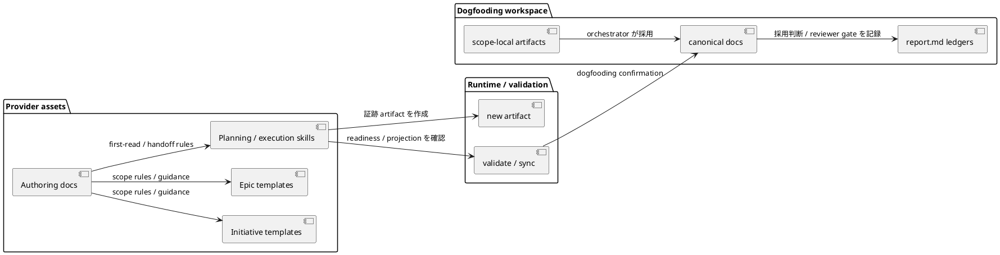
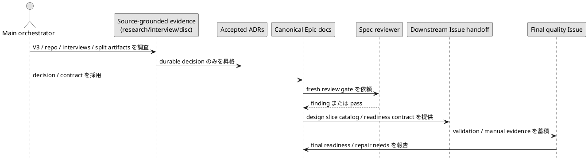

# epic-00270 Upstream Planning Governance And Templates — 設計

## 全体像
- 対象境界:
  - 上流 planning を Issue planning / execution へ接続するために必要な、provider側の Initiative / Epic templates、authoring docs、planning skills、Epic execution handoff guidance、tests / smoke checks。
- 影響領域:
  - `src/spec_dock/assets/spec_dock/templates/{initiative,epic}/`
  - `src/spec_dock/assets/spec_dock/docs/`
  - `src/spec_dock/assets/install_root/.agents/skills/`
  - `tests/`
  - 検証と確認のための local dogfooding `spec-dock/`
- 既存関係:
  - 下流には Issue grade templates と TDD execution planning がすでに存在する。
  - `artifacts/` は今後の作業証跡置き場としてすでに存在する。
  - この Epic は、発見・調査証跡と実行可能な Issue handoff の間にある Initiative / Epic planning の不足を埋める。
- 設計原則:
  - canonical docs には、採用済みの意思決定、境界、handoff 契約、gate を置く。
  - 長い参照資料、transcript、ZIPの生内容、比較分析は artifacts または accepted ADR に置く。
  - templates は architecture-neutral / architecture-aware とし、DDD / EDA を標準前提にしない。
  - 日本語運用の canonical docs / artifacts は日本語ファーストで作成し、技術識別子だけ原文保持を許可する。

## コンポーネント / モジュール構成
- タイトル:
  - 上流 planning governance の asset model
- 答える問い:
  - 証跡を安全に下流 Issue の入力へ変換するため、どの provider assets と workflow surfaces を変更する必要があるか。
- 範囲:
  - provider scaffold assets、runtime validation commands、dogfooding confirmation、report evidence。
- 含めない詳細:
  - 個別の実装差分、テスト関数名。
- 更新条件:
  - source-of-truth ownership、artifact authority、provider / dogfooding boundary、handoff contract が変わる場合。



## 境界 / 契約モデル

| 対象 | 責務 | 持ち込まない責務 |
|---|---|---|
| Initiative | 戦略的変更、capability landscape、context ownership、source of truth、strategic invariants、transition architecture、Epic handoff | Issue-level implementation structure、TDD cycles、private code details |
| Epic | capability / model envelope、lifecycle、cross-Issue invariants、contract portfolio、design slice catalog、Issue handoff package | product-wide source-of-truth changes、detailed TDD cycles、private helper design |
| Issue | 検証可能な1つの観測可能な振る舞い、または局所的な model / contract delta | Epic envelope の再定義、広範な Initiative decision、無関係な refactor |
| Issue Plan | execution milestones、behavior backlog、validation ladder、report evidence mapping | 新しい要件、新しい design contract、parent model changes |
| Report | 観測済み証跡、reviewer verdict、deviation、adoption ledger、delivery evidence | 将来の architecture decision や予定義務 |

authority flow:

```text
raw artifact / discovery evidence
  -> synthesized artifact / interview / decision candidate
    -> canonical requirement/design/plan または accepted ADR
      -> report.md Evidence Adoption Ledger / Spec Authoring Gate
        -> downstream Issue planning / execution handoff
```

raw artifacts と delegated drafts は証跡であり、canonical authority ではない。main orchestrator が canonical docs、accepted ADR、または `report.md` ledger に採用し、必要な reviewer gate を通した後に、実装上の入力として扱える。

## 設計判断
- D-001 scope-layering reference publication:
  - provider側の再利用可能な参照として `src/spec_dock/assets/spec_dock/docs/authoring/scope-layering.md` を1つ作成する。
  - workflow docs、phase docs、templates、skills は、責務モデル全文を重複させず、この参照へ薄くリンクする。
  - 根拠: accepted ADR `20260702t022907z-adr-scope-layering-reference-publication-surface.md`
- D-002 architecture-neutral template policy:
  - Initiative / Epic templates は capability、context、lifecycle、operation / contract、invariant、source-of-truth、handoff の語彙を使う。
  - DDD / EDA の語彙は、対象 codebase がすでに使っている場合、または明示的に選択された場合の補助語彙に留める。
  - 根拠: accepted ADR `20260702t024118z-adr-architecture-neutral-template-authoring-policy.md`
- D-003 complete understanding before canonical authoring:
  - agent は code / docs / history / artifacts を先に自力調査し、user intent gap だけをユーザーに質問し、採用した知識を外部化する。
  - requirement / design / plan は chat-only context に依存しない。
  - 根拠: accepted ADR `20260702t025127z-adr-complete-understanding-before-canonical-authoring.md`
- D-004 medium canonical detail:
  - canonical docs には、採用済み decision、scope boundary、authority flow、component impact、handoff contract、flow / gate model、compatibility、observability、test strategy を含める。
  - canonical docs には、V3原文の貼り付け、長い playbook example、`plan.md` に属する実装順序を入れない。
- D-005 flexible six-Issue baseline:
  - V3 の6 Issue を provisional baseline とする。
  - 6 Issue のままでは independent reviewability、responsibility boundary、verifiability、one-PR delivery が悪化する場合だけ re-slicing を認め、`plan.md` 更新と fresh `spec-reviewer` を必須にする。
- D-006 handoff inspection Option B:
  - Epic execution は machine-checkable な構造欠落を blocking とする。
  - 意味的な十分性や品質懸念は、構造欠落を示す場合を除き reviewer finding とする。
- D-007 one-PR delivery default:
  - この Epic は原則として1つの coherent delivery unit として扱う。
  - 証跡上、1PR delivery が現実的でない場合だけ PR 分割を再検討する。
- D-008 Japanese-first spec authoring:
  - 日本語運用では、requirement / design / plan / report / artifacts の本文を日本語ファーストで作成する。
  - ファイルパス、コマンド、コード識別子、SpecDock の固定用語、外部固有名詞は原文を保持してよい。
  - templates、skills、workflow docs、reviewer guidance、smoke tests は、日本語ファースト authoring を誘導・確認できるようにする。
  - 根拠: accepted ADR `20260702t040113z-adr-japanese-first-spec-authoring-policy.md`

## データフロー / メインシーケンス
- タイトル:
  - 証跡から canonical docs、handoff へ流す経路
- 答える問い:
  - 証跡はどのように安全な downstream execution input になるか。
- 範囲:
  - Epic design / plan / report の採用経路と handoff readiness。
- 含めない詳細:
  - 個別 Issue の実装手順。
- 更新条件:
  - authoring gate、reviewer gate、handoff inspection policy が変わる場合。



## Issue引き継ぎパッケージ契約
各 downstream Issue には次を渡す。
- parent Initiative / Epic ID
- 適用される parent requirement ID
- 適用される parent design decision
- 許可される local delta
- 禁止される parent boundary change
- acceptance criteria seed
- model / contract / lifecycle constraints
- expected evidence type
- suggested Issue grade
- dependencies
- escalation triggers
- relevant artifacts and accepted ADRs

suggested grade の目安:
- docs-only wording: `lite`
- 通常の局所的な振る舞い変更: `standard`
- public / shared contract、workflow、compatibility、migration、metadata: `strict`
- safety、security、privacy、destructive operation、GitHub mutation、rollback-hard: `critical`

## 引き継ぎ検査契約
- blocking structural gaps:
  - 必要な canonical docs が欠けている。
  - 必要な fresh reviewer pass が欠けている、または stale である。
  - Issue readiness contract が欠けている。
  - 実行可能な Issue plan steps が欠けている。
  - 必要な delegation contract が欠けている。
  - required verification が欠けている。
  - reviewer focus が欠けている。
  - Spec Authoring Gate の未解決項目、または Evidence Adoption Ledger の blocking / stale entry が残っている。
  - raw artifact を canonical authority として扱っている。
  - decision-only Issue を execution-ready として扱っている。
- reviewer finding:
  - acceptance criteria は存在するが弱い可能性がある。
  - test strategy は存在するが範囲が不足している可能性がある。
  - target files は明示されているが妥当性に疑問がある。
  - artifact reference は存在するが根拠説明が不足している。
- 境界:
  - Epic execution は coordinator / structural gate に留まり、`spec-reviewer` を置き換えない。

## ファイル / モジュール変更計画

| 対象 | 期待される変更 |
|---|---|
| `src/spec_dock/assets/spec_dock/docs/authoring/scope-layering.md` | scope ownership、decision radius、authority flow、anti-rules を扱う狭い provider-side reference を追加する。 |
| `src/spec_dock/assets/spec_dock/docs/workflow_initiative.md` | scope-layering reference への薄いリンクを追加し、全文テーブルの重複を避ける。 |
| `src/spec_dock/assets/spec_dock/docs/workflow_epic.md` | scope-layering reference への薄いリンクと、Epic-level handoff / readiness guidance を追加する。 |
| `src/spec_dock/assets/spec_dock/docs/workflow_issue.md` | Issue が parent envelope を再定義しないことを強調する薄いリンクを追加する。 |
| `src/spec_dock/assets/spec_dock/docs/phase_*` | phase gate が scope-layering または handoff context を必要とする箇所にだけ、焦点を絞った参照を追加する。 |
| `src/spec_dock/assets/spec_dock/templates/initiative/{requirement,design,plan}.md` | implementation-level overreach を避けつつ、strategic / capability / source-of-truth / Epic handoff prompts を追加する。 |
| `src/spec_dock/assets/spec_dock/templates/epic/{requirement,design,plan}.md` | capability / model envelope、design slice catalog、Issue handoff package、suggested grade、final gate prompts を追加する。 |
| `src/spec_dock/assets/spec_dock/templates/**` | 日本語運用では本文を日本語ファーストにし、英語は識別子・固定語・外部固有名詞へ限定する guidance を追加する。 |
| `src/spec_dock/assets/install_root/.agents/skills/spec-dock-initiative-planning/SKILL.md` | first-read と output expectations を新しい template / reference flow に合わせ、日本語ファースト authoring を明示する。 |
| `src/spec_dock/assets/install_root/.agents/skills/spec-dock-epic-planning/SKILL.md` | Epic design / plan authoring を、flexible six-Issue baseline と handoff package に合わせ、日本語ファースト authoring を明示する。 |
| `src/spec_dock/assets/install_root/.agents/skills/spec-dock-epic-execution/SKILL.md` | Option B handoff inspection の structural blockers と reviewer findings の分離を追加する。 |
| `src/spec_dock/assets/install_root/.agents/skills/spec-dock-clarification/SKILL.md` | interview / research / disc artifacts の本文を日本語ファーストで外部化する guidance を追加する。 |
| `tests/` | scaffold / template / doc / skill の focused smoke assertion と、振る舞い変更がある場合の runtime check を追加する。 |
| `spec-dock/` | provider-side 変更後の dogfooding confirmation として確認または refresh する。 |

## 移行 / 互換性 / rollback
- 移行:
  - この Epic は provider scaffold assets と workflow guidance を変更する。database migration は想定しない。
  - 既存の managed repos は `spec-dock update` により更新後の templates / docs / skills を受け取る。
  - provider-side 変更後、dogfooding workspace への影響を確認する。
- 互換性:
  - 既存の Issue grade / TDD workflow は Issue execution の下流 authority として維持する。
  - 既存の historical artifacts / discussions は preservation input として維持する。
  - 新しい working evidence は `artifacts/` と `new artifact` を使う。
  - 日本語運用で新規作成・更新する canonical docs / artifacts は日本語ファーストにする。既存 historical artifacts は無理に全文翻訳しない。
- rollback:
  - 検証に失敗した場合、provider asset changes は Issue または PR 単位で revert する。
  - raw artifact authority、DDD / EDA-only templates、decision-only execution Issues へ戻す rollback は行わない。
  - `scope-layering.md` が広くなりすぎた場合は狭め、lifecycle detail は workflow docs に置く。

## 観測可能性 / セキュリティ
- 観測可能性:
  - `report.md` Evidence Adoption Ledger に、採用した artifacts / ADRs / interviews を記録する。
  - Spec Authoring Gate に、調査済み事実、未確定 gap、reviewer scope、verdict、promotion decision を記録する。
  - Final quality evidence に、automated checks、manual scenario summaries、reviewer results、PR readiness を記録する。
  - reviewer result には、日本語ファースト authoring の逸脱が構造的欠落か reviewer finding かを記録する。
- セキュリティ:
  - secrets や credentials は導入しない。
  - manual test workspaces と raw logs は追跡対象にしない。
  - credentialed external mutation、PR merge、GitHub issue close は、別途明示的に許可されない限りこの Epic の外側に置く。

## テスト戦略
- unit / scaffold tests:
  - Initiative / Epic templates が upstream planning prompts と handoff fields を含むこと。
  - templates が DDD / EDA-specific sections を必須にしないこと。
- docs / smoke tests:
  - `docs/authoring/scope-layering.md` が存在し、関連 docs / skills がそこへリンクすること。
  - full scope ownership table が templates / docs / skills に重複していないこと。
  - raw artifact authority language が導入されていないこと。
  - 日本語運用の templates / skills / artifact guidance が、日本語ファースト本文と許容英語の境界を説明していること。
- skill / runtime checks:
  - planning skills が source-grounded clarification、fresh reviewer gates、report evidence を指すこと。
  - Epic execution handoff が structural blockers と reviewer findings を区別すること。
  - planning / clarification skills が、日本語の requirement / design / plan / artifacts 作成を促すこと。
- dogfooding / manual checks:
  - 新しい Initiative / Epic scaffold shape。
  - planning skill read-through。
  - Epic execution handoff coordinator read-through。
  - `artifacts/` と legacy `discussions/` guidance の違い。
  - provider-side 変更後に `validate` と `sync` の整合性を確認すること。

## 関連ADR
- `artifacts/20260702t022907z-adr-scope-layering-reference-publication-surface.md`:
  - scope-layering reference の公開surfaceを決めたADR。
- `artifacts/20260702t024118z-adr-architecture-neutral-template-authoring-policy.md`:
  - architecture-neutral / architecture-aware なtemplate authoring方針を決めたADR。
- `artifacts/20260702t025127z-adr-complete-understanding-before-canonical-authoring.md`:
  - canonical authoring前に必要なsource-grounded understandingの方針を決めたADR。
- `artifacts/20260702t040113z-adr-japanese-first-spec-authoring-policy.md`:
  - 日本語ファーストのspec / artifact authoring方針を決めたADR。

## 未確定事項
- なし:
  - Epic design に必要な user-intent decisions は、accepted interviews と ADRs で解決済みである。
