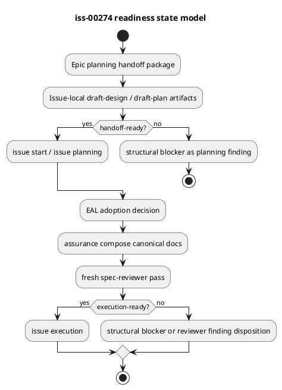

# iss-00274 Epic execution handoff と Issue readiness workflow 更新 — Issue 設計

## 文書の位置づけ
- この文書は `iss-00274` の正規 Issue 設計書である。
- Issue Start 前の seed artifact と、system-architect / implementation-planner draft を採用判断したうえで、実行可能な設計契約へ統合する。
- この Issue は `strict` 相当として扱う。`assurance classify` の現行出力は `standard` だが、要件定義の `issue grade: strict` と workflow / shared contract 変更の性質を優先し、specialist evidence gate を必須にする。
- この Issue では PR を作成しない。完了後は `issue finish` により `iss-00275` へバトンを渡す。

## 正本・根拠
| 種別 | パス / ID | このIssueへの意味 |
|---|---|---|
| Issue 要件 | `requirement.md` | `I274-AC-001..009` / `I274-EC-001..004` を設計契約へ落とす。 |
| Epic 要件・設計・計画 | `spec-dock/active/epic/{requirement.md,design.md,plan.md}` | `E-RQ-006..010`、`D-006`、`D-008`、`D-009`、1PR delivery 方針を継承する。 |
| scope-layering ADR | `artifacts/20260702t022907z-adr-scope-layering-reference-publication-surface.md` | raw artifact と canonical authority の境界を維持する。 |
| complete-understanding ADR | `artifacts/20260702t025127z-adr-complete-understanding-before-canonical-authoring.md` | chat-only 判断ではなく、調査・採用・外部化を必須にする。 |
| Japanese-first ADR | `artifacts/20260702t040113z-adr-japanese-first-spec-authoring-policy.md` | 日本語運用の docs / report / artifacts を日本語ファーストにする。 |
| unified draft command ADR | `artifacts/20260702t074332z-adr-unified-draft-artifact-command-grade-role-policy.md` | `new artifact draft-*` と `assurance compose` の責務境界を固定する。 |
| 事前seed | `artifacts/20260702t081006z-draft-design-epic-execution-readiness-workflow-pre-start-seed.md`, `artifacts/20260702t081007z-draft-plan-epic-execution-readiness-workflow-pre-start-seed.md` | evidence-only の設計・計画 seed。正本ではなく採用材料。 |
| 専門ドラフト | `artifacts/20260702t111140z-draft-design-system-architect-design-draft-epic-execution-readiness-workflow.md`, `artifacts/20260702t111145z-draft-plan-implementation-planner-plan-draft.md` | 正本設計・計画へ統合する specialist evidence。 |
| 現行workflow | `src/spec_dock/assets/spec_dock/docs/workflow_epic.md`, `workflow_issue.md`, `authoring/scope-layering.md` | lifecycle / authority / Issue readiness の既存正本。 |
| 現行skill | `src/spec_dock/assets/install_root/.agents/skills/spec-dock-epic-execution/SKILL.md`, `.agents/skills/spec-dock-epic-execution/SKILL.md` | Epic execution coordinator の entrypoint。provider と dogfooding copy の整合が必要。 |

## 現状分析
- `workflow_epic.md` は Epic planning completion / handoff package と Issue-local `draft-design` / `draft-plan` primitive をすでに持つが、Epic execution がそれをどのように読むか、どの欠落を structural blocker にするかの guidance が薄い。
- `workflow_issue.md` は Issue-local draft adoption、`assurance compose`、fresh reviewer gate、execution gate、report ledger を広く定義している。この Issue ではそれを置き換えず、Epic execution から参照する入口を強める。
- `spec-dock-epic-execution` skill は coordinator flow を持つが、reviewer-gated Epic planning outputs、Issue handoff package、handoff-ready / execution-ready 分離、draft artifact primitive、no per-Issue PR 方針を十分に明示していない。
- `new artifact draft-design` / `new artifact draft-plan` は既に Issue-local artifact 作成 surface として存在する。現時点の中心変更は docs / skill guidance であり、runtime behavior 変更は characterization で不足が確認された場合だけ行う。

## 設計判断
- `D274-001 [N]` Epic execution は active state / dependency state だけでなく、reviewer-gated Epic `requirement.md` / `design.md` / `plan.md` / `report.md` と downstream Issue handoff package を first-read input とする。
- `D274-002 [N]` Epic execution は structural gate であり、machine-checkable な構造欠落を fail-closed で止める。
- `D274-003 [N]` Epic execution は semantic reviewer ではない。意味的十分性の疑義は reviewer finding として残し、`spec-reviewer` を置き換えない。
- `D274-004 [N]` Issue-local draft artifact は evidence-only とする。canonical adoption は Issue Planning EAL、`assurance compose`、fresh reviewer gate を通る。
- `D274-005 [N]` Issueごとの PR 作成を通常フローにしない。`iss-00274` は PR を作らず、final PR delivery は `iss-00276` に集約する。
- `D274-006 [N]` 日本語運用では execution / readiness 中に作成・更新する docs / report / artifacts の説明本文を日本語ファーストにする。
- `D274-007 [P]` runtime behavior 変更は characterization-first とする。現行 command が Issue-local 作成、canonical non-mutation、fail-closed を満たすなら docs / skill update に留める。
- `D274-008 [N]` `assurance compose` は canonical compose 専用であり、pre-start draft artifact 作成には使わない。
- `D274-009 [N]` `handoff-ready` と `execution-ready` を分離する。
- `D274-010 [N]` grade別 specialist obligation は command 名ではなく、workflow / skill / EAL / reviewer gate で扱う。
- `D274-011 [N]` GitHub mutation、PR merge、reviewer-pass self-claim、issue-finish self-claim はこの Issue の実装対象外とする。

## Structural blocker と reviewer finding の境界
Structural blocker は、実行へ流すと authority leak、未計画実装、または未検証実装を起こす構造欠落である。

- required canonical docs が欠けている、template-only、または placeholder のまま execution input とされている。
- fresh reviewer pass がない、stale、または対象 revision と不一致である。
- Issue readiness contract がない。
- executable plan structure がない。
- delegation contract がない。
- required verification がない。
- reviewer focus がない。
- `report.md` の Spec Authoring Gate / Evidence Adoption Ledger に unresolved blocking / stale entry が残っている。
- raw artifact を canonical authority として扱っている。
- decision-only Issue を execution-ready として扱っている。
- `strict` / `critical` で specialist evidence または認められた fallback evidence がない。

Reviewer finding は、構造は存在するが意味的な十分性や品質に疑義がある状態である。

- acceptance criteria はあるが網羅性が弱い可能性がある。
- test strategy はあるが、integration / smoke の範囲が不足している可能性がある。
- target files は明示されているが、設計上の妥当性に疑問がある。
- artifact reference はあるが、採用理由の説明が薄い。
- 日本語ファーストの逸脱が軽微で、authority leak や実行不能に直結しない。

## Handoff-ready と Execution-ready
`handoff-ready`:
- Epic execution が target Issue を Issue Planning に渡してよい状態。
- parent trace、dependencies、readiness contract、draft artifact path または skip evidence、expected verification、reviewer focus が揃っている。
- canonical Issue `design.md` / `plan.md` はまだ `awaiting-assurance-compose` でもよい。
- 実装開始を許可しない。

`execution-ready`:
- Issue Planning が evidence を採否判断し、canonical `design.md` / `plan.md` を `assurance compose` し、fresh reviewer gate を通している。
- executable plan、required verification、delegation contract、reviewer focus が揃っている。
- structural blocker が残らず、grade別 specialist obligation または認められた fallback evidence が揃っている。
- Issue execution skill へ渡してよい。

## 変更対象と境界
| 対象 | 設計方針 | runtime変更要否 |
|---|---|---|
| `src/spec_dock/assets/install_root/.agents/skills/spec-dock-epic-execution/SKILL.md` | first-read input、structural blocker / reviewer finding、handoff-ready / execution-ready、no per-Issue PR、日本語ファーストを追加する。 | なし |
| `.agents/skills/spec-dock-epic-execution/SKILL.md` | dogfooding entrypoint として provider copy と同期する。 | なし |
| `src/spec_dock/assets/spec_dock/docs/workflow_epic.md` | Epic planning handoff と Epic execution lifecycle を接続する。 | なし |
| `src/spec_dock/assets/spec_dock/docs/workflow_issue.md` | Issue Planning / execution-ready の正本として参照されること、draft adoption -> compose -> review -> execution の順序を補助する。 | なし |
| `src/spec_dock/assets/spec_dock/docs/authoring/scope-layering.md` | 原則変更しない。必要ならリンク・文言補強だけに留める。 | なし |
| `src/spec_dock/assets/spec_dock/scripts/spec_dock_runtime/` | `new artifact draft-*` の不足が characterization で確認された場合だけ最小変更する。 | 条件付き |
| `tests/` | docs / skill smoke と、runtime変更がある場合の focused tests。 | 条件付き |

## 受け入れ条件への追跡
| 要件 | 設計ID | 設計上の閉じ方 |
|---|---|---|
| `I274-AC-001` | `D274-001` | Epic docs と Issue handoff package を first-read input にする。 |
| `I274-AC-002` | `D274-002` | structural blocker catalog を skill / workflow guidance に固定する。 |
| `I274-AC-003` | `D274-003` | semantic sufficiency は reviewer finding に残す。 |
| `I274-AC-004` | `D274-004` | raw artifact authority leak と decision-only execution-ready を禁止する。 |
| `I274-AC-005` | `D274-005` | PR delivery を `iss-00276` に集約し、この Issue では PR を作らない。 |
| `I274-AC-006` | `D274-006` | 日本語ファースト guidance を execution / readiness に適用する。 |
| `I274-AC-007` | `D274-004`, `D274-010` | `new artifact draft-design` / `draft-plan` を unified primitive として扱う。 |
| `I274-AC-008` | `D274-008`, `D274-010` | actor / specialist / depth 別 command を増やさず、`assurance compose` を canonical 専用に保つ。 |
| `I274-AC-009` | `D274-009`, `D274-010` | handoff-ready と execution-ready を分離し、specialist obligation を readiness evidence gate に置く。 |
| `I274-EC-001` | `D274-003` | readiness check は `spec-reviewer` を置き換えない。 |
| `I274-EC-002` | `D274-002` | structural blocker がある Issue を実行可能にしない。 |
| `I274-EC-003` | `D274-003` | reviewer finding をすべて blocking にしない。 |
| `I274-EC-004` | `D274-005`, `D274-011` | PR merge / credentialed GitHub mutation を含めない。 |

## 検証設計
- Red / characterization:
  - 現行 skill / docs に必須語彙と禁止導線が不足していることを `rg` と read-through で固定する。
- docs / skill consistency:
  - `structural blocker`, `reviewer finding`, `handoff-ready`, `execution-ready`, `draft-design`, `draft-plan`, `assurance compose`, `iss-00276`, `issue finish` の導線を確認する。
- runtime conditional:
  - `new artifact draft-*` の command behavior 変更が必要と判定した場合だけ、focused tests と最小実装を追加する。
- spec review:
  - この設計・計画が parent Epic、accepted ADR、Issue 要件、pre-start draft boundary と整合することを fresh reviewer で確認する。

## リスク
- structural blocker と reviewer finding の境界が曖昧だと、過停止または authority leak が起きる。
- provider-side skill と dogfooding `.agents` skill が drift すると、実際の entrypoint と shipped asset がずれる。
- runtime change を広げすぎると、この Issue が guidance update の範囲を超える。
- `validate` は semantic sufficiency を保証しないため、fresh `spec-reviewer` が必要である。

## 未解決事項
- なし。runtime behavior 変更の要否は `plan.md` の S02 characterization で判断する。
