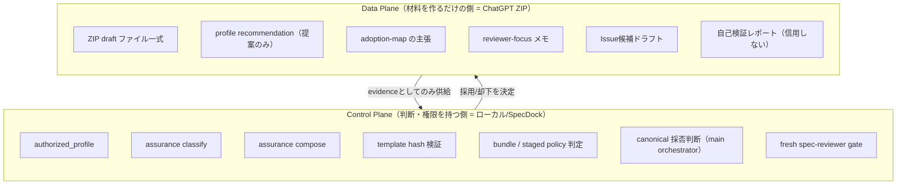
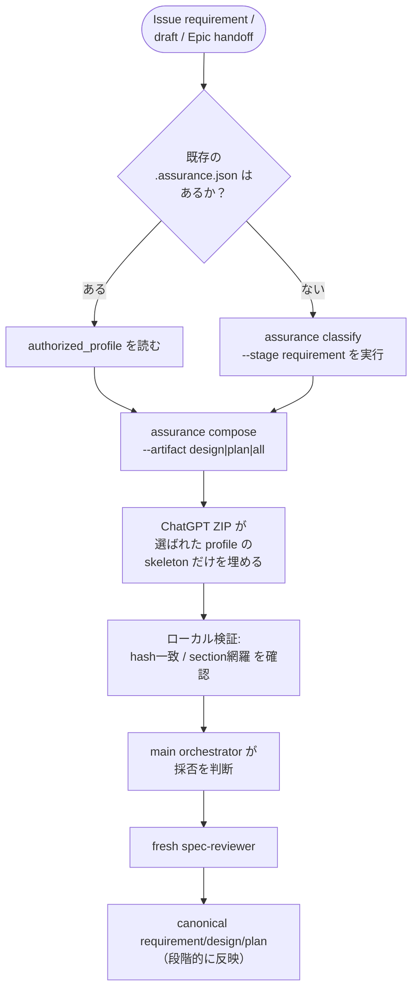
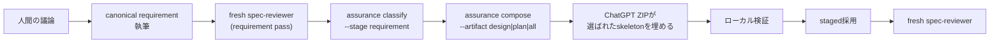
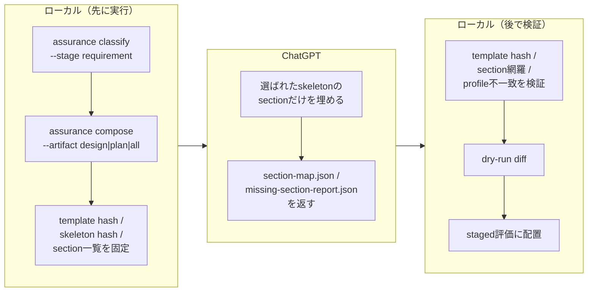
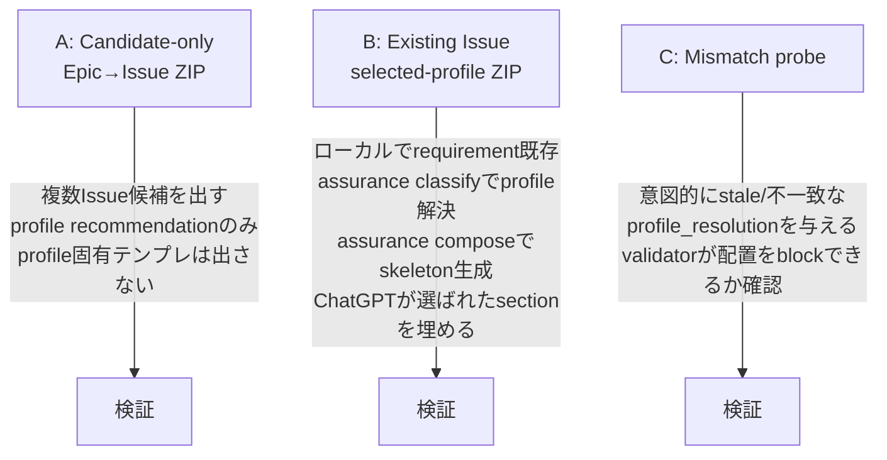

# ChatGPT ZIP Authoring Pack — 新メンバー向けオンボーディング資料

> **位置づけ**: この資料は `epic-00283` 配下の research artifact
> [`20260706t131838z-research-chatgpt-zip-authoring-pack-issue-grade-control.md`](./20260706t131838z-research-chatgpt-zip-authoring-pack-issue-grade-control.md)
> の内容と、そこに至るまでの意思決定を、初見の人にも分かるように再構成したものです。
> 情報量は削っていません。元の research artifact が one source of truth（一次情報）であり、
> 本資料はその**読み解きガイド**です。canonical docs でも ADR でもありません。

---

## 0. まず結論だけ知りたい人向け（3分で読む要約）

| 論点 | 結論 |
|---|---|
| ChatGPT (GPT-5.5 Pro Extended) が ZIP を返せることを使うか | **使う。** Epic design/plan や複数 Issue draft を一括生成する手段として有効 |
| ZIP を「正本 (authority)」として扱うか | **扱わない。** ZIP は最後まで「検証が必要な evidence（証拠）」止まり |
| Issue の grade（Lite/Standard/Strict/Critical）を誰が決めるか | **ローカルの `assurance classify` / `.assurance.json` が決める。** ChatGPT は「おすすめ」を言えるだけ |
| ZIP を repo に直接展開してよいか | **しない。** quarantine → 検証 → dry-run diff → staged 配置 → 人間/orchestrator の採否判断 → fresh spec-reviewer、を必ず通す |
| 今すぐ実装するか | **しない。** まずは `manual-tests/oracle-zip-authoring/` 配下の実験スクリプトとして dogfood する（v1 は shipped runtime ではない） |

一言で言うと：

> **「ChatGPTに大きな文章を書かせるのは良い。ChatGPTに“判断”をさせるのは良くない。」**
> という原則を、ZIP 運用と Issue grade 制御の両方に適用した、というのがこの調査の核心です。

---

## 1. そもそも何の話か（背景）

- ChatGPT Use（GPT-5.5 Pro Extended）を使った実験で、**ダウンロード可能な ZIP ファイル**を出力させることに成功した。
- ZIP なら、複数ファイル・長文を「テキストで垂れ流す」よりも整理された形で受け取れる。
- そこで、「この ZIP 出力を SpecDock の仕様作成ワークフロー（Epic → Issue → requirement/design/plan）に正式に組み込めないか？」を検討したのが、この research artifact の目的。
- 調べる過程で、もう一つ論点が浮上した：**Issueには `lite / standard / strict / critical` という「重さ（grade）」の区分があるが、この判断を ChatGPT に任せてよいのか？** → これも本調査で結論を出している。

この2つの論点（① ZIPを仕組みに組み込むか、② gradeを誰が決めるか）は独立に見えて、実は **同じ原則で解決できる** ため、1本の artifact にまとまっている。

---

## 2. 前提知識ミニ辞典（このドメインが初めての人向け）

新メンバーがつまずきやすい用語をここにまとめます。本文を読む前にざっと目を通してください。

| 用語 | 意味 |
|---|---|
| **SpecDock** | このリポジトリが提供する、仕様書（requirement/design/plan/report）を段階的に作成・レビューさせるためのワークフロー基盤 |
| **canonical docs** | `requirement.md` / `design.md` / `plan.md` / `report.md` のこと。「正本」。書けるのは main orchestrator（人間が動かすメインのエージェント）だけ |
| **artifacts/** | scope（Epic/Issueなど）ごとに置かれる作業用の証拠置き場。ここに何かを置いても、それだけでは正本にはならない |
| **spec-reviewer gate** | 各 phase（requirement→design→plan）を進める前に必ず通す、独立したレビュー工程。“fresh”（そのphaseの内容に対して新規に実行された）である必要がある |
| **`.assurance.json`** | ある Issue に対して「この Issue は grade 何で扱うか（`authorized_profile`）」を記録した、ローカルの正本ファイル |
| **`authorized_profile`** | `.assurance.json` が持つ、その Issue の実際の grade（lite/standard/strict/critical）。テンプレート選択・レビュー義務の唯一の authority |
| **`assurance classify`** | requirement の内容からリスクを機械的に判定し、`authorized_profile` を決めるローカルコマンド |
| **`assurance compose`** | `authorized_profile` に従って、design/plan のテンプレート（skeleton）を組み立てるローカルコマンド |
| **profile recommendation** | ChatGPT などが「たぶんこの grade が妥当では」と言う **提案**。決定権はない |
| **control plane / data plane** | 「誰が決めるか（control plane）」と「何を作るか（data plane）」を分ける考え方。今回の設計の中心概念（後述） |
| **bundle generation / bundle promotion** | 「requirement/design/planを1つのZIPにまとめて“生成”すること」と「実際にcanonicalへ段階を飛ばして“昇格”させること」は別、という区別 |
| **manual escalation / profile override** | 人間が「もっと厳しく見て」と頼むのはOK（escalation）。`authorized_profile` そのものを書き換えるのはNG（override） |

---

## 3. 全体設計思想：Control Plane と Data Plane を分ける

これが今回の意思決定すべての土台になっている考え方です。



**読み方**: ChatGPT（data plane）は材料を大量に、速く作れる。でも「これを採用していいか」「grade は何か」「テンプレートはどれを使うか」を**決める権限は一切持たない**。決定権は常にローカルの assurance の仕組みと main orchestrator（人間主導のエージェント運用）に残す。

---

## 4. ZIP のライフサイクル（全体の処理パイプライン）

ChatGPT から ZIP を受け取ってから canonical docs に反映するまでの、必須の関所（gate）はこちら。

```mermaid
flowchart LR
    A["ChatGPT ZIP\n(ダウンロード)"] --> B[quarantine\n隔離置き場に置く]
    B --> C["safe ZIP\ncentral-directory 検査"]
    C --> D["schema + checksum +\npath + content 検証"]
    D --> E[dry-run diff]
    E --> F["staged evidence /\ndraft artifact 化"]
    F --> G["main orchestrator\nによる採否判断"]
    G --> H["fresh\nspec-reviewer gate"]
    H --> I["canonical docs\n更新"]

    style A fill:#444,stroke:#888,color:#fff
    style I fill:#2a6,stroke:#8f8,color:#fff
```



**どの段階も飛ばせない**。特に重要なのは C・D（ZIPの中身を安全側で機械検証してから初めて開く）と、H（どんな経路で作られた文章でも、必ず新規のレビューを1回通す）です。

### 4.1 ZIP として絶対に拒否するもの

- 絶対パス、`..`（親ディレクトリ参照）、バックスラッシュ区切り
- 隠しパス、symlink、hardlink、デバイスファイル、実行ビット
- ネストしたアーカイブ、バイナリ
- `.env*`、token、cookie、secret っぽい内容
- `.git` / `.ssh` / `.codex` / `.agents` / `.github` のパス

### 4.2 ZIP パックの構成（トップレベル）

```text
specdock-authoring-pack/
├── manifest.json         ← このパックが何であるか、authorityの宣言
├── provenance.json        ← 出所の証跡
├── schema/
├── sources/
├── stale-if.json          ← いつ「もう古い」と判定するかの条件
├── drafts/                ← 下書き
├── candidates/            ← Issue候補（Epic分解時）
├── adoption/
│   ├── adoption-map.json
│   └── eal-proposal.json  ← Evidence Adoption Ledger 提案
├── reviewer-focus/
└── validation/
```

用途は3パターンに分かれる：

1. **Initiative → Epic 分解パック**
2. **Epic → Issue 分解パック**
3. **Issue の requirement/design/plan 一式パック**

> 重要: 「1つのZIPにrequirement/design/planをまとめて “生成” できる」ことと、「それをまとめて “正本に昇格” してよい」ことは別問題（**bundle generation ≠ bundle promotion**）。承認は必ず phase ごとに段階的（staged）に行う。

---

## 5. Issue の grade（profile）を誰が決めるか

### 5.1 なぜ ChatGPT に決めさせないのか

Issue の grade は「文体の重さ」ではなく、**reviewer義務・specialist evidence・fallback evidence・実行可否のゲート**そのものに直結する。ChatGPTに決めさせた場合の具体的リスク：

| リスク | 内容 |
|---|---|
| Lite の誤選択 | 「小さく見えるから」という理由だけで Lite に倒されてしまう |
| authorized_profile とのズレ | テンプレート選択とレビュー義務が分離し、実態と記録が食い違う |
| Strict/Critical の骨抜き | 本来必要な specialist/fallback evidence を、ZIPの自己申告で代替したように見えてしまう |
| profile shopping | 全 grade 分のバリアントをZIPに詰めて「都合の良いものを選ぶ」動きを誘発する |
| stale 検知漏れ | テンプレートや `.assurance.json` が古くなっているのに、一番自然な文章を採用してしまう |

### 5.2 プロファイル解決フロー（実際の処理順序）



要は、**「ChatGPTが profile を選ぶ」のではなく「ローカルの assurance が profile を解決し、ChatGPTはその結果に合わせて“埋める”だけ」** という順序を絶対に守る、ということ。

### 5.3 CLI 設計案（まだ実装前・提案段階）

初期の dogfood は shipped runtime ではなく、実験用スクリプトとして始める想定：

```bash
manual-tests/oracle-zip-authoring/oracle-issue-authoring-zip \
  --scope-id iss-00234 \
  --parent-epic epic-00158 \
  --profile auto \
  --profile-source assurance-classify \
  --profile-override-policy forbid \
  --bundle-policy auto \
  --mode evidence-only
```

各オプションの意味：

| オプション | 値 | 意味 |
|---|---|---|
| `--profile` | `auto` (default) | 既存 `.assurance.json` があればそれ、なければ `assurance classify` で解決。**「ChatGPTが選ぶ」ではない** |
| | `lite\|standard\|strict\|critical` | あくまで「要求」。それ自体は authority にならない（override-policyで検査される） |
| `--profile-source` | `existing-authorized-profile` | 既存Issueの refinement で最優先 |
| | `assurance-classify` | 新規Issueの標準経路 |
| | `human` | 人間の指定。**downgrade には使えない**。厳しくする方向のみ |
| | `chatgpt-recommendation` | あくまで advisory。テンプレート選択にも `.assurance.json` 更新にも使えない |
| `--profile-override-policy` | `forbid` (default) | 要求profileと`authorized_profile`が食い違ったらblock |
| | `escalate-obligations-only` | 要求の方が厳しい場合だけ許可（テンプレートは元のまま、義務だけ引き上げ） |
| | `reclassify-required` | 食い違ったら止めて、requirementかclassify入力を直してから再実行 |
| | `advisory-only` | Epic→Issue候補段階で使用。最終profileは決めない |
| `--bundle-policy` | `auto` (default) | ローカルresolverがbundle生成/staged採用を判断 |
| | `force-bundle` | あくまで「要望」。Strict/Critical・stale・不一致時は staged へ格下げ or block |
| | `force-staged` | 常に有効。初期dogfoodとStrict/Criticalで推奨 |

> **downgrade を許すポリシーは意図的に作らない。** 厳しくする方向の逃げ道はあっても、緩める方向の逃げ道は用意しない。

---

## 6. ワークフロー別の扱い（早見表）

| ワークフロー | profileの決定権 | ChatGPTの役割 | テンプレート描画 | bundle方針 |
|---|---|---|---|---|
| Epic → 複数Issue候補 | なし（候補提案のみ） | `minimum_safe_profile`、Lite不適格理由、Strict/Critical trigger を返す | profile固有テンプレートは出さない | candidate単位でstaged |
| 単独Issueの requirement → design/plan | ローカル `assurance classify` | 選ばれたskeletonを埋め、不一致リスクを報告 | まずローカルcompose | 生成はbundle可、採用はstaged |
| 既存Issueの改訂 | 既存 `.assurance.json` | 選ばれたprofile内での改訂のみ | 既存/composed文書とhash一致必須 | 既存profileが支配 |
| profile未解決のZIPドラフト | 未解決 | requirement-onlyかprofile中立の証拠のみ | design/planは出さないか概要止まり | 強制staged |

### 6.1 具体シナリオ①: Epic分解からIssue候補を作る場合

Epic-levelのZIPが複数Issue候補を返しても、それは **Issueのcanonical文書ではなく、Epic handoffの証拠** として扱う。各候補は以下を持つ：

```text
candidates/issues/cand-issue-001/
├── candidate.json
├── profile.json                 ← recommendation only（下記参照）
├── requirement-draft.md
├── design-brief.md
├── plan-brief.md
├── classification-inputs.json
├── bundle-recommendation.json
├── creation-command.txt
├── draft-artifact-commands.txt
└── adoption-notes.md
```

`profile.json` の中身イメージ（**あくまで提案であり決定ではない**ことを構造で表現）：

```json
{
  "candidate_id": "cand-issue-001",
  "profile_recommendation": {
    "recommended_profile": "standard",
    "minimum_safe_profile": "standard",
    "lite_allowed": false,
    "lite_disqualifiers": [
      "runtime/scaffold/workflow contract impact is possible"
    ],
    "strict_critical_triggers": []
  },
  "profile_decision": {
    "status": "not_authoritative",
    "must_run_local_assurance_classify": true
  }
}
```

Issue作成後は、requirementを採用・具体化し、fresh spec-reviewer passの後に `assurance classify` と `assurance compose` を実行する。Epic-level の design/plan draft はこの時点で「claimレベルの証拠」に格下げし、選ばれたprofileテンプレートへ改めてマッピングする。

### 6.2 具体シナリオ②: 人間の議論済み requirement から design/plan を作る場合



人間が `--profile strict` のように直接指定することはできるが、これは **manual escalation** であり `authorized_profile` を上書きしない。`authorized_profile=standard` に対し `requested_profile=strict` が来た場合は、①テンプレートはStandardのまま義務だけStrict相当に引き上げるか、②`reclassify-required` でrequirement自体を見直すか、のどちらかにする。

---

## 7. ChatGPT にテンプレートを描かせるか

**デフォルトは「ChatGPT単独では描かせない」。**



理由: ChatGPTに全grade分のバリアントを出させると、①stale templateのリスクが上がる、②profile shoppingを誘発する、③レビュアーが生成物の大半（例えば4段階なら約75%）を捨てる作業を背負うことになる。

---

## 8. Manifest に書く「権限の宣言」

ZIPの `manifest.json` は、誰が何の権限を持つかを **機械可読な形で明示** する。ここが今回の設計の要。

```json
{
  "schema_version": "specdock.oracle_authoring_pack.v2",
  "kind": "epic_issue_decomposition | issue_requirement_design_plan_bundle",
  "authority": "evidence_only",
  "adoption_status": "unreviewed",
  "profile_control": {
    "requested_profile": "auto",
    "requested_profile_source": "assurance-classify",
    "profile_override_policy": "forbid",
    "requested_bundle_policy": "auto",
    "resolved_bundle_policy": "staged",
    "profile_authority": "local-assurance",
    "chatgpt_profile_authority": "recommendation_only"
  },
  "template_control": {
    "template_rendering_authority": "local-assurance-compose",
    "chatgpt_template_selection_allowed": false,
    "all_profile_variants_allowed": false,
    "selected_profile_only": true,
    "template_hash_validation_required": true
  }
}
```

検証ルール（機械チェック項目）:

- `chatgpt_profile_authority` は必ず `recommendation_only`
- `template_rendering_authority` は必ず `local-assurance-compose`
- `selected_profile_only=false` は候補専用パック以外では invalid
- `profile_resolution.status` が `stale` / `blocked` の design/plan draft は採用不可
- ZIP内のスクリプトらしきファイルは、実行権限を持たせずプレーンテキストの提案止まりにする

---

## 9. Edge case（実際に起きうる具体シナリオと判定）

| シナリオ | 判定 | 対応 |
|---|---|---|
| `authorized_profile=standard` なのにZIPが `lite` の design を返す | invalid / そのテンプレート内容は却下 | 文章としての主張はadvisory evidenceとしてsalvage可能。Standardでローカルcomposeし直し、必要ならChatGPTに選ばれたskeletonの再埋めを依頼 |
| `authorized_profile=lite` だが人間が `standard` を指定 | manual escalationとして許容可 | テンプレートはLiteのまま義務をStandard相当に引き上げるか、`reclassify-required`で見直す。理由・追加gate・戻し条件をreport.mdに記録 |
| `.assurance.json` が stale（下記の条件） | 採用不可 | `assurance classify` / `assurance compose` を再実行 |
| Strict/Criticalのbundle ZIP | 生成はevidenceとして許可可、採用は強制staged | specialist/fallback evidenceがなければreadinessはblock/incomplete。Criticalは明示承認なしのfallback不可 |
| ChatGPTが `.assurance.json` を作る/更新案を出す | invalid | ZIP検証でblock。`.assurance.json`はローカルassuranceコマンドのみが権限を持つ |
| ZIPに全profileバリアントが含まれる | 候補専用brief以外はinvalid | 選ばれたprofile以外のdesign/planは採用不可。再生成を推奨 |

`.assurance.json` が stale と判定される条件：

- requirement hash が classifier入力のhashと異なる
- requirement のreviewer target hashが変わった
- `authorized_profile` が欠落している
- template hashが変わった
- compose commandのversionが変わった
- `.assurance.json` が別のIssue IDのpathを指している

---

## 10. リスクと緩和策

| リスク | 影響 | 緩和策 |
|---|---|---|
| ZIPをrepoに直接展開する | path traversal / 隠しファイル / canonical上書き | quarantine + central-directory検査 + safe extraction |
| ChatGPTの自己検証を信用する | 危険なパックを安全と誤認 | ローカル検証を唯一のauthorityにする |
| gradeをChatGPTに決めさせる | Lite誤選択 / Strict gate bypass | recommendation-only + local assurance authority |
| 全profileバリアントを返させる | profile shopping / stale template risk | selected profile only |
| bundleをpromotionと誤解する | phase gate bypass | bundle生成とstaged採用を明確に分離 |
| Strict/CriticalをZIPだけで済ませる | specialist/fallback evidence欠落 | force staged + gate evidence必須 |
| source hash不一致 | staleな情報源に基づく採用 | preflight hashとlocal observed hashを照合 |
| artifact-packとflat artifact契約の衝突 | workflow contract mismatch | v1はextracted treeをrepo外quarantineに、repoにはflat summaryのみ保存 |

---

## 11. まだ検証していないこと（unverified）

- ChatGPT Use がZIPファイルを**毎回安定して**生成できるかは未検証
- ZIP内のmanifest/provenance/source-hashesが、ローカルvalidatorを通る精度で安定生成されるかは未検証
- ZIPによるauthoringが、実際にオーケストレーターの認知負荷・人間の編集負担・レビュー差し戻し回数を下げるかは未検証
- `manual-tests/oracle-zip-authoring/` の preflight/capture/intake/validate/diff/stage スクリプト群は**未実装**
- `--profile auto` / `--profile-source` / `--profile-override-policy` / `--bundle-policy` は**提案段階**であり、まだruntime contractではない
- ChatGPT側はdefault branch `main` を検査しており、ローカルのdetached HEADの差分と完全一致しているとは限らない

---

## 12. 人間が決めるべき残論点（question candidates）

### 判断が必要（source-groundedには解けない）

- `epic-00158` のmanual-testsとしてdogfoodを先にやるか、先に新規Issueを起こしてruntime command設計をformalizeするか
- ZIPファイル自体をrepoに保存しない（summary artifactのみ保存）v1で十分か。将来的にartifact-pack契約としてZIP/展開済みツリーの保存面を作るか
- Strict/Criticalで ChatGPT Use を「named specialist evidence」として扱う経路を将来定義するか（v1ではoracle evidenceに限定するのが安全という結論）

### 今後pressure-testすべき論点

- `force-bundle` が「要望に過ぎない」ことを、CLI help / schema / validation errorで十分に表現できているか
- 候補Issueの `profile_recommendation` が、将来の実際の `assurance classify` 結果と食い違ったとき、どこまで自動salvageするか
- Liteのlow-risk evidenceを、どこまでローカルvalidatorで機械判定し、どこからreviewer/orchestrator判断に残すか

### 既に質問せず解決できた論点（再確認済み）

- ChatGPTに `authorized_profile` を最終決定させるか → **させない**
- ChatGPTに `.assurance.json` を作らせるか → **作らせない**
- ChatGPTに全profileバリアントをまとめて返させるか → **原則させない**
- ZIPをcanonical docsに直接展開するか → **しない**

---

## 13. 次のアクション（dogfood計画）

`epic-00158 Agent Workflow PDCA Hardening` 配下で、次の3実験を予定：



初期pass criteria:

- [ ] ZIP captureが成功する
- [ ] static ZIP validationがpath traversal / hidden / symlink / binary / executable / oversizeを拒否する
- [ ] `manifest.json` / `provenance.json` / `source-hashes.json` / `stale-if.json` / `adoption-map.json` が必須になる
- [ ] profile recommendationはadvisoryであり、`.assurance.json`を作らない
- [ ] selected profileは既存`.assurance.json`またはlocal `assurance classify`だけで決まる
- [ ] `assurance compose`のselected skeleton hashとChatGPT outputのsection mapが一致する
- [ ] Strict/Criticalはforce stagedになり、specialist/fallback evidence gateが残る
- [ ] canonical docsはZIPから直接上書きされない

v1のスクリプト構成イメージ（未実装）:

```text
manual-tests/oracle-zip-authoring/
├── oracle-authoring-preflight
├── oracle-authoring-prompt-pack
├── oracle-zip-capture
├── oracle-zip-intake
├── oracle-zip-validate
├── oracle-zip-diff
├── oracle-zip-stage
└── oracle-issue-authoring-zip
```

### この調査結果をどこに反映しうるか（reflected_to候補）

まだどこにも反映されていない（`reflected_to: []`）。反映する場合の候補：

- `epic-00158` のdesign/planにdogfood scopeとacceptance criteriaを追加
- 新規Issueとして `manual-tests/oracle-zip-authoring/` のdogfood-only scriptsを作る
- `workflow_spec_authoring.md` にChatGPT ZIP authoring packのauthority boundaryを追加
- Issue authoring CLI / assuranceドキュメントに `--profile auto` semanticsを追加
- 将来的にartifact-pack契約を設計するADRまたはEpicを作る

---

## 14. 用語の衝突ポイント（同じ言葉でも意味が違うもの）

新メンバーが会話で混乱しそうなポイントを先に潰しておきます。

| 用語ペア | 違い |
|---|---|
| `profile recommendation` vs `authorized_profile` | 前者はChatGPT/Epic handoff/候補分析が返す**advisory**。後者は`.assurance.json`/`assurance classify`が解決する**runtimeの権限**。同じ「profile」でも権限が違うため、ZIP schemaでは明確に分離している |
| `bundle generation` vs `bundle promotion` | 前者はChatGPTがrequirement/design/planを1つのZIPに入れること（**許可候補**）。後者はcanonical phaseをまとめて進めること（**不許可**）。canonical採用は必ずstaged |
| `template rendering` vs `section fill` | 前者はselected profileテンプレートをmaterializeする権限（`assurance compose`が持つ）。後者はcomposed skeletonの各sectionを埋める作業（ChatGPTが担当できる） |
| `manual escalation` vs `profile override` | 前者はreviewer/specialist/evidence gateを強める補助判断（人間ができる）。後者は`authorized_profile`自体を書き換える権限（人間にもChatGPTにもない） |

---

## 15. 参照ファイル一覧

- 元research artifact（本資料の一次情報源）:
  - `spec-dock/initiatives/init-local-00003-architecture-maintenance-and-hardening/epics/epic-00158-agent-workflow-pdca-hardening/artifacts/20260706t131838z-research-chatgpt-zip-authoring-pack-issue-grade-control.md`
- ChatGPT初回output:
  - `/private/tmp/codex-agent-work/501/session-20260706t125420z-specdock-chatgpt-zip-authoring-pack-fafe3add/zip-authoring-pack-output.md`
- ChatGPT follow-up output:
  - `/private/tmp/codex-agent-work/501/session-20260706t125420z-specdock-chatgpt-zip-authoring-pack-fafe3add/issue-grade-followup-output.md`
- ローカルworkflow authority docs:
  - `src/spec_dock/assets/spec_dock/docs/workflow_spec_authoring.md`
  - `src/spec_dock/assets/spec_dock/docs/workflow_issue.md`
  - `src/spec_dock/assets/spec_dock/docs/phase_requirement.md`
  - `src/spec_dock/assets/spec_dock/docs/phase_design.md`
  - `src/spec_dock/assets/spec_dock/docs/phase_plan_issue.md`
  - `src/spec_dock/assets/spec_dock/docs/workflow_epic.md`
  - `src/spec_dock/assets/spec_dock/docs/authoring/scope-layering.md`
  - `src/spec_dock/assets/spec_dock/templates/issue/requirement.md`
  - `src/spec_dock/assets/spec_dock/templates/issue/design.md`
  - `src/spec_dock/assets/spec_dock/templates/issue/plan.md`
  - `src/spec_dock/assets/spec_dock/templates/assurance/profile-sections.json`

---

## メモ（このオンボーディング資料自体について）

- facts:
  - 内容は元research artifact（`authority: "synthesized"`, `adoption_status: "unreviewed"`）の再構成であり、事実関係はそちら側が一次情報
- decisions:
  - この資料自体は判断を追加しない。判断は元artifactの「inference / recommended design」セクションに準拠
- discard condition:
  - 元research artifactが `reflected_to` されてcanonical docs / ADRに正式反映された場合、本資料は歴史的経緯の参考資料として残しつつ、最新情報はcanonical側を参照すること
