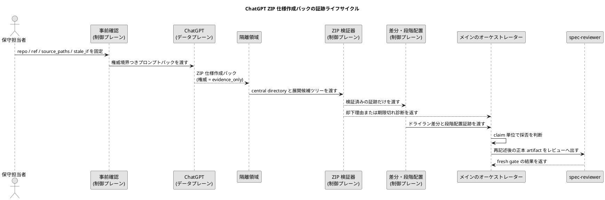

# epic-00283 ChatGPT ZIP 仕様作成パック自動化 — 設計（どう実現するか）

## 結論

この設計は、ChatGPT が返す ZIP 仕様作成パックを未信頼の証跡として扱い、SpecDock 側の制御プレーンが検証、段階配置、採否判断を行う構成にする。

設計の中心は、制御プレーンとデータプレーンの分離である。

- 制御プレーン: repo / ref / source manifest、プロファイル解決、テンプレート選択、スキーマ検証、正本への採否判断、fresh `spec-reviewer` gate。
- データプレーン: ChatGPT が返す ZIP、ドラフト文書、Issue 候補、プロファイル推奨、レビュアー注目点、採用マップ、セルフレビュー。

ZIP を生成できたことは、正本を昇格してよいことを意味しない。この設計では `bundle_generation_not_promotion: true` を固定ルールとして扱う。

## コンポーネント境界

- `scripts/authoring-pack/` にドッグフード専用スクリプトを置く。
- tracked fixture は `tests/fixtures/authoring_pack/` に置き、`manual-tests/` は untracked trial workspace 用に残す。
- v1 では配布ランタイムコマンドを追加しない。
- raw ZIP はリポジトリ外の隔離領域へ置く。
- リポジトリへ残すのは、検証済みでサニタイズされた Markdown 証跡、検証レポート、採用判断材料に限定する。
- 正本の `requirement.md` / `design.md` / `plan.md` は、メインのオーケストレーターが再記述し、レビュアーゲートを通す。

## 制御プレーン

- `prepare-chatgpt-authoring-pack`: repo、ref、source_paths、source hashes、stale_if、denylist、profile snapshot を固定し、プロンプトパックの入力を作る。
- `spec-dock-authoring-pack`: ユーザー向けのスキル / ワークフロー面として、事前確認、検査、段階配置、Issue 引き渡しを束ねる。
- `authoring-pack-review`: ZIP の central directory、パス、スキーマ、ソースハッシュ、プロファイル不一致、危険な権威主張を検査する。
- `authoring-pack-stage`: 正本を上書きせず、ドライラン差分と段階配置 artifact を作る。
- `assurance classify` / `.assurance.json`: Issue プロファイルの権威を持つ。
- `assurance compose`: 選択済みプロファイルのスケルトンとテンプレートハッシュを固定する。
- メインのオーケストレーター: 採用マップを読み、採用・部分採用・却下・保留を claim 単位で判断する。
- `spec-reviewer`: 正本 artifact に対する fresh gate を担う。ChatGPT のセルフレビューやレビュアー注目点は、この gate の代替ではない。

## データプレーン

- `manifest.json`: パックの識別子、権威境界、バンドル方針を持つ。
- `provenance.json`: repo、ref、connector、観測情報を持つ。
- `source-manifest.json`: 参照したソースファイルとハッシュを持つ。
- `stale-if.json`: 採用前に古くなる条件を持つ。
- `drafts/`: Epic / Issue のドラフトを持つ。
- `candidates/issues/*`: Issue 候補のドラフト要件、ドラフト設計、ドラフト実装計画、メタデータを持つ。
- `adoption/adoption-map.json`: ZIP 内ファイルごとの採用候補先と、必要なローカル検証を持つ。
- `reviewer-focus/`: fresh reviewer に見せる観点を持つ。

## ZIP ライフサイクル

1. 保守担当者が Epic / Issue の範囲、参照ソース、期限切れ条件を決める。
2. `prepare-chatgpt-authoring-pack` が repo / ref / source hash / stale_if / profile snapshot を固定する。
3. プロンプトパックが ChatGPT へ権威境界と出力スキーマを渡す。
4. ChatGPT が単一 root `specdock-authoring-pack/` を持つ ZIP を返す。
5. ZIP はリポジトリ外の隔離領域へ保存される。
6. central directory を先に検査し、危険な path / file type / size / mode を安全展開前に拒否する。
7. 安全展開後、manifest、provenance、source、stale、profile、schema、authority claim を検証する。
8. 検証済みの範囲だけをドライラン差分と段階配置へ渡す。
9. メインのオーケストレーターが採用マップを claim 単位で読み、採用候補だけを正本へ再記述する。
10. 各フェーズの正本 artifact は fresh `spec-reviewer` gate を必要とする。

## PlantUML: 証跡ライフサイクルと権威境界

タイトル: ChatGPT ZIP 仕様作成パックの証跡ライフサイクル
答える問い: ZIP がどこまで証跡で、どこから SpecDock 側の権威判断になるか
範囲: ドッグフード専用スクリプト、隔離領域、検証、段階配置、採否判断
除外する詳細: 実装クラス、JSON スキーマの全フィールド
更新条件: ライフサイクル、権威の所有者、検証ゲートが変わるとき



## スキーマと来歴モデル

すべての JSON は、明示または暗黙に次の境界を持つ。

```json
{
  "authority": "evidence_only",
  "adoption_status": "unreviewed",
  "bundle_generation_not_promotion": true
}
```

`manifest.json` はパックの識別子と方針を持つ。`provenance.json` は connector と branch/ref の観測結果を持つ。`source-manifest.json` は repo 相対のソースファイルとハッシュを持つ。`stale-if.json` は採用不能になる条件を持つ。Issue 候補ごとの `candidate.json` は子 Issue の意図と作成候補を持ち、`profile.json` は推奨プロファイルだけを持つ。`authorized_profile` は常にローカル assurance が決める。

## 失敗時の設計

| 失敗 | 扱い | 採用への影響 |
|---|---|---|
| GitHub connector が使えない | 生成前に停止 | branch-sensitive な pack は作らない |
| ZIP に危険な path / mode / file type がある | 展開前に拒否 | 段階配置しない |
| manifest / provenance / source / stale が欠落 | 採用不能 | 再生成または修復が必要 |
| ソースハッシュが一致しない | 影響 claim をブロック | 事前確認からやり直す |
| 危険な権威主張がある | pack 拒否または claim 採用不能 | 正本採用しない |
| プロファイル不一致 | セクション記入を拒否 | 自然言語 claim のみ手動で再評価できる |
| Strict / Critical に必要な local assurance 証跡がない | 強制的に段階配置に留める | 直接の実行引き渡し不可 |

## セキュリティとプライバシー

- raw transcript、認証情報、cookie、token、private key、本番データを含めない。
- central directory を展開前に検査する。
- シンボリックリンク、ハードリンク、デバイスファイル、実行ビット、ネスト archive、バイナリ、隠しパス、パストラバーサル、絶対パスを拒否する。
- 検証はローカルで決定的に行い、取得後のネットワークアクセスを必要としない。
- 検証レポートは、公開向け文書へ内部診断を漏らさない。

## テスト戦略

- 単体テスト: path normalization、central directory inspection、schema validation、source hash comparison、unsafe claim scanner、profile mismatch validator。
- 統合テスト: valid pack intake、dangerous archive rejection、canonical overwrite 防止、adoption-map から EAL 候補への変換。
- ドッグフードシナリオ: A: Epic から Issue 候補を作る、B: 既存 Issue の選択済みプロファイルを埋める、C: 不一致・期限切れをブロックする。
- 回帰テスト: `.assurance.json` を更新しない、all-profile variants を出さない、正本を直接書かない。

## 明示的な対象外

- v1 での配布ランタイムコマンド化。
- reviewer gate の置換。
- ChatGPT によるプロファイル決定。
- ChatGPT による `.assurance.json` 作成・更新。
- 全プロファイル variant の生成。
- raw ZIP の durable repo storage contract。
- provider registry または汎用外部 AI adapter。
- PR 修正や merge workflow の自動化。
