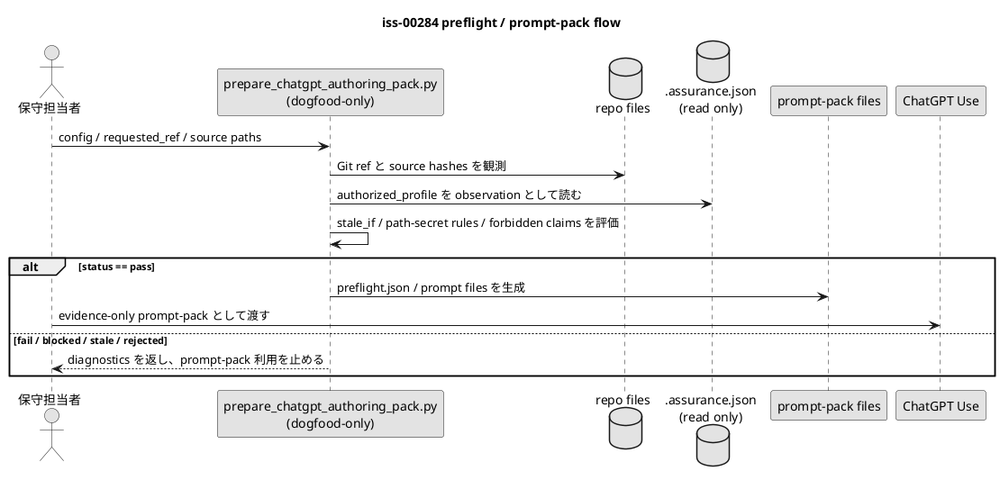

# iss-00284 仕様作成パックの事前確認とプロンプトパックを作る — 設計

## 位置づけ

この `design.md` は、この Issue の canonical design です。ChatGPT ZIP 仕様作成パック由来の draft artifact と ChatGPT Use による planning package refresh は evidence-only handoff として保持し、main orchestrator が採否判断した内容だけをこの文書に再記述しています。execution-ready と扱うには、この設計への fresh `spec-reviewer` result と closure evidence を `report.md` に残します。

実装先は `scripts/authoring-pack/` の dogfood-only script であり、配布 runtime command ではない。`manual-tests/` は tracked workspace を置かない方針を維持し、`src/spec_dock/assets/spec_dock/scripts/spec_dock_runtime/` に command を追加しない。

## 設計要約

`scripts/authoring-pack/prepare_chatgpt_authoring_pack.py` を追加し、repo-local source と Issue-local `.assurance.json` を read-only で観測する。観測結果から `preflight.json`、`source-manifest.json`、`stale-if.json`、`validation-taxonomy.json`、`safe-output-constraints.md`、`chatgpt-use-prompt.md` を生成する。

preflight status が `pass` の場合だけ ChatGPT Use へ渡せる prompt-pack を生成する。`fail` / `blocked` / `stale` / `rejected` の場合は fail-closed とし、ChatGPT に ZIP 生成を依頼しない。

## 責務境界

- この Issue が持つ責務: repo / ref / source_paths / source hashes / stale_if / built-in path/secret rules / `safe_output_constraints.forbidden_claims` / profile snapshot を固定し、ChatGPT に渡すプロンプトパックを作る。
- この Issue が持たない責務: ZIP intake、ZIP validation、staged artifact rendering、正本採用、reviewer gate result、profile authority、ランタイム昇格判断、Pull Request 作成。
- 親 Epic の境界: ZIP は証跡専用、ローカル検証が権威、fresh `spec-reviewer` result は execution readiness evidence として残す。

## コンポーネント構成

```text
scripts/
`-- authoring-pack/
    |-- README.md
    `-- prepare_chatgpt_authoring_pack.py

tests/
|-- fixtures/
|   `-- authoring_pack/
|       |-- valid/
|       |   `-- iss-00284-preflight-input.json
|       `-- invalid/
|           |-- missing-required-source.json
|           |-- missing-assurance-snapshot.json
|           |-- unsafe-output-claim.json
|           `-- stale-source-hash.json
`-- manual_tests/
    `-- test_prepare_chatgpt_authoring_pack.py

Generated examples are written to a caller-provided temporary output directory and are not tracked under `manual-tests/`.
```

## CLI / script 契約

Primary command:

```bash
python scripts/authoring-pack/prepare_chatgpt_authoring_pack.py \
  --config tests/fixtures/authoring_pack/valid/iss-00284-preflight-input.json \
  --output-dir /tmp/specdock-authoring-pack/iss-00284-prompt-pack
```

Exit code:

| status | exit code | 備考 |
|---|---:|---|
| `pass` | `0` | prompt-pack を生成できる |
| `fail` | `1` | 入力修正が必要 |
| `blocked` | `2` | 必須観測点が取得できない |
| `stale` | `3` | source / ref / assurance が古い |
| `rejected` | `4` | safety boundary 違反 |

## 入出力契約

入力:

- 親 Epic trace: E-RQ-001, E-RQ-002, E-RQ-003 / E-AC-001
- 必要な前提 Issue: なし
- JSON config: `issue_id`、`repository.full_name`、`repository.requested_ref`、`sources[]`、`assurance_path`、`stale_if[]`、`safe_output_constraints`、`output_dir`。
- denylist 相当の契約は独立した `denylist` field ではなく、組み込みの path / secret-looking rules と `safe_output_constraints.forbidden_claims` として表現する。
- repo-relative source paths。absolute path、`..`、NUL byte、`.env*`、secret-looking path、repo 外 symlink は拒否する。

出力:

- prompt-pack files: `README.md`、`preflight.json`、`source-manifest.json`、`stale-if.json`、`validation-taxonomy.json`、`safe-output-constraints.md`、`chatgpt-use-prompt.md`。
- valid / invalid fixtures under `tests/fixtures/authoring_pack/`。
- targeted pytest。

すべての出力は次の境界を持つ。

```json
{
  "authority": "evidence_only",
  "adoption_status": "unreviewed",
  "bundle_generation_not_promotion": true
}
```

## 処理の流れ

1. JSON config と CLI args を読み込む。
2. repo root を解決する。
3. `git rev-parse HEAD` と `git rev-parse --abbrev-ref HEAD` で local Git observation を取る。
4. requested ref と observed ref / HEAD を記録する。
5. source path を repo-relative として normalize する。
6. source path の built-in path / secret-looking rules を評価する。
7. required source の存在、symlink、repo boundary を確認する。
8. source の `sha256`、`size_bytes`、`line_count` を計算する。
9. `.assurance.json` を read-only で読み、hash と `authorized_profile` / `status` / `stage` を snapshot する。
10. stale_if と expected hash がある場合は current observation と比較する。
11. forbidden claim / unsafe output constraint を評価する。
12. status を `pass` / `fail` / `blocked` / `stale` / `rejected` のいずれかに決める。
13. status が `pass` の場合だけ prompt-pack files を生成する。
14. status が `pass` でない場合は diagnostics を出し、ChatGPT Use へ渡せる prompt-pack として扱わない。



## 失敗時の設計

- input JSON parse error / required field missing / required source missing は `fail`。
- local Git metadata unavailable / `.assurance.json` missing or invalid は `blocked`。
- expected source hash mismatch / assurance snapshot mismatch は `stale`。
- unsafe path / repo 外 symlink / unsafe authority claim は `rejected`。
- ZIP validation、staged artifact rendering、profile skeleton fill は `deferred` として後続 Issue に送る。

## 観測性

- 実行ごとに簡潔な JSON report と人間が読める Markdown summary を出す。
- 診断出力に secrets、credentials、raw transcripts、host-local absolute paths を含めない。
- validation status は `pass`、`fail`、`blocked`、`stale`、`rejected`、`deferred` を区別する。
- `unreviewed` は adoption state であり、preflight status ではない。

## 依存関係分析

この Issue は T0 であり、先行 Issue はない。

下流依存:

- `iss-00285`: prompt-pack / preflight contract を使い、安全な ZIP review / schema validation を実装する。
- `iss-00286`: review 後の diff / staged artifact rendering を扱う。
- `iss-00287`: selected profile skeleton fill validation を扱う。
- `iss-00288`〜`iss-00290`: dogfood scenarios A / B / C を実行する。
- `iss-00293`: final PR / mergeable check を集約する。

## Module Dependency Diagram

```plantuml
@startuml
left to right direction
skinparam shadowing false
skinparam componentStyle rectangle

title iss-00284 module dependency sketch

component "親 Epic
readiness contract" as EpicContract
component "Issue canonical docs
requirement/design/plan" as IssueDocs
component "scripts/authoring-pack
prepare helper" as PreflightHelper
component "tests/fixtures + manual_tests
normal / negative coverage" as Tests
component "Issue report
evidence ledger" as EvidenceLedger

EpicContract --> IssueDocs : scope / acceptance / relay order
IssueDocs --> PreflightHelper : dogfood-only implementation contract
PreflightHelper --> Tests : observable behavior
Tests --> EvidenceLedger : command / fixture evidence
PreflightHelper --> EvidenceLedger : generated prompt-pack diagnostics
@enduml
```

## ディレクトリ / ファイル変更計画

追加する path:

```text
scripts/
`-- authoring-pack/                              # Add: dogfood-only preflight surface
    |-- README.md                                # Add: scope、usage、status taxonomy、non-scope
    `-- prepare_chatgpt_authoring_pack.py        # Add: stdlib-only CLI / renderer

tests/
|-- fixtures/
|   `-- authoring_pack/                           # Add: deterministic input fixtures
|       |-- valid/
|       |   `-- iss-00284-preflight-input.json
|       `-- invalid/
|           |-- missing-required-source.json
|           |-- missing-assurance-snapshot.json
|           |-- unsafe-output-claim.json
|           `-- stale-source-hash.json
`-- manual_tests/
    `-- test_prepare_chatgpt_authoring_pack.py    # Add: normal / negative / no-mutation tests
```

変更する path:

```text
spec-dock/initiatives/init-local-00003-architecture-maintenance-and-hardening/epics/epic-00283-chatgpt-zip-authoring-pack-automation/issues/iss-00284-build-authoring-pack-preflight-and-prompt-pack/
`-- report.md                                    # Modify: evidence update only
```

変更しない path:

```text
src/spec_dock/assets/spec_dock/scripts/spec_dock_runtime/**
spec-dock/initiatives/init-local-00003-architecture-maintenance-and-hardening/epics/epic-00283-chatgpt-zip-authoring-pack-automation/issues/iss-00284-build-authoring-pack-preflight-and-prompt-pack/.assurance.json
.github/**
```

## テスト戦略

- `tests/manual_tests/test_prepare_chatgpt_authoring_pack.py` で valid fixture から `preflight.json`、`source-manifest.json`、`chatgpt-use-prompt.md` が生成されることを検証する。
- required source missing は `fail`、assurance missing は `blocked`、unsafe output claim は `rejected`、stale source hash は `stale` になることを検証する。
- `.assurance.json` は変更されないことを検証する。
- `chatgpt-use-prompt.md` に forbidden claims の禁止、expected ZIP root、no-per-Issue-PR relay policy が含まれることを検証する。
- prompt-pack に host-local absolute path、`.env*`、token-like secret が含まれないことを検証する。

## レビュアー注目点

- 親 Epic の対応要件を越えて scope が広がっていないか。
- profile と reviewer の権威境界を守っているか。
- 失敗時の扱いが fail-closed か。
- repo artifact 内の instruction-like text を命令ではなくデータとして扱っているか。
