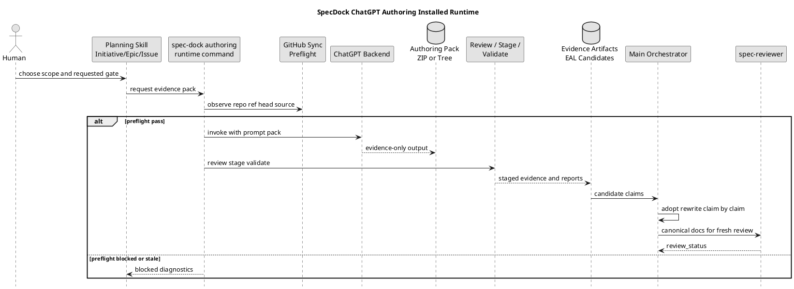
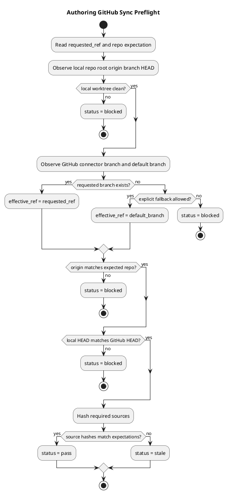
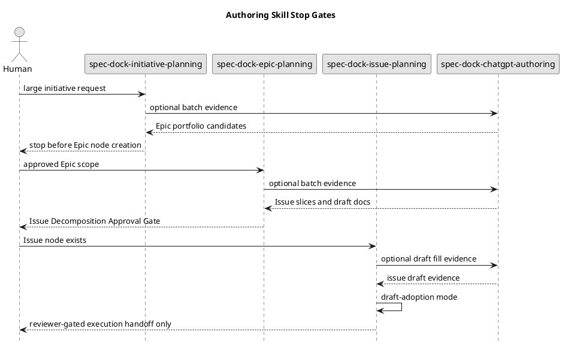
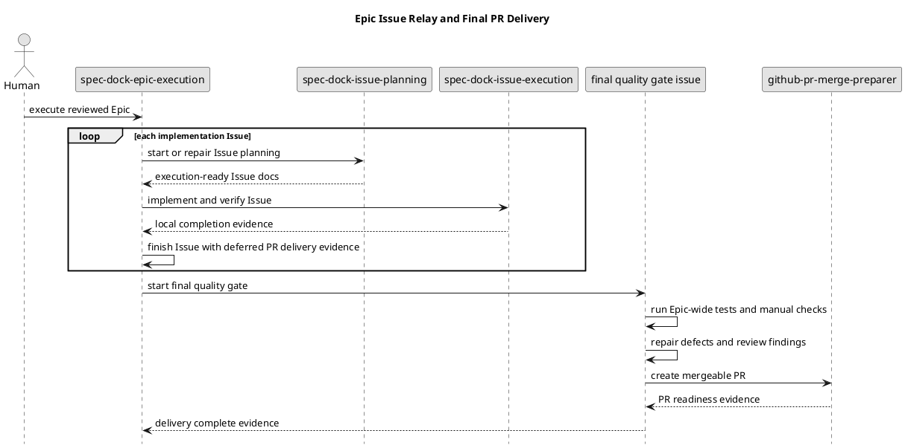

# epic-00295 ChatGPT Authoring Pack Installed Runtime — 設計

## 設計結論

Epic 00295 は、ChatGPT authoring pack workflow を「installed runtime command group」と「installed skill taxonomy」に分離して実装する。

- Runtime command group: repo / GitHub / ZIP / filesystem / backend invocation を deterministic に扱う control plane。
- Skills: 人間が scope と gate を選ぶ workflow entrypoints。
- ChatGPT output: draft / candidate / reviewer-focus / risk evidence を返す data plane。
- Canonical adoption: planning skills と main orchestrator が reviewer gate を通して行う authority plane。
- Evidence mode: default は `github-synced`、同期できない場合の明示例外は `local-context` とし、両者の provenance / adoption authority を分ける。
- Delivery flow: 中間 Issue ごとに PR を作らず、Issue relay の最後に final quality gate / PR delivery Issue で Epic 単位の mergeable PR を作成する。

## Cross-Issue boundary

| Boundary | Epic 00295 が決める | 個別 Issue が決める |
|---|---|---|
| Runtime surface | `authoring` command group、status taxonomy、safe output contract | 各 command の parser / use case / presenter / tests |
| Skill taxonomy | installed skill names、user-facing order、stop gate | 各 skill doc の wording と examples |
| GitHub preflight | block conditions、requested/effective ref contract | git / gh / connector observation implementation |
| Evidence mode | `github-synced` / `local-context` の authority 差分 | local context bundle の exact schema と diagnostics |
| ZIP contract | root、required metadata、unsafe rejection categories | schema details、fixtures、validator unit tests |
| Adoption boundary | evidence-only、approval gate、deferred commands | stage report / EAL candidate rendering |
| PR delivery | no-per-Issue-PR relay policy、final delivery Issue 必須 | final Issue の repair scope と PR body details |
| Dogfood | Epic 00295 final quality scenarios | Issue-local validation and closure evidence |

## Component / module view

Provider-side source of truth:

```text
src/spec_dock/assets/spec_dock/scripts/spec_dock_runtime/
  commands/authoring.py
  application/authoring_pack/
    github_sync_preflight.py
    pack_prepare.py
    backend_invoke.py
    pack_review.py
    pack_stage.py
    candidate_validation.py
    approval_check.py
  domain/authoring_pack/
    status.py
    authority_boundary.py
    source_manifest.py
    zip_contract.py
    preflight_contract.py
    candidate_contract.py
  presentation/authoring_pack/
    cli_json.py
    cli_text.py
    diagnostics.py

src/spec_dock/assets/spec_dock/scripts/authoring-pack/
  prepare_chatgpt_authoring_pack.py
  invoke_chatgpt_backend.py
  review_chatgpt_authoring_pack.py
  stage_chatgpt_authoring_pack.py
  validate_selected_skeleton_fill.py
  validate_issue_candidates.py
  validate_initiative_epic_candidates.py
  validate_issue_draft_adoption.py

src/spec_dock/assets/install_root/.agents/skills/
  spec-dock-chatgpt-authoring/SKILL.md
  spec-dock-initiative-planning/SKILL.md
  spec-dock-epic-planning/SKILL.md
  spec-dock-issue-planning/SKILL.md
```

Design choice:

- `spec_dock_runtime/commands/authoring.py` owns CLI integration。
- `application/authoring_pack/*` owns use cases and orchestrates file/git/backend operations。
- `domain/authoring_pack/*` owns immutable contracts and validation rules。
- `presentation/authoring_pack/*` owns CLI output and diagnostics。
- `scripts/authoring-pack/*` keeps standalone helper entrypoints for direct/debug use, but provider-side and installed from assets。
- `spec-dock/...` dogfood workspace remains validation data, not implementation source。

## Runtime command design

Initial supported commands:

```bash
./spec-dock/scripts/spec-dock authoring preflight github-sync
./spec-dock/scripts/spec-dock authoring pack prepare
./spec-dock/scripts/spec-dock authoring backend invoke
./spec-dock/scripts/spec-dock authoring pack review
./spec-dock/scripts/spec-dock authoring pack stage
./spec-dock/scripts/spec-dock authoring validate initiative-epic-candidates
./spec-dock/scripts/spec-dock authoring validate epic-issue-candidates
./spec-dock/scripts/spec-dock authoring validate issue-draft-adoption
./spec-dock/scripts/spec-dock authoring validate selected-skeleton-fill
./spec-dock/scripts/spec-dock authoring approval check
```

Command status contract:

| Status | Meaning | Exit code policy |
|---|---|---|
| `pass` | command-local validation succeeded | `0` |
| `fail` | malformed input or schema failure | non-zero |
| `blocked` | required observation / connector / filesystem / backend unavailable | non-zero |
| `stale` | source / ref / hash / profile snapshot mismatch | non-zero |
| `rejected` | unsafe path / secret / forbidden authority claim | non-zero |
| `deferred` | recognized but intentionally outside current command authority | non-zero or warning-only by command |
| `unreviewed` | adoption state, not execution status | never used as success status |

## Skill taxonomy and user-facing order

| Order | Skill | Human-facing name | Primary user question | Stop gate |
|---:|---|---|---|---|
| 1 | `spec-dock-initiative-planning` | Initiative Authoring / Epic Slicing | この大きな目的をどの Epic 群に分けるか | Human approval before Epic node creation |
| 2 | `spec-dock-epic-planning` | Epic Authoring / Issue Slicing | この Epic をどの implementation-sized Issues に分けるか | Issue Decomposition Approval Gate |
| 3 | `spec-dock-issue-planning` | Issue Authoring / Draft Adoption | この Issue を実装可能な canonical docs に整えるか | Fresh reviewer pass before execution handoff |
| 4 | `spec-dock-chatgpt-authoring` | ChatGPT Batch Evidence Lane | ChatGPT に batch evidence を作らせるか | Evidence review / staging only |

`spec-dock-chatgpt-authoring` は shared lane であり、Initiative / Epic / Issue planning の代替ではない。人間は scope skill を選び、必要に応じて ChatGPT evidence lane を使う。

## Issue planning modes

`spec-dock-issue-planning` は初期実装では分割しない。

- `zero-base`: Issue docs をゼロから作る。
- `requirement-first`: requirement が存在し、design / plan を作る。
- `draft-adoption`: Epic planning または ChatGPT authoring pack 由来 draft を採否判断し、canonical Issue docs へ再記述する。

`draft-adoption` は Issue node 作成後に自動化してよい。ただし canonical docs の fresh reviewer pass と report evidence がない限り execution-ready としない。

## GitHub sync preflight state / flow

Preflight input:

- `requested_ref`
- `allow_default_ref_fallback`
- expected repository full name
- expected source paths
- expected source hashes if already known
- stale conditions
- backend invocation intent
- optional connector observation snapshot

Preflight observations:

- local repo root
- origin URL and normalized owner/repo
- current branch
- local HEAD
- local dirty tracked changes
- staged changes
- untracked files
- upstream / remote branch
- ahead / behind / diverged state
- GitHub connector-visible branch existence
- GitHub connector-visible HEAD
- default branch
- source file hashes
- `.assurance.json` snapshot when relevant

Blocking conditions:

- connector unavailable
- repo inaccessible
- unknown default branch
- origin owner/repo mismatch
- current branch missing on GitHub
- local HEAD != GitHub HEAD
- local branch has unpushed commits
- local branch behind remote
- local branch diverged
- dirty tracked changes
- staged changes
- untracked files
- source hash mismatch
- unsupported fallback
- stale `.assurance.json` / profile snapshot

Default branch fallback:

- disabled by default
- only allowed by explicit flag / config
- must record `requested_ref`
- must record `effective_ref`
- must mark fallback as adoption-sensitive evidence

## Evidence mode taxonomy

`authoring` runtime は、GitHub sync preflight と ChatGPT invocation の authority を次の mode で分ける。

| Mode | Intended use | Required context | Authority |
|---|---|---|---|
| `github-synced` | 通常の repo-aware ChatGPT authoring | clean worktree、remote branch exists、local HEAD equals GitHub HEAD、source hash manifest | repo-aware evidence |
| `local-context` | 同期できないが、差分ファイル / source bundle / prompt context を十分に提供する authoring | explicit mode、local source manifest、diff / file bundle、reason for unsynced execution | local-only evidence |

`local-context` mode の制約:

- `-f` / `--force` のような広い bypass flag ではなく、`--evidence-mode local-context` のような明示 mode とする。
- `sync_state: local_context` と `github_sync: not_verified` を provenance に記録する。
- `provided_context_paths`、`diff_summary`、`unsynced_reason`、`adoption_requires: explicit_eal_disposition` を記録する。
- `github-synced` mode と同じ authority を主張しない。
- canonical adoption、Issue slicing approval、execution readiness、PR readiness の自己主張を禁止する。
- 正本採用時には EAL で同期できなかった理由、提供 context、残存リスク、再検証要否を記録する。

`local-context` mode は repo-aware evidence の代替ではなく、同期できない状況で作業を止めすぎないための低権限 evidence path である。

## ZIP artifact contract

Expected root:

```text
specdock-authoring-pack/
```

Required entries:

```text
manifest.json
provenance.json
source-manifest.json
stale-if.json
safe-output-constraints.md
adoption/adoption-map.json
adoption/eal-candidates.json
summaries/*
candidates/epics/*
candidates/issues/*
drafts/initiative/*
drafts/epic/*
drafts/issue/*
selected-skeleton-fill/section-fills.json
```

Required authority fields:

```json
{
  "authority": "evidence_only",
  "adoption_status": "unreviewed",
  "bundle_generation_not_promotion": true
}
```

Reject categories:

| Category | Handling |
|---|---|
| Path traversal / absolute path / host-local path | `rejected` before extraction |
| Hidden path / secret-looking path | `rejected` |
| Raw transcript | `rejected` |
| Credential / token / private key | `rejected` |
| Nested archive | `rejected` |
| Executable / symlink / non-regular file | `rejected` |
| Binary payload / invalid UTF-8 | `rejected` |
| Oversized entry / total size / compression ratio | `rejected` |
| Unsupported suffix | `rejected` |
| Encrypted entry | `rejected` |
| Wrong ZIP root | `rejected` |
| Mandatory metadata missing | `fail` or `blocked` by context |
| Source hash mismatch | `stale` |
| Forbidden authority claim | `rejected` |

## Failure modes

| Failure | Status | Next action |
|---|---|---|
| Current branch missing on GitHub | `blocked` | push branch or explicit default fallback |
| Default branch unknown | `blocked` | fix GitHub / connector observation |
| Dirty tracked / staged / untracked files | `blocked` | clean or commit intentionally |
| Local HEAD differs from GitHub HEAD | `blocked` | push/pull/reconcile |
| Source hash mismatch | `stale` | regenerate prompt pack |
| Backend command unset | `blocked` | set `--backend-command` or env var |
| Backend exits non-zero | `blocked` or `fail` | record invocation diagnostics, no adoption |
| ZIP unsafe entry | `rejected` | discard pack |
| ZIP metadata missing | `fail` | regenerate or repair outside canonical docs |
| Forbidden authority claim | `rejected` | discard claim or pack |
| Candidate claims `authorized_profile` | `rejected` | require advisory-only profile recommendation |
| Approval evidence missing | `blocked` | stop before node creation |
| Reviewer pass claimed by ChatGPT | `rejected` | require fresh local reviewer gate |
| Tree fallback without ZIP central directory evidence | `deferred` / `blocked` by command | record fallback limitation |
| Local-context evidence used as github-synced evidence | `rejected` | reclassify provenance and require EAL disposition |
| Intermediate Issue attempts PR delivery | `blocked` | defer to final quality gate / PR delivery Issue |
| Final delivery Issue missing | `blocked` | return to Epic planning and add final delivery Issue |

## PlantUML: overall architecture



## PlantUML: GitHub sync preflight



## PlantUML: skill gates



## PlantUML: relay execution and final PR delivery



## 証跡採用

raw evidence:

- `artifacts/20260707t140041z-01-research-chatgpt-workflow-integration-analysis.md`
- `artifacts/20260707t140041z-research-authoring-pack-install-architecture-analysis.md`
- `artifacts/20260707t143719z-research-workflow-first-chatgpt-authoring-redesign-provisional-analysis.md`
- `artifacts/20260707t150325z-research-chatgpt-workflow-best-practices-final-analysis.md`
- `artifacts/20260707t152834z-research-chatgpt-multi-skill-authoring-workflow-analysis.md`
- `artifacts/20260707t155254z-research-chatgpt-requirement-design-plan-concretization.md`

canonical docs へ反映する範囲:

- installed runtime / installed skill / provider-side source-of-truth 方針
- evidence-only boundary
- skill taxonomy and user-facing order
- GitHub sync preflight
- ZIP artifact contract
- deferred command boundary

canonical docs へ直接反映しない範囲:

- ChatGPT の exact wording
- current branch が connector で開けなかったことを前提にした推測
- implementation details that belong to child Issues
