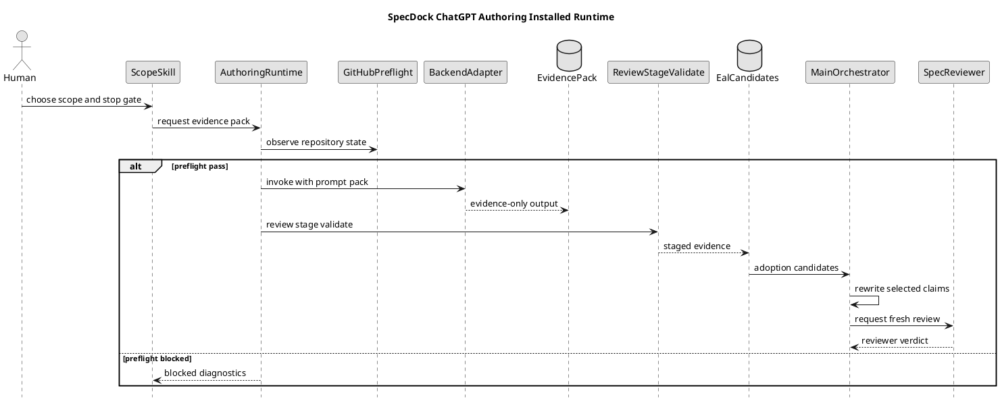
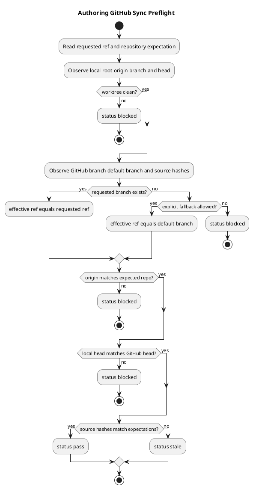
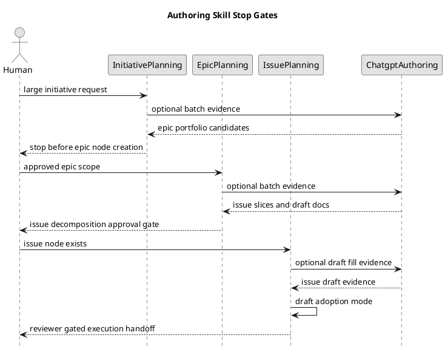
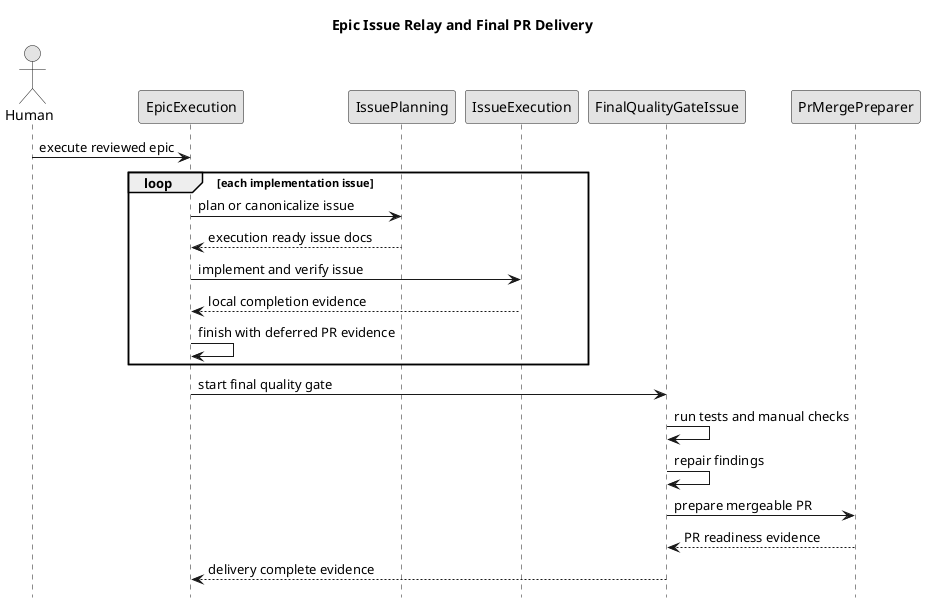

# epic-00295 ChatGPT Authoring Pack Installed Runtime — 設計

## 設計結論

Epic 00295 は、ChatGPT authoring workflow を次の 4 plane に分離する。

| Plane | 責務 | 権限 |
|---|---|---|
| Scope skill plane | Initiative / Epic / Issue の human-facing workflow entrypoint | 次の stop gate まで |
| Authoring runtime plane | GitHub preflight、prompt pack、backend invocation、ZIP review/stage、validators | evidence generation / validation まで |
| Evidence data plane | ChatGPT output、drafts、candidate packs、reports、EAL candidates | evidence-only |
| Authority plane | Codex/main orchestrator、SpecDock planning skills、fresh reviewer gate | canonical adoption / readiness / PR delivery |

この分離により、ChatGPT は大量の draft / candidate evidence を生成できるが、SpecDock の正本権限や reviewer gate を越えない。

## Provider-side source of truth

```text
src/spec_dock/assets/spec_dock/scripts/spec_dock_runtime/
  commands/authoring.py
  application/authoring_pack/
    github_sync_preflight.py
    pack_prepare.py
    backend_invoke.py
    pack_review.py
    pack_stage.py
    candidate_validation.py
    approval_check.py
  domain/authoring_pack/
    status.py
    authority_boundary.py
    source_manifest.py
    zip_contract.py
    preflight_contract.py
    candidate_contract.py
  presentation/authoring_pack/
    cli_json.py
    cli_text.py
    diagnostics.py

src/spec_dock/assets/spec_dock/scripts/authoring-pack/
  prepare_chatgpt_authoring_pack.py
  invoke_chatgpt_backend.py
  review_chatgpt_authoring_pack.py
  stage_chatgpt_authoring_pack.py
  validate_selected_skeleton_fill.py
  validate_issue_candidates.py
  validate_initiative_epic_candidates.py
  validate_issue_draft_adoption.py

src/spec_dock/assets/install_root/.agents/skills/
  spec-dock-chatgpt-authoring/SKILL.md
  spec-dock-initiative-planning/SKILL.md
  spec-dock-epic-planning/SKILL.md
  spec-dock-issue-planning/SKILL.md
```

Design choices:

- `spec_dock_runtime/commands/authoring.py` owns CLI integration。
- `application/authoring_pack/*` owns use cases and orchestration。
- `domain/authoring_pack/*` owns immutable contracts and validation rules。
- `presentation/authoring_pack/*` owns CLI output and diagnostics。
- `scripts/authoring-pack/*` remains standalone helper / compatibility surface, not the source of truth。
- `spec-dock/...` dogfood workspace remains validation data, not implementation source。

## Runtime command surface

Initial supported commands:

```bash
./spec-dock/scripts/spec-dock authoring preflight github-sync
./spec-dock/scripts/spec-dock authoring pack prepare
./spec-dock/scripts/spec-dock authoring backend invoke
./spec-dock/scripts/spec-dock authoring pack review
./spec-dock/scripts/spec-dock authoring pack stage
./spec-dock/scripts/spec-dock authoring validate initiative-epic-candidates
./spec-dock/scripts/spec-dock authoring validate epic-issue-candidates
./spec-dock/scripts/spec-dock authoring validate issue-draft-adoption
./spec-dock/scripts/spec-dock authoring validate selected-skeleton-fill
./spec-dock/scripts/spec-dock authoring approval check
```

Initial deferred / absent commands:

```bash
./spec-dock/scripts/spec-dock authoring adopt
./spec-dock/scripts/spec-dock authoring create-issues-from-zip
./spec-dock/scripts/spec-dock authoring mark-reviewer-pass
./spec-dock/scripts/spec-dock authoring set-authorized-profile
./spec-dock/scripts/spec-dock authoring issue-execution-ready
./spec-dock/scripts/spec-dock authoring pr-ready
```

These commands must not be presented as implemented behavior in initial docs. If parser placeholders exist, they must return unsupported/deferred fail-closed diagnostics.

## Status taxonomy

| Status | Meaning | Exit code policy |
|---|---|---|
| `pass` | command-local validation succeeded | `0` |
| `fail` | malformed input or schema failure | non-zero |
| `blocked` | required observation / connector / filesystem / backend unavailable | non-zero |
| `stale` | source / ref / hash / profile snapshot mismatch | non-zero |
| `rejected` | unsafe path / secret / forbidden authority claim | non-zero |
| `deferred` | recognized but intentionally outside current command authority | non-zero or warning-only by command |
| `unreviewed` | adoption state, not execution status | never used as success status |

`pass` never means canonical adoption、fresh reviewer pass、execution-ready、PR-ready。

## Skill taxonomy and stop gates

| Order | Skill | Human-facing name | Primary question | Stop gate |
|---:|---|---|---|---|
| 1 | `spec-dock-initiative-planning` | Initiative Authoring / Epic Slicing | 大きな目的をどの Epic 群に分けるか | Human approval before Epic node creation |
| 2 | `spec-dock-epic-planning` | Epic Authoring / Issue Slicing | Epic をどの implementation-sized Issues に分けるか | Issue Decomposition Approval Gate |
| 3 | `spec-dock-issue-planning` | Issue Authoring / Draft Adoption | Issue を実装可能な canonical docs に整えるか | Fresh reviewer pass before execution handoff |
| 4 | `spec-dock-chatgpt-authoring` | ChatGPT Batch Evidence Lane | ChatGPT に batch evidence を作らせるか | Evidence review / staging only |

`spec-dock-issue-planning` modes:

- `zero-base`: Issue docs をゼロから作る。
- `requirement-first`: requirement が存在し、design / plan を作る。
- `draft-adoption`: Epic planning または ChatGPT authoring pack 由来 draft を採否判断し、canonical Issue docs へ再記述する。

## GitHub sync preflight

Preflight input:

- `requested_ref`
- `allow_default_ref_fallback`
- expected repository full name
- expected source paths
- expected source hashes
- stale conditions
- backend invocation intent
- optional connector observation snapshot
- evidence mode

Preflight observations:

- local repo root
- origin URL and normalized owner/repo
- current branch
- local HEAD
- local dirty tracked changes
- staged changes
- untracked files
- upstream / remote branch
- ahead / behind / diverged state
- GitHub connector-visible branch existence
- GitHub connector-visible HEAD
- default branch
- source file hashes
- `.assurance.json` snapshot when relevant

Blocking conditions:

- connector unavailable
- repo inaccessible
- unknown default branch
- origin owner/repo mismatch
- current branch missing on GitHub
- local HEAD differs from GitHub HEAD
- unpushed commits
- local branch behind remote
- local branch diverged
- dirty tracked changes
- staged changes
- untracked files
- source hash mismatch
- unsupported fallback
- stale `.assurance.json` / profile snapshot

Default branch fallback is disabled by default. Explicit fallback must record `requested_ref`, `effective_ref`, and adoption-sensitive evidence classification.

## Evidence mode taxonomy

| Mode | Intended use | Required context | Authority |
|---|---|---|---|
| `github-synced` | normal repo-aware ChatGPT authoring | clean worktree, remote branch exists, local HEAD equals GitHub HEAD, source hash manifest | repo-aware evidence |
| `local-context` | unsynced but sufficient files/diff/prompt context are provided | explicit mode, local source manifest, diff/file bundle, unsynced reason | local-only evidence |

`local-context` constraints:

- Must be explicit, not `-f` / `--force`。
- Records `sync_state: local_context` and `github_sync: not_verified`。
- Records `provided_context_paths`、`diff_summary`、`unsynced_reason`。
- Records `adoption_requires: explicit_eal_disposition`。
- Must not claim the same authority as `github-synced`。
- Must not claim canonical adoption、Issue slicing approval、execution readiness、PR readiness。

## Prompt pack contract

`authoring pack prepare` creates deterministic prompt pack inputs:

- `manifest.json`
- `provenance.json`
- `source-manifest.json`
- `stale-if.json`
- `safe-output-constraints.md`
- mode-specific prompt instructions
- forbidden authority claim list
- expected ZIP root and file schema

The prompt pack is not a durable raw transcript store. It must avoid secret、credential、host-local absolute path、private data over-capture。

## ZIP artifact contract

Expected root:

```text
specdock-authoring-pack/
```

Required entries:

```text
manifest.json
provenance.json
source-manifest.json
stale-if.json
safe-output-constraints.md
adoption/adoption-map.json
adoption/eal-candidates.json
summaries/*
candidates/epics/*
candidates/issues/*
drafts/initiative/*
drafts/epic/*
drafts/issue/*
selected-skeleton-fill/section-fills.json
```

Required authority fields:

```json
{
  "authority": "evidence_only",
  "adoption_status": "unreviewed",
  "bundle_generation_not_promotion": true
}
```

Reject categories:

| Category | Handling |
|---|---|
| Path traversal / absolute path / host-local path | `rejected` before extraction |
| Hidden path / secret-looking path | `rejected` |
| Raw transcript | `rejected` |
| Credential / token / private key | `rejected` |
| Nested archive | `rejected` |
| Executable / symlink / non-regular file | `rejected` |
| Binary payload / invalid UTF-8 | `rejected` |
| Oversized entry / total size / compression ratio | `rejected` |
| Unsupported suffix | `rejected` |
| Encrypted entry | `rejected` |
| Wrong ZIP root | `rejected` |
| Mandatory metadata missing | `fail` or `blocked` by context |
| Source hash mismatch | `stale` |
| Forbidden authority claim | `rejected` |

ZIP central directory must be inspected before extraction. Tree fallback is lower-quality fallback evidence because it lacks ZIP central directory evidence.

## Validators

Candidate validators:

- `validate initiative-epic-candidates`: parent Initiative trace、candidate Epic boundaries、duplicate/overlap diagnostics、human approval before Epic node creation。
- `validate epic-issue-candidates`: parent Epic trace、Issue boundaries、dependency order、draft packs、advisory-only profile recommendation。
- `validate issue-draft-adoption`: Issue node exists、draft pack digest、parent trace、target canonical docs mapping、EAL disposition requirement。
- `validate selected-skeleton-fill`: selected profile、template hash、section inventory、missing/extra section diagnostics。
- `approval check`: explicit approval evidence、candidate digest、requested/effective scope、approver/timestamp/statement。

Validators do not create nodes, adopt docs, change `.assurance.json`, grant reviewer pass, or mark execution-ready。

## Failure modes

| Failure | Status | Next action |
|---|---|---|
| Current branch missing on GitHub | `blocked` | push branch or explicit default fallback |
| Default branch unknown | `blocked` | fix GitHub / connector observation |
| Dirty tracked / staged / untracked files | `blocked` | clean or commit intentionally |
| Local HEAD differs from GitHub HEAD | `blocked` | push/pull/reconcile |
| Source hash mismatch | `stale` | regenerate prompt pack |
| Backend command unset | `blocked` | set `--backend-command` or env var |
| Backend exits non-zero | `blocked` or `fail` | record invocation diagnostics, no adoption |
| ZIP unsafe entry | `rejected` | discard pack |
| ZIP metadata missing | `fail` | regenerate or repair outside canonical docs |
| Forbidden authority claim | `rejected` | discard claim or pack |
| Candidate claims `authorized_profile` | `rejected` | require advisory-only profile recommendation |
| Approval evidence missing | `blocked` | stop before node creation |
| Reviewer pass claimed by ChatGPT | `rejected` | require fresh local reviewer gate |
| Tree fallback without ZIP central directory evidence | `pass` with `fallback=true` and lower authority | stage only as evidence-only fallback; record `missing_evidence=zip-central-directory` |
| Local-context evidence used as github-synced evidence | `rejected` | reclassify provenance and require EAL disposition |
| Intermediate Issue attempts PR delivery | `blocked` | defer to final quality gate / PR delivery Issue |
| Final delivery Issue missing | `blocked` | return to Epic planning and add final delivery Issue |

## PlantUML: overall architecture



## PlantUML: GitHub sync preflight



## PlantUML: skill gates



## PlantUML: relay execution and final PR delivery



## Test / validation impact

- CLI help / parser / dispatch tests。
- GitHub preflight positive and negative fixtures。
- Prompt pack deterministic output tests。
- Backend unset / env / CLI override / dry-run tests。
- ZIP safety and forbidden claim fixtures。
- Candidate validator fixtures。
- Issue draft adoption / selected skeleton fixtures。
- Managed skill install simulation。
- Docs consistency and `git diff --check`。
- Final quality gate with full validation and manual dogfood scenarios。
