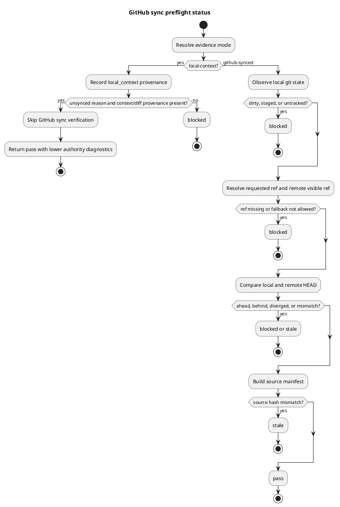

# iss-00298 GitHub Sync Preflight — Issue 設計書

## 1. Standard grade 確認

この Issue は `standard` として扱う。

- installed runtime command と provider-side shipped assets に影響する。
- Git / GitHub visible state を扱う fail-closed gate であり、後続の ChatGPT authoring evidence の信頼性に影響する。
- ただしこの Issue では canonical adoption、backend invocation、ZIP staging、PR delivery、GitHub mutation、destructive migration を行わない。

Escalation guard:

- canonical docs の直接更新 command、authoring runtime command による `.assurance.json` mutation、reviewer pass claim、PR-ready claim、credentialed GitHub mutation が必要になった場合は停止して再計画する。
- SpecDock workflow が planning / execution gate の source binding を最新化するために `assurance classify` で `.assurance.json` を更新することは、authoring runtime command の責務外であり、本設計の禁止対象ではない。
- `local-context` を broad force bypass として扱う必要が出た場合は停止し、`epic-00295` の evidence authority boundary に戻す。

## 2. 設計意図

`authoring preflight github-sync` は ChatGPT に repository / branch を参照させる前の evidence gate である。ここで検査するのは「このローカル作業状態を ChatGPT が GitHub 経由で同じものとして参照できるか」であり、ChatGPT output の採用可否や reviewer pass を決めるものではない。

採用する設計方針:

- `[N]` default mode は `github-synced` とし、local worktree / branch / HEAD / source hash が remote visible state と一致しない限り pass しない。
- `[N]` `local-context` は明示 mode のみとし、GitHub sync verification の代替成功として扱わない。
- `[N]` command output は `authority: evidence_only` と command-local validation semantics を明示する。
- `[N]` unsafe / stale / unknown は fail-closed とし、silent fallback を禁止する。
- `[P]` GitHub connector-visible HEAD はこの Issue では remote tracking branch observation と adapter slot で表現し、後続 backend/connector integration から実 connector observer を差し替え可能にする。

採用しない方針:

- `--force` / `-f` による broad bypass。
- default branch への暗黙 fallback。
- preflight pass を canonical adoption、fresh reviewer pass、execution-ready、PR-ready と同一視する output。
- ChatGPT / Oracle wrapper の実行。

## 3. 変更責任と境界

### 3.1 Runtime command

`authoring preflight github-sync` は `commands/authoring.py` から呼ばれる実 command とする。

責務:

- CLI option を受け取り、application use case に渡す。
- 結果を human-readable diagnostics と machine-readable JSON のどちらでも表現できる形にする。
- blocked / stale / pass の exit code を deterministic に返す。

非責務:

- backend command 実行。
- prompt pack 生成。
- ZIP 展開。
- canonical artifact の更新。

### 3.2 Application use case

`application/authoring_pack/github_sync_preflight.py` は、local git observation、remote visible observation、source manifest、evidence mode を統合して preflight result を作る。

責務:

- `github-synced` / `local-context` の mode semantics を一箇所に集約する。
- block reason と remediation hint を集約する。
- source manifest hash を evidence に含める。
- connector / remote observation が未解決の場合は pass にしない。

### 3.2.1 Source manifest baseline

Source manifest は「現在観測した hash」を出すだけではなく、比較対象の baseline を明示する。

`github-synced` mode の baseline:

- `source_paths` は command option `--source-path` の繰り返し指定、または未指定時の default inventory から決める。
- default inventory は、この Issue では runtime 実装面に限定し、`src/spec_dock/assets/spec_dock/scripts/spec_dock_runtime/` と `spec-dock/scripts/spec_dock_runtime/` の authoring command / authoring_pack subtree を対象にする。
- `--expected-source-manifest PATH` が指定された場合は、その manifest の `source_manifest_hash` と現在の manifest hash を比較し、不一致なら `status=stale` とする。
- `--expected-source-hash HASH` が指定された場合は、現在の manifest hash と比較し、不一致なら `status=stale` とする。
- expected manifest / expected hash が未指定の場合、source mismatch detection は実行せず、現在の `source_manifest_hash`、`source_paths`、`source_hashes` を provenance として出力する。この場合も `source_hash_mismatch_checked: false` を明示する。

`local-context` mode の baseline:

- GitHub sync baseline は検証しない。
- `provided_context_paths` と optional `diff_summary` / `unsynced_reason` を provenance として出力する。
- `source_manifest_hash` は local context の snapshot hash であり、GitHub-visible source と一致する claim ではない。

### 3.3 Domain contract

`domain/authoring_pack/preflight_contract.py` は preflight result の status taxonomy、evidence mode、sync state、block reason、authority boundary を定義する。

`domain/authoring_pack/source_manifest.py` は source file inventory と hash manifest を定義する。

責務:

- status: `pass` / `blocked` / `stale`。
- evidence mode: `github-synced` / `local-context`。
- authority: always `evidence_only`。
- forbidden authority claims を型・出力契約上混入させない。

### 3.4 Infra / git observation

Git 実体の観測は既存 infra pattern を優先し、足りない場合だけ小さな helper を追加する。

観測する状態:

- repo root
- origin URL
- current branch
- local HEAD
- upstream / remote branch HEAD
- ahead / behind
- tracked dirty
- staged changes
- untracked files

### 3.5 Presentation

`presentation/authoring_pack/diagnostics.py` は command-local result を text / dict 表現へ変換する。

出力には必ず以下を含める。

- `status`
- `evidence_mode`
- `sync_state`
- `authority`
- `requested_ref`
- `effective_ref`
- `local_head`
- `remote_head`
- `source_manifest_hash`
- `source_hash_mismatch_checked`
- `github_sync`
- `provided_context_paths`
- `diff_summary`
- `unsynced_reason`
- `blockers`
- `adoption_requires`
- `bundle_generation_not_promotion`

## 4. CLI contract

最小 contract:

```text
./spec-dock/scripts/spec-dock authoring preflight github-sync [--evidence-mode github-synced|local-context] [--format text|json] [--allow-default-branch-fallback] [--repo-root PATH] [--ref REF] [--source-path PATH] [--expected-source-manifest PATH] [--expected-source-hash HASH] [--provided-context-path PATH] [--diff-summary TEXT] [--unsynced-reason TEXT]
```

- default `--evidence-mode` は `github-synced`。
- default `--format` は `text`。
- `--allow-default-branch-fallback` がない場合、requested ref が解決不能でも default branch に fallback しない。
- `--repo-root` は test fixture / explicit repo root 指定用であり、未指定時は current working directory から repo root を解決する。
- `--ref` は requested ref を明示するための option であり、未指定時は current branch を requested ref とする。
- `--source-path` は source manifest の対象を明示する。複数対象は option を繰り返し指定する。未指定時は authoring runtime subtree の default inventory を使う。
- `--expected-source-manifest` と `--expected-source-hash` は stale detection の baseline であり、両方指定された場合は同じ expected hash として扱えないと usage error にする。
- `--provided-context-path`、`--diff-summary`、`--unsynced-reason` は `local-context` mode の provenance である。複数 context path は option を繰り返し指定する。`local-context` では `--unsynced-reason` を必須にし、さらに `--provided-context-path` または `--diff-summary` のどちらかを必須にする。

### 4.1 Connector/default-branch failure adapter

この Issue は実 ChatGPT connector invocation を行わないが、preflight application use case は remote visible observer の結果を受け取る adapter boundary を持つ。

Required observer states:

- `resolved`: requested/effective ref と visible HEAD が得られた。
- `branch_missing`: requested ref が remote-visible state に存在しない。
- `connector_unavailable`: connector / observer が利用できず、GitHub-visible state を確認できない。
- `default_branch_unknown`: fallback opt-in 時に default branch を解決できない。
- `origin_mismatch`: local origin と expected remote identity が一致しない。

CLI の初期実装は local remote tracking observer を使ってよい。tests は application-level fake observer または hermetic remote fixture により、`connector_unavailable` と `default_branch_unknown` が `status=blocked` になることを閉じる。

Exit code:

- `0`: `status=pass`。
- `1`: `status=blocked` / `status=stale` / invalid local-context request / unsafe state。
- `2`: CLI usage error。

## 5. 状態遷移



## 6. 失敗時の扱い

| 失敗モード | status | 設計上の扱い |
|---|---|---|
| dirty tracked changes | blocked | GitHub-visible state と一致しないため停止 |
| staged changes | blocked | prompt source が未確定なため停止 |
| untracked files | blocked | source manifest 欠落リスクがあるため停止 |
| local branch ahead | blocked | GitHub が local commit を参照できないため停止 |
| local branch behind | stale | local が古い可能性があるため停止 |
| diverged | blocked | 同期対象が不明確なため停止 |
| remote branch missing | blocked | repo-aware invocation の参照先がないため停止 |
| origin mismatch | blocked | ChatGPT が別 repository を参照するリスクがあるため停止 |
| source hash mismatch | stale | pack / source evidence が古い可能性があるため停止 |
| connector/default branch unknown | blocked | silent fallback を避けるため停止 |
| local-context provenance missing | blocked | broad force bypass 化を避けるため停止 |

## 7. 検証設計

Focused tests は hermetic git fixture を使う。

- clean / synced branch positive。
- dirty tracked / staged / untracked negative。
- ahead / behind / diverged negative。
- remote branch missing / origin mismatch / fallback disallowed negative。
- fallback allowed の requested/effective ref separation。
- `local-context` provenance。
- expected manifest / expected hash mismatch stale。
- local-context missing provenance blocked。
- forbidden authority claims absence。
- provider-side source と dogfooding mirror の command behavior parity。

## 8. 後続 Issue との接続

- `iss-00299` は preflight evidence を prompt pack prepare に渡す。
- `iss-00300` は backend command adapter を実装するが、本 Issue の preflight pass を invocation 前条件として利用する。
- `iss-00307` が最終 quality gate と mergeable PR delivery を担うため、この Issue では PR を作成しない。

## 9. 採用した draft evidence

以下の draft artifacts を正式設計へ採用した。

- `artifacts/20260707t171243z-draft-requirement-implement-github-sync-preflight-draft-requirement.md`
- `artifacts/20260707t171243z-01-draft-design-implement-github-sync-preflight-draft-design.md`
- `artifacts/20260707t171243z-02-draft-plan-implement-github-sync-preflight-draft-plan.md`

採用範囲:

- GitHub sync preflight の fail-closed scope。
- `github-synced` / `local-context` authority boundary。
- default fallback explicit opt-in。
- source hash / provenance / forbidden authority claim の検証方針。

調整した点:

- GitHub connector-visible observation は、この Issue では remote tracking comparison と adapter slot に分け、実 backend connector invocation は後続 Issue へ残す。
- PR delivery は中間 Issue として明示的に `iss-00307` へ defer する。
