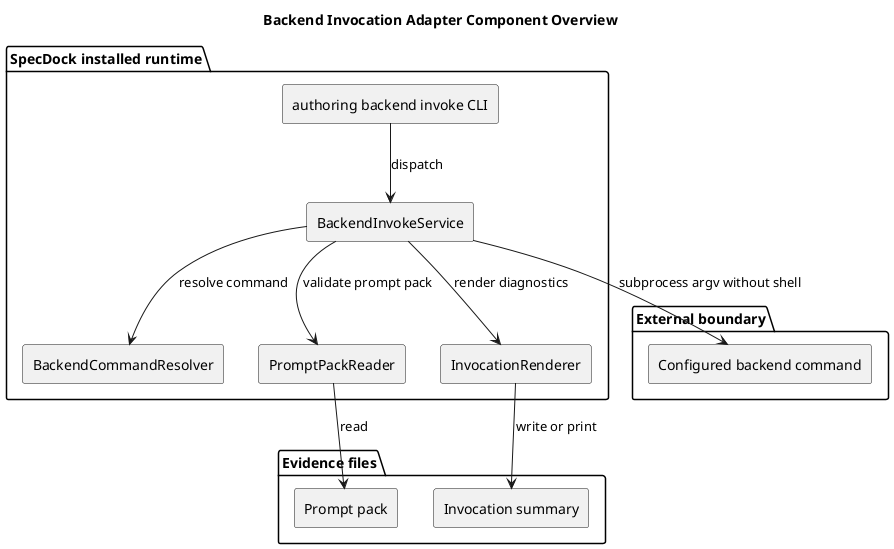
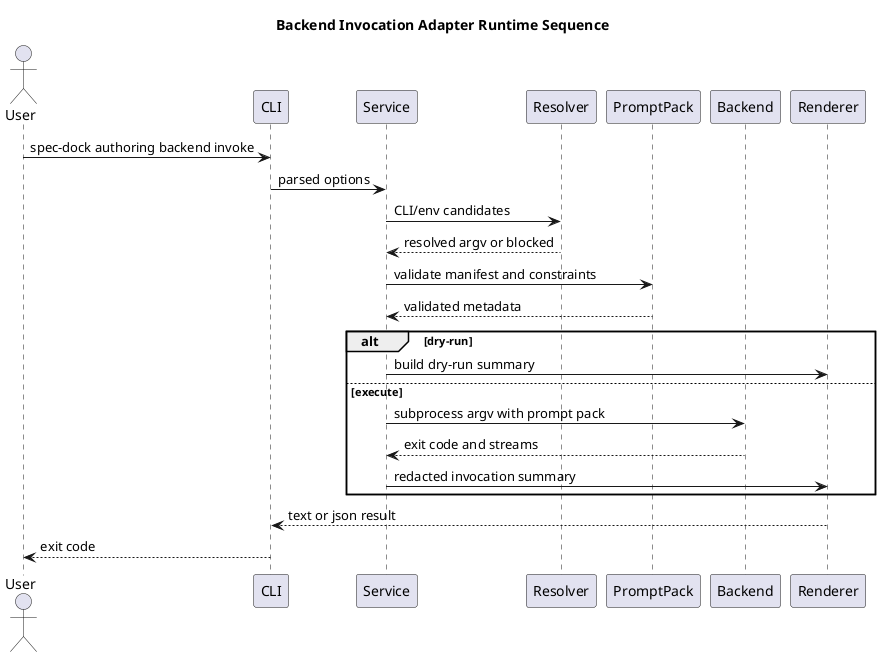

# iss-00300 Backend Invocation Adapter — Issue 設計書

## 1. Standard Grade 確認

この Issue は `standard` として扱う。

- Consumer-visible installed runtime command `authoring backend invoke` を追加する。
- External process invocation、env var、argv parsing、timeout、redaction、path safety を扱う。
- Provider-side source と dogfood installed runtime mirror の両方に影響する。
- ただし永続データ migration、GitHub state mutation、irreversible operation、PR delivery は含まない。

Strict / Critical へ引き上げる条件:

- backend invocation が canonical docs を直接書き換える必要が出た場合。
- credential / secret を永続 artifact に保存する必要が出た場合。
- GitHub issue / PR / branch state をこの command が直接 mutation する必要が出た場合。
- ZIP extraction / candidate adoption / approval gate へ scope が拡張された場合。

## 2. 設計意図

`authoring backend invoke` は ChatGPT automation 本体を SpecDock に抱え込まない。SpecDock は prompt pack と backend process の間に薄い adapter を置き、backend command を明示設定から解決し、fail-closed な invocation evidence を返す。

設計上の中心は次の分離である。

| 層 | 責務 |
| --- | --- |
| CLI / commands | option parsing、runtime command registration、exit code boundary |
| Application | prompt pack validation、backend command resolution、dry-run、subprocess execution、invocation summary construction |
| Domain | command source priority、status mapping、authority/provenance rule、redaction policy contract |
| Infra boundary | `subprocess.run` execution, timeout, cwd/environment handling |
| Presentation | text/json rendering、redacted stdout/stderr summary、blocked/rejected/pass diagnostics |

この Issue は backend invocation adapter だけを実装する。ZIP review/stage、candidate validation、approval check、canonical adoption、final PR delivery は別 Issue の責務である。

## 3. 正本・根拠

| 種別 | パス・識別子 | この Issue への意味 |
| --- | --- | --- |
| Issue requirement | `requirement.md` | Scope、non-scope、AC-001..AC-017 |
| Epic plan | `spec-dock/active/epic/plan.md` | C05 backend invocation adapter、no-per-Issue-PR relay |
| Draft requirement | `artifacts/20260707t171251z-draft-requirement-implement-backend-invocation-adapter-draft-requirement.md` | 初期 purpose / scope / acceptance seeds |
| Draft design | `artifacts/20260707t171251z-01-draft-design-implement-backend-invocation-adapter-draft-design.md` | target paths / failure modes |
| Draft plan | `artifacts/20260707t171252z-draft-plan-implement-backend-invocation-adapter-draft-plan.md` | step sequence / verification seeds |
| ChatGPT evidence | `artifacts/20260708-chatgpt-use-planning-evidence-summary.md` | CLI/env priority、redaction、dry-run、local-context authority の planning evidence |
| Existing runtime command | `src/spec_dock/assets/spec_dock/scripts/spec_dock_runtime/commands/authoring.py` | `authoring` command group の既存 registration point |
| Existing pack prepare | `src/spec_dock/assets/spec_dock/scripts/spec_dock_runtime/application/authoring_pack/pack_prepare.py` | prompt pack output contract and provenance |
| Existing tests | `tests/cli_runtime/test_authoring.py` | authoring command CLI regression lane |

優先順位は、Epic docs、Issue requirement、Issue design、Issue plan、Issue-local artifacts / ChatGPT evidence の順とする。

## 4. 要件から設計への追跡

| Requirement | Design ID | 設計上の扱い |
| --- | --- | --- |
| AC-001 | DES-CLI-001 | `authoring backend invoke` subcommand を parser / command handler に登録する。 |
| AC-002..AC-005 | DES-DOM-001 | backend command resolver が CLI -> `SPECDOCK_CHATGPT_COMMAND` -> `ORACLE_CHATGPT_COMMAND` の順で source を返す。 |
| AC-006 / AC-010 | DES-DOM-002 | command string は `shlex.split(..., posix=True)` で argv list にし、shell execution を禁止する。 |
| AC-007 | DES-APP-001 | dry-run path は subprocess adapter を呼ばない。 |
| AC-008 | DES-APP-002 | prompt pack manifest / required files / metadata を invocation 前に検証する。 |
| AC-009 | DES-APP-003 | output directory / summary path は canonical docs と symlink を拒否する。 |
| AC-011 / AC-012 | DES-APP-004 | backend non-zero / timeout を blocked diagnostics に map する。 |
| AC-013 | DES-PRES-001 | stdout / stderr / paths / secret-like data を renderer で redact する。 |
| AC-014 | DES-DOM-003 | provenance が `local-context` の場合は lower authority を summary に固定する。 |
| AC-015 / AC-016 | DES-COMPAT-001 | provider runtime と compatibility script が同じ application contract を使う。 |
| AC-017 | DES-WF-001 | PR delivery defer evidence を `report.md` に残し、この Issue では PR を作らない。 |

## 5. 変更しないもの

| 対象 | 変更しない理由 |
| --- | --- |
| ChatGPT backend automation 本体 | SpecDock は backend command を呼ぶだけであり、Oracle / ChatGPT automation を vendoring しない。 |
| ZIP review / stage | `iss-00301` の責務。 |
| Candidate validation | `iss-00302` の責務。 |
| Issue draft adoption validation | `iss-00303` の責務。 |
| Skill taxonomy / workflow docs | `iss-00304` / `iss-00306` の責務。必要最小の command reference 以外は触らない。 |
| Approval stop gate | `iss-00305` の責務。 |
| Final quality gate / PR delivery | `iss-00307` の責務。 |

## 6. Target Design Delta

| Design ID | 種別 | Current | Target | 固定度 |
| --- | --- | --- | --- | --- |
| DES-CLI-001 | CLI | `authoring backend invoke` は deferred command | implemented subcommand with help/text/json outputs | `[N]` |
| DES-DOM-001 | Domain | backend command source rule がない | CLI/env/fallback priority を明示 contract 化 | `[N]` |
| DES-DOM-002 | Domain | shell safety contract がない | `shlex.split` + no shell execution | `[N]` |
| DES-DOM-003 | Domain | invocation provenance summary がない | `github-synced` / `local-context` の authority 差を保持 | `[N]` |
| DES-APP-001 | Application | dry-run invocation path がない | process non-execution dry-run summary | `[N]` |
| DES-APP-002 | Application | prompt pack validation と invocation が未接続 | invocation 前に manifest / required files / metadata を検査 | `[N]` |
| DES-APP-003 | Application | output target safety が未定義 | canonical target / symlink / unsafe path を拒否 | `[N]` |
| DES-APP-004 | Application | subprocess result mapping がない | pass / blocked / rejected の deterministic mapping | `[N]` |
| DES-PRES-001 | Presentation | raw stdout/stderr summary の安全契約がない | redacted text/json summary | `[N]` |
| DES-COMPAT-001 | Compatibility | standalone helper が runtime と分離し得る | provider runtime application へ委譲、または contract parity を維持 | `[P]` |
| DES-WF-001 | Workflow | 中間 Issue の PR delivery defer evidence が未記録 | finish 時に `iss-00307` への defer rationale を残す | `[N]` |

## 7. Component Overview



## 8. Runtime Sequence



## 9. Command Contract

Primary command:

```bash
./spec-dock/scripts/spec-dock authoring backend invoke \
  --prompt-pack <path> \
  --output-dir <path> \
  [--backend-command <command-string>] \
  [--slug <slug>] \
  [--prompt <text>] \
  [--evidence-mode github-synced|local-context] \
  [--timeout-seconds <int>] \
  [--dry-run] \
  [--format text|json]
```

Command source priority:

1. CLI `--backend-command`
2. `SPECDOCK_CHATGPT_COMMAND`
3. `ORACLE_CHATGPT_COMMAND` as optional compatibility fallback
4. unset -> `blocked`

`--force` は導入しない。同期できない事情は `local-context` provenance と明示的な evidence input で表現し、backend invocation bypass として扱わない。

### Backend argv ABI

`authoring backend invoke` は、解決した backend command argv に次の suffix を追加して backend process を起動する。

```text
<resolved-backend-argv>
  --slug <slug>
  -p <prompt>
  --file <prompt-pack>/chatgpt-use-prompt.md
  --file <prompt-pack>/expected-output-contract.md
  --file <prompt-pack>/manifest.json
  --file <prompt-pack>/provenance.json
  --file <prompt-pack>/source-manifest.json
  --file <prompt-pack>/stale-if.json
  --file <prompt-pack>/safe-output-constraints.md
```

ABI rules:

- `<resolved-backend-argv>` は `--backend-command` / env var の command string を `shlex.split(..., posix=True)` で分割した argv list である。
- `--slug` は CLI `--slug` の値を使う。未指定時は prompt pack の manifest と source hash から deterministic slug を作る。
- `-p` は CLI `--prompt` の値を使う。未指定時は `"Use the attached prompt pack files as the task brief. Produce the requested authoring output."` を使う。
- prompt pack は stdin では渡さない。backend command には repeated `--file` 引数で渡す。
- `--output-dir` は SpecDock adapter が invocation summary / diagnostics を置くための local output directory であり、backend argv には渡さない。
- backend stdout / stderr は adapter が capture し、redacted summary と status mapping だけを durable output に残す。
- この ABI は ChatGPT Use / Oracle wrapper 互換を初期 target とする。将来 provider registry を導入する場合も、この Issue では ABI を増やさない。

## 10. Domain Design

### BackendCommandResolution

| Field | Meaning |
| --- | --- |
| `status` | `resolved` or `blocked` |
| `source` | `cli`, `env:SPECDOCK_CHATGPT_COMMAND`, `env:ORACLE_CHATGPT_COMMAND`, `unset` |
| `argv` | resolved command argv list |
| `compatibility_fallback` | fallback env を使ったか |
| `diagnostics` | blocked reason / malformed command reason |

Rules:

- Empty string は unset と同じ扱い。
- `shlex.split` failure は `blocked`。
- command source は summary に表示する。
- fallback 使用時は `compatibility_fallback=true` を表示する。

### PromptPackInput

Invocation 前に prompt pack root は次を満たす必要がある。

必須ファイル:

- `.specdock-authoring-pack`
- `manifest.json`
- `provenance.json`
- `source-manifest.json`
- `stale-if.json`
- `safe-output-constraints.md`
- `chatgpt-use-prompt.md`
- `expected-output-contract.md`

`manifest.json` 必須 fields:

- `schema_version`
- `generated_by`
- `expected_output_root`
- `required_metadata`
- `files`
- `authority`
- `adoption_status`
- `bundle_generation_not_promotion`

`provenance.json` 必須 fields:

- `evidence_mode`
- `sync_state`
- `github_sync`
- `source_manifest_hash`
- `authority`
- `adoption_status`
- `bundle_generation_not_promotion`

`source-manifest.json` 必須 fields:

- `source_paths`
- `source_hashes`
- `source_manifest_hash`

`stale-if.json` は JSON object でなければならない。

Authority boundary:

- `authority` は `evidence_only`。
- `adoption_status` は `unreviewed`。
- `bundle_generation_not_promotion` は `true`。

`safe-output-constraints.md` と `expected-output-contract.md` は readable regular file でなければならない。symlink、directory、missing file は rejected / blocked とする。

### InvocationStatus

| Condition | Status | Exit code |
| --- | --- | --- |
| dry-run success | `pass` | `0` |
| backend exit `0` | `pass` | `0` |
| unset backend | `blocked` | non-zero |
| malformed command | `blocked` | non-zero |
| invalid prompt pack | `blocked` or `rejected` | non-zero |
| unsafe output target | `rejected` | non-zero |
| backend non-zero | `blocked` | non-zero |
| timeout | `blocked` | non-zero |

`pass` は invocation-local success だけを意味する。canonical adoption、reviewer pass、execution-ready、PR-ready は意味しない。

## 11. Application Design

### BackendInvokeService

Inputs:

- prompt pack path
- output directory
- optional backend command string
- optional slug / prompt
- evidence mode
- dry-run flag
- timeout seconds
- output format

Processing:

1. backend command を resolve する。
2. prompt pack root を validate する。
3. output directory / summary target の safety を validate する。
4. backend argv ABI suffix を組み立てる。
5. dry-run の場合は process を起動せず summary を返す。
6. execute の場合は backend argv を subprocess へ shell なしで渡す。
7. result streams を redaction し、invocation summary を作る。
8. text/json renderer に status、diagnostics、provenance、authority boundary を渡す。

Stop conditions:

- backend command unresolved
- command parse failure
- prompt pack invalid
- output target unsafe
- timeout
- process execution failure

## 12. Redaction Design

Renderer は durable summary に raw stdout/stderr をそのまま保存しない。

Redaction targets:

- secret-looking tokens: OpenAI key style、GitHub token style、Slack token style、AWS access key style。
- environment assignment with secret-like names: token、secret、password、key を含む名前。
- host-local absolute paths under user home, `/private/`, `/var/folders/`, `/tmp` where durable report text would leak local environment details

Summary は必要最小限にする:

- `stdout_excerpt_redacted`
- `stderr_excerpt_redacted`
- `stdout_bytes`
- `stderr_bytes`
- `redaction_applied`

## 13. Presentation Design

Text output example:

```text
spec-dock: authoring backend invoke
status: blocked
backend_source: unset
authority: evidence_only
adoption_status: unreviewed
message: set --backend-command or SPECDOCK_CHATGPT_COMMAND
```

JSON output は machine-readable fields を安定させる:

```json
{
  "operation": "authoring backend invoke",
  "status": "blocked",
  "backend_source": "unset",
  "authority": "evidence_only",
  "adoption_status": "unreviewed",
  "canonical_adoption": false,
  "reviewer_pass": false,
  "execution_ready": false,
  "pr_ready": false
}
```

## 14. Compatibility Script Design

既存または予定される provider-side helper:

- `src/spec_dock/assets/spec_dock/scripts/authoring-pack/invoke_chatgpt_backend.py`

方針:

- 可能なら runtime application service を import / delegate して同じ contract を使う。
- 直接 import が難しい場合でも、CLI/env priority、dry-run、no shell、redaction、fail-closed、local-context lower authority の parity test を置く。
- 個人環境の `/Users/.../.codex/skills/chatgpt-use/scripts/oracle-chatgpt` は default として直書きしない。設定可能な backend command の一例に留める。

## 15. Test Design Impact

必要な検証:

- help exposes command contract and no `--force`
- unset backend blocks without execution
- CLI override priority
- primary env priority
- optional fallback priority
- malformed command blocks
- no shell execution / argv capture
- exact backend argv ABI suffix capture
- dry-run non-execution
- missing prompt pack / metadata fail-closed
- unsafe output target rejection
- backend non-zero and timeout mapping
- redaction of secrets / host-local paths
- local-context lower authority summary
- provider/dogfood runtime smoke
- compatibility script parity

## 16. 実装への引き渡し

実装は次の順で進める。

1. domain contract と fixtures。
2. backend command resolver。
3. prompt pack / output target validation。
4. argv build / dry-run。
5. subprocess adapter / status mapping。
6. redaction / renderer。
7. CLI integration。
8. compatibility script parity。
9. local-context provenance。
10. report / verification evidence。

上記の実行順と closure mapping は `plan.md` を正とする。
