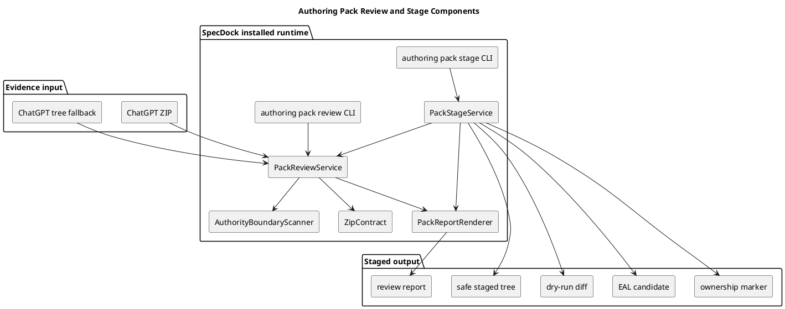
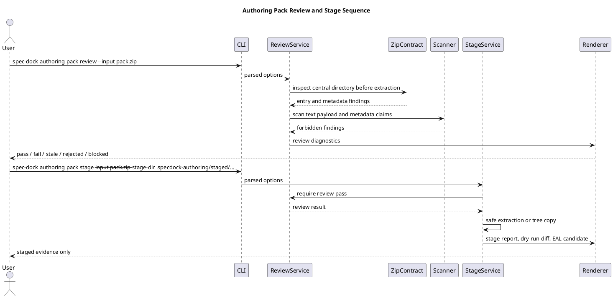

# iss-00301 Zip Review Staging — Issue 設計書

## 1. Standard Grade 確認

この Issue は `standard` として扱う。

- Consumer-visible installed runtime command `authoring pack review` / `authoring pack stage` を実装する。
- ZIP central directory、path safety、metadata、secret-looking content、authority boundary を扱う。
- Provider-side source と dogfood installed runtime mirror の両方に影響する。
- ただし GitHub state mutation、production data migration、canonical docs adoption、PR delivery は含まない。

Strict / Critical へ引き上げる条件:

- stage が canonical docs / `.assurance.json` を直接更新する必要が出た場合。
- credential / secret を durable evidence に保存する必要が出た場合。
- GitHub issue / PR / branch state をこの command が直接 mutation する必要が出た場合。
- approval / reviewer pass / execution-ready を command が決定する必要が出た場合。

## 2. 設計意図

`authoring pack review` / `authoring pack stage` は、ChatGPT output を「採用可能な成果物」としてではなく「採用前 evidence」として扱うための安全境界である。

設計上の中心は次の分離である。

| 層 | 責務 |
| --- | --- |
| CLI / commands | subcommand registration、option parsing、exit code boundary |
| Application | ZIP/tree review orchestration、stage orchestration、diagnostic summary construction |
| Domain | ZIP contract、entry safety、metadata/authority rules、forbidden claim scanning、status mapping |
| Infra boundary | ZIP central directory reading、safe extraction / tree copy、filesystem sentinel |
| Presentation | text/json rendering、review report、stage report、dry-run diff、EAL candidate rendering |

この Issue は review / stage だけを実装する。ChatGPT invocation、candidate validation、approval gate、canonical adoption、final PR delivery は別 Issue の責務である。

## 3. 正本・根拠

| 種別 | パス・識別子 | この Issue への意味 |
| --- | --- | --- |
| Issue requirement | `requirement.md` | Scope、non-scope、AC-001..AC-015 |
| Epic requirement | `spec-dock/active/epic/requirement.md` | ZIP root、required metadata、unsafe entry rejection、authority boundary |
| Epic design | `spec-dock/active/epic/design.md` | evidence-only / status taxonomy / approval boundary |
| Epic plan | `spec-dock/active/epic/plan.md` | C06 target paths / relay policy |
| Draft requirement | `artifacts/20260707t171255z-draft-requirement-promote-zip-review-and-staging-draft-requirement.md` | initial purpose / scope / AC seeds |
| Draft design | `artifacts/20260707t171255z-01-draft-design-promote-zip-review-and-staging-draft-design.md` | target paths / failure modes |
| Draft plan | `artifacts/20260707t171256z-draft-plan-promote-zip-review-and-staging-draft-plan.md` | step sequence / verification seeds |
| Existing prompt pack contract | `src/spec_dock/assets/spec_dock/scripts/spec_dock_runtime/domain/authoring_pack/prompt_pack_contract.py` | required metadata / safe output constraints の既存 source |
| Existing authoring command | `src/spec_dock/assets/spec_dock/scripts/spec_dock_runtime/commands/authoring.py` | `authoring` command group の registration point |
| Existing tests | `tests/cli_runtime/test_authoring.py` | authoring command regression lane |

優先順位は、Epic docs、Issue requirement、Issue design、Issue plan、Issue-local artifacts の順とする。

## 4. 要件から設計への追跡

| Requirement | Design ID | 設計上の扱い |
| --- | --- | --- |
| AC-001 / AC-002 | DES-CLI-001 | `authoring pack review` / `stage` を deferred から implemented subcommand へ昇格する。 |
| AC-003 / AC-005 | DES-ZIP-001 | ZIP central directory を extraction 前に検査し、unsafe pack を展開しない。 |
| AC-006 / AC-009 | DES-ZIP-002 | root / path / suffix / size / encryption / symlink / binary / nested archive / metadata / hash を fail-closed に検査する。 |
| AC-007 / AC-008 | DES-AUTH-001 | secret/raw transcript/forbidden authority claim scanner を domain contract として追加する。 |
| AC-010 | DES-TREE-001 | tree fallback は ZIP review pass と同格に扱わず lower authority diagnostics を出す。 |
| AC-004 / AC-011 | DES-STAGE-001 | review pass 済み pack だけを staging area に配置し、canonical docs unchanged を保証する。 |
| AC-012 | DES-PRES-001 | validation pass と adoption / reviewer pass / execution-ready / PR-ready を renderer で明確に分ける。 |
| AC-013 / AC-014 | DES-COMPAT-001 | provider runtime と dogfood mirror / compatibility scripts が同じ contract を使う。 |
| AC-015 | DES-WF-001 | PR delivery defer evidence を `report.md` に残し、この Issue では PR を作らない。 |

## 5. 変更しないもの

| 対象 | 変更しない理由 |
| --- | --- |
| ChatGPT backend invocation | `iss-00300` の責務。 |
| Candidate validation | `iss-00302` の責務。 |
| Issue draft adoption validation | `iss-00303` の責務。 |
| Skill taxonomy / planning skill docs | `iss-00304` / `iss-00306` の責務。 |
| Human approval stop gate | `iss-00305` の責務。 |
| Canonical docs adoption | この Issue は staged evidence 生成まで。 |
| Final quality gate / PR delivery | `iss-00307` の責務。 |

## 6. Target Design Delta

| Design ID | 種別 | Current | Target | 固定度 |
| --- | --- | --- | --- | --- |
| DES-CLI-001 | CLI | `pack review` / `pack stage` は deferred command | implemented subcommands with text/json output | `[N]` |
| DES-ZIP-001 | Domain/Application | ZIP を安全に review する runtime contract がない | extraction 前 central directory review | `[N]` |
| DES-ZIP-002 | Domain | unsafe entry / metadata rejection が未実装 | deterministic rejection diagnostics | `[N]` |
| DES-AUTH-001 | Domain | forbidden authority claim scanner が未実装 | adoption/reviewer/ready claim を reject | `[N]` |
| DES-TREE-001 | Application | tree fallback の authority 差が未定義 | lower authority / fallback diagnostics | `[N]` |
| DES-STAGE-001 | Application/Infra | safe staging output がない | staged evidence + dry-run diff + EAL candidate + ownership marker | `[N]` |
| DES-PRES-001 | Presentation | review/stage report renderer がない | status / findings / boundary を text/json で表示 | `[N]` |
| DES-COMPAT-001 | Compatibility | standalone review/stage scripts が runtime と分離し得る | runtime application へ委譲、または parity 維持 | `[P]` |
| DES-WF-001 | Workflow | 中間 Issue の PR delivery defer evidence が未記録 | `iss-00307` への defer rationale を report に残す | `[N]` |

## 7. Component Overview



## 8. Runtime Sequence



## 9. Command Contract

Review command:

```bash
./spec-dock/scripts/spec-dock authoring pack review \
  --input <zip-or-tree-path> \
  [--evidence-mode github-synced|local-context] \
  [--report-path <path>] \
  [--format text|json]
```

Stage command:

```bash
./spec-dock/scripts/spec-dock authoring pack stage \
  --input <zip-or-tree-path> \
  --stage-dir <path> \
  [--dry-run] \
  [--format text|json]
```

Exit / status semantics:

| Status | 意味 | Exit |
| --- | --- | --- |
| `pass` | review / stage local validation passed; adoption ではない | 0 |
| `fail` | malformed input or required metadata schema failure | non-zero |
| `stale` | source / ref / hash / stale-if mismatch | non-zero |
| `rejected` | unsafe / invalid / forbidden input | non-zero |
| `blocked` | required input unavailable or output target unsafe | non-zero |

`pass` は reviewer pass、approval、canonical adoption、execution-ready、PR-ready を意味しない。

## 10. Domain Design

### ZipReviewContract

`ZipReviewContract` は次を検査する。

- all entries under root `specdock-authoring-pack/`
- no absolute path / path traversal / host-local path
- no hidden path component
- no symlink entry
- no encrypted entry
- no nested archive suffix
- no executable / unsupported suffix
- size limit per entry and aggregate size limit
- text-decodable supported payload
- required metadata existence and JSON parseability; missing or malformed mandatory metadata maps to `fail`
- source-manifest hash consistency; mismatch maps to `stale`

### AuthorityBoundaryScanner

Scanner は metadata と supported text payload を対象に、次を reject する。

- `authority: accepted`
- `adoption_status: adopted`
- reviewer pass / spec-review pass / qa-review pass / code-review pass claims
- `.assurance.json` mutation claim
- execution-ready / PR-ready / mergeable PR claim
- secret-looking token / credential / private key
- raw ChatGPT transcript / browser transcript

### TreeFallbackReview

Tree input は ZIP central directory evidence がないため、次を result に含める。

- `input_kind=tree`
- `fallback=true`
- `authority_level=lower_than_zip_review`
- `missing_evidence=["zip-central-directory"]`

Tree fallback の `pass` は ZIP review pass と同格ではない。

## 11. Stage Design

Stage は review pass result を前提に次を出力する。

| Output | 内容 |
| --- | --- |
| staged tree | safe extracted / copied pack files |
| `review-report.json` / text | review findings and status |
| `dry-run-diff.md` | intended canonical target と差分候補の readable summary |
| `eal-candidates.json` | Evidence Adoption Ledger candidate entries |
| `.specdock-stage-owner.json` | issue id、source input、hash、created_at、authority boundary |

Stage target safety:

- canonical docs path は reject。
- active docs path は reject。
- `.assurance.json` target は reject。
- symlink target は reject。
- existing non-owned stage directory は reject。

## 12. Plan Handoff

`plan.md` は次を必ず検証する。

- help contract
- valid ZIP review / stage
- unsafe ZIP rejection before extraction
- forbidden authority claim rejection
- tree fallback lower authority diagnostics
- canonical docs unchanged
- provider runtime and dogfood runtime smoke
- compatibility script contract parity
- no-per-Issue-PR evidence
