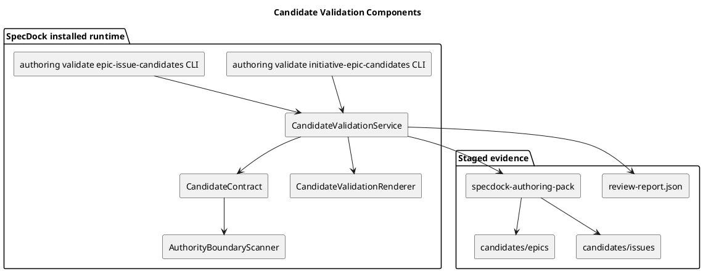

# iss-00302 Initiative Epic Validation — Issue 設計書

## 1. Standard Grade 確認

この Issue は `standard` として扱う。

- installed runtime の consumer-visible CLI behavior を変更する。
- Candidate validation schema、authority boundary、safe path / secret / raw transcript scanning、stale source manifest、profile recommendation boundary を扱う。
- Provider-side source と dogfood mirror の両方に影響する。
- ただし node creation、canonical adoption、`.assurance.json` mutation、credentialed GitHub mutation、PR delivery は含まない。

## 2. 設計意図

`authoring validate initiative-epic-candidates` / `authoring validate epic-issue-candidates` は、ChatGPT batch planning output を node creation 前の candidate-only evidence として検査する安全境界である。

この command は「candidate validation lane」であり「authority lane」ではない。`status=pass` は local validation success のみを意味し、human approval、canonical adoption、reviewer pass、execution-ready、PR-ready、mergeable PR を意味しない。

## 3. 正本・根拠

| 種別 | パス・識別子 | この Issue への意味 |
| --- | --- | --- |
| Issue requirement | `requirement.md` | Scope、non-scope、RQ/AC、failure modes |
| Epic requirement | `spec-dock/active/epic/requirement.md` | ChatGPT output の evidence-only boundary |
| Epic design | `spec-dock/active/epic/design.md` | Authoring runtime plane と Authority plane の分離 |
| Epic plan | `spec-dock/active/epic/plan.md` | C07 target paths / relay policy |
| ChatGPT draft | `/Users/iwasawayuuta/.oracle/sessions/specdock-iss-00302-planning/artifacts/transcript.md` | requirement/design/plan draft source |
| Existing runtime | `src/spec_dock/assets/spec_dock/scripts/spec_dock_runtime/commands/authoring.py` | current deferred command registration |
| Existing scanner | `src/spec_dock/assets/spec_dock/scripts/spec_dock_runtime/domain/authoring_pack/authority_boundary.py` | forbidden claim / secret / raw transcript scan |
| Existing ZIP contract | `src/spec_dock/assets/spec_dock/scripts/spec_dock_runtime/domain/authoring_pack/zip_contract.py` | path / metadata / stale / safety precedent |
| Existing tests | `tests/cli_runtime/test_authoring.py` | authoring command regression lane |

## 4. 要件から設計への追跡

| Requirement | Design ID | 設計上の扱い |
| --- | --- | --- |
| RQ-001 / RQ-002 | DES-CLI-001 | 2 deferred validate commands を implemented `CommandSpec` に置換する。 |
| RQ-003 / RQ-009 | DES-IN-001 | input discovery は review report / source manifest / staged pack digest を検証する。 |
| RQ-004 / RQ-014 | DES-AUTH-001 | Result は authority fields と no-mutation flags を常に含む。 |
| RQ-005 | DES-SCHEMA-INIT-001 | Initiative -> Epic candidate schema を定義する。 |
| RQ-006 / RQ-012 | DES-SCHEMA-ISSUE-001 | Epic -> Issue candidate schema と advisory-only profile schema を定義する。 |
| RQ-007 | DES-VAL-001 | JSON / Markdown loader は malformed / missing / non-object を fail-closed に分類する。 |
| RQ-008 | DES-VAL-002 | duplicate / overlap / dependency diagnostics は sorted deterministic comparison として出力する。 |
| RQ-010 / RQ-011 / RQ-013 | DES-SAFE-001 | existing authority scanner / safe path policy を candidate payload に適用する。 |
| RQ-015 | DES-OUT-001 | report path は canonical docs / `.assurance.json` / symlink を拒否する。 |
| RQ-016 | DES-MIRROR-001 | provider-side implementation と dogfood mirror を同期する。 |
| RQ-017 | DES-COMPAT-001 | compatibility helper を runtime contract へ委譲する。 |
| RQ-018 | DES-RELAY-001 | no-per-Issue-PR handoff を finish evidence に含める。 |

## 5. Target Design Delta

| Design ID | 種別 | Current | Target | 固定度 |
| --- | --- | --- | --- | --- |
| DES-CLI-001 | CLI | candidate validate commands は deferred | implemented subcommands with text/json output | `[N]` |
| DES-IN-001 | Application | staged candidate input gate がない | review report / source / parent / digest gate | `[N]` |
| DES-AUTH-001 | Domain/Presentation | validation pass と approval/adoption が混同されうる | explicit evidence-only / no-mutation flags | `[N]` |
| DES-SCHEMA-INIT-001 | Domain | Initiative -> Epic candidate schema が runtime にない | candidate index / payload / draft docs validation | `[N]` |
| DES-SCHEMA-ISSUE-001 | Domain | Epic -> Issue candidate schema が runtime にない | advisory-only profile / grade recommendation validation | `[N]` |
| DES-VAL-001 | Domain | candidate JSON/Markdown loader がない | deterministic fail/blocked/rejected/stale mapping | `[N]` |
| DES-VAL-002 | Domain | duplicate/overlap diagnostics がない | deterministic comparison summary | `[N]` |
| DES-SAFE-001 | Domain | candidate payload scanner がない | reuse/align existing authority and sensitive scanner | `[N]` |
| DES-OUT-001 | Application | candidate validation report writer がない | safe optional report path | `[N]` |
| DES-MIRROR-001 | Dogfood | installed mirror not updated | provider/dogfood parity | `[P]` |
| DES-COMPAT-001 | Compatibility | helper behavior can diverge | runtime contract wrapper | `[P]` |
| DES-RELAY-001 | Workflow | intermediate finish evidence pending | `iss-00307` PR delivery defer | `[N]` |

## 6. Component Overview



## 7. Command Contract

Initiative -> Epic:

```bash
./spec-dock/scripts/spec-dock authoring validate initiative-epic-candidates \
  --input <staged-dir-or-pack-tree> \
  --expected-parent-initiative <initiative-id> \
  [--review-report <review-report.json>] \
  [--expected-source-manifest-hash <sha-or-token>] \
  [--evidence-mode github-synced|local-context] \
  [--report-path <candidate-validation-report.json>] \
  [--format text|json]
```

Epic -> Issue:

```bash
./spec-dock/scripts/spec-dock authoring validate epic-issue-candidates \
  --input <staged-dir-or-pack-tree> \
  --expected-parent-epic <epic-id> \
  [--review-report <review-report.json>] \
  [--expected-source-manifest-hash <sha-or-token>] \
  [--evidence-mode github-synced|local-context] \
  [--report-path <candidate-validation-report.json>] \
  [--format text|json]
```

禁止:

- `--force`
- implicit approval override
- node creation target
- canonical output target

Exit code:

- `0`: `status=pass`
- `1`: `status != pass`

## 8. Domain Model

### Result status

| Status | 意味 |
| --- | --- |
| `pass` | candidate validation passed locally; evidence remains unreviewed |
| `fail` | schema or required candidate data is invalid |
| `blocked` | required observation/evidence is unavailable |
| `stale` | source/parent/review digest no longer matches expectation |
| `rejected` | safety or authority boundary violation |

`unreviewed` は adoption state であり command status ではない。

Review report gate mapping:

- Missing or unreadable review report: `blocked`.
- Malformed review report JSON: `fail`.
- Review report status `stale`: validator status `stale`; candidate payload validation is skipped.
- Review report status `rejected`: validator status `rejected`; candidate payload validation is skipped.
- Review report status `fail`: validator status `fail`; candidate payload validation is skipped.
- Review report status `blocked`: validator status `blocked`; candidate payload validation is skipped.
- Any other non-`pass` review status: `blocked` with `unsupported_review_status:<status>`.
- Result must include `review_status=<observed-status>` and `review_gate_passed=false` for all non-pass review reports.

### CandidateValidationResult

Result は最低限次を含む。

- `status`
- `authority="evidence_only"`
- `adoption_status="unreviewed"`
- `bundle_generation_not_promotion=true`
- `evidence_mode`
- `candidate_kind`
- `input_path`
- `review_status`
- `fallback`
- `parent_scope`
- `expected_source_manifest_hash`
- `observed_source_manifest_hash`
- `candidate_count`
- `valid_candidate_count`
- `approval_required=true`
- `node_creation_performed=false`
- `canonical_written=false`
- `assurance_mutated=false`
- `reviewer_pass_claimed=false`
- `execution_ready=false`
- `pr_ready=false`
- `findings`
- `comparison`
- `candidates`

### Candidate index schema

`candidates/epics/index.json` and `candidates/issues/index.json`:

```json
{
  "schema_version": 1,
  "authority": "evidence_only",
  "adoption_status": "unreviewed",
  "bundle_generation_not_promotion": true,
  "parent_trace": {},
  "candidates": [
    {
      "candidate_id": "candidate-001",
      "slug": "short-safe-slug",
      "title": "Human readable candidate title",
      "path": "candidates/issues/candidate-001/candidate.json"
    }
  ]
}
```

### Candidate payload schema

Common:

```json
{
  "schema_version": 1,
  "authority": "evidence_only",
  "adoption_status": "unreviewed",
  "bundle_generation_not_promotion": true,
  "candidate_id": "candidate-001",
  "slug": "short-safe-slug",
  "title": "Candidate title",
  "parent_trace": {},
  "boundary": {
    "summary": "What this candidate owns",
    "scope": ["..."],
    "non_scope": ["..."],
    "dependencies": ["..."]
  },
  "draft_files": {
    "requirement": "requirement.md",
    "design": "design.md",
    "plan": "plan.md"
  },
  "authority_claims": {
    "node_creation_performed": false,
    "canonical_written": false,
    "assurance_mutated": false,
    "reviewer_pass_claimed": false,
    "execution_ready": false,
    "pr_ready": false
  }
}
```

Initiative -> Epic additions:

```json
{
  "candidate_kind": "epic",
  "approval_gate": "human_approval_before_epic_node_creation",
  "parent_trace": {
    "initiative_id": "init-local-00003"
  },
  "epic_boundary": {
    "scope": ["..."],
    "non_scope": ["..."],
    "depends_on_epic_candidates": []
  }
}
```

Validation:

- `candidate_kind` must be `epic`.
- `parent_trace.initiative_id` must match `--expected-parent-initiative`.
- `approval_gate` must equal `human_approval_before_epic_node_creation`.
- `boundary.scope` and `boundary.non_scope` must be non-empty arrays with no overlap.
- `epic_boundary.depends_on_epic_candidates` must reference only candidate IDs in the same index.
- Required draft files must be candidate-local Markdown files and remain evidence-only.

Epic -> Issue additions:

```json
{
  "candidate_kind": "issue",
  "parent_trace": {"epic_id": "epic-00295-chatgpt-authoring-pack-installed-runtime"},
  "grade_recommendation": {"grade": "standard", "advisory_only": true},
  "profile_recommendation": {
    "profile": null,
    "advisory_only": true,
    "ignored_for_authority": true,
    "authorized_profile": null
  }
}
```

Validation:

- `candidate_kind` must be `issue`.
- `parent_trace.epic_id` must match `--expected-parent-epic`.
- `grade_recommendation.grade`, when present, must be one of `lite`, `standard`, `strict`, or `critical`; any other value is `fail`.
- `grade_recommendation.advisory_only` must be `true`; missing or false advisory marker is `rejected` because the candidate must not claim grade authority.
- `profile_recommendation.profile`, when non-null, must be one of `lite`, `standard`, `strict`, or `critical`; any other value is `fail`.
- `profile_recommendation.advisory_only` and `profile_recommendation.ignored_for_authority` must both be `true`.
- `profile_recommendation.authorized_profile` must be `null`; non-null values are `rejected`.
- The allowed grade/profile set follows `AssuranceProfile` and the Issue grade authoring matrix in `workflow_spec_authoring.md`; this validator only checks candidate payload consistency and never authorizes the profile.

## 9. Output Contract

JSON output は stable / sorted にする。Text output は最低限次を含む。

```text
status=<status>
authority=evidence_only
adoption_status=unreviewed
bundle_generation_not_promotion=true
candidate_kind=<initiative-epic|epic-issue>
candidate_count=<n>
valid_candidate_count=<n>
approval_required=true
node_creation_performed=false
canonical_written=false
assurance_mutated=false
reviewer_pass_claimed=false
execution_ready=false
pr_ready=false
```

Text output は local validation pass を reviewer pass / execution-ready / PR-ready と誤読させる語を含めない。

## 10. Safety / Security Boundaries

- Candidate validator は `spec-dock/active/**`、canonical `requirement.md` / `design.md` / `plan.md`、canonical node `artifacts/`、`.assurance.json` に書き込まない。
- Report path は canonical docs / `.assurance.json` / symlink parent を reject する。
- Candidate validation は ZIP extraction を行わない。ZIP/tree safety は `pack review/stage` に委譲し、validator は review evidence を必須にする。
- Existing scanner logic for forbidden authority claims, secret markers, raw transcript markers を reuse/align する。
- Secret-like findings は raw value を durable report に出さない。
- `local-context` evidence mode は lower authority として扱い、canonical adoption には後続 EAL disposition が必要である。

## 11. Test Strategy

| 分類 | テスト |
| --- | --- |
| CLI help | promoted commands expose implemented options and no `--force` |
| Positive | valid Initiative -> Epic candidates pass; valid Epic -> Issue candidates pass |
| Authority | output includes evidence-only / no-mutation flags; no readiness/adoption implication |
| Schema | malformed JSON、non-object、missing fields、empty candidates |
| Comparison | duplicate IDs/titles/slugs、duplicate scope signatures、scope/non-scope overlap |
| Safety | path traversal、host-local、hidden、secret path、unsupported suffix、binary、oversized |
| Sensitive | token/private key/credential/raw transcript rejected and redacted |
| Forbidden claim | canonical adoption、`.assurance.json` mutation、reviewer pass、execution-ready、PR-ready、mergeable PR rejected |
| Advisory profile | non-null `authorized_profile` / non-advisory profile rejected |
| Stale | parent mismatch、source hash mismatch、review digest mismatch |
| Report path | canonical/assurance/symlink report path rejected and not written |
| Mirror | provider and dogfood runtime smoke |
