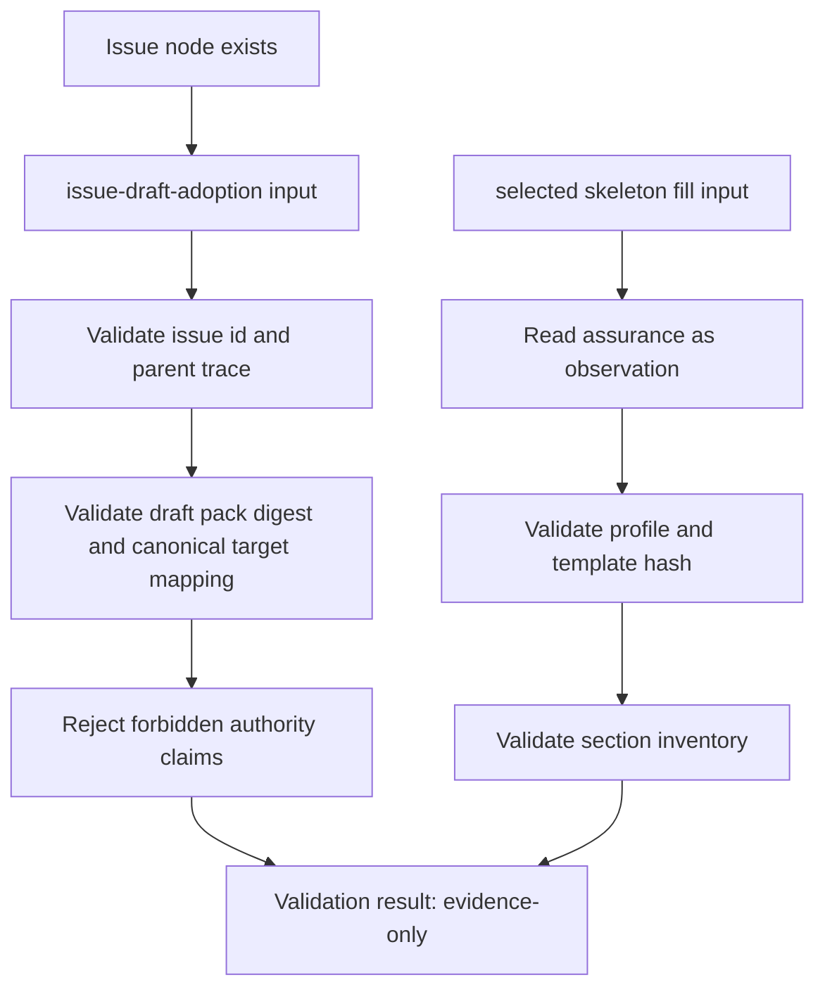

# iss-00303 Issue Draft Adoption Validation — 設計

## 1. 設計結論

`iss-00303` は、`iss-00302` で実装した candidate validation の設計要素を一部再利用しつつ、semantic boundary を分けた 2 つの post-Issue-node validators を追加する。

- `issue-draft-adoption`: Issue node exists 後の draft pack adoption input integrity validator
- `selected-skeleton-fill`: selected profile / template / section fill inventory validator

既存 candidate validator は Issue node 作成前の candidates を扱う。一方、この Issue の validators は既存 Issue node、canonical target mapping、draft digest、selected skeleton、`.assurance.json` observation、EAL disposition requirement を扱う。

## 2. Layered Placement

### 2.1 Provider-side source of truth

```text
src/spec_dock/assets/spec_dock/scripts/spec_dock_runtime/
  domain/authoring_pack/
    issue_draft_adoption_contract.py
    selected_skeleton_fill_contract.py
  application/authoring_pack/
    issue_draft_adoption_validation.py
    selected_skeleton_fill_validation.py
  presentation/authoring_pack/
    issue_draft_adoption_renderer.py
    selected_skeleton_fill_renderer.py
  commands/authoring.py
  cli/parser.py

src/spec_dock/assets/spec_dock/scripts/authoring-pack/
  validate_issue_draft_adoption.py
  validate_selected_skeleton_fill.py
```

### 2.2 Dogfood mirror

Provider-side runtime と同じ surface を dogfood `spec-dock/scripts` runtime tree に反映する。dogfood mirror は実装 source of truth ではないが、installed runtime behavior の検証 surface として扱う。

### 2.3 Tests

`tests/cli_runtime/test_authoring.py` に focused fixtures and command-level tests を追加する。既存 `iss-00302` の authoring validation fixtures と status assertions を参考にする。

## 3. Command Surface

### 3.1 `authoring validate issue-draft-adoption`

Required / primary arguments:

- `--input PATH`: adoption input JSON.
- `--issue-dir PATH`: existing Issue node directory. Initial implementation requires this explicitly.
- `--review-report PATH`: previous review/stage report.
- `--expected-review-digest TEXT` optional.
- `--expected-issue-id TEXT`
- `--expected-parent-epic-id TEXT`
- `--expected-parent-initiative-id TEXT` optional.
- `--expected-draft-pack-digest TEXT` optional but supported.
- `--expected-source-manifest-hash TEXT` optional.
- `--format text|json`
- `--report-path PATH` optional safe non-canonical report output.

No `--force` is provided.

### 3.2 `authoring validate selected-skeleton-fill`

Required / primary arguments:

- `--input PATH`: selected skeleton fill input JSON.
- `--issue-dir PATH`: existing Issue node directory.
- `--assurance PATH`: `.assurance.json` observation path.
- `--selected-skeleton PATH`
- `--expected-issue-id TEXT`
- `--expected-profile TEXT` optional.
- `--expected-template-hash TEXT` optional.
- `--expected-skeleton-hash TEXT` optional.
- `--format text|json`
- `--report-path PATH` optional safe non-canonical report output.

No `--force` is provided.

## 4. Data Contracts

### 4.1 Common result contract

Both validators produce a command-local result:

```json
{
  "schema_version": "authoring-pack-validation-result-v1",
  "validator": "issue-draft-adoption",
  "status": "pass",
  "authority": "evidence_only",
  "adoption_status": "unreviewed",
  "canonical_written": false,
  "assurance_mutated": false,
  "reviewer_pass_claimed": false,
  "execution_ready": false,
  "pr_ready": false,
  "findings": [],
  "summary": {}
}
```

The result may say validation passed. It must not say canonical adoption, reviewer pass, execution-ready, PR-ready, merge-ready, or PR delivery succeeded.

### 4.2 Issue draft adoption input

Minimum schema:

```json
{
  "schema_version": "issue-draft-adoption-v1",
  "issue_id": "iss-00303",
  "parent_epic_id": "epic-00295",
  "parent_initiative_id": "init-local-00003",
  "draft_pack_digest": "sha256:draftpack000000000000000000000000000000000000000000000000000000000000",
  "drafts": {
    "requirement": {"path": "artifacts/20260707t171303z-draft-requirement-validate-issue-draft-adoption-and-selected-skeleton-draft-requirement.md", "sha256": "req0000000000000000000000000000000000000000000000000000000000000"},
    "design": {"path": "artifacts/20260707t171304z-draft-design-validate-issue-draft-adoption-and-selected-skeleton-draft-design.md", "sha256": "des0000000000000000000000000000000000000000000000000000000000000"},
    "plan": {"path": "artifacts/20260707t171304z-01-draft-plan-validate-issue-draft-adoption-and-selected-skeleton-draft-plan.md", "sha256": "plan000000000000000000000000000000000000000000000000000000000000"}
  },
  "canonical_targets": {
    "requirement": "requirement.md",
    "design": "design.md",
    "plan": "plan.md",
    "report_evidence": "report.md"
  },
  "eal_disposition_required": true,
  "authority_claims": {
    "canonical_adoption": false,
    "canonical_written": false,
    "assurance_mutation": false,
    "authorized_profile_decision": false,
    "reviewer_pass": false,
    "execution_ready": false,
    "pr_ready": false
  }
}
```

Validation rules:

- `schema_version` must be exact.
- Issue ID and parent IDs must match expected arguments and Issue node metadata.
- Draft paths must be safe, relative, in the target Issue artifact area, readable, Markdown, non-binary, non-executable, and size-bounded.
- Draft digests must match.
- Draft pack digest must match expected value if supplied.
- Review report digest must match `--expected-review-digest` when supplied. The validator computes SHA-256 over the exact bytes read from `--review-report` and compares that computed digest with the expected digest. Embedded digest fields inside the report are diagnostic only and are not trusted as the comparison source. A mismatch returns `stale`; an unreadable or missing report returns `blocked`.
- Canonical targets are limited to `requirement.md`, `design.md`, `plan.md`, and `report.md` evidence note target.
- `.assurance.json` as a target is rejected.
- forbidden authority claims are rejected.

### 4.3 Selected skeleton fill input

Minimum schema:

```json
{
  "schema_version": "selected-skeleton-fill-v1",
  "issue_id": "iss-00303",
  "selected_profile": "standard",
  "template_hash": "sha256:template0000000000000000000000000000000000000000000000000000000000",
  "selected_skeleton_hash": "sha256:skeleton000000000000000000000000000000000000000000000000000000000",
  "required_sections": ["requirement", "design", "plan"],
  "section_fills": [
    {"section_id": "requirement", "path": "artifacts/20260707t171303z-draft-requirement-validate-issue-draft-adoption-and-selected-skeleton-draft-requirement.md", "sha256": "req0000000000000000000000000000000000000000000000000000000000000"},
    {"section_id": "design", "path": "artifacts/20260707t171304z-draft-design-validate-issue-draft-adoption-and-selected-skeleton-draft-design.md", "sha256": "des0000000000000000000000000000000000000000000000000000000000000"},
    {"section_id": "plan", "path": "artifacts/20260707t171304z-01-draft-plan-validate-issue-draft-adoption-and-selected-skeleton-draft-plan.md", "sha256": "plan000000000000000000000000000000000000000000000000000000000000"}
  ],
  "authority_claims": {
    "assurance_mutation": false,
    "authorized_profile_decision": false,
    "reviewer_pass": false,
    "execution_ready": false,
    "pr_ready": false
  }
}
```

Validation rules:

- `schema_version` must be exact.
- `.assurance.json` is read-only observation. The validator does not mutate it.
- selected profile must match expected profile and assurance observation when supplied.
- template hash and selected skeleton hash must match expected values when supplied.
- required sections must be fully covered.
- missing / extra / duplicate section IDs return `fail`.
- section fill paths must be safe and must not point at canonical docs, `.assurance.json`, hidden paths, host-local paths, symlinks, or secret-looking paths.

## 5. Status Mapping

| status | Trigger |
|---|---|
| `pass` | All command-local validation checks pass. |
| `fail` | malformed schema, missing required fields, missing/extra/duplicate sections, malformed inventory, missing required draft. |
| `blocked` | required observation missing: review report, Issue node, `.assurance.json`, selected skeleton, unsupported review status. |
| `stale` | issue/parent/source/review/draft/skeleton/profile/template digest mismatch. |
| `rejected` | unsafe path, forbidden authority claim, `.assurance.json` mutation request, canonical write claim, secret/raw transcript. |

## 6. Relationship To `iss-00302`

Reuse:

- status taxonomy style
- no-mutation authority boundary
- safe report path guard concept
- sensitive payload scanner
- deterministic findings
- provider/dogfood parity tests

Do not reuse semantics blindly:

- `validate epic-issue-candidates` validates pre-node Issue candidates.
- `validate issue-draft-adoption` validates post-node draft adoption input.
- `validate selected-skeleton-fill` validates profile/template/section inventory.
- Candidate validation pass does not imply draft adoption validation pass.
- Draft adoption validation pass does not imply canonical adoption.

## 7. Failure Modes

- Missing Issue node -> `blocked`
- Issue ID mismatch -> `stale`
- Parent Epic mismatch -> `stale`
- Parent Initiative mismatch -> `stale`
- Missing review report -> `blocked`
- Review report `stale` -> `stale`
- Review report `rejected` -> `rejected`
- Review report `fail` -> `fail`
- Review report `blocked` -> `blocked`
- Unsupported review status -> `blocked`
- Empty selected skeleton required section list -> `fail`
- Missing draft -> `fail`
- Draft digest mismatch -> `stale`
- Unsafe draft path -> `rejected`
- Canonical target outside allowed set -> `rejected`
- `.assurance.json` target or mutation claim -> `rejected`
- Missing section -> `fail`
- Extra section -> `fail`
- Duplicate section -> `fail`
- Selected profile mismatch -> `stale`
- Template hash mismatch -> `stale`
- Forbidden reviewer pass / execution-ready / PR-ready claim -> `rejected`

## 8. Output Rendering

Text output must include:

- validator name
- status
- Issue ID and parent trace
- evidence-only authority boundary
- no canonical write
- no `.assurance.json` mutation
- no reviewer pass / execution-ready / PR-ready
- findings

JSON output must be stable and sorted enough for tests.

## 9. Security / Safety

- Do not output raw secret values.
- Do not include raw transcript content in findings.
- Reject host-local paths such as `/Users/example/project` and paths containing `.codex/skills/chatgpt-use`.
- Reject secret-looking paths.
- Reject symlink report paths and symlink ancestors.
- Reject binary, executable, oversized, and unsupported suffix draft payloads.

## 10. Mermaid Overview



## 11. Implementation Notes

- Prefer small domain modules over expanding `candidate_contract.py` until it becomes confusing.
- Shared helpers may be extracted only for concrete duplication: status result, findings, path safety, sensitive scan, digest checks.
- Keep command names stable and user-facing.
- Keep docs impact local to this Issue; broader workflow docs are deferred to `iss-00306`.
- PR delivery is deferred to `iss-00307`.
